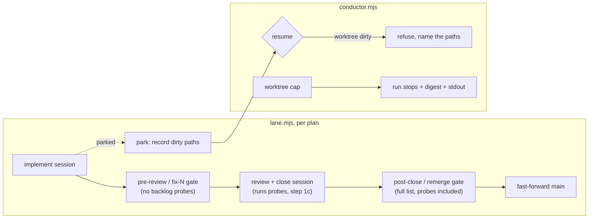

# 0188 — The conductor survives its first run

> **Status:** in-progress
> **Created:** 2026-09-14
> **Owner skill(s):** `dev`, `human`
> **Related ADRs:** [0205](../adrs/0205-an-approved-plan-runs-under-a-conductor-and-every-judgement-it-cannot-make-parks-the-plan.md) (the Outcome's first-live-run entry is this plan's source),
> [0108](../adrs/0108-a-backlog-claim-about-the-repo-carries-an-executable-probe.md),
> [0053](../adrs/0053-plan-lanes-run-in-git-worktrees.md)
> **Related plans:** [0187](done/0187-the-conductor-runs-the-lanes.md) (Phase 6, the pilot, is carried here)
> **Closes:** none

## TL;DR

The conductor's first live run (lane a, 2026-09-14) merged nothing and found four defects in the
conductor itself: `run` crashes on a clean checkout, the pre-review gate parks a plan for a backlog
probe its own close would archive, a parking session cannot put back files its test run rewrote, and
a lane that hits the worktree cap stops without saying so. This plan fixes all four in
`tools/conductor/` and then re-runs the pilot Plan 0187 closed without. What the owner sees first:
`resume 0185` takes that plan past the gate that parked it, into review, and on to `main`.

## Context & problem

ADR-0205's Outcome records the run: 1 h 13 min, 0 merged, 3 parked, $25.18. Two parks (0175, 0180)
were correct `plan_wrong` judgements. They are plan defects routed to `architect` and are not this
plan's work. The other park, and the silent end of the lane, were conductor defects. The owner
confirmed each one against the code:

1. `tools/conductor/conductor.mjs` `cmdRun` writes `state/conductor.pid` before anything creates
   `state/`. `lib/state.mjs`, `lib/inbox.mjs`, `lib/gate.mjs` and `lib/step.mjs` each create their
   own directories. The pid write is the one that does not. `test/cli.test.mjs` creates `p.stateDir`
   in its fixture, so no test ever runs on a missing `state/`.
2. `lib/gate.mjs` `defaultGate()` includes `check-backlog-claims.mjs`, and `lib/lane.mjs` runs the
   same list at `pre-review`, `fix-N`, `post-close` and `remerge`. Plan 0185 renames the parity test
   that backlog 0206's `present:` probe names, and its Risks section says so: *"That is delivery, not
   decay. `dev` reports it and leaves the entry for the close."* The conductor parked it before that
   close could run. A red probe is a judgement ADR-0108 gives to `architect`, and architect's close
   step 1c makes it on every close anyway.
3. `settings.conductor.json` allows no git command that changes the working tree back. The `dev`
   skill's conductor mode says *"Commit finished work first and leave the tree clean"* before a
   park. 0180's session could not, and parked with 8 re-encoded golden PNGs dirty. Nothing on the
   conductor side noticed: `verifyImplement` checks cleanliness only on `phases_done`, a `parked`
   outcome is accepted as it stands, and `resume` would start a new, paid session on that tree.
4. `lib/lane.mjs` `laneLoop` returns at `max_open_worktrees` after `event(ctx, "worktree-cap")`. That
   calls `ctx.events`, which `cmdRun` never sets. So 0182 never started, 0181 was held behind parked
   0185, and neither the digest nor the run's output says so.

## Decision

Fix each defect at the conductor, not in `scripts/` or in the sessions. **A parked lane's worktree
carries the scripts of its base commit**, and the conductor's gate list and park handling run from
the main checkout. So a fix in the conductor reaches 0185's and 0180's existing lanes, while a flag
added to `check-backlog-claims.mjs` would not exist in either.

For defect 2, **the backlog-probe check leaves the gates that run before a review and stays in the
gates that run on a tree a close produced** (`post-close`, `remerge`). The review session runs the
probes itself at close step 1c, and `post-close` still stops a close that left one red. We rejected
two alternatives. Passing the gate when every break is an entry the plan's `Closes:` names parses
another script's output, and it still parks a collateral break the reviewer should judge. A
`--allow-break` flag on the script does not exist in older worktrees, and the script reads its first
bare argument as the root, so an old script would take `0206` as a path.

For defect 3, **allow `git restore`, and keep `git checkout` and `git stash` refused.** `checkout`
can move the branch a lane is on. The stash stack is shared by every worktree (ADR-0053's standing
hazard). The conductor also stops trusting a park to have left the tree clean: it records the dirty
paths and `resume` refuses while any remain. It never reverts them itself, because the dirty files
may be the evidence the owner needs to read.

For defect 4, **the lane still stops at the cap.** The cap is ADR-0205's disk bound and is working as
intended. The stop becomes a fact stored in the run's state, which the digest and the run's output
both report.

## Architecture diagram

## Implementation phases

This plan edits the conductor, so it is **not queued in `queue.json`** and no conductor run happens
until it merges. Run it as a human-started `dev` lane.

### Phase 1 — `run` works on a clean checkout
- **Owner skill:** dev
- **What:** `cmdRun` creates `state/` before writing the pid file. The CLI tests stop creating it for
  the conductor.
- **Files touched:** `tools/conductor/conductor.mjs`, `tools/conductor/test/cli.test.mjs`.
- **Done when:**
  - the `mkdirSync(p.stateDir, …)` line is gone from the `cli.test.mjs` fixture and every CLI test
    still passes;
  - a test runs `run` with no `state/` directory and asserts the pid file was written during the run
    and removed after it;
  - `status`, `resume`, `park` and `abort` each run on a missing `state/` and exit through their own
    logic, not an exception.

### Phase 2 — A backlog probe is judged by the close, not parked before it
- **Owner skill:** dev
- **What:** The gate list depends on the stage. `pre-review` and `fix-N` run without
  `check-backlog-claims.mjs`. `post-close` and `remerge` run the full list.
- **Files touched:** `tools/conductor/lib/gate.mjs`, `tools/conductor/lib/lane.mjs`,
  `tools/conductor/test/gate.test.mjs`, `tools/conductor/test/lane.test.mjs`,
  `tools/conductor/test/lane-scenario.mjs`, `tools/conductor/README.md` (which checks each gate runs,
  one table or list).
- **Done when:**
  - a scenario in which the implement commit breaks a probe of the entry the plan `Closes`, and the
    close session archives that entry, ends **merged**, with no `gate_red` park;
  - a scenario in which the close session leaves that probe red parks `gate_red` at `post-close`, with
    `main` unmoved;
  - a `gate.test.mjs` case asserts that `check-backlog-claims.mjs` is in the `post-close` and
    `remerge` lists and in neither the `pre-review` nor any `fix-N` list. Every other command
    `defaultGate()` lists today stays in all four.

### Phase 3 — A park leaves a lane that can be resumed
- **Owner skill:** dev
- **What:** Sessions may run `git restore`. A park that leaves the worktree dirty records the paths.
  `resume` refuses while the worktree is dirty.
- **Files touched:** `tools/conductor/settings.conductor.json`, `tools/conductor/lib/lane.mjs`,
  `tools/conductor/lib/inbox.mjs`, `tools/conductor/lib/digest.mjs`, `tools/conductor/conductor.mjs`
  (`parkStillTrue`), `.claude/skills/dev/SKILL.md` and `.claude/skills/studio-builder/SKILL.md` (the
  conductor-mode clean-tree sentence names `git restore <path>`), `tools/conductor/README.md` (the
  park-reason table), tests.
- **Done when:**
  - the allowlist contains `Bash(git restore *)` and `PowerShell(git restore *)` and no `checkout` or
    `stash` entry, and a test holds it to that;
  - a scenario whose fake session modifies a tracked file and then parks writes those paths into the
    park record, the inbox entry and the digest's **Needs you** line. The list is capped at a stated
    number of paths plus a count of the rest, so a bless of hundreds of files stays readable;
  - `resume` on that plan refuses with the dirty paths named, and accepts once the worktree is clean;
  - a park on a clean worktree records no path list and prints nothing extra.

### Phase 4 — A lane that stops says why
- **Owner skill:** dev
- **What:** Stopping at the cap is recorded in the run's state. `cmdRun` connects the event hook to
  its output. The digest reports every queued plan the run did not start, with the reason.
- **Files touched:** `tools/conductor/lib/lane.mjs`, `tools/conductor/lib/digest.mjs`,
  `tools/conductor/conductor.mjs`, `tools/conductor/test/lane.test.mjs`,
  `tools/conductor/test/digest.test.mjs`, `tools/conductor/README.md`.
- **Done when:**
  - a scenario with `max_open_worktrees = 1`, where the first plan parks, leaves a run record naming
    the lane, the reason `worktree_cap`, the plan it would have opened and the plans holding
    worktrees;
  - the digest's **Needs you** carries one line for that stop, and a **Not started** list names each
    queued plan the run did not open with its reason: `worktree cap`, or `after NNNN (parked)`. The
    list is left out when empty, and the Phase 4b "regenerated from state and git" property still
    holds;
  - `run` writes the stop to its output as it happens, and a test captures the line.

### Phase 5 — The pilot, resumed
- **Owner skill:** human
- **What:** Plan 0187 Phase 6, on the fixed conductor. The owner runs `resume 0185`, then
  `run --lane a`. 0185 goes through review, close, fast-forward and removal. Then 0181, which waits on
  0185, opens its own worktree in the cap slot 0185's removal freed. 0175 and 0180 stay parked until `architect` amends their
  plans. 0180's lane is cleaned by the owner's own call before anything resumes it.
- **Done when:** 0185 and 0181 are both closed on `main` with annotated tags, their worktrees and
  branches removed, and no owner action between `run` and the second merge. Or the run parks, and the
  park names a plan judgement rather than a conductor defect. The owner has read the digest and both
  `## Close review` sections, and decides the push. A fresh `architect` session then records the wall
  time, spend and every park in ADR-0205's Outcome, says whether Plan 0187 Phase 6 is discharged, and
  reconsiders lane b and `max_open_worktrees` together.

## Risks & open questions

- **Dropping the probes before review moves spend earlier, not later.** A plan whose only red is a
  collateral probe break now pays for a review session before it parks. That session can repair the
  entry at close, which the old gate could never let it do, so the trade is intended. It is still a
  cost the old gate did not charge.
- **`git restore --source=<rev>` can rewrite a file to any revision.** Inside a lane that is ordinary
  editing. It cannot move `HEAD` or reach another worktree, and the conductor's commit and log checks
  still apply to whatever the session commits.
- **Plan 0187's three open minors are still open.** The version cross-check in `close.mjs`, the
  PowerShell here-string and `cd studio` allowlist questions, and the four-runs-of-the-suite count
  per close. Phase 5 is the first run that exercises any of them. Its report decides whether they
  become a plan.
- **Open: the seven-day usage reading.** The sessions reported the owner's seven-day usage at
  0.84-0.85, and the digest shows only dollars. Not in scope. Phase 5's report says whether it
  mattered.

## What this plan does NOT do

- It does not amend Plans 0175 or 0180. Their parks are plan judgements, and they go to `architect`.
- It does not change `scripts/check-backlog-claims.mjs`, ADR-0108's gate, or the pre-push hook. Only
  the conductor's choice of when to run it changes.
- It does not revert a dirty lane automatically, raise `max_open_worktrees`, or enable lane b.
- It does not queue itself or run under the conductor.

## Implementation log

> Written by `dev` — one row per phase as that phase's commit lands, and the close block after the
> last one. **The phases above are the contract; everything here is what happened.**

**Lane:** `main` directly

| phase | owner | state | commit |
|---|---|---|---|
| 1 — `run` works on a clean checkout | dev | done | `a676f13` |
| 2 — A backlog probe is judged by the close, not parked before it | dev | done | `24300e7` |
| 3 — A park leaves a lane that can be resumed | dev | done | `856d5cb` |
| 4 — A lane that stops says why | dev | committed with this row | |
| 5 — The pilot, resumed | human | not started | |

### Notes

- Phase 2: the two probe scenarios stand the backlog probe in with a marker file (`PROBE_RED`) that a
  gate step named `check-backlog-claims.mjs` reads; the fixture plan's `Closes:` still reads `none`.
- Phase 3: the owner's `park NNNN` records dirty paths too (`cmdPark`, beyond `parkStillTrue`). The
  allowlist test is a new file, `test/settings.test.mjs`. The commit also repairs two escapes in
  Phase 2's test code (a literal newline in `lane-scenario.mjs`, an unescaped `.` in a regex).
- Phase 4: **Not started** carries reasons beyond the two named: `--once`, `stopped`, and
  `after NNNN (<status>)` for a dependency that is not parked. `run` prints every lane event, not only
  the cap stop. The output test is in `test/cli.test.mjs`, which the phase's file list does not name.

### Close triggers
