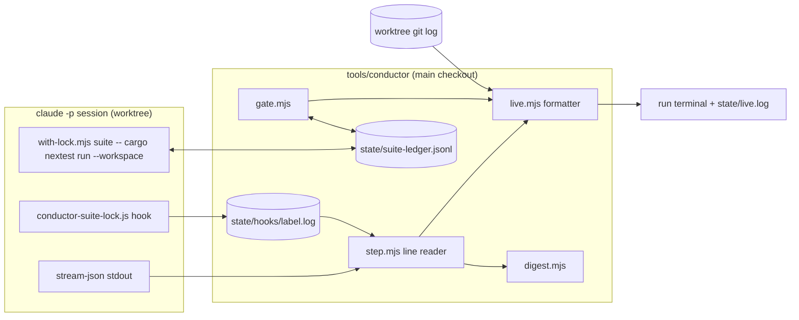

# 0189 — The conductor can be watched, and stops re-proving a green tree

> **Status:** in-progress
> **Created:** 2026-09-15
> **Owner skill(s):** dev, human
> **Related ADRs:** [0205](../adrs/0205-an-approved-plan-runs-under-a-conductor-and-every-judgement-it-cannot-make-parks-the-plan.md),
> [0207](../adrs/0207-a-suite-run-the-conductor-observed-green-is-not-run-again-on-the-same-tree.md) (proposed),
> [0208](../adrs/0208-a-patch-cli-update-runs-with-a-warning-and-every-session-proves-the-hooks-ran.md) (proposed),
> [0209](../adrs/0209-a-conductor-close-repairs-the-prose-and-comments-its-findings-name.md) (proposed)
> **Closes:** design-backlog 0222, 0223, 0224, 0225, 0226
> **Built by:** human-started `dev` sessions, not the conductor. A conductor editing its own code
> while it runs is circular, and 0187 and 0188 were built the same way.

> **Amended 2026-09-15, before any phase started:** backlog 0226 is folded into Phase 1. A lane is
> open when its worktree exists on disk, and one predicate answers that for the cap, the standing-park
> line and the digest's **Still parked** line. Phase 1's standing-park line and Phase 2's **Still
> parked** line each name a worktree. Without the predicate, both would report one the owner already
> removed, and that is exactly the false report 0226 describes.

## TL;DR

The owner watches a conductor run in the one terminal that started it. Each line is a milestone: a
step starting and ending with its time and spend, a commit landing, a phase marked done, a test or
gate command finishing with its counts, a lock wait, a usage-window reading, a denied command. The
digest reports the usage windows, time that excludes parks, every plan still parked, and only the
findings still open. A full workspace suite is no longer run twice on the same tree: a plan with no
fix round and an unmoved `main` runs it twice instead of up to five times. A patch CLI update warns
instead of blocking, and every session proves the project hooks ran. A close repairs the comment and
prose findings it would otherwise merge open.

## Context & problem

The 2026-09-15 pilot (ADR-0205's third Outcome entry) was the first run to merge plans. Three merged,
nothing parked, in 3 h 38 min. The owner's verdict afterwards: improvements are needed, on five
fronts.

- **Nothing between the coarse events can be seen.** `run` prints a line when a lane opens, a step
  starts, a plan parks, closes or fast-forwards (`conductor.mjs` `eventLine`). An implement session
  runs 20 to 80 min with no output. So does a 12 min gate. The data exists: `step.mjs` already gets
  every stream-json chunk and appends it to the transcript, and the worktree's `git log` shows each
  commit.
- **The gate re-proves green trees** (backlog 0223, ADR-0207's Context). Up to five full suites per
  plan at ~10.7 min each, 72 min of the pilot's 218 in the conductor's gate alone. 14 of the 15
  reported suite-lock wait minutes were `cargo nextest list` calls, which run no tests, blocked behind
  full runs: the hook pattern at `.claude/hooks/conductor-suite-lock.js:18` matches any `nextest`
  subcommand.
- **The digest answers the wrong questions.**
  - It reports dollars, while the owner's constraint is the 5-hour and 7-day usage windows. Those are
    recorded and never shown (backlog 0222).
  - 0185's line says "16 h 34 min" because `span(rec.started, rec.ended)` includes a night spent
    parked.
  - The newest run's **Needs you** drops every park from an earlier run, so 0175 and 0180, parked
    since 2026-09-14 and holding two worktrees until the owner removed them by hand on 2026-09-15,
    have no line in the latest section.
  - It gives open findings only as "merged with N minors - see Closed".
- **A CLI update blocks the queue** (backlog 0224; owner's call: warn on a patch, refuse otherwise,
  per ADR-0208).
- **Findings nobody fixes** (backlog 0225; owner's call: the close repairs the prose and comment
  ones, per ADR-0209).
- **The worktree cap counts lanes that no longer exist** (backlog 0226). `openWorktreeCount` reads
  the record's `worktree && !laneRemoved`, while `runPlan` asks `existsSync`. The owner removed both
  parked lanes by hand, as ADR-0053 says to. The cap still read 2 of 3, and a hand edit to
  `state/conductor.json` was the only repair.

## Decision

**One plan, `dev`-owned throughout, ending in a `human` run.** It covers:

- a richer `run` output, fed from the stream `step.mjs` already reads, plus a polled `git log` in
  the worktree;
- a digest that reports usage, active time, standing parks and open findings;
- `nextest list` outside the suite lock;
- ADR-0207's suite ledger, and the conductor-mode reordering that makes identical trees happen;
- ADR-0208's patch warning and hook tripwire;
- ADR-0209's close repairs;
- the pilot's four leftover prose findings, repaired under the new rule;
- one definition of an open lane, read from the filesystem (backlog 0226).

On 0226 we rejected two of its shapes. **Reconciling `laneRemoved` at preflight** leaves the record
wrong between runs, so `status` and a regenerated digest would still name a removed worktree. It
also makes preflight a second writer of runtime state. **A `conductor.mjs remove NNNN` command** is
worth having, but ADR-0053 tells the owner to use `git worktree remove`, and the cap must still be
right after that ordinary operation. The filesystem test is the cap's own purpose written down:
ADR-0205 calls the cap the disk bound, and a removed worktree holds no disk. No ADR, because nothing
else is traded.

Rejected during the interview:

- a separate `watch` command that attaches to a running conductor: `run`'s own terminal is enough,
  and it avoids a second reader of state;
- a periodic fix-up plan for leftovers (ADR-0209 Alternative A);
- skipping the suite on docs-only changes: Rust tests read `docs/` (ADR-0207 Alternative A);
- splitting this into two or three plans.

## Architecture diagram



## Implementation phases

### Phase 1 — The run can be watched
- **Owner skill:** dev
- **What:** `run` prints one line per milestone as it happens, and appends the same lines to
  `tools/conductor/state/live.log` under a run header.
  - **Step boundaries:** start (the label, phase range and owner skill) and end (outcome kind or
    park reason, duration, `$` spend, turns).
  - **Commits:** each commit landing in the worktree during a session, as short sha and subject.
    The worktree's `git log <step-start>..HEAD` is polled while a session runs.
  - **Phases:** each phase whose `## Implementation log` row flips to done, read from the plan file
    in the worktree after a new commit.
  - **Tests and suite runs inside a session:** a `cargo nextest` / `cargo test` / `cargo clippy` /
    `cargo doc` call starting and finishing. The end line shows nextest's pass, fail and skip counts
    or the first failing test names, the lock wait and the run time. A run started in the background
    reports its end when its task notification arrives.
  - **Gate commands:** each cargo command's start and end, with duration and result. The node, studio
    and sd-filter checks print one aggregate line, or one line per failure.
  - **Usage:** the 5-hour and 7-day utilization and reset time, printed whenever either reading or
    the status changes.
  - **Denials:** a `system/permission_denied` event as a line naming the tool and the head of the
    command.
  - **Standing parks:** at run start, one line per plan still parked, with its age and the worktree
    it holds. For a plan whose worktree is gone, the line names the branch that `resume` reopens it
    from instead.
  - **What an open lane is (backlog 0226):** one exported predicate in `lib/lane.mjs`, true when the
    record names a worktree **and** that directory exists. `openWorktreeCount`, the cap stop's list
    of holding plans, `runPlan`'s reopen test and the standing-park line all call it. `laneRemoved`
    stays in the record as history, and nothing that counts lanes reads it.
- **Files touched:** `tools/conductor/lib/live.mjs` (new: stream-event and gate-event to line,
  pure), `lib/step.mjs` (split stdout chunks into lines and hand each parsed event to an
  `onStreamEvent` callback; the transcript append is unchanged), `lib/lane.mjs` (commit and phase
  polling during a session, standing parks at start, the open-lane predicate), `lib/gate.mjs`
  (per-command start and end callbacks, per-command duration kept on `rec.gates[].commands`),
  `with-lock.mjs` (prints its wait and hold on stderr at exit), `conductor.mjs` (wire it, and append
  to `live.log`), `test/live.test.mjs` (new), `test/lane.test.mjs` (the cap cases),
  `test/fake-claude.mjs` (emit tool-use, tool-result, task-notification, rate-limit and
  permission-denied events), `README.md` (`## What to read afterwards`, what the run terminal shows,
  and one sentence under the `max_open_worktrees` paragraph saying the cap counts worktrees on disk).
- **Done when:**
  - A `lane-scenario` run against the fake CLI prints, in order, a start line, a commit line naming
    the sha the fake committed, a phase-done line, a tests end line carrying the fake's nextest
    counts, a usage line, a denial line and an end line carrying the fake's spend. `live.log` holds
    the same lines.
  - A commit made by the fake mid-session is printed before the session ends. The point is that
    commits show while the session runs, not afterwards, and this is what proves it.
  - The formatter reads the usage reading in both recorded shapes: 2.1.272's
    `unifiedWindows.{five_hour,seven_day}` and 2.1.270's top-level `rateLimitType` + `utilization`.
  - A malformed or unknown stream line prints nothing and does not throw.
  - Every line is ASCII. The run terminal is a Windows console.
  - **The cap counts what is on disk.** A state with three parked plans, `laneRemoved: false` on all
    three and `max_open_worktrees` 3, whose worktree directories were deleted by the test, opens the
    next queued plan. The same state with the three directories present stops at the cap and names
    all three. The existing cap tests build real directories for the lanes they count, instead of
    relying on the record.
  - A standing-park line for a plan whose worktree is gone names its branch and no worktree path.
  - `grep -n "laneRemoved" tools/conductor/lib/lane.mjs` matches only writes, never a filter.

### Phase 2 — The digest reports what the operator spends, holds and still owes
- **Owner skill:** dev
- **What:** The digest changes in five places.
  - **Totals** carries the usage windows at run start and run end: 5-hour and 7-day utilization with
    reset times, taken from the first and last rate-limit reading of the run, in either shape. It
    also carries gate minutes, split into full-suite minutes and everything else, with the count of
    suite runs skipped (zero until Phase 4).
  - Each closed plan's line reports **active time** (the sum of its steps and gates in this run)
    beside **wall time within this run**, never a span across a park.
  - The newest run's **Needs you** gains **Still parked from an earlier run**: each current park
    whose `at` predates the run, with its age, reason, worktree and resume command. The worktree is
    named through Phase 1's open-lane predicate, so a removed one reads as its branch.
  - Every park from a session carries that session's last usage reading.
  - "merged with N minors" becomes a list of the findings still open, each with its `file:line`. It
    counts every minor and nit until Phase 5 adds `fixed_in`.
- **Files touched:** `lib/digest.mjs`, `lib/state.mjs` (keep the first and last rate-limit reading
  per step), `test/digest.test.mjs`.
- **Done when:**
  - Regenerating the digest from a state fixture shaped like the pilot, with a plan started in one
    run, parked overnight and merged in the next, reports that plan's active time within a minute of
    the sum of its step and gate durations. It does not report the span from its first start.
  - The same fixture's newest run lists the two plans parked in the earlier run under **Still
    parked**.
  - Regenerating from the same state twice yields the same bytes. That is the digest's existing
    property, and it is kept.

### Phase 3 — Listing tests takes no lock
- **Owner skill:** dev
- **What:** In conductor mode a bare `cargo nextest list` is allowed by the suite-lock hook. The
  wrapper runs `suite -- cargo nextest list ...` without taking the lock and without writing a lock
  log entry. `nextest run` and `cargo test` are unchanged.
- **Files touched:** `.claude/hooks/conductor-suite-lock.js`, `tools/conductor/with-lock.mjs`,
  `tools/conductor/test/hooks.test.mjs`, `tools/conductor/test/with-lock.test.mjs`.
- **Done when:**
  - `cargo nextest list -p rlx-core` passes the hook with `RLX_CONDUCTOR=1`, and
    `cargo nextest run -p rlx-core` is still denied.
  - `cargo nextest list --workspace && cargo nextest run` is still denied on its second command.
  - A wrapped `list` whose lock is held by another process starts at once.

### Phase 4 — A green suite is not run again on the same tree
- **Owner skill:** dev
- **What:** ADR-0207's ledger.
  - `lib/ledger.mjs` records and looks up runs of exactly `cargo nextest run --workspace`, keyed by
    `HEAD^{tree}`. A run is recorded only on a worktree clean at start and end.
  - The gate consults it before its `cargo nextest` step and records after.
  - `with-lock.mjs` does the same when `RLX_SUITE_LEDGER` is set, which `lane.mjs` sets for every
    session. A skip prints one notice naming the record: tree, writer, time, `Summary` line.
  - A skip shows in the live log (Phase 1) and in the digest's skipped count (Phase 2).
- **Files touched:** `tools/conductor/lib/ledger.mjs` (new), `lib/gate.mjs`, `lib/lane.mjs`,
  `with-lock.mjs`, `test/ledger.test.mjs` (new), `test/gate.test.mjs`, `test/with-lock.test.mjs`,
  `README.md` (`## The gate`).
- **Done when:**
  - Two gate runs on one clean tree run the nextest command once. The second records a skip that
    names the first.
  - A one-byte change to any tracked file, docs included, makes the next run execute.
  - A run that started on a dirty worktree, or ended on one, is not recorded.
  - A red run is recorded and never skipped on.
  - A wrapped `cargo nextest run --workspace --no-fail-fast`, or any other argument vector, neither
    skips nor records.
  - Without `RLX_SUITE_LEDGER` the wrapper behaves byte-for-byte as before. Human-started sessions do
    not change.

### Phase 5 — The conductor-mode close orders its work so the gate runs once, and repairs prose findings
- **Owner skill:** dev
- **What:** The skill and prompt text for ADR-0207's ordering and ADR-0209's repairs, and the outcome
  field that carries them.
  - **`dev` conductor mode:** the last implementer run no longer runs the full suite. The close
    block's `Full suite:` bullet reads *owed to the conductor's pre-review gate (ADR-0207)*.
  - **`architect` conductor mode:** runs Mode 4's suite through the wrapper and accepts a printed
    ledger record as lens 1's full-suite evidence. The close runs in this order:
    1. repair every ADR-0209 finding, committed;
    2. `git merge main`;
    3. bookkeeping, version bump and studio sync, committed;
    4. the whole gate on the tip;
    5. the annotated tag;
    6. `check-release-tag.mjs`.
  - A red gate at step 4 parks `check_red`.
  - A finding in `closed.verdict.findings` may carry `fixed_in` (a sha).
  - `verifyClose` checks that each `fixed_in` commit is on the branch and changes that finding's
    file. The digest's open list excludes them.
  - The `.claude/skills/` fact-versus-rule line from ADR-0209 is written into the `architect`
    skill's conductor mode.
- **Files touched:** `.claude/skills/dev/SKILL.md` (Conductor mode), `.claude/skills/architect/SKILL.md`
  (Conductor mode), `tools/conductor/prompts/review.md`, `tools/conductor/prompts/implement.md`,
  `lib/outcome.mjs`, `lib/close.mjs`, `lib/digest.mjs`, `test/lane.test.mjs`, `test/plan.test.mjs`
  or a new `test/outcome.test.mjs`.
- **Done when:**
  - A closed outcome with a `fixed_in` naming a commit that does not touch that finding's file parks
    as `disagreement`.
  - A `fixed_in` on a sha not on the branch parks the same way.
  - A lane scenario whose fake review closes with one `fixed_in` minor and one open minor shows
    exactly the open one in **Needs you**.
  - In a lane scenario on the fake CLI with no fix round and an unmoved `main`, where the fake
    sessions call the wrapper where the skills now say to, the ledger shows **two** executed full
    suites (`pre-review` and the close's gate) and **two** skips (the review's, and `post-close`'s). The count is the property the
    reordering exists for.

### Phase 6 — A patch CLI update warns, and every session proves its hooks ran
- **Owner skill:** dev
- **What:** ADR-0208.
  - `preflight` returns a warning, not an error, for a version sharing major and minor with a
    `VERIFIED_CLI` entry at a higher patch. The warning is printed, recorded as `run.cli`, and shown
    in **Needs you** until the version is listed.
  - `conductor-suite-lock.js` appends one line per call to `RLX_HOOK_LOG` when `RLX_CONDUCTOR=1` and
    the variable is set. `lane.mjs` sets it per step.
  - After a session ends, before its outcome is verified, the conductor checks two things. The
    transcript must hold at least one `Bash` or `PowerShell` tool use with a non-empty hook log. The
    `system/init` event's `skills` must contain the invoked skill. Either failure parks
    `cli_contract`.
- **Files touched:** `tools/conductor/conductor.mjs`, `lib/step.mjs` or `lib/lane.mjs`,
  `lib/outcome.mjs` (the park reason), `lib/digest.mjs`, `.claude/hooks/conductor-suite-lock.js`,
  `test/cli.test.mjs`, `test/hooks.test.mjs`, `test/step.test.mjs`, `README.md` (`## When the CLI
  updates`).
- **Done when:**
  - With `VERIFIED_CLI = ["2.1.272"]`, preflight passes `2.1.280` with one warning, refuses `2.2.0`
    and `3.1.272`, and passes `2.1.272` silently.
  - The test builds its expected messages from the constant, never from literal versions: the shape
    `3381990` fixed.
  - A fake session that makes a shell call and writes no hook log parks `cli_contract`.
  - A fake session whose init lists no invoked skill parks the same way.
  - A fake session that makes no shell call is not parked for the hook log.

### Phase 7 — The pilot's leftovers, under the new rule
- **Owner skill:** dev
- **What:** Repair the four prose findings the 2026-09-15 closes left open, and remove the README
  table that restates `defaultGate()`, which is Plan 0188's open minor.
  - `core/src/render/scenes/particles/mod.rs:1706`: the spin comment still says `advance` runs before
    bindings are routed.
  - `core/src/render/tests.rs:2360`: the assertion message says "first frame" of the second frame.
  - `core/src/render/scenes/fragment_field.rs:218`: "Alpha 1.0:" over a line that returns `occlude`.
  - `.claude/skills/preset-author/references/render-loop.md:170`: the report sample lacks the count
    column Plan 0182 shipped.
  - `tools/conductor/README.md` `## The gate`: replace the per-command table with a pointer to
    `gateForStage` and one paragraph on stages and the ledger.
- **Files touched:** the five named.
- **Done when:**
  - Each named line states what its code does today. Line numbers may have moved; the finding is the
    text.
  - The render-loop sample matches a `shot --presets presets --report family=star` header as it
    prints now.
  - The conductor README no longer lists gate commands by name.
  - `cargo doc` with `-D warnings` stays green.

### Phase 8 — A run, watched
- **Owner skill:** human
- **What:** The owner queues at least one approved plan with no `human` phase and runs the conductor
  from one terminal with the new code.
- **Done when:**
  - The owner has watched the run's live output, and says in the plan's `### Notes` whether it told
    them what was happening without opening a transcript.
  - The plan's log records, from `state/suite-ledger.jsonl` and `state/locks.jsonl`, how many full
    suites each merged plan executed and how many it skipped, and the digest's gate minutes.
  - For a plan with no fix round whose `main` did not move, executed full suites are at most two. If
    not, the log names which run was not skipped and why.

## Data shapes

```jsonc
// illustrative: one line of state/suite-ledger.jsonl
{"tree": "9c1e4a0...", "cmd": "cargo nextest run --workspace", "exit": 0,
 "summary": "1940 tests run: 1940 passed, 6 skipped", "by": "gate 0182-pre-review",
 "at": "2026-09-15T12:03:11Z", "ms": 652000}
```

```text
illustrative: the run terminal
10:02 0182 implement-01 start  phases 1-3 (dev)
10:09 0182   commit 3f2a1bc feat(shot): the report hears the musical clock in a count column
10:09 0182   phase  1 done
10:14 0182   tests  nextest -p standalone: 212 passed, 0 failed; lock wait 2m10s, ran 3m02s
10:15 0182   denied PowerShell: cd studio; npx vitest run ...
10:31 0182   usage  5h 0.27 (resets 14:30); 7d 0.02 (resets 09-22 16:00)
10:40 0182 implement-01 end    phases_done, 38 min, $5.83, 64 turns
10:40 0182 gate pre-review     node checks ok (15, 9s)
10:43 0182   gate   cargo clippy ok 2m41s
10:43 0182   gate   cargo nextest running
10:54 0182   gate   cargo nextest ok 10m51s (1940 passed, 6 skipped)
```

```jsonc
// illustrative: a finding a close repaired (ADR-0209)
{"severity": "minor", "file": "core/src/render/tests.rs", "line": 2360,
 "what": "assertion message names the first frame for the second", "fixed_in": "a1b2c3d"}
```

## Risks & open questions

- **The stream is the CLI's, not ours.** The Phase 1 reader parses event kinds observed on 2.1.272:
  `tool_use` in `assistant`, `tool_result` in `user`, `system/task_notification`,
  `system/permission_denied`, `rate_limit_event`. A renamed event only drops a line, since the
  formatter ignores what it does not know. That is the right failure for a display, and it is also
  why the display cannot be the evidence for anything.
- **No running dollar figure inside a session.** On 2.1.272 the per-turn `assistant` events carry
  token usage but no cost, and `total_cost_usd` arrives only on the `result` event. Spend is printed
  at step end. An estimate from tokens would need a price table this repository does not keep.
  Unverified whether a later CLI adds a running figure.
- **Phase 5's count needs the fake sessions to follow the new skill text.** The done-when proves the
  conductor's arithmetic given that behaviour. Only Phase 8 shows that real sessions follow it.
- **ADR-0208's warning covers nearly every CLI update**, because the CLI numbers almost everything as a
  patch. The owner chose it knowing this, and the ADR's Negative says what the tripwire does not see.
- **The ledger's key leaves out the toolchain.** A `rustup update` between the review and
  `post-close` on one tree would skip a run on a changed compiler. Rare on an unattended run, and
  written in ADR-0207 rather than guarded.
- **Plan 0187's other two open minors stay open**: the version cross-check in `close.mjs`, and the
  PowerShell here-string and `cd studio` allowlist gaps. Phase 1's denial line makes the second
  visible on every run, which is the evidence it lacked.

## What this plan does NOT do

- **Lane b stays off.** ADR-0205's Outcome reconsiders it after 0223. Phase 8's figures are that
  input, and the decision is a later `architect` session's.
- **No `probe.mjs --compare`** (ADR-0208 Alternative A).
- **Nothing about `-P fast` inside `dev` phases.** Backlog 0221 owns the run-alone override's cost,
  and it is not a conductor defect.
- **The pilot's two code-shaped findings stay open**: `standalone/src/shot/report.rs:110`
  (`CAPTURE_DT` mirrors a private constant) and `core/src/render/scenes/cellular/tests.rs:71` (the
  test driver runs the retired order). ADR-0209 gives them no route. If the owner wants one, each
  becomes a backlog entry.
- **No resolution for 0175 and 0180.** Both parked `plan_wrong` on real defects in their plans.
  Phase 2 makes them visible. Their plans were amended on their lane branches on 2026-09-15 in a
  separate `architect` session, and resuming them is the owner's.
- **No `conductor.mjs remove` command** (backlog 0226's third shape). If the owner wants one, it is a
  new entry.
- **No `watch` command and no second terminal.**

## Implementation log

**Lane:** `main` directly

| phase | owner | state | commit |
|---|---|---|---|
| 1 — The run can be watched | dev | done | `f7ee284` |
| 2 — The digest reports what the operator spends, holds and still owes | dev | done | `57942b5` |
| 3 — Listing tests takes no lock | dev | done | `570400f` |
| 4 — A green suite is not run again on the same tree | dev | done | `cfb1f1d` |
| 5 — The conductor-mode close orders its work so the gate runs once, and repairs prose findings | dev | done | `be1ca2b` |
| 6 — A patch CLI update warns, and every session proves its hooks ran | dev | done | `9ef5cdb` |
| 7 — The pilot's leftovers, under the new rule | dev | done | `e8d33df` |
| 8 — A run, watched | human | done | committed with this row |

### Notes

- Phase 1 also touches `tools/conductor/test/lane-scenario.mjs`, which is not in its file list. The
  fake session needs it to emit a `stream`, and `awaitLive` holds the session open until its commit
  line is printed.
- Phase 1 removes the `conductor: NNNN step LABEL started` event line. The live start line replaces
  it.
- Phase 2 also edits `tools/conductor/README.md` (`## What to read afterwards`, the digest bullets),
  which is not in its file list, so the operator guide describes the digest it now renders.
- Phase 2 renders **Still parked from an earlier run** as a `####` heading under **Needs you**.
- Phase 3 also edits one clause of `tools/conductor/README.md` (`## How it stays safe`), which is not
  in its file list. The wrapper lets a listing through under any lock name, not only `suite`.
- Phase 4 marks the gate's suite step with `ledger: true` rather than matching its argument vector,
  and a test holds the one marked step to exactly `cargo nextest run --workspace`. The wrapper's ledger
  path is exercised in-process through an exported `runWrapped(argv, { env, cwd, run })`, where `run`
  stands in for spawning cargo. Phase 4 also touches `lib/live.mjs` (a session's skip notice prints
  as a `skipped` line) and `lib/digest.mjs` (a step marked `suite` counts as the full suite), neither
  in its file list. A wrapped full suite skips without taking the lock.
- Phase 5 makes a skip a line in the suite ledger: `{tree, cmd, skip: true, by, at, green}`, written by
  the gate and the wrapper, and never read by a lookup. Phase 4 had kept a skip only in the gate's
  command record, which could not give the done-when's count of skips "in the ledger". This touches
  `lib/ledger.mjs`, `lib/gate.mjs`, `with-lock.mjs` and the Phase 4 tests, none in Phase 5's file list.
  The digest's skipped count now reads the ledger, so it counts a session's skips as well as the gate's.
- Phase 5 also edits `.claude/skills/studio-builder/SKILL.md` (conductor mode, last implementer run),
  which is not in its file list. `prompts/implement.md` is shared by both implementer lanes, so the
  "no full suite at the last run" rule is written into both skills, not only `dev`'s.
- Phase 5 extends `test/lane-scenario.mjs` (`closeRepair`, `ledgerFlow`). Its fake sessions call
  `runWrapped` in-process, with cargo stood in for by a green `Summary`.
- Phase 6 also edits `tools/conductor/test/queue.test.mjs`, which is not in its file list. Its
  refusal case used `2.1.999`, which is now a warning, so it now derives the next minor from
  `VERIFIED_CLI`. The contract check lives in `lib/step.mjs` (`contractProblem`), and
  `readResult` in `lib/outcome.mjs` reads `init` and `shellCalls` from the transcript. A patch below
  a listed version (`2.1.271` against `2.1.272` alone) is refused. The CLI warning shows in **Needs
  you** of the run that recorded it, not only the newest run's.
- Phase 7's done-when command `shot --presets presets --report family=star` is refused
  (`unknown family star`). The sample was taken from `family=star_pattern`. The header now carries a
  `count` column, and `geom` prints as its own table, so the sample drops the `geom` column and its
  prose says so. The conductor README still shows `cargo nextest` in its run-terminal example
  lines and names cargo commands where it describes the session reader and the hook. None of those
  lists what the gate runs. Phase 7 also adds the `fixed_in` check to README `## How it stays safe`.
- Followup noticed, not acted on: `CLAUDE.md`'s `tools/conductor/` entry still says the conductor
  "refuses a CLI version spike/README.md did not verify". Under ADR-0208 a patch above a verified
  version runs with a warning.
- Followup noticed, not acted on: `.claude/skills/dev/references/close-ceremony-prompt.md`
  (`### In conductor mode, the outcome block replaces the pointer`) still says the last conductor
  implementer run commits its close block "full suite under the suite lock included". Phase 5
  changed that rule in both implementer skills and in `prompts/implement.md`, but not in this guide.
- Followup noticed, not acted on: ADR-0207, ADR-0208 and ADR-0209 still read `Status: proposed`.
- **Phase 8, the runs.** Four `run`s on 2026-09-15 with the Phase 1-7 code, lane a, from one
  terminal: 16:40 (0175 Phase 3 and its review; its record keeps `ended: null` because the owner
  restarted for the watched run), 18:05 (0177 Phase 8), 21:10 (0175's merge gate, 0177 Phase 9) and
  21:43 (both merges). Merged: 0175 at `18d9ea3` (`v0.124.2`) and 0177 at `da663b6` (`v0.125.0`).
  0185, 0181 and 0182 had merged in the 09:32 run. 0180 stayed parked `plan_wrong` throughout.
- **Phase 8, watched (the owner's verdict).** The live output told the owner what was happening
  without opening a transcript, mostly. The one ask is **how long each phase and each test run
  took**. A `tests` line prints `ran 5m41s`, but `phase N done` carries no elapsed time, so a
  28-minute phase reads the same as a 2-minute one (backlog 0233). Every park was diagnosed from
  `live.log`, the digest and `state/gates/`, except 0175's `no_outcome`, whose cause was only in the
  transcript's last lines.
- **Phase 8, full suites per merged plan** (`state/suite-ledger.jsonl`; `locks.jsonl` agrees):

  | plan | executed | skipped | runs, minutes |
  |---|---|---|---|
  | 0175 | 4, plus 1 by hand outside the ledger | 1 | pre-review 11.2, post-close 10.8 (red), post-close 11.4, remerge 12.3; hand 12.7 |
  | 0177 | 2 | 2 | pre-review 10.9, the review's close tip 13.6; skipped by the review at pre-review's tree and by `post-close` |

  Digest gate minutes: the 21:43 run 39 (full suite 35 over 3 runs, 2 skipped), the 21:10 run 12, the
  18:05 run under 1, the 16:40 run 12. The review's own 13.6-minute run is a session's, not a gate's,
  so no digest line counts it.
- **Phase 8, 0177 met the bound; 0175 did not, and each extra run has a cause.** 0175 took no fix
  round, but its `main` moved, so the bound does not strictly apply. The causes are the finding:
  1. `gate 0175-pre-review` on `467b142`. Expected.
  2. The review's lens-1 run was skipped from the ledger, as designed. It then ran the close tip's
     suite in the background and ended its turn. The headless process exited, the run died, and the
     plan parked `no_outcome` with the close committed and no tag (backlog 0228).
  3. The owner's hand gate on `05d1639` went through `with-lock` without `RLX_SUITE_LEDGER`, so it
     left no record and the next gate repeated it (backlog 0232).
  4. `gate 0175-post-close` on `05d1639` went red on
     `control_loopback a_preset_datagram_selects_by_name` (backlog 0219), and parked `gate_red`.
  5. The same gate after `resume`, green.
  6. `gate 0175-remerge` on `499f9cb`: `main` had moved by `08c37a7`, a conductor fix committed
     between the park and the resume.

  On 2026-09-15 0175 spent 24 minutes in sessions (Phase 3 15.7, review 8.0) and 58 in full suites.
  0177 spent 64 minutes in sessions that finished (Phase 8 28.3, Phase 9 9.2, review 26.0), plus a
  48.6-minute session the owner's restart interrupted, and 24.5 in full suites (backlog 0227).
- **Phase 8, 0175's close was finished by hand.** `resume` would have re-run the review on a plan
  already under `done/` on the branch (backlog 0229). The owner gated the tip, wrote `v0.124.2`, ran
  `check-release-tag.mjs`, and set `closed` and the round-1 verdict in `state/conductor.json`, so the
  resume went straight to the fast-forward.
- **Phase 8, 0177's two parks were not its code.** `check_red` at Phase 8: its done-when greps
  `.claude/skills/`, and the headless session's edits there were refused (backlog 0230). The owner
  committed the citations as `f0cf263`. `gate_red` after Phase 9: `studio typecheck exited -4058` in
  0 s. The gate's `.cmd` shell retry was settled by the failed spawn's own `close`, a path no earlier
  lane reached because none had `studio/node_modules`. Fixed on `main` as `08c37a7`, with a Windows
  test in `gate.test.mjs` and in `with-lock.test.mjs`. 0177's review backgrounded its close-tip suite
  too (its `Monitor` was refused) but held its turn until the run ended, and closed.
- **Phase 8, where a suite's minutes go** (`0175-remerge-18-cargo_nextest.log`: 737 s wall, 1947
  tests, 7378 test-seconds over 73 binaries): `reactivity` 1566 s, `animation` 1291 s and `sanity`
  1099 s, the three per-preset suites and 54 % together; core unit tests 1065 s; `distinctness`
  299 s; `reaction_diffusion_contract` alone 216 s.

### Close triggers

- `presets/` touched: no.
- `Closes:` design-backlog 0222, 0223, 0224, 0225, 0226. All five are already under
  `docs/design-backlog-archive.md`, marked promoted to this plan.
- Shipped: a feature, in `tools/conductor/` and `.claude/hooks/conductor-suite-lock.js`. Rust changes
  are comment and assertion-message text only, in `core/src/render/scenes/particles/mod.rs`,
  `core/src/render/tests.rs` and `core/src/render/scenes/fragment_field.rs`.
- Operator docs moved: `tools/conductor/README.md`; `.claude/skills/architect/SKILL.md`,
  `.claude/skills/dev/SKILL.md` and `.claude/skills/studio-builder/SKILL.md` (their conductor-mode
  sections); `.claude/skills/preset-author/references/render-loop.md`; `tools/conductor/prompts/implement.md`
  and `tools/conductor/prompts/review.md`. Nothing under `docs/` except this plan.
- `node scripts/check-backlog-claims.mjs`: exit 0.
- Full suite: `cargo nextest run --workspace` exited 0, with `1940 tests run: 1940 passed (3 slow),
  6 skipped`, on `e8d33df`. The conductor's own suite, `node --test "tools/conductor/test/*.test.mjs"`,
  passes 177 of 177.
- `human` phases remaining: none. Phase 8 ran on 2026-09-15; see its notes above.
