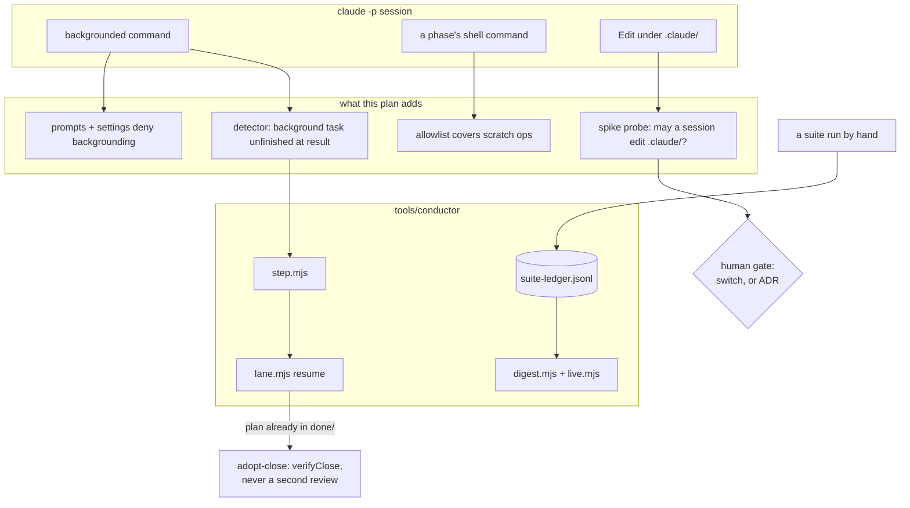

# 0190 — The conductor survives a run nobody is watching

> **Status:** in-progress
> **Created:** 2026-09-16
> **Owner skill(s):** dev, human
> **Related ADRs:** [0205](../adrs/0205-an-approved-plan-runs-under-a-conductor-and-every-judgement-it-cannot-make-parks-the-plan.md),
> [0207](../adrs/0207-a-suite-run-the-conductor-observed-green-is-not-run-again-on-the-same-tree.md),
> [0208](../adrs/0208-a-patch-cli-update-runs-with-a-warning-and-every-session-proves-the-hooks-ran.md),
> [0209](../adrs/0209-a-conductor-close-repairs-the-prose-and-comments-its-findings-name.md)
> **Closes:** design-backlog 0228, 0229, 0230, 0231, 0232, 0233, 0234, 0235
> **Built by:** human-started `dev` sessions, not the conductor. The same reason as
> [0189](0189-the-conductor-can-be-watched-and-stops-re-proving-a-green-tree.md) — a conductor
> editing its own code while it runs is circular — and the owner's standing call that there is no
> point running the conductor until [0180](0180-the-converted-picture-follows-the-source.md) lands
> and this backlog is settled.

## TL;DR

A conductor run finishes without a person in the room. A session cannot lose its work by starting a
command in the background and ending its turn. The commands a phase ordinarily needs — deleting a
scratch file, making a directory, restoring a golden — are not refused. A close that committed and
then lost its outcome is adopted and verified rather than reviewed a second time. A suite a person
ran by hand counts. The run terminal says how long each phase took, the digest reports one scope of
spend per line, and the ASCII guarantee is asserted against input that could break it. Whether a
headless session may edit `.claude/` is answered by a probe rather than assumed, and the answer
decides one phase.

## Context & problem

Plan 0189 Phase 8 ran the conductor four times on 2026-09-15 with a person watching. Two plans
merged. The watching is what produced the evidence: nine backlog entries, of which **eight describe
the run rather than the plans it was running**. Three of the five parks in those runs were not the
code under test.

- **A session can lose its own work** (backlog 0228). 0175's review backgrounded the close tip's
  suite, armed a `Monitor`, and ended its turn. Nothing re-invokes a `claude -p` session: the process
  exited, the task was killed, no outcome was printed, and the plan parked `no_outcome` **after** its
  close had committed the repairs, the `done/` move, the version bump and the studio sync. The gate,
  the tag and `check-release-tag.mjs` never ran. 0177's review did the same thing twenty minutes
  later and survived only because it held its turn. It is a habit, not an accident.
- **And then `resume` cannot recover it** (backlog 0229). `runPlan` decides whether to review from
  `rec.closed` alone, so a park after a close starts round 1 again on a branch whose plan is already
  `Status: done` under `done/`, with a `## Close review` and a bumped version. The owner finished
  0175 by hand and wrote runtime state with an editor.
- **Ordinary commands are refused** (backlog 0231). The allowlist matches a command as written, so
  `cd studio; npm run typecheck`, `mkdir -p target/p8 && node ...`, `Remove-Item ...` and
  `git checkout` of a blessed golden were all denied across the four runs. Phase 9 of 0177 recorded a
  done-when "met differently"; 0180's session could not restore the goldens a bless had re-encoded
  and parked with a dirty tree.
- **A rule we wrote cannot be obeyed** (backlog 0230). The CLI refuses a headless session's `Edit`
  under `.claude/` although `settings.conductor.json` allows the tool. ADR-0209 read backlog 0225's
  "restriction written nowhere" as one of ownership and granted a close every file under
  `.claude/skills/`. That clause is unreachable, and so is any phase whose files include `.claude/` —
  0177 Phase 8 parked `check_red` on its own done-when.
- **The report answers at two scopes** (backlog 0233, 0234). `phase N done` carries no elapsed time,
  so a 28-minute phase reads like a 2-minute one. A closed plan's bullet carries a run-scoped
  `active`/`wall` beside a lifetime `$`, and contradicts Totals four lines below it.
- **Two smaller ones.** A suite run by hand through `with-lock` leaves no ledger record, so the next
  gate repeats it (backlog 0232, 12.7 min on 0175). The run terminal's ASCII done-when is asserted
  over a fixture with no non-ASCII in it, so deleting either `ascii()` call would leave the suite
  green (backlog 0235).

The ninth entry, **0227**, is the per-tree suite arithmetic. It is the largest number and the least
settled question, and it goes to its own plan — see *What this plan does NOT do*.

## Decision

**One plan, `dev`-owned throughout except a single `human` stop gate near the end**, taking the eight
run-survival entries. The order puts the two entries that cost whole plans first, so the plan buys
the most before it buys anything else.

On **0230** we take the shape the other two did not: **ask the CLI before deciding what the rule
should be.** Routing every `.claude/` edit to the owner, or amending ADR-0209 to except the
directory, both freeze a restriction we have only inferred from three denials. A probe run answers
whether a project's `.claude/` can be opened to a headless session on the verified CLI, records the
answer in `spike/README.md` with the version it was seen on — which is the evidence discipline
ADR-0208 already applies to the version table — and only then does a `human` gate decide. If a switch
exists the ADR stands and the fix is configuration; if none does, the gate writes the ADR that
supersedes the clause. **The probe costs one short headless session.** That is the whole price of not
guessing.

Rejected during the interview:

- taking only the run-survival subset and leaving 0233 and 0234 live: both are one-phase display
  fixes in files the other phases already touch, and 0233 is what makes 0227 legible when it is
  finally measured;
- taking 0227 in this plan: narrowing the ledger key, or making a close's tree equal the reviewed
  one, is an ADR-shaped question and would put a stop gate in the middle of a mechanical plan;
- stripping lane `b` from `queue.json`: retiring the question costs nothing, and removing the empty
  lane would make re-opening it a code change (see *What this plan does NOT do*).

## Architecture diagram

## Implementation phases

### Phase 1 — A session cannot lose its work in the background
- **Owner skill:** dev
- **What:** All three of backlog 0228's shapes, because each catches what the others miss.
  - **Say it.** `prompts/implement.md`, `prompts/review.md` and the conductor-mode sections of
    `.claude/skills/dev/SKILL.md`, `.claude/skills/architect/SKILL.md` and
    `.claude/skills/studio-builder/SKILL.md` state that a conductor-run session never starts a
    command in the background and never arms a `Monitor`: a long command runs in the foreground, and
    the session's own timeout is what bounds it.
  - **Deny it.** `settings.conductor.json` denies `Monitor`. A `PreToolUse` hook refuses a `Bash` or
    `PowerShell` call carrying `run_in_background`, with a reason naming this plan's rule.
  - **Detect it.** `readResult` counts background starts (a `tool_use` with `run_in_background`, and
    the `Command running in background with ID:` result shape `live.mjs` already recognises) against
    the task notifications that finished them. A result event reached with one outstanding parks
    `lost_background` rather than `no_outcome`, with a detail naming the command.
- **Files touched:** `tools/conductor/prompts/implement.md`, `prompts/review.md`,
  `settings.conductor.json`, `.claude/hooks/conductor-no-background.js` (new),
  `.claude/settings.json` (register it), `.claude/skills/dev/SKILL.md`,
  `.claude/skills/architect/SKILL.md`, `.claude/skills/studio-builder/SKILL.md`,
  `tools/conductor/lib/outcome.mjs`, `lib/step.mjs`, `test/hooks.test.mjs`, `test/step.test.mjs`,
  `test/settings.test.mjs`, `tools/conductor/README.md`.
- **Done when:**
  - The hook denies `Bash` with `run_in_background: true` under `RLX_CONDUCTOR=1` and allows it
    without the variable, with the decision asserted from the hook run as a child process, as
    `hooks.test.mjs` already runs the suite-lock hook.
  - A fake session that starts a background command, never receives its notification and then prints
    a well-formed `phases_done` block parks `lost_background`, and the outcome is not accepted. The
    detail names the command's head.
  - A fake session that starts a background command **and** receives its completion notification
    before the result is not parked.
  - A fake session that starts none is not parked, and its outcome is accepted unchanged.
  - `settings.conductor.json` denies `Monitor`, asserted in `settings.test.mjs`.
  - No prompt or conductor-mode section still reads as permitting a backgrounded command:
    `grep -rn "run_in_background\|Monitor" tools/conductor/prompts/ .claude/skills/*/SKILL.md`
    matches only prohibitions.

### Phase 2 — The allowlist runs the commands a phase ordinarily needs
- **Owner skill:** dev
- **What:** Backlog 0231's first two shapes together. The third — reshaping done-whens around the
  allowlist — is rejected here: a gate that changes what a plan may promise is the wrong direction.
  - **Widen** `settings.conductor.json` for the scratch operations a phase does inside its own lane:
    creating and removing a directory or file under the worktree, `git clean` and `git checkout` /
    `git restore` of a named path, and reading a file with `cat` / `Get-Content`. Every added rule
    gets a case in `settings.test.mjs`, matching how `git restore` is already held.
  - **Say the shape** in `prompts/implement.md` and `prompts/review.md`: one command per call, no
    `cd`, `npm --prefix` rather than `cd studio`, and environment through the tool rather than an
    assignment prefix.
- **Files touched:** `tools/conductor/settings.conductor.json`, `prompts/implement.md`,
  `prompts/review.md`, `test/settings.test.mjs`, `tools/conductor/README.md`.
- **Done when:**
  - Every command the backlog entry lists as refused is allowed by the widened settings, asserted one
    case per command, **except** those the entry shows are refused for their compound shape rather
    than their verb — those are asserted to still be refused, and the prompt rule is what avoids them.
  - A destructive command outside the lane is still refused: a `Remove-Item` or `rm` whose path
    escapes the worktree, and a `git clean` with no path, each with its own case.
  - The tests name the settings file as their subject, so a rule added without a case is visible as a
    gap rather than silently trusted.

### Phase 3 — A close that landed without an outcome is adopted, not reviewed again
- **Owner skill:** dev
- **What:** Backlog 0229, both shapes, which are one mechanism and one entry point.
  - `runPlan` stops deciding from `rec.closed` alone. Before starting a review round it asks the
    **branch**: the plan under `done/` with `Status: done` and a `## Close review` section. That state
    becomes a *verify* step — `verifyClose` plus the `post-close` gate — and never a review.
  - `conductor.mjs adopt-close NNNN` runs the same path on a lane as it stands and records `closed`
    from the plan's own `## Close review`, so the repair is a command rather than a hand edit to
    `state/conductor.json`.
  - A verify that disagrees parks `disagreement` with the problems as its detail, exactly as a close
    does today. It never writes a second version bump or a second tag.
- **Files touched:** `tools/conductor/lib/lane.mjs`, `lib/close.mjs`, `conductor.mjs`,
  `test/lane.test.mjs`, `test/close.test.mjs`, `test/cli.test.mjs`, `tools/conductor/README.md`
  (`## Acting on a park`).
- **Done when:**
  - A lane scenario whose review commits a close and then parks without an outcome, resumed, runs
    **no** review session and ends merged, with one version and one tag in the record.
  - The same scenario where the branch carries a close review but the tree is dirty parks
    `disagreement` and names the dirt.
  - `adopt-close` on a lane with no `## Close review` on the branch exits non-zero and changes no
    state.
  - `grep -n "while (!rec.closed)" tools/conductor/lib/lane.mjs` matches nothing.

### Phase 4 — A suite run by hand counts
- **Owner skill:** dev
- **What:** Backlog 0232, both shapes. `with-lock.mjs` defaults `RLX_SUITE_LEDGER` to
  `tools/conductor/state/suite-ledger.jsonl` when it runs from inside this repository and the
  variable is unset, recording the writer as `hand`. An explicit variable still wins, and a wrapper
  run from outside the repository still reads and writes nothing.
- **Files touched:** `tools/conductor/with-lock.mjs`, `test/with-lock.test.mjs`,
  `tools/conductor/README.md` (`## Acting on a park`).
- **Done when:**
  - A wrapped full suite run by hand from the repository records a ledger line whose `by` is `hand`,
    and a gate on that same tree afterwards skips and names it.
  - The clean-at-both-ends rule is unchanged: a hand run that starts or ends dirty records nothing.
  - A wrapper run with `cwd` outside any git repository neither reads nor writes a ledger, and its
    stdout is byte-for-byte what it is today.
  - An explicit `RLX_SUITE_LEDGER` still selects that file.

### Phase 5 — Time and spend are reported at one scope
- **Owner skill:** dev
- **What:** Backlog 0233 and 0234, which are the same defect in two files.
  - `live.mjs` prints `phase N done` and each `commit` line with the elapsed time since the previous
    phase line, or since the step started for the first.
  - `digest.mjs`'s closed-plan bullet reports **both** figures explicitly — this run's spend and the
    plan's total — so no reader has to infer which one a bare `$` means.
- **Files touched:** `tools/conductor/lib/live.mjs`, `lib/digest.mjs`, `test/live.test.mjs`,
  `test/digest.test.mjs`, `tools/conductor/README.md` (`## What to read afterwards`).
- **Done when:**
  - A lane scenario's phase line carries a duration, and two phases separated by a sleep in the fake
    report durations that differ by about that sleep — the property is that the line distinguishes
    them at all, not a frozen number.
  - A closed plan's digest bullet names both spends, and the sum of every plan's this-run spend
    equals the run's own total in Totals, asserted on the pilot-shaped fixture.
  - Regenerating the digest from one state twice still yields the same bytes.

### Phase 6 — The ASCII guarantee is asserted against input that could break it
- **Owner skill:** dev
- **What:** Backlog 0235. The lane scenario's commit subject and its denied command carry an em dash,
  a curly quote and a box-drawing character, so the existing end-to-end ASCII assertion runs over
  output that `ascii()` had to transform.
- **Files touched:** `tools/conductor/test/lane-scenario.mjs`, `test/live.test.mjs`.
- **Done when:**
  - Removing either `ascii()` call — `live.mjs`'s `liveLine` or `conductor.mjs`'s `emit` — turns
    `live.test.mjs` red. Demonstrated by making each removal in turn and recording the failure in the
    implementation log; the committed tree keeps both calls.
  - The commit line still matches on the sha, so the non-ASCII subject does not weaken Phase 1 of
    Plan 0189's ordering assertion.

### Phase 7 — The probe asks whether a headless session may edit `.claude/`
- **Owner skill:** dev
- **What:** Backlog 0230's first shape. Extend `tools/conductor/spike/probe.mjs` with a case that
  starts a short headless session in a scratch repository and asks it to edit a file under
  `.claude/skills/`, under `settings.conductor.json` as the conductor uses it. Run it, and record in
  `spike/README.md` — with the CLI version, as every other row there is recorded — whether the edit
  was permitted, and under what setting if any made it so.
- **Files touched:** `tools/conductor/spike/probe.mjs`, `tools/conductor/spike/README.md`.
- **Done when:**
  - `spike/README.md` carries a dated row naming the CLI version, the exact tool call attempted, and
    the observed decision.
  - The row states which settings were in force, so a later reader can tell a CLI restriction from a
    configuration one — which is the distinction backlog 0230 says was assumed rather than checked.
  - The probe is repeatable: re-running it on the same CLI reproduces the row.

### Phase 8 — Stop gate: what the probe found
- **Owner skill:** human
- **What:** The owner reads Phase 7's row and decides, and this is a genuine fork rather than a
  formality.
  - **A switch exists** → record it; ADR-0209 stands unamended, and Phase 9 is configuration.
  - **No switch exists** → the owner starts an `architect` session, which writes the ADR superseding
    ADR-0209's `.claude/skills/` clause and naming who repairs such a finding. Phase 9 then
    implements the routing that ADR describes.
- **Done when:**
  - The plan's `### Notes` records which branch was taken and why, in one line.
  - If an ADR was written, it is numbered, `proposed`, and named in this plan's header before Phase 9
    starts.

### Phase 9 — `.claude/` resolves the way Phase 8 chose
- **Owner skill:** dev
- **What:** Whichever Phase 8 settled.
  - **Configuration:** adopt the switch in `settings.conductor.json`, with a case in
    `settings.test.mjs`, and delete backlog 0230's premise from the README if it is stated there.
  - **Routing:** a phase or finding whose files include `.claude/` parks with the exact edit as its
    detail, *before* the rest of the phase runs rather than as a `check_red` after it. The
    conductor-mode sections and `prompts/*.md` say a session does not attempt such an edit.
- **Files touched:** decided by Phase 8; `tools/conductor/settings.conductor.json` and
  `test/settings.test.mjs`, or `lib/lane.mjs`, `lib/outcome.mjs`, `prompts/*.md` and the three
  conductor-mode sections.
- **Done when:**
  - A fake session that needs a `.claude/` edit reaches the outcome Phase 8 chose — the edit
    succeeds, or the plan parks with the edit named — and in neither case does it park `check_red`
    after doing the rest of the phase's work.
  - `.claude/skills/architect/SKILL.md`'s conductor-mode repair list agrees with whatever is now
    true, so no skill grants what the tool refuses.

## Risks & open questions

- **Phase 7 spends, and may answer "no switch".** That is the point of running it, but it means
  Phases 8 and 9 cannot be estimated until it lands. A plan that stopped after Phase 6 would still be
  worth having.
- **Phase 1's detector reads a result shape the CLI owns.** `Command running in background with ID:`
  is text, not a typed field, and a reworded message would stop the detector seeing a start. The hook
  and the prompts are the other two layers precisely because of this; no one of the three is
  sufficient.
- **Phase 2 widens what an unattended session may delete.** The bound is the worktree, and the
  negative cases are the load-bearing tests. A rule added later without a case is the failure mode,
  which is why the done-when asks the tests to name their subject.
- **Phase 3 changes what `resume` does on a state nobody has reproduced twice.** It was seen once, on
  0175. The scenario tests are built from that transcript, not from a second sighting.
- **None of this is measured against a real unattended run.** Plan 0189 Phase 8 was watched. The
  first evidence that the plan worked is a run nobody watches, which is not a phase here — it is the
  owner's call once [0180](0180-the-converted-picture-follows-the-source.md) has landed.

## What this plan does NOT do

- **Backlog 0227 — the full suite per distinct tree — stays live, for its own plan.** The measurement
  is already in hand ([ADR-0207](../adrs/0207-a-suite-run-the-conductor-observed-green-is-not-run-again-on-the-same-tree.md)'s
  Outcome and the entry itself: 737 s per run, `reactivity`, `animation` and `sanity` 54 % of it
  together, and a close's tree differing from the reviewed one only in prose, a version and a merge).
  What is not settled is the direction — narrow the ledger key, make the close's tree equal the
  reviewed one, or split the per-preset suites — and each is ADR-shaped. Putting it here would hang a
  design question off a mechanical plan.
- **Lane `b` stays off, and the question is retired rather than deferred.**
  [ADR-0205](../adrs/0205-an-approved-plan-runs-under-a-conductor-and-every-judgement-it-cannot-make-parks-the-plan.md)'s
  Outcome said a second lane would be reconsidered once the serialized suite fraction was known.
  Plan 0189 measured it — 0177 spent 24.5 min in full suites against 64 min of sessions — and the
  owner's call on 2026-09-16 is that a second lane buys nothing worth having while single-lane runs
  still park on their own infrastructure. `queue.json` keeps its empty `b` lane and no code changes,
  so the question can be re-opened at no cost; what is retired is the open question, not the
  capability.
- **Nothing about `-P fast` inside `dev` phases.** Backlog 0221 still owns the run-alone override's
  cost, and it is not a conductor defect.
- **No second terminal and no `watch` command.** Plan 0189 rejected it, the branch that explored it
  was deleted on 2026-09-16 (`86497d4`, recoverable from reflog), and `run`'s own terminal plus
  `state/live.log` remain the answer.
- **No unattended run as a phase.** See the last risk above.

## Implementation log

> Written by `dev` — one row per phase as that phase's commit lands, and the close block after the
> last one. **The phases above are the contract; everything here is what happened.**

**Lane:** `main` directly (per the header's *Built by*: human-started `dev` sessions).

| phase | owner | state | commit |
|---|---|---|---|
| 1 — A session cannot lose its work in the background | dev | done | `a927fa5` |
| 2 — The allowlist runs the commands a phase ordinarily needs | dev | done | `16f4219` |
| 3 — A close that landed without an outcome is adopted | dev | done | `ae3cc20` |
| 4 — A suite run by hand counts | dev | done | `d663f5c` |
| 5 — Time and spend are reported at one scope | dev | done | committed with this row |
| 6 — The ASCII guarantee is asserted against input that could break it | dev | not started | |
| 7 — The probe asks whether a headless session may edit `.claude/` | dev | not started | |
| 8 — Stop gate: what the probe found | human | not started | |
| 9 — `.claude/` resolves the way Phase 8 chose | dev | not started | |

### Notes

- Phase 3 also touched `test/lane-scenario.mjs`, which its Files-touched list does not name: its
  first done-when asks for a lane scenario whose review commits a close and then parks without an
  outcome, and that behaviour is a fixture flag (`loseOutcome`, `dirtyClose`). Commit with the phase.
- Phase 5 touched two files its list does not name, both for the same reason: `lib/lane.mjs`, because
  `watchCommits` is what prints the commit and phase lines and so is where the clock has to be held,
  and `test/lane-scenario.mjs`, for the `phaseDelayMs` its done-when's sleep needs.
- Phase 5's end-to-end assertion is weaker than its done-when's wording. Two phases separated by a
  sleep cannot distinguish *measured the gap* from *never reset the clock*, since both give the later
  phase a longer figure. The end-to-end test asserts the phase after the sleep carries at least it and
  is the longer of the two; the reset itself is pinned in `live.test.mjs` on `phaseClock` against an
  injected clock.

### Close triggers

