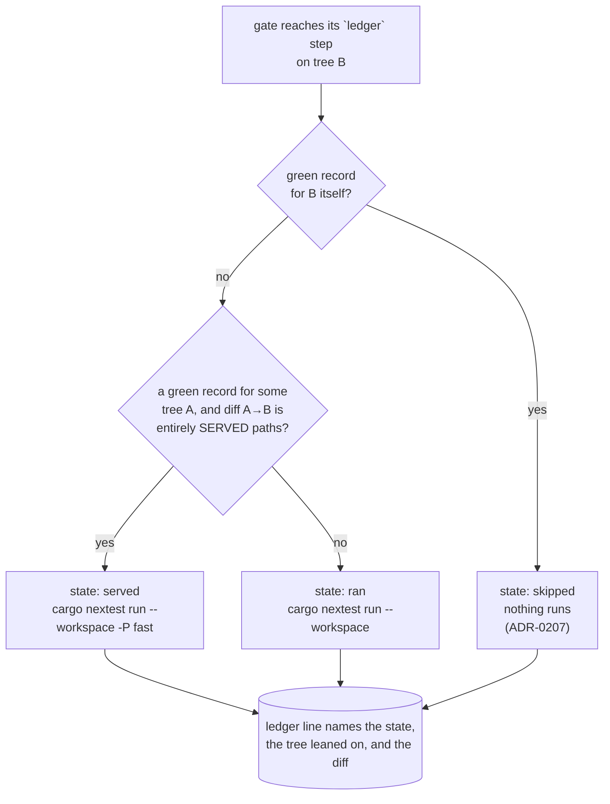

# 0191 — A green tree is not tested four times

> **Status:** approved (2026-09-16)
> **Created:** 2026-09-16
> **Owner skill(s):** dev
> **Related ADRs:** [0211](../adrs/0211-a-green-suite-record-serves-a-later-tree-when-no-deferred-suite-can-read-the-diff.md) (proposed),
> [0207](../adrs/0207-a-suite-run-the-conductor-observed-green-is-not-run-again-on-the-same-tree.md),
> [0156](../adrs/0156-the-per-phase-gate-is-scoped-and-the-suite-is-owed-once-per-plan.md),
> [0157](../adrs/0157-the-preset-sweeps-split-per-preset-and-the-phase-tier-samples-a-declared-representative.md)
> **Closes:** design-backlog 0227 - the skip half only; the cheaper-suite half is backlog 0239.
> Archived to the Promoted table on approval ([ADR-0206](../adrs/0206-a-promoted-backlog-entry-leaves-the-live-file.md)).
> **Runnable under the conductor:** yes, deliberately. No phase touches `.claude/`, a spec or a lane's
> `## Conductor mode`, so nothing here parks `claude_dir` ([ADR-0210](../adrs/0210-a-claude-repair-is-the-owners-and-a-session-that-needs-one-parks-with-the-edit.md)),
> and no phase is owned by `human`.

## TL;DR

The conductor's gate stops running the full workspace suite on a tree whose diff from an
already-green tree cannot reach any of the nine suites `-P fast` defers. It runs `-P fast` there
instead — never nothing — so the floor stays exactly what CI runs on every push. A clean plan pays the
737-second suite once instead of two to four times.

## Context & problem

[ADR-0207](../adrs/0207-a-suite-run-the-conductor-observed-green-is-not-run-again-on-the-same-tree.md)
keyed the ledger on the whole tree, so every stage whose tree moved pays the full suite again.
Measured on 2026-09-15:

| Plan | Sessions | Full suites | Where |
|---|---|---|---|
| 0175 | 24 min | **58 min** | `pre-review` 11.2, red `post-close` 10.8, `post-close` 11.4, `remerge` 12.3 |
| 0177 | 64 min | 24.5 min | `pre-review` 10.9, close tip 13.6 |

0177 met ADR-0207's bound of two and still spent a quarter of its wall clock there. 0175's `remerge`
fired because `main` moved under a waiting close — by a commit touching only `tools/conductor/`.

What separates those trees is rarely code: the close's prose repairs, the plan's move to `done/`, the
indexes, the version bump, and `git merge main`. [Backlog 0227](../design-backlog.md) is the entry,
and [ADR-0211](../adrs/0211-a-green-suite-record-serves-a-later-tree-when-no-deferred-suite-can-read-the-diff.md)
is the decision: **serve a green record forward when the diff is entirely declared paths, and run
`-P fast` in the full suite's place.**

Two things make that safe rather than optimistic, and both are worth restating because the plan's
done-whens lean on them. `-P fast` and the full suite differ by exactly the nine suites named once in
`.config/nextest.toml`'s `fast` profile. And nothing is skipped outright — `hygiene.rs`, `preset.rs`
and every `CARGO_PKG_VERSION` reader are inside `-P fast`, which is what CI runs.

## Decision

Implement ADR-0211 in `tools/conductor/` and nowhere else, in three `dev` phases: the ledger learns to
serve a record forward, the gate turns its one suite step into the three-state tier, and the run
terminal, digest and README report which state happened.

**The scope bound is a design constraint, not an accident.** A session's own wrapped suite keeps
ADR-0207's exact-tree lookup untouched, so `with-lock.mjs`'s contract, `docs/specs/`, and the three
lanes' `## Conductor mode` sections do not change — which is what keeps this plan free of a `.claude/`
phase and therefore runnable under the conductor it speeds up.

## Architecture diagram

## Implementation phases

### Phase 1 — The ledger can serve a green record forward
- **Owner skill:** dev
- **What:** `lib/ledger.mjs` gains the served-path predicate and the forward lookup. `greenRecord` is
  unchanged and keeps its exact-tree meaning; the new `servingRecord(path, tree, cwd)` is consulted
  only when `greenRecord` returns null.
  - `SERVED_PATHS` is the allowlist ADR-0211 declares, as data in one exported constant: `docs/`,
    `.claude/`, `tools/`, `site/`, `studio/`, `packaging/`, `renders/`, any `*.md`, and
    `Cargo.toml` / `Cargo.lock` under the version-line rule below.
  - `servesDiff(paths, cwd, a, b)` is true when **every** changed path is served. `Cargo.toml` and
    `Cargo.lock` are served only when `git diff a b -- <file>` changes nothing but a `version = "x.y.z"`
    line; any other hunk in either file is unserved.
  - The lookup walks the ledger newest-first and takes the first green record whose tree still
    resolves in this worktree (`git cat-file -e`) and whose diff serves. A record whose tree `git` can
    no longer resolve is skipped rather than fatal.
- **Files touched:** `tools/conductor/lib/ledger.mjs`, `tools/conductor/test/ledger.test.mjs`.
- **Done when:**
  - An unserved path anywhere in the diff refuses the record, asserted one case per unserved class:
    a `.rs`, a `.wgsl`, a `presets/*.toml`, a `core/tests/goldens/*.png`, `.config/nextest.toml`, and
    a path under a directory nobody listed.
  - A diff of only served paths is served, asserted over the shape a real close produces: a plan file
    moved into `docs/plans/done/`, two index edits, a `tools/conductor/` edit and a `*.md`.
  - `Cargo.toml` and `Cargo.lock` carrying only a version-line change are served; the same two files
    carrying any other hunk are not, each its own case.
  - A ledger whose only green record names a tree this worktree cannot resolve returns null rather
    than throwing.
  - `greenRecord`'s own behaviour is unchanged: its existing cases still pass untouched.

### Phase 2 — The gate's suite step is a three-state tier
- **Owner skill:** dev
- **What:** `lib/gate.mjs`'s `ledger: true` step resolves to one of ADR-0211's three states. `skipped`
  is today's path. `served` runs `cargo nextest run --workspace -P fast` in the full suite's place,
  under the same suite lock, with its output logged under `state/gates/` like any other command.
  `ran` is today's full run.
  - A served run **records nothing as a full-suite green**: the ledger line is a distinct shape
    (`served: true`, naming the tree leaned on), so no later lookup can mistake a `-P fast` pass for a
    full-suite record. This is the single most important property in the phase.
  - A red `-P fast` on a served tree fails the gate exactly as a red full suite does, with the same
    `failingTests` extraction.
- **Files touched:** `tools/conductor/lib/gate.mjs`, `tools/conductor/lib/ledger.mjs` (the served
  record's writer), `tools/conductor/test/gate.test.mjs`, `tools/conductor/test/ledger.test.mjs`.
- **Done when:**
  - A gate on a tree with an exact green record runs no suite command at all — unchanged from today,
    asserted so the tier did not disturb it.
  - A gate on a tree whose diff from a green tree is entirely served paths runs exactly
    `cargo nextest run --workspace -P fast`, and the argument vector is asserted verbatim.
  - A gate on a tree whose diff touches one `.rs` runs exactly `cargo nextest run --workspace`.
  - **A served run's ledger line never serves a later lookup**: after a served gate, a fresh lookup on
    that same tree returns null, so the next stage does not chain one `-P fast` off another.
  - A red `-P fast` on a served tree returns `ok: false` with its failing tests named, and writes its
    log under `state/gates/`.
  - The suite lock is taken for a served run as it is for a full one, asserted from the lock log.

### Phase 3 — The report says which tier ran, and why
- **Owner skill:** dev
- **What:** the operator can tell the three states apart without reading the ledger by hand.
  - `lib/live.mjs` prints the served state as its own line naming the tier and the tree it leaned on,
    beside the existing `skipped` and `tests` lines.
  - `lib/digest.mjs`'s per-run totals count served runs separately from full ones, so the saving is
    visible as a number rather than inferred from the wall clock.
  - `tools/conductor/README.md` documents the three states in *How it stays safe*, including the
    allowlist direction and why a served run never becomes a green record.
- **Files touched:** `tools/conductor/lib/live.mjs`, `lib/digest.mjs`, `test/live.test.mjs`,
  `test/digest.test.mjs`, `tools/conductor/README.md`.
- **Done when:**
  - A lane scenario whose close tip is a served tree prints a line naming the tier and the leaned-on
    tree, and that line is ASCII like every other (Plan 0190 Phase 6's assertion covers it).
  - The digest's Totals reports full and served suite counts separately for the run.
  - Regenerating the digest from one state twice still yields the same bytes.
  - `README.md` names all three states and the direction of the allowlist.

## Risks & open questions

- **The served list is the whole safety surface, and no test can assert what a suite reads at
  runtime.** Phase 1 asserts that each unserved class refuses a record, which is the strongest
  mechanical check available; it does not prove that nothing under `tools/` is read by a deferred
  suite. ADR-0211 records this as the price and is why the list is short.
- **`-P fast` is not free and needs a GPU.** The saving is the difference between the tiers, not the
  whole 737 s. The plan does not predict a figure — the measurement belongs in ADR-0211's `Outcome` at
  the close, taken from the first plans that run under it.
- **The first evidence is a real run, which is not a phase here.** Both lanes are filled as of
  2026-09-16 and the conductor is stood down until 0180 lands, so the figure arrives when it arrives.
- **A served record chaining off another** would silently degrade the gate to `-P fast` forever. Phase
  2's fourth done-when is the guard, and it is the one to read first in review.

## What this plan does NOT do

- **It does not make the suite itself cheaper.** `reactivity`, `animation` and `sanity` are 54 % of
  7378 test-seconds and grow with every shipped preset; sharing one headless renderer per binary, or
  sampling at the gate and covering the library nightly, is ADR-0211's Alternative A and is
  [backlog 0239](../design-backlog.md). This plan stops a green tree being tested four times; it does not touch what one test
  costs.
- **It does not change what a session runs.** `with-lock.mjs` keeps ADR-0207's exact-tree lookup, so
  the `dev` and `architect` lanes' `## Conductor mode` instructions stay true as written and no
  `.claude/` file is touched.
- **It does not adopt backlog 0227's operator rule.** *Nothing is committed to `main` while a closed
  plan waits* is retired by ADR-0211 rather than implemented: a tools-only commit is now a served
  diff.
- **It does not touch `-P fast`'s own membership.** ADR-0156 and ADR-0157 define that set in
  `.config/nextest.toml`, and this plan reads it rather than editing it.
