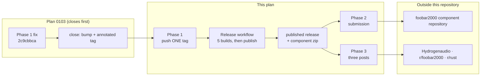

# 0192 — The component reaches its audience

> **Status:** approved
> **Created:** 2026-09-18
> **Approved:** 2026-09-20 (user)
> **Owner skill(s):** human
> **Related ADRs:** [0115](../adrs/0115-the-foobar-component-is-a-released-artifact-with-a-parameterized-sdk.md),
> [0038](../adrs/0038-tag-driven-release-unsigned-universal-mac-app.md),
> [0203](../adrs/0203-a-release-tag-is-annotated-and-origin-is-what-is-checked.md)
> **Split from:** [0103](done/0103-the-project-gets-an-audience.md) on 2026-09-18 — its Phases 5 and 6
> arrive here unchanged in substance, because they could not be satisfied while they sat there
> (see Context)
> **Hard dependency:** [0103](done/0103-the-project-gets-an-audience.md) must close, merge and be
> released; Phase 1 below is that release

## TL;DR

Plan 0103 prepared everything a stranger meets — a README that leads with the product, a demo clip,
a social preview, repository topics — and then could not take the last two steps, because both
point people at a foobar2000 component that has to exist as a **published release** first. This
plan is those two steps plus the release that unblocks them: get a tag to produce a release whose
component carries 0103 Phase 1's fix, submit the component to foobar2000's repository, and post in
the three places the audience already is.

## Context & problem

**Plan 0103 Phase 5 could not be satisfied inside Plan 0103.** Its precondition is a published
release whose component zip carries **Phase 1's fix** — the `viz_session.cpp` / `host_window.cpp`
repair that stops the component starving its host. That fix lives on 0103's own branch. A branch
reaches `main` when its plan closes, and a plan closes when every phase is done, so Phase 5 waited
on a release of code that its own plan was holding. The dependency is circular, and no ordering of
the work inside one plan resolves it.

**The release pipeline is also not currently producing releases, which the split exposes rather
than causes.** Measured 2026-09-18:

| | state |
|---|---|
| Newest published release | `v0.126.0`, 2026-09-17 |
| Tags on `origin` | through `v0.130.1` |
| `v0.127.0`, `v0.128.0` | Release run **failed** — the `foobar` job, so `release` was skipped |
| `v0.129.0`, `v0.130.0`, `v0.130.1` | **no Release run at all** |

The two failures are one cause: `build-component.ps1: FAILED: READ-ME-FIRST.ru.txt still carries
its translated-from stamp`. The strip that removes the translation stamp from the shipped text file
carried a **literal line break** where it now carries the escape `\r?\n`; `.gitattributes` checks
that script out `eol=crlf` and the `.md` out `eol=lf`, so the pattern matched in every working copy
and matched nothing in a fresh checkout. **That is already repaired on `main`** by
`926f2eb7 fix(packaging): the stamp strip survives this script's own CRLF checkout`, which is why
this plan carries no repair phase.

The three tags with **no run** are a different question, and the likely answer is that they were
pushed together: a push carrying several tags does not start a workflow run per tag. Phase 1 pushes
exactly one and finds out.

## Decision

Split rather than restructure. Plan 0103 closes after its Phase 4 and ships what it prepared; the
submission and the posts become this plan, which starts from a published release instead of
producing one from inside itself. We rejected **amending 0103's Phase 5 to submit a locally built
component** because a submission with no release behind it is worse than waiting — 0103's own text
says so — and **merging 0103 to `main` by hand ahead of its close** because it puts the plan's
merge outside the close ceremony that writes the version, the tag and the review.

Every phase here is `human`. Nothing in this plan is code, and that is the honest shape of it: the
work is a tag push, a form, and three posts, each under the owner's own account.

## Implementation phases

### Phase 1 — a published release carries the fix

- **Owner skill:** human
- **What:** Produce the release the other two phases stand on, from the tag Plan 0103's close
  writes.
- **Files touched:** none in the repository.
- **How:**
  - **Rehearse first, on `main`:** `gh workflow run release.yml --ref main`. The release job tests
    the **event** as well as the ref, so a dispatch builds all five artifacts and publishes nothing
    — a dispatch launched on a tag is the rehearsal that used to publish, which is why the event
    test exists (backlog 0194). Five green jobs is the evidence the `foobar` failure is behind us.
  - **Then push exactly one tag**, the annotated `vX.Y.Z` Plan 0103's close wrote:
    `git push origin vX.Y.Z`. One, on its own — the three tags currently sitting on `origin` with no
    run are the reason to suspect a multi-tag push starts nothing, and this phase is where that is
    settled either way.
  - If the rehearsal or the run is red for a **new** reason, stop: the repair is `dev` work and
    arrives here as an amendment with its own phase, not as improvisation inside a `human` phase.
- **Done when:**
  - `gh release view vX.Y.Z` shows a published release carrying the five zips, the foobar2000
    component among them.
  - That tag is a descendant of `2c9cbbca`, so the component in it carries Phase 1's fix —
    `git merge-base --is-ancestor 2c9cbbca vX.Y.Z` exits 0.
  - The log records **what the three run-less tags turned out to be**: a multi-tag push, or
    something else. That sentence is the only durable answer to a question that has already cost
    five tags.

### Phase 2 — the component is submitted

- **Owner skill:** human
- **What:** Submit the `.fb2k-component` to the foobar2000 component repository.
- **Files touched:** none in the repository.
- **Precondition:** Phase 1. The artifact submitted is the one attached to the release, downloaded
  from it — not a local build that merely resembles it.
- **Done when:** the submission is filed, and the log names the release it points at.

### Phase 3 — tell three specific places

- **Owner skill:** human
- **What:** Post where the audience already is, not everywhere. Hydrogenaudio's foobar2000 forum
  (the component's actual home), `r/foobar2000`, and `r/rust` (which cares about the wgpu/real-time
  engineering, not the visuals).
- **Files touched:** none in the repository.
- **How:** the material is Plan 0103's — `docs/images/demo.mp4` for the clip, the social preview
  behind any link that gets pasted. **Say the unsigned first-run friction in the post itself**, and
  that the macOS build has never run on Apple hardware: an announcement is what produces the first
  Mac downloads.
- **Done when:** the three posts exist. **The plan closes on the posts, not on the reception** —
  and if the reception is informative, it becomes design-backlog entries, which is the only outcome
  this plan can honestly commit to producing.

## Risks & open questions

- **The rehearsal can only prove the jobs pass, not that a push publishes.** The event test that
  makes a dispatch safe is exactly the thing a dispatch cannot exercise. Phase 1's tag push is the
  first real test of the publish path since `v0.126.0`.
- **Nothing reports a tag that reached `origin` and produced no release.**
  `scripts/check-release-tag.mjs --stranded` lists tags `origin` *lacks*, which is the opposite
  failure; this one was found by reading `gh run list` by hand. A gate for it needs the network and
  so cannot live where the others do — it is a backlog entry, not a phase here.
- **Every shipped artifact is unsigned**, so the first-run experience on both platforms is an OS
  warning at exactly the moment attention is highest ([NFR §8](../nfr.md#8-distribution-v1)).
  Known and accepted; Phase 3 says it rather than hiding it.
- **Mac users will be the first testers of a path that has never run on Apple hardware**
  ([NFR §9](../nfr.md#9-test-hardware-matrix-what-the-user-has)).
- **The submission and the posts are under the owner's own account and voice**, and neither is
  revocable in the way a commit is. Nothing here may be done on the owner's behalf.

## What this plan does NOT do

- **No repair of the release pipeline in code.** The known failure is already fixed on `main`; a
  new one becomes an amendment or its own plan.
- **It does not redo Plan 0103's material** — the README order, the demo clip, the social preview
  and the repository topics all land there.
- **No code signing, no package managers, no app stores, no paid promotion, no mailing list.**

## Implementation log

> Written by `dev` — one row per phase as that phase's commit lands, and the close block after the
> last one. **The phases above are the contract; everything here is what happened.**
> **Observations, never conclusions:** this says where to look, architect decides how it went.
> No per-criterion pass list, no self-assessment, no narrative — but a deviation from the plan or
> an unmet done-when is always disclosed. Stays shorter than `## Implementation phases` above.

**Lane:** _(every phase is `human`; whoever records the observations names where they did it)_

| phase | owner | state | commit |
|---|---|---|---|
| 1 — a published release carries the fix | human | not started | |
| 2 — the component is submitted | human | not started | |
| 3 — tell three specific places | human | not started | |

### Notes

### Close triggers

- **`presets/` touched:**
- **Plan header `Closes:`**
- **What shipped:**
- **Operator docs touched:**
- **Backlog probes (`node scripts/check-backlog-claims.mjs`):**
- **Full suite:**
- **Outstanding `human` phases:**

## Followups (after this lands)

- A gate, or a habit, that notices a tag on `origin` with no published release behind it.
