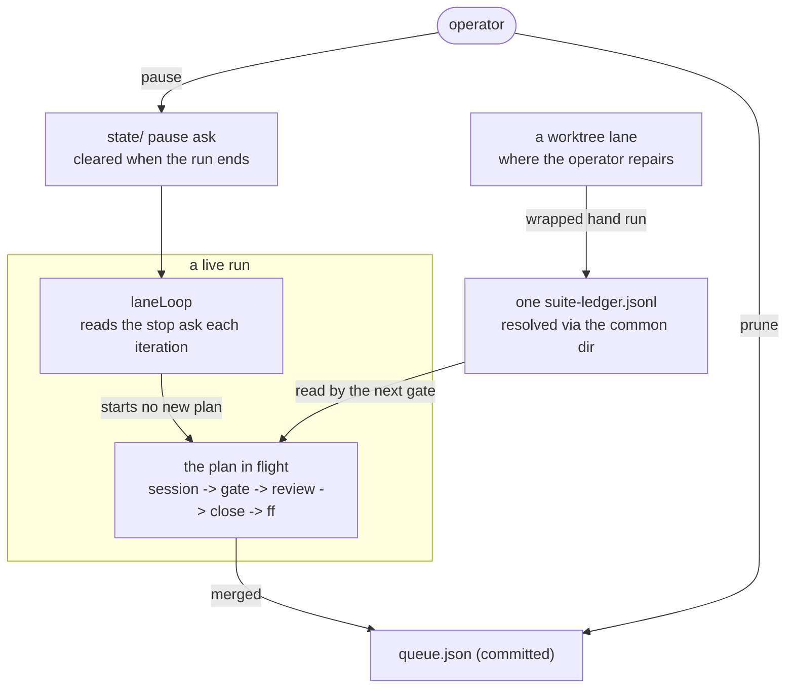

# 0197 — The conductor becomes operable

> **Status:** in-progress
> **Created:** 2026-09-19
> **Approved:** 2026-09-19 (user)
> **Owner skill(s):** dev
> **Related ADRs:** [0219](../adrs/0219-the-conductor-can-be-asked-to-finish-and-stop-and-the-ask-does-not-outlive-the-run.md)
> (proposed), [0220](../adrs/0220-the-committed-queue-stands-alone-and-a-merged-plan-is-skipped-with-a-notice.md)
> (proposed), [0205](../adrs/0205-an-approved-plan-runs-under-a-conductor-and-every-judgement-it-cannot-make-parks-the-plan.md),
> [0207](../adrs/0207-a-suite-run-the-conductor-observed-green-is-not-run-again-on-the-same-tree.md)
> **Closes:** design-backlog 0240, 0247, 0250, 0253

## TL;DR

Four things the operator does around a run are done by hand today: timing an `abort` with a
stopwatch to stop after the plan in flight, pruning a queue nothing prunes, re-running a suite the
conductor cannot see because the wrapper wrote it into a lane's own ledger, and resolving a
regeneration a session is not allowed to run. This plan adds `pause`, makes the committed queue
stand alone and adds `prune`, resolves the suite ledger per repository rather than per worktree, and
lets a session run the two documented `RLX_UPDATE_*` regenerations. The first visible behaviour is
`conductor.mjs pause` printing the plan it will finish and then ending the run.

## Context & problem

**Stopping.** `abort` kills the conductor and every session under it, and an in-flight step re-runs
next time. It is the only stop there is, and the ask an operator actually makes is *"finish the plan
in flight, then stop"*. On 2026-09-18 that was done three times in one day by watching
`state/conductor.json` in a loop and aborting inside the gap between a merge and the next session
(backlog 0253).

**The queue.** `queue.json` is committed and accumulate-only; a merged plan stays listed and is
tolerated by a special case keyed on `state/conductor.json`, which is gitignored. `validateQueue` has
no `done/` fallback, so on any clone or after a wiped `state/` every merged plan still listed is a
fatal preflight error and the run refuses to start. It has never fired because the queue was pruned
by hand twice, and nothing records that as something anyone must keep doing (backlog 0240).

**The ledger.** `tools/conductor/README.md` promises that a suite run by hand through the wrapper
counts and the next gate on that tree will not run it again. `suiteLedger()` resolves to
`join(selfDir, "state", "suite-ledger.jsonl")` — beside the copy of the script that was invoked — and
`state/` is gitignored, so a run inside a lane writes the lane's own file, which is the one place no
gate reads. The park table sends the operator *into the lane* for every reason it lists, so the
affordance works where a repair does not happen and fails where it does. Observed 2026-09-17 settling
Plan 0178's park: a green 640 s suite in `WORK/rlx-plan-0178`, and a `pre-review` gate that will run
it again (backlog 0247).

**Environment assignments.** `settings.conductor.json` allows commands by prefix, so
`RLX_UPDATE_PRESET_SCHEMA=1 cargo nextest run …` matches no rule and is denied. Two repairs the
project documents are therefore unreachable from inside a session, and both have been met: Plan
0184's close parked `merge_conflict` on a generated file it had correctly diagnosed and could not
regenerate, and any phase that renames a parameter meets the same wall (backlog 0250).

## Decision

Per [ADR-0219](../adrs/0219-the-conductor-can-be-asked-to-finish-and-stop-and-the-ask-does-not-outlive-the-run.md),
`pause` is an ask the lane loop reads where it already reads its stop request, at plan granularity,
cleared when the run ends. Per
[ADR-0220](../adrs/0220-the-committed-queue-stands-alone-and-a-merged-plan-is-skipped-with-a-notice.md),
`validateQueue` gains the `done/` fallback `merged()` already has and reports the skip as a notice,
and `prune` gives the accumulate-only file a carrier. The ledger resolves through the repository's
common directory so there is **one ledger per repository**: we rejected teaching the gate to read a
lane's ledger too, because a second lookup path means two files that can disagree about the same
tree, and the value of the record is that there is one answer. The allowlist admits the two
documented `RLX_UPDATE_*` spellings **by name**, because a rule for the shape `VAR=value <allowed
command>` would admit every variable including the ones that change what a build does.

## Architecture diagram

## Implementation phases

### Phase 1 — `pause`: finish the plan in flight, then stop
- **Owner skill:** dev
- **What:** `conductor.mjs pause` records the ask in the state directory; `laneLoop` reads it beside
  `stopRequested()` and starts no further plan; the run ends with a recorded reason naming the pause
  rather than an exhausted queue. `pause` prints the plan and step in flight and how long that step
  has been running; `pause --off` clears the ask while the run is still live; a `run` that finds an
  ask left behind by a dead conductor treats it as absent.
- **Files touched:** `tools/conductor/conductor.mjs`, `tools/conductor/lib/lane.mjs`,
  `tools/conductor/lib/state.mjs`, `tools/conductor/README.md`,
  `tools/conductor/test/lane.test.mjs`, `tools/conductor/test/cli.test.mjs`
- **Done when:** with a two-plan lane and the first plan in flight, `pause` prints what it is waiting
  for and the second plan never starts, while the first runs through its close and fast-forward and
  the run ends normally; `pause --off` before the first plan ends lets the second start; the run
  record says the lane stopped because it was paused, distinguishably from `--once` and from an empty
  queue; and a `run` started with a stale ask file and no live conductor runs normally.

### Phase 2 — The queue stands alone, and `prune` keeps it tidy
- **Owner skill:** dev
- **What:** `validateQueue` treats a queued plan found under `docs/plans/done/` as merged — the
  fallback `merged()` already has — and reports it as a notice naming the plan and the file instead
  of a fatal error. `conductor.mjs prune` rewrites `queue.json` with those plans dropped, prints each
  one, and changes nothing else about the file.
- **Files touched:** `tools/conductor/lib/queue.mjs`, `tools/conductor/conductor.mjs`,
  `tools/conductor/README.md`, `tools/conductor/test/queue.test.mjs`,
  `tools/conductor/test/cli.test.mjs`
- **Done when:** backlog 0240's demonstration reverses — `validateQueue` over a lane listing a plan
  under `done/`, with **empty** merged sets, returns no errors and one notice naming that plan; a
  queued number with no plan file at all is still a fatal error; `prune` on a queue holding a merged
  plan removes exactly that entry and leaves every other lane list byte-identical; and `prune` on an
  already-tidy queue rewrites nothing.

### Phase 3 — One suite ledger per repository, not per worktree
- **Owner skill:** dev
- **What:** `suiteLedger()` resolves the ledger beside the repository's common directory
  (`git rev-parse --git-common-dir`) so a wrapped run in any worktree records where the conductor
  reads. `RLX_SUITE_LEDGER` still wins. A bare or relocated `.git` that the derivation cannot resolve
  falls back to today's behaviour and says so, in ADR-0016's shape.
- **Files touched:** `tools/conductor/with-lock.mjs`, `tools/conductor/README.md`,
  `tools/conductor/test/with-lock.test.mjs`
- **Done when:** a wrapped `cargo nextest run --workspace` started inside a lane writes its record to
  the main checkout's `state/suite-ledger.jsonl`, and a gate run from the main checkout on that same
  tree skips the suite and prints the `hand` record; the same run started in the main checkout writes
  to the same file it does today; the test covers `selfDir` and `cwd` in **different** worktrees,
  which is the case the current test does not exercise; and an unresolvable common dir is a notice
  rather than a silent change of destination.

### Phase 4 — A session can run the two documented regenerations
- **Owner skill:** dev
- **What:** `settings.conductor.json` admits `RLX_UPDATE_PRESET_SCHEMA=1 cargo *` and
  `RLX_UPDATE_PARAM_REFERENCE=1 cargo *` by name, in both shell spellings the sessions use, with a
  case in `test/settings.test.mjs` like every other rule. `tools/conductor/README.md` states that the
  rule is a list of named variables rather than a pattern, and `docs/developing.md`'s commands stay
  the ones a session runs.
- **Files touched:** `tools/conductor/settings.conductor.json`,
  `tools/conductor/test/settings.test.mjs`, `tools/conductor/README.md`
- **Done when:** the two documented regeneration commands are allowed under the session allowlist and
  a third variable in the same shape (`RLX_ANYTHING_ELSE=1 cargo …`) is still denied; the test
  asserts both, against the model it already carries; and the README says which variables are named
  and why the rule is not a shape.

## Risks & open questions

- **The allowlist is asserted against a *model* of the CLI's matcher** (backlog 0241, still live),
  and the first unattended run falsified that model once. Phase 4's new cases inherit that: a green
  `settings.test.mjs` says the rule is right under the model, not that the CLI admits it. The first
  conductor session that needs a regeneration is the real evidence, and the plan's log should record
  what happened the first time one runs.
- **Phase 3 changes where a record lands.** A ledger line written before this lands and a line
  written after resolve to different files, so a tree green in the old location will be re-run once.
  That is one suite, once, and it is cheaper than a migration.
- **Phase 1's ask is polled state.** ADR-0219's Negative names the stale-file case; the done-when
  covers it, and nothing else in the conductor reads that file.
- **This plan edits the conductor while the conductor runs it.** The running process uses the main
  checkout's copy and the lane's gate uses the lane's, so Phase 1's and 2's defects surface on this
  plan's own gate. That is the right order, and worth knowing before reading a red.

## What this plan does NOT do

- It does not touch `.claude/`. Nothing here needs a skill edit; the README is the conductor's own.
- It does not take backlog 0236 (the `.claude/` park reads only a phase's declared `Files touched`),
  0237 (a deletion whose path the shell expands escapes the lane's deny rules) or 0241 (the allowlist
  is asserted against a model of the CLI's matcher). All three stay live. 0237 is the closest miss —
  it edits the same file as Phase 4 — and it is left out because its three shapes are undecided and
  the narrowest of them is a real restriction on what a session may delete.
- It does not let the conductor resolve a generated-file conflict itself (backlog 0250's third
  shape). Phase 4 makes the command runnable; deciding which paths are regenerate-don't-merge is a
  separate design.
- It does not touch the gate roster, `cargo doc`'s scope or the served-path rule — those are
  [Plan 0196](0196-the-gate-roster-stops-drifting.md), which edits some of the same files. **The two
  plans must not run in the same lane at the same time:** both edit `tools/conductor/lib/gate.mjs`
  (0196 Phases 1 and 4, this plan none), `lib/lane.mjs` (0196 Phase 4, this plan Phase 1) and
  `tools/conductor/README.md`. Run them in one lane, in either order.

## Implementation log

**Lane:** `WORK/rlx-plan-0197` on `plan-0197-the-conductor-becomes-operable`

| phase | owner | state | commit |
|---|---|---|---|
| 1 — `pause`: finish the plan in flight, then stop | dev | done | 1928b879 |
| 2 — The queue stands alone, and `prune` keeps it tidy | dev | done | 4625a537 |
| 3 — One suite ledger per repository, not per worktree | dev | done | 3ee9a776 |
| 4 — A session can run the two documented regenerations | dev | done | 3619c8bb |

### Notes

- Phase 4 admits each variable in **two** spellings, not the one the phase names: `RLX_UPDATE_*=1
  cargo *` and `RLX_UPDATE_*=1 node *` (3619c8bb). `.claude/hooks/conductor-suite-lock.js` denies the
  bare form of both documented commands in a conductor session — it reads the assignment prefix and
  still sees the `cargo nextest` / `cargo test` behind it — so the `cargo` rule alone leaves the
  regeneration unreachable from the place the phase exists to reach it from.
- Phase 4's risk asks what happens the first time a session actually runs one of the two
  regenerations. None ran in this session; nothing to record yet.
- **Round 1 finding 0 (major), `pickNext` picks a merged plan** — `4bf9163f`: the picker asks
  `merged()` about the plan itself, not only about its `after` deps, so a queue entry for a plan
  under `done/` is skipped with no state record beside it. The new `cli.test.mjs` case drives `run`
  over that configuration and asserts no lane opens for it.
- **Round 1 finding 1 (minor), `recordNotStarted`'s reason list** — `68e4acbd`: `paused` added.
- **Round 1 finding 2 (minor), `pruneQueue`'s header** — `7a35b07d`: it now states contents and
  order preserved and the file rewritten in the canonical spelling, not that nothing else moves.

### Close triggers

- **`presets/` touched:** none.
- **Plan header `Closes:`** design-backlog 0240, 0247, 0250, 0253
- **What shipped:** feature, in `tools/conductor/` only — `pause`, `prune`, the queue's `done/`
  fallback, the per-repository suite ledger and four allowlist rules. Nothing under `core/`,
  `standalone/`, `plugin-foobar/`, `studio/`, `presets/` or `packaging/` moved, so no release
  artifact changed.
- **Operator docs touched:** `tools/conductor/README.md` — the `pause` row and paragraph (Phase 1),
  the queue's setup step and the `prune` row (Phase 2), the hand-suite paragraph (Phase 3), and the
  allowlist bullet in *How it stays safe* (Phase 4). No file under `docs/` other than this plan.
- **Backlog probes (`node scripts/check-backlog-claims.mjs`):** exit 0 — 59 reductions across 26 live
  entries, 4 unprobeable. Advisory only: 30 moved paths, of which this plan moved two —
  0237 (`tools/conductor/settings.conductor.json`) and 0241
  (`tools/conductor/test/settings.test.mjs`). The four entries this plan closes left the live file at
  approval (ADR-0206) and are **Promoted** rows in
  [`docs/design-backlog-archive.md`](../design-backlog-archive.md); their probes no longer run.
- **Full suite:** not run here — owed to the conductor's pre-review gate (ADR-0207). No phase named a
  deferred GPU suite, so no upward override ran at an earlier phase.
  `node --test "tools/conductor/test/*.test.mjs"`: 361 tests, 361 pass, 0 fail.
- **Outstanding `human` phases:** none; every phase is `dev`.

## Followups (after this lands)

- Backlog 0237's deny rules would land naturally beside Phase 4's allowlist cases, once its three
  shapes are decided.
