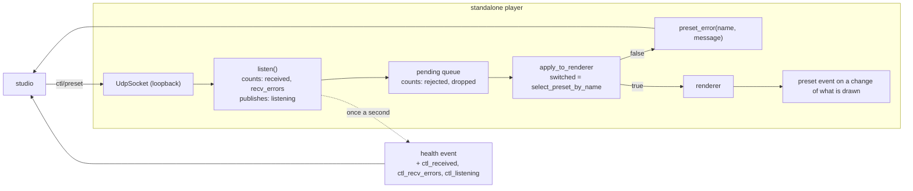

# 0198 — The control path stops failing quietly

> **Status:** approved
> **Created:** 2026-09-19
> **Approved:** 2026-09-19 (user)
> **Owner skill(s):** dev, studio-builder
> **Related ADRs:** [0221](../adrs/0221-the-control-path-reports-what-it-did-not-do.md) (proposed),
> [0176](../adrs/0176-the-player-is-driven-over-osc-control-in-and-reports-on-its-standard-streams.md),
> [0193](../adrs/0193-a-test-that-reads-the-clock-runs-alone.md)
> **Takes:** design-backlog 0219 and 0220 — the **observability half** of each. Both entries stay
> live with a dated bullet naming the half, until the cause is named.

## TL;DR

Two intermittent control-path failures have been reproduced and neither can be diagnosed, because
the listener reports what it did and nothing about what it did not: a swallowed receive error looks
like an idle socket, and a `ctl/preset` the renderer declines to select produces no event at all.
This plan counts what the listener receives and fails to receive, publishes whether it is still
listening, reports a refused selection as a `preset_error`, and then runs the reproduction again
with those readings in hand. The first visible behaviour is a studio that says *why* a preset click
did nothing.

## Context & problem

`a_preset_datagram_selects_by_name` failed 3 times in 79 back-to-back loaded runs on 2026-09-14, and
again once in a conductor gate on 2026-09-15, costing a park, a resume and an 11.4-minute re-run.
Its report is as complete as the current surface allows — *"nothing reached the listener within 5s
… listener counters: rejected 0, dropped 0"* — and it still cannot say whether the listener thread
was alive or whether `recv_from` was failing, because `listen` swallows every receive error with a
bare `continue` and counts nothing (backlog 0219).

`every_system_is_reported_by_the_key_the_schema_labels_its_roster_with` stalled twice in the same 79
runs, both times at ask 9 of 14, `emitter`. The child kept drawing at 30 fps and answered the ping
sent behind the ask; no `roster`, `preset` or `preset_error` followed in two minutes. Four candidates
remain undistinguished, and one of them — `select_preset_by_name` returning `false` — is silent by
construction: `apply_to_renderer` records `applied.switched` and nothing reports a `false` (backlog
0220).

The gate does not retry a red (ADR-0193), so while these are open every full suite carries that
chance; and the same listener is what the studio's library click goes through.

## Decision

Per [ADR-0221](../adrs/0221-the-control-path-reports-what-it-did-not-do.md), the listener counts
received datagrams and non-timeout receive errors and publishes whether it is still listening, as
additive `health` fields; a refused selection is reported as a `preset_error` naming what was asked
for. We rejected logging the receive error (a failing socket floods a show machine) and
test-only instrumentation (both failures live in the shipped binary, and the studio needs the same
signal). The plan then re-runs the reproduction **with a stop condition**: if the load that produced
three failures in 79 runs produces none with the counters in place, the plan records the readings and
stops rather than inventing a fix for a defect it has not seen.

## Architecture diagram

## Implementation phases

### Phase 1 — The listener counts what it receives and what it fails to receive
- **Owner skill:** dev
- **What:** `listen` counts every datagram received and, separately, every receive error that is not
  the ordinary read timeout; the listener publishes whether it is still running, so a stopped thread
  is distinguishable from a quiet one. `Control` exposes all three, beside `rejected`, `dropped` and
  `refused`.
- **Files touched:** `standalone/src/control.rs`
- **Would break real-time if:** the counters were anything but relaxed atomics on the listener
  thread — no lock, no allocation, no I/O in the receive loop, and nothing new on the audio path,
  which this file does not touch at all.
- **Done when:** a bound `Control` that has received one datagram reports one received; a listener
  whose socket is closed under it reports a non-timeout receive error and stops reporting itself as
  listening; a listener that has only timed out reports zero errors and is still listening; and the
  ordinary timeout path adds nothing to either counter, at any rate of timeouts.

### Phase 2 — A refused selection is reported
- **Owner skill:** dev
- **What:** a `ctl/preset` whose `select_preset_by_name` returns `false` emits a `preset_error`
  carrying the asked-for name and a message saying the selection did not take. The three new listener
  readings join the `health` event as additive fields under the same protocol version. Spec 0003
  records both, including the note that `preset_error`'s `file` now also carries a name that may not
  be a file.
- **Files touched:** `standalone/src/show.rs`, `standalone/src/control.rs`,
  `docs/specs/0003-studio-control-protocol.md`, `docs/configuration.md`
- **Done when:** a `ctl/preset` naming a preset that is not in the roster produces one
  `preset_error` naming it, where today it produces nothing; a `ctl/preset` naming one that is in the
  roster produces none; `health` carries the three new fields every second and an older consumer
  reading only the documented fields is unaffected; and spec 0003's roster table and invariants say
  what each new field means.

### Phase 3 — The two tests read the new evidence
- **Owner skill:** dev
- **What:** the delivery failure in `control_loopback.rs` and the walk failure in `stream_show.rs`
  print the new readings — received, receive errors, still listening — beside the counters they
  already print, so a failure states which of the candidates it was. The `Ask::ping` doc comment's
  overclaim, corrected in backlog 0220's own body on 2026-09-14 and still in the source, is
  corrected: a `pong` proves the *ping* was drained, not the ask in front of it.
- **Files touched:** `standalone/tests/control_loopback.rs`, `standalone/tests/stream_show.rs`
- **Done when:** a deliberately broken listener makes each of the two tests fail with a report that
  names which reading convicted it; a passing run prints nothing new; and no test asserts a timing
  figure that is not a property (ADR-0071) — the new readings are counts and liveness, not durations.

### Phase 4 — The reproduction runs again, with a stop condition
- **Owner skill:** dev
- **What:** re-run the 2026-09-14 reproduction — the `stream_show` and `control_loopback` binaries
  back to back under a second nextest process driving `golden`, `attractor` and
  `reaction_diffusion` — enough times to expect the observed rate, and record every failure's
  readings in the implementation log.
- **Files touched:** none necessarily; a committed runner only if the phase finds one worth keeping.
- **Done when:** one of two outcomes is recorded, and which one it was is stated plainly in the log.
  **Either** a failure reproduces and its readings name the candidate — a lost datagram (received
  did not move), a dead listener (listening is false), a failing socket (receive errors moved) or a
  refused selection (a `preset_error` now appears) — in which case the log names it and the fix is a
  **new plan**, because the repair for each candidate is a different piece of work. **Or** the load
  produces no failure in at least as many runs as the original observation, in which case the log
  records the run count and the readings, both entries stay live with that evidence, and the plan
  stops here. Inventing a fix for an unobserved cause is not an outcome of this plan.

### Phase 5 — The studio carries the new readings
- **Owner skill:** studio-builder
- **What:** the studio's shared protocol types accept the three new `health` fields, and a player
  that reports it has stopped listening is surfaced where the operator already looks for the
  connection's state rather than left to be inferred from clicks that do nothing.
- **Files touched:** `studio/shared/protocol.ts`, the studio's status surface and their tests
- **Done when:** the studio parses a `health` event carrying the new fields and one without them,
  without error; a player reporting that it is no longer listening is visibly distinguishable in the
  studio from one that is idle; and the studio's own tests cover both events.

## Risks & open questions

- **Phase 4 may find nothing.** That is an outcome, not a failure, and the phase's done-when says so
  explicitly. The instrumentation still ships and the next occurrence — in a conductor gate, or on a
  user's machine — reports itself.
- **The counters cannot name a datagram** (ADR-0221's first Negative). If the readings say "received
  did not move", that convicts the send-to-queue path and still does not say where the datagram went;
  the next plan may need per-datagram sequencing, which is a protocol change.
- **Phase 5 needs `studio/node_modules` in the lane.** Under the conductor that is exactly backlog
  0242, which [Plan 0196](0196-the-gate-roster-stops-drifting.md) Phase 4 repairs. Run this plan
  after 0196, or the operator installs in the lane by hand before Phase 5.
- **`health` is emitted once a second for the life of a run**, so the new fields are a permanent cost
  on the contract. Additive under the same `v`, per spec 0003's own rule.

## What this plan does NOT do

- It does not fix either failure. It buys the evidence that says which failure it is — see Phase 4's
  stop condition, and the `**Takes:**` header, which is why neither entry is in a `Closes:` line.
- It does not add per-datagram sequencing, retries on the control path, or a liveness address on the
  protocol. A retry would bury a flake, which ADR-0193 forbids for exactly this defect.
- It does not touch the audio thread, the ring or the analyzer — spec 0003's invariant, and nothing
  here goes near them.

## Implementation log

**Lane:** _(to be filled by `dev`)_

| phase | owner | state | commit |
|---|---|---|---|
| 1 — The listener counts what it receives | dev | not started | |
| 2 — A refused selection is reported | dev | not started | |
| 3 — The two tests read the new evidence | dev | not started | |
| 4 — The reproduction runs again, with a stop condition | dev | not started | |
| 5 — The studio carries the new readings | studio-builder | not started | |

### Notes

### Close triggers

- **`presets/` touched:**
- **Plan header `Closes:`** none — see `**Takes:**`; backlog 0219 and 0220 stay live, each with a
  dated bullet naming the half this plan took and whatever Phase 4 recorded.
- **What shipped:**
- **Operator docs touched:**
- **Backlog probes (`node scripts/check-backlog-claims.mjs`):**
- **Full suite:**
- **Outstanding `human` phases:**

## Followups (after this lands)

- Whatever Phase 4 names, as its own plan.
