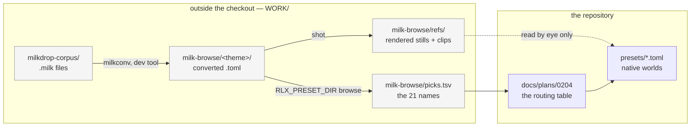

# 0204 — The library learns from the corpus it will not ship

> **Status:** approved
> **Created:** 2026-09-19
> **Approved:** 2026-09-19 (user)
> **Owner skill(s):** human (the `preset-author` lane throughout)
> **Related ADRs:** [0227](../adrs/0227-a-borrowed-look-is-authored-natively-and-the-reference-never-enters-the-repository.md)
> (proposed), [0113](../adrs/0113-milkdrop-presets-are-translated-ahead-of-time-onto-a-warp-mesh-idiom.md),
> [0081](../adrs/0081-the-content-lane-lands-presets-and-architect-curates-the-set.md),
> [0089](../adrs/0089-the-library-renews-by-replacement-cohorts.md),
> [0017](../adrs/0017-preset-author-skill-lane.md)

## TL;DR

The user browsed the converted MilkDrop corpus and picked twenty-one looks worth having. This plan
turns a small, judged first cohort of them into **native** presets — each routed to whichever
system expresses it best, authored from a rendered reference that never enters the repository, and
landed through the ordinary curation route. The first visible behaviour is a reference sheet under
`WORK/milk-browse/refs/` that the content lane can author against; the last is a look verdict that
decides whether the remaining picks are worth doing at all.

## Context & problem

**The content gap is real and the import route is closed.**
[ADR-0113](../adrs/0113-milkdrop-presets-are-translated-ahead-of-time-onto-a-warp-mesh-idiom.md)
sized it honestly: this engine's library is measured in the low hundreds, the MilkDrop lineage's in
the tens of thousands. It built `milkconv` and the `warp_mesh` idiom, and then declined to decide
whether anything converted may ship —
[Plan 0100](done/0100-the-engine-speaks-milkdrop.md) Phase 8 still owns that, and its standing
answer is *nothing third-party in the repository or a release*.

**So the corpus became a catalogue instead of a source.** On 2026-09-19 the `cream-of-the-crop`
collection was converted into a scratch directory outside the checkout and browsed theme by theme
through `RLX_PRESET_DIR`. The picks that came back, with the theme they were found in:

| # | Theme | Pick | System |
|---|---|---|---|
| 1 | Reaction | `$$$ Royal - Mashup (157)` — molten gold, black veining on cream | |
| 2 | Reaction | `$$$ Royal - Mashup (275)` — fire field, red into orange, black cracks | |
| 3 | Reaction | `A HD ADAMFX Creation !!FT Martin + flexi + …INFECTIONFX A` — dark, faint blue streaks | |
| 4 | Reaction | `A Remixed Digital Echasketch Again 2 martin …mstress + 4` — vertical bands, olive into teal | |
| 5 | Reaction | `AdamFX 2 Geiss - Mash-Up Sphere Xibit Graffiti Warp me Tydye4` — blue field, green cellular veins | |
| 6 | Reaction | `Flexi - alien web bouncer [39]` — yellow and orange, black-cored red webbing | |
| 7 | Dancer | `$$$ Royal - Mashup (139)` | |
| 8 | Dancer | `EoS - nematodes C` | |
| 9 | Dancer | `Isosceles mashup13` | |
| 10 | Drawing | `EVET - Brainlocknrelease` — dark maroon | |
| 11 | Drawing | `Stahlregen & fiSHbRaiN + flexi + Geiss + shifter - Stonecraft (Dense)` — angular terracotta blocks | |
| 12 | Geometric | `EoS - magnetosphere 03` | |
| 13 | Sparkle | `Serge + martin - crystal palace001d` — deep blue, white streak | |
| 14 | Sparkle | `Waltra - Square Party` — green field, yellow square spray | |
| 15 | Particles | `EoS - more waveforms 5` — orange diagonal on black | |
| 16 | Particles | `amandio c - pulse - we are going to need your permission` — dense grain, red form | |
| 17 | Supernova | `Geiss - 3D - Luz` — monochrome diagonal streaking | |
| 18 | Hypnotic | `Flexi - alien complex 02` — blue gradient | |
| 19 | Hypnotic | `TonyMilkdrop - Nuclear [Flexi - help out + multiverse] --- Isosceles edit1` — amber marble, red veins | |
| 20 | Hypnotic | `goody + flexi - emotive dissonance - integral anomaly - dissonant rift3` — silver folded satin | |
| 21 | Hypnotic | `i made hexcollies day!` — magenta and green diagonal stripes | |

The `System` column is deliberately empty; Phase 2 fills it. The look notes are thin on purpose —
they were taken from a window title strip, not from the frame, which is the problem Phase 1 exists
to fix.

**Three constraints make this a plan rather than a sitting.** The looks must be reached natively,
with nothing from the corpus entering the tree, including renders — that is
[ADR-0227](../adrs/0227-a-borrowed-look-is-authored-natively-and-the-reference-never-enters-the-repository.md).
The picks are warp-idiom in origin but not all warp-idiom in nature, so each needs routing to a
system rather than a blanket assignment. And
[ADR-0089](../adrs/0089-the-library-renews-by-replacement-cohorts.md) says the library renews by
cohorts, so twenty-one presets is not a thing to author before anyone has seen whether one works.

**It sits behind [Plan 0201](done/0201-the-warp-surface-stops-lying.md), and that ordering is
load-bearing.** That plan's own TL;DR says `warp_mesh`'s `zoom` doc *"says the opposite of what its
shader does and four generated surfaces carry the lie"* — and that the lie has **already produced a
false paragraph in shipped content**. Any pick that routes to `warp_mesh` would be authored against
a parameter reference known to be inverted. Waiting costs a queue position; not waiting costs
re-tuning every preset that bound `zoom` from the reference.

## Decision

We will author a **small first cohort** from the picks, **routing each to the system that expresses
it best**, working from **rendered references held outside the repository**, and **judging the
result in the live app before committing to the rest**.

Each of those four was chosen against a named alternative. We rejected authoring everything on
`warp_mesh` because several picks read as cellular, reaction-diffusion or analytic-field looks that
happen to have been built on a mesh, and routing them by origin rather than by nature would
reproduce the mesh's constraints for no gain. We rejected starting before Plan 0201 because the
`zoom` reference is known false today. We rejected all twenty-one in one campaign because nothing
yet says a native reading of a borrowed look is worth having, and ADR-0089's cohort mechanism
exists for exactly this. And we rejected committing the reference renders because a render of a
preset is derived from that preset — ADR-0227 Alternative C.

## Architecture diagram

The dotted edge is the whole decision: the reference is **looked at**, never read as source and
never copied across the boundary.

## Implementation phases

Every phase here is `human` — this is content-lane work throughout, in the sense
[ADR-0017](../adrs/0017-preset-author-skill-lane.md) established and the standing sittings in
[`docs/content-brief.md`](../content-brief.md) already use. There is no Rust or C++ in this plan.
A conductor run would park at Phase 1 and stay parked, per
[ADR-0205](../adrs/0205-an-approved-plan-runs-under-a-conductor-and-every-judgement-it-cannot-make-parks-the-plan.md);
that is correct, not a defect.

**This plan's `human` phases may write to the routing table above.** That is a scoped exception to
the usual rule that an implementer touches only `Status:` and the log — the table is this plan's
working surface, and Phase 2's output has nowhere better to live.

### Phase 1 — The reference sheet

- **Owner skill:** human
- **What:** Render every pick to something the content lane can actually judge, under
  `WORK/milk-browse/refs/`, outside the checkout.
- **Files touched:** none in the repository. Output is `WORK/milk-browse/refs/<NN>-<slug>/` plus a
  `refs/README.md` **outside the repo** recording the exact `shot` invocations.
- **Done when:** each of the twenty-one picks has, at minimum, a loud frame and a quiet frame at a
  stated `--set` stimulus; and every pick whose interest is its *motion* rather than its palette
  also has a short clip. A still of a feedback world understates it — that is the failure this
  phase exists to avoid, so the judgement of which picks need a clip is part of the phase, not a
  preamble to it. The `refs/README.md` records the commands, so the sheet is reproducible by
  anyone who has the corpus.

### Phase 2 — The routing table and the cohort

- **Owner skill:** human
- **What:** Fill the `System` column for all twenty-one picks, and name the first cohort.
- **Files touched:** this plan (the routing table in `## Context & problem`).
- **Done when:** every row carries a `SystemKind` and one sentence naming what in that system
  carries the look — `warp` for a drifting-sinusoid churn, the reaction-diffusion field for a
  veined skin, `analytic_field` for a banded interference, and so on. A pick with **no** native
  home is recorded as such rather than forced into one: that is an engine-gap finding for
  [`docs/design-backlog.md`](../design-backlog.md), and routing it to the nearest system anyway
  would bury exactly the signal this plan is best placed to produce. The cohort named for Phase 3
  is four to six picks and **spans at least three distinct systems** — a cohort routed to one
  system tests the idiom, not the routing, and the routing is this plan's claim.

### Phase 3 — The cohort is authored

- **Owner skill:** human
- **What:** Author the cohort as native presets and land them in the shipped set.
- **Files touched:** `presets/*.toml` (new files, named by their system's filename family so the
  generated editor schema applies), and `presets/README.md` only if a hand-written structural or
  palette table needs it.
- **Done when:** every preset in the cohort passes the behavioral suite and lands through the
  [ADR-0081](../adrs/0081-the-content-lane-lands-presets-and-architect-curates-the-set.md) route;
  each carries a header stating its own mechanism and **naming no third-party preset**, per
  ADR-0227; and each was rendered and looked at before it was committed. Note what the gate is
  worth while leaning on it: of the five, only `reactivity` drives PCM through the real analyzer
  ([`docs/testing.md`](../testing.md) carries the table), so a green suite says these presets are
  *sound*, never that they are *good*.

### Phase 4 — The verdict, in the live app

- **Owner skill:** human
- **What:** Decide whether a native reading of a borrowed look is worth having, and therefore
  whether picks 7–21 proceed.
- **Files touched:** this plan (the verdict), and `docs/content-brief.md` if the answer is yes and
  the remainder becomes a standing sitting.
- **Done when:** the cohort has been judged **in the running app against its reference sheet, not
  as stills** — launched from a filtered directory via `RLX_PRESET_DIR`, which hot-reloads — and
  the verdict is written down as one of three: the route is worth the remaining picks; it is worth
  it only for certain systems (named); or it is not worth it and the picks are abandoned with the
  reason recorded. **A negative verdict is a real outcome of this plan, not a failure of it** —
  Plan 0142 Phase 4 has already returned a "no" on the neighbouring question three times, and a
  fourth honest one is worth more than a cohort nobody wanted.

## Data shapes

None. This plan introduces no types, no parameters and no engine surface. If Phase 2 finds a look
that needs one, that is a feedback note to `architect`, not a phase of this plan.

## Risks & open questions

- **Plan 0201 slips, or is reordered ahead of this one's start.** Then any `warp_mesh` routing is
  authored against the inverted `zoom` reference. Mitigation: Phase 2 may route and Phase 1 may
  render regardless — only Phase 3's `warp_mesh` entries actually block on 0201. If the wait
  becomes real, author the cohort's non-`warp_mesh` members first.
- **The routing hypothesis may not survive contact.** It is entirely possible that what makes these
  looks good *is* the mesh, and that a reaction-diffusion reading of a mesh-built veining is a pale
  thing. Phase 2 recording "no native home" is the designed escape; the failure mode to avoid is
  quietly widening `warp_mesh` to swallow the difference, which would be engine work smuggled into
  a content plan.
- **The references are unreproducible from a checkout.** ADR-0227's stated price. The corpus is not
  in this repository and will not be; a future reader has the plan's prose and nothing else. There
  is no mitigation, only the disclosure.
- **"In the spirit of" has no done-when.** Phase 4 is a human look call by construction. This plan
  does not pretend otherwise and does not invent a metric to launder the judgement.
- **ADR-0089's cohort mechanism is invoked but not exercised.** A four-to-six preset cohort added to
  the shipped set grows it; whether anything is displaced is `architect`'s curation call at close
  (close-ceremony step 3b), not a phase here. Open question: if the verdict is strongly positive,
  does the remainder run as one campaign or as further cohorts? Phase 4 answers it.

## What this plan does NOT do

- **It does not answer Plan 0100 Phase 8.** Provenance stays open, and nothing here may be cited as
  having settled it.
- **It does not import, convert or ship anything third-party.** No `.milk`, no `milkconv` output,
  no render of either, in the repository or a release.
- **It does not touch engine Rust.** No new scene, param, expression function, curve family or
  shader. Anything a look needs that the preset surface cannot express routes to `architect` as a
  backlog entry — that is the [ADR-0017](../adrs/0017-preset-author-skill-lane.md) boundary and
  this plan does not bend it.
- **It does not author picks 7–21.** Only the Phase 2 cohort. The rest wait on Phase 4's verdict.
- **It does not fix the warp surface.** [Plan 0201](done/0201-the-warp-surface-stops-lying.md) owns
  that; this plan consumes it.
- **It does not add a copy key to the app.** Collecting preset names by watching the window title
  from outside was sufficient; a clipboard binding would be a `dev` plan and a new dependency
  against NFR §4.

## Implementation log

> Written by the lane — one row per phase as that phase's commit lands, and the close block after
> the last one. **The phases above are the contract; everything here is what happened.**

**Lane:** _(to be filled)_

| phase | owner | state | commit |
|---|---|---|---|
| 1 — The reference sheet | human | not started | |
| 2 — The routing table and the cohort | human | not started | |
| 3 — The cohort is authored | human | not started | |
| 4 — The verdict, in the live app | human | not started | |

### Notes

### Close triggers

- **`presets/` touched:**
- **Plan header `Closes:`** none
- **What shipped:**
- **Operator docs touched:**
- **Backlog probes (`node scripts/check-backlog-claims.mjs`):**
- **Full suite:**
- **Outstanding `human` phases:**

## Followups (after this lands)

- Picks 7–21, if Phase 4's verdict says the route is worth it — as a campaign or as further
  cohorts, per that verdict.
- Any engine gap Phase 2 records as "no native home", as a `docs/design-backlog.md` entry with a
  probe.
