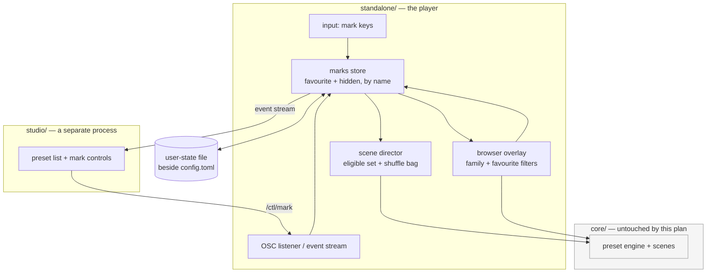

# 0205 — The library becomes navigable

> **Status:** in-progress
> **Created:** 2026-09-19
> **Approved:** 2026-09-19 (user)
> **Amended:** 2026-09-19 — four navigation affordances added after a second UX pass, all in the
> owner's answer: a previous-preset key (Phase 2), and number-key jumps, a dwell countdown and
> A/B compare as a new Phase 4. The thumbnail browser was considered and deliberately left to its
> own plan, after this one — see `## Followups`.
> **Owner skill(s):** dev, studio-builder
> **Related ADRs:** [0228](../adrs/0228-a-preset-mark-is-user-state-keyed-by-name-in-its-own-file.md)
> (proposed), [0229](../adrs/0229-the-studio-marks-a-preset-over-the-control-protocol.md)
> (proposed), [0176](../adrs/0176-the-player-is-driven-over-osc-control-in-and-reports-on-its-standard-streams.md),
> [0022](../adrs/0022-build-time-preset-embedding.md), [0027](../adrs/0027-scene-rotation-constant-default-calmer-cadence.md)

## TL;DR

The shipped set is 114 presets and the app offers one flat roster to walk it. This plan adds two
marks — **favourite** and **hidden** — persisted by preset name in the standalone's own user state,
then spends them: auto-rotate can draw from favourites alone, hidden presets stop appearing, the
browser filters by family and by favourite, and rotation stops repeating itself. Four navigation
affordances ride along: stepping **backwards**, jumping to a favourite by **number**, seeing
**when** the next rotation lands, and **A/B** flipping between two presets to compare them. The
studio gets the same marks over the control protocol. The first visible behaviour is marking a
preset with one
key and finding it still marked after a restart.

## Context & problem

**The roster outgrew the way it is presented.** [`docs/running.md`](../running.md) describes the
browser accurately — as many columns as the window fits, arrows walking and wrapping, type to
filter, `Enter` to select — and that design was sized for a library a fraction of the current one.
At 114 presets across fourteen filename families, finding a specific look means remembering its
name well enough to type it, and finding *a good one* means pressing `Space` until something lands.

**Auto-rotate draws from everything, including what you never want to see.** `[rotate]`'s policy
([ADR-0027](../adrs/0027-scene-rotation-constant-default-calmer-cadence.md)) is a dwell window and
a track-change nudge; the *set* it draws from is the whole library, with no way to narrow it and no
memory of what it just showed.

**There is no way to record an opinion.** This is the half that reaches past navigation:
[backlog 0256](../design-backlog.md) records that nothing in this repository asks whether a shipped
preset is any good, that the `distinctness` report covers nine of fourteen families, and that the
route to a curation mechanism runs through a human verdict *first*. A `hidden` mark made in passing
is that verdict, captured when it forms.

**What is already decided, and is therefore not this plan's to revisit.** Preset identity is the
**name** — [spec 0001](../specs/0001-c-abi.md) settled that for persisted choices. The shipped set
is embedded and read-only ([ADR-0022](../adrs/0022-build-time-preset-embedding.md)), so a mark
cannot live in a `.toml`. And the studio is a separate process that reaches the player only over
the control protocol
([ADR-0176](../adrs/0176-the-player-is-driven-over-osc-control-in-and-reports-on-its-standard-streams.md)).
The two ADRs beside this plan turn those into a shape.

## Decision

We will add **two name-keyed marks in the standalone's own user-state file**
([ADR-0228](../adrs/0228-a-preset-mark-is-user-state-keyed-by-name-in-its-own-file.md)), spend them
in the director and the browser, and expose them to the studio through **one new control message**
([ADR-0229](../adrs/0229-the-studio-marks-a-preset-over-the-control-protocol.md)) with the player
as the only writer.

Rejected during the interview: marks in the preset file (the shipped set is read-only, and a
personal opinion is not content that ships); marks in `config.toml` (a second writer on the
settings menu's file, for tidiness alone); marks keyed by index (spec 0001 already refused it); a
1–5 rating (it asks for a judgement that mostly does not exist, and every threshold on it becomes a
constant to defend); and the studio reading the marks file directly (two writers, and the exact
shim [ADR-0177](../adrs/0177-a-fourth-skill-lane-builds-the-studio.md) forbids).

**`hidden` is not retirement.** A hidden preset still ships, still passes the gates, still appears
in `shot --presets presets --report`. Deleting the file at cohort cadence is
[ADR-0089](../adrs/0089-the-library-renews-by-replacement-cohorts.md)'s business and stays there.

## Architecture diagram



The player is the only thing that touches the file — that edge exists once, and ADR-0229 is the
reason.

## Implementation phases

Phases 1–5 are `dev` and run contiguously; phase 6 is `studio-builder` and hands off per
[ADR-0188](../adrs/0188-the-two-implementer-lanes-hand-off-automatically.md).

### Phase 1 — The marks store, and one key that proves it

- **Owner skill:** dev
- **What:** The name-keyed store, its file, and a binding that marks the preset on screen. A
  walking skeleton that is useful the moment it lands.
- **Files touched:** a new `standalone/src/marks.rs`, `standalone/src/input.rs`,
  `standalone/src/config.rs` (path resolution beside `config.toml`), `docs/configuration.md`,
  `docs/running.md`.
- **Done when:** marking the current preset favourite, restarting the app, and finding it still
  favourite. The store round-trips through the file; a file that is absent, empty or malformed
  yields empty mark sets and a diagnostic line rather than a failure to start, because user state
  that can refuse to launch the app is worse than user state that is lost. A mark on a name no
  longer in the library is retained and inert (ADR-0228's stated cost — it is not pruned).

### Phase 2 — Rotation spends the marks

- **Owner skill:** dev
- **What:** The director draws from an eligible set rather than the whole library, and stops
  repeating itself.
- **Files touched:** `standalone/src/director.rs`, `standalone/src/director/tests.rs`,
  `standalone/src/config.rs` (a `[rotate]` source key), `docs/configuration.md`,
  `docs/running.md`.
- **Done when:** three behaviours hold, each stated as a property rather than a threshold:
  - **Hidden presets never appear in auto-rotate**, in either rotation source.
  - **Favourites-only is a hard filter with a fallback**: with the source set to favourites,
    rotation draws only from favourites; when the favourite set is empty it draws from the whole
    eligible set instead. It never holds one preset forever, because a mode that looks identical to
    a hang is a mode nobody can debug from the window.
  - **Auto-rotate does not repeat while unseen presets remain.** A shuffled traversal of the
    eligible set, reshuffled when exhausted, with the constraint that a preset never ends one cycle
    and begins the next. Note this is deliberately *not* a remembered-history window: a window
    needs a length somebody has to defend, and the permutation property needs no constant at all.
    The eligible set changes underfoot when a mark is toggled mid-show, so the traversal must
    tolerate its set growing and shrinking between draws.
  - **The roster can be stepped backwards from the keyboard.** `console::previous_index` already
    exists and is tested; it is reachable only from the console's clickable transport strip, so
    overshooting a good preset with `Space` means walking the whole library to return. Give it a
    key. Under the shuffled traversal above, "previous" means *the preset actually shown before
    this one*, not an index one lower — the two stopped being the same thing the moment rotation
    stopped being sequential, and the traversal is what has to answer it.

### Phase 3 — The browser narrows

- **Owner skill:** dev
- **What:** The four browser improvements, all in the existing overlay.
- **Files touched:** `standalone/src/overlay.rs`, `standalone/src/overlay/tests.rs`,
  `docs/running.md`.
- **Done when:** the browser can be narrowed to **one family** and to **favourites only**, each
  toggling independently of the type-to-filter text; every row **names its system**; hidden presets
  are absent from the default view and reachable through an explicit "show hidden" state, because a
  mark you cannot find again is a mark you cannot undo. Marking works on the highlighted row, not
  only on the preset being rendered.
  - **The binding constraint, which is the real design question here.** Letters are consumed as
    filter characters while the browser is open — `docs/running.md` already records this for `s` —
    and the app binds **no modifier combinations anywhere today**, so `Ctrl`-anything is new input
    plumbing rather than a free choice. The plan's proposal is **`F1` favourite, `F2` hide**,
    working identically inside and outside the browser: function keys are never filter input, `F3`
    is already a toggle so the row is established, and no modifier handling is needed. `F1` is
    conventionally help and there is no help screen to collide with. **`dev` may counter-propose**
    — what is not negotiable is that the same key works in both contexts.

### Phase 4 — The keys and the HUD carry it

- **Owner skill:** dev
- **What:** Three affordances that spend Phase 1–2's state from the keyboard and the HUD, and one
  that makes two presets comparable.
- **Files touched:** `standalone/src/input.rs`, `standalone/src/hud.rs`,
  `standalone/src/director.rs`, `docs/running.md`, `docs/configuration.md`.
- **Done when:**
  - **A number key lands on a favourite.** `1`–`9` select the first nine favourites in the
    browser's own order, so the mapping is the one the eye already learned rather than a second
    hidden ordering. Fewer than nine favourites means the unfilled keys do nothing — never wrap,
    because a key that means a different preset depending on how many are marked is worse than a
    key that means nothing. Digits are filter characters while the browser is open, exactly as
    letters are; the binding applies outside it.
  - **The HUD says when the next rotation lands**, whenever auto-rotate is on, and says nothing
    when it is off. The console already names *what* comes next and the show window names neither,
    which is the asymmetry this closes. It follows the existing `[hud]` precedent — a settings row
    and a `config.toml` key, off-switchable like `preset_name` and `now_playing`.
  - **A/B compare flips between two presets.** One key stashes the preset on screen as the B side;
    pressing it again swaps the two, so a look can be held against another without hunting for it.
    The flip **dissolves like any other change** — `docs/running.md` already fixes the behaviour
    for a switch arriving mid-dissolve (*"finishes the one in flight and starts the new one, so you
    always land where you asked"*), so a fast flip is defined rather than novel, and this phase
    does not invent a second transition path for it. The B side is session state and is not
    persisted: it is a comparison, not a mark.
  - **The HUD shows whether the current preset is marked.** Marking is worthless if you cannot see
    what is marked without opening the browser.

### Phase 5 — The protocol carries a mark

- **Owner skill:** dev
- **What:** The player side of ADR-0229 — a `/ctl/mark` control message and marks on the event
  stream.
- **Files touched:** `standalone/src/osc.rs` (or its module), `standalone/src/control.rs`,
  `docs/specs/0003-studio-control-protocol.md`, `docs/configuration.md`.
- **Done when:** a `/ctl/mark` datagram naming a preset, a mark and a state applies exactly as the
  hotkey does and persists identically; the player reports the mark sets on its event stream on
  connect **and** whenever they change, including changes it made itself from a hotkey — the studio
  must learn about a mark it did not set, which is ADR-0229's stated cost and the thing a
  request/reply shape would miss. A mark naming an unknown preset is refused with a reported
  reason rather than silently stored, matching the observability direction
  [Plan 0198](done/0198-the-control-path-stops-failing-quietly.md) takes for the rest of the control
  path. The spec is updated in this phase, not at the close — it is the contract, and
  `studio-builder` reads it next.

### Phase 6 — The studio marks and filters

- **Owner skill:** studio-builder
- **What:** The studio side — mark controls and a favourites filter on its preset list.
- **Files touched:** `studio/` (renderer components, the shared protocol types, its tests).
- **Done when:** a preset can be marked from the studio and the mark appears in the player's own
  HUD and browser without a restart; a mark made in the player appears in the studio without one;
  and the studio's preset list can be narrowed to favourites. **The studio opens no marks file** —
  ADR-0229 — and a studio with no player attached shows no marks rather than an empty set, because
  those are different states and only one of them is true.

## Data shapes

```rust
// illustrative — not the final interface

/// The whole of the user's opinion about the library. Keyed by preset NAME,
/// because an index is snapshot-scoped (spec 0001) and the set is embedded
/// read-only (ADR-0022).
pub struct Marks {
    favourite: BTreeSet<String>,
    hidden: BTreeSet<String>,
}

/// Where auto-rotate draws from. `Hidden` is excluded from both.
pub enum RotateSource {
    All,
    Favourites,  // falls back to All when the favourite set is empty
}
```

## Risks & open questions

- **The binding collision is the most likely thing to need rework.** Phase 3 states the constraint
  and proposes `F1`/`F2`; if `dev` finds a reason both keys are wrong, the requirement (one key,
  both contexts, no new modifier plumbing) is what must survive, not the choice.
- **The keymap is filling up, and Phase 4 fills it further.** This plan adds marking, a previous
  step, nine number keys and an A/B flip to a map that already binds `Space`, `A`, `Tab`, `S`, `C`,
  `F`, `D`, `Esc`, `F3`, `[` and `]`. Every one of them competes with the browser's type-to-filter,
  which consumes letters and digits alike. If Phase 4 cannot find keys that satisfy Phase 3's rule
  — one binding, both contexts, no new modifier plumbing — then that rule is what needs revisiting
  in the open, not the bindings quietly split into two sets.
- **The shuffle bag meets a mutable set.** Toggling `hidden` on the preset currently showing, or
  favouriting mid-cycle, changes the traversal's universe between draws. The property in Phase 2 is
  stated to hold across that, which is the part most likely to be got subtly wrong and least likely
  to be noticed.
- **`hidden` could be used to paper over a broken preset.** The mark makes an ugly preset
  invisible without fixing or retiring it, which is exactly its purpose and also exactly how a
  known-bad preset survives a curation pass. Mitigated only by ADR-0228's rule that the gates never
  read marks, so nothing red can be hidden green — and by the `hidden` set being read as evidence
  rather than as a conclusion.
- **Phase 5 widens a spec that was minimal on purpose.** ADR-0229 names this cost. The open
  question it leaves: if a second library-state message is ever wanted, is that a pattern or a
  smell? Not this plan's to answer, but the second one should trigger the question.
- **Nothing here prunes marks for deleted presets**, by decision. If the file becomes unwieldy that
  is a followup, not a phase.

## What this plan does NOT do

- **It does not retire, delete or curate any preset.** `hidden` is a view, not a verdict on what
  ships; [ADR-0089](../adrs/0089-the-library-renews-by-replacement-cohorts.md) owns retirement.
- **It does not build backlog 0256's curation mechanism.** It builds the instrument that produces
  that entry's step-2 evidence, which the entry explicitly says must come first.
- **It does not touch `core` or the C ABI**, so the foobar component keeps rotating the whole set.
  Marks in the component are a separate ADR if ever wanted.
- **It does not add tags, ratings, playlists or sorting.** Two marks and two filters; a richer
  taxonomy is a different plan with a different interview.
- **It does not put pictures in the browser.** The thumbnail browser was weighed in this plan's
  second UX pass and routed to its own plan, because where a thumbnail lives — embedded against
  [NFR §4](../nfr.md#4-size-and-dependencies)'s soft cap, or generated on first run with a
  staleness rule — is a decision with a real rejected alternative and belongs in an ADR of its
  own. See `## Followups`.
- **It does not change `[rotate]`'s dwell policy.** ADR-0027's cadence stands; only the set it
  draws from changes.
- **It does not add a help screen**, despite taking `F1`.

## Implementation log

> Written by the lane — one row per phase as that phase's commit lands, and the close block after
> the last one. **The phases above are the contract; everything here is what happened.**

**Lane:** `plan-0205-the-library-becomes-navigable` in `C:\Users\Igor Konovalov\WORK\rlx-plan-0205`

| phase | owner | state | commit |
|---|---|---|---|
| 1 — The marks store, and one key that proves it | dev | done | c3ed56cb |
| 2 — Rotation spends the marks | dev | done | committed with this row |
| 3 — The browser narrows | dev | not started | |
| 4 — The keys and the HUD carry it | dev | not started | |
| 5 — The protocol carries a mark | dev | not started | |
| 6 — The studio marks and filters | studio-builder | not started | |

### Notes

- **Phase 1 touched files outside its list.** The store is `standalone/src/marks.rs` as stated,
  but it is a **library** module (`standalone/src/lib.rs`) rather than a binary one, for the reason
  `config` is: its round trip through a file is what the done-when asks for, and a library module is
  where that test runs. Path resolution landed in `marks.rs` beside the store (`resolve_marks_path`)
  rather than in `config.rs`, next to the `APP_DIR_NAME` join it mirrors. The marks are owned by
  `standalone/src/show.rs` rather than by the window's state, because Phase 2 spends them in the
  director and Phase 5 reports them on the event stream, both of which live there; `app_state.rs`
  and `stream.rs` moved only to pass the resolved path into `Show::start`.
- **A file that is absent or empty is silent**; only one that exists and cannot be parsed prints a
  line. The phase's done-when lists all three as yielding "empty mark sets and a diagnostic line" —
  an empty file parses to empty sets with nothing to report, and an absent file is the ordinary
  first run, so a line there would be permanent noise for anyone who never marks anything. The
  no-failure-to-start half is asserted for all three
  (`an_unusable_file_yields_empty_sets_rather_than_a_failure`).
- Phase 1 binds `F1` (favourite) only. `F2` (hidden) waits for Phase 3, which is where the browser
  learns to show hidden presets again — a mark that cannot be found is a mark that cannot be undone.
- **Phase 2 retired `console::next_up` and rewrote the two tests that read it**
  (`standalone/src/console.rs`, `standalone/src/console/tests.rs`, outside the phase's file list).
  That function *was* the "which preset does a rotation take" rule — the roster's successor — and
  the shuffled traversal replaces it, so leaving it in place would have left the console's `next up`
  line naming a preset the rotation was not about to take. The claim it made is now
  `the_announced_preset_is_the_one_the_next_draw_takes` in `director/tests.rs`, and
  `the_staged_name_is_the_one_the_rotation_then_takes` in `console/tests.rs` still drives a real
  director against the shipped roster.
- **`prev` is one behaviour across three surfaces**, not two. `Backspace`, the console strip's
  `< prev` and `ctl/transport prev` all walk the trail of presets actually shown, falling back to
  `console::previous_index` only while a run has shown nothing yet. Spec 0003 still describes that
  row as "cut to the roster's predecessor", which stopped being accurate here; the correction rides
  in Phase 5, which is the phase that owns the spec.
- **Rotation now selects by name rather than by index** (`Show::rotate`), which is what ADR-0228's
  name-keyed identity requires of anything the marks filter. The consequence: two presets sharing a
  display name are one entry to the traversal, and the second copy is unreachable from rotation.
  `rlx_core::preset::drift` already reports a contested display name, and nothing in the shipped set
  has one.
- Phase 2's reach beyond `director.rs` / `config.rs`: `show.rs` (the traversal's owner),
  `app_state.rs` and `input.rs` (the `Trail` split and the `Backspace` binding), `hud.rs` (the
  staging line reads the traversal's peek) and `stream.rs` (the headless path rotates through the
  same traversal, so ADR-0181's invariant holds).

### Close triggers

- **`presets/` touched:**
- **Plan header `Closes:`** none
- **What shipped:**
- **Operator docs touched:**
- **Backlog probes (`node scripts/check-backlog-claims.mjs`):**
- **Full suite:**
- **Outstanding `human` phases:**

## Followups (after this lands)

- **The thumbnail browser — its own plan and ADR, sequenced after this one.** It is the thing that
  actually fixes picking a look out of a list of identifiers, and it shares the browser overlay
  with Phase 3, so it cannot run beside this plan. The design question it opens: thumbnails
  embedded at build time beside the presets ([ADR-0022](../adrs/0022-build-time-preset-embedding.md))
  and charged against [NFR §4](../nfr.md#4-size-and-dependencies)'s 10,000,000 B soft cap — which
  that document notes *"has never been measured against what the exe actually contains"* — or
  rendered on first run and cached, which trades binary size for a first-launch cost and a rule
  for when a thumbnail has gone stale. `scripts/docs-shots.mjs` already renders gallery cards, so
  the capture half exists.
- Read the accumulated `hidden` set as [backlog 0256](../design-backlog.md)'s step-2 evidence, once
  there has been enough ordinary use for it to mean something.
- Pruning marks for names no longer in any library, if the file becomes unwieldy.
- Marks in the foobar component, if ever wanted — a C ABI question and its own ADR.
