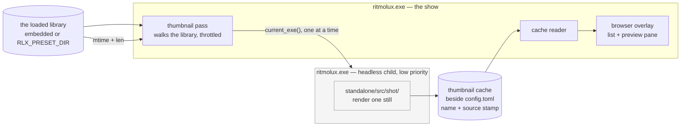

# 0206 — The browser shows the look

> **Status:** in-progress
> **Created:** 2026-09-19
> **Approved:** 2026-09-19 (user)
> **Owner skill(s):** dev
> **Related ADRs:** [0230](../adrs/0230-thumbnails-are-rendered-by-a-subprocess-of-the-player-itself.md)
> (proposed), [0011](../adrs/0011-image-crate-for-capture-tooling.md),
> [0010](../adrs/0010-accept-gpu-driver-memory-floor.md),
> [0014](../adrs/0014-preset-dir-override-for-dev-iteration.md),
> [0228](../adrs/0228-a-preset-mark-is-user-state-keyed-by-name-in-its-own-file.md)

## TL;DR

The browser lists 114 identifiers and an identifier does not say what a preset looks like. This
plan gives the highlighted preset a **picture**, beside the list rather than instead of it: a
still, rendered on the user's own machine by a low-priority **subprocess of the player itself**,
cached beside `config.toml`, and re-rendered when the preset's file changes. The first visible
behaviour is a preview pane that fills in as you walk the roster.

## Context & problem

**[Plan 0205](done/0205-the-library-becomes-navigable.md) narrows the list; it does not make the list
legible.** Family filters, favourites and marks all reduce 114 names to fewer names. Choosing still
means recognising `analytic_echoplate` or opening it to find out, and that is the actual friction
this plan exists to remove. 0205 recorded it as a followup for exactly this reason.

**Three measurements decided the mechanism, and they are in
[ADR-0230](../adrs/0230-thumbnails-are-rendered-by-a-subprocess-of-the-player-itself.md).** On this
project's development box on 2026-09-19: the release exe is **10,971,648 B** against
[NFR §4](../nfr.md#4-size-and-dependencies)'s **10,000,000 B** soft cap, so it is already 9.7 %
over; a 160x90 still costs **42,994 B**, so the shipped set is ~4.9 MB of pictures; and one still
costs **5.65 s** at 300 frames, so covering the library is ~10.7 minutes. Those three between them
rule out embedding, rule out a shipped pack, and price the generation this plan performs.

**A still is not a screenshot here.** Most of the families worth a picture accumulate, and
[backlog 0254](../design-backlog.md) records that hop 300 is *before* an accumulating world
exists — so the frame count is part of what a thumbnail *is*, not an implementation detail.

## Decision

We will **generate thumbnails locally, in a subprocess of the player**, and show them in a
**preview pane beside the existing list**.

The interview settled five things, each against a named alternative. The pictures are generated
rather than shipped, because the binary has no room and a pack cannot cover a `RLX_PRESET_DIR`
library. The work runs in a separate process rather than as an in-process tenant on a frame budget,
because frame-loop isolation should be a property rather than a tuned number — ADR-0230's
Alternative A. The pass runs **in the background from launch**, covering the whole library whether
or not the browser is opened, rather than lazily per tile as you scroll, because a grid filling in
at ~5.6 s a tile while you watch is the worst of both. A tile is **a still**, not a loop, because
the cost multiplies by the frame count and the still is already expensive. And the browser **keeps
its column list and gains a pane**, rather than becoming a grid, because the list's density and its
type-to-filter are worth more than tiling — a grid shows fewer presets at once, which is the
opposite of the problem.

**Amended 2026-09-24, when the plan parked at Phase 2:** the shell has no way to put pixels on
screen. `Renderer::queue_text` is the only drawing call it has, and the device, the queue and the
surface stay private inside `core`, per ADR-0001 and ADR-0009. We will add an image layer in `core`,
next to the text layer and behind the same `text` feature. That is the same reasoning ADR-0009
applied to text: the device lives in `core`, and a feature flag, not a crate boundary, keeps the
layer out of the default build and the core suite. (It does not keep it out of the plugin build:
`core-cabi` enables `text` for the now-playing banner, so the plugin compiles the layer and builds
no GPU object of it, because nothing there calls it. Corrected at the close, 2026-09-26.) Two alternatives were rejected. Handing the shell the device and
queue would widen exactly the boundary ADR-0001 draws. A text-only pane, a name plus a palette
swatch, would not show the look, and showing the look is what this plan is for. The owner set the
one condition this layer has to meet: it must not cost the app anything. A frame with no image
queued therefore pays nothing, and Phase 2 holds that as a done-when.

## Architecture diagram



The child shares no device and no queue with the show — that separation is ADR-0230's whole
argument, and it is why the edge between them is a process boundary rather than a function call.

## Implementation phases

Every phase is `dev`. There is no studio work: the studio has its own preset list and gaining
pictures there is a separate question with a separate protocol cost.

### Phase 1 — One thumbnail, on demand, in a cache

- **Owner skill:** dev
- **What:** The headless render mode on `ritmolux`, and the cache it writes to.
- **Files touched:** a new `standalone/src/thumbs.rs` (cache paths, stamp, read/write),
  `standalone/src/cli.rs`, `standalone/src/main.rs`, `docs/configuration.md`.
- **Done when:** invoking the binary in the new mode for one preset writes exactly one cached
  image, and running it again for the same unchanged preset is a no-op that reports why. The cache
  entry records the preset **name** and a **stamp** of the source file (modification time and
  length); the mode is not advertised in `--help`'s ordinary surface, because it exists for the
  parent process rather than for a person. A cache directory that cannot be created disables the
  feature and says so once in `diagnostics.log` — never a failure to start, per
  [ADR-0228](../adrs/0228-a-preset-mark-is-user-state-keyed-by-name-in-its-own-file.md)'s precedent
  that user state may be lost but may not prevent launch.

### Phase 2 — The renderer draws one image the shell hands it

- **Owner skill:** dev
- **What:** A shell-facing image layer beside the text layer (amended 2026-09-24, see the note
  under `## Decision`). The shell sets one RGBA8 image, and the renderer uploads it once into a
  texture it keeps. Each frame the shell may queue a rectangle to draw that image into, the same way
  it queues `TextRun`s. The draw happens inside the pass that already draws the text, before the
  text, so a label can sit on top of the picture. Illustrative shape: `set_overlay_image(Option<
  OverlayImage { rgba: &[u8], width, height }>)` and `queue_image(ImageRect { x, y, w, h })`.
- **Files touched:** a new `core/src/render/image_layer.rs` (carrying the hot-path pragma, since
  `render/` is in the hygiene scan set), `core/src/render/mod.rs`, `core/src/render/tests.rs`,
  `core/Cargo.toml` only if the feature wiring needs it, `standalone/src/hud.rs`.
- **Done when:**
  - **A frame with no queued image costs what it costs today.** No texture, pipeline or bind
    group exists until the first `set_overlay_image`, and a frame with nothing queued records no
    draw call. A test holds the first half with a plain renderer, the way Plan 0223 Phase 1 held
    that no query set exists.
  - **Setting an image is the only upload.** A frame that only queues a rectangle writes no
    texture and allocates nothing. The texture is reallocated only when the image's dimensions
    change.
  - **A still reads back as `shot` wrote it.** A headless test sets a known image, queues it over
    a flat scene and reads back the rectangle, within the capture path's existing tolerance. The
    texture format matches how the cache bytes are encoded, so no colour step is applied twice.
  - The layer compiles only under the `text` feature, so the plugin's cdylib, the default build
    and the core suite without that feature carry none of it.

### Phase 3 — The pane shows what is cached

- **Owner skill:** dev
- **What:** The browser gains a preview pane reading the cache. Valuable before anything fills it
  automatically, because Phase 1's mode can populate it by hand.
- **Files touched:** `standalone/src/overlay.rs`, `standalone/src/overlay/tests.rs`,
  `standalone/src/hud.rs` (reads the cache entry when the highlight changes and draws through Phase
  2's layer), `standalone/src/thumbs.rs` (the reader), `docs/running.md`.
- **Done when:** highlighting a preset in the browser shows its cached still beside the list, and
  the list keeps its columns, its wrapping and its type-to-filter unchanged. **A preset with no
  cached image shows its name and a placeholder** — that is a normal state on first launch and it
  must read as "not yet" rather than as breakage. The pane does not shift the list's layout as
  images arrive, because a roster that reflows while you are arrowing through it is worse than one
  with no pictures.

### Phase 4 — The pass fills the cache by itself

- **Owner skill:** dev
- **What:** The background walk — spawn, throttle, stop, report.
- **Files touched:** `standalone/src/thumbs.rs`, `standalone/src/app_state.rs`,
  `standalone/src/diaglog.rs`, `docs/configuration.md`, `docs/running.md`.
- **Done when:**
  - **The show's frame timing is unaffected while the pass runs**, measured as a frame-time
    comparison with the pass on and off in the same session on the same adapter. State the reading
    with its machine, per [ADR-0071](../adrs/0071-a-numeric-test-contract-states-a-property-or-names-its-machine.md);
    this is a measurement, not a property, and it must not be asserted universally.
  - **At most one child runs at a time**, at low OS priority, and the pass stops when the library
    is covered. It resumes on the next launch for whatever is still missing.
  - **The pass never blocks the frame loop, and never blocks shutdown.** Closing the app while a
    child is running terminates it; a half-written cache entry is discarded rather than read back.
  - **It gives up rather than looping.** A child that fails to produce an image is not retried
    indefinitely; the failure and its preset are named once in `diagnostics.log`. This is where a
    machine with no second GPU context, or an endpoint scanner blocking repeated spawns
    (ADR-0230's stated cost), stops being a mystery.
  - **It can be turned off** — a `config.toml` key and a settings row, because a user on battery or
    on a locked-down machine needs the app to stop trying.

### Phase 5 — A changed preset gets a new picture

- **Owner skill:** dev
- **What:** Staleness, which is what makes this usable in the authoring loop.
- **Files touched:** `standalone/src/thumbs.rs`, `standalone/src/overlay.rs`, `docs/running.md`.
- **Done when:** editing a preset in a `RLX_PRESET_DIR` library — which already hot-reloads
  ([ADR-0014](../adrs/0014-preset-dir-override-for-dev-iteration.md)) — invalidates its cached
  image by the stamp and re-renders it, without a restart and without re-rendering anything else.
  While the new image is in flight the pane shows the old one rather than a placeholder, because a
  slightly stale picture is more useful than none. A preset whose file is edited *while* its child
  is rendering ends with the cache matching the **newer** stamp or with no entry at all, never with
  an image labelled as the new one that shows the old.

## Data shapes

```rust
// illustrative — not the final interface

/// One cache entry's identity. The name is the preset's, as everywhere else
/// (spec 0001, ADR-0228); the stamp is what makes it stale.
struct ThumbKey {
    name: String,
    source_mtime: SystemTime,
    source_len: u64,
}
```

## Risks & open questions

- **The first-launch experience is the weakest part of this design, and it is what a new user
  meets.** For the first minutes the pane is mostly placeholders. Phase 4 does not add a progress
  UI; if that reads as broken rather than as filling, the answer is a visible indication of
  progress and it is a followup, not a silent widening.
- **A second GPU context may not be available.** ADR-0010 recorded the driver memory floor once;
  the pass pays it twice while running. On a constrained machine the child may fail to start at
  all, which Phase 4 handles by giving up and saying so — but the *feature* is then simply absent,
  and nothing in this plan makes it work there.
- **Repeated process spawns can look like malware.** 114 launches of one executable in minutes is a
  pattern endpoint security throttles. It is named in ADR-0230 and handled only by reporting.
- **The frame count is a judgement no instrument can check.** 300 hops is where the gallery cards
  sit and backlog 0254 argues it is already too early for accumulating worlds. This plan does not
  settle that; a thumbnail that shows an undeveloped world is a look call, and if the shipped
  choice is wrong the fix is a different constant argued in the open.
- **Nothing prunes the cache.** The same standing cost ADR-0228 accepted for marks, for the same
  reason.
- **Open question:** should the pass prefer presets near the cursor once the browser is open?
  Locality would make the pane fill where you are looking rather than in roster order. It is not in
  scope here because it complicates a pass whose first job is to terminate, but it is the obvious
  second move if the fill order feels wrong.

## What this plan does NOT do

- **It does not replace the list with a grid.** The pane sits beside the roster; density and
  type-to-filter are kept deliberately.
- **It does not animate anything.** A still per preset — a loop multiplies storage and render cost
  by its frame count, and the still is already the expensive part.
- **It does not ship any picture.** Nothing enters the binary, the zip or `presets/`.
- **It does not touch the C ABI or the control protocol**, so neither the foobar component nor the
  studio gains thumbnails. It does touch `core` once, in Phase 2: an image layer behind the `text`
  feature. The component's build does enable that feature, for its now-playing banner, so it
  compiles the layer and never builds a GPU object of it (corrected at the close, 2026-09-26). That line originally read "does not touch
  `core`", and it was amended on 2026-09-24. The studio's own preset list is a separate question and would
  cost a protocol widening.
- **It does not re-derive NFR §4's size cap**, though this plan is what discovered the cap is
  breached. That measurement wants its own backlog entry and its own decision, and hanging it on a
  thumbnail plan would bury it.
- **It does not add a progress indicator** — see the first risk.

## Implementation log

> Written by the lane — one row per phase as that phase's commit lands, and the close block after
> the last one. **The phases above are the contract; everything here is what happened.**

**Lane:** `plan-0206-the-browser-shows-the-look` in `/home/igor/Work/rlx-plan-0206`

| phase | owner | state | commit |
|---|---|---|---|
| 1 — One thumbnail, on demand, in a cache | dev | done | 7bd7fc9f |
| 2 — The renderer draws one image the shell hands it | dev | done | ab582b1b |
| 3 — The pane shows what is cached | dev | done | 9f710df5 |
| 4 — The pass fills the cache by itself | dev | done; frame-time reading taken by the owner 2026-09-26 | 4aeb28c8 |
| 5 — A changed preset gets a new picture | dev | done | e93783d0 |

### Notes

**Phase 1 — two files beyond the phase's list, and one done-when clause not met as stated.**

- The mode's own contract — one invocation writes one image, a second for the same unchanged preset
  writes nothing — is observable only from outside the process, so it is asserted by a new
  `standalone/tests/suite/thumb_cli.rs` (wired into `standalone/tests/suite/main.rs`). Neither file
  is in the phase's `Files touched`. The render it costs measured 1.7 s on this Linux box, and it
  skips with a printed reason where there is no adapter, the rule `shot_cli` follows.
- The clause *"a cache directory that cannot be created disables the feature and says so once in
  `diagnostics.log`"* is **not met in this phase**, because in this phase nothing in the app reads
  the cache and so there is no feature to disable. What landed is the sentence and the check:
  `thumbs::ensure_cache_dir` returns the reason, and `thumbs::unavailable_note` is the one line both
  the child and the pass write, so the two cannot describe the condition two ways. The `--thumb`
  child prints that line on standard error and exits 1. The app-side half — write it once to
  `diagnostics.log` and stop trying — belongs to Phase 3's pass, whose `Files touched` names
  `diaglog.rs`.
- A cache entry is a fixed header plus raw RGBA8 rows, not a PNG: ADR-0011 keeps `image` a
  dev-dependency, so the shipped binary has no codec to encode or decode one with. ADR-0230 states
  the same constraint when it rules out embedding.
- `--thumb` is rostered in a second roster, `cli::INTERNAL_FLAGS`, rather than in `FLAGS`. Both are
  needed: the roster gate refuses any flag-shaped argument no roster names, so an unrostered
  `--thumb` would be refused on the very invocation the pass makes, while `FLAGS` is what `--help`
  prints and what `nearest_flag` corrects typos to. Three existing roster tests now read both
  rosters.

**Phase 2 — parked, not started: there is no seam to draw an image through.**

The engine's only public drawing surface for the shell is `Renderer::queue_text`, which takes
`TextRun { text, x, y, size, color }` — one line of text, one colour. `core/src/render/mod.rs`
exposes no function that accepts pixels: nothing named `rgba`, `image`, `pixels` or `texture`, and no
`pub fn` in the crate takes a `&[u8]`. The console's second surface is the same primitive
(`present_aux(&[TextRun])`), and `Renderer` keeps its device, queue and surface private and owns the
acquire/present inside `render`, so the shell has nowhere to insert a pass of its own even though
`rlx_core` re-exports `wgpu`.

So *"highlighting a preset in the browser shows its cached still beside the list"* needs a new
image-blit entry point on the renderer plus a draw site in `hud.rs`. Both are outside Phase 2's
`Files touched` (`overlay.rs`, `overlay/tests.rs`, `docs/running.md` — `overlay.rs` is pure, window-
free and draws nothing), and the first is ruled out by this plan's own *"It does not touch `core`"*.
Phases 3 and 4 are not blocked by the same wall — the pass and the staleness rule need no pixels on
screen — but Phase 4's *"the pane shows the old one rather than a placeholder"* is a claim about
Phase 2's pane, so the run stops here rather than skipping past it.

Two ways out, and the choice is the architect's: widen the plan with a core image-overlay phase (and
say whether the "does not touch `core`" line meant the C ABI and the protocol rather than the crate),
or re-specify the pane in terms of what the text layer can actually draw.

**Architect, 2026-09-24: the plan was amended and the phases renumbered.** A new Phase 2 adds the
image layer this note asked for. The pane is now Phase 3, the pass Phase 4 and staleness Phase 5.
Where the notes above say "Phase 2", "Phase 3" or "Phase 4", they use the old numbers.

**Phase 2 (new numbering) — one file beyond the list, one untouched, one done-when premise false.**

- `core/src/render/composite.rs` is edited and is not in `Files touched`: the pass that draws the
  text is opened in `encode_on_canvas` there, not in `mod.rs`, so drawing inside that pass means
  editing it. It now opens when either the text or the image has something to draw.
- `standalone/src/hud.rs` is not touched in this phase. Nothing in Phase 2's done-when needs the
  shell to call the layer; the first caller is Phase 3's pane.
- *"The layer compiles only under the `text` feature, so the plugin's cdylib … carry none of it"*:
  the first half holds, the second does not. `core-cabi/Cargo.toml` depends on `rlx-core` with
  `features = ["text"]` (the now-playing banner), so the plugin's cdylib compiles this layer in, as
  it already compiles glyphon. It builds no GPU object there, because nothing in the plugin calls
  `set_overlay_image`. The default build and `-p rlx-core` without the feature carry none of it:
  `cargo clippy -p rlx-core --all-targets -- -D warnings` is clean.
- The first-half test holds that no object of the layer exists with a counter the layer keeps, not
  with a wgpu resource count. The same counters hold "setting is the only upload".

**Phase 3 — where the pane sits, and two files beyond the list.**

- The pane is anchored to the output's **bottom-right corner**, and `overlay::layout` is not told
  about it, so the list's columns are exactly what they were. Reserving a band for the pane on the
  right was tried first and dropped: at 1920x1080 it takes the 114-preset library from four columns
  to three and makes it scroll. `the_pane_is_clear_of_the_shipped_librarys_rows` asserts that no
  placed row of a 114-row list meets the pane at 1920x1080 or 2560x1440. A longer library, or a
  smaller window where the last column reaches the corner, draws its rows over the picture (the
  text is drawn after the image).
- The pane is drawn only on the output. With the operator console open the browser is drawn on the
  console, which has no image layer, so there is no pane there, and `docs/running.md` says so.
- The record of which preset's picture the renderer holds (`overlay::PaneSlot`) is a field of
  `OverlayState`, because the state `hud.rs` can reach lives in `app_state.rs`, which this phase
  does not list.
- `standalone/src/thumbs.rs` line 519 carried the word the comment-hygiene gate rejects (`no
  longer`, from Phase 1). It is reworded here. `core/src/render/image_layer.rs` from Phase 2 had
  the same problem (`previously`) and is reworded in this commit, although that file is not in
  Phase 3's list.

**Phase 4 — the frame-time reading is not taken, and six files are beyond the list.**

- **Done-when not met: *"the show's frame timing is unaffected while the pass runs, measured … with
  the pass on and off in the same session on the same adapter"*.** No reading was taken. The
  conductor session that implemented the phase is headless. The windowed app has no timed exit, and
  the headless `--stream` run does not start the pass, so the session cannot run the comparison.
  The instrument is in place instead. Every pass writes `# thumbnail pass: start, N of M presets to
  render` and a closing `# thumbnail pass: done|stopped|gave up …` line to `diagnostics.log`,
  between the 1 Hz rows. The rows between those two lines are "pass on", and the rows after the
  closing line are "pass off", in one session on one adapter. A first launch with an empty
  `thumbnails/` directory covers the whole library, and `[thumbnails] enabled = false` gives a
  whole session with the pass off. The reading needs someone at a display.
- The config key and the settings row the done-when asks for need `standalone/src/config.rs`
  (`[thumbnails] enabled`) and `standalone/src/settings.rs` (the `Thumbnails` row), neither of which
  is in `Files touched`. Adding a `SettingsView` field also moved `standalone/src/stream.rs` (the
  headless run's view reports `false`, because no pass runs there), `standalone/src/settings/tests.rs`
  (the fixture, the pinned row roster, the row's action) and `standalone/src/console/tests.rs` (the
  fixture). `standalone/src/hud.rs` changes one comment, from a seventeen-row menu to an eighteen-row
  one. `standalone/src/diaglog.rs` is not touched: `DiagLog::note` already writes a one-off line.
- The pass runs on its own thread (`thumbs::Pass`). The frame loop only drains a channel. On Unix a
  child runs under `nice -n 10`, falling back to normal priority, with one note, where `nice` is
  absent. On Windows it runs with `BELOW_NORMAL_PRIORITY_CLASS | CREATE_NO_WINDOW`, and that branch
  was neither compiled nor run on this Linux box. A child is killed and counted as failed after
  60 s. Three failures in a row stop the pass for the launch.
- The three stub-driven tests of the pass (one child at a time, give-up, stop kills the child) are
  `#[cfg(unix)]`, because the stand-in for the player is a shell script.
- A picture that lands makes the pane look its highlighted preset up again, whichever preset
  landed: one small file read per landed picture.

**Phase 4 — the owner's frame-time reading, 2026-09-26.** Build 4aeb28c8 in release, on the
reference laptop (Arch, kernel 7.2.5, Hyprland 0.56.2, music playing, Rich pinned by
`config.toml`). Shipped Leviathan, fullscreen at 2560x1440 on the 165 Hz panel, with an empty
`thumbnails/`, so one session covers the whole 116-preset library. Rows come from
`diagnostics.log`, split by the pass's own `start` and `done` lines, with the first 6 rows after
`start` dropped as startup. Each session ran 120 s past `done`.

| adapter | pass | length | fps median | fps min | p99 ms median | p99 ms max | rows < 60 fps |
|---|---|---|---|---|---|---|---|
| RTX 3080 (unflagged default) | on | 59 s | 164.9 | 164.7 | 7.53 | 8.72 | 0 |
| RTX 3080 (unflagged default) | off | 120 s | 164.9 | 163.5 | 6.40 | 8.27 | 0 |
| AMD RADV RENOIR (`--gpu AMD`) | on | 1634 s | 24.4 | 21.4 | 49.58 | 76.77 | 1513 of 1607 |
| AMD RADV RENOIR (`--gpu AMD`) | off | 122 s | 24.4 | 23.8 | 49.53 | 49.95 | 121 of 121 |

- Both passes ended `done, 116 rendered, 0 failed`. On the 3080 the pass took about 60 s, about
  0.5 s a preset. Beside an AMD-pinned show it took about 27 minutes, about 14 s a preset. The
  children are started without `--gpu`, and which adapter they drew on was not read.
- On AMD the median holds and the worst second does not. The pass-on window's max p99 is 76.8 ms,
  against 50.0 ms off, and its minimum is 21.4 fps, against 23.8. Its mean frame time is *lower*
  than the pass-off window's (37.8 ms against 41.1). That comes from two stretches of the music,
  rows 365-383 and 1294-1368 of the pass, where Leviathan itself ran at 60-98 fps, not from the
  pass. Leviathan at Rich is GPU-bound at 24 fps on this adapter either way.
- An earlier AMD session on the same day is not used: the session's idle lock fell in its pass
  window and froze the rows.

**Architect, 2026-09-26 (close): what this reading shows.** The done-when *"the show's frame timing
is unaffected while the pass runs"* holds on the RTX 3080. On the AMD RADV RENOIR iGPU it holds at
the median and not in the tail: the worst p99 moves from 50.0 ms to 76.8 ms and the lowest second
from 23.8 fps to 21.4. The children start without `--gpu` and their adapter was not read, so on this
hybrid laptop the pass and an AMD-pinned show may be competing for one GPU. That is a standing open
question, not a claim this plan makes good.

**Phase 5 — two files beyond the list, and a pass that no longer ends when covered.**

- `standalone/src/app_state.rs` is edited and is not in `Files touched`. The show's reload is seen
  only there, in `poll_presets`, so that is where the pass is told to walk again
  (`thumbs::Pass::rescan`). `poll_thumbnails` there now hands a landed name to
  `overlay::PaneSlot::landed`, which re-reads the pane only when the landed picture is the preset it
  holds. `standalone/src/overlay/tests.rs` carries that method's test and is not listed either.
- Phase 4's *"the pass stops when the library is covered"* now reads differently. A covered pass
  starts no child, but its worker thread stays alive, blocked in a receive with no timer, and wakes
  on a reload to walk the library again and render only what the stamps say is stale. A pass that
  gave up, was stopped or could not start a child stays ended for the launch.
- A preset that failed is not retried at the stamp it failed at. A walk after an edit to that
  preset's file does retry it.
- The child takes the stamp **before** it reads the library and again after the render, and writes
  nothing when the two differ (`thumbs::bracketed`). That run exits 0 with a line saying why, so
  the pass counts it in the `rendered` figure of its `done` line.
- The "stale picture while the new one renders" half needed no new code: `thumbs::cached_still`
  was already not held to the stamp, and an entry is replaced by a rename.
- The edit-then-re-render path was not exercised end to end in a running window. The tests drive
  the walk loop with a stub for the player, the stale-list selection against a scratch cache, and
  the stamp bracket with an edit made during a stand-in render.

### Close triggers

- **`presets/` touched:** no
- **Plan header `Closes:`** none
- **What shipped:** feature
- **Operator docs touched:** `docs/configuration.md`, `docs/running.md`
- **Backlog probes (`node scripts/check-backlog-claims.mjs`):** exit 0, 46 reductions across 21
  live entries hold (4 unprobeable), 30 advisory moved-path rows
- **Full suite:** owed to the conductor's pre-review gate (ADR-0207). Phase 5 ran
  `cargo nextest run -p standalone -P fast`: exit 0, 489 passed, 0 skipped
- **Outstanding `human` phases:** none

## Followups (after this lands)

- A progress indication for the first-launch fill, if the placeholder period reads as breakage.
- Fill order that prefers what the cursor is near, if roster order feels wrong.
- Thumbnails in the studio's preset list — a protocol question and its own ADR.
