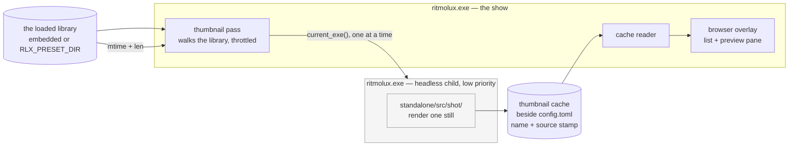

# 0206 — The browser shows the look

> **Status:** draft
> **Created:** 2026-09-19
> **Owner skill(s):** dev
> **Related ADRs:** [0230](../adrs/0230-thumbnails-are-rendered-by-a-subprocess-of-the-player-itself.md)
> (proposed), [0011](../adrs/0011-image-crate-for-capture-tooling.md),
> [0010](../adrs/0010-accept-gpu-driver-memory-floor.md),
> [0014](../adrs/0014-preset-dir-override-for-dev-iteration.md),
> [0228](../adrs/0228-a-preset-mark-is-user-state-keyed-by-name-in-its-own-file.md)

## TL;DR

The browser lists 114 identifiers and an identifier does not say what a preset looks like. This
plan gives the highlighted preset a **picture**, beside the list rather than instead of it: a
still, rendered on the user's own machine by a low-priority **subprocess of the player itself**,
cached beside `config.toml`, and re-rendered when the preset's file changes. The first visible
behaviour is a preview pane that fills in as you walk the roster.

## Context & problem

**[Plan 0205](0205-the-library-becomes-navigable.md) narrows the list; it does not make the list
legible.** Family filters, favourites and marks all reduce 114 names to fewer names. Choosing still
means recognising `analytic_echoplate` or opening it to find out, and that is the actual friction
this plan exists to remove. 0205 recorded it as a followup for exactly this reason.

**Three measurements decided the mechanism, and they are in
[ADR-0230](../adrs/0230-thumbnails-are-rendered-by-a-subprocess-of-the-player-itself.md).** On this
project's development box on 2026-09-19: the release exe is **10,971,648 B** against
[NFR §4](../nfr.md#4-size-and-dependencies)'s **10,000,000 B** soft cap, so it is already 9.7 %
over; a 160x90 still costs **42,994 B**, so the shipped set is ~4.9 MB of pictures; and one still
costs **5.65 s** at 300 frames, so covering the library is ~10.7 minutes. Those three between them
rule out embedding, rule out a shipped pack, and price the generation this plan performs.

**A still is not a screenshot here.** Most of the families worth a picture accumulate, and
[backlog 0254](../design-backlog.md) records that hop 300 is *before* an accumulating world
exists — so the frame count is part of what a thumbnail *is*, not an implementation detail.

## Decision

We will **generate thumbnails locally, in a subprocess of the player**, and show them in a
**preview pane beside the existing list**.

The interview settled five things, each against a named alternative. The pictures are generated
rather than shipped, because the binary has no room and a pack cannot cover a `RLX_PRESET_DIR`
library. The work runs in a separate process rather than as an in-process tenant on a frame budget,
because frame-loop isolation should be a property rather than a tuned number — ADR-0230's
Alternative A. The pass runs **in the background from launch**, covering the whole library whether
or not the browser is opened, rather than lazily per tile as you scroll, because a grid filling in
at ~5.6 s a tile while you watch is the worst of both. A tile is **a still**, not a loop, because
the cost multiplies by the frame count and the still is already expensive. And the browser **keeps
its column list and gains a pane**, rather than becoming a grid, because the list's density and its
type-to-filter are worth more than tiling — a grid shows fewer presets at once, which is the
opposite of the problem.

## Architecture diagram



The child shares no device and no queue with the show — that separation is ADR-0230's whole
argument, and it is why the edge between them is a process boundary rather than a function call.

## Implementation phases

Every phase is `dev`. There is no studio work: the studio has its own preset list and gaining
pictures there is a separate question with a separate protocol cost.

### Phase 1 — One thumbnail, on demand, in a cache

- **Owner skill:** dev
- **What:** The headless render mode on `ritmolux`, and the cache it writes to.
- **Files touched:** a new `standalone/src/thumbs.rs` (cache paths, stamp, read/write),
  `standalone/src/cli.rs`, `standalone/src/main.rs`, `docs/configuration.md`.
- **Done when:** invoking the binary in the new mode for one preset writes exactly one cached
  image, and running it again for the same unchanged preset is a no-op that reports why. The cache
  entry records the preset **name** and a **stamp** of the source file (modification time and
  length); the mode is not advertised in `--help`'s ordinary surface, because it exists for the
  parent process rather than for a person. A cache directory that cannot be created disables the
  feature and says so once in `diagnostics.log` — never a failure to start, per
  [ADR-0228](../adrs/0228-a-preset-mark-is-user-state-keyed-by-name-in-its-own-file.md)'s precedent
  that user state may be lost but may not prevent launch.

### Phase 2 — The pane shows what is cached

- **Owner skill:** dev
- **What:** The browser gains a preview pane reading the cache. Valuable before anything fills it
  automatically, because Phase 1's mode can populate it by hand.
- **Files touched:** `standalone/src/overlay.rs`, `standalone/src/overlay/tests.rs`,
  `docs/running.md`.
- **Done when:** highlighting a preset in the browser shows its cached still beside the list, and
  the list keeps its columns, its wrapping and its type-to-filter unchanged. **A preset with no
  cached image shows its name and a placeholder** — that is a normal state on first launch and it
  must read as "not yet" rather than as breakage. The pane does not shift the list's layout as
  images arrive, because a roster that reflows while you are arrowing through it is worse than one
  with no pictures.

### Phase 3 — The pass fills the cache by itself

- **Owner skill:** dev
- **What:** The background walk — spawn, throttle, stop, report.
- **Files touched:** `standalone/src/thumbs.rs`, `standalone/src/app_state.rs`,
  `standalone/src/diaglog.rs`, `docs/configuration.md`, `docs/running.md`.
- **Done when:**
  - **The show's frame timing is unaffected while the pass runs**, measured as a frame-time
    comparison with the pass on and off in the same session on the same adapter. State the reading
    with its machine, per [ADR-0071](../adrs/0071-a-numeric-test-contract-states-a-property-or-names-its-machine.md);
    this is a measurement, not a property, and it must not be asserted universally.
  - **At most one child runs at a time**, at low OS priority, and the pass stops when the library
    is covered. It resumes on the next launch for whatever is still missing.
  - **The pass never blocks the frame loop, and never blocks shutdown.** Closing the app while a
    child is running terminates it; a half-written cache entry is discarded rather than read back.
  - **It gives up rather than looping.** A child that fails to produce an image is not retried
    indefinitely; the failure and its preset are named once in `diagnostics.log`. This is where a
    machine with no second GPU context, or an endpoint scanner blocking repeated spawns
    (ADR-0230's stated cost), stops being a mystery.
  - **It can be turned off** — a `config.toml` key and a settings row, because a user on battery or
    on a locked-down machine needs the app to stop trying.

### Phase 4 — A changed preset gets a new picture

- **Owner skill:** dev
- **What:** Staleness, which is what makes this usable in the authoring loop.
- **Files touched:** `standalone/src/thumbs.rs`, `standalone/src/overlay.rs`, `docs/running.md`.
- **Done when:** editing a preset in a `RLX_PRESET_DIR` library — which already hot-reloads
  ([ADR-0014](../adrs/0014-preset-dir-override-for-dev-iteration.md)) — invalidates its cached
  image by the stamp and re-renders it, without a restart and without re-rendering anything else.
  While the new image is in flight the pane shows the old one rather than a placeholder, because a
  slightly stale picture is more useful than none. A preset whose file is edited *while* its child
  is rendering ends with the cache matching the **newer** stamp or with no entry at all, never with
  an image labelled as the new one that shows the old.

## Data shapes

```rust
// illustrative — not the final interface

/// One cache entry's identity. The name is the preset's, as everywhere else
/// (spec 0001, ADR-0228); the stamp is what makes it stale.
struct ThumbKey {
    name: String,
    source_mtime: SystemTime,
    source_len: u64,
}
```

## Risks & open questions

- **The first-launch experience is the weakest part of this design, and it is what a new user
  meets.** For the first minutes the pane is mostly placeholders. Phase 3 does not add a progress
  UI; if that reads as broken rather than as filling, the answer is a visible indication of
  progress and it is a followup, not a silent widening.
- **A second GPU context may not be available.** ADR-0010 recorded the driver memory floor once;
  the pass pays it twice while running. On a constrained machine the child may fail to start at
  all, which Phase 3 handles by giving up and saying so — but the *feature* is then simply absent,
  and nothing in this plan makes it work there.
- **Repeated process spawns can look like malware.** 114 launches of one executable in minutes is a
  pattern endpoint security throttles. It is named in ADR-0230 and handled only by reporting.
- **The frame count is a judgement no instrument can check.** 300 hops is where the gallery cards
  sit and backlog 0254 argues it is already too early for accumulating worlds. This plan does not
  settle that; a thumbnail that shows an undeveloped world is a look call, and if the shipped
  choice is wrong the fix is a different constant argued in the open.
- **Nothing prunes the cache.** The same standing cost ADR-0228 accepted for marks, for the same
  reason.
- **Open question:** should the pass prefer presets near the cursor once the browser is open?
  Locality would make the pane fill where you are looking rather than in roster order. It is not in
  scope here because it complicates a pass whose first job is to terminate, but it is the obvious
  second move if the fill order feels wrong.

## What this plan does NOT do

- **It does not replace the list with a grid.** The pane sits beside the roster; density and
  type-to-filter are kept deliberately.
- **It does not animate anything.** A still per preset — a loop multiplies storage and render cost
  by its frame count, and the still is already the expensive part.
- **It does not ship any picture.** Nothing enters the binary, the zip or `presets/`.
- **It does not touch `core`, the C ABI or the control protocol**, so neither the foobar component
  nor the studio gains thumbnails. The studio's own preset list is a separate question and would
  cost a protocol widening.
- **It does not re-derive NFR §4's size cap**, though this plan is what discovered the cap is
  breached. That measurement wants its own backlog entry and its own decision, and hanging it on a
  thumbnail plan would bury it.
- **It does not add a progress indicator** — see the first risk.

## Implementation log

> Written by the lane — one row per phase as that phase's commit lands, and the close block after
> the last one. **The phases above are the contract; everything here is what happened.**

**Lane:** _(to be filled)_

| phase | owner | state | commit |
|---|---|---|---|
| 1 — One thumbnail, on demand, in a cache | dev | not started | |
| 2 — The pane shows what is cached | dev | not started | |
| 3 — The pass fills the cache by itself | dev | not started | |
| 4 — A changed preset gets a new picture | dev | not started | |

### Notes

### Close triggers

- **`presets/` touched:**
- **Plan header `Closes:`** none
- **What shipped:**
- **Operator docs touched:**
- **Backlog probes (`node scripts/check-backlog-claims.mjs`):**
- **Full suite:**
- **Outstanding `human` phases:**

## Followups (after this lands)

- A progress indication for the first-launch fill, if the placeholder period reads as breakage.
- Fill order that prefers what the cursor is near, if roster order feels wrong.
- Thumbnails in the studio's preset list — a protocol question and its own ADR.
