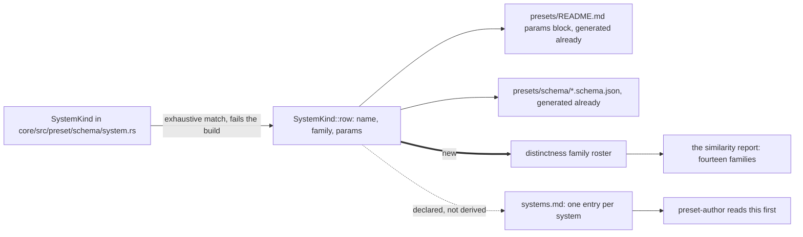

# 0209 — A system joins the instruments by existing

> **Status:** in-progress
> **Created:** 2026-09-19
> **Approved:** 2026-09-19 (user) — approved and deliberately NOT in `tools/conductor/queue.json`
> **Owner skill(s):** dev, human (Phase 5 is a `preset-author` session — see Risks)
> **Related ADRs:** [0234](../adrs/0234-an-instruments-system-roster-is-derived-from-the-enum-the-engine-reads.md)
> (proposed), [0022](../adrs/0022-build-time-preset-embedding.md),
> [0170](../adrs/0170-a-parameters-reference-row-is-generated-from-the-declaration-the-engine-reads.md),
> [0202](../adrs/0202-a-written-count-of-the-systems-is-refused-by-a-gate.md)
> **Closes:** design-backlog 0258
> **Takes:** design-backlog 0256 — the **instrument half** only. That entry stays live for the curation
> question behind it, whose evidence is what [Plan 0205](done/0205-the-library-becomes-navigable.md) builds.

## TL;DR

Two hand-written rosters enumerate this engine's systems and both silently fell behind the same four:
`distinctness`'s `[(SystemKind, &str); 9]` leaves 35 of 114 shipped presets with no similarity check,
and the content lane's `systems.md` leaves 26 of them with no authoring guidance. This plan derives the
first from `SystemKind` so a variant with no family name fails the build, declares an entry per system
in the second so a hole is visible, and writes the four missing sections. The first visible behaviour is
a `distinctness` report with fourteen families in it.

## Context & problem

**The instrument.** `core/tests/distinctness.rs` is the one thing in this repository that asks whether
two shipped presets have converged, and it reads its roster from a hand-written array. Five shipped
families are absent — `analytic_field` (12 presets), `shape_field` (9), `warp_mesh` (7),
`shape_collage` (4), `cellular` (3) — which is 35 of 114 presets with no similarity check of any kind,
and `analytic_field` is among the largest families in the set. [`docs/testing.md`](../testing.md)
states the consequence plainly: *"a new `SystemKind` does not appear in it on its own and nothing fails
when one is missing."* Both prose carriers that name the absent families name three of the five, because
`analytic_field` and `cellular` shipped afterwards and nothing made them notice (backlog 0256).

**The catalogue.** `.claude/skills/preset-author/references/systems.md` carries what the generated
parameter roster cannot: what a scene is *for*, the working range of each param distilled from the
shipped set, and which audio input it rides. It has a per-scene section for ten systems and none for
`warp_mesh`, `shape_collage`, `analytic_field` or `cellular`. The lane that composes preset content
therefore works from a catalogue silent on the systems behind a quarter of the library, and the file
never claims a roster, so its roster cannot look wrong (backlog 0258).

**Neither is a discipline problem, and the proof is in the code.** Four lines above the array it is
wrong about, `distinctness.rs`'s own comment says: *"A count is a fine reason to leave a family out and
a terrible one to leave written down, because it stops being true silently."* The sentence is correct
and the list under it is stale in exactly the way it describes.

**This project has already solved this twice.**
[ADR-0022](../adrs/0022-build-time-preset-embedding.md) made a preset ship by existing;
[ADR-0170](../adrs/0170-a-parameters-reference-row-is-generated-from-the-declaration-the-engine-reads.md)
made a parameter row generate from the declaration the engine reads. `SystemKind::row` is already the
exhaustive match that fails the build when a variant has no entry. The mechanism is present and these
two instruments do not use it.

## Decision

Per [ADR-0234](../adrs/0234-an-instruments-system-roster-is-derived-from-the-enum-the-engine-reads.md),
**an instrument that enumerates systems derives its roster from `SystemKind`, and a variant with no
entry fails the build.** Where the roster's *content* is human judgement and cannot be derived — the
catalogue's per-scene guidance — the roster is **declared** instead, with an entry per system even when
that entry says no guidance is written yet, because a declared hole is probeable and a silence is not.

We rejected a gate comparing the array to `SystemKind` (more machinery for less: it makes the
divergence representable and then reports it, and adds a third place the roster is written down), and
deriving the roster from shipped filenames instead of the enum (blind in the case that matters — a
system shipped with no presets yet tracks the content rather than the engine).

## Architecture diagram

## Implementation phases

### Phase 1 — the similarity roster derives from the enum
- **Owner skill:** dev
- **What:** `distinctness`'s hand-written `FAMILIES` array is replaced by a derivation over
  `SystemKind::ALL`, with the per-variant family name coming from an exhaustive match so a new variant
  is a compile error until it is named.
- **Files touched:** `core/tests/distinctness.rs`, and `core/src/preset/schema/system.rs` if the family
  name belongs beside `SystemKind::row` rather than in the test.
- **Done when:** the report covers all fourteen families rather than nine, and adding a `SystemKind`
  variant without giving it a family name **fails to compile** rather than dropping it from the report.
  Demonstrate the second by the same means `SystemKind::row` is already demonstrated — the exhaustive
  match is the mechanism, so a variant added in a scratch edit produces a compiler error naming the
  missing arm.

### Phase 2 — the report is read, and the thresholds are judged against what arrived
- **Owner skill:** dev
- **What:** Run the widened report and record what five new families do to it, without tuning anything
  to make it quiet.
- **Files touched:** the plan's own `## Implementation log` (a recorded reading, not a code change), and
  `core/tests/distinctness.rs` only if the run is red rather than merely noisy.
- **Done when:** the run's near-duplicate flags for the five arriving families are recorded with the
  adapter and machine named ([ADR-0071](../adrs/0071-a-numeric-test-contract-states-a-property-or-names-its-machine.md)),
  and each flag is labelled *convincing*, *a threshold artefact*, or *undecided*. **Tuning a threshold
  to silence a flag is out of scope for this phase** — five families calibrated on nine families'
  thresholds is evidence about the thresholds, and a threshold moved before it is read is a threshold
  fitted to the noise. If the widened run fails outright rather than flagging, that is a red gate and it
  is fixed here.

### Phase 3 — the stale prose carriers stop naming a list
- **Owner skill:** dev
- **What:** The two places that name three of the five absent families stop naming a count or a list at
  all.
- **Files touched:** `docs/testing.md`, `core/tests/distinctness.rs` (the doc comment above the roster).
- **Done when:** `docs/testing.md` no longer says *"nine of the twelve"* and no longer lists the absent
  families, describing instead what the report now covers and how it stays covered;
  and `node scripts/check-system-counts.mjs` exits 0. `docs/testing.md` stays out of
  `check-reader-prose.mjs`'s list: it is a Contribute document, which keeps its bare Plan and ADR
  citations by design
  ([ADR-0168](../adrs/0168-the-reader-documents-address-a-reader-and-the-record-stays-a-link.md)).

### Phase 4 — the catalogue declares an entry per system
- **Owner skill:** dev
- **What:** `systems.md` gains a per-scene section for each of the four systems that has none, carrying
  only a declared placeholder — the system's name, its family, a pointer to the generated roster, and one
  line saying no authoring guidance is written yet.
- **Files touched:** `.claude/skills/preset-author/references/systems.md`.
- **Done when:** the file has a `## ` section for every `SystemKind`. Backlog 0258 moved to the archive
  when this plan was approved, so its four `absent:` probes no longer run and nothing goes red here —
  the plan's done-whens are the check now. **This phase cannot run under the
  conductor** — the CLI refuses a headless session an edit under `.claude/`
  ([ADR-0210](../adrs/0210-a-claude-repair-is-the-owners-and-a-session-that-needs-one-parks-with-the-edit.md))
  — and it is declared here with its literal path for exactly that reason.

### Phase 5 — the four sections get their guidance
- **Owner skill:** human
- **What:** In a `preset-author` session, replace each placeholder with real authoring guidance: what the scene is for, the working
  range of each param distilled from the shipped presets, and which audio input it naturally rides.
- **Files touched:** `.claude/skills/preset-author/references/systems.md`.
- **Done when:** each of the four sections carries the same three things the existing ten do, and each
  stated working range is traceable to the shipped presets it was distilled from — `analytic_field`'s 12,
  `warp_mesh`'s 7, `shape_collage`'s 4, `cellular`'s 3 — rather than to the engine's declared min and
  max. **Restating the generated parameter roster does not satisfy this phase**: the generated page
  already says what a param's default and range are, and the judgement this file exists for is what a
  useful value is and why. If a system's shipped presets are too few to distil a range from, say so in
  that section rather than inventing one.

## Risks & open questions

- **Phase 2 is where this plan can turn out to be about thresholds instead of rosters.** Five families
  arriving at once may flag pairs that are correct, or miss pairs that are not. The phase records rather
  than tunes, and a convincing flag is a curation finding that belongs to backlog 0256's live half, not
  to this plan.
- **Phases 4 and 5 both edit `.claude/`, so neither runs unattended.** The plan is approved unqueued.
  Phase 4 is separated from Phase 5 precisely so the mechanical half is one small commit and the
  judgement half is the lane's own work.
- **The declared placeholder is an invitation to fill it badly.** Generating four sections from the param
  tables would satisfy Phase 4's letter and defeat the file's purpose; Phase 5's done-when forbids it and
  nothing mechanical can. This is the plan's weakest guarantee and it is stated rather than papered over.
- **The close-ceremony sweep row is owed and nothing here carries it.** Backlog 0258 named the missing
  row as the mechanism that let this file drift, and its body is archived, so no probe will notice if the
  row is never added. It is architect bookkeeping at this plan's close; if it is skipped, the catalogue
  drifts a third time and this plan will have fixed only the instances.
- **`shape_field` is in backlog 0256's absent list and has nine shipped presets**, so Phase 1 widens the
  report by five families and not four. Phase 5's four sections are 0258's set; `shape_field` already has
  a catalogue section.

## What this plan does NOT do

- **It does not answer whether the library should ship less and better.** That is backlog 0256's live
  half, it needs a person and the app, and its evidence is the favourite/hidden marks
  [Plan 0205](done/0205-the-library-becomes-navigable.md) builds. This plan gives the question an instrument
  that covers the whole library and stops there.
- **It does not retire or replace any preset**, and it does not move a threshold to make a flag go away
  (Phase 2).
- **It does not add the close-ceremony sweep row** that would keep `systems.md` from drifting again —
  that is architect bookkeeping, not a phase, and the plan's close is where it lands.
- **It does not touch the generated parameter roster, the schemas, or `preset-guide.md`**, all of which
  already cover every system.

## Implementation log

> Written by `dev` — one row per phase as that phase's commit lands, and the close block after the
> last one. **The phases above are the contract; everything here is what happened.**

**Lane:** `plan-0209-a-system-joins-the-instruments-by-existing`, worktree `/home/igor/Work/rlx-plan-0209`

| phase | owner | state | commit |
|---|---|---|---|
| 1 — the similarity roster derives from the enum | dev | done | 17961a15 |
| 2 — the report is read, and the thresholds are judged | dev | done | 52c66c06 |
| 3 — the stale prose carriers stop naming a list | dev | done | ba62c093 |
| 4 — the catalogue declares an entry per system | dev | done | 8bf91ce1 |
| 5 — the four sections get their guidance | human | done | c46abfa2 |

### Notes

- **Phase 5 readings.** Each of the four sections was distilled from every shipped preset of its
  family, read in full on the lane at `8bf91ce1`, and each range in its table names the presets it
  came from. The counts differ from the done-when's: `cellular` ships **five** presets, not three,
  because Labyrinth and Wavefront landed after the plan was written (`a92857eb`). `analytic_field`
  12, `warp_mesh` 7 and `shape_collage` 4 match. Where the shipped set gives no range, the section
  says so: `shape_collage` `layout = 3` and a driven `larger_than_life` birth/survive window are
  used by no shipped preset. One header drift was found and is recorded in the cellular section
  rather than repaired, since it is content: `cellular_tide_bugs.toml` says mid widens `birth_hi`,
  but the file binds it as the constant `"0.385"`.

- Phase 1: the roster is not an iteration over `SystemKind::ALL`. nextest runs one named `#[test]`
  per family (ADR-0157), so `core/tests/distinctness.rs` names the fourteen in a `family_tests!`
  macro that also emits an exhaustive `match` over the same variants; the label is read from
  `SystemKind::as_str`. The hand-written `FAMILIES` array, its doc comment, the membership assert and
  the `every_curated_family_has_its_own_test` count pin are gone. Nothing moved in
  `core/src/preset/schema/system.rs`.
- Phase 1 demonstration, two scratch edits, both reverted: a `ScratchProbe` variant in `SystemKind`
  fails `cargo check -p rlx-core --tests` with E0004 at `SystemKind::row` (and four other lib
  matches) before the test file compiles; deleting the `Cellular` line from `family_tests!` fails
  `cargo check -p rlx-core --test distinctness` with E0004 *`SystemKind::Cellular` not covered* in
  the test's own match.
- Phase 2 reading. Command: `cargo nextest run -p rlx-core --test distinctness --no-capture`, at
  17961a15, on the Arch Linux box (x86_64, Linux 7.2.5), on the software adapter `common::headless`
  selects; the test prints no adapter description, so none is quoted. 14 tests run, 14 passed, 0
  skipped, 98.8 s. `NEAR_DUP_STRUCT` is 0.08, unchanged.
- **The five arriving families raise no near-duplicate flag.** Lowest off-diagonal `struct_diff` per
  family: `analytic_field` (12 presets) 0.162, Parabolic ~ Seahorse; `shape_field` (9) 0.186,
  Path Lion ~ Path Map; `warp_mesh` (7) 0.177, Sirocco ~ Smoke and Sirocco ~ Wellhead;
  `shape_collage` (4) 0.211, Nocturne ~ Suprematist; `cellular` (5, not the 3 the plan counts) 0.183,
  Ember ~ Labyrinth. With no flag there is nothing to label *convincing*, *a threshold artefact* or
  *undecided*. The shipped set counts 116 presets across the fourteen families, not 114.
- The only flags in the run are in `attractor`, a family already covered before this plan: six pairs
  among Lorenz Gallery, Valentine, Butterfly to Knot and Rho Walk, `struct_diff` 0.036 to 0.071.
  Recorded, not labelled; they are outside the five this phase reads.
- Phase 3: the doc comment above the roster that named the absent families left with the array in
  Phase 1 (17961a15), so this phase's edit to `core/tests/distinctness.rs` is the module header's
  dated cost note only, *"from six to all nine"* to *"from six families to nine"*.

- Phase 4 ran in an owner-started session, not under the conductor, because the CLI refuses a
  headless session an edit under `.claude/` (ADR-0210). Two things beyond the placeholder the phase
  names: each heading carries a short description taken from the scene module's own `//!` opening,
  as every other section's heading does, and the file's opening note, which said the four systems
  had no section, now says they have placeholders and points at Phase 5 and the archived backlog
  0258 instead of the live backlog.

### Close triggers

- **`presets/` touched:** no
- **Plan header `Closes:`** design-backlog 0258; **Takes:** 0256's instrument half
- **What shipped:** an integration test and docs/skill material; no shipped artifact changes
- **Operator docs touched:** `docs/testing.md`
- **Backlog probes (`node scripts/check-backlog-claims.mjs`):** 0256's four instrument-half probes
  went red on delivery; repaired at the close
- **Full suite:** the conductor's suite ledger record for tree 349a8f5, gate 0209-pre-review,
  2026-09-26: 1858 tests run, 1858 passed, 7 skipped
- **Outstanding `human` phases:** none (Phase 5 done, `c46abfa2`)

## Followups (after this lands)

- Phase 2's reading is the input to backlog 0256's curation question. If it convicts a family, that is a
  dated update to that entry rather than work here.
- Nothing yet derives a *declared* roster like `systems.md`'s from `SystemKind`. A probe or a gate over
  that file is the shape that would stop it drifting a third time.
