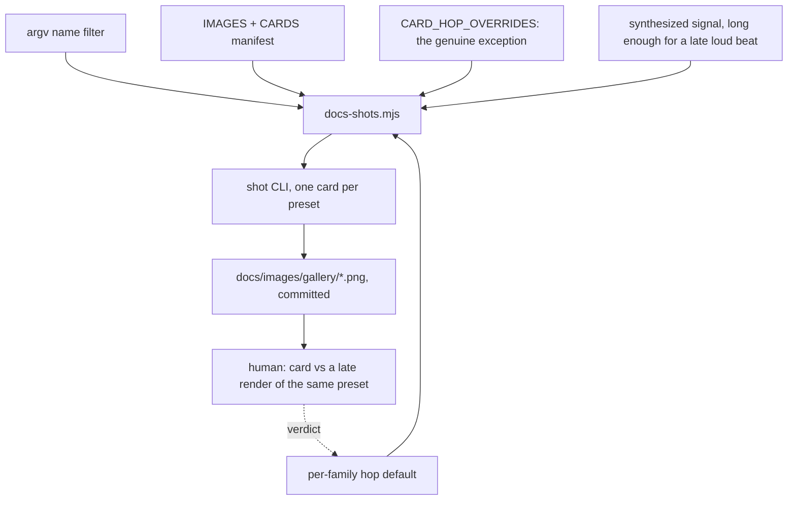

# 0210 — The gallery card shows the world it names

> **Status:** approved
> **Created:** 2026-09-19
> **Approved:** 2026-09-19 (user) — approved and deliberately NOT in `tools/conductor/queue.json`
> **Owner skill(s):** dev, human
> **Related ADRs:** [0235](../adrs/0235-a-gallery-cards-hop-is-chosen-per-family-and-the-signal-outlasts-it.md)
> (proposed), [0099](../adrs/0099-the-show-length-horizon-is-a-spot-check-and-it-splits-in-two.md),
> [0071](../adrs/0071-a-numeric-test-contract-states-a-property-or-names-its-machine.md)
> **Closes:** design-backlog 0254, 0255

## TL;DR

Every gallery card is captured at hop 300 — about 3.5 s of scene time — which is before a feedback
world exists at all: `warp_tracery`'s card shows seven separate lobes where the preset's own name is the
rosette they merge into thirty seconds later. This plan gives `docs-shots.mjs` a name filter so one card
can be re-rendered at all, then makes the hop a per-family default over a signal long enough that a late
hop is still a loud one. The first visible behaviour is
`node scripts/docs-shots.mjs warp_tracery` rendering exactly one card.

## Context & problem

**The card is the one picture most readers ever see of a preset**, and for the accumulating share of the
library it is taken before the world is there. `scripts/docs-shots.mjs` renders at `--frame-at 300`
unless the preset is in `CARD_HOP_OVERRIDES`, a roster holding four presets, all `swarm_*`, all at
hop 374. So the mechanism for *"this world needs longer"* exists, was used once, for one family, and
nothing generalized it (backlog 0254).

**A feedback field is not developed at 3.5 s and cannot be.** `warp_ladder`'s header records its own
horizon — coverage 0.408 at the 30 s row against 0.619 at 300 s, still filling for its first two
minutes. `warp_tracery`'s committed card, rendered 2026-09-18 at hop 300, shows the contours closed
around each of seven lobes; the same file at 30 s shows them merged into the rosette. Both pictures are
true and only one is the look. It is not one family: trails, a `[feedback]` table,
reaction-diffusion and the particle worlds all accumulate, and
[ADR-0099](../adrs/0099-the-show-length-horizon-is-a-spot-check-and-it-splits-in-two.md) already names
that set for a different purpose.

**Raising the constant for everyone is the wrong repair, and the script says why.** Hop 300 is argued
in its own header: it is the last hop of the loudest beat, and a later hop lands in the two-beat rest
`dynamic_groove` takes next. That is why the four swarm overrides at 374 are described as the exception
rather than the better default.

**And re-rendering one card is currently done by hand.** The runner reads no arguments and loops the
whole manifest. A full run is not available in practice — the script's header records that renders are
not byte-reproducible across machines, so it produces a diff over roughly a hundred unrelated images
recording driver drift. So the alternative is retyping that entry's settings on the command line, which
is what happened on 2026-09-18 for `warp_tracery`: `--signal dynamic:110 --frame-at 300 --size 640x360
--tier rich`, read out of the manifest and copied. Correct only as long as whoever copies it copies all
five, and nothing would notice a card rendered at the wrong size or tier — the test beside it checks the
PNG exists and deliberately not that it is current (backlog 0255).

That last point is why it comes first here: the fix for 0254 is a re-render of a family's cards, and
0254 says in its own words that it is *"cheapest to take alongside any other edit to the manifest"*.

## Decision

Per [ADR-0235](../adrs/0235-a-gallery-cards-hop-is-chosen-per-family-and-the-signal-outlasts-it.md),
**a card's hop is a per-family default and the synthesized signal is long enough that a late hop is
still a loud one.** Both halves are required: a later hop on today's signal captures a lull, and a longer
signal with one global hop captures the non-accumulating presets later for no benefit. The per-preset
override roster stays for the genuine exception. **A re-rendered card is judged by a person against a
late render of the same preset**, because a coverage statistic says a field is still filling and does not
say which frame is the look.

The name filter lands first, since without it every later phase re-renders the whole gallery.

We rejected raising the hop for everyone (it trades a card taken too early for one taken in
`dynamic_groove`'s rest), extending the per-preset roster as presets land (that is what exists, and the
family it was built for is not the one that needed it most), and gating freshness on a coverage statistic
(it answers a different question than the card does).

## Architecture diagram

## Implementation phases

### Phase 1 — the renderer takes a name
- **Owner skill:** dev
- **What:** `docs-shots.mjs` accepts one or more name arguments and renders only the manifest entries
  whose `presetFile` or `out` matches, leaving every other committed still untouched.
- **Files touched:** `scripts/docs-shots.mjs`.
- **Done when:** `node scripts/docs-shots.mjs warp_tracery` rewrites that one PNG and `git status` shows
  exactly one modified file; a name matching nothing exits non-zero and prints the names it knows rather
  than silently rendering nothing; and a bare `node scripts/docs-shots.mjs` still renders the whole
  manifest, since that is what the existing instructions say to run. The settings still come from the
  manifest and are not re-enterable on the command line — the point is that the five settings stay in the
  one place they are written down. `scripts/tuple-sheets.mjs` already takes an argument, so match its
  shape rather than inventing one.

### Phase 2 — the accumulating set is named, and the hop follows the family
- **Owner skill:** dev
- **What:** A per-family hop default beside the per-preset override roster, and the signal extended so
  the later hop still lands on a loud beat.
- **Files touched:** `scripts/docs-shots.mjs`.
- **Done when:** the accumulating families — the feedback and trail-driven set ADR-0099 already
  enumerates for the horizon question — resolve to a hop past their development horizon, and the
  non-accumulating families still resolve to 300. The signal's own structure is what makes the late hop
  loud: state in the script's header which beat the new hop lands on, the way the existing header states
  it for 300, so the next reader can check the claim rather than trust it. A per-preset entry in
  `CARD_HOP_OVERRIDES` still wins over its family's default.

### Phase 3 — the affected cards are re-rendered as sets
- **Owner skill:** dev
- **What:** Re-render every card whose hop moved, one family at a time, on one machine.
- **Files touched:** `docs/images/gallery/*.png`.
- **Done when:** each family's cards are re-rendered in one run on one machine and one commit per family,
  with the machine and adapter named in the commit body
  ([ADR-0071](../adrs/0071-a-numeric-test-contract-states-a-property-or-names-its-machine.md)) — because
  the renders are not byte-reproducible and a mixed-machine set is a diff nobody can read. No card whose
  hop did not move is rewritten, which Phase 1 is what makes possible.

### Phase 4 — a person says whether the cards are now the look
- **Owner skill:** human
- Taken as a `preset-author` session: judging a picture is that lane's work. The tag stays the bare
  `human` the conductor's parser accepts — it reads the owner line to the end of the line, so a
  parenthetical after the word makes the phase ownerless and refuses the whole queue.
- **What:** Compare each re-rendered card against a late render of the same preset and say whether the
  card is now the world the preset is named for.
- **Files touched:** none, or `scripts/docs-shots.mjs`'s family hops if the verdict moves one.
- **Done when:** every re-rendered family has a recorded verdict — *the card is now the look*, *still too
  early*, or *now too late* — against a render of the same preset at a hop well past the card's. A *still
  too early* verdict sends the family's hop back to Phase 2 and Phase 3 re-runs for it; a *now too late*
  verdict is the signal that ADR-0235's arithmetic on that family is wrong and the ADR gains an
  `Outcome`. `warp_tracery` is the named case the entry was raised on, so it is judged explicitly.

## Risks & open questions

- **Phase 2's "past their development horizon" is not a number yet, and deliberately.** The horizon
  differs per family — `warp_ladder`'s field fills for two minutes — and a single late hop for the whole
  accumulating set may be right or may be four different numbers. Phase 2 picks from the signal's
  structure and Phase 4 judges; if the picks turn out to need per-preset entries after all, that is
  ADR-0235's Alternative B winning and it is recorded as an `Outcome` rather than quietly done.
- **Extending the signal changes what every card sees, not only the late ones.** If the extension alters
  the beat grid before hop 300, the non-accumulating cards move too and Phase 3 becomes the whole
  gallery — the thing this plan is trying to avoid. Extend by appending rather than by re-timing, and
  check one unchanged card renders identically on the same machine before Phase 3.
- **A long capture costs time per card.** The accumulating families are a minority of the library, and
  the cost lands only on them.
- **Nothing will notice this decaying again.** `every_shipped_preset_has_a_gallery_card` stays an
  existence check, so a family added later with no hop entry inherits the default silently. ADR-0235's
  Negative says so and this plan does not fix it;
  [Plan 0209](0209-a-system-joins-the-instruments-by-existing.md)'s derived-roster shape is what would.

## What this plan does NOT do

- **It does not make the card gate check freshness.** The existence check stays; a card captured at
  settings the manifest does not name is still invisible to it. Phase 1 removes the *reason* anyone
  hand-renders, which is the cheap half of that problem.
- **It does not re-render the gallery.** Only cards whose hop moved.
- **It does not touch the two renderers that are not stills** — `docs-clip.mjs`'s demo clip and social
  preview are out of scope.
- **It does not change `shot`**, the tier, or any preset. A card that is wrong because the preset is wrong
  is a content finding, not this plan's.

## Implementation log

> Written by `dev` — one row per phase as that phase's commit lands, and the close block after the
> last one. **The phases above are the contract; everything here is what happened.**

**Lane:** _(to be filled by `dev`)_

| phase | owner | state | commit |
|---|---|---|---|
| 1 — the renderer takes a name | dev | not started | |
| 2 — the accumulating set is named, and the hop follows the family | dev | not started | |
| 3 — the affected cards are re-rendered as sets | dev | not started | |
| 4 — a person says whether the cards are now the look | human | not started | |

### Notes

### Close triggers

- **`presets/` touched:**
- **Plan header `Closes:`** design-backlog 0254, 0255
- **What shipped:**
- **Operator docs touched:**
- **Backlog probes (`node scripts/check-backlog-claims.mjs`):**
- **Full suite:**
- **Outstanding `human` phases:**

## Followups (after this lands)

- The site's gallery page reads these PNGs. If a re-render changes a card's aspect or framing enough to
  disturb that layout, it is a `site/` question rather than a renderer one.
