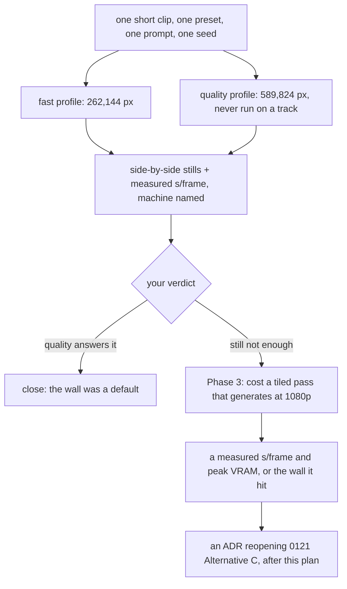

# 0211 — The diffused frame's resolution is measured before it is designed

> **Status:** approved
> **Created:** 2026-09-19
> **Approved:** 2026-09-19 (user) — approved and deliberately NOT in `tools/conductor/queue.json`
> **Owner skill(s):** dev, human
> **Related ADRs:** [0121](../adrs/0121-the-diffusion-filter-is-an-offline-stage-with-profiles-and-it-interpolates-its-own-stride.md),
> [0071](../adrs/0071-a-numeric-test-contract-states-a-property-or-names-its-machine.md),
> [0122](../adrs/0122-a-sidecar-tool-documents-itself-in-one-place.md)
> **Takes:** design-backlog 0125. The entry stays live until Phase 2's verdict, which is what decides
> whether anything further is owed.

## TL;DR

You watched a full-track diffused render and asked for higher resolution. The clip that drew that verdict
was rendered at the `fast` profile — 262,144 px, 680x384, upscaled to 1080p — and the shipping `quality`
profile is 2.25x those pixels and **has never been rendered on a real track**. So this plan measures
before it designs: render the same clip at both budgets, put the stills side by side, and let you say
whether `quality` already answers the ask. Only if it does not does anyone cost the option nobody has
costed. The first deliverable is a pair of pictures, not a design.

## Context & problem

**The ask.** At [Plan 0106](done/0106-the-frame-stream-passes-through-a-diffusion-model.md)'s Phase 6 human gate on
2026-08-25, on a full-track render of `star_rosewindow`: *"it would obviously be great if resolution
would be higher"* (backlog 0125).

**The cheap first move has not been made.** That clip was rendered at `fast` — a 262,144 px budget,
680x384 at 16:9, resampled to 1920x1080, so every output pixel is inferred. The shipping `quality`
profile is 1024x576, **2.25x the pixels**, and nothing has ever run it end to end on a track. An unknown
and possibly large share of the complaint is therefore a profile choice rather than a wall, and no design
is worth writing until that share is known.

**What is genuinely walled, and why "raise the budget" is not the answer either:**

- **SD1.5 duplicates or mirrors content above roughly 768²** — its native-resolution artefact, named in
  Plan 0106 Phase 1's traps. The budget does not scale smoothly into it.
- **SDXL plus ControlNet is about 7.5 GB against an 8 GB card**, and the spike already peaks at 5.68 GB
  with two ControlNets loaded. Offloading fixes the memory and ruins throughput over thousands of frames,
  which Phase 1 also measured.
- **Cost scales with pixels.** Phase 2b measured 2.721 s/frame at 589,824 px against roughly a third of
  that at 262,144. A 4-minute track at `quality` already measures about 5.9 h *before* the 1.406x scope
  correction Plan 0106 Phase 7d applies to that figure.

**And there is a decision in the way.**
[ADR-0121](../adrs/0121-the-diffusion-filter-is-an-offline-stage-with-profiles-and-it-interpolates-its-own-stride.md)'s
Alternative C is *diffuse at a smaller budget and upscale*, measured as the cheaper route and **rejected
by you in that design interview**, on the ground that generated detail is worth its price against
inferred detail. This verdict does not obviously overturn that — the ask is for *more* detail and an
upscaler infers rather than generates — but the rejection was made before anyone had watched five minutes
of output. The option neither the ADR nor the plan has costed is a tiled or multi-pass approach that
*generates* at higher resolution.

## Decision

**Measure first, and let the measurement close the plan if it can.** Phase 1 renders one short clip at
both budgets with everything else held identical and puts the stills side by side with their measured
cost. Phase 2 is your verdict, and **it is allowed to end the plan**: if `quality` answers the ask, what
was filed as a wall was a profile default, and the remaining work is a documentation and default change
rather than a design. Only a "still not enough" verdict reaches Phase 3, which costs the one route nobody
has priced — a tiled pass that generates rather than infers.

**No ADR is written ahead of the verdict.** Reopening ADR-0121's Alternative C is a real decision with a
recorded rejection behind it, and it cannot be argued honestly from a clip nobody has rendered. The ADR
is owed after Phase 3, and Phase 2 may mean it is never owed at all.

## Architecture diagram

## Implementation phases

### Phase 1 — the pair nobody has rendered
- **Owner skill:** dev
- **What:** Render the same short clip through the sidecar at both profiles, everything else held
  identical, and record both the stills and the cost.
- **Files touched:** none in the sidecar — this is a run, and its output is the plan's own
  `## Implementation log` plus the two stills under `target/` (uncommitted, like the other judging
  sheets).
- **Done when:** a matched pair exists at 262,144 px and 589,824 px from **one build, one machine, one
  seed, one prompt and one preset**, minutes apart, so the two are comparable to each other rather than
  to a cross-build figure — the discipline
  [ADR-0071](../adrs/0071-a-numeric-test-contract-states-a-property-or-names-its-machine.md) and
  Plan 0147 Phase 6 both apply. The measured s/frame at each budget is recorded beside the machine and
  GPU that produced it, and the log states the extrapolated cost of a 4-minute track at each. Use
  `star_rosewindow`, the preset the verdict was given on. A clip long enough to judge and short enough to
  render twice — the log names its length rather than this plan guessing it.

### Phase 2 — the verdict
- **Owner skill:** human
- **What:** You read the pair and say whether `quality` answers the ask.
- **Files touched:** the plan's `## Implementation log`.
- **Done when:** the log carries one of three recorded verdicts. **`quality` answers it** — the plan
  closes here, and the followup is which profile should be the documented default given the cost.
  **`quality` helps and is not enough** — Phase 3 runs, with the residual named as concretely as the
  pictures allow. **`quality` changes nothing visible** — Phase 3 runs, and the finding that 2.25x the
  pixels is invisible at this scale is itself the most useful thing in the plan, because it says the
  budget is not the lever. **This phase may end the plan, and that is a success rather than an
  abandonment.**

### Phase 3 — the uncosted route gets a number
- **Owner skill:** dev
- **What:** Cost a tiled or multi-pass pass that *generates* at 1920x1080 rather than upscaling into it,
  against the two walls Plan 0106 Phase 1 measured.
- **Files touched:** `tools/sd-filter/` (a spike, not a shipped profile), and the plan's log.
- **Done when:** the log carries a measured s/frame and a measured peak VRAM for a tiled pass at
  1920x1080 on the named machine, **or** a statement of which wall it hit and at what value — the
  SD1.5 duplication artefact above roughly 768² per tile, or the 8 GB card against a working set the
  spike already takes to 5.68 GB. A number or a named wall both satisfy this phase; what does not is an
  opinion about whether tiling would work. Extrapolate the 4-minute track cost and say it plainly, since
  a route that triples an already 5.9 h render is a different proposition from one that does not.

## Risks & open questions

- **Phase 2 may close the plan, and Phase 3's work then never happens.** That is the design. The risk
  worth naming is the opposite one: treating Phase 1 as a formality and going straight to tiling, which
  is how a 5.9 h/track route gets built to solve a default.
- **A tiled pass may not preserve the geometry ControlNet is holding.** Tile seams in a moving image are
  their own artefact, and a seam that swims across a track is worse than a soft upscale. Phase 3 measures
  cost and VRAM; whether the *picture* survives tiling is a look judgement that would need its own
  rendered pair, and if Phase 3 shows the cost is viable that pair is the next thing owed.
- **Nothing here is gated and nothing here ships.** `tools/sd-filter/` is creator tooling outside the
  workspace, so no suite covers any of it and the cost figures live in exactly one page, which
  `check-filter-figures.mjs` holds them to. **Any figure this plan publishes goes on that page or
  nowhere** — a second copy is what that gate exists to prevent.
- **The runs are long and the loop is slow.** Every phase here is an overnight-scale render on one
  machine, which is why the plan is ordered to spend the cheapest one first.
- **`quality` has never run end to end**, so Phase 1 may find it does not — a crash, a VRAM ceiling, a
  stride interaction. That is a finding and it belongs in the log rather than being worked around.

## What this plan does NOT do

- **It does not add variety across a track.** That is backlog 0126 and
  [Plan 0212](0212-the-diffused-render-gains-a-timeline.md), and 0126 says why they must not be folded
  together: *"one is a pixel budget against a VRAM wall, the other is a timeline the pipeline does not
  have."*
- **It does not reopen ADR-0121's Alternative C.** It produces the evidence that decision needs. The ADR
  comes after Phase 3, in its own session.
- **It does not change the shipped default profile.** If Phase 2 says `quality` answers the ask, moving
  the default is a followup with a cost argument attached, not a silent edit.
- **It does not add an upscaler.** An upscaler infers, the ask is for generated detail, and Alternative C
  was rejected on exactly that ground.
- **It does not touch the engine, `shot`, or any release artefact.**

## Implementation log

> Written by `dev` — one row per phase as that phase's commit lands, and the close block after the
> last one. **The phases above are the contract; everything here is what happened.**

**Lane:** _(to be filled by `dev`)_

| phase | owner | state | commit |
|---|---|---|---|
| 1 — the pair nobody has rendered | dev | not started | |
| 2 — the verdict | human | not started | |
| 3 — the uncosted route gets a number | dev | not started | |

### Notes

### Close triggers

- **`presets/` touched:**
- **Plan header `Closes:`** none — see `**Takes:**`; backlog 0125 stays live until Phase 2's verdict
- **What shipped:**
- **Operator docs touched:**
- **Backlog probes (`node scripts/check-backlog-claims.mjs`):**
- **Full suite:**
- **Outstanding `human` phases:**

## Followups (after this lands)

- If Phase 2 says `quality` answers the ask, which profile is the documented default — and what
  `docs/diffusion-filter.md` says the cost of that default is — is the remaining question.
- If Phase 3 shows tiling is affordable, whether the picture survives the seams is the next rendered
  pair, and the ADR reopening ADR-0121 Alternative C follows it.
