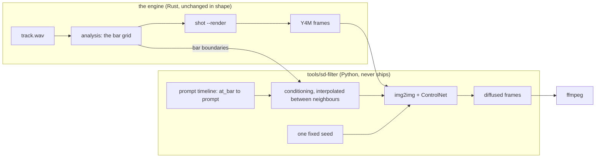

# 0212 — The diffused render gains a timeline

> **Status:** approved
> **Created:** 2026-09-19
> **Approved:** 2026-09-19 (user) — approved and deliberately NOT in `tools/conductor/queue.json`
> **Owner skill(s):** dev, human
> **Related ADRs:** [0236](../adrs/0236-a-diffused-render-varies-by-prompt-on-bar-boundaries-and-the-seed-stays-fixed.md)
> (proposed), [0121](../adrs/0121-the-diffusion-filter-is-an-offline-stage-with-profiles-and-it-interpolates-its-own-stride.md),
> [0122](../adrs/0122-a-sidecar-tool-documents-itself-in-one-place.md)
> **Closes:** design-backlog 0126

## TL;DR

A diffused render is one prompt, one seed and one preset from first frame to last, and you asked for
*"more variety"* after watching 5:15 of it. The seed cannot be unfixed — Plan 0106 measured that a
per-frame seed guarantees boiling — so this plan gives the sidecar a **prompt timeline** in musical time:
a list of `{at_bar, prompt}` entries whose conditioning is interpolated between neighbours, with the seed
and the preset untouched. The first visible behaviour is a render whose look changes at a bar boundary you
chose.

## Context & problem

**The ask.** At [Plan 0106](done/0106-the-frame-stream-passes-through-a-diffusion-model.md)'s Phase 6 human gate on
2026-08-25, on a 5:15 render: *"...and with more variety"* (backlog 0126).

**It is not a defect.** It is Plan 0106's *What this plan does NOT do*, in as many words: *"No timeline,
cuts, or prompt automation across a track. One prompt per render, matching 0101's one preset per
render."* So taking it is a scope decision rather than a fix.

**The first lever anyone reaches for is the one that cannot be pulled.** The fixed seed is load-bearing
for what that gate approved: Phase 1 recorded that a per-frame seed *"guarantees boiling whatever else is
tuned"*. Variety cannot be bought by unfixing it.

**Three levers remain and they disturb very different amounts.** Plan 0106's own Followups already name
the shape — audio-conditioned diffusion, *"denoise from the onset envelope, prompt blend on bar
boundaries"* — filed then as a nice-to-have and now an ask with a watched render behind it:

- **Prompt interpolation on bar or section boundaries.** The analyzer already supplies the boundaries.
  Keeps one seed and one preset; changes only the conditioning.
- **Preset changes across a track.** A `shot` question before it is a filter question —
  [Plan 0101](done/0101-the-engine-renders-a-music-video.md) renders one preset per render by design.
- **Denoise strength driven by the onset envelope.** The one lever that reopens Plan 0106's deliberate
  choice to keep the filter seam image-only, and Phase 2 named it as the repair *if the music stopped
  reading through* — which it did not. Taking it now would be taking it for variety rather than for
  reactivity: a different argument for the same mechanism, and one that deserves its own ADR.

## Decision

Per [ADR-0236](../adrs/0236-a-diffused-render-varies-by-prompt-on-bar-boundaries-and-the-seed-stays-fixed.md),
**the render accepts a prompt timeline — a list of `{at_bar, prompt}` entries — and interpolates the
conditioning between adjacent entries, with the seed fixed and the preset single.** The timeline is
expressed in musical time rather than frames or seconds, because the analyzer already computes bar
boundaries and because a track's structure is what the variety should follow.

This is the smallest lever that produces real variation, and the two things it preserves are why: the
fixed seed keeps the output from boiling, and one preset keeps the geometry ControlNet holds continuous.
The image-only seam does not move.

We rejected unfixing or stepping the seed (Plan 0106 Phase 1 measured the boiling; a seed stepped on bars
is the same hazard as a visible discontinuity), onset-driven denoise (reverses a recorded decision for a
new reason — its own ADR), and preset changes across a track (a Plan 0101 question about the renderer, not
the filter).

## Architecture diagram

## Implementation phases

### Phase 1 — the sidecar accepts a timeline
- **Owner skill:** dev
- **What:** The sidecar takes a prompt timeline instead of only a single prompt, and interpolates the
  conditioning between adjacent entries; the seed stays fixed for the whole render.
- **Files touched:** `tools/sd-filter/sd_filter.py`, `tools/sd-filter/test_sd_filter.py`.
- **Done when:** a timeline of two entries produces conditioning that is the first prompt's at the
  first entry's bar, the second's at the second, and a blend between them, asserted on the
  interpolation itself rather than on rendered frames. The rendered demonstration — a short clip whose
  first and last frames differ in the way the two prompts describe while the geometry tracks the same
  source — needs the CUDA `.venv` interpreter and `ffmpeg`, which a conductor session cannot run, so it
  is taken at the start of Phase 3. A single prompt with no timeline still works unchanged, so every existing
  invocation and every figure in `docs/diffusion-filter.md` stays valid. A malformed timeline — a bar out
  of order, a bar past the track, an empty prompt — is refused with the offending entry named, rather than
  rendering for hours and producing something wrong. `python3 tools/sd-filter/test_sd_filter.py` covers
  the interpolation arithmetic and the refusals; it is in the pre-push gate, so it runs where nothing else
  about this tool does.

### Phase 2 — the bar grid reaches the sidecar
- **Owner skill:** dev
- **What:** `shot --render` supplies the track's bar boundaries to the sidecar so a timeline in bars
  resolves to frames. **The carrier is a file** (owner's choice, 2026-09-26): a new `shot` flag,
  `--bar-grid <path>`, writes the render's bar boundaries as frame indices, and the sidecar reads that
  path with a flag of its own and sets `DiffusionStage.bar_of` from it. The Y4M stream on stdin is
  untouched, so ADR-0114's wire and `shot_cli.rs`'s byte-exact assertions stay as they are; an
  in-band tag and an environment variable were the two channels declined.
- **Files touched:** `standalone/src/shot/render.rs`, `standalone/src/shot/render/tests.rs`,
  `standalone/examples/shot.rs` (the flag), `tools/sd-filter/sd_filter.py`,
  `tools/sd-filter/test_sd_filter.py`, `docs/capturing.md`.
- **Done when:** the bar boundaries `shot --render --bar-grid` writes are the analyzer's own bar grid
  for the frames it renders, asserted offline by a test in `render/tests.rs` rather than by the
  sidecar's arithmetic alone; the sidecar test reads such a file and resolves a frame to its bar; a
  `--timeline` render without a bar-grid file is still refused with the reason named; and the video
  stream a render writes is byte-identical with and without `--bar-grid`. Whether those bars are where
  a listener would put them is checked in Phase 3 against the same track's `--downbeat-log`, which
  only the live windowed player writes. Bar 1 is defined explicitly in `docs/capturing.md` (the first
  downbeat the estimator locks, or the first frame — whichever the implementation does, said plainly),
  because an off-by-one bar is a silent quarter-track shift. **Backlog 0042 is live and load-bearing
  here:** the downbeat estimator locks on about 3 % of audible time, so on most tracks the bar grid is
  fallback rather than estimated. A timeline is still useful on a fallback grid — it is regular, just not
  necessarily aligned to the music — and `docs/capturing.md` says which of the two a render got rather
  than letting the reader assume.

### Phase 3 — a full track, judged
- **Owner skill:** human
- **What:** First, the short two-prompt clip Phase 1's done-when defers here: its first and last
  frames differ in the way the two prompts describe while the geometry tracks the same source. Then
  render a full track with a timeline and say whether the variation reads as variety.
- **Files touched:** the plan's `## Implementation log`.
- **Done when:** the short clip is recorded as showing, or not showing, the two prompts' difference
  over one geometry; a timeline's bars are checked against the same track's `--downbeat-log`, deferred
  from Phase 2, and the log says whether they agree; and a recorded verdict against the 2026-08-25 render this ask came from: **the variation
  reads** — the plan closes; **it reads as a crossfade between two wrong images** — ADR-0236's named
  failure mode, recorded as an `Outcome` on the ADR, and the remaining levers are the two it declined;
  **it is too subtle to notice** — which says prompt motion is not enough authority over the picture, and
  is the same conclusion arriving from the other side. Use the same preset and track family as the
  original render so the comparison is to the thing that drew the complaint.

## Risks & open questions

- **The conditioning blend may read as a muddy middle at every boundary** rather than as a transition —
  ADR-0236's named negative. Phase 3 is where that is found and it costs the plan rather than being
  fixable inside it. A blend window short enough to be a cut is the obvious fallback and it is not
  designed here, because "cuts" is explicitly in Plan 0106's non-scope and would want its own argument.
- **A timeline is content nothing authors.** One prompt was one field; a timeline is a small document per
  track with no tooling and no validation beyond Phase 1's refusals. If writing one by hand turns out to
  be the real obstacle, that is a finding for the studio lane rather than work here.
- **Each judging pass is an overnight run.** A 4-minute track at `quality` measures about 5.9 h before
  Plan 0106 Phase 7d's 1.406x scope correction, so Phase 3 iterates slowly. Phase 1's short-clip
  done-when is deliberately not a full track for that reason.
- **The bar grid is mostly fallback (backlog 0042).** If Phase 3's verdict is that the variation lands in
  the wrong places rather than that it reads badly, the cause may be the grid rather than the blend —
  which would make this plan's verdict evidence for 0042 rather than against ADR-0236.
- **Nothing here is gated beyond the sidecar's own test**, which the pre-push hook runs. No suite covers
  `tools/sd-filter/`, and its cost figures live on one page that `check-filter-figures.mjs` holds them to.

## What this plan does NOT do

- **It does not raise the resolution.** That is backlog 0125 and
  [Plan 0211](0211-the-diffused-frames-resolution-is-measured-before-it-is-designed.md). Backlog 0126
  forbids folding them: *"one is a pixel budget against a VRAM wall, the other is a timeline the pipeline
  does not have."*
- **It does not unfix or step the seed**, and it does not drive denoise from the onset envelope — that
  reopens the image-only seam and needs its own ADR.
- **It does not change presets across a track.** `shot` renders one preset per render by Plan 0101's
  design; reopening that is a renderer question.
- **It does not add cuts, transitions or a shot list.** One interpolated prompt track, and nothing that
  amounts to an editing timeline.
- **It does not ship anything.** `tools/sd-filter/` is creator tooling outside the workspace.

## Implementation log

> Written by `dev` — one row per phase as that phase's commit lands, and the close block after the
> last one. **The phases above are the contract; everything here is what happened.**

**Lane:** _(to be filled by `dev`)_

| phase | owner | state | commit |
|---|---|---|---|
| 1 — the sidecar accepts a timeline | dev | not started | |
| 2 — the bar grid reaches the sidecar | dev | not started | |
| 3 — a full track, judged | human | not started | |

### Notes

### Close triggers

- **`presets/` touched:**
- **Plan header `Closes:`** design-backlog 0126
- **What shipped:**
- **Operator docs touched:**
- **Backlog probes (`node scripts/check-backlog-claims.mjs`):**
- **Full suite:**
- **Outstanding `human` phases:**

## Followups (after this lands)

- Authoring a timeline has no tooling. If that is the obstacle Phase 3 surfaces, a timeline editor is a
  `studio-builder` question.
- Onset-driven denoise and a preset timeline are both still unbuilt, and both now have a bar grid to hang
  on if either is taken.
