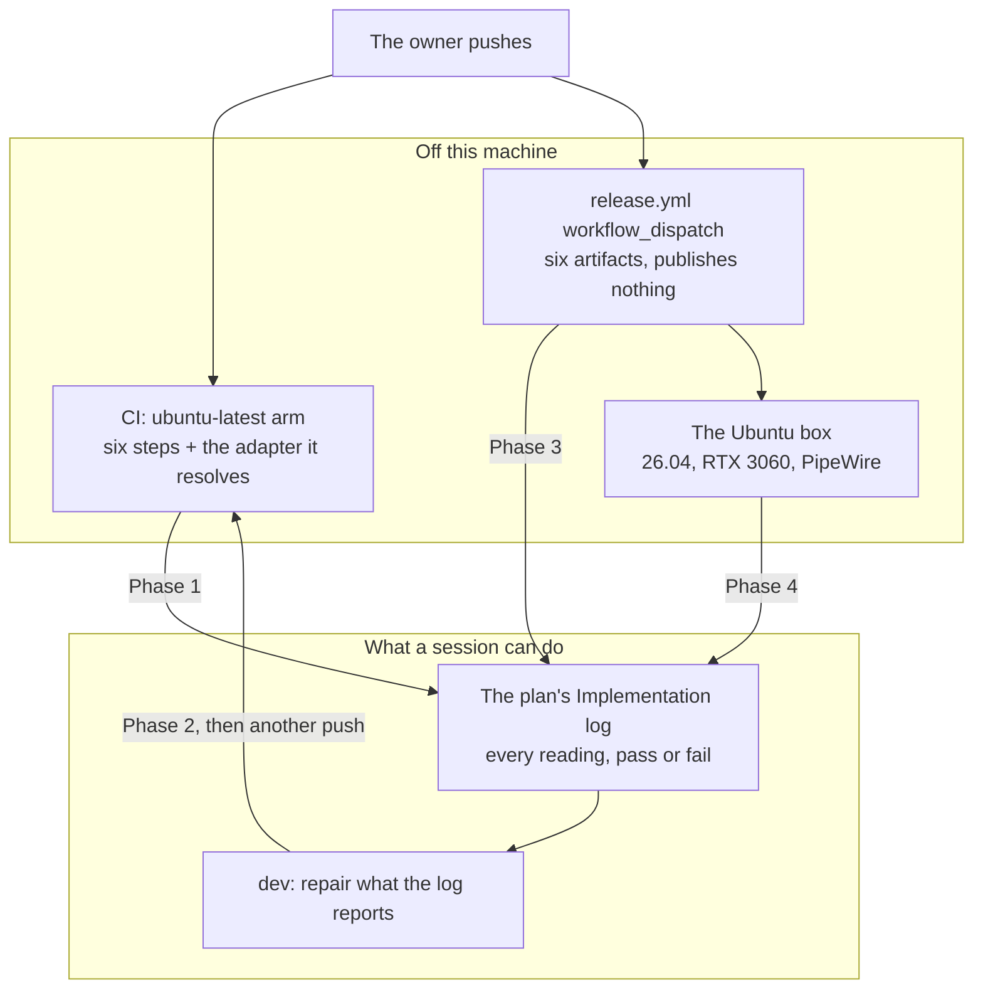

# 0214 — The Linux arm reports back

> **Status:** draft
> **Created:** 2026-09-20
> **Owner skill(s):** human, dev
> **Related ADRs:** [0131](../adrs/0131-the-linux-standalone-captures-through-pulseaudios-simple-api.md),
> [0016](../adrs/0016-gpu-tests-opt-in-ci-scope.md),
> [0038](../adrs/0038-tag-driven-release-unsigned-universal-mac-app.md),
> [0203](../adrs/0203-a-release-exists-only-if-its-tag-reaches-origin.md)
> **Depends on:** [0120](0120-the-standalone-ships-on-ubuntu.md) — every phase landed and on `main`

## TL;DR

Plan 0120 writes all the Linux code and **witnesses none of it**. This plan is the witnessing: the
owner pushes, and the three readings that only exist after a push get read and recorded — the
`ubuntu-latest` arm's six steps, the wgpu adapter it resolves, and a `workflow_dispatch` dry run's
artifacts — then the tarball runs on the real machine.

It is a short plan with an unusual shape: **three of its four phases are `human`**, because the
evidence lives on GitHub's runners and on a box in the room, and neither is reachable from a
session. `dev` appears once, between two of them, to repair what the first reading reports.

## Context & problem

The split is [0120](0120-the-standalone-ships-on-ubuntu.md)'s 2026-09-20 amendment, and the reason
is mechanical rather than editorial: **the conductor never pushes, and a Windows session cannot run
a Linux CI arm.** Every remaining 0120 done-when phrased as *"the arm runs green"* would therefore
stop a lane that had already written the code correctly — the work would be done and the phase
unclosable.

So 0120 was re-cut along *who can witness the evidence*. It now ends at the last line of code it
writes. What came here is every clause that needs a push or the machine, quoted rather than
paraphrased, so nothing was softened on the way across.

**The consequence this plan exists to handle is that 0120 closes with Linux code nobody has
compiled.** `#[cfg(target_os = "linux")]` code is not type-checked on Windows, and the one partial
substitute — `cargo check --target x86_64-unknown-linux-gnu` — stops reaching once `libpulse-sys`
enters the graph, because `cargo check` runs build scripts and that one needs `pkg-config` and
libpulse headers. This repository already carries one standing finding of exactly that shape
(`plugin-foobar/viz_session.cpp`, first compiled by a release job), so the class is known and the
cost is known. **Phase 1 is where that first compile happens**, and it should be expected to fail
the first time rather than treated as a surprise.

## Decision

**Read, repair, read again, then run it on the box.** The phases are ordered by what each one can
see, and each hands the next a reading rather than a belief:

**A failure at any phase is a recorded finding, not an improvisation.** Phases 1, 3 and 4 report;
only Phase 2 changes code.

## Implementation phases

### Phase 1 — The arm reports what it sees

- **Owner skill:** human

Push `main` so CI runs the arm 0120 Phase 2 declared, then read the `check (ubuntu-latest)` job and
write what it says into this plan's `## Implementation log`. **This is the first time any machine
compiles the Linux-only code**, so a red arm here is the expected case and the phase's product
either way.

Three of 0120's retired clauses land here verbatim:

> The `ubuntu-latest` arm runs all six existing steps green — `cargo build`,
> `cargo nextest run --workspace -P fast`, `cargo test --workspace --doc`,
> `cargo clippy --workspace --all-targets -- -D warnings`, `cargo fmt --all --check`, and
> `cargo doc --workspace --no-deps` under `RUSTDOCFLAGS: -D warnings`.

> The implementation log records **which wgpu adapter, if any, resolves on the runner**, and whether
> any GPU-touching test actually executed there rather than skipping. `ubuntu-latest` may ship
> Mesa's software Vulkan, in which case tests that skip on macOS for want of an adapter will *run*
> on Linux — against a rasterizer nothing in this repo has ever compared against. If any did run,
> name them.

> A run of `help_cli` and `stream_pipe` on the Ubuntu arm leaves `$HOME/.local/share` untouched.

**Done when** each of these is in the log, pass or fail:

- The six steps, one line each, with the failing step's log excerpt where one is red.
- **The adapter, named**, and the list of GPU-touching tests that ran rather than skipped. An empty
  list is a reading and must be written as one; silence is not.
- Whether the runner's `$HOME/.local/share` was left untouched, and how that was determined.
- The runner's own Ubuntu version, because `ubuntu-latest` moves and the artifact's glibc floor
  moves with it.

### Phase 2 — The arm goes green

- **Owner skill:** dev

Repair what Phase 1 reported, reasoning from the exact log lines rather than from a guess about
Linux. Expect the classes 0120 Phase 2 predicted — the `capture_handle::Handle = ()` arm,
unused-import warnings under `-D warnings`, a `#[cfg]` that assumed exactly two platforms — plus
whatever the first real compilation of `capture_linux.rs` turns up.

**This phase loops with the owner**, and that is stated rather than hidden: a session writes the
repair, the owner pushes, the next run either goes green or hands back a shorter list. Each pass
appends to the log; nothing is re-litigated.

**Done when:**

- The arm is green, evidenced by a run the log names — run id and date, not "it passed".
- **No test's platform gate was widened or loosened to get there.** A test that should not run on
  Linux gets a gate that says so in ADR-0016's shape, argued from the gate's own reasoning. A gate
  edited *because* CI was red, with no such reasoning, is the failure this clause exists to catch.
- If a GPU-touching test ran on the runner's software rasterizer and its result is not trustworthy
  there, the repair is that gate — and the log says which test and why, since it is the first time
  this project has had to answer that question.

### Phase 3 — The release dry run

- **Owner skill:** human

Run `release.yml` under `workflow_dispatch` and read what it produced. 0120 Phase 4 wrote every
assertion into `stage.sh` and into the `release` job's count guard, so **this phase reads a verdict
rather than inspecting an archive** — if the guard is wrong, that is itself the finding.

0120's two retired clauses land here verbatim:

> `stage.sh` produces `target/dist/ritmolux-v<version>-linux-x64.tar.gz`, whose single top-level
> entry is a folder of that name holding `ritmolux`, `presets/*.toml` and `READ-ME-FIRST.txt`.

> A `workflow_dispatch` dry run produces six artifacts and publishes nothing.

**Done when:**

- The dry run is green and the artifact list is in the log: **six**, named.
- The count guard's assertion of **5 `.zip` and exactly 1 `.tar.gz`** was exercised by that run —
  not read in the diff. A guard that would pass a Linux-less release is the thing most worth
  catching here, and only a run catches it.
- Nothing was published. The dispatch path's whole point is that it cannot.

### Phase 4 — Run it on the Ubuntu box

- **Owner skill:** human

0120 Phase 6, carried across whole. Validate **the artifact that ships**, not a `cargo run`:
extract the tarball from the Phase 3 dispatch run (or from a local `stage.sh`) on the Ubuntu
machine.

**The box is Ubuntu 26.04 and the build floor is 24.04** (0120 Phase 1's reading), so this run also
answers the compatibility direction: an artifact built against the older glibc running on the newer
system. That is the safe direction, and it is still a reading rather than an assumption.

**Done when** each of these is reported, pass or fail:

- It extracts and launches; `chmod +x` was or was not needed.
- Music plays and the visuals react to it.
- **F3's audio line reads `live PulseAudio 48000/2 <endpoint>`**, and the endpoint names a monitor
  source. A `failed PulseAudio …` line is a finding with its reason attached; `unsupported` means
  the wrong arm compiled.
- `~/.local/share/Ritmolux/` appears and holds `config.toml`, a preset copy and `diagnostics.log`;
  `diagnostics.log`'s `capture` column carries the same verdict token.
- `F` (fullscreen) works. `D` (next monitor) works, or is a no-op — **expected under Wayland**, per
  ADR-0131's Negative and confirmed as the box's session type by 0120 Phase 1, and recorded either
  way rather than treated as a bug.
- The frame rate F3 shows, and whether the quality tier was auto-dropped. The box has a discrete
  RTX 3060 on the proprietary driver, so a dropped tier here would be a finding rather than a
  weak-hardware result.
- Capture works on a **Bluetooth** default sink, which is what 0120 Phase 1 probed against. If the
  box's default sink is something else that day, say which.

Anything that fails becomes a **backlog entry**, not a silent fix — the code phases are finished by
this point and a repair belongs in its own scope.

## Risks & open questions

- **`ubuntu-latest` is a moving target, and the artifact's glibc floor moves with it.** 0120's
  release notes name Ubuntu 24.04 as the floor; if the runner image has moved to 26.04, the built
  binary will not run on 24.04 and the notes are wrong. Phase 1 records the runner's version for
  exactly this reason. The repair, if needed, is pinning the image in `release.yml` — an edit to
  0120's work, not a new decision.
- **The software rasterizer may make previously-skipped tests run.** ADR-0016 scopes GPU tests by
  adapter availability, and every such gate in this repository was written when "no adapter" meant
  macOS CI. Mesa's llvmpipe on the runner turns that assumption over. This is the reading most
  likely to produce a follow-on decision, and Phase 2 is deliberately allowed to gate rather than
  to chase a green.
- **Phase 2's loop is bounded by the owner's pushes, not by a session.** If it takes more than two
  or three passes, the cause is likely a class of failure the repo cannot see from Windows at all,
  and the honest answer is a local Linux checkout rather than a fourth round trip.
- **Nothing here is gated.** Every phase's product is prose in the log. That is the nature of
  evidence that lives off the machine, and it is why each done-when asks for a named run id, an
  adapter name or an artifact list rather than an adjective.

## What this plan does NOT do

- **It writes no Linux features.** Device enumeration, MPRIS metadata, AppImage/`.deb`/Flatpak,
  ARM64 — all still out, all still ADR-0131's deferred alternatives.
- **It does not re-open ADR-0131.** Phase 1 of 0120 confirmed the premise; this plan reads results,
  and a result that contradicts the ADR is an Outcome section on the ADR, written by the architect.
- **It does not push or tag.** The owner pushes, here as everywhere.
- **It does not absorb its own findings.** A failure becomes a backlog entry or a repair phase; it
  does not become a quietly loosened assertion.
