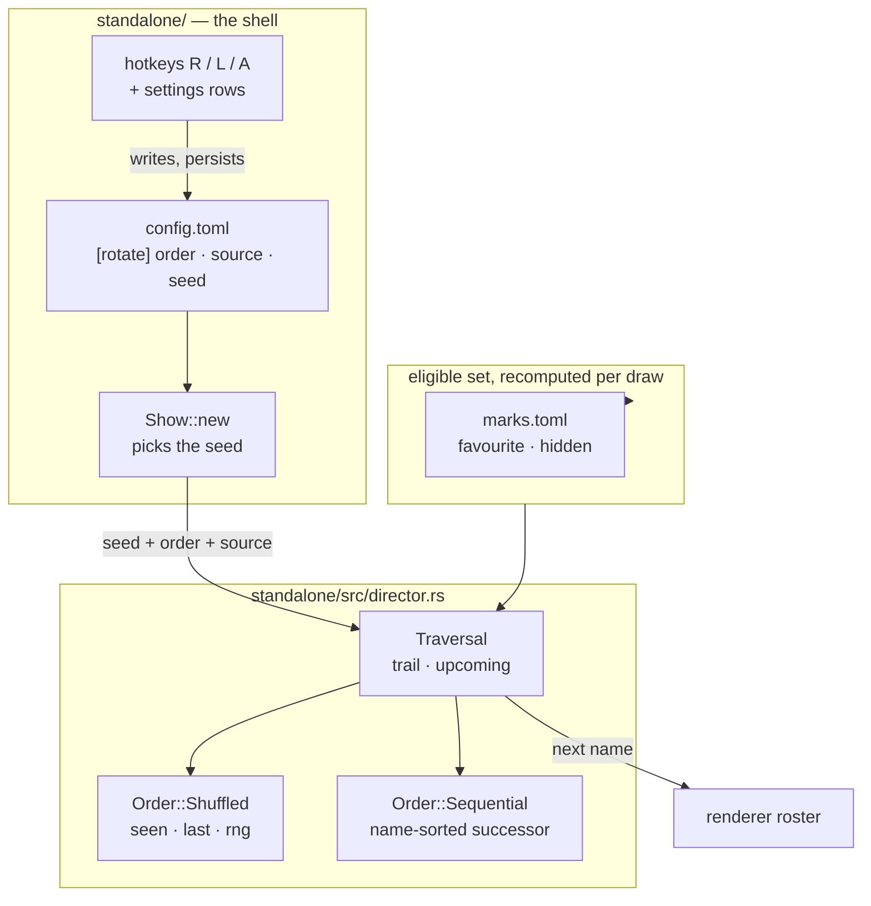

# 0216 — The operator owns the order

> **Status:** in-progress
> **Created:** 2026-09-20
> **Owner skill(s):** dev
> **Related ADRs:** [0239](../adrs/0239-rotation-carries-two-orders-and-the-shuffles-seed-varies-per-launch.md) (proposed), [0228](../adrs/0228-a-preset-mark-is-user-state-keyed-by-name-in-its-own-file.md), [0027](../adrs/0027-scene-rotation-constant-default-calmer-cadence.md)

## TL;DR

Rotation gains a second order. `Space` and auto-rotate keep drawing from Plan 0205's shuffled
traversal by default, but the operator can switch to a `sequential` walk — alphabetical by preset
name, wrapping — from a settings row, the `R` key, or `[rotate] order` in `config.toml`. The
`[rotate] source` key, which has existed with no in-app control since it shipped, gets the same
three-way treatment on `L`. The shuffle's seed stops being the embedded preset count, so two
launches of one build stop replaying one order. And a favourite is drawn as a warm row in the
browser, because a one-character `*` does not read down a column of forty.

## Context & problem

Watching the running app on 2026-09-20 — the day [Plan
0205](done/0205-the-library-becomes-navigable.md) closed — the owner reported: *"it feels like
presets are changed by random and there is no setting for that"*, and then: *"I need to have a
setting in app to switch on/off random completely — and to go either by favourites or by all.
Favourite presets should be indicated in preset list (for example by star)."*

Four facts stand behind that, three of them real gaps:

1. **The order has no control at all.** Plan 0205 replaced the roster-successor rule with a shuffled
   traversal; `Space` inherited it. There is no key, no flag and no settings row that changes it.
2. **`[rotate] source` has no in-app control.** The key is read at `standalone/src/config.rs:335`
   and applied at `standalone/src/director.rs:238`, but only a file edit and a restart can set it.
3. **The shuffle does not vary across launches.** Plan 0205's close review, finding 5, left this
   open: `standalone/src/show.rs:173` seeds the traversal from
   `renderer.preset_names().count()` read *before* the reload installs the real library, so the
   number is the embedded count — one per build. The walk is identical every launch.
4. **The star already exists and is not the gap.** `standalone/src/overlay.rs:203` draws `*` for a
   favourite and `-` for a hidden preset, in a one-character column, and
   `standalone/src/console.rs:103` moves those same lines to the operator console — so both lists
   already carry it. What fails is legibility, not presence.

The confusion in the report is itself evidence: auto-rotate was off in the owner's `config.toml`, so
nothing was changing on a timer. Every switch was a `Space` press landing somewhere unpredictable.

## Decision

Take ADR-0239: two orders, `shuffled` by default, both reachable from a settings row, a hotkey and a
config key; the same for `source`; the seed injected by the shell from `[rotate] seed` or varied per
launch. In the director, `Traversal` keeps the shared `trail` and `upcoming` and delegates the draw
to an `Order` whose `Shuffled` variant owns the cycle state and RNG. In the browser, a favourite row
is drawn in a warm colour and the cursor still wins on the highlighted row.

We rejected a mode flag on `Traversal` because `seen` and `rng` would sit dead in sequential mode and
the type's documented no-repeat invariant would stop holding in one of its two modes; we rejected
letting sequential bypass the traversal entirely because `upcoming` (the next-in countdown, the
console's staging line) and `trail` (`Backspace`) would then have two maintainers. For the browser we
rejected tinting only the glyph — it doubles the Lines per row and gives the name-column arithmetic a
second owner — and rejected a bolder 5x7 glyph, which does nothing for scanning a column.

Out of the interview: **standalone only.** The foobar plugin has no rotation, no marks and no
browser, and gains none here.

## Architecture diagram



## Implementation phases

### Phase 1 — `Order` splits out of `Traversal`

- **Owner skill:** dev
- **What:** Move the shuffle's cycle state and RNG into an `Order::Shuffled` variant; `Traversal`
  keeps `trail` and `upcoming` and delegates the draw. `Order::Sequential` returns the successor of
  the last drawn name in the eligible set sorted by name, wrapping at the end. No behaviour change
  yet — nothing constructs `Sequential`.
- **Files touched:** `standalone/src/director.rs`, `standalone/src/director/tests.rs`
- **Done when:** under `Shuffled`, no preset is drawn twice while an unseen eligible preset remains,
  and a cycle never begins on the preset that ended the previous one — the two properties Plan 0205
  argued for, now asserted against the variant rather than the type. Under `Sequential`, repeated
  draws over a fixed eligible set visit every name in ascending name order and wrap to the first.
  `trail` and `upcoming` behave identically under both orders, asserted by a test that runs the same
  sequence through each. **The successor is computed against the eligible set handed to that draw,
  not a list cached at construction** — a test that toggles `hidden` on a preset mid-walk and
  continues shows the walk skipping it without losing its place.

### Phase 2 — the order becomes a config key

- **Owner skill:** dev
- **What:** `[rotate] order`, serialized `"shuffled"` / `"sequential"` in the kebab-case shape
  `RotateSource` already uses, `#[serde(default)]` to `Shuffled`, plus a live setter on the director
  so the value can change without reconstruction.
- **Files touched:** `standalone/src/config.rs`, `standalone/src/director.rs`,
  `standalone/src/show.rs`
- **Done when:** `order = "sequential"` in `config.toml` makes `Space` walk the library
  alphabetically from launch; the key absent leaves the shuffle in place; an unknown value is
  refused the way the neighbouring keys refuse one rather than silently defaulting; and a config
  round-trip preserves the value, asserted beside the existing `source` round-trip test at
  `standalone/src/config.rs:662`.

### Phase 3 — the seed varies per launch, and a key pins it

- **Owner skill:** dev
- **What:** Add `[rotate] seed: Option<u32>`. The shell passes it when set and a launch-varying
  value otherwise, replacing `Traversal::new(renderer.preset_names().count() as u32)` at
  `standalone/src/show.rs:173`. This discharges Plan 0205's close-review finding 5. The seam stays
  injected — `Traversal::new(seed)` does not change, and the headless constructor at
  `standalone/src/show.rs:655` keeps passing an explicit `0`.
- **Files touched:** `standalone/src/config.rs`, `standalone/src/show.rs`
- **Done when:** with no `seed` key, two launches of one build against one library produce different
  first draws under `shuffled`. With `seed = 7`, two launches produce the same first draw. The
  director still reads no clock: every clock read stays in the shell, and a test constructing a
  `Traversal` directly is unaffected. `sequential` ignores the seed entirely.

### Phase 4 — two settings rows and two hotkeys

- **Owner skill:** dev
- **What:** `SettingsRow::Order` and `SettingsRow::Source`, placed immediately after `AutoRotate` and
  before the dwell pair, so the four rotation rows read together. `R` toggles the order and `L`
  cycles the source, both persisting through the one path `toggle_auto_rotate`
  (`standalone/src/app_state.rs:1589`) already uses.
- **Files touched:** `standalone/src/settings.rs`, `standalone/src/settings/tests.rs`,
  `standalone/src/input.rs`, `standalone/src/app_state.rs`, `standalone/src/console.rs`
- **Done when:** the `S` menu shows `Order  shuffled` and `Draw from  all`; left/right changes each
  and the change reaches `config.toml` immediately, as the existing rows do; `R` and `L` do the same
  live and are **inert while the browser is open**, where letters are filter input. `SettingsRow::ALL`
  is 16 entries and `label`, `value` and `edit` are exhaustive over them — the compiler enforces the
  last part, so the test to write is that every row's `value` is non-empty for a default view.
  **The source row names the fallback when it is in it:** with `favourites` selected and nothing
  marked, rotation already draws from the whole eligible set (`standalone/src/director.rs:238`), and
  the row reads as that state rather than printing `favourites` over a library that is all showing.

### Phase 5 — a favourite reads as a warm row

- **Owner skill:** dev
- **What:** A `FAV_COLOR` beside the existing row colours, selected at the browse list's
  `(marker, color)` decision (`standalone/src/hud.rs:288`). The `*` glyph is unchanged.
- **Files touched:** `standalone/src/hud.rs`
- **Done when:** an unhighlighted favourite row draws in `FAV_COLOR` and an unhighlighted plain row
  in `ROW_COLOR`; the highlighted row draws in `ROW_HL_COLOR` whether or not it is a favourite, so
  the cursor is never ambiguous; the settings menu's own rows, which share the pattern twenty lines
  up at `standalone/src/hud.rs:246`, are untouched; and the operator console shows the same colours,
  which it does by construction since `console::route_into` moves these exact lines
  (`standalone/src/console.rs:103`) — assert it rather than assume it.

### Phase 6 — the docs say what the app now does

- **Owner skill:** dev
- **What:** Sweep the operator docs for the two keys, the two rows and the three config keys.
- **Files touched:** `README.md`, `docs/running.md`, `docs/configuration.md`
- **Done when:** both controls tables carry `R` and `L`; `docs/running.md`'s *"Rotation does not
  repeat itself"* paragraph says the shuffle is now a choice and names the default;
  `docs/configuration.md`'s `[rotate]` table carries `order` and `seed` with their defaults, and its
  prose says `seed` is what pins a `--stream` run's walk now that an absent key varies it;
  `node scripts/check-doc-links.mjs`, `node scripts/check-reader-prose.mjs` and
  `node scripts/toc.mjs --check` all exit 0. `docs/running.ru.md` will go stale against its stamp —
  **note it for the close, do not translate it**; correcting the Russian is content work.

## Data shapes

```rust
// illustrative — not the final interface
enum Order {
    /// Owns the cycle state: no repeat while an unseen eligible preset remains.
    Shuffled { seen: Vec<String>, last: Option<String>, rng: u32 },
    /// Stateless: the successor of `last` in the eligible set sorted by name.
    Sequential,
}

struct Traversal {
    order: Order,
    /// Held so the console can name the next preset without the answer moving.
    upcoming: Option<(String, bool)>,
    /// What was actually shown, oldest first — what `Backspace` walks.
    trail: Vec<String>,
}
```

```toml
# config.toml — the [rotate] table after this plan
[rotate]
auto = false
order = "shuffled"     # or "sequential" — alphabetical by preset name
source = "all"         # or "favourites"
# seed = 7             # absent: varies per launch. Set: the walk repeats exactly.
min_dwell_secs = 20
max_dwell_secs = 90
track_change = true
```

## Risks & open questions

- **The `upcoming` announcement under sequential.** `upcoming` exists so the console's staging line
  and the next-in countdown cannot disagree with what the rotation then takes. Sequential makes it
  trivially predictable, which is fine — but the field must still be *taken* rather than recomputed
  at draw time, or a `hidden` toggle between the announcement and the draw makes the two disagree in
  the one order where the operator can see it coming.
- **A varying seed changes the headless `--stream` walk.** Rotation runs on that path even with
  `auto` off (`docs/configuration.md`), so a run someone wants to reproduce needs `[rotate] seed`.
  Phase 6 documents it; nothing enforces it, and a stream run that quietly stops repeating is the
  failure mode to expect if the documentation is thin.
- **Two hotkeys out of a nearly-full keymap.** `A B C D F H S` and every digit are bound. `R` and
  `L` are readable and free today; the next feature has fewer to pick from.
- **`FAV_COLOR` against the hidden mark.** Hidden rows have no colour of their own and keep
  `ROW_COLOR` with a `-` glyph. A preset carrying both marks will draw warm with a `-`, which is the
  glyph's own precedence rule (hidden wins) meeting a colour that says otherwise. Left as-is
  deliberately: a hidden favourite is a rare state, and a third colour to disambiguate it costs more
  than it returns.

## What this plan does NOT do

- **No foobar plugin parity.** Settled in the interview. The plugin keeps remembering the last
  preset by name and gains no marks, no order and no rotation; teaching it to read `marks.toml`
  would make a second reader of a file the standalone owns, which is an ADR of its own.
- **Does not touch the browser's `F4` favourites-only view.** That filters what the *list* shows and
  is a different axis from `[rotate] source`, which filters what rotation *draws from*. Both stay.
- **No dim colour for hidden rows**, and no change to `mark_glyph`.
- **Does not take Plan 0205's open finding 1** (`NAME_CHARS` is 21-vs-18 and
  `star_mandala_bordered` truncates). Same file as Phase 5, different axis; it is a column-budget
  decision and belongs with whoever re-derives the budget.
- **Does not move the director into `core/`.** Rotation stays a shell concern, which is what keeps
  the core source-agnostic.

## Implementation log

> Written by `dev` — one row per phase as that phase's commit lands, and the close block after the
> last one. **The phases above are the contract; everything here is what happened.**

**Lane:** `/home/igor/Work/rlx-plan-0216` on `plan-0216-the-operator-owns-the-order`

| phase | owner | state | commit |
|---|---|---|---|
| 1 — `Order` splits out of `Traversal` | dev | done | `14d24213` |
| 2 — the order becomes a config key | dev | done | `4c50cb3e` |
| 3 — the seed varies per launch, and a key pins it | dev | done | committed with this row |
| 4 — two settings rows and two hotkeys | dev | not started | |
| 5 — a favourite reads as a warm row | dev | not started | |
| 6 — the docs say what the app now does | dev | not started | |

### Notes

- Phase 1: `Order::Sequential` and `Traversal::new_sequential` carry an `#[allow(dead_code)]` while
  nothing but the module's own tests constructs them — `cargo clippy --all-targets` builds the bin
  without `cfg(test)` and rejects both otherwise. Removed in Phase 2, where the config key
  constructs them.
- Phase 2 also edits `docs/configuration.md`, which its file list does not name:
  `standalone/tests/suite/configuration_doc.rs` fails the moment a config key exists that the
  `[rotate]` table and the complete example do not state. Only the table row and the example line
  landed there; the prose is Phase 6's.
- Phase 2: the live setters (`Traversal::set_order`, `Show::set_rotate_order`,
  `Show::set_rotate_source`) carry an `#[allow(dead_code)]` for the same clippy reason as Phase 1 —
  their only callers are Phase 4's rows and hotkeys. `Show::set_rotate_source` is in this phase
  rather than Phase 4 because Phase 4's file list does not name `standalone/src/show.rs`.
- Phase 3's done-when *"two launches of one build produce different first draws"* is asserted over
  `traversal_seed` and the traversal it feeds, not over `launch_seed`: two clock reads in one test
  are not guaranteed to differ where the wall clock is coarse, so the test states that the number
  reaching the traversal moves and that `seed = 7` stops it moving. Nothing asserts that
  `launch_seed` reads the clock.
