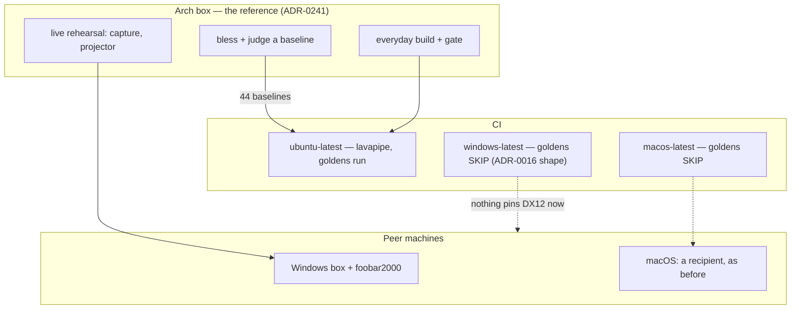

# 0218 — The reference machine becomes Arch

> **Status:** draft — blocked on the Arch migration (noted 2026-09-20)
> **Created:** 2026-09-20
> **Owner skill(s):** dev, human
> **Related ADRs:** [0241](../adrs/0241-linux-leads-and-windows-is-a-peer.md),
> [0242](../adrs/0242-the-software-reference-rasterizer-is-lavapipe-and-a-warp-claim-is-re-measured.md),
> [0023](../adrs/0023-golden-drift-guard-uses-frozen-fixtures.md),
> [0016](../adrs/0016-gpu-tests-opt-in-ci-scope.md),
> [0071](../adrs/0071-a-numeric-assertion-states-a-property-or-names-the-machine.md)
> **Runs after:** [0120](0120-the-standalone-ships-on-ubuntu.md) and
> [0214](0214-the-linux-arm-reports-back.md) — this plan assumes a Linux build that captures audio
> and a green `ubuntu-latest` arm. It does not repeat any of that work.
> **BLOCKED, and the block is the machine.** Every phase needs the migrated Arch box, so nothing
> here starts from the Windows checkout - not even the phases that only edit documents, because
> Phase 5 describes a dev loop nobody has walked. The plan is drafted ahead of the migration so
> that the migration is not also a design exercise. It is **not approved** and does not belong in
> `tools/conductor/queue.json`: a lane would park on Phase 1 at the first judgement it cannot make.
> **Unblocks** when there is an Arch box with the tree checked out and 0120 + 0214 landed.

## TL;DR

Linux stops being a target this project ships to and becomes the machine it is judged on
([ADR-0241](../adrs/0241-linux-leads-and-windows-is-a-peer.md)). The visible change is that the
golden drift guard — 44 committed pictures — is recaptured on lavapipe and gated there, so a
baseline can be inspected on the machine the owner is looking at instead of downloaded from a CI
job. The first phase writes no code: it asks Hyprland what a client is allowed to do with its own
windows, because this app puts a console on a second display and cycles monitors with a key, and
Wayland does not owe a client either.

## Context & problem

Plans 0120 and 0214 make the standalone run on Linux. Neither makes Linux the *reference*, and that
is a separate and entirely documentary change — nothing in `core/` branches on an operating system,
so which platform leads is carried by `docs/nfr.md`, `docs/on-device-validation.md`,
`docs/developing.md`, the CI matrices and this project's habits.

Three concrete things stand between the current tree and that change.

- **The goldens are Windows artifacts.** Every baseline in `core/tests/golden/` was blessed on
  WARP, the DX12 software rasterizer, which exists only on Windows. On Arch the same
  `force_fallback_adapter` path resolves lavapipe, and the committed PNGs will not survive its
  tolerance. Until they move, the drift guard for the whole scene library cannot run on the
  development machine.
- **274 mentions of WARP across 73 `.rs` files are claims, not spellings.** They say what WARP
  mis-renders and what a blessing on it is worth.
  [ADR-0242](../adrs/0242-the-software-reference-rasterizer-is-lavapipe-and-a-warp-claim-is-re-measured.md)
  gives each of them three exits and forbids the fourth, which is translating a measurement nobody
  re-took.
- **Wayland permits less than Win32.** `C` opens the operator console on another display and `D`
  cycles monitors. A Wayland client cannot place its own window on a chosen output;
  fullscreen-on-output it can ask for. Whether that costs anything on Hyprland is unmeasured, and
  designing against a guess is how the aspect-ratio bug shipped twice.

## Decision

Probe first, then move the baselines, then sweep the claims, then move the documents. The probe is
a `human` phase in Plan 0120 Phase 1's shape — readings on the real machine, recorded verbatim,
before any code — because the display half is the only part of this whose shape is unknown.

The golden move follows ADR-0242: recapture on lavapipe, gate the roster to the reference adapter
so the Windows arm **skips** rather than fails, and **judge** the 44 diffs rather than blessing
blind. The claim sweep follows the same ADR's three exits, per site.

We rejected folding the probe's outcome into this plan. If Hyprland refuses something the operator
console depends on, that is a design question with rejected alternatives — an ADR — and not a phase
of a plan whose subject is the reference machine.

## Architecture diagram

## Implementation phases

### Phase 1 — Ask Hyprland what a client may do
- **Owner skill:** `human`
- **What:** readings on the migrated box, before any code, in Plan 0120 Phase 1's shape. Nothing
  here is a design.
- **Files touched:** this plan's `## Implementation log` only.
- **Done when:** the log carries, verbatim, what happened for each of: the show window opening
  fullscreen on a named output; `D` cycling to the next monitor; `C` opening the console **on a
  different display than the show**; `F` and `Esc` in and out of fullscreen; and, separately, a
  capture run against `@DEFAULT_MONITOR@` with a real player on the PipeWire stack, naming the
  endpoint that resolved. Each reading says what was asked for and what the compositor did — a
  refusal recorded as a refusal, not as a bug to fix here. `vulkaninfo --summary` output names the
  adapters lavapipe and the hardware driver both resolve to.

### Phase 2 — The baselines move to lavapipe
- **Owner skill:** `dev`
- **What:** recapture all 44 golden baselines on the reference adapter, gate the golden roster to
  it, and produce the per-fixture diff report Phase 3 judges from.
- **Files touched:** `core/tests/golden/*.png`, `core/tests/suite/golden.rs` and the sibling
  pinned-baseline modules (`line_joints`, `attractor_trails`, `warp_mesh_wide`),
  `docs/testing.md`.
- **Done when:** the golden roster runs on lavapipe and **skips elsewhere with a printed notice**
  in [ADR-0016](../adrs/0016-gpu-tests-opt-in-ci-scope.md)'s shape, so the Windows and macOS arms
  neither run nor fail it; the suite is green on the Arch box against the new baselines; and the
  log carries one row per fixture with its mean and max-outlier difference **against its WARP
  predecessor** — which is the evidence Phase 3 reads, and is not itself a pass criterion. A
  fixture whose recapture is not a picture of the same thing is reported, not blessed.

### Phase 3 — Judge the 44
- **Owner skill:** `human`
- **What:** open each recaptured baseline beside its WARP predecessor and decide whether the
  difference is incidental rasterizer drift or something the guard should have caught.
- **Files touched:** this plan's `## Implementation log`.
- **Done when:** every fixture carries a one-line verdict — drift, or a finding with what was seen.
  A finding stops this plan and becomes its own work; ADR-0242 says a recapture is 44 first
  baselines, and a first baseline is compared against nothing unless a person compares it.

### Phase 4 — Every WARP claim takes one of three exits
- **Owner skill:** `dev`
- **What:** the sweep ADR-0242 specifies, over the 274 mentions in 73 `.rs` files, the 94
  software-adapter sites, and the 5 live reader documents — re-measured, generalised, or marked
  unverified, decided per site.
- **Files touched:** the 73 `.rs` files, `docs/testing.md`, `docs/capturing.md`, `docs/nfr.md`,
  `docs/on-device-validation.md`, `docs/roadmap-visual-richness.md`. **Not** `docs/plans/done/` or
  `docs/adrs/`, which are append-only records and stay as they are.
- **Done when:** no `.rs` comment or live document asserts a behaviour of WARP without either a
  lavapipe reading beside it or an explicit dated mark that it is unverified there; every skip
  keyed on the software adapter states which of the two rasterizers its reason was measured on;
  `docs/testing.md` names the reference adapter in its own voice; and the log reports the count
  that took each of the three exits. `cargo clippy --workspace --all-targets -- -D warnings` and
  `node scripts/check-comment-hygiene.mjs` stay green.

### Phase 5 — The documents take the stance
- **Owner skill:** `dev`
- **What:** the four bindings [ADR-0241](../adrs/0241-linux-leads-and-windows-is-a-peer.md) names.
- **Files touched:** `docs/nfr.md` (§2's baseline gains a Linux row; §9's hardware matrix names the
  Arch box primary and the Windows box the peer), `docs/on-device-validation.md` (a Linux column,
  and the live checks expected there first), `docs/developing.md` (the Arch dev loop, the system
  packages, and the fact that the MSVC linker override is Windows-only), `CLAUDE.md` (the
  machine-setup section), `README.md`.
- **Done when:** a reader arriving at `docs/nfr.md` §9 is told which machine a reading is taken on
  and which one is checked against it; `docs/developing.md` walks an Arch checkout to a green gate
  without a Windows step in the path; every count-free platform phrasing survives
  `node scripts/check-system-counts.mjs`; and `node scripts/check-doc-links.mjs`,
  `check-index-rows.mjs`, `toc.mjs --check` and `check-reader-prose.mjs` are green.

### Phase 6 — A rehearsal on the box
- **Owner skill:** `human`
- **What:** the thing none of the above proves — that the app is good to run a show from on this
  machine.
- **Files touched:** `docs/on-device-validation.md` (the record), this plan's log.
- **Done when:** the standalone runs for an unbroken stretch against real music through the
  PipeWire stack, fullscreen on the external display, with the console open on the laptop panel if
  Phase 1 said that is possible; the log names the frame-time reading observed and the
  `diagnostics.log` path it came from; and anything that behaved differently from the Windows box
  is written down, whether or not it is a defect.

## Risks & open questions

- **The whole plan is blocked on a machine that does not exist yet.** Every phase needs the
  migrated box. It is drafted now so the migration is not also a design exercise; it does not start
  until there is an Arch box with the tree checked out and 0120 + 0214 landed.
- **Phase 3 can stop the plan.** That is its job. A finding there is more valuable than a green
  Phase 2, and the plan is written so that outcome is a stop rather than a bless.
- **Phase 4's third exit is the cheapest**, so most sites will take it, and nothing gates the
  ratio. The log's per-exit count is the only visibility; read it as a reading, not a score.
- **The Windows drift guard goes away** and nothing replaces it (ADR-0242, Negative). A DX12-only
  regression would ship. Whether that wants an instrument is a question for after this lands, not a
  phase here.
- **lavapipe may be slow enough to matter.** The preset sweeps already pay a fixed per-process
  adapter cost ([ADR-0222](../adrs/0222-a-preset-sweeps-fixed-cost-is-paid-per-process-so-the-lever-is-the-batch.md));
  if lavapipe is materially slower than WARP the gate's cost moves, and Phase 2's log should say
  what the suite took.

## What this plan does NOT do

- **It does not redesign the console or the display cycle.** Phase 1 records what Hyprland permits.
  If something the operator console depends on is refused, that is an ADR with rejected
  alternatives and a plan of its own.
- **It does not add a single Linux feature.** The four surfaces Windows has and Linux does not —
  MPRIS now-playing, device enumeration, a video-out to replace Spout, and a second player host
  over the existing C ABI — are each their own ADR and plan. They are listed in Followups.
- **It does not move a release artifact.** The Linux tarball is still built on `ubuntu-latest` and
  the Windows zip on `windows-latest`; a dev box is not a build host, and glibc is forward
  compatible only.
- **It does not decide Arch packaging.** A `PKGBUILD` or an AUR entry runs into `docs/nfr.md` §8's
  "no installer", which is a decision with its own alternatives.
- **It does not touch `docs/plans/done/` or `docs/adrs/`.** Those records say WARP because WARP is
  what was measured, and they are append-only.

## Implementation log

> Written by `dev` — one row per phase as that phase's commit lands, and the close block after the
> last one. **The phases above are the contract; everything here is what happened.**

**Lane:** _(to be filled by the implementer)_

| phase | owner | state | commit |
|---|---|---|---|
| 1 — Ask Hyprland what a client may do | human | not started | |
| 2 — The baselines move to lavapipe | dev | not started | |
| 3 — Judge the 44 | human | not started | |
| 4 — Every WARP claim takes one of three exits | dev | not started | |
| 5 — The documents take the stance | dev | not started | |
| 6 — A rehearsal on the box | human | not started | |

### Notes

### Close triggers

- **`presets/` touched:**
- **Plan header `Closes:`** none
- **What shipped:**
- **Operator docs touched:**
- **Backlog probes (`node scripts/check-backlog-claims.mjs`):**
- **Full suite:**
- **Outstanding `human` phases:**

## Followups (after this lands)

Each is an interview, an ADR and a plan of its own; none is scoped here.

- **MPRIS now-playing** — the D-Bus counterpart to `nowplaying_win.rs`. Adds a dependency, which
  `docs/nfr.md` §4 makes a cost to justify.
- **Linux device enumeration** — `--list-devices` and a live `[input] device`. ADR-0131 declined
  this deliberately: the PulseAudio simple API cannot enumerate, and the async context API is a
  much larger program. The alternatives are that API, the `pipewire` crate, and shelling to
  `pactl`.
- **A Linux video-out** — Spout has no counterpart. `--sink stdout` already feeds `ffmpeg`; a live
  VJ chain wants a PipeWire video node or NDI.
- **A second player host over the C ABI** — DeaDBeeF or Audacious, the Arch-native counterpart to
  the foobar2000 component. The C ABI exists precisely so this is a shim rather than a port
  ([ADR-0001](../adrs/0001-rust-core-wgpu-cabi-foobar-shim.md)); which host, and whether the ABI
  needs widening at all, is the decision.
