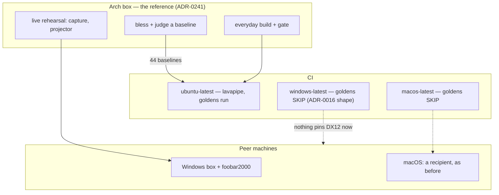

# 0218 — The reference machine becomes Arch

> **Status:** in-progress
> **Created:** 2026-09-20
> **Approved:** 2026-09-24 (user) — approved and deliberately NOT in
> `tools/conductor/queue.json`. See the 2026-09-24 amendment below for what it waits on.
> **Owner skill(s):** dev, human
> **Related ADRs:** [0241](../adrs/0241-linux-leads-and-windows-is-a-peer.md),
> [0242](../adrs/0242-the-software-reference-rasterizer-is-lavapipe-and-a-warp-claim-is-re-measured.md),
> [0023](../adrs/0023-golden-drift-guard-uses-frozen-fixtures.md),
> [0016](../adrs/0016-gpu-tests-opt-in-ci-scope.md),
> [0071](../adrs/0071-a-numeric-test-contract-states-a-property-or-names-its-machine.md)
> **Runs after:** [0120](done/0120-the-standalone-ships-on-ubuntu.md) and
> [0214](0214-the-linux-arm-reports-back.md) — this plan assumes a Linux build that captures audio
> and a green `ubuntu-latest` arm. It does not repeat any of that work.
> **BLOCKED, and the block is the machine.** Every phase needs the migrated Arch box, so nothing
> here starts from the Windows checkout - not even the phases that only edit documents, because
> Phase 5 describes a dev loop nobody has walked. The plan is drafted ahead of the migration so
> that the migration is not also a design exercise. It is **not approved** and does not belong in
> `tools/conductor/queue.json`: a lane would park on Phase 1 at the first judgement it cannot make.
> **Unblocks** when there is an Arch box with the tree checked out and 0120 + 0214 landed.

> **Amended 2026-09-22 (architect) — the machine exists; the block moves to
> [Plan 0219](done/0219-the-arch-box-builds-tests-and-runs-every-lane.md).** This plan now runs after 0219
> closes, not after "the migration". 0219 provisions the box, repairs the lane contracts, runs 0120
> there and proves the gate green. Three things carry over:
> - **Phase 2's gate may already exist.** If 0219 Phase 3 had to gate the pinned-baseline modules to
>   the adapter their baselines were blessed on (WARP), Phase 2 moves that constant to lavapipe
>   instead of introducing the gate.
> - **Phase 5 loses the dev-loop half.** `docs/developing.md`'s Arch prerequisites and `CLAUDE.md`'s
>   Linux linker paragraph are 0219's. Phase 5 keeps the stance: `nfr.md` §2/§9,
>   `on-device-validation.md`'s Linux column, and the README.
> - **Phase 3 can cross-check on the Windows box**, which the owner confirmed stays reachable. A
>   fixture whose drift is in doubt can be rendered on WARP again, rather than judged only against
>   the committed predecessor. Every hardware reading names the NVIDIA dGPU
>   ([ADR-0243](../adrs/0243-the-reference-boxs-hardware-adapter-is-its-discrete-gpu-and-a-reading-names-it.md)).

> **Amended 2026-09-22 (architect, Plan 0120's close) — the gate exists, and it was 0120's, not
> 0219's.** [Plan 0120](done/0120-the-standalone-ships-on-ubuntu.md) Phase 7 put it in one helper,
> `baseline_adapter` in `core/tests/common/mod.rs` (`cfg!(windows) && adapter_is_software()`).
> Phase 2 changes that predicate to lavapipe and rewrites its doc comment. Three things follow:
> - **Six modules call it, not four.** They are `golden.rs`, `attractor_trails`, `composite`,
>   `layer`, `line_joints` and `warp_mesh_wide`. The golden suite is `core/tests/golden.rs`, not
>   `core/tests/suite/golden.rs`.
> - **`RLX_BLESS` panics off the blessing adapter** (`bless_requested`). Until the predicate moves,
>   the recapture cannot run on the box. That is by design, and it is the first edit Phase 2 makes.
> - **The off-adapter readings are printed and then hidden.** Each skip prints the mean and max
>   outlier it would have asserted, but nextest hides a passing test's output unless
>   `.config/nextest.toml` names it under `success-output = "immediate"`, and the six are not named
>   there. Adding them is how Phase 2 gets its per-fixture diff against the WARP predecessor from an
>   ordinary run. It is also what keeps the Windows arm's readings visible after the move.

> **Amended 2026-09-22 (architect, Plan 0219's close) — the hardware tests do not reach the dGPU,
> and Phase 2 makes them.** [Plan 0219](done/0219-the-arch-box-builds-tests-and-runs-every-lane.md)
> Phase 3 found every `headless_hardware*` site resolving the AMD iGPU (RADV RENOIR), not the RTX
> 3080 Laptop. The cause is the test harness, not the engine: `core/tests/common/mod.rs` `build`
> passes `prefer_software: false`, which maps to `AdapterChoice::Default`, while
> [ADR-0243](../adrs/0243-the-reference-boxs-hardware-adapter-is-its-discrete-gpu-and-a-reading-names-it.md)'s
> Decision rests on the `HighPerformance` preference the live path already uses. The owner routed
> the repair here at 0219's close. Phase 2 therefore also:
> - **moves the harness's hardware path to `AdapterChoice::HighPerformance`**, which changes which
>   adapter every hardware test picks on every hybrid machine, the Windows box included (it has one
>   GPU, so it should read the same; the log says whether it did);
> - **makes each hardware site print `adapter.get_info()`'s `name` and `driver_info`** next to its
>   reading, where one does not already;
> - and gains a done-when: the log carries the adapter line one `headless_hardware*` site printed on
>   the Arch box, naming the NVIDIA dGPU. ADR-0243 stays `proposed` until that line exists, and this
>   plan's close accepts it.

> **Amended 2026-09-24 (architect) — approved, and the header's BLOCKED paragraph above is
> superseded.** Both machine blocks are gone: [Plan 0219](done/0219-the-arch-box-builds-tests-and-runs-every-lane.md)
> closed and [Plan 0120](done/0120-the-standalone-ships-on-ubuntu.md) closed, so the Arch box exists
> with the tree checked out and a green gate on it. Two things still hold this plan out of the
> conductor's queue, and neither is a design question:
> - **Phase 1 is a `human` probe, and it is first.** A lane opening on this plan parks on it at
>   once. The readings are owed by the owner, into this plan's `## Implementation log`, before the
>   plan is queued — which is the order the Decision argues for, not an accident of sequencing.
> - **[Plan 0214](0214-the-linux-arm-reports-back.md) has not closed.** The `Runs after` line above
>   names it, and Phase 2 reads the harness adapter path 0214 is still moving.
>
> Nothing else about the plan changes: the phases, their owners and their done-whens stand as
> written. It joins a lane once Phase 1's readings are in the log and 0214 has closed.

> **Amended 2026-10-06 (architect) — both holds are gone, and the plan is queueable.** Phase 1's
> readings are in the log (2026-09-29). 0214's two `dev` phases, 2 and 4, are done. The only phase
> left there is Phase 6, a run on the Ubuntu box that edits no harness code, so the adapter path
> Phase 2 reads is no longer moving. The `Runs after` line keeps 0214 only for that on-device
> reading, and it no longer gates this plan. Three things change with this:
> - **Phase 2 needs `RLX_BLESS` in the conductor allowlist before its session starts.** No entry in
>   `tools/conductor/settings.conductor.json` allows it today, which is half of why 0240 parked on
>   2026-10-02. The owner adds the entry when queueing the plan. A session cannot grant itself one.
> - **Phase 2 retires Plan 0249's bridge** (ADR-0264). Once the golden roster skips off lavapipe,
>   the WARP bless job blesses baselines nothing compares. Phase 2 deletes
>   `.github/workflows/bless.yml` and `scripts/bless-report.mjs`, and takes the row out of
>   `scripts/README.md` and `docs/testing.md`. If 0249 has not landed by then, there is nothing to
>   delete.
> - **The WARP blesses owed by other plans become moot.** 0248 Phase 7, 0240 Phase 7 and 0239 Phase 7
>   bless WARP baselines. Phase 2 recaptures all of them on lavapipe, and Phase 3 judges them. At
>   this plan's close, each such row still open is marked `done` with a pointer here, not run.

## TL;DR

Linux stops being a target this project ships to and becomes the machine it is judged on
([ADR-0241](../adrs/0241-linux-leads-and-windows-is-a-peer.md)). The visible change is that the
golden drift guard — 44 committed pictures — is recaptured on lavapipe and gated there, so a
baseline can be inspected on the machine the owner is looking at instead of downloaded from a CI
job. The first phase writes no code: it asks Hyprland what a client is allowed to do with its own
windows, because this app puts a console on a second display and cycles monitors with a key, and
Wayland does not owe a client either.

## Context & problem

Plans 0120 and 0214 make the standalone run on Linux. Neither makes Linux the *reference*, and that
is a separate and entirely documentary change — nothing in `core/` branches on an operating system,
so which platform leads is carried by `docs/nfr.md`, `docs/on-device-validation.md`,
`docs/developing.md`, the CI matrices and this project's habits.

Three concrete things stand between the current tree and that change.

- **The goldens are Windows artifacts.** Every baseline in `core/tests/golden/` was blessed on
  WARP, the DX12 software rasterizer, which exists only on Windows. On Arch the same
  `force_fallback_adapter` path resolves lavapipe, and the committed PNGs will not survive its
  tolerance. Until they move, the drift guard for the whole scene library cannot run on the
  development machine.
- **274 mentions of WARP across 73 `.rs` files are claims, not spellings.** They say what WARP
  mis-renders and what a blessing on it is worth.
  [ADR-0242](../adrs/0242-the-software-reference-rasterizer-is-lavapipe-and-a-warp-claim-is-re-measured.md)
  gives each of them three exits and forbids the fourth, which is translating a measurement nobody
  re-took.
- **Wayland permits less than Win32.** `C` opens the operator console on another display and `D`
  cycles monitors. A Wayland client cannot place its own window on a chosen output;
  fullscreen-on-output it can ask for. Whether that costs anything on Hyprland is unmeasured, and
  designing against a guess is how the aspect-ratio bug shipped twice.

## Decision

Probe first, then move the baselines, then sweep the claims, then move the documents. The probe is
a `human` phase in Plan 0120 Phase 1's shape — readings on the real machine, recorded verbatim,
before any code — because the display half is the only part of this whose shape is unknown.

The golden move follows ADR-0242: recapture on lavapipe, gate the roster to the reference adapter
so the Windows arm **skips** rather than fails, and **judge** the 44 diffs rather than blessing
blind. The claim sweep follows the same ADR's three exits, per site.

We rejected folding the probe's outcome into this plan. If Hyprland refuses something the operator
console depends on, that is a design question with rejected alternatives — an ADR — and not a phase
of a plan whose subject is the reference machine.

## Architecture diagram

```mermaid
flowchart TB
    subgraph arch["Arch box — the reference (ADR-0241)"]
        DEV["everyday build + gate"]
        BLESS["bless + judge a baseline"]
        LIVE["live rehearsal: capture, projector"]
    end

    subgraph ci["CI"]
        UB["ubuntu-latest — lavapipe, goldens run"]
        WIN["windows-latest — goldens SKIP (ADR-0016 shape)"]
        MAC["macos-latest — goldens SKIP"]
    end

    subgraph peer["Peer machines"]
        WBOX["Windows box + foobar2000"]
        RECIP["macOS: a recipient, as before"]
    end

    BLESS -->|44 baselines| UB
    DEV --> UB
    LIVE --> WBOX
    WIN -.->|nothing pins DX12 now| peer
    MAC -.-> RECIP
```

## Implementation phases

### Phase 1 — Ask Hyprland what a client may do
- **Owner skill:** `human`
- **What:** readings on the migrated box, before any code, in Plan 0120 Phase 1's shape. Nothing
  here is a design.
- **Files touched:** this plan's `## Implementation log` only.
- **Done when:** the log carries, verbatim, what happened for each of: the show window opening
  fullscreen on a named output; `D` cycling to the next monitor; `C` opening the console **on a
  different display than the show**; `F` and `Esc` in and out of fullscreen; and, separately, a
  capture run against `@DEFAULT_MONITOR@` with a real player on the PipeWire stack, naming the
  endpoint that resolved. Each reading says what was asked for and what the compositor did — a
  refusal recorded as a refusal, not as a bug to fix here. `vulkaninfo --summary` output names the
  adapters lavapipe and the hardware driver both resolve to.

### Phase 2 — The baselines move to lavapipe
- **Owner skill:** `dev`
- **What:** recapture all 44 golden baselines on the reference adapter, gate the golden roster to
  it, and produce the per-fixture diff report Phase 3 judges from.
- **Files touched:** `core/tests/golden/*.png`, `core/tests/suite/golden.rs` and the sibling
  pinned-baseline modules (`line_joints`, `attractor_trails`, `warp_mesh_wide`),
  `docs/testing.md`; and, if Plan 0249 has landed, `.github/workflows/bless.yml`,
  `scripts/bless-report.mjs`, `scripts/fixtures/bless-report/` and `scripts/README.md`, which
  this phase deletes (the 2026-10-06 amendment).
- **Done when:** the golden roster runs on lavapipe and **skips elsewhere with a printed notice**
  in [ADR-0016](../adrs/0016-gpu-tests-opt-in-ci-scope.md)'s shape, so the Windows and macOS arms
  neither run nor fail it; the suite is green on the Arch box against the new baselines; and the
  log carries one row per fixture with its mean and max-outlier difference **against its WARP
  predecessor** — which is the evidence Phase 3 reads, and is not itself a pass criterion. A
  fixture whose recapture is not a picture of the same thing is reported, not blessed.

### Phase 3 — Judge the 44
- **Owner skill:** `human`
- **What:** open each recaptured baseline beside its WARP predecessor and decide whether the
  difference is incidental rasterizer drift or something the guard should have caught.
- **Files touched:** this plan's `## Implementation log`.
- **Done when:** every fixture carries a one-line verdict — drift, or a finding with what was seen.
  A finding stops this plan and becomes its own work; ADR-0242 says a recapture is 44 first
  baselines, and a first baseline is compared against nothing unless a person compares it.

### Phase 4 — Every WARP claim takes one of three exits
- **Owner skill:** `dev`
- **What:** the sweep ADR-0242 specifies, over the 274 mentions in 73 `.rs` files, the 94
  software-adapter sites, and the 5 live reader documents — re-measured, generalised, or marked
  unverified, decided per site.
- **Files touched:** the 73 `.rs` files, `docs/testing.md`, `docs/capturing.md`, `docs/nfr.md`,
  `docs/on-device-validation.md`, `docs/roadmap-visual-richness.md`. **Not** `docs/plans/done/` or
  `docs/adrs/`, which are append-only records and stay as they are.
- **Done when:** no `.rs` comment or live document asserts a behaviour of WARP without either a
  lavapipe reading beside it or an explicit dated mark that it is unverified there; every skip
  keyed on the software adapter states which of the two rasterizers its reason was measured on;
  `docs/testing.md` names the reference adapter in its own voice; and the log reports the count
  that took each of the three exits. `cargo clippy --workspace --all-targets -- -D warnings` and
  `node scripts/check-comment-hygiene.mjs` stay green.

### Phase 5 — The documents take the stance
- **Owner skill:** `dev`
- **What:** the four bindings [ADR-0241](../adrs/0241-linux-leads-and-windows-is-a-peer.md) names.
- **Files touched:** `docs/nfr.md` (§2's baseline gains a Linux row; §9's hardware matrix names the
  Arch box primary and the Windows box the peer), `docs/on-device-validation.md` (a Linux column,
  and the live checks expected there first), `docs/developing.md` (the Arch dev loop, the system
  packages, and the fact that the MSVC linker override is Windows-only), `CLAUDE.md` (the
  machine-setup section), `README.md`.
- **Done when:** a reader arriving at `docs/nfr.md` §9 is told which machine a reading is taken on
  and which one is checked against it; `docs/developing.md` walks an Arch checkout to a green gate
  without a Windows step in the path; every count-free platform phrasing survives
  `node scripts/check-system-counts.mjs`; and `node scripts/check-doc-links.mjs`,
  `check-index-rows.mjs`, `toc.mjs --check` and `check-reader-prose.mjs` are green.

### Phase 6 — A rehearsal on the box
- **Owner skill:** `human`
- **Blocks merge:** no
- **What:** the thing none of the above proves — that the app is good to run a show from on this
  machine.
- **Files touched:** `docs/on-device-validation.md` (the record), this plan's log.
- **Done when:** the standalone runs for an unbroken stretch against real music through the
  PipeWire stack, fullscreen on the external display, with the console open on the laptop panel if
  Phase 1 said that is possible; the log names the frame-time reading observed and the
  `diagnostics.log` path it came from; and anything that behaved differently from the Windows box
  is written down, whether or not it is a defect.

## Risks & open questions

- **The whole plan is blocked on a machine that does not exist yet.** Every phase needs the
  migrated box. It is drafted now so the migration is not also a design exercise; it does not start
  until there is an Arch box with the tree checked out and 0120 + 0214 landed.
- **Phase 3 can stop the plan.** That is its job. A finding there is more valuable than a green
  Phase 2, and the plan is written so that outcome is a stop rather than a bless.
- **Phase 4's third exit is the cheapest**, so most sites will take it, and nothing gates the
  ratio. The log's per-exit count is the only visibility; read it as a reading, not a score.
- **The Windows drift guard goes away** and nothing replaces it (ADR-0242, Negative). A DX12-only
  regression would ship. Whether that wants an instrument is a question for after this lands, not a
  phase here.
- **lavapipe may be slow enough to matter.** The preset sweeps already pay a fixed per-process
  adapter cost ([ADR-0222](../adrs/0222-a-preset-sweeps-fixed-cost-is-paid-per-process-so-the-lever-is-the-batch.md));
  if lavapipe is materially slower than WARP the gate's cost moves, and Phase 2's log should say
  what the suite took.

## What this plan does NOT do

- **It does not redesign the console or the display cycle.** Phase 1 records what Hyprland permits.
  If something the operator console depends on is refused, that is an ADR with rejected
  alternatives and a plan of its own.
- **It does not add a single Linux feature.** The four surfaces Windows has and Linux does not —
  MPRIS now-playing, device enumeration, a video-out to replace Spout, and a second player host
  over the existing C ABI — are each their own ADR and plan. They are listed in Followups.
- **It does not move a release artifact.** The Linux tarball is still built on `ubuntu-latest` and
  the Windows zip on `windows-latest`; a dev box is not a build host, and glibc is forward
  compatible only.
- **It does not decide Arch packaging.** A `PKGBUILD` or an AUR entry runs into `docs/nfr.md` §8's
  "no installer", which is a decision with its own alternatives.
- **It does not touch `docs/plans/done/` or `docs/adrs/`.** Those records say WARP because WARP is
  what was measured, and they are append-only.

## Implementation log

> Written by `dev` — one row per phase as that phase's commit lands, and the close block after the
> last one. **The phases above are the contract; everything here is what happened.**

**Lane:** `main` for Phase 1's log; from Phase 2, branch `plan-0218-the-reference-machine-becomes-arch`, worktree `/home/igor/Work/rlx-plan-0218`

| phase | owner | state | commit |
|---|---|---|---|
| 1 — Ask Hyprland what a client may do | human | done - one display, so D and a second-display console were not answerable | b1543a29 |
| 2 — The baselines move to lavapipe | dev | done | 8c2ec152 |
| 3 — Judge the 44 | human | done - all 53 drift, no finding | effc6503 |
| 4 — Every WARP claim takes one of three exits | dev | done | d2ebef49 |
| 5 — The documents take the stance | dev | done | 69347332 |
| 6 — A rehearsal on the box | human | owed | |

### Notes

- **Phase 1 readings, 2026-09-29.** Taken on the Arch box (Omarchy, Hyprland) with the owner at the
  screen, reading what happened aloud, and an architect session reading the compositor with
  `hyprctl clients -j`. Player: the release `ritmolux` built at `fb083a31` (v0.152.0), run with a
  scratch `XDG_DATA_HOME` so the owner's own `config.toml` was neither read nor written. **One display
  was connected**: `eDP-1`, Chimei Innolux 0x1540, 2560x1440 @ 165 Hz, scale 1.25.
  - **Fullscreen on a named output.** Asked for with `[output] display_name = "eDP-1"` and
    `fullscreen = true`. The compositor reported the show window fullscreen (state 2) on monitor 0,
    `eDP-1`, at 2048x1152 logical (2560x1440 at 1.25), at 165 fps. Owner: *"yes"*, fullscreen and
    reacting to the music.
  - **`D` to the next monitor.** Pressed twice. Owner: *"nothing"*. With one display there is no next
    monitor, so this is not a reading of the cycle; it shows only that `D` with nowhere to go does
    nothing visible. **Owed with a second display.**
  - **`C`, the console on a different display.** Owner: *"yes, on top"*. `diagnostics.log` recorded
    `console opened: 1014x553, present mode Mailbox, frame latency 1, presented every 1 frame(s), with
    preview`, and on closing `393 presented, 0 skipped`. That is `docs/running.md`'s single-monitor
    behaviour, an ordinary window on the one monitor. **The different-display half is owed with a
    second display.**
  - **`F` and `Esc`.** Owner: `F` left fullscreen and `F` went back. After the sequence the compositor
    showed the show windowed (fullscreen 0) and tiled beside the editor, with the process running, so
    `Esc` left fullscreen and did not quit.
  - **Capture on PipeWire with a real player.** Music played from Firefox (YouTube). The player's
    capture stream is PipeWire source-output "system audio", application `Ritmolux`, on source
    `alsa_output.pci-0000_07_00.6.analog-stereo.monitor`, the default sink's monitor. Owner: the show
    reacted to the music.
  - **`vulkaninfo --summary`:** `AMD Radeon Graphics (RADV RENOIR)` (integrated, driver `radv`, API
    1.4.354), `NVIDIA GeForce RTX 3080 Laptop GPU` (discrete, driver `NVIDIA`, API 1.4.341), and
    `llvmpipe (LLVM 22.1.8, 256 bits)` (CPU, driver `llvmpipe`, API 1.4.354). The last is Mesa's
    software Vulkan, lavapipe, which is the adapter ADR-0242 makes the golden reference.
  - **Found, not asked:** the show's window reports an **empty app class** to Hyprland (`class: ""`),
    where every other client names itself (`code`, `firefox`). A user cannot target the show with a
    window rule (a workspace, a monitor, "no blur") by class, only by title, and the title changes
    with every preset. This is a reading for the architect, not a defect repaired here.
- **Phase 2: 53 baselines, not 44.** `core/tests/golden/` holds 53 PNGs: 37 in `golden.rs` (the
  16-system roster, 20 `EXTRA_FIXTURES`, `waterfall_ramp`), 10 `composite_*`, 3 `layer_*`, and
  `line_joint_zigzag`, `attractor_trails` and `warp_mesh_wide`. All 53 were recaptured with
  `RLX_BLESS=1` on `llvmpipe (LLVM 22.1.8, 256 bits) (Vulkan, Cpu), driver llvmpipe Mesa
  26.2.2-arch1.1`. 48 files changed. `plexus`, `plexus_sheet`, `lsystem_space`,
  `lsystem_endless_flat` and `lsystem_endless_space` re-encoded byte-identical.
- **Phase 2: the gate predicate.** `baseline_adapter` is `cfg!(target_os = "linux") &&
  adapter_is_software() && description.starts_with("llvmpipe")`. The name check is an addition
  beyond "software on Linux".
- **Phase 2: the hardware path.** `common::build` asks for `AdapterChoice::HighPerformance` on every
  non-software build. That covers `headless_on(_, _, false)` (`collage_layout`, `warp_mesh`) as well as
  `headless_hardware*`. It prints `hardware adapter: <description>` once per build, centrally, not
  per site. The description carries the name and the driver info. One `headless_hardware` site
  (`layer::a_multiply_layer_meets_a_lit_backdrop`, run with `--no-capture`) printed: `hardware
  adapter: NVIDIA GeForce RTX 3080 Laptop GPU (Vulkan, DiscreteGpu), driver NVIDIA 610.57.04`.
- **Phase 2: files outside the phase's list.** `core/tests/common/mod.rs`, `.config/nextest.toml`
  and `core/tests/suite/layer.rs` are named by the 2026-09-22 amendments. The golden suite is
  `core/tests/golden.rs`. Not named anywhere, and edited because the move made their text false:
  - the `.github/workflows/ci.yml` header comment;
  - `core/tests/fixtures/README.md`, which said to bless "on Windows WARP";
  - the comment block of `core/tests/fixtures/attractor_trails.toml`. Only the comment changed, and
    the baseline reads 0.0000 / 0 after the edit.
  - the `attractor_trails` row of `docs/testing.md`'s table.
- **Phase 2: `.config/nextest.toml`.** A second `success-output = "immediate"` block names the seven
  comparison tests: two in `golden`, one in each of the five suite modules.
- **Phase 2: retired.** `.github/workflows/bless.yml`, `scripts/bless-report.mjs` and
  `scripts/fixtures/bless-report/` were deleted. `scripts/README.md` lost the "fifth kind" paragraph,
  and `docs/testing.md` lost the dispatched-job section. Nothing else referenced them, and
  `check-gate-carriers.mjs` stays green.
- **Phase 2: CI is unmeasured.** `ubuntu-latest` now asserts the goldens against baselines from
  this box's Mesa 26.2.2 / LLVM 22.1.8 lavapipe. The runner's Mesa is a different build. No CI run
  was read.
- **Phase 2: cost.** On lavapipe, `scenes_match_golden_baselines` took 19.5 s and the seven
  comparison tests 19.6 s wall. `-P fast` took 333 s, 1920 passed. `background_composite`,
  `reaction_diffusion` and `golden` were run in full because the hardware path changed under them,
  and all 7 passed.
- **Phase 2: per-fixture readings of the lavapipe capture against its WARP predecessor.** Taken
  before the predicate moved, from the skip path's printed readings. The tolerance is mean 0.02 /
  outlier 48 for every fixture. Rows marked **over** exceed it. Four of those (`reaction_diffusion`,
  `waterfall`, `parametric_lissajous_3d`, `attractor`) were opened beside their predecessors, and each
  showed the same figure. That is not Phase 3's verdict. No recapture was withheld.

  | fixture | mean | max outlier | |
  |---|---|---|---|
  | fragment_field | 0.0006 | 2 | |
  | swarm | 0.0005 | 1 | |
  | parametric_curve | 0.0003 | 2 | |
  | lsystem | 0.0001 | 2 | |
  | star_pattern | 0.0000 | 1 | |
  | reaction_diffusion | 0.0110 | 190 | **over** |
  | attractor | 0.0018 | 114 | **over** |
  | spectrum | 0.0000 | 1 | |
  | emitter | 0.0000 | 1 | |
  | shape_field | 0.0012 | 8 | |
  | warp_mesh | 0.0005 | 2 | |
  | shape_collage | 0.0007 | 1 | |
  | analytic_field | 0.0007 | 5 | |
  | cellular | 0.0002 | 1 | |
  | plexus | 0.0000 | 0 | |
  | waterfall | 0.0017 | 213 | **over** |
  | attractor_depth | 0.0022 | 62 | **over** |
  | attractor_ifs | 0.0001 | 3 | |
  | swarm_shaped | 0.0001 | 1 | |
  | backdrop_ramp | 0.0009 | 2 | |
  | backdrop_band | 0.0008 | 2 | |
  | warp_mesh_milk | 0.0006 | 3 | |
  | warp_mesh_shader | 0.0002 | 1 | |
  | shape_collage_roster | 0.0014 | 1 | |
  | warp_mesh_stroke | 0.0002 | 2 | |
  | shape_field_path | 0.0009 | 4 | |
  | analytic_field_escape | 0.0007 | 6 | |
  | cellular_trail | 0.0006 | 2 | |
  | cellular_ltl | 0.0001 | 1 | |
  | cellular_cyclic | 0.0009 | 1 | |
  | plexus_sheet | 0.0000 | 0 | |
  | parametric_torus_knot | 0.0010 | 208 | **over** |
  | parametric_lissajous_3d | 0.0010 | 224 | **over** |
  | lsystem_space | 0.0000 | 0 | |
  | lsystem_endless_flat | 0.0000 | 0 | |
  | lsystem_endless_space | 0.0000 | 0 | |
  | waterfall_ramp | 0.0011 | 159 | **over** |
  | composite_trails | 0.0001 | 2 | |
  | composite_kaleido | 0.0005 | 1 | |
  | composite_kaleido_squash | 0.0005 | 1 | |
  | composite_overlap | 0.0001 | 2 | |
  | composite_bloom | 0.0001 | 1 | |
  | composite_bloom_exposed | 0.0000 | 1 | |
  | composite_symmetry | 0.0005 | 1 | |
  | composite_warp_swirl | 0.0001 | 1 | |
  | composite_warp_ripple | 0.0001 | 2 | |
  | composite_warp_fisheye | 0.0004 | 4 | |
  | layer_under | 0.0006 | 4 | |
  | layer_over | 0.0004 | 3 | |
  | layer_multiply | 0.0006 | 2 | |
  | line_joint_zigzag | 0.0000 | 1 | |
  | attractor_trails | 0.0009 | 89 | **over** |
  | warp_mesh_wide | 0.0006 | 2 | |

- **Phase 3, 2026-10-06 (owner).** All 53 recaptures judged against their WARP predecessors on a
  side-by-side page (old, new, an x8 diff and a flicker toggle per fixture), over-tolerance ones first.
  Verdict: **all drift, no finding.** Five of the eight over tolerance carry an owed WARP bless's
  intended change on top of the drift: 0248 Phase 7's four and 0240 Phase 7's `attractor_depth`. At
  the close those rows are marked done with a pointer here, and 0249 Phase 3's dispatch is moot.
  - `analytic_field` (mean 0.0007 / outlier 5): drift.
  - `analytic_field_escape` (mean 0.0007 / outlier 6): drift.
  - `attractor` (mean 0.0018 / outlier 114, over): drift; same figure, the difference is scattered pixels.
  - `attractor_depth` (mean 0.0022 / outlier 62, over): drift, plus the intended change 0240 Phase 7 owed on WARP; same figure.
  - `attractor_ifs` (mean 0.0001 / outlier 3): drift.
  - `attractor_trails` (mean 0.0009 / outlier 89, over): drift; same figure, the difference is scattered pixels.
  - `backdrop_band` (mean 0.0008 / outlier 2): drift.
  - `backdrop_ramp` (mean 0.0009 / outlier 2): drift.
  - `cellular` (mean 0.0002 / outlier 1): drift.
  - `cellular_cyclic` (mean 0.0009 / outlier 1): drift.
  - `cellular_ltl` (mean 0.0001 / outlier 1): drift.
  - `cellular_trail` (mean 0.0006 / outlier 2): drift.
  - `composite_bloom` (mean 0.0001 / outlier 1): drift.
  - `composite_bloom_exposed` (mean 0.0000 / outlier 1): drift.
  - `composite_kaleido` (mean 0.0005 / outlier 1): drift.
  - `composite_kaleido_squash` (mean 0.0005 / outlier 1): drift.
  - `composite_overlap` (mean 0.0001 / outlier 2): drift.
  - `composite_symmetry` (mean 0.0005 / outlier 1): drift.
  - `composite_trails` (mean 0.0001 / outlier 2): drift.
  - `composite_warp_fisheye` (mean 0.0004 / outlier 4): drift.
  - `composite_warp_ripple` (mean 0.0001 / outlier 2): drift.
  - `composite_warp_swirl` (mean 0.0001 / outlier 1): drift.
  - `emitter` (mean 0.0000 / outlier 1): drift.
  - `fragment_field` (mean 0.0006 / outlier 2): drift.
  - `layer_multiply` (mean 0.0006 / outlier 2): drift.
  - `layer_over` (mean 0.0004 / outlier 3): drift.
  - `layer_under` (mean 0.0006 / outlier 4): drift.
  - `line_joint_zigzag` (mean 0.0000 / outlier 1): drift.
  - `lsystem` (mean 0.0001 / outlier 2): drift.
  - `lsystem_endless_flat` (mean 0.0000 / outlier 0): drift (re-encoded byte-identical).
  - `lsystem_endless_space` (mean 0.0000 / outlier 0): drift (re-encoded byte-identical).
  - `lsystem_space` (mean 0.0000 / outlier 0): drift (re-encoded byte-identical).
  - `parametric_curve` (mean 0.0003 / outlier 2): drift.
  - `parametric_lissajous_3d` (mean 0.0010 / outlier 224, over): drift, plus the intended change 0248 Phase 7 owed on WARP; same figure.
  - `parametric_torus_knot` (mean 0.0010 / outlier 208, over): drift, plus the intended change 0248 Phase 7 owed on WARP; same figure.
  - `plexus` (mean 0.0000 / outlier 0): drift (re-encoded byte-identical).
  - `plexus_sheet` (mean 0.0000 / outlier 0): drift (re-encoded byte-identical).
  - `reaction_diffusion` (mean 0.0110 / outlier 190, over): drift; same figure, the difference is scattered pixels.
  - `shape_collage` (mean 0.0007 / outlier 1): drift.
  - `shape_collage_roster` (mean 0.0014 / outlier 1): drift.
  - `shape_field` (mean 0.0012 / outlier 8): drift.
  - `shape_field_path` (mean 0.0009 / outlier 4): drift.
  - `spectrum` (mean 0.0000 / outlier 1): drift.
  - `star_pattern` (mean 0.0000 / outlier 1): drift.
  - `swarm` (mean 0.0005 / outlier 1): drift.
  - `swarm_shaped` (mean 0.0001 / outlier 1): drift.
  - `warp_mesh` (mean 0.0005 / outlier 2): drift.
  - `warp_mesh_milk` (mean 0.0006 / outlier 3): drift.
  - `warp_mesh_shader` (mean 0.0002 / outlier 1): drift.
  - `warp_mesh_stroke` (mean 0.0002 / outlier 2): drift.
  - `warp_mesh_wide` (mean 0.0006 / outlier 2): drift.
  - `waterfall` (mean 0.0017 / outlier 213, over): drift, plus the intended change 0248 Phase 7 owed on WARP; same figure.
  - `waterfall_ramp` (mean 0.0011 / outlier 159, over): drift, plus the intended change 0248 Phase 7 owed on WARP; same figure.
- **Phase 4: exit counts.** A site is one comment block or one string literal making a claim. A
  block that pairs a "the golden suite captures on WARP" fact with a WARP claim was split: the fact
  was generalised and the claim marked, and it counts once under each. There are about 13 such
  blocks.

  | | re-measured | generalised | marked |
  |---|---|---|---|
  | `.rs` files | 4 | 53 | 120 |
  | the five documents | 1 | 6 | 9 |

  About 60 further uppercase `WARP` lines are MilkDrop or warp-mesh identifiers (`WARP_GROUP`,
  `WARP_SHADER`, `DEFAULT_WARP_*`, `RLX_WARP_*`, `WARP_CONTROL`) and were left. Every mark reads
  *unverified on lavapipe as of 2026-10-06*. The `.rs` sweep was split by file across four
  subagents, and the counts above are their tallies plus the re-measured sites.
- **Phase 4: the four re-measured sites**, on the Arch box: lavapipe `llvmpipe (LLVM 22.1.8)`, Mesa
  26.2.2; hardware `NVIDIA GeForce RTX 3080 Laptop GPU`, driver 610.57.04.
  - `the_dither_is_one_encoded_level_at_both_ends_of_the_range` reads a worst move of 1 in both
    sweeps (mean 0.3328 dark, 0.3384 bright). WARP's was 2 in the dark sweep. The `is_software`
    bound of 2 was left in code, because Windows CI still runs the test on WARP.
  - `the_dither_dissolves_a_dark_ramps_plateaus` reads 130 px → 19 px.
  - `the_adapters_agree_on_the_authored_contour` reads `frame_diff` 0.000871.
  - `the_adapters_agree_on_the_warp_mesh` reads `frame_diff` 0.000539.
- **Phase 4: code beyond comments.** The two adapter-agreement tests print each adapter's
  description, and their `WARP mean rgb` label became `software`.
  `the_adapters_agree_on_the_authored_contour` was moved from `Renderer::new_headless` (the
  `Default` adapter, the iGPU on this box) to `new_headless_on` with `HighPerformance` /
  `Software`, matching `common::build`. Runtime strings that blamed WARP now carry the mark or name
  the class: the `headless_hardware` reason, `background_composite`'s reason, the
  `reaction_diffusion` long-run reason, `dissolve_at`'s skip notice, `NEEDS_HARDWARE_FOR_TIMING`,
  one `#[ignore]` reason in `sanity.rs`, and three assert messages in `tonemap/tests.rs`.
- **Phase 4: left unmarked.** These were left as they are:
  - four pointer phrases that refer back to a marked block (`background.rs` "WARP quirk", "WARP +
    passthrough", "NFR §1 + WARP"; `trails.rs` "WARP-sensitive part");
  - the `RIG` const and the `ALLOWED` evidence strings in `tonemap/tests.rs`, which the `RIG` doc
    comment's mark covers. ADR-0058 quotes `RIG`.
  - the "DX12 backend's shader compiler" lost-device claims in `marks.rs` and `marks/tests.rs`, which
    do not say WARP.
  - `nfr.md`'s coverage-floor note that the dev box has hardware where CI has WARP. It states where
    CI runs, not how WARP behaves.
- **Phase 4: found, not acted on.** `golden.rs` is one of the nine binaries `-P fast` excludes, and
  `coverage`, a Windows job, is the only CI place that runs them. Since Phase 2 the roster skips
  there, so **the 37 `golden.rs` fixtures assert nowhere in CI**. The suite-module baselines
  (`composite`, `layer`, `line_joints`, `attractor_trails`, `warp_mesh_wide`) do assert, on the
  ubuntu arm. Also, the `.github/workflows/ci.yml` comment at the `-P fast` step still says a
  baseline is "a measurement taken on WARP" that "prints its reading and skips". Neither file is in
  Phase 4's list.
- **Phase 5: §2 already had its Linux row** (Plan 0120). Phase 5 added a note under it naming Arch
  as the reference and the release runner's glibc as the floor. §9's table gained a `Standing`
  column, and two paragraphs follow it: which machine a reading is taken on and which is checked
  against it, and that an undated "dev box" reading from before 2026-09-22 is a Windows one.
- **Phase 5: `on-device-validation.md` has no per-platform columns**, so the Linux column is a new
  table, *Where each check runs first*, with a Linux and a Windows column per checklist section.
  *How to run* gained the Linux binary and log path.
- **Phase 5: `developing.md`'s Arch loop was 0219's** and was not re-walked. Its two bullets about
  the golden skip and the default adapter were rewritten, because Phase 2 made both false. A new
  sentence states the finding above: `golden` is asserted only by a full run on a Linux box with
  lavapipe. Two readings dated 2026-09-15 and 2026-09-19 that said "the reference machine" now
  say the Windows box.
- **Phase 5: `CLAUDE.md`** gained one paragraph under *Machine setup and debug info*. `README.md`
  gained a *Linux leads and Windows is a peer* platform note, and its status line and capture note
  now name Linux capture as exercised.

- **Pre-review, 2026-10-06 (owner): the swarm pair re-blessed on lavapipe.** Main brought Plan
  0239's camera swarm into the lane (8bd43bb7), and `swarm` / `swarm_shaped` were still this plan's
  pre-0239 recapture, so `scenes_match_golden_baselines` failed on those two alone. Re-blessed with
  `RLX_BLESS=swarm,swarm_shaped` on llvmpipe; old and new opened side by side show the same field
  re-projected through the camera. This settles Plan 0239 Phase 7.

### Close triggers

- **`presets/` touched:** no
- **Plan header `Closes:`** none
- **What shipped:** test harness, baselines and docs only. The golden baselines were recaptured on
  lavapipe and gated there. The harness's hardware path moved to the high-performance adapter. The
  WARP bless job and its report script were deleted. Every `core/src` edit is a comment, a WGSL
  comment inside a shader string, or test code; no shipped behaviour changed.
- **Operator docs touched:** `docs/testing.md`, `docs/capturing.md`, `docs/nfr.md`,
  `docs/on-device-validation.md`, `docs/roadmap-visual-richness.md`, `docs/developing.md`,
  `README.md`, `CLAUDE.md`, `scripts/README.md`, `core/tests/fixtures/README.md`
- **Backlog probes (`node scripts/check-backlog-claims.mjs`):** exit 0, 58 stated reductions hold
  across 29 live entries, 4 unprobeable
- **Full suite:** owed to the conductor's pre-review gate (ADR-0207)
- **Outstanding `human` phases:** Phase 6 (a rehearsal on the box). Phase 1's second-display
  readings (`D` and the console on another display) are also owed, per its row.

## Followups (after this lands)

Each is an interview, an ADR and a plan of its own; none is scoped here.

- **MPRIS now-playing** — the D-Bus counterpart to `nowplaying_win.rs`. Adds a dependency, which
  `docs/nfr.md` §4 makes a cost to justify.
- **Linux device enumeration** — `--list-devices` and a live `[input] device`. ADR-0131 declined
  this deliberately: the PulseAudio simple API cannot enumerate, and the async context API is a
  much larger program. The alternatives are that API, the `pipewire` crate, and shelling to
  `pactl`.
- **A Linux video-out** — Spout has no counterpart. `--sink stdout` already feeds `ffmpeg`; a live
  VJ chain wants a PipeWire video node or NDI.
- **A second player host over the C ABI** — DeaDBeeF or Audacious, the Arch-native counterpart to
  the foobar2000 component. The C ABI exists precisely so this is a shim rather than a port
  ([ADR-0001](../adrs/0001-rust-core-wgpu-cabi-foobar-shim.md)); which host, and whether the ABI
  needs widening at all, is the decision.
