# 0219 — The Arch box builds, tests and runs every lane

> **Status:** in-progress
> **Created:** 2026-09-22
> **Owner skill(s):** human, dev, studio-builder
> **Related ADRs:** [0243](../adrs/0243-the-reference-boxs-hardware-adapter-is-its-discrete-gpu-and-a-reading-names-it.md) (proposed),
> [0241](../adrs/0241-linux-leads-and-windows-is-a-peer.md),
> [0242](../adrs/0242-the-software-reference-rasterizer-is-lavapipe-and-a-warp-claim-is-re-measured.md),
> [0131](../adrs/0131-the-linux-standalone-captures-through-pulseaudios-simple-api.md),
> [0205](../adrs/0205-an-approved-plan-runs-under-a-conductor-and-every-judgement-it-cannot-make-parks-the-plan.md),
> [0208](../adrs/0208-a-patch-cli-update-runs-with-a-warning-and-every-session-proves-the-hooks-ran.md),
> [0122](../adrs/0122-a-sidecar-tool-documents-itself-in-one-place.md),
> [0016](../adrs/0016-gpu-tests-opt-in-ci-scope.md)
> **Interleaves with:** [0120](done/0120-the-standalone-ships-on-ubuntu.md) — its Phases 2-5 run on this
> box **between this plan's Phase 2 and Phase 3**. See "Sequencing" below.
> **Unblocks:** [0218](0218-the-reference-machine-becomes-arch.md), whose "the machine does not
> exist yet" block this plan clears.

## TL;DR

The Arch box exists now: Omarchy on Hyprland, PipeWire 1.6.8, an RTX 3080 Laptop GPU next to an AMD
Vega iGPU. But nothing in the development loop has ever run on it. There is no Rust toolchain, no
Vulkan software rasterizer, the pre-push hook is not installed, every lane's skill tells it to commit
through a PowerShell tool that does not exist here, and wgpu is compiled with no Linux backend, so a
build would find no GPU at all.

This plan takes the box from bare to the point where **each of the four lanes can do real work on
it**: `dev` pushes through a green hook, `studio-builder` drives a Linux player, `preset-author`
renders and reports, and the conductor runs a lane. The engine work in the middle, a Vulkan backend
and PulseAudio capture, is already written down as Plan 0120. This plan runs 0120 here instead of
duplicating it, and wraps the machine, the tooling and the lane contracts around it.

## Context & problem

ADR-0241 decided that Linux leads. Plans 0120, 0214 and 0218 carry that decision out, but all three
were written from the Windows checkout, before this box existed, and their shape reflects that:

- **0120 splits by who can witness the evidence.** Its 2026-09-20 amendment moved every
  *"it runs green"* clause to 0214, because a Windows session could not compile the Linux arm. From
  this box, most of those clauses can be witnessed locally. Only the CI arm and the release dry run
  still need a push.
- **0218 is marked blocked on a machine that did not exist.** It now does. 0218 is about making this
  box the *reference* (goldens, WARP claims, the documents' stance). It assumes someone has already
  made the box *work*, and no plan owns that step. This plan is that step.

What the box needs was established on 2026-09-22 by probing it and sweeping the tree:

| Area | Reading | Consequence |
|---|---|---|
| Toolchain | `cargo`, `rustup`, `cargo-nextest`, `cargo-release`, `cargo-deny` all absent; `rust-toolchain.toml` pins 1.97.1 | nothing builds |
| GPU | `nvidia-open-dkms` 610.57.04 + `vulkan-radeon`; **no `vulkan-swrast`, no `vulkaninfo`** | no software adapter, so every `force_fallback_adapter` test would skip even with a backend |
| wgpu | `core/Cargo.toml:73-83` enables `dx12` on Windows and `metal` on macOS, and nothing on Linux | no adapter at all; Plan 0120 Phase 2 adds the `vulkan` arm |
| Capture | no `capture_linux.rs`; `capture_start.rs` falls through to `Unsupported` | silence-driven visuals; Plan 0120 Phase 3 |
| Audio stack | `libpulse` 17.0, `pipewire-pulse` 1.6.8 | ADR-0131's premise was probed on Ubuntu, not on this box |
| Hook | `git config core.hooksPath` unset | no pre-push gate |
| Lane contracts | the PowerShell here-string commit rule appears in `CLAUDE.md`, `dev/SKILL.md`, `dev/references/commit-conventions.md` (unconditionally), `architect/SKILL.md`, `preset-author/SKILL.md` and `studio-builder/SKILL.md`; `preset-author/references/render-loop.md` gives the render loop in PowerShell syntax; the project-context references list Windows + macOS only | every lane is told to use a tool that does not exist here, and gets no replacement |
| Studio | `package.json` has no `package:linux`, `electron-builder.yml` has no `linux:` target, `windowless.test.ts` checks only on win32; the player path resolves `ritmolux` on Linux | the dev loop should work; packaging does not |
| Conductor | `claude` 2.1.278 against `VERIFIED_CLI` 2.1.270-2.1.273, verified only on "Windows 10, Node v22"; `settings.conductor.json` has parallel PowerShell and Bash rules; one test is win32-only | runs with ADR-0208's warning, but none of its safety claims has been checked on Linux |
| sd-filter | `torch==2.6.0+cu124` publishes wheels for CPython up to 3.13; Arch's `python3` is **3.14.7**; the docs name only `.venv/Scripts/python` | the CUDA environment cannot be installed as written |
| Linker | Rust 1.90+ already links `x86_64-unknown-linux-gnu` with `rust-lld` by default | the Windows `WORK/.cargo/config.toml` override has no Linux counterpart, and probably needs none. Unmeasured |

## Decision

A new bootstrap plan, run in the order the dependencies force: provision the box, repair the lane
contracts, **run 0120 on this box**, then prove the gate, the studio, the conductor and the sidecar
one at a time. It ends with a human phase in which each lane does one real task. The hardware
adapter for every reading is the NVIDIA dGPU ([ADR-0243](../adrs/0243-the-reference-boxs-hardware-adapter-is-its-discrete-gpu-and-a-reading-names-it.md)).

Rejected during the interview:
- **Replacing 0120, 0214 and 0218 with one umbrella plan.** It would re-author approved work to get
  one sequence, and 0218's subject (which machine judges) is a different subject from this one
  (whether the machine works).
- **Leaving 0120 and 0214 exactly as written.** 0120 would keep handing to CI compiles this box can
  run in seconds.

For the commit-message rule, a lane on Linux or macOS commits a multi-line message through the Bash
tool's quoted heredoc (`git commit -F - <<'EOF'`), and Windows keeps the PowerShell here-string. The
rejected alternative is one file-based mechanism everywhere (`-F <scratch path>`). It is the only
uniform option, but it needs a write permission outside the worktree that a headless conductor
session may not be given, and it adds a tool call to every commit on the platforms where the Bash
tool already works. This is recorded here and not in an ADR because the rule only picks a tool per
platform. Phase 2 proves the Linux mechanism before any skill says to use it.

## Sequencing

```mermaid
flowchart LR
    subgraph p0219a["0219, first half"]
        P1["P1 human<br/>provision + readings"]
        P2["P2 dev<br/>lane contracts + dev docs"]
    end
    subgraph p0120["0120 on this box"]
        Q2["P2 vulkan arm<br/>+ CI arm declared"]
        Q3["P3 PulseAudio capture"]
        Q45["P4-5 tarball + docs"]
    end
    subgraph p0219b["0219, second half"]
        P3["P3 dev<br/>the gate is green here"]
        P4["P4 studio-builder<br/>studio drives a Linux player"]
        P5["P5 dev<br/>conductor verified on Linux"]
        P6["P6 dev<br/>sd-filter on CUDA"]
        P7["P7 human<br/>a working day"]
    end
    P1 --> P2 --> Q2 --> Q3 --> Q45 --> P3 --> P4 --> P5 --> P6 --> P7
    P7 --> R["0214: push, CI readings"] --> S["0218: the box becomes the reference"]
```



0120 starts after Phase 2 because Phase 2 is what makes a `dev` session on this box able to commit
by the rules. Phase 3 comes after 0120 because the gate cannot mean anything until wgpu has a Linux
backend and the capture arm exists. **0120 runs as a human-started session, not under the
conductor.** The conductor is not verified on Linux until Phase 5, and 0120 is currently listed in
`tools/conductor/queue.json` lane `b`. Until Phase 5 closes, do not start the conductor on this box.

## Implementation phases

### Phase 1 — Provision the box, and read what it has
- **Owner skill:** `human`
- **What:** install the toolchain and system packages, install the hook, and record the readings
  every later phase is written against. Nothing in this phase is a design decision.
- **Files touched:** this plan's `## Implementation log` only.
- **Install** (Arch package names; the log records exact versions):
  `rustup` (then `rustup show` inside the checkout installs the pinned 1.97.1 with rustfmt and
  clippy), `vulkan-swrast` (lavapipe), `vulkan-tools`, `cargo-nextest`, `cargo-release`,
  `cargo-deny`, and `uv` for Phase 6's interpreter. `libpulse`, `pkgconf`, `wayland`,
  `libxkbcommon`, `ffmpeg`, `node` and `python3` are already present. Then
  `git config core.hooksPath .githooks` and `npm --prefix studio ci`.
- **Carry from the Windows box first** (recorded there 2026-09-22, the day development moved). None
  of this is in the repository, so a fresh clone on this box does not have it:
  - **Copy these three from the Windows disk.** `WORK` on Windows is `C:\Users\Igor Konovalov\WORK`,
    and on this box it is `~/Work`, the sibling directory 0219 Phase 5's lanes live in:

    | From (Windows) | To (this box) | Needed by |
    |---|---|---|
    | `WORK\milkdrop2-src` (a git clone of `xeiraex/milkdrop2`, HEAD `d4c843a`) | `~/Work/milkdrop2-src` | Plan 0202 Phase 3 and any MilkDrop reference reading |
    | `WORK\milkdrop-corpus` (the `.milk` corpus) | `~/Work/milkdrop-corpus` | Plan 0202 Phases 3, 5 and 6, and `milkconv` census runs |
    | `WORK\Ritmolux\tools\conductor\local.json` (gitignored) | `tools/conductor/local.json` in this checkout | the conductor, which refuses to start without it; `local.example.json` rebuilds it |

    The reference can be re-cloned instead of copied:
    `git clone https://github.com/xeiraex/milkdrop2 ~/Work/milkdrop2-src && git -C ~/Work/milkdrop2-src checkout d4c843a`.
    The corpus cannot; it is only on the Windows disk. The log records
    `git -C ~/Work/milkdrop2-src rev-parse HEAD` and
    `find ~/Work/milkdrop-corpus -name '*.milk' | wc -l` once they are in place.
  - **The two lane branches were pushed 2026-09-22**:
    - `plan-0202-the-three-mechanisms-get-their-gate`, at `425decee`. Phases 1-2 landed, Phase 3 was
      re-scoped 2026-09-22, and the plan is resumable.
    - `plan-0133-the-engine-drives-the-lights`, at `e5081eec`, postponed until the rig is back.

    `git fetch` brings both here as `origin/<branch>`.
  - **Plans left on Windows's queue, not started:** 0207 and 0206 (lane a). They stay in
    `queue.json` and wait for Phase 5 below, like everything else the conductor runs here.
  - **0202 Phase 5 and 0192 need the Windows boot**: the first is a live foobar2000 look gate, the
    second the component's release. ADR-0241 keeps Windows a peer for exactly this.
- **The Windows readings Phase 3 compares against.** These are from the conductor's gitignored suite
  ledger, 2026-09-15 to 2026-09-22, and they were taken on the same laptop (G15 GA503QS, Windows 10,
  WARP for the software suites), often while another lane was building:

  | Command | Runs | Min | Median | Max |
  |---|---|---|---|---|
  | `cargo nextest run --workspace` (about 1,774 tests) | 58 | 606 s | 765 s | 8,014 s, a single outlier, cause not recorded |
  | `cargo nextest run --workspace -P fast` | 14 | 359 s | 406 s | 638 s |

  Also: `CLAUDE.md`'s cold build of every test binary took 171 s with the default linker and 145 s
  with `rust-lld`; the dependency graph rebuilds in 87 s at `opt-level = 2`. One whole conductor
  plan (0213: four `dev` phases, a review, two gates) took 3 h 16 min end to end, with 26 min of
  that in the implement session.
- **Done when** the log carries, verbatim:
  - `vulkaninfo --summary` naming **three** physical devices: the NVIDIA dGPU, RADV on the Vega, and
    llvmpipe/lavapipe. If lavapipe is missing, the software half of the suite cannot run and this
    phase is not done.
  - ADR-0131's premise re-probed on this box, in 0120 Phase 1's shape: `pactl info` (server name
    and version) and a 5 s `parec -d @DEFAULT_MONITOR@` capture with music playing, with its byte
    count and non-zero share. A negative answer is recorded and stops 0120 Phase 3, as 0120's own
    risk section says.
  - `claude --version`, `node --version`, `rustc --version` after `rustup show`, and the versions of
    `cargo-nextest`, `cargo-release` and `cargo-deny` next to the ones CI installs.
  - `git config core.hooksPath` printing `.githooks`.

### Phase 2 — The lane contracts stop assuming Windows
- **Owner skill:** `dev`
- **What:** every instruction a lane follows either works on Linux or says which platform it is for,
  and the developer documents walk an Arch checkout to a first build. This phase writes no Rust.
- **Files touched:** `CLAUDE.md` (commit hygiene; machine setup, which gains a Linux paragraph;
  the platform lines at the top and in the diagram), `.claude/skills/{dev,architect,preset-author,studio-builder}/SKILL.md`,
  `.claude/skills/dev/references/{commit-conventions,project-context}.md`,
  `.claude/skills/architect/references/project-context.md`,
  `.claude/skills/preset-author/references/render-loop.md`,
  `.claude/hooks/` tests if a case is added, `docs/developing.md`, `tools/sd-filter/README.md`
  (the `.venv/bin/python` line beside the Windows one).
- **Probe first, then write.** Before any skill says to use the Bash heredoc, the log records one
  real commit on this box made with `git commit -F - <<'EOF'` and a multi-line, plain-ASCII body,
  whose `git log -1 --format=%B` matches the input byte for byte. It also records that
  `block-attribution-trailers.js` **denies** the same form when the body carries a
  `Co-Authored-By:` line. If the hook does not deny it, the hook is fixed in this phase with a
  regression case in its test, before any skill points at the form.
- **Done when:**
  - Every commit instruction under `.claude/skills/` and in `CLAUDE.md` names a mechanism per
    platform: the Bash heredoc on Linux and macOS, the PowerShell here-string on Windows. No
    instruction is unconditional. `commit-conventions.md:20` is the one known unconditional
    instance, so this bullet is checked with a grep for `here-string`, not from memory.
  - `render-loop.md`'s PowerShell block has a POSIX-shell sibling, and its `ritmolux.exe` /
    `%APPDATA%` lines name the Linux path next to them (`target/release/ritmolux`,
    `~/.local/share/Ritmolux/`). The Windows-only BOM advice in `preset-author/SKILL.md` says it is
    Windows-only.
  - Both `project-context.md` files and `CLAUDE.md` list Linux as a platform, with Vulkan as its
    wgpu backend. They describe the tree as it will be after 0120 Phase 2, and a dated line says
    that until then the Linux build has no backend.
  - `docs/developing.md` gains an Arch prerequisites block: the Phase 1 package list, `rustup show`,
    the hook, `npm --prefix studio ci`. A reader following it on a fresh Arch install reaches
    `cargo build` without needing a Windows-only step. The PowerShell-only lines it keeps are
    labelled Windows. It does **not** yet claim a green gate; Phase 3 adds that.
  - `CLAUDE.md`'s machine-setup section says the `WORK/.cargo/config.toml` linker override is
    Windows-only, and that Linux currently has none. The Linux arm of that question is Phase 3's
    measurement, not this phase's opinion.
  - The gates that read these files stay green: `check-doc-links.mjs`, `check-reader-prose.mjs`,
    `toc.mjs --check`, `check-system-counts.mjs`, and the hooks' own test suite.

### Phase 3 — The gate is green on this box
- **Owner skill:** `dev`
- **Runs after:** 0120 Phases 2-5 have landed on `main`.
- **What:** the whole pre-push hook, then the full suite, run on the box. Every skip and failure is
  classified before it is called a finding, and the linker question is measured.
- **Files touched:** `core/tests/common/mod.rs` and the golden / pinned-baseline modules only if the
  conditional below fires, `docs/developing.md`, `docs/testing.md` (only the conditional's notice),
  `CLAUDE.md` machine setup (only if the linker measurement says to add something).
- **Done when:**
  - `.githooks/pre-push` runs **end to end green** on this box, with no step skipped for a missing
    tool. The log carries its step list and wall time.
  - `cargo nextest run --workspace` (the full run, not `-P fast`) has run once. The log carries the
    `Summary` line and **every** failure and skip, sorted into three buckets: *expected until 0218*
    (a baseline blessed on WARP compared on lavapipe), *a gate working as designed* (an ADR-0016
    skip with its notice), and *a finding*. A finding is reported, not repaired, unless its fix is a
    one-line platform gate. If it touches rendering, it goes to 0218 Phase 3's judging.
  - **Conditional, and only if the fast tier is red for the first bucket.** The golden roster is
    excluded from `-P fast` (`.config/nextest.toml:90`), but the sibling pinned-baseline modules
    that ADR-0242 names (`line_joints`, `attractor_trails`, `warp_mesh_wide`) may not be. If they go
    red on lavapipe, gate them to **the adapter their baselines were blessed on**, which is WARP
    today, with an ADR-0016 printed skip elsewhere. This is ADR-0242's mechanism with its constant
    set to where the baselines currently stand, and 0218 Phase 2 moves that constant to lavapipe
    when it recaptures them. Nothing is re-blessed here.
  - The hardware tests (ADR-0243's eleven `headless_hardware*` sites) resolve the **NVIDIA dGPU**,
    and the log carries the `adapter.get_info()` name and driver string one of them printed. If they
    resolve the iGPU, that is recorded and this bullet is not met.
  - The linker is measured: the cold and warm link time of one large test binary with the toolchain
    default, and with `mold` if it is installed. The log carries the numbers. `CLAUDE.md` gains a
    Linux override only if the difference is worth a machine-local file, and the log says which way
    the decision went.
  - `docs/developing.md`'s Arch block now claims the green gate, and its line about the heavy suites
    running only on Windows CI is corrected to name what runs where.

### Phase 4 — The studio drives a Linux player
- **Owner skill:** `studio-builder`
- **What:** the studio's development loop on Wayland. `npm run dev` spawns a Linux player, paints
  its frames and round-trips an edit. No Linux packaging (see "What this plan does NOT do").
- **Files touched:** `studio/electron/player/windowless.test.ts` (a Linux arm of the
  window-handle assertion, or an ADR-0016-shaped skip that says why there is none), `studio/package.json`
  only if a dev script needs an Ozone/Wayland flag, `.claude/skills/studio-builder/references/project-context.md`.
- **Done when:**
  - `npm --prefix studio run typecheck`, `lint` and `test` are green on this box. The studio's
    integration tests that spawn the real player run against the Linux `target/` build, not skip.
  - The log records a manual `npm --prefix studio run dev` session: the player spawned (its PID and
    the resolved binary path), frames painted in the preview, one param edited with the change
    visible in the player's output, and the player gone after the studio closes, with no orphan
    process (`pgrep ritmolux` empty).
  - Whether Electron ran under native Wayland or XWayland is recorded, and so is what the headless
    player's window did on Hyprland. `windowless.test.ts`'s win32-only assertion has either a Linux
    counterpart or a skip whose notice says what cannot be asserted from a Wayland client.

### Phase 5 — The conductor's claims are checked on Linux
- **Owner skill:** `dev`
- **What:** re-take the conductor spike's readings on this box, with this CLI, before the conductor
  runs a plan here.
- **Files touched:** `tools/conductor/spike/README.md` (a Linux column), `tools/conductor/conductor.mjs`
  (`VERIFIED_CLI`, only if the probes hold), `tools/conductor/test/` (the win32-only case gets a
  Linux sibling or a stated reason), `tools/conductor/settings.conductor.json` (only if a Bash rule
  turns out to be missing), `tools/conductor/README.md`.
- **Run by a human-started session, never by the conductor.** A conductor cannot verify itself, and
  this phase changes what the conductor trusts.
- **Done when:**
  - Every probe row in `spike/README.md` has a Linux reading next to its Windows one, taken with
    `claude` 2.1.278 on Node 26. The rows on the deny half, the `.claude/` write refusal and the
    foreground rule are the ones that matter. A row whose Linux reading differs is reported in the
    log. It is not reconciled here if reconciling it changes a safety claim; that is a backlog
    entry to `architect`.
  - Every PowerShell allow or deny rule in `settings.conductor.json` has a Bash rule that denies or
    allows the same thing, or a comment saying why none is needed.
  - `node --test tools/conductor/test/` is green on this box with no win32-only skip left unexplained.
  - `VERIFIED_CLI` gains 2.1.278 **only if** every probe held. Otherwise it is left alone, and the
    conductor keeps running with ADR-0208's warning.
  - One real conductor run on this box: a docs-only plan, or the smallest approved plan the owner
    picks, taken from `start` to a parked or closed outcome. The log names the run's state
    directory, and `git worktree list` shows the lane at `~/Work/rlx-plan-NNNN`.

### Phase 6 — The diffusion sidecar runs on CUDA
- **Owner skill:** `dev`
- **What:** the `tools/sd-filter` environment installed on Linux on a CPython that torch 2.6.0+cu124
  publishes wheels for, and one filter pass on the RTX 3080 Laptop.
- **Files touched:** `tools/sd-filter/README.md`, `tools/sd-filter/requirements.txt` (comments only,
  unless the pin itself has to move, which is reported first), `docs/developing.md` if it cites the
  venv.
- **Done when:**
  - The README's setup names the interpreter (`uv venv --python 3.12` or 3.13, whichever the install
    succeeded on) and the Linux venv path. The log records `torch.cuda.is_available()` as `True` and
    `torch.cuda.get_device_name(0)`.
  - `python3 tools/sd-filter/test_sd_filter.py` (the pre-push suite) is green, and one real filter
    pass over a `shot` render completes on CUDA. The log carries its wall time **as a reading that
    names the machine**. `docs/diffusion-filter.md`'s figures are Windows readings and stay exactly
    as they are; `check-filter-figures.mjs` holds them there.
  - If torch 2.6.0+cu124 will not run on driver 610, that is reported and the phase stops. Moving
    the pin is its own change, with `docs/diffusion-filter.md`'s figures to re-take.

### Phase 7 — A working day on the box
- **Owner skill:** `human`
- **What:** each lane does one ordinary task here, which is the only evidence that "developable" is
  true and not just "green".
- **Files touched:** this plan's log.
- **Done when** the log carries one line each for:
  - **dev**: a small change, committed by the Phase 2 rule, pushed through the hook without
    `--no-verify`.
  - **preset-author**: a preset rendered with `shot`, plus `shot --presets presets --report` read on
    this box.
  - **studio-builder**: one param tuned live in the studio against the running player.
  - **the standalone**: run for at least ten minutes against real music through PipeWire, with the
    capture verdict line and the `diagnostics.log` path it wrote to.
  - **the peer**: the Windows box pulls the same `main` and its hook is green. ADR-0241 keeps
    Windows a peer, and this is the first commit written somewhere else.

## Risks & open questions

- **0120 was written for Ubuntu 24.04 and its package names are apt's.** Its code is
  distribution-neutral, but its done-whens mention `libpulse-dev` and friends. On this box those are
  just `libpulse` and `pkgconf`. The amendment on 0120 says so; nothing else changes.
- **Wayland on a hybrid NVIDIA laptop is the least tested configuration here.** The live window
  presents across GPUs (ADR-0243, Negative), and winit on Hyprland with the proprietary driver may
  show problems neither the Windows box nor the Ubuntu probe could. Phase 3 reads only headless
  tests. A live-window defect first shows up in Phase 4 or Phase 7, and is recorded, not solved.
  Display placement (`C`, `D`) is 0218 Phase 1's probe and is not duplicated here.
- **The fast tier may be red on day one for a reason nobody owns yet.** That is the conditional in
  Phase 3. The risk is the *other* direction: that a genuine lavapipe mis-render gets swept into
  "expected until 0218". The three-bucket log exists so that sorting is reviewed at the close, not
  decided silently.
- **Phase 5 costs money.** The spike probes and the real run are headless `claude -p` sessions.
  `local.json`'s spend caps must exist before it starts; the conductor refuses to start without them.
- **CPython 3.14 is ahead of the torch pin.** Phase 6 takes a second interpreter through `uv`, not a
  system downgrade. If the owner prefers a system `python312` package, that works too; the README
  names whichever one worked.
- **`pacman -Syu` moves the ground.** Rust is pinned by `rust-toolchain.toml`, but Mesa, the NVIDIA
  driver, Node and Electron's system dependencies are not. A reading in this log is dated and names
  its versions for that reason.
- **The Windows box becomes the one nobody develops on day to day.** ADR-0241 names that decay.
  Phase 7's last bullet is the first check that it still works, not a standing guarantee.

## What this plan does NOT do

- **It does not write the Vulkan arm or the capture backend.** That is 0120, which runs inside this
  plan's sequence and keeps its own phases, log and close.
- **It does not move a golden or sweep a WARP claim.** That is 0218 Phases 2-4. The one exception is
  Phase 3's conditional, which gates baselines to where they already stand and re-blesses nothing.
- **It does not make this box the reference in the documents.** `docs/nfr.md` §2/§9,
  `on-device-validation.md`'s Linux column and the README's stance stay with 0218 Phase 5. This plan
  writes only the *how to build here* half of `developing.md` and `CLAUDE.md`.
- **It does not package the studio for Linux** or add a Linux studio release job. A new release
  artifact is ADR-0038's territory and gets its own interview.
- **It does not add MPRIS, device enumeration, a Linux video-out or a Linux player host.** Those are
  0218's Followups and remain so.
- **It does not touch `plugin-foobar/`.** foobar2000 has no Linux build, the plugin is not a cargo
  member, and it stays a Windows-box activity (ADR-0241).

## Implementation log

> Written by `dev` — one row per phase as that phase's commit lands, and the close block after the
> last one. **The phases above are the contract; everything here is what happened.**

**Lane:** `main`, directly, in `~/Work/Ritmolux`

| phase | owner | state | commit |
|---|---|---|---|
| 1 — Provision the box, and read what it has | human | done; readings below | `1f4678f1` |
| 2 — The lane contracts stop assuming Windows | dev | done | `ae5b3724` |
| 3 — The gate is green on this box | dev | done; hardware-adapter bullet not met, see Notes | `eb2c67c3` |
| 4 — The studio drives a Linux player | studio-builder | done | committed with this row |
| 5 — The conductor's claims are checked on Linux | dev | not started | |
| 6 — The diffusion sidecar runs on CUDA | dev | not started | |
| 7 — A working day on the box | human | not started | |

### Phase 1 readings (2026-09-22)

The owner ran the installs. `dev` took the readings below and copied the carried files from the
Windows disk, which was mounted from the BitLocker partition.

**Vulkan** (`vulkan-swrast 1:26.2.2-1`, `vulkan-tools 1.4.357.0-1`, `mesa 1:26.2.2-1`,
`nvidia-open-dkms 610.57.04-1`, `vulkan-radeon 1:26.2.2-1`). `vulkaninfo --summary`, device lines:

```
GPU0: deviceType = PHYSICAL_DEVICE_TYPE_INTEGRATED_GPU  deviceName = AMD Radeon Graphics (RADV RENOIR)  driverInfo = Mesa 26.2.2-arch1.1
GPU1: deviceType = PHYSICAL_DEVICE_TYPE_DISCRETE_GPU    deviceName = NVIDIA GeForce RTX 3080 Laptop GPU  driverInfo = 610.57.04
GPU2: deviceType = PHYSICAL_DEVICE_TYPE_CPU             deviceName = llvmpipe (LLVM 22.1.8, 256 bits)  driverInfo = Mesa 26.2.2-arch1.1 (LLVM 22.1.8)
```

**ADR-0131 premise.** `pactl info`:

```
Server Name: PulseAudio (on PipeWire 1.6.8)
Server Version: 15.0.0
Default Sample Specification: float32le 2ch 48000Hz
Default Sink: alsa_output.pci-0000_07_00.6.analog-stereo
```

`timeout 5 parec -d @DEFAULT_MONITOR@ --format=s16le --rate=48000 --channels=2`, with music playing
(one sink input): 589,824 bytes, non-zero share 0.9860, peak 20571. The same capture with no sink
input read 589,824 bytes, all zero. The byte count is about 3.07 s of the 5 s window.

**Versions.** `rustc 1.97.1 (8bab26f4f 2026-07-14)` via `rustup 1.29.1`, active through
`rust-toolchain.toml`. `cargo-nextest 0.9.143`, `cargo-release 1.1.5`, `cargo-deny 0.20.2`,
`uv 0.12.10`, `node v26.8.2`, `Python 3.14.7`, `claude 2.1.278`. CI pins none of the three cargo
tools: `ci.yml` takes `taiki-e/install-action@nextest` and `@cargo-deny` at their latest, and
`docs/releasing.md` installs `cargo-release` with a bare `cargo install`.

**Hook and studio.** `git config core.hooksPath` prints `.githooks`. `npm --prefix studio ci` ran.

**Carried from Windows.** `git -C ~/Work/milkdrop2-src rev-parse HEAD` prints
`d4c843a4fb4f53aef755957fc9478780325748cd` (re-cloned, not copied).
`find ~/Work/milkdrop-corpus -name '*.milk' | wc -l` prints `10347`, the same count as the source.
`tools/conductor/local.json` was copied and is gitignored. `origin/plan-0202-the-three-mechanisms-get-their-gate`
and `origin/plan-0133-the-engine-drives-the-lights` are present after `git fetch`.

### Phase 3 readings (2026-09-22)

All on tree `3bbec47` (`main` at `3e7cb237`), `target/` already built.

**Pre-push hook**, `sh .githooks/pre-push </dev/null`, so every cargo step ran
(`no ref on stdin`): exit 0, **333 s** wall. Per step: the Node roster 2 s, `test_sd_filter.py` 1 s,
studio `typecheck` 7 s, `lint` 1 s, `test` 7 s, `cargo fmt` 1 s, `clippy` 11 s, `cargo doc` 6 s,
`cargo nextest run -P fast` 297 s (`Summary [ 277.212s] 1695 tests run: 1695 passed, 86 skipped`).
The ledger did not serve the test step (`tree 3bbec47 has no green full-suite record`). Inside the
sd-filter suite two groups skipped on their own terms: `no numpy` and `no built shot`.

**Full suite**, `cargo nextest run --workspace --no-fail-fast`: exit 0, 454 s wall,
`Summary [ 453.794s] 1774 tests run: 1774 passed (5 slow), 7 skipped`.

Every skip and in-test skip notice, bucketed:

- *Expected until 0218*: a WARP baseline compared on
  `llvmpipe (LLVM 22.1.8, 256 bits) (Vulkan, Cpu), driver llvmpipe Mesa 26.2.2-arch1.1`, with a
  `common::baseline_adapter` notice (six tests, all passing):
  - `golden scenes_match_golden_baselines`: 2 comparisons past WARP's tolerance.
  - `suite attractor_trails::the_attractor_over_the_trails_stage_matches_its_baseline`: 1.
  - `suite composite::composite_stages_match_golden_baselines`,
    `suite line_joints::the_joined_polyline_holds_its_shape_and_its_pixels`,
    `suite layer::layered_fixtures_match_golden_baselines` and
    `suite warp_mesh_wide::the_converted_chain_matches_its_wide_baseline`: 0 each.
- *A gate working as designed*:
  - `dsp raw_levels_are_bit_identical_to_the_pre_normalization_build`: the frozen bits are an
    `x86_64-pc-windows-msvc` measurement.
  - `suite collage_layout::the_sample_sheet_renders`: opt-in through `RLX_SAMPLE_DIR`.
  - The seven `#[ignore]` tests, each a measurement and not a gate:
    `shape_field::tests::the_adapters_agree_on_the_authored_contour`,
    `warp_mesh::tests::mesh_cost_by_grid`, `warp_mesh::tests::the_level_the_field_works_at`,
    `animation the_resolution_ladder_against_the_two_designs_it_penalizes`,
    `sanity each_candidate_ground_is_tabled_against_the_library`,
    `sanity each_structure_candidate_is_tabled_against_the_library` and
    `suite warp_mesh::the_adapters_agree_on_the_warp_mesh`.
- *A finding*: none failed. No hardware test skipped, but the hardware tests ran on the iGPU (see
  Notes).

**Hardware adapter.** The cost reports the `headless_hardware_for` sites print name
`AMD Radeon Graphics (RADV RENOIR) (Vulkan, IntegratedGpu), driver radv Mesa 26.2.2-arch1.1`
(`field_cost`, `arc_cost`, `collage_cost` among them). None resolved the NVIDIA dGPU.

**Linker**, the `suite` test binary (52 MB), through a timing wrapper around `cc` in a scratch
`target/linkprobe` (since removed). *Cold* means `cargo clean -p rlx-core` and then rebuilding all
19 of its test binaries, with the links contending with compiles. *Warm* means touching
`core/tests/suite/main.rs` and relinking the one binary, five runs. `readelf -p .comment` confirmed
which linker took each binary.

| Linker | Cold: cargo wall / `suite` link / all 19 links | Warm `suite` link (5 runs) | Warm cargo wall |
|---|---|---|---|
| default, `LLD 22.1.6` (rust-lld) | 14.4 s / 288 ms / 9.6 s | 195-202 ms | 0.80-0.88 s |
| `mold 2.42.0` | 15.2 s / 195 ms / 7.7 s | 177-190 ms | 0.76-0.82 s |

The decision was not to add an override. `CLAUDE.md` is unchanged, and `docs/developing.md` says
Linux needs none.

### Phase 4 readings (2026-09-22)

**Gate.** `npm --prefix studio run typecheck`, `lint` and `test` are green:
`Test Files 31 passed (31)`, `Tests 294 passed (294)`, and no `skipped` line. The tests that spawn
or read the player used `target/release/ritmolux`. It was rebuilt first with
`cargo build --release -p standalone --bin ritmolux`, because the binary on disk dated from before
0120's last commits. `windowless.test.ts` now asserts the no-window half here: with
`HYPRLAND_INSTANCE_SIGNATURE` set it counts `hyprctl clients -j` entries under the player's pid, and
it read 0.

**Does the check catch a window?** A windowed player
(`--preview stdout --events --control 127.0.0.1:0`) run by hand showed up in `hyprctl clients -j` as
one client under its own pid: `xwayland: false`, `class: ''`, and a title starting `Ritmolux 0.143.0`.
A copy of the test switched to the `windowed` vector did not reach the window assertion. It failed
earlier, at `the run announced no stream` after 29 ms, under the test's emptied `HOME`/`APPDATA`
environment. So the check was proven by the hand run, not by the test.

**Manual `npm --prefix studio run dev` session.** Settings:
`~/.config/ritmolux-studio/settings.json` =
`{"playerPath": "/home/igor/Work/Ritmolux/target/release/ritmolux", "playerMode": "windowed"}`,
written by hand because the Settings panel does not edit the path.

- The player was spawned as pid 373645. `/proc/373645/exe` is
  `/home/igor/Work/Ritmolux/target/release/ritmolux`, its parent is Electron main (pid 373581), and
  its command line is `--preview stdout --events --control 127.0.0.1:0`.
- The owner saw frames painted in the preview, matching the player window. The owner edited one
  param and saw the change in the player window.
- After the studio closed, `pgrep ritmolux` printed nothing.
- Electron ran under **XWayland** (`class: ritmolux-studio`, `xwayland: true`). The player's show
  window was a **native Wayland** client with an empty class, tiled (not floating) beside the studio
  on monitor 0, each 1005x544.

### Notes

- **Phase 2, heredoc probe.** A throwaway repository in the session scratchpad took a commit through
  the quoted heredoc with a multi-line body carrying `'quotes'`, `$DOLLAR` and backticks.
  `git log -1 --format=%B` matched the input byte for byte (157 bytes), plus the one trailing
  newline `%B` always appends. The same form with an agent co-author trailer in the body was
  **denied** by `block-attribution-trailers.js` before it ran, so the hook was not changed and no
  regression case was added. That hook has no test suite. `tools/conductor/test/hooks.test.mjs`
  covers the conductor hooks and is 69/69 green. `1f4678f1` was the first repository commit made
  with the heredoc.
- **Phase 2, a side effect of the hook.** The hook scans the whole command line. So a Bash command
  that both names the commit-with-file form and quotes the trailer text is denied, even when it
  commits nothing, as a `python3` heredoc editing this log was. Such a note has to be written with
  the Edit tool or without the literal.
- **Phase 2, beyond the file list's letter.** CLAUDE.md's diagram line read
  `DX12 · Vulkan (win)`, but `core/Cargo.toml` compiles DX12 alone on Windows. The Linux edit set it to
  `DX12 (win) / Vulkan (linux)`. The spout `cargo check` blocks in `docs/developing.md` and
  `dev/references/project-context.md` are now labelled Windows-only (`cfg(all(feature = "spout", windows))`).
  `render-loop.md` lost its parenthetical history about `RLX_PRESET_DIR`.
- **Phase 2, observed.** `cargo build` on this box, cold, took 62 s wall (11 min 11 s user). It is
  green with three dead-code warnings in `standalone/src/capture_verdict.rs` (`live`, `failed`,
  `sanitize`), which nothing reaches without a Linux capture arm.
  `cargo clippy --workspace --all-targets -- -D warnings` exits 101 on exactly those three, plus
  the `Live`/`Failed` variants, so the pre-push hook is red on this box until 0120 Phase 3 lands.
  `docs/developing.md`'s Arch block says so.
- **Phase 3, the hardware-adapter bullet is not met.** Every `headless_hardware*` site resolved the
  AMD iGPU (RADV RENOIR), not the RTX 3080 Laptop. The cause is in the test harness:
  `core/tests/common/mod.rs` `build` passes `prefer_software: false`, which maps to
  `AdapterChoice::Default`, meaning wgpu's default options with no power preference. It does not
  map to `AdapterChoice::HighPerformance`. ADR-0243 (proposed) says the dGPU is "reached by the
  engine's existing `HighPerformance` preference". That holds for the live path but not for the
  headless test path. Changing the harness's preference is not a one-line platform gate, because it
  moves every hardware test on every machine, Windows included. It is reported here and not
  repaired, and it is `architect`'s to settle against ADR-0243.
- **Phase 3, beyond the file list's letter.** None of the done-whens can hold until the box's
  studio install is repaired, and that repair touched no repository file. Phase 1's
  `npm --prefix studio ci` left `studio/node_modules/electron/dist` holding only `locales/` and no
  `path.txt`. The first hook run failed at `npm --prefix studio test` with
  *Electron failed to install correctly*. `node node_modules/electron/install.js` exits 0 on Node
  v26.8.2 without extracting anything: its `extract-zip` promise never settles, and the cached zip
  passes `unzip -t`. It was extracted by hand, and `docs/developing.md`'s Arch block carries the
  three commands. CI pins Node 22, so CI would not hit this.
- **Phase 3, the conditional did not fire.** The fast tier is green. The three pinned-baseline
  modules ADR-0242 names already sit behind `common::baseline_adapter`, from Plan 0120 Phase 7, so
  nothing was gated here and `core/tests/` is untouched.
- **Phase 3, observed.** `cargo build -p rlx-core --tests`, run alone, warns that
  `RenderContext::instance` and `gpu` are never read (`core/src/render/context.rs:363`). Under
  `--workspace`, feature unification turns the reading code on, so clippy and the hook stay green.
  The sd-filter colour-table group skips because this box's `python` has no `numpy`.
  `docs/developing.md`'s cost table is left as the Windows reading. The Arch figures went into the
  Arch block.
- **Phase 4, the Windows arm changed as well.** The Windows half of `windowless.test.ts` moved
  into `windowsOwnedBy`. Two things differ now. An empty PowerShell answer reads as unanswered,
  where before `Number('')` made it `0`, meaning no window, which passed for the wrong reason. And a
  `Get-Process` that throws reads as unanswered, where before it threw. This has not run on Windows.
- **Phase 4, the edit wrote no fork.** Nothing new appeared under `~/.local/share/Ritmolux/presets`
  during the session. The param change reached the player live, and the fork-on-first-gesture
  write (ADR-0189) was not exercised.
- **Phase 4, outside the file list, not edited.** `studio/README.md` "Finding the player" names the
  settings directory for Windows and macOS only. The Linux one is `~/.config/ritmolux-studio`. The
  studio's missing-player banner says to set `playerPath` in the settings file without saying where
  that file is. `concurrently` in `npm run dev` has no `--kill-others`, so Vite and the esbuild
  watchers outlive the Electron window. The player exits with it.

### Close triggers

- **`presets/` touched:**
- **Plan header `Closes:`** none
- **What shipped:**
- **Operator docs touched:**
- **Backlog probes (`node scripts/check-backlog-claims.mjs`):**
- **Full suite:**
- **Outstanding `human` phases:**

## Followups (after this lands)

- **A Linux studio package**, meaning `package:linux`, a `linux:` target in `electron-builder.yml`
  and a `packaging/studio/` recipe. It needs an interview and an ADR-0038 amendment.
- **A Linux CI arm for the golden roster on lavapipe.** ADR-0242's Positive says `ubuntu-latest` can
  run it. It becomes possible once 0218 Phase 2 lands.
- **The iGPU as a second hardware configuration**, if a RADV-only defect is ever reported
  ([ADR-0243](../adrs/0243-the-reference-boxs-hardware-adapter-is-its-discrete-gpu-and-a-reading-names-it.md)
  Alternative B).
