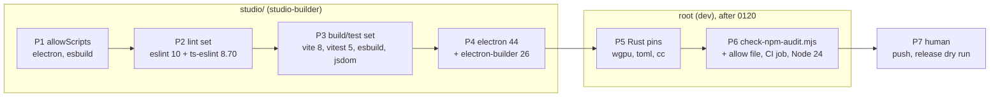

# 0220 — The dependencies catch up, and npm gets its gate

> **Status:** in-progress
> **Created:** 2026-09-22
> **Owner skill(s):** studio-builder, dev, human
> **Related ADRs:** [0244](../adrs/0244-the-npm-graphs-are-gated-like-the-cargo-graph-and-an-install-script-runs-by-name.md) (proposed),
> [0178](../adrs/0178-the-studio-shell-conventions.md),
> [0033](../adrs/0033-testing-strategy-coverage-ratchet-and-pre-push-gate.md),
> [0038](../adrs/0038-tag-driven-release-unsigned-universal-mac-app.md),
> [0156](../adrs/0156-the-per-phase-gate-is-scoped-and-the-suite-is-owed-once-per-plan.md)
> **Runs after:** [0120](done/0120-the-standalone-ships-on-ubuntu.md) for Phases 5-6 only. Both edit
> `core/Cargo.toml`'s `wgpu` lines and `.github/workflows/ci.yml`, which 0120 has open on `main`
> today. Phases 1-4 touch only `studio/` and can run now.

## TL;DR

The studio ships Electron 32 inside its release zip, twelve majors behind, and `npm audit` finds 2
critical and 14 high advisories in its graph. The cause is that nothing watches the npm graphs, while
`cargo deny` has watched the Rust one from the start. This plan brings the studio's toolchain and
runtime current: Electron 44, electron-builder 26, vite 8, vitest 5, eslint 10 with a matching
typescript-eslint, and the rest of the build and test tooling. It lets npm 11 install Electron's
binary by naming it. It takes the three Rust pins that trail by a patch or a minor. And it adds the
gate that stops this from accumulating again (ADR-0244), with CI moved to Node 24 LTS. React 18,
zod 3 and TypeScript 5 stay where they are.

## Context & problem

Measured on the Arch box on 2026-09-22:

| Graph | Gate today | State |
|---|---|---|
| `Cargo.lock` | `cargo deny check`, CI `deny` job | **advisories ok**. One reasoned ignore (RUSTSEC-2026-0192, ttf-parser unmaintained). Pins current except `wgpu` =30.0.0 (30.0.1 out), `toml` =1.1.3 (1.1.6), `cc` =1.3.0 (1.4.7, spout build-dep only) |
| `studio/` | none | 20 advisories: 2 critical, 14 high, 2 moderate, 2 low. 33 of the direct dependencies are outdated |
| `site/` | none | `npm audit` clean. Three patch releases behind (astro 7.3.3, starlight 0.42.2, markdown-remark 7.3.1) |

The studio advisories, after `4581c6b5` patch-bumped vitest to 2.1.9 and vite to 5.4.21:

| Package | Pinned | Clears at | Severity | Where it runs |
|---|---|---|---|---|
| `vitest` (+ `@vitest/mocker`, `vite-node`) | 2.1.9 | 3.2.6 for the critical, 4.1.11 for the rest; latest 5.0.1 | critical (GHSA-5xrq-8626-4rwp, needs the UI server, which the studio does not run) | tests |
| `vite` | 5.4.21 | above 6.4.2; latest 8.3.0 | high (`fs.deny` bypass on Windows paths) | dev server |
| `tar` via `electron-builder` → `app-builder-lib` → `@electron/rebuild` / `node-gyp` / `cacache` | 25.1.8 | electron-builder 26.15.3 | critical + 11 high | packaging |
| `electron` (+ `extract-zip`) | 32.1.2 | 44.4.3 | high (ASAR integrity bypass, AppleScript injection) | **shipped in the studio zip** |
| `esbuild` | 0.24.0 | 0.28.2 | moderate (dev server) | main/preload bundling |
| `@vitejs/plugin-react` | 4.3.2 | 4.7.0; latest 6.1.1 | moderate | build |
| `eslint` | 9.11.1 | 9.39.5; latest 10.11.0 | low | lint |

Two facts constrain the order of the work:

- **eslint cannot move alone.** 9.39.5 crashes the pinned `@typescript-eslint` 8.8.0 on
  `no-unused-expressions` (*"Cannot read properties of undefined (reading 'allowShortCircuit')"*),
  which is why `4581c6b5` left it at 9.11.1. The lint stack moves as one set.
- **npm 11 blocks dependency install scripts** unless `package.json`'s `allowScripts` names the
  package. On the box, `npm ci` succeeded and left no Electron binary, so `window.csp.test.ts` and
  `presetHandlers.test.ts` fail with *"Electron failed to install correctly"*. CI does not see this
  because Node 22 ships npm 10. Node 24 ships npm 11, so the allowlist has to land before CI moves.

## Decision

One plan, in three runs:

1. `studio-builder` fixes the install-script allowlist, then brings the studio up to date in three
   phases: lint tooling, build and test tooling, and Electron with its packager. Each is a separate
   commit so that a red gate points at one set.
2. `dev` takes the Rust patch bumps and then builds the ADR-0244 gate and the Node 24 move.
3. `human` pushes and dry-runs the release.

From the interview: the scope is **security plus toolchain**. React 19, zod 4 and TypeScript 7 are
rejected for this plan, because each one changes the studio's own code and its protocol schemas
rather than its build, and each deserves its own review. **Everything to latest** was rejected for
that reason. **Security minimum only** was rejected because it leaves esbuild and jsdom to fail the
new gate's `critical` line on the next advisory. A **scheduled bump bot** was rejected in favour of
the gate (ADR-0244 Alternative A). **Node 22** is kept out of CI's future because 24 is the active
LTS and it closes most of the gap to the box's Node 26 without chasing a release that is not LTS.

## Architecture diagram

## Implementation phases

### Phase 1 — npm 11 installs Electron by name
- **Owner skill:** `studio-builder`
- **What:** `studio/package.json` gains an `allowScripts` field naming exactly the packages whose
  install scripts the studio needs, and nothing else changes.
- **Files touched:** `studio/package.json`, `studio/package-lock.json` only if npm rewrites it,
  `studio/README.md` (one line saying what the field is and that a new entry is a reviewed edit,
  per ADR-0244).
- **Done when:**
  - After `rm -rf studio/node_modules && npm --prefix studio ci` on the Arch box (npm 11.19.1),
    `npm --prefix studio install-scripts ls` reports no unreviewed package, and
    `node_modules/electron/dist/electron --version` prints the pinned version.
  - `window.csp.test.ts` and `presetHandlers.test.ts` pass. The two tests that need a built Linux
    player (`windowless.test.ts`, `templates.test.ts`) are recorded with their state and are not
    this phase's bar. They depend on 0120.
  - The field lists named packages, **pinned** as `pkg@version` — npm's default, per
    [ADR-0244](../adrs/0244-the-npm-graphs-are-gated-like-the-cargo-graph-and-an-install-script-runs-by-name.md).
    `approve --all` and `--no-allow-scripts-pin` are both unused, and the log records the list.
    Measured on the box 2026-09-24, that list is **three** entries, not two: `electron@32.1.2`,
    `esbuild@0.24.0` and `esbuild@0.21.5`, because two `esbuild` versions are in the graph. Confirm
    against `install-scripts ls` rather than against this line.

### Phase 2 — The lint set moves together
- **Owner skill:** `studio-builder`
- **What:** `eslint` and `@eslint/js` to 10.x, `@typescript-eslint/eslint-plugin` and `parser` to
  8.70.1, `eslint-plugin-react-hooks` to 7.x, `eslint-config-prettier` to 10.x,
  `eslint-plugin-react` 7.37.5, `prettier` 3.9.8. All exact pins.
- **Files touched:** `studio/package.json`, `studio/package-lock.json`, `studio/eslint.config.mjs`,
  and any studio source a new rule flags.
- **Done when:**
  - `npm run typecheck`, `npm run lint` and `npm test` are green, with the same passing set as
    Phase 1.
  - Every finding a new rule raises is either fixed in the source or switched off in the config
    with a one-line comment giving the reason, and the log lists every rule switched off. If
    `eslint-plugin-react` 7.37.5 does not load under eslint 10, the set stays on eslint 9.39.5
    instead. That is reported in the log, not worked around.
  - `npx prettier --check` over the studio reports no file changed by the version move. If the new
    prettier reformats files, the reformat is its own commit inside this phase, with no other change
    in it.

### Phase 3 — The build and test set moves together
- **Owner skill:** `studio-builder`
- **What:** `vite` 8.3.0, `@vitejs/plugin-react` 6.x, `vitest` 5.0.1, `jsdom` 30.x, `esbuild`
  0.28.2, `@testing-library/react` 16.3.3, `@testing-library/jest-dom` 7.x, `concurrently`,
  `cross-env` and `wait-on` to their latest majors, and `@lezer/highlight` plus the `@codemirror/*`
  set to their latest 6.x/1.x. React stays 18.3.1, zod 3.23.8, TypeScript 5.6.2, and `@types/react*`
  stay 18.x.
- **Files touched:** `studio/package.json`, `studio/package-lock.json`, `studio/vite.config.ts`,
  `studio/vitest.config.ts`, `studio/scripts/build-main.mjs` and `build-preload.mjs`,
  test setup files, and any test a new major breaks.
- **Done when:**
  - Typecheck, lint and tests are green with the same passing set as Phase 2.
  - `npm run build` produces `dist/main/index.cjs`, `dist/preload/index.cjs` and `dist/renderer/`
    as ADR-0178 names them, and `npm run dev` on the box reaches the studio window.
  - ADR-0178's double CSP is unchanged. `window.csp.test.ts` passing is the evidence, and the log
    says whether vite 8 changed the dev server's injected headers.
  - `npm audit` in `studio/` no longer lists `vite`, `vitest`, `@vitest/mocker`, `vite-node`,
    `esbuild` or `@vitejs/plugin-react`. The log carries the audit's summary line.
  - **Both `esbuild` `allowScripts` entries follow their versions.** They are pinned, so the bump
    strands them and `npm ci` then leaves no platform binary while still exiting 0. Re-approve by
    name after the bump and confirm with `npm --prefix studio install-scripts ls`, which must report
    no unreviewed package.

### Phase 4 — Electron 44 and electron-builder 26
- **Owner skill:** `studio-builder`
- **What:** `electron` 44.4.3 and `electron-builder` 26.15.3. `@types/node` moves to the major of the
  Node that Electron 44 embeds, read from `process.versions.node` in the running app, not assumed.
- **Files touched:** `studio/package.json`, `studio/package-lock.json`, `studio/electron-builder.yml`,
  `studio/electron/**` where an API changed, `studio/README.md`, and `packaging/studio/bundle-studio.sh`
  and `build-studio.ps1` only if an electron-builder 26 flag changed.
- **Done when:**
  - Typecheck, lint and tests are green with the same passing set as Phase 3.
  - Every ADR-0178 security default is still set on every `BrowserWindow` in the source:
    `contextIsolation: true`, `nodeIntegration: false`, `sandbox: true`, and `show: false` until
    `ready-to-show`. So are the navigation and window-open intercepts. The log names each Electron
    breaking change between 32 and 44 that touched the studio, or says none did.
  - `npm run dev` on the box, with a Linux player built, spawns the player, paints frames and exits
    with no orphan (`pgrep ritmolux` empty). The log names the player binary path. If 0120's Linux
    player is not on `main` yet, this bullet waits for Phase 7 rather than being skipped.
  - `npm audit --omit=dev` in `studio/` reports no `high` or `critical`, and `npm audit` over the
    full graph reports no `critical`. Anything left is listed in the log with its GHSA id, as input
    to Phase 6's allow file.
  - **`electron`'s `allowScripts` entry follows it to 44.4.3.** It is pinned, so the bump strands
    `electron@32.1.2` and a fresh `npm ci` leaves no Electron binary — the exact failure this plan's
    Phase 1 removed. Re-approve by name, and `node_modules/electron/dist/electron --version` prints
    44.4.3.
  - The studio's `EXPECTED_PLAYER_VERSION` and `version` are untouched. This is not a release.

### Phase 5 — The Rust pins that trail
- **Owner skill:** `dev`
- **Runs after:** 0120 has landed on `main`.
- **What:** `wgpu` =30.0.1 on every target line of `core/Cargo.toml` (including 0120's Linux arm),
  `toml` =1.1.6 in `core/` and `standalone/`, and `cc` =1.4.7. Then `cargo update --workspace` for the
  lockfile's semver-compatible transitive moves, and a re-check of `deny.toml`'s ttf-parser ignore.
- **Files touched:** `core/Cargo.toml`, `standalone/Cargo.toml`, `Cargo.lock`, `deny.toml` (the
  ignore's comment only, and only if the re-check changes its answer).
- **Done when:**
  - `cargo deny check` is green.
  - The **full** `cargo nextest run --workspace` is green (ADR-0156's upward override: a wgpu patch
    can move a golden). The log carries the `Summary` line. A golden that moves is a finding and is
    reported, not re-blessed.
  - The log says whether `cosmic-text` still pins `ttf-parser` 0.25, per the REVISIT note on
    RUSTSEC-2026-0192.
  - `cc` is a build dependency of the `spout` feature alone, so the local gate cannot compile it off
    Windows. The log says the `spout` CI job is owed at Phase 7.

### Phase 6 — The npm gate, and CI on Node 24
- **Owner skill:** `dev`
- **Runs after:** 0120 has landed on `main`.
- **What:** ADR-0244 built. The gate is `scripts/check-npm-audit.mjs`, zero-dependency Node in the
  shape of the other gates. It runs `npm audit --json` in `studio/` (`--omit=dev` for the shipped
  line, full for the other) and in `site/`, fails the shipped graph at `high` and the full graphs at
  `critical`, reads exceptions from `npm-audit.allow.json`, and has a `--self-test` over fixtures
  in `scripts/fixtures/`. It gets its own CI job. Every `node-version: '22'` in `.github/workflows/`
  moves to `'24'`.
- **Files touched:** `scripts/check-npm-audit.mjs`, `scripts/fixtures/npm-audit/*`,
  `npm-audit.allow.json`, `.github/workflows/ci.yml`, `.github/workflows/release.yml`,
  `.github/workflows/pages.yml`, `site/package.json` (an `allowScripts` field if `site/`'s
  `npm ci` on npm 11 skips a script its build needs, checked on the box), `docs/developing.md`
  (the gate, the Node version, `allowScripts`), and `CLAUDE.md`'s `scripts/` block. The gate is
  CI-only like the two site gates, so it is named there beside them.
- **Done when:**
  - `node scripts/check-npm-audit.mjs --self-test` passes. It proves the gate **fails** on a fixture
    with a `high` in the shipped graph, **fails** on a `critical` in a dev-only package, **passes**
    on a `moderate`, **passes** when the offending id is in the allow file with a reason, **fails** on
    an allow entry without a reason, **reports** an allow entry whose id no longer appears, and
    **fails** when the audit request itself fails, never passing on it.
  - `node scripts/check-npm-audit.mjs` against the live registry exits 0 on the tree after Phase 4.
    Every allow entry it needed is listed in the log with its GHSA id.
  - `scripts/gates.manifest.mjs` and `.githooks/pre-push` are unchanged, and
    `node scripts/check-gate-carriers.mjs` stays green. The gate is not on the roster by design
    (ADR-0244).
  - No workflow names Node 22.
  - `check-doc-links`, `check-reader-prose`, `toc --check` and `check-comment-hygiene` stay green.

### Phase 7 — CI on the pushed tree, and a release dry run
- **Owner skill:** `human`
- **What:** push, then read CI on the new tree and the studio artifacts a release would ship.
- **Files touched:** this plan's log.
- **Done when:**
  - Every CI job is green on the pushed `main`: the new npm audit job, the `studio` job on Node 24,
    `deny` and `spout`.
  - `release.yml` run by `workflow_dispatch` (its dry-run path) produces both studio zips, built by
    electron-builder 26. The log records each zip's size next to its previous NFR §4 row. The
    Windows zip is unzipped and launched on the Windows boot: the studio opens, spawns its bundled
    player from `resources/player/` and paints frames.
  - If Phase 4's `npm run dev` bullet was waiting for 0120, it is done here.

## Risks & open questions

- **Twelve Electron majors in one step.** Chromium, the Node it embeds, and the defaults of
  `webPreferences` and `session` moved over that span. The studio's surface is small (one window, one
  preload, a `MessagePort`, a child process), which is why one phase is proposed and not a stepped
  climb. If Phase 4 finds a break that needs a design answer, such as the frame `MessagePort`'s
  transfer semantics that ADR-0178's Outcome describes, it stops there and the answer goes to
  `architect`.
- **electron-builder 26 on the two packaging recipes is only witnessed in CI.** The box cannot build
  a macOS or Windows zip. Phase 7 is the first time the recipes run, and a red release dry run
  there is a Phase 4 fix, reported.
- **vitest 2 → 5 and jsdom 25 → 30 can change test behaviour without changing a test.** Fake timers,
  module mocking and jsdom's event dispatch are the usual places. Phase 3's "same passing set" rule
  exists so that a test which silently stops running reads as a finding.
- **The gate can turn `main` red without a commit** (ADR-0244, Negative). The first time it does is
  the first test of the allow file's reason rule.
- **`site/` on npm 11 is unobserved.** Playwright downloads its browsers through an explicit
  `npx playwright install` in `pages.yml`, not a postinstall script, but that is read from the
  workflow, not measured. Phase 6 checks it on the box.
- **Plan 0120 is live on `main`.** Phases 1-4 touch only `studio/` and cannot collide with it.
  Phases 5-6 wait for it. Phase 4's player smoke needs its Linux player.

## What this plan does NOT do

- **It does not move React to 19, zod to 4 or TypeScript to 7.** Each changes the studio's code
  rather than its build, and zod is the protocol's validation layer (`studio/shared/protocol.ts`).
  They are followups, each its own plan.
- **It does not package the studio for Linux.** That remains Plan 0219's followup and needs its own
  ADR-0038 amendment.
- **It does not bump `site/`'s patch releases.** Its audit is clean, and the gate now watches it.
- **It does not add a bump bot** (ADR-0244 Alternative A), and it does not put the npm gate in the
  pre-push hook.
- **It does not release.** No version bump beyond whatever the close decides per ADR-0005.

## Implementation log

> Written by `dev` — one row per phase as that phase's commit lands, and the close block after the
> last one. **The phases above are the contract; everything here is what happened.**
> **Observations, never conclusions:** this says where to look, architect decides how it went.
> No per-criterion pass list, no self-assessment, no narrative — but a deviation from the plan or
> an unmet done-when is always disclosed. Stays shorter than `## Implementation phases` above.

**Lane:** `/home/igor/Work/rlx-plan-0220`, branch `plan-0220-the-dependencies-catch-up-and-npm-gets-its-gate` (conductor)

| phase | owner | state | commit |
|---|---|---|---|
| 1 — npm 11 installs Electron by name | studio-builder | parked: field landed, binary bullet unmet (Notes) | this row's commit |
| 2 — The lint set moves together | studio-builder | not started | |
| 3 — The build and test set moves together | studio-builder | not started | |
| 4 — Electron 44 and electron-builder 26 | studio-builder | not started | |
| 5 — The Rust pins that trail | dev | not started | |
| 6 — The npm gate, and CI on Node 24 | dev | not started | |
| 7 — CI on the pushed tree, and a release dry run | human | not started | |

### Notes

- **P1 list** (`npm install-scripts approve electron esbuild`, pinned, no `--all`): `electron@32.1.2`,
  `esbuild@0.24.0`, `esbuild@0.21.5`. After `rm -rf studio/node_modules` and `npm --prefix studio ci`
  (npm 11.19.1, Node 26.8.2), `install-scripts ls` prints *No packages with unreviewed install
  scripts.*
- **P1 unmet: the Electron binary still does not land.** The postinstall now runs, but Electron
  32's `install.js` extracts with `extract-zip` 2.0.1 (yauzl 2.10.0), which on Node 26 writes one
  entry (`dist/locales/hr.pak`, 394 KB) and lets the process exit 0 with the promise neither resolved
  nor rejected - reproduced with a scratch script calling `extract-zip` directly on the cached
  `electron-v32.1.2-linux-x64.zip`. No `path.txt`, no `dist/electron`. So the plan's Context line
  (npm 11 blocking scripts is why the binary is missing) is half the cause on this box; `electron`
  44.4.3 depends on `@electron-internal/extract-zip` instead (`npm view`), so Phase 4 may clear it.
- **P1 tests**: 30 files / 280 tests pass; `window.csp.test.ts` and `presetHandlers.test.ts` fail
  to collect (*Electron failed to install correctly*). `windowless.test.ts` and `templates.test.ts`
  pass by skipping (no built player in the lane's `target/`).
- `npx prettier --check studio/README.md` fails on `main`'s own settings-key table, untouched here.

### Close triggers

- **`presets/` touched:**
- **Plan header `Closes:`** none
- **What shipped:**
- **Operator docs touched:**
- **Backlog probes (`node scripts/check-backlog-claims.mjs`):**
- **Full suite:**
- **Outstanding `human` phases:**

## Followups (after this lands)

- **React 19**, with `@types/react*` 19 and `@testing-library/*` re-checked against it.
- **zod 4**, as a plan that reads every schema in `studio/shared/protocol.ts` against the spec.
- **TypeScript 7** (the native compiler) across the four tsconfigs.
- **Linux studio packaging**, carried over from Plan 0219.
