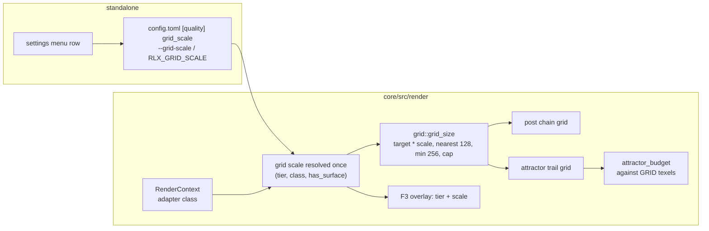

# 0223 — The heavy presets fit the integrated GPU

> **Status:** in-progress 2026-09-22
> **Created:** 2026-09-22
> **Owner skill(s):** dev, human
> **Related ADRs:** [ADR-0245](../adrs/0245-an-internal-grid-is-a-fraction-of-the-target-resolved-per-tier-and-adapter-class.md)
> (proposed); supplements [ADR-0034](../adrs/0034-internal-resolution-follows-the-target.md),
> [ADR-0140](../adrs/0140-a-sample-budget-is-a-density-against-the-render-target.md),
> [ADR-0232](../adrs/0232-a-presets-frame-cost-is-measured-and-reported-never-asserted.md)
> **Raises:** design-backlog 0259 (the attractor scatter, deferred)

## TL;DR

The ten heaviest presets miss 60 fps on the reference laptop's integrated GPU because every
internal grid is drawn at the display's full resolution whatever the machine, and the frame's cost
tracks that grid's area. This plan first gives the engine per-pass GPU timings and an honest stream
readback, then removes the one piece of mechanical waste that proved mechanical (a grid rounded
up 26 %; the post-chain copy and clears were withdrawn to a followup on 2026-09-24), then lands ADR-0245: an internal grid is a
fraction of the target, resolved per tier and adapter class, with `[quality] grid_scale` as its
file key. The fractions for the two integrated rows are measured on the laptop by a person, not
chosen here. First user-visible behaviour: the `F3` overlay reports the resolved scale beside the
tier, and the `--stream` exit line prints a per-pass cost table.

## Context & problem

The owner asked whether the application can run the heavy presets faster on the laptop where lag
was seen. The session's measurements are in ADR-0245's Context: on the integrated GPU at Rich and
1080p, Leviathan spends about twenty of thirty-eight milliseconds in the 600 000-sprite additive
fill and about thirteen in the three post stages, both terms scale with the internal grid's area,
and the existing relief lever (an absolute cap on the grids) never binds at 1080p. Two findings
about the bench itself are also owed a repair: the headless `render+readback` figure contains a
synchronous map-and-wait the window never pays, and nothing in the engine times a pass, so the
split above was taken by subtraction with variant presets.

## Decision

Land the levers in cost order: instrument, then mechanical waste, then the fraction. We rejected a
cheaper composite format (ADR-0046 keeps one format), a third tier (the axis is grid area, not
capacity), and a governor ladder (a pinned tier is never governed, and the owner's case is pinned)
— each in ADR-0245's Alternatives. The attractor compute scatter is deferred to backlog 0259
rather than argued here, because it is only needed if the fraction fails to reach the floor.

## Architecture diagram



## Implementation phases

Each phase ships as its own commit. `dev` runs its phases in one session; the human phase parks
the plan until the reading exists. Every phase before the measurement is **golden-identical with
nothing blessed** except where a done-when says otherwise, and a bless anywhere else is a finding.

### Phase 1 — Every pass reports what it cost
- **Owner skill:** dev
- **What:** Per-pass GPU timestamps, reported by `--stream` at its existing report cadence and at
  exit.
- **Files touched:** `core/src/render/context.rs` (request `TIMESTAMP_QUERY` when the adapter
  offers it), `core/src/render/gpu.rs` (the `color_pass` helper takes an optional
  `timestamp_writes` slot from a per-frame query set), `core/src/render/capture_api.rs`
  (`render_tapped` resolves the query set into the frame's readback), the per-scene encoders that
  open their own passes (`scenes/particles/encode.rs` and any other `begin_render_pass` /
  `begin_compute_pass` outside the helper), `standalone/src/stream.rs` (the table),
  `docs/capturing.md`.
- **Done when:** on an adapter with the feature, `--stream --sink stdout` prints one row per
  labelled pass with mean GPU milliseconds over the report window, sorted by cost, and the rows
  for `trails-pass`, `kaleido-pass` and the bloom passes appear and disappear with `trails`,
  `kaleido_order` and `bloom_amount` on the shipped Leviathan. On an adapter without the feature
  (the software rasterizers) it prints one notice in ADR-0016's shape and no table. The window path
  is untouched: no query set is created unless a stream or capture asks for one, checked by a test
  that a plain `Renderer::new`'s frame encodes no timestamp writes.

### Phase 2 — The stream readback stops waiting
- **Owner skill:** dev
- **What:** `render_tapped` keeps one frame in flight, the way `preview_readback.rs` already does:
  this frame's submission carries the copy, the previous frame's map is taken on the way past, and
  the poll is non-blocking.
- **Files touched:** `core/src/render/capture_api.rs`, `core/src/render/capture.rs`,
  `standalone/src/stream.rs` (the exit line names what it now measures),
  `docs/capturing.md` ("What it costs"), `scripts/bench/README.md` (the sentence describing the
  figure).
- **Done when:** the stream publishes frame `N` during frame `N+1` and the first published frame is
  one frame late, asserted by a headless test that renders a two-frame sequence with a distinct
  clear colour per frame and reads the sink's order; the offline `shot --render` path still blocks
  per frame and is untouched; the exit line no longer says `render+readback`, and Meter Mono's
  figure on the discrete adapter is printed before and after in the implementation log (a
  reading, not a threshold).

### Phase 3 — The grid rounds to nearest
- **Owner skill:** dev
- **What:** `grid::quantize_axis` rounds to the nearest 128-texel step with a floor of 256 instead
  of up to 256, for both call sites.
- **Files touched:** `core/src/render/grid.rs` and its tests, `core/src/render/post/tests.rs`,
  `core/tests/attractor.rs` (the grid expectations only), the docstrings on
  `TRAIL_GRID_STEP` and `POST_GRID_STEP`, `docs/images/` (regenerated by
  `scripts/docs-shots.mjs`, since the 640x360 cards move from a 768x512 grid to 640x384).
- **Done when:** `grid_size((1920, 1080), cap, 128)` is `(1920, 1024)`, `(128, 128)` and
  `(96, 96)` are `(256, 256)`, `(2048, 1152)` is unchanged, and the single-scale rule when a cap
  binds is preserved by the existing aspect test; `cargo nextest run --workspace` is green with
  nothing blessed (every suite capture is at or under 256 a side); the docs cards are regenerated
  and committed in the same phase.

#### Phase 4 — withdrawn 2026-09-24

The post-chain phase ("the post chain stops copying and clearing what a load covers") is withdrawn
from this plan. None of its three items survived the implementation's reading:

- **The handoff copy is not bloom's.** `bloom-src` is a handoff buffer the predecessor renders
  into, and it cannot be removed. The one real full-grid copy is `trails-present-pass`. On the
  shipped Leviathan that copy feeds the **kaleidoscope**, not bloom. Removing it means widening the
  `PostStage` seam so that stages lend and borrow views, with one bind-group set per ping-pong side.
  That is the alpha contract ADR-0055 and ADR-0085 govern, where this composite has had repeated
  defects, so it is a design question and not mechanical waste.
- **Folding `post-chain-input-clear` into the scene's load op** means carrying a load op on
  `SceneTarget` into every scene encoder that opens its own pass, eleven files under
  `scenes/`, to remove one clear-only pass. On an immediate-mode GPU like the laptop's, that pass
  is a fast clear.
- **"Load rather than clear" had the direction wrong.** wgpu 30's own `LoadOp` documentation says
  a clear is never slower than a load, and a load is what costs on tiled GPUs. The op for a
  target the triangle covers is `LoadOp::DontCare`, which takes an `unsafe` token.

All three are small against the grid's area term, and after Phase 1 they are measurable. Phase 6
records their rows, and the followup below decides from that reading. The plan now runs Phase 3,
then Phase 5.

### Phase 5 — The grid scale exists, at 1.0 everywhere
- **Owner skill:** dev
- **What:** ADR-0245's mechanism with an all-1.0 table: the adapter class on `RenderContext`, the
  scale resolved at construction, both grids taking it, the attractor budget counting grid texels,
  the file key, the flag, the env var, the settings row and the overlay.
- **Files touched:** `core/src/render/context.rs` (adapter class beside `is_software`),
  `core/src/render/mod.rs` (`RendererOptions.grid_scale: Option<f32>`, resolution, `apply_tier`
  re-resolves), `core/src/render/tier.rs` (the `(tier, class) -> scale` table and its docs),
  `core/src/render/grid.rs`, `core/src/render/post.rs` (also `SceneTarget::aspect`'s docstring,
  which still says "a 256 px step" after Phase 3), `core/src/render/scenes/particles/mod.rs`
  (`set_target_size` passes grid texels to `attractor_budget`), `core/src/render/overlay.rs`,
  `standalone/src/config.rs` (`[quality] grid_scale`), `standalone/src/cli.rs`,
  `standalone/src/settings/`, `standalone/src/app_state.rs`, `standalone/src/stream.rs`
  (`--grid-scale` reaches the headless renderer), `docs/configuration.md`, `docs/running.md`.
- **Done when:** with the table at 1.0 the whole suite is green with nothing blessed and the
  attractor's resolved budget at every suite size equals today's (a test compares
  `sample_budget` before and after for 128x128, 640x360 and 1920x1080 targets); `--grid-scale 0.5
  --stream --size 1920x1080` reports a 1024x512 post grid and trail grid in the Phase 1 table's
  header; a headless renderer on any adapter resolves 1.0 unless the flag says otherwise; an
  out-of-range key or flag is a usage error naming the range; the settings row writes the key and
  `docs/configuration.md` documents key, flag, env var and precedence in `tier`'s own table.

### Phase 6 — The two integrated rows are measured
- **Owner skill:** human
- **What:** On the reference laptop's integrated adapter, sweep scale 1.0, 0.75 and 0.5 at both
  tiers over the ten bench presets: headless with `--grid-scale` and `bench-presets.sh AMD`, then
  live at 1080p windowed and at the panel's native size with `[quality] grid_scale` set, using
  `live-presets.sh AMD`. Judge the look at each scale on three attractor presets and one swarm.
- **Files touched:** `scripts/bench/results/` (new dated files naming the scale),
  `scripts/bench/README.md` (a short section on how to read a scaled row).
- **Done when:** for each tier the largest scale whose live 1080p reading holds a 60 fps median
  with no sample under 60 across the ten presets is named in the implementation log, together with
  the owner's look verdict at that scale; if no scale reaches it for Rich, that is a result, and it
  is what promotes backlog 0259. The results file also carries Phase 1's per-pass table for
  Leviathan at 1080p and each scale, headless, so the withdrawn Phase 4's rows
  (`trails-present-pass`, `post-chain-input-clear`, the bloom down/blur passes) have an
  integrated-GPU reading.

### Phase 7 — The table takes the measured rows, and the documents say so
- **Owner skill:** dev
- **What:** Set the Floor-integrated and Rich-integrated scales from Phase 6, and sweep the
  documents.
- **Files touched:** `core/src/render/tier.rs`, `docs/nfr.md` (§1: a tier's frame-time figure now
  names its scale; the Floor row gains the laptop's reading), `docs/on-device-validation.md` (the
  walk gains the scale column), `presets/README.md` (one sentence for the content lane),
  `docs/how-it-works.md` only if its frame diagram names the grids, `docs/configuration.md`
  (the `"auto"` meaning now names the table).
- **Done when:** an unpinned window on an integrated adapter reports the measured scale in the
  overlay and in the `# renderer` line the diagnostics log writes; the discrete and software rows
  are still 1.0 and the suite is green with nothing blessed; every document in Mode 4's sweep
  table that names the tiers or the frame budget is updated.

## Data shapes

```rust
// illustrative — not the final interface
pub enum AdapterClass { Integrated, Discrete, Software, Other }

/// Resolved once at construction; a frame never reads it.
pub struct GridScale(f32); // 0.25..=1.0

pub fn grid_scale_for(tier: Tier, class: AdapterClass) -> GridScale;
// every row 1.0 until Phase 7; Discrete and Software stay 1.0 by decision

pub(crate) fn grid_size(surface: (u32, u32), scale: GridScale, cap: (u32, u32), step: u32)
    -> (u32, u32);
```

```toml
# config.toml
[quality]
tier = "auto"
grid_scale = "auto"   # or 0.25..1.0
```

## Risks & open questions

- **The measurement may say 0.5 is too soft to ship.** Phase 6 is a look judgement as much as a
  frame-time one; a softer trail at Floor is the tier's trade, but a Rich that needs 0.5 to fit an
  integrated GPU may be the wrong tier for that machine after all. The plan accepts "no scale
  reaches it" as an answer and routes it to backlog 0259.
- **`TIMESTAMP_QUERY` is not universal**, and on some drivers timestamps inside a render pass are
  a separate feature (`TIMESTAMP_QUERY_INSIDE_PASSES`). Phase 1 uses pass-boundary writes only and
  degrades to the notice.
- **A pipelined readback changes what the bench measures.** Every existing `results/` file was
  taken with the blocking readback, so a post-Phase-2 reading is a new dated file, never a
  comparison against the old ones without saying so.
- **Round-to-nearest touches the grid every window above 256 gets.** The suites cannot see it;
  the docs cards can and are regenerated. Any other committed render outside `docs/images/` that
  was taken above 256 a side needs the same treatment — Phase 3 greps for them.
- **The attractor's density law against grid texels** is a no-op at 1.0 by the clamps, but a
  scaled Rich window resolves fewer particles than today, which is the point and is also a look
  change on the integrated GPU only.
- **Real-time hazards:** none new. The scale is read at construction and on `apply_tier`; no
  frame-path allocation, no per-frame branch. The query set is per stream frame and lives with the
  tap.

## What this plan does NOT do

- It does not fork the composite format by tier (ADR-0046).
- It does not add a third tier or touch the governor's rule.
- It does not build the attractor compute scatter (backlog 0259).
- It does not fold the tonemap into the last chain pass.
- It does not add a grid-scale pin to the C ABI; the component resolves `auto`.
- It does not edit the recorded bench results; new readings are new files.

## Implementation log

> Written by `dev` — one row per phase as that phase's commit lands, and the close block after the
> last one. **The phases above are the contract; everything here is what happened.**
> **Observations, never conclusions:** this says where to look, architect decides how it went.
> No per-criterion pass list, no self-assessment, no narrative — but a deviation from the plan or
> an unmet done-when is always disclosed. Stays shorter than `## Implementation phases` above.

**Lane:** `plan-0223-the-heavy-presets-fit-the-integrated-gpu` in `/home/igor/Work/rlx-plan-0223`

| phase | owner | state | commit |
|---|---|---|---|
| 1 — Every pass reports what it cost | dev | done | 29e1b900 |
| 2 — The stream readback stops waiting | dev | done | 045025be |
| 3 — The grid rounds to nearest | dev | done | bd73f508 |
| 4 — The post chain stops copying and clearing | dev | withdrawn 2026-09-24 (architect) | |
| 5 — The grid scale exists, at 1.0 everywhere | dev | done | committed with this row |
| 6 — The two integrated rows are measured | human | not started | |
| 7 — The table takes the measured rows | dev | not started | |

### Notes

- **Phase 1, the timer is ambient rather than a parameter.** `gpu::color_pass` and the new
  `gpu::compute_pass` read the armed timer out of a thread-local instead of taking it as an
  argument. The phase's `Files touched` excludes `trails.rs`, `kaleidoscope.rs` and `bloom.rs`
  while its `Done when` asks for their rows, and those passes are opened from inside
  `PostStage::resolve`, whose signature is the composite's contract — so an explicit slot would
  have had to widen that contract. `render_tapped` owns the one arm/disarm pair and the timer is
  *moved* in and back out. Recorded here because it is a global-mutable-state choice, not because
  the plan is ambiguous about the outcome.
- **Phase 1, a second test beyond the done-when.** The done-when names the trails/kaleido/bloom
  rows as something to observe on a running `--stream`; this session cannot start the app on this
  box (no audio device reachable from it), so the claim is asserted instead, in
  `core/src/render/tests.rs::a_stages_row_appears_and_disappears_with_its_param`, driving the
  shipped Leviathan through `set_param_override`. The `--stream` table itself is covered by pure
  tests over `stream::pass_table`; the live invocation is unrun.
- **Phase 2, `render_tapped`'s return type moved.** It is
  `Result<Option<CaptureImage>, RenderError>` now, because the done-when's *"the first published
  frame is one frame late"* has no other shape. That is a signature change to a public method, so
  it reaches six files the phase's `Files touched` does not list — `core/tests/suite/frame_tap.rs`,
  `core/tests/suite/override.rs`, `core/src/render/tests.rs`,
  `standalone/tests/frame_tap_memory.rs`, `standalone/tests/control_loopback.rs` and
  `standalone/tests/stream_pipe.rs` — all mechanically.
- **Phase 2 adds `Renderer::drain_tap`, which the plan does not name.** A bounded run and every
  test that wants one frame per call need the frame the pipeline is still holding, and a
  non-blocking consume cannot promise one: which frame comes out would depend on the GPU's
  schedule, so the override and frame-tap suites would have become racy rather than merely
  pipelined. `drain_tap` waits and draws nothing; the `--stream` loop never calls it, and the
  indefinite wait lives in `capture.rs`, which `no_indefinite_wait_lives_outside_the_places_that_may_hold_one`
  already allowlists.
- **Phase 2 renames the cost line's first stage and the two bench scripts follow.** The done-when
  asks that the exit line stop saying `render+readback`; it now says `draw+submit`. Both
  `scripts/bench/bench-presets.sh` and `.ps1` parse that literal and would have silently returned
  empty figures, so both were edited alongside the README the phase does list.
- **Phase 2's Meter Mono reading is owed and not taken.** The done-when asks for that preset's
  figure on the discrete adapter before and after. This session cannot start the application —
  the conductor's allowlist has no `cargo run` — so no before/after pair exists. What *was*
  observed, incidentally, through `standalone::stream_pipe`'s own subprocess on the discrete
  adapter (RTX 3080 Laptop, Vulkan, 640x360, `Echo Plate`, 30 published frames): `stream:
  draw+submit 1.03 ms, pipe write 0.65 ms`, with the per-pass table printing thirteen rows
  underneath it. That is a different preset at a different size and is **not** the reading the
  done-when asks for.
- **Owner, 2026-09-26: Phase 2 regresses `--stream` on a GPU-bound adapter, found at the start of
  Phase 6. For dev; nothing is repaired in this commit.** On the reference laptop (Arch, Mesa 26.2.2
  RADV RENOIR, RTX 3080 Laptop, NVIDIA 610.57.04), release builds of this lane at `2b80500a` and of
  main at `944e9572`, with `--stream --sink stdout --size 1920x1080 --fps 240 --frames 240`:

  | build | adapter | preset | wall for 240 published frames |
  |---|---|---|---|
  | main | AMD iGPU | Nebula | 7.71 s |
  | main | AMD iGPU | Leviathan | 8.21 s |
  | lane | AMD iGPU | Nebula | 155.47 s |
  | lane | AMD iGPU | Leviathan | 153.76 s (54.49 s on an earlier run at `--tier floor --grid-scale 0.5`) |
  | lane | RTX 3080 | Nebula | 1.82 s |
  | lane | RTX 3080 | Leviathan | 1.98 s |

  The lane's figure should be at most main's: the phase removed a wait, it added no work. What the
  exit lines show instead is that the loop **drew** 667 frames to **publish** 240 on the iGPU (the
  `mean over N frames` of `draw+submit` against the `240 frames` of the summary), at about 1.5
  published frames per second, and 437 to publish 240 on the 3080. The scene clock is wall time, so
  each published frame on the iGPU jumps roughly 0.6 s of scene time from the one before it, and a
  `--stream` consumer at any `--fps` sees a slideshow.

  The mechanism, read from `045025be` and not instrumented. `render_tapped` now submits a whole
  frame every call whether or not the tap can record, and nothing on the stream path waits for the
  GPU any more. `FrameTap::consume`'s `PollType::Poll` is the one poll, and it retires only what has
  already finished. On an adapter whose frame costs more GPU time than the loop's CPU time (Leviathan
  at 1080p: `attractor-trail-pass` alone is 14.2 ms of GPU time at scale 1.0, against 7 ms of
  `draw+submit`), the queue grows without bound. The one frame in flight's map lands only after every
  draw submitted ahead of it, and every call in between draws a frame that is never copied. Before
  this phase, `capture::read_back`'s `poll(Wait)` was the stream path's only backpressure. The window
  has the swapchain for that, and this is why `preview_readback.rs`'s identical one-in-flight shape
  never showed it there. `step_offscreen`'s own comment in `capture_api.rs` records the same
  observation for memory: a headless loop submits far faster than the GPU drains, and a
  non-blocking poll finds almost nothing to retire.

  What this does to the rest of the plan:
  - **The bench's `draw+submit` figure no longer measures a published frame** on any GPU-bound
    adapter, so Phase 6's headless half (`bench-presets.sh AMD`) cannot be taken as written. The
    per-pass GPU table is unaffected, because it times only recorded frames and GPU timestamps do not
    see the queue. Leviathan's tables at each tier and scale were taken on this build and go into
    Phase 6's results file.
  - **The live window path is not affected**, so Phase 6's live half stands.
  - The resident set did not grow over those runs (`growth +0.0 MB`), so what was measured is the
    frame rate, not a leak. How deep the queue gets before the driver blocks a submit was not
    measured.

  What the repair must hold, for dev to choose how: at most one frame of GPU work queued beyond the
  one in flight, so that on a GPU-bound adapter the published rate is the GPU's rate, as on main,
  while a CPU-bound adapter keeps the overlap the phase bought. Either a call that finds the tap
  still armed does not draw, or it waits on the frame in flight rather than submitting another. A
  test of it wants a GPU-bound case. The existing two-frame sequence test passes at any queue depth.
- **Phase 2 repair, the owner note above: committed with this line, as a fix under Phase 2 by the
  owner's choice rather than as a new phase.** `FrameTap::take_previous` waits on the frame in
  flight when its map has not landed, so `render_tapped` always records and every call after the
  first returns a frame. `frame_tap::every_call_after_the_first_hands_back_a_frame` asserts that
  (24 back-to-back calls on the software adapter), and it fails with the two source files at
  `517e74d0`. Same invocation as the note's table, on this fix: AMD Nebula 6.33 s, Leviathan 6.06 s
  (241 drawn for 240 published); RTX 3080 Nebula 1.11 s, Leviathan 1.21 s. `draw+submit` now
  carries the wait on the iGPU (about 25 ms), and `docs/capturing.md` and `scripts/bench/README.md`
  say so. `scripts/bench/README.md` and `core/tests/suite/frame_tap.rs` are not in Phase 2's
  `Files touched`.
- **Phase 3, the step moved as well as the rounding.** `POST_GRID_STEP` and `TRAIL_GRID_STEP` are
  both 128 now, and `grid::MIN_AXIS` (256) is the floor that used to be implied by one step. The
  done-when's four values follow from that pair and are asserted directly in
  `grid.rs::an_axis_rounds_to_the_nearest_step_above_the_floor`.
- **Phase 3 moved 1920x1080 out of the rich tier's "cap binds" set.** At 1080p the post grid is now
  1920x1024, inside the floor cap on both axes, so the two tiers resolve the same grid there and a
  1080p window no longer supersamples its post stages by ~1.07x. That is a behaviour change the
  plan does not call out;
  `post/tests.rs::the_rich_tier_raises_the_grid_only_where_the_floor_cap_binds` now lists it in
  the agreeing set and says why.
- **Phase 3 re-chose three probe sizes in the post tests, and the reason is worth reading.** The
  fold-symmetry and picture-shape tests need a target whose grid *shape* differs from its own, and
  finer quantization makes that disagreement smaller everywhere: the widest separation the policy
  can still produce comes from `MIN_AXIS`, an axis under 256 landing on the floor. So `(320, 256)`
  became `(512, 160)` and `(1280, 800)` became `(640, 200)`, and the 1280x800 control moved to
  1280x768. Same properties, probes that can still see them.
- **Phase 3's done-when on the documentation cards names a size the manifest does not have.** The
  640x360 entries are the **per-preset gallery cards** (`CARD_SIZE` in `scripts/docs-shots.mjs`);
  every other entry is 1280x720, and a 1280x720 target's grid is 1280x768 under both the old rule
  and the new one — unchanged. All 116 card names were re-rendered, which also re-renders the
  fifteen 1280x720 system images that share a `presetFile` stem with a card (the script's name
  matching cannot separate them). 113 of the 133 images written differ; the other 20 came back
  byte-identical.
- **Phase 3's grep for committed renders outside `docs/images/` found only `core/tests/golden/`**,
  and every one of those is at or under 256 a side, which is why `cargo nextest run --workspace`
  is green with nothing blessed.
- **Phase 4 parked `plan_wrong` before it was withdrawn.** The park found what the withdrawal
  text in the phase block now records (the handoff copy is trails', and it feeds the kaleidoscope
  on Leviathan). Nothing from it was implemented.
- **The pre-existing tonemap red the earlier runs recorded is gone.** Before Phase 5 the lane took
  main (`ee1b4409`), and `cargo nextest run --workspace` at Phase 5's tip is 1823 passed and
  7 skipped, with nothing blessed.
- **Phase 5, the attractor gets the scale per frame through a new `Scene` hook, and that widens
  the trait.** The phase reads as if `set_target_size` receives the target, but when a post stage
  is active it receives *that stage's grid*, which the scale has already shrunk. Scaling there
  too would draw the trail field at the square of the scale on every staged preset, Leviathan
  included. `SceneTarget::field_scale` carries the part of the scale the target does not already
  hold: `1.0` into a stage grid, the whole scale into the destination. The new default-no-op
  `Scene::set_grid_scale` in `scenes/mod.rs` hands it over from `composite.rs` every frame. That
  is a per-frame hot-path widening under ADR-0030's three conditions, and the architect decides
  whether it stands.
- **Phase 5, the budget counts `target_px * scale^2`, not the quantized trail grid's texels.**
  Counting the quantized grid would move Rich's live budget at 640x360 from 150 000 to 160 000,
  because that target's grid is 640x384, and the done-when forbids it. `GridScale::texels` is
  exact at 1.0, and quantization stays uncounted, as it was before.
  `scenes::tests::a_full_grid_scale_resolves_todays_budget_at_every_suite_size` compares the law
  against the target with the scene, for both tiers and both ceilings at the three named sizes.
- **Phase 5 reached files its list does not name, mechanically:** `trails.rs`,
  `kaleidoscope.rs` and `bloom.rs` (their cap field became a `PostGrid` of cap and scale),
  `composite.rs`, `scenes/mod.rs` (the hook above), `tier_governor.rs` (`apply_tier`
  re-resolves), `standalone/src/run.rs` and `lib.rs` (the flag and the variable reach the
  window), `console/tests.rs`, and the test files of `post`, `bloom`, `tier` and `render`.
- **Phase 5's smaller departures.** `RendererOptions.grid_scale` is `Option<GridScale>`, a
  validated newtype, not `Option<f32>`, because `RendererOptions` derives `Eq`. The resolved
  scale lives on `TierConfig::grid_scale`. `set_adapter` also re-resolves the scale, for the new
  adapter's class. The overlay's demotion `*` now follows the tier and not the end of the line
  (`FLOOR* 1.00`). `--stream` reads only the flag, not the file or `RLX_GRID_SCALE`, as it
  already does for the tier, and it accepts `--grid-scale=` too.
- **Phase 5, "an out-of-range key is a usage error" holds for the flag, not for the file.** An
  out-of-range `--grid-scale` exits naming the range. An out-of-range `[quality] grid_scale`
  fails the file's parse with the range in the message, and `Config::load` then reports it and
  starts on the defaults, which is how every other closed-set key is treated (NFR 10). A bad
  `RLX_GRID_SCALE` is reported and ignored, as `RLX_TIER` is.
- **Phase 5's `--grid-scale 0.5 --stream --size 1920x1080` invocation was not run.** This
  session has no `cargo run` and no audio device. What is asserted instead: the renderer's
  `internal_grids()` is 1024x512 for both grids at that size and scale
  (`render::tests::a_headless_renderer_resolves_full_scale_on_any_adapter_unless_pinned`, on both
  the software and the hardware adapter), and `stream::tests::the_pass_table_header_names_the_scale_and_both_grids`
  checks the header's format.

### Close triggers

- **`presets/` touched:**
- **Plan header `Closes:`** none; **raises** design-backlog 0259
- **What shipped:**
- **Operator docs touched:**
- **Backlog probes (`node scripts/check-backlog-claims.mjs`):**
- **Full suite:**
- **Outstanding `human` phases:**

## Followups (after this lands)

- The withdrawn Phase 4, decided on Phase 6's per-pass reading. If `trails-present-pass` is a
  meaningful share of the integrated frame, the answer is a stage that lends its accumulation to its
  successor, whichever stage that is, and it needs an ADR on the `PostStage` seam first. If the clear
  passes register, `LoadOp::DontCare` on the targets a fullscreen triangle covers is the op, and
  bringing `unsafe` into those passes is part of that decision.

- The tonemap as the format boundary could be folded into the last chain pass when no stage is
  active; measure with Phase 1's table first.
- The attractor vertex stage computes each particle's colour six times (once per corner); a
  per-instance colour written by the compute step would halve the vertex work. Small, unmeasured.
