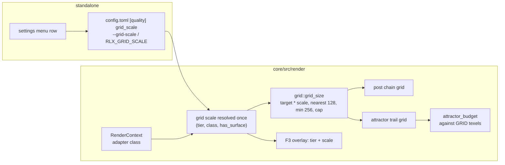

# 0223 — The heavy presets fit the integrated GPU

> **Status:** in-progress 2026-09-22
> **Created:** 2026-09-22
> **Owner skill(s):** dev, human
> **Related ADRs:** [ADR-0245](../adrs/0245-an-internal-grid-is-a-fraction-of-the-target-resolved-per-tier-and-adapter-class.md)
> (proposed); supplements [ADR-0034](../adrs/0034-internal-resolution-follows-the-target.md),
> [ADR-0140](../adrs/0140-a-sample-budget-is-a-density-against-the-render-target.md),
> [ADR-0232](../adrs/0232-a-presets-frame-cost-is-measured-and-reported-never-asserted.md)
> **Raises:** design-backlog 0259 (the attractor scatter, deferred)

## TL;DR

The ten heaviest presets miss 60 fps on the reference laptop's integrated GPU because every
internal grid is drawn at the display's full resolution whatever the machine, and the frame's cost
tracks that grid's area. This plan first gives the engine per-pass GPU timings and an honest stream
readback, then removes the mechanical waste the analysis found (a grid rounded up 26 %, a
full-grid handoff copy, clears that a load would do), then lands ADR-0245: an internal grid is a
fraction of the target, resolved per tier and adapter class, with `[quality] grid_scale` as its
file key. The fractions for the two integrated rows are measured on the laptop by a person, not
chosen here. First user-visible behaviour: the `F3` overlay reports the resolved scale beside the
tier, and the `--stream` exit line prints a per-pass cost table.

## Context & problem

The owner asked whether the application can run the heavy presets faster on the laptop where lag
was seen. The session's measurements are in ADR-0245's Context: on the integrated GPU at Rich and
1080p, Leviathan spends about twenty of thirty-eight milliseconds in the 600 000-sprite additive
fill and about thirteen in the three post stages, both terms scale with the internal grid's area,
and the existing relief lever (an absolute cap on the grids) never binds at 1080p. Two findings
about the bench itself are also owed a repair: the headless `render+readback` figure contains a
synchronous map-and-wait the window never pays, and nothing in the engine times a pass, so the
split above was taken by subtraction with variant presets.

## Decision

Land the levers in cost order: instrument, then mechanical waste, then the fraction. We rejected a
cheaper composite format (ADR-0046 keeps one format), a third tier (the axis is grid area, not
capacity), and a governor ladder (a pinned tier is never governed, and the owner's case is pinned)
— each in ADR-0245's Alternatives. The attractor compute scatter is deferred to backlog 0259
rather than argued here, because it is only needed if the fraction fails to reach the floor.

## Architecture diagram



## Implementation phases

Each phase ships as its own commit. `dev` runs its phases in one session; the human phase parks
the plan until the reading exists. Every phase before the measurement is **golden-identical with
nothing blessed** except where a done-when says otherwise, and a bless anywhere else is a finding.

### Phase 1 — Every pass reports what it cost
- **Owner skill:** dev
- **What:** Per-pass GPU timestamps, reported by `--stream` at its existing report cadence and at
  exit.
- **Files touched:** `core/src/render/context.rs` (request `TIMESTAMP_QUERY` when the adapter
  offers it), `core/src/render/gpu.rs` (the `color_pass` helper takes an optional
  `timestamp_writes` slot from a per-frame query set), `core/src/render/capture_api.rs`
  (`render_tapped` resolves the query set into the frame's readback), the per-scene encoders that
  open their own passes (`scenes/particles/encode.rs` and any other `begin_render_pass` /
  `begin_compute_pass` outside the helper), `standalone/src/stream.rs` (the table),
  `docs/capturing.md`.
- **Done when:** on an adapter with the feature, `--stream --sink stdout` prints one row per
  labelled pass with mean GPU milliseconds over the report window, sorted by cost, and the rows
  for `trails-pass`, `kaleido-pass` and the bloom passes appear and disappear with `trails`,
  `kaleido_order` and `bloom_amount` on the shipped Leviathan. On an adapter without the feature
  (the software rasterizers) it prints one notice in ADR-0016's shape and no table. The window path
  is untouched: no query set is created unless a stream or capture asks for one, checked by a test
  that a plain `Renderer::new`'s frame encodes no timestamp writes.

### Phase 2 — The stream readback stops waiting
- **Owner skill:** dev
- **What:** `render_tapped` keeps one frame in flight, the way `preview_readback.rs` already does:
  this frame's submission carries the copy, the previous frame's map is taken on the way past, and
  the poll is non-blocking.
- **Files touched:** `core/src/render/capture_api.rs`, `core/src/render/capture.rs`,
  `standalone/src/stream.rs` (the exit line names what it now measures),
  `docs/capturing.md` ("What it costs"), `scripts/bench/README.md` (the sentence describing the
  figure).
- **Done when:** the stream publishes frame `N` during frame `N+1` and the first published frame is
  one frame late, asserted by a headless test that renders a two-frame sequence with a distinct
  clear colour per frame and reads the sink's order; the offline `shot --render` path still blocks
  per frame and is untouched; the exit line no longer says `render+readback`, and Meter Mono's
  figure on the discrete adapter is printed before and after in the implementation log (a
  reading, not a threshold).

### Phase 3 — The grid rounds to nearest
- **Owner skill:** dev
- **What:** `grid::quantize_axis` rounds to the nearest 128-texel step with a floor of 256 instead
  of up to 256, for both call sites.
- **Files touched:** `core/src/render/grid.rs` and its tests, `core/src/render/post/tests.rs`,
  `core/tests/attractor.rs` (the grid expectations only), the docstrings on
  `TRAIL_GRID_STEP` and `POST_GRID_STEP`, `docs/images/` (regenerated by
  `scripts/docs-shots.mjs`, since the 640x360 cards move from a 768x512 grid to 640x384).
- **Done when:** `grid_size((1920, 1080), cap, 128)` is `(1920, 1024)`, `(128, 128)` and
  `(96, 96)` are `(256, 256)`, `(2048, 1152)` is unchanged, and the single-scale rule when a cap
  binds is preserved by the existing aspect test; `cargo nextest run --workspace` is green with
  nothing blessed (every suite capture is at or under 256 a side); the docs cards are regenerated
  and committed in the same phase.

### Phase 4 — The post chain stops copying and clearing what a load covers
- **Owner skill:** dev
- **What:** Bloom samples its predecessor's output view instead of owning a full-grid copy of it;
  the pre-scene `post-chain-input-clear` folds into the scene pass's load op; the bloom
  down/blur passes load rather than clear a target the fullscreen triangle covers.
- **Files touched:** `core/src/render/post.rs`, `core/src/render/bloom.rs`,
  `core/src/render/kaleidoscope.rs`, `core/src/render/trails.rs` (the `PostStage` input seam),
  `core/src/render/composite.rs`, the `TierConfig::post_cap` docstring (the memory arithmetic that
  charges the `bloom-src` offscreen).
- **Done when:** Phase 1's table on Leviathan no longer lists the handoff pass, and the chain's
  allocation count drops by one full-grid texture (asserted where the stage's resources are
  built); the whole suite is green with nothing blessed. The tonemap pass stays: it is the format
  boundary, and folding it is not this plan.

### Phase 5 — The grid scale exists, at 1.0 everywhere
- **Owner skill:** dev
- **What:** ADR-0245's mechanism with an all-1.0 table: the adapter class on `RenderContext`, the
  scale resolved at construction, both grids taking it, the attractor budget counting grid texels,
  the file key, the flag, the env var, the settings row and the overlay.
- **Files touched:** `core/src/render/context.rs` (adapter class beside `is_software`),
  `core/src/render/mod.rs` (`RendererOptions.grid_scale: Option<f32>`, resolution, `apply_tier`
  re-resolves), `core/src/render/tier.rs` (the `(tier, class) -> scale` table and its docs),
  `core/src/render/grid.rs`, `core/src/render/post.rs`, `core/src/render/scenes/particles/mod.rs`
  (`set_target_size` passes grid texels to `attractor_budget`), `core/src/render/overlay.rs`,
  `standalone/src/config.rs` (`[quality] grid_scale`), `standalone/src/cli.rs`,
  `standalone/src/settings/`, `standalone/src/app_state.rs`, `standalone/src/stream.rs`
  (`--grid-scale` reaches the headless renderer), `docs/configuration.md`, `docs/running.md`.
- **Done when:** with the table at 1.0 the whole suite is green with nothing blessed and the
  attractor's resolved budget at every suite size equals today's (a test compares
  `sample_budget` before and after for 128x128, 640x360 and 1920x1080 targets); `--grid-scale 0.5
  --stream --size 1920x1080` reports a 1024x512 post grid and trail grid in the Phase 1 table's
  header; a headless renderer on any adapter resolves 1.0 unless the flag says otherwise; an
  out-of-range key or flag is a usage error naming the range; the settings row writes the key and
  `docs/configuration.md` documents key, flag, env var and precedence in `tier`'s own table.

### Phase 6 — The two integrated rows are measured
- **Owner skill:** human
- **What:** On the reference laptop's integrated adapter, sweep scale 1.0, 0.75 and 0.5 at both
  tiers over the ten bench presets: headless with `--grid-scale` and `bench-presets.sh AMD`, then
  live at 1080p windowed and at the panel's native size with `[quality] grid_scale` set, using
  `live-presets.sh AMD`. Judge the look at each scale on three attractor presets and one swarm.
- **Files touched:** `scripts/bench/results/` (new dated files naming the scale),
  `scripts/bench/README.md` (a short section on how to read a scaled row).
- **Done when:** for each tier the largest scale whose live 1080p reading holds a 60 fps median
  with no sample under 60 across the ten presets is named in the implementation log, together with
  the owner's look verdict at that scale; if no scale reaches it for Rich, that is a result, and it
  is what promotes backlog 0259.

### Phase 7 — The table takes the measured rows, and the documents say so
- **Owner skill:** dev
- **What:** Set the Floor-integrated and Rich-integrated scales from Phase 6, and sweep the
  documents.
- **Files touched:** `core/src/render/tier.rs`, `docs/nfr.md` (§1: a tier's frame-time figure now
  names its scale; the Floor row gains the laptop's reading), `docs/on-device-validation.md` (the
  walk gains the scale column), `presets/README.md` (one sentence for the content lane),
  `docs/how-it-works.md` only if its frame diagram names the grids, `docs/configuration.md`
  (the `"auto"` meaning now names the table).
- **Done when:** an unpinned window on an integrated adapter reports the measured scale in the
  overlay and in the `# renderer` line the diagnostics log writes; the discrete and software rows
  are still 1.0 and the suite is green with nothing blessed; every document in Mode 4's sweep
  table that names the tiers or the frame budget is updated.

## Data shapes

```rust
// illustrative — not the final interface
pub enum AdapterClass { Integrated, Discrete, Software, Other }

/// Resolved once at construction; a frame never reads it.
pub struct GridScale(f32); // 0.25..=1.0

pub fn grid_scale_for(tier: Tier, class: AdapterClass) -> GridScale;
// every row 1.0 until Phase 7; Discrete and Software stay 1.0 by decision

pub(crate) fn grid_size(surface: (u32, u32), scale: GridScale, cap: (u32, u32), step: u32)
    -> (u32, u32);
```

```toml
# config.toml
[quality]
tier = "auto"
grid_scale = "auto"   # or 0.25..1.0
```

## Risks & open questions

- **The measurement may say 0.5 is too soft to ship.** Phase 6 is a look judgement as much as a
  frame-time one; a softer trail at Floor is the tier's trade, but a Rich that needs 0.5 to fit an
  integrated GPU may be the wrong tier for that machine after all. The plan accepts "no scale
  reaches it" as an answer and routes it to backlog 0259.
- **`TIMESTAMP_QUERY` is not universal**, and on some drivers timestamps inside a render pass are
  a separate feature (`TIMESTAMP_QUERY_INSIDE_PASSES`). Phase 1 uses pass-boundary writes only and
  degrades to the notice.
- **A pipelined readback changes what the bench measures.** Every existing `results/` file was
  taken with the blocking readback, so a post-Phase-2 reading is a new dated file, never a
  comparison against the old ones without saying so.
- **Round-to-nearest touches the grid every window above 256 gets.** The suites cannot see it;
  the docs cards can and are regenerated. Any other committed render outside `docs/images/` that
  was taken above 256 a side needs the same treatment — Phase 3 greps for them.
- **The attractor's density law against grid texels** is a no-op at 1.0 by the clamps, but a
  scaled Rich window resolves fewer particles than today, which is the point and is also a look
  change on the integrated GPU only.
- **Real-time hazards:** none new. The scale is read at construction and on `apply_tier`; no
  frame-path allocation, no per-frame branch. The query set is per stream frame and lives with the
  tap.

## What this plan does NOT do

- It does not fork the composite format by tier (ADR-0046).
- It does not add a third tier or touch the governor's rule.
- It does not build the attractor compute scatter (backlog 0259).
- It does not fold the tonemap into the last chain pass.
- It does not add a grid-scale pin to the C ABI; the component resolves `auto`.
- It does not edit the recorded bench results; new readings are new files.

## Implementation log

> Written by `dev` — one row per phase as that phase's commit lands, and the close block after the
> last one. **The phases above are the contract; everything here is what happened.**
> **Observations, never conclusions:** this says where to look, architect decides how it went.
> No per-criterion pass list, no self-assessment, no narrative — but a deviation from the plan or
> an unmet done-when is always disclosed. Stays shorter than `## Implementation phases` above.

**Lane:** `plan-0223-the-heavy-presets-fit-the-integrated-gpu` in `/home/igor/Work/rlx-plan-0223`

| phase | owner | state | commit |
|---|---|---|---|
| 1 — Every pass reports what it cost | dev | done | 29e1b900 |
| 2 — The stream readback stops waiting | dev | done | committed with this row |
| 3 — The grid rounds to nearest | dev | not started | |
| 4 — The post chain stops copying and clearing | dev | not started | |
| 5 — The grid scale exists, at 1.0 everywhere | dev | not started | |
| 6 — The two integrated rows are measured | human | not started | |
| 7 — The table takes the measured rows | dev | not started | |

### Notes

- **Phase 1, the timer is ambient rather than a parameter.** `gpu::color_pass` and the new
  `gpu::compute_pass` read the armed timer out of a thread-local instead of taking it as an
  argument. The phase's `Files touched` excludes `trails.rs`, `kaleidoscope.rs` and `bloom.rs`
  while its `Done when` asks for their rows, and those passes are opened from inside
  `PostStage::resolve`, whose signature is the composite's contract — so an explicit slot would
  have had to widen that contract. `render_tapped` owns the one arm/disarm pair and the timer is
  *moved* in and back out. Recorded here because it is a global-mutable-state choice, not because
  the plan is ambiguous about the outcome.
- **Phase 1, a second test beyond the done-when.** The done-when names the trails/kaleido/bloom
  rows as something to observe on a running `--stream`; this session cannot start the app on this
  box (no audio device reachable from it), so the claim is asserted instead, in
  `core/src/render/tests.rs::a_stages_row_appears_and_disappears_with_its_param`, driving the
  shipped Leviathan through `set_param_override`. The `--stream` table itself is covered by pure
  tests over `stream::pass_table`; the live invocation is unrun.
- **Phase 2, `render_tapped`'s return type moved.** It is
  `Result<Option<CaptureImage>, RenderError>` now, because the done-when's *"the first published
  frame is one frame late"* has no other shape. That is a signature change to a public method, so
  it reaches six files the phase's `Files touched` does not list — `core/tests/suite/frame_tap.rs`,
  `core/tests/suite/override.rs`, `core/src/render/tests.rs`,
  `standalone/tests/frame_tap_memory.rs`, `standalone/tests/control_loopback.rs` and
  `standalone/tests/stream_pipe.rs` — all mechanically.
- **Phase 2 adds `Renderer::drain_tap`, which the plan does not name.** A bounded run and every
  test that wants one frame per call need the frame the pipeline is still holding, and a
  non-blocking consume cannot promise one: which frame comes out would depend on the GPU's
  schedule, so the override and frame-tap suites would have become racy rather than merely
  pipelined. `drain_tap` waits and draws nothing; the `--stream` loop never calls it, and the
  indefinite wait lives in `capture.rs`, which `no_indefinite_wait_lives_outside_the_places_that_may_hold_one`
  already allowlists.
- **Phase 2 renames the cost line's first stage and the two bench scripts follow.** The done-when
  asks that the exit line stop saying `render+readback`; it now says `draw+submit`. Both
  `scripts/bench/bench-presets.sh` and `.ps1` parse that literal and would have silently returned
  empty figures, so both were edited alongside the README the phase does list.
- **Phase 2's Meter Mono reading is owed and not taken.** The done-when asks for that preset's
  figure on the discrete adapter before and after. This session cannot start the application —
  the conductor's allowlist has no `cargo run` — so no before/after pair exists. What *was*
  observed, incidentally, through `standalone::stream_pipe`'s own subprocess on the discrete
  adapter (RTX 3080 Laptop, Vulkan, 640x360, `Echo Plate`, 30 published frames): `stream:
  draw+submit 1.03 ms, pipe write 0.65 ms`, with the per-pass table printing thirteen rows
  underneath it. That is a different preset at a different size and is **not** the reading the
  done-when asks for.
- **The suite is red on one pre-existing test, on this lane's filesystem.**
  `rlx-core render::tonemap::tests::the_scan_reads_the_visibility_the_helpers_actually_set` fails
  at `core/src/render/tonemap/tests.rs:1431` with `left: ""`, `right: "FRAGMENT"` on the
  `pub(crate) fn sampler(` needle. It is the failure Plan 0214's `## Implementation log` records
  and Plan 0214 Phase 2 owns: `rs_files` concatenates `core/src` in unsorted `read_dir` order and
  the needle also matches the test's own literal. No phase of this plan adds or removes a file
  under `core/src`, so the walk order it depends on is untouched here. It makes Phase 3's and
  Phase 4's *"the whole suite is green"* unsatisfiable as stated for as long as it stands; every
  other test in `-P fast` passes.

### Close triggers

- **`presets/` touched:**
- **Plan header `Closes:`** none; **raises** design-backlog 0259
- **What shipped:**
- **Operator docs touched:**
- **Backlog probes (`node scripts/check-backlog-claims.mjs`):**
- **Full suite:**
- **Outstanding `human` phases:**

## Followups (after this lands)

- The tonemap as the format boundary could be folded into the last chain pass when no stage is
  active; measure with Phase 1's table first.
- The attractor vertex stage computes each particle's colour six times (once per corner); a
  per-instance colour written by the compute step would halve the vertex work. Small, unmeasured.
