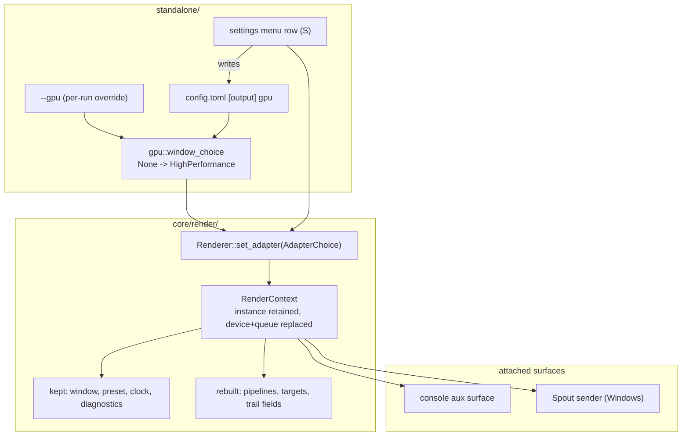

# 0224 — The adapter becomes a setting

> **Status:** in-progress
> **Created:** 2026-09-22
> **Approved:** 2026-09-22 (user)
> **Owner skill(s):** dev, human
> **Related ADRs:** [0246](../adrs/0246-the-adapter-is-a-setting-and-the-window-prefers-high-performance.md)
> (the decision), [0155](../adrs/0155-the-window-takes-the-adapter-and-the-preset-the-operator-names.md)
> (the flag, and the default this amends),
> [0146](../adrs/0146-one-name-selects-the-gpu-and-each-side-matches-its-own-roster.md) (one name,
> two rosters), [0054](../adrs/0054-runtime-tier-switching-rebuilds-on-the-live-context.md) (the
> rebuild precedent), [0240](../adrs/0240-a-setting-lives-in-a-file-and-the-menu-edits-that-file.md)
> (a setting has a file key)

## TL;DR

On a hybrid machine this application runs six times slower than the hardware allows, because an
unflagged window takes the power-saving adapter and the only cure is a flag typed at launch. This
plan gives the choice a `config.toml` key, flips the unflagged default to the high-performance
adapter, and adds `Renderer::set_adapter` so the menu can move the running show onto another GPU
without a restart. First user-visible behavior: a fresh checkout launched with no arguments on the
reference box comes up on the discrete GPU at 165 fps instead of the integrated one at 25.

## Context & problem

Measured on the Arch reference box on 2026-09-22 — one preset, one build, pinned `Rich` tier, the
same 2560x1440 surface — an unflagged window ran at **25 fps with a 79 ms `frame_ms_p99`**, and the
same preset under `--gpu NVIDIA` ran at **164.9 fps, 6.065 ms average, p99 6.3-6.5 ms, zero dropped
frames**. The fullscreen bench rows agree within a frame
(`scripts/bench/results/linux-2026-09-22-live.tsv`). The gap is the adapter, not the build.

Three separate things make that the default rather than an accident:

- **The window asks for `AdapterChoice::Default`**, which on a hybrid laptop is the power-saving
  part. [ADR-0155](../adrs/0155-the-window-takes-the-adapter-and-the-preset-the-operator-names.md)
  froze it deliberately and said why — changing it would have moved every published frame-time
  number inside a commit that only added a flag. Plan 0147 Phase 6 has since published the matched
  adapter-named pair in [`nfr.md`](../nfr.md), so that reason is spent.
- **`--gpu` has no file key.** Under
  [ADR-0240](../adrs/0240-a-setting-lives-in-a-file-and-the-menu-edits-that-file.md) every
  user-visible choice is defined by a key in a user-editable file, with flags as a per-run override.
  This one is reachable only by retyping a flag at every launch.
- **The choice is fixed at renderer construction**, so an operator who is on the wrong adapter has
  no move but to quit — on a codebase where
  [ADR-0054](../adrs/0054-runtime-tier-switching-rebuilds-on-the-live-context.md) already rebuilds
  the live context for the *tier*.

[ADR-0245](../adrs/0245-an-internal-grid-is-a-fraction-of-the-target-resolved-per-tier-and-adapter-class.md)
and [Plan 0223](0223-the-heavy-presets-fit-the-integrated-gpu.md) attack the same complaint from the
other end, by making the heavy presets affordable on the integrated part. **This plan runs first**,
so 0223's tuning is measured against the adapter an operator actually gets.

## Decision

**Make the adapter an ordinary setting: a file key holds it, the unflagged default prefers the
high-performance adapter, and `Renderer::set_adapter` moves a running show between adapters.** The
rebuild is the sibling of ADR-0054's `set_tier` one level down — a new device and queue on the
retained `wgpu::Instance`, the surface re-configured against it, every GPU-owning member rebuilt,
and the window, preset, clock, audio and diagnostics untouched.

We rejected keeping `AdapterChoice::Default` and curing it per machine with the key alone (it leaves
the out-of-the-box experience at a sixth of the hardware, cured only by an operator who already
knows), a battery-aware `auto` (needs a platform power API in three operating systems and re-decides
itself mid-show — a later ADR, on top of this mechanism), a process respawn (the requirement was no
restart), one unified `rebuild(RenderSpec)` replacing `set_tier` (re-opens accepted behaviour and
turns a feature into a refactor), and a shell-owned rebuild carrying an explicit `SessionState`
(anything not named in the carrier is silently lost). ADR-0246 records each with its decisive reason.

## Architecture diagram



## Implementation phases

### Phase 1 — `[output] gpu`, with a fall-back that says so

- **Owner skill:** dev
- **What:** The choice gets its file key, resolved through the same name-or-index rule `--gpu` uses,
  with `--gpu` overriding it and an absent or non-presenting adapter falling back to the default
  rather than refusing to start.
- **Files touched:** `standalone/src/config.rs` (the `Output` table), `standalone/src/gpu.rs`,
  `standalone/src/run.rs` / `app_state.rs` (the startup line), `standalone/src/config/tests.rs`.
- **Done when:**
  - A `config.toml` carrying `[output] gpu = "NVIDIA"` launches the window on the discrete adapter
    with no flag, and the startup line names the adapter and that it came from the file.
  - `--gpu` given alongside the key wins, and the startup line says so — the same precedence
    `--tier` has over `[quality] tier`.
  - A key naming an adapter no roster contains starts anyway, on the default adapter, printing one
    line that names both what was asked for and what was taken. `--gpu` with the same name still
    exits 2 with ADR-0155's refusal, unchanged: the two carriers differ deliberately, and a test
    asserts both behaviours in one place so the difference cannot be read as an inconsistency.
  - No environment variable is added. `--gpu` already serves the one case that needs a per-run
    override (the bench scripts), and ADR-0240 puts an env var third.

### Phase 2 — the unflagged window prefers high performance

- **Owner skill:** dev
- **What:** `window_choice(None)` resolves `AdapterChoice::HighPerformance`, and the guard that held
  the two unflagged arms apart becomes a guard that holds them together.
- **Files touched:** `standalone/src/gpu.rs` (and its tests), `docs/nfr.md` (provenance note only).
- **Done when:**
  - An unflagged launch on the reference box resolves the discrete adapter, and the startup line
    names it as the default preference rather than as a pin.
  - `the_window_and_the_stream_disagree_when_unflagged` is **replaced, not deleted** — by a test
    asserting the two arms now agree, so the relation stays pinned by something rather than becoming
    unasserted. A guard removed in a commit that changes the behaviour it guarded is the one shape
    this phase must not produce.
  - `RendererOptions::default()` is unchanged, verified by a test naming the foobar shim's path: the
    flip is the standalone's, and the plugin's adapter behaviour does not move.
  - Every `nfr.md` row taken on an unflagged window carries a dated note that it was measured under
    the previous default. The numbers are not edited — they name their adapter already — and the
    note says only that a fresh unflagged run no longer reproduces the integrated-part rows.

### Phase 3 — `Renderer::set_adapter` on the live context

- **Owner skill:** dev
- **What:** The core gains the rebuild. A new adapter, device and queue come off the retained
  `wgpu::Instance`; the surface is re-configured against the new device; every GPU-owning member is
  rebuilt; the window, preset roster, active preset, engine clock, text layer and diagnostics
  survive.
- **Files touched:** `core/src/render/context.rs`, `core/src/render/mod.rs`,
  `core/tests/suite/` (a new adapter-switch case).
- **Done when:**
  - `set_adapter` is **transactional**: the new device is requested and validated *before* the old
    one is released, and a choice that cannot produce a device leaves the running picture untouched
    and returns a named error. A switch must never be able to leave the application with no
    renderer.
  - After a switch, `adapter_description()` reports the new adapter and a frame renders.
  - The preset on screen and the engine clock are the same across the switch; any dissolve in flight
    is dropped, as `set_tier` drops one.
  - A context with no surface (the headless capture path) is a no-op or a named error, never a
    partial rebuild — the same by-construction guarantee `set_tier` keeps for the tier.
  - The test **skips with a printed notice in [ADR-0016](../adrs/0016-gpu-tests-opt-in-ci-scope.md)'s
    shape on any machine whose roster has fewer than two adapters**, and says which adapters it saw.
    A pass on a single-adapter runner would assert nothing.

### Phase 4 — the menu row moves the running show

- **Owner skill:** dev
- **What:** The settings menu (`S`) gains an adapter row listing the roster; changing it calls
  `set_adapter` and writes `[output] gpu`, so the menu is an editor of the file exactly as the tier
  row is.
- **Files touched:** `standalone/src/settings.rs`, `standalone/src/app_state.rs`,
  `standalone/src/input.rs`, `standalone/src/settings/tests.rs`.
- **Done when:**
  - Left/right on the row walks the adapter roster and applies immediately, and the picture comes
    back on the named adapter.
  - The row writes `[output] gpu` with the adapter's **name**, not its index — the roster orders
    differently per operating system, which is the same reason `[output] display_name` is stored
    before `display`.
  - A failed switch (the transactional error from Phase 3) leaves the row on the adapter still
    running and surfaces the reason where the tier's demotion notice appears; the file is not
    written.
  - The row is refused, with a reason, while an offline `--render` take is in flight: a switch
    mid-take would change the rasterizer underneath a deterministic capture.

### Phase 5 — the console and the sender follow the switch

- **Owner skill:** dev
- **What:** The two things attached to the old device are re-attached to the new one: the operator
  console's auxiliary surface, and the Spout sender whose adapter is a correctness constraint rather
  than a frame-rate one.
- **Files touched:** `core/src/render/mod.rs` (`attach_aux` re-entry), `standalone/src/app_state.rs`,
  `standalone/src/stream.rs`, `standalone/src/gpu.rs` (`sender_adapter` re-resolution).
- **Done when:**
  - A console open across a switch keeps presenting, on the new device, with its own surface
    re-created rather than re-used.
  - A console that cannot be attached on the new adapter degrades the way `open_console` already
    degrades — logged, non-fatal, the show untouched. **This is the branch backlog 0165 records as
    never having executed**; whether it fires here is recorded in the log either way.
  - On a live `--stream` run, a switch re-resolves the sender by name and re-announces it; the plan
    states, and `docs/capturing.md` records, that a connected receiver drops and must re-open. On
    Linux `--sink stdout` has no adapter tie and is unaffected.

### Phase 6 — the operator documentation catches up

- **Owner skill:** dev
- **What:** The sweep for a plan that changed a default, added a config key, added a menu row and
  changed what a receiver sees.
- **Files touched:** `docs/configuration.md`, `docs/running.md`, `docs/capturing.md`,
  `docs/nfr.md`, `README.md`, and `docs/running.ru.md` if its English source moved.
- **Done when:**
  - `docs/configuration.md` carries `[output] gpu` with its default, its precedence against `--gpu`,
    and the fall-back behaviour; `--gpu`'s own row says it overrides the key.
  - `docs/running.md` carries the new settings row.
  - `docs/capturing.md` says what a switch does to a connected Spout receiver.
  - `node scripts/check-doc-links.mjs` and `node scripts/check-reader-prose.mjs` both exit 0.
  - Any `.ru.md` whose English source moved is named in the log for the close's advisory; the
    Russian prose itself is not edited here.

### Phase 7 — the machine says whether the default was right

- **Owner skill:** human
- **What:** The readings only the owner's hardware can produce: the new default on both operating
  systems, and the fall-back path on a machine whose stored adapter is gone.
- **Done when:**
  - On the Arch box and on the Windows box, an unflagged windowed run is recorded — adapter, driver,
    fps median, `frame_ms_avg`, `frame_ms_p99`, dropped — and both readings land in
    `scripts/bench/results/` under the existing naming, with the tier named in the header this time.
  - The PRIME question is answered with a number: on Linux the new default renders on the discrete
    adapter and presents through the integrated one, so the recorded p99 is what says whether the
    cross-GPU copy is affordable on that machine. **If a platform loses under the new default, the
    flip is reverted for that platform** and ADR-0246 takes a dated `Outcome` — the mechanism and
    the key stay either way.
  - A stored `[output] gpu` naming an adapter that is not present starts and prints the fall-back
    line on real hardware, not only in a test.

## Data shapes

```rust
// illustrative — not the final interface

// standalone/src/config.rs, the [output] table
pub struct Output {
    pub display: usize,
    pub display_name: Option<String>,
    pub fullscreen: bool,
    /// `[output] gpu` — the adapter to render on, by name (preferred) or roster
    /// index, spelled as `--gpu` spells it. `None` means the default preference.
    pub gpu: Option<String>,
}

// core/src/render/mod.rs
impl Renderer {
    /// Rebuild the GPU state on another adapter, keeping the window, the preset,
    /// the clock and the diagnostics. Transactional: on failure the running
    /// context is untouched.
    pub fn set_adapter(&mut self, choice: AdapterChoice) -> Result<(), RenderError>;
}
```

The startup line keeps the shape the adapter note already has, with one added carrier word:

```
renderer adapter: NVIDIA GeForce RTX 3080 Laptop GPU (Vulkan, DiscreteGpu), driver 610.57.04 (from config.toml [output] gpu)
renderer adapter: AMD Radeon Graphics (RADV RENOIR) ... (default: high performance; "NVIDIA" from config.toml was not found)
```

## Risks & open questions

- **Can a `wgpu::Surface` be re-configured against a device from a different adapter on the same
  instance?** The surface is instance-scoped and `RenderContext` retains the instance
  (`core/src/render/context.rs:348`), so this should hold — but it is **unverified on all three
  backends**, and it is the one thing Phase 3 rests on. Phase 3 probes it first. **If a backend
  refuses**, the fallback is to re-create the surface from the window handle the shell still owns,
  which means `set_adapter` takes the `SurfaceTarget` again; `dev` takes that branch without a round
  trip and records which backend forced it.
- **Two devices are briefly alive**, because the switch is transactional. On a 4 GB integrated part
  under a Rich-tier preset that is a real allocation spike, and the failure mode is an
  out-of-memory on the new device — which the transaction handles (the old one keeps running) but
  which makes a switch *to* the weaker adapter the likelier one to fail. Record it if seen.
- **The PRIME copy on Linux is unmeasured outside this box.** Named as a Phase 7 done-when with an
  explicit revert rule rather than assumed away.
- **Battery.** The new default powers the discrete GPU at every launch. No instrument here measures
  it, and no phase pretends to; the price is recorded in ADR-0246 and the answer is a later ADR.
- **Two teardown paths.** `set_adapter` and `set_tier` overlap without shared proof (ADR-0246
  Alternative D). Watch for a member rebuilt in one and forgotten in the other — it fails at runtime
  as a device-lost, not at compile time.

## What this plan does NOT do

- **No automatic promotion.** Nothing detects that a better adapter appeared (an eGPU plugged, a
  discrete part powered up) and moves to it. Switching is operator-initiated, every time.
- **No battery-aware policy.** ADR-0246 Alternative B, revisitable on top of this mechanism.
- **No control-protocol message.** The studio cannot ask the player to switch adapters; that is an
  OSC vocabulary widening and needs its own ADR
  ([spec 0003](../specs/0003-studio-control-protocol.md)).
- **No macOS verification.** Apple Silicon exposes one adapter, so the mechanism is inert there and
  Phase 7 does not cover it.
- **It does not close backlog 0165.** The console's dual-GPU degrade branch may finally execute in
  Phase 5, which the log records; the entry's own remaining half is not this plan's deliverable.
- **No preset tuning.** Making the heavy presets affordable on the integrated part is
  [Plan 0223](0223-the-heavy-presets-fit-the-integrated-gpu.md), which runs after this one.

## Implementation log

**Lane:** `plan-0224-the-adapter-becomes-a-setting` at `/home/igor/Work/rlx-plan-0224`

| phase | owner | state | commit |
|---|---|---|---|
| 1 — `[output] gpu`, with a fall-back that says so | dev | done | 82b134fa |
| 2 — the unflagged window prefers high performance | dev | done | 421bd32e |
| 3 — `Renderer::set_adapter` on the live context | dev | done | 1009340c |
| 4 — the menu row moves the running show | dev | done | c95ad331 |
| 5 — the console and the sender follow the switch | dev | done | 854ae8d8 |
| 6 — the operator documentation catches up | dev | done | 596f3f8a |
| 7 — the machine says whether the default was right | human | Linux half taken, Windows owed | |

### Notes

- Phase 1 names `standalone/src/config/tests.rs`; the config tests are inline in `standalone/src/config.rs` and the new one went there (82b134fa).
- Phase 1 says `--gpu`'s refusal "exits 2"; the shell exits 1 on that path and it was left unchanged (82b134fa).
- Phase 3: `set_adapter` takes the window target again — the Risks' fallback branch, taken by construction rather than after a backend refused: re-configuring one surface object against a second device hands that device the first device's swapchain to release. The surfaced rebuild ran nowhere in this session (no window); the suite case pins the headless refusal and the exact-name rule, and ran against this box's two adapters rather than skipping (1009340c).
- Phase 4: `SettingsView` gained three fields, so its construction sites outside the phase's file list — `standalone/src/console/tests.rs`, `standalone/src/stream.rs` — were widened (c95ad331).
- Phase 4, "refused while an offline `--render` take is in flight": no windowed `--render` exists; `--render` is the headless `shot` CLI, whose renderer refuses `set_adapter` with `RenderError::Headless` by construction. Nothing added.
- Phase 5, the `--stream` bullet: a `--stream` run is headless and refuses the switch by Phase 3's own guard, so no switch can reach the sender. `standalone/src/stream.rs` and `standalone/src/gpu.rs` are unchanged, and `docs/capturing.md` records the sender's adapter as fixed for the run rather than a receiver drop (854ae8d8, 596f3f8a). ADR-0246's Negative bullet on a live `--stream` switch describes the same unreachable case.
- Phase 5, backlog 0165's console degrade branch: did not execute here — the session opened no window.
- Phase 6: `standalone/tests/suite/configuration_doc.rs` populates the new key so the page is held to name it (596f3f8a). `README.md` needed no edit; `docs/nfr.md`'s note landed in Phase 2 (421bd32e).
- Followup: a switch whose new adapter negotiates a different surface format changes the preview pipe's pixel order after the `stream` event announced it once (ADR-0187); `set_adapter` re-opens the readback and announces nothing.
- Phase 7, Linux half, 2026-09-23 on the Arch box, lane build 226a71a0, tier `rich` pinned by the file: the unflagged window resolves **NVIDIA GeForce RTX 3080 Laptop GPU (Vulkan, DiscreteGpu), driver NVIDIA 610.57.04**, logged `default: high performance`. Ten-preset fullscreen reading in `scripts/bench/results/linux-2026-09-23-live-default.tsv`: fps median 164.9 on every preset, `frame_ms_avg` 6.06-6.07, `frame_ms_p99` median 6.28-6.69 with a worst sample of 7.03, zero dropped, zero samples under 60.
- Phase 7, the PRIME answer: the cross-GPU copy is affordable on this box. The unflagged rows sit within noise of 2026-09-22's `--gpu NVIDIA` rows (p99 median 6.30-6.75) and beat the old unflagged iGPU default by six times (25.3-102 fps, most presets under 60 in every sample). Linux does not lose under the new default, so nothing is reverted and ADR-0246 takes no `Outcome` on this half.
- Phase 7, the fall-back on real hardware: `[output] gpu = "Intel Arc A770"` in the box's own `config.toml` started and said so twice — on stderr, naming the three adapters present and `starting on the default adapter instead`, and in the log as `# renderer adapter: NVIDIA ... (default: high performance; "Intel Arc A770" from config.toml [output] gpu did not resolve)`.
- Phase 7 made the reading repeatable rather than a one-off: `scripts/bench/live-presets.sh` and `.ps1` take the pseudo-name `default` for an unflagged run, and `scripts/bench/README.md`'s "Common to both" claim that an unflagged window takes the AMD iGPU — falsified by Phase 2, missed by Phase 6 — is corrected there.
- Phase 7, still owed: the Windows box's own `live-presets.ps1 -Gpus default` reading, and with it the second half of the done-when. Only the owner can boot that side.
- Followup: two of backlog 0165's probes are broken by Phase 2 — `present: None => AdapterChoice::Default` and `present: fn the_window_and_the_stream_disagree_when_unflagged`, both in `standalone/src/gpu.rs`.

### The Windows half of Phase 7 — the sequence to run there

> Written on the Arch box after its half landed, for whoever runs the other one. **The branch is
> `plan-0224-the-adapter-becomes-a-setting`, not `main`:** the default flip is Phase 2's commit on
> this branch, so a `main` checkout measures the old default and answers nothing.

1. `git fetch origin && git switch plan-0224-the-adapter-becomes-a-setting`, or
   `git worktree add ..\rlx-plan-0224 plan-0224-the-adapter-becomes-a-setting`.
2. `cargo build -p standalone --release --bin ritmolux`.
3. `.\target\release\ritmolux.exe --list-adapters` — confirm an NVIDIA `DiscreteGpu` row and an AMD
   `IntegratedGpu` row, and keep the exact names and drivers for the header.
4. Read `%APPDATA%\Ritmolux\config.toml`: note what `[quality] tier` pins, and confirm `[output]`
   carries **no** `gpu` key — a stored one makes the run flagged in all but name. The Arch reading was
   `rich`; whatever this box pins goes in the header, because that is the column the done-when adds.
5. Start music and leave it playing (the Arch half played one track on loop through the loopback
   capture; a silent run is not comparable).
6. `.\scripts\bench\live-presets.ps1 -Gpus default` — about 6 minutes, it takes the screen, do not
   touch the machine. Keep every `# renderer adapter` line it echoes: each must name the adapter and
   read `(default: high performance)`.
7. Save the table as `scripts\bench\results\windows-<date>-live-default.tsv`, with the same four
   `#` header lines as `results/linux-2026-09-23-live-default.tsv` — OS build, commit, conditions,
   and the adapter, driver and tier the run resolved.
8. Confirm `config.toml` reads `fullscreen = false` again; the script restores it in a `finally`, and
   a killed shell skips that.
9. The fall-back, on real hardware rather than in a test: put `gpu = "Intel Arc A770"` under
   `[output]`, start the app, confirm it **starts** on the default adapter and says so twice — the
   stderr line naming the adapters present and `starting on the default adapter instead`, and the
   log's `# renderer adapter: ... (default: high performance; "Intel Arc A770" from config.toml
   [output] gpu did not resolve)`. Restore the file.
10. The verdict, against this same box's `--gpu NVIDIA` rows in
    `results/windows-2026-09-22-live.tsv`: **if Windows loses under the new default**, the flip is
    reverted for Windows and ADR-0246 takes a dated `Outcome` — that is engine work and an ADR edit,
    so park it and hand both to `architect`/`dev` rather than doing it from this lane.
11. Otherwise: add a Notes row above with the numbers, mark the Phase 7 row `done` with the commit,
    stage by explicit path, commit, and push the branch.
12. Back on the Arch box: `git -C <lane> pull --ff-only`, then
    `node tools/conductor/conductor.mjs resume 0224`, which reads the row and reopens the close.

### Close triggers

- **`presets/` touched:** none.
- **Plan header `Closes:`** none
- **What shipped:** feature — a `config.toml` key, a changed unflagged default, `Renderer::set_adapter`, a settings row — plus the operator docs for them.
- **Operator docs touched:** `docs/configuration.md`, `docs/running.md` (`docs/running.ru.md`'s source moved; `check-translations.mjs` lists it as an advisory), `docs/capturing.md`, `docs/nfr.md`.
- **Backlog probes (`node scripts/check-backlog-claims.mjs`):** exit non-zero — 2 broken, both entry 0165, named in the Notes above.
- **Full suite:** owed to the conductor's pre-review gate (ADR-0207). Narrowed runs per phase, all green: `standalone --lib gpu:: config::`; `standalone --bin ritmolux settings:: console:: input:: app_state:: hud::`; `rlx-core --test suite adapter_switch:: tier_switch::`; `rlx-core --lib render::` (683 passed); `standalone --test suite configuration_doc::`.
- **Outstanding `human` phases:** 7 — its Linux half was taken on 2026-09-23 and its Windows reading is owed.

## Followups (after this lands)

- A battery-aware or thermally-aware adapter policy, on top of `set_adapter` (ADR-0246 Alternative B).
- Automatic promotion when an adapter appears or disappears (eGPU, dock), which needs a roster-change
  event nothing currently emits.
- Unifying `set_tier` and `set_adapter` into one rebuild path if the two drift (ADR-0246
  Alternative D).
