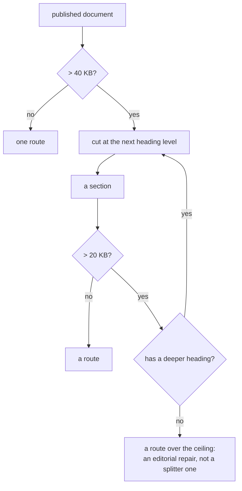

# 0225 — The split goes one level deeper

> **Status:** approved
> **Created:** 2026-09-23
> **Approved:** 2026-09-24 (user) — queued first in lane b. The `Pages` workflow is red and
> the site has not deployed since 2026-09-23, so this one is ahead of the rest of the queue.
> **Owner skill(s):** dev
> **Related ADRs:** [0247](../adrs/0247-the-split-recurses-and-the-ceiling-is-an-assertion-about-the-corpus.md) (proposed),
> [0166](../adrs/0166-a-published-document-splits-into-routes-by-size.md),
> [0154](../adrs/0154-the-reader-facing-docs-publish-as-a-site.md),
> [0163](../adrs/0163-a-long-document-carries-a-generated-contents-block.md)

## TL;DR

The `Pages` workflow is red on every push to `main` and the site has not deployed since
2026-09-23, because one route's source is 32,711 bytes against a 30,000 ceiling. ADR-0247 makes the
split recurse instead of stopping at `###`. Four functions in
`site/src/plugins/split-document.mjs` collaborate to produce routes, and **three of them assume
exactly two levels**, so the change is not one line.

## Context & problem

`### What the report's columns mean` in `docs/capturing.md` grew past the ceiling when
[Plan 0207](done/0207-the-commitments-get-their-instruments.md) Phase 2 added the report's cost
columns. It is a `###` with nine `####` children, so its content is already structured for a cut the
splitter declines to make.

Measured 2026-09-23 at `dc9e0bc6` by running the site's own splitter over the published set: 173
routes, one over the ceiling at 32,711 B, next largest 29,528 B, p90 10,354 B, p50 2,904 B. Cutting
the offender at `####` yields an index of 2,428 B and nine routes whose largest is 6,487 B.

**What makes this more than a threshold edit** is that the two-level assumption is spread across the
module:

| Function | Today | Under recursion |
|---|---|---|
| `splitDocument` | builds `sections`, each with `children` | needs children at any depth |
| `chunksOf` | `index`, then each section, then its `children` | needs a walk |
| `sidebarGroup` | one nested group per section with children | needs to nest to any depth |
| `fragmentMap` | keys every heading to its route | needs the deeper routes |

`scripts/check-site-routes.mjs`'s first property is that **every route a published source
contributes appears in the sidebar**, so a splitter that recurses while the sidebar does not trades
the size failure for an orphan failure.

## Decision

Implement ADR-0247: a section over `SECTION_SPLIT_BYTES` splits at the next heading level,
repeatedly, until it is under the threshold or has no deeper heading. Thresholds unchanged, entry
condition unchanged, terminal depth removed.



## Implementation phases

**`site/` has no test framework** — no test script, no test file, no runner in `site/package.json`.
This plan does not introduce one: the two site gates already run on every push in
`.github/workflows/pages.yml` and they assert the properties that matter here, so a framework added
for this change would be a second, weaker guard plus a dependency. Phase 1's check is therefore a
single `node` command against the module, and Phase 2's is the real gate.

### Phase 1 — The split recurses, and everything reading it follows

- **Owner skill:** dev
- **What:** `splitDocument` builds children at any depth; `chunksOf` walks them; `sidebarGroup`
  nests to the depth produced; `fragmentMap` keys the deeper headings to the routes that carry them.
  One module, one concept, one commit.
- **Files touched:** `site/src/plugins/split-document.mjs`.
- **Done when:** this command prints `32711` before the change and a number under `30000` after it,
  and prints no route twice:

  ```sh
  node --input-type=module -e "import {readFileSync} from 'node:fs'; import {PUBLISHED} from './site/src/plugins/rewrite-links.mjs'; import {splitDocument, chunksOf} from './site/src/plugins/split-document.mjs'; const R=new URL('file://'+process.cwd()+'/'); let m=0,n=0,seen=new Set(),dup=0; for (const [src,{route,title,wrap}] of Object.entries(PUBLISHED)) { if (wrap!==undefined) continue; const sp=splitDocument(readFileSync(new URL(src,R),'utf8'),route,title); if(!sp) continue; for (const c of chunksOf(sp)) { n++; if(seen.has(c.route)) dup++; seen.add(c.route); m=Math.max(m,Buffer.byteLength(c.body,'utf8')); } } console.log(JSON.stringify({routes:n,duplicates:dup,largest:m}));"
  ```

  It needs `npm --prefix site ci` first, for `github-slugger`. `duplicates` must be `0` in both runs.

### Phase 2 — The built site passes both gates

- **Owner skill:** dev
- **What:** the two gates that need a built site are run, for the first time outside CI, and
  whatever they report is repaired.
- **Files touched:** none expected; any repair the gates demand.
- **Done when:** `node scripts/check-site-routes.mjs` and `node scripts/check-site-links.mjs` each
  exit 0 against a `site/dist/` built by `npm --prefix site run build`, and the routes gate's
  success line reports a largest split route under 30,000.
- **Note:** the build renders mermaid through Playwright, so on a machine that has never run it this
  phase needs `npx --prefix site playwright install chromium` first — no browser is present on the
  Arch box as of 2026-09-24. **Not `--with-deps`**, which resolves system package names for
  Debian and Ubuntu only and fails on Arch; the shared libraries chromium needs are the box's own
  concern, and `playwright install` names what is missing if any is. That download is the only step
  here needing the network beyond `npm ci`.

### Phase 3 — The prose stops arguing a stop that no longer exists

- **Owner skill:** dev
- **What:** the doc comments justifying the stop at `###` justify the recursion instead, and
  `ROUTE_SOURCE_CEILING`'s comment says it asserts something about the corpus rather than about the
  algorithm, naming the instance it cannot repair.
- **Files touched:** `site/src/plugins/split-document.mjs`, `scripts/check-site-routes.mjs`.
- **Done when:** `git grep -n "stops at" -- site scripts` returns no line claiming the split stops at
  `###`, and `git grep -n "on-device-validation" -- site scripts` returns the ceiling's comment.

## Risks & open questions

- **Starlight's sidebar nesting depth is unverified.** Nested groups are supported; three levels
  deep with `collapsed` at each is not something this site does today. If Starlight refuses, the
  fallback is to flatten the third level into its parent group rather than to abandon the split,
  and Phase 2's done-when is what surfaces it.
- **URLs move for the second time in eighteen days.** ADR-0247 accepts this knowingly; it is called
  out here because it is the consequence a reader of the plan would otherwise meet in the diff.
- **`## Checklist` in `docs/on-device-validation.md` is 472 bytes under the ceiling with no internal
  headings.** Nothing in this plan helps it. It is recorded in ADR-0247 as a standing debt whose
  repair is editorial.

## What this plan does NOT do

- **It does not raise the ceiling.** The gate and the constant both refuse that in advance.
- **It does not edit a file under `docs/` or `presets/`** to change how the site cuts it — the
  one-source rule stands.
- **It does not add headings to `## Checklist`.** That is an editorial call about a hand-run
  checklist, and it belongs to whoever owns that document's shape.

## Implementation log

> Written as the phases land. **The phases above are the contract; everything here is what
> happened.**
