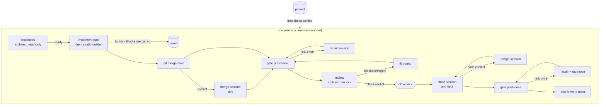

# 0226 — The conductor stops waiting for the owner

> **Status:** in-progress
> **Created:** 2026-09-24
> **Approved:** 2026-09-24 (user). Human-started, not queued; settle 0217 before starting.
> **Owner skill(s):** dev, human
> **Related ADRs:** [0248](../adrs/0248-the-pipeline-repairs-before-it-parks.md) (proposed),
> [0249](../adrs/0249-a-human-phase-may-be-owed-after-the-merge.md) (proposed),
> [0250](../adrs/0250-the-conductor-stays-up-and-resumes-what-the-repository-shows-settled.md) (proposed),
> [0205](../adrs/0205-an-approved-plan-runs-under-a-conductor-and-every-judgement-it-cannot-make-parks-the-plan.md),
> [0209](../adrs/0209-a-conductor-close-repairs-the-prose-and-comments-its-findings-name.md),
> [0214](../adrs/0214-the-digest-is-a-current-state-page-and-history-is-regenerated-on-demand.md),
> [0219](../adrs/0219-the-conductor-can-be-asked-to-finish-and-stop-and-the-ask-does-not-outlive-the-run.md)
> **Closes:** none
> **Runs human-started, NOT queued.** It rewrites the pipeline the conductor would run it with, and
> Phases 2, 3, 5 and 6 edit `.claude/skills/`, which a headless session cannot write (ADR-0210).

## TL;DR

The conductor spends most of its elapsed time parked, waiting for the owner. Between 2026-09-22
14:05 and 2026-09-24 08:03 it ran about 8 h of 42. It parked 10 times, and 6 of those were failures a
session could repair, a condition the tree already showed settled, or a plan contradiction readable
before any spend. This plan does three things. It makes `run` resident and self-resuming for a closed
list of park reasons (ADR-0250). It lets a `human` phase marked `**Blocks merge:** no` be owed after
the merge (ADR-0249). And it reshapes the pipeline (ADR-0248): a readiness check at the front, an
early merge of `main`, one merge or repair session before any conflict or red parks, and a review
split from its close so a clean verdict survives a park and the close lock stops covering reviews.
The first user-visible behaviour is one `run` that does not end until you pause it.

## Context & problem

The audit on 2026-09-24 read `tools/conductor/state/conductor.json` for the nine plans the
conductor touched in that window. What each park cost is in the three ADRs' Context sections, so
here is only the mapping from each park to what removes it:

| Park | Plan | Waited | Removed by |
|---|---|---|---|
| disagreement (the fixed_in rename) | 0221 | 32m | fixed by Plan 0222 |
| disagreement (`Status: done.`) | 0217 | still parked | fixed by `dc36aa15` |
| api (a 429 usage limit) | 0215 | 3h | fixed by `f561800a` (the wait, then `--resume`) |
| merge_conflict + a whole review re-run | 0224 | 11m + $15.29 | Phases 4 and 5 |
| gate_red | 0224 | 1.25h | Phase 4 |
| check_red (electron stub) | 0217 | 13h | Plan 0220 (ADR-0244 `allowScripts`) |
| human_phase | 0207, 0224 | 17h, 16h | Phase 2, then Phase 1's self-resume |
| plan_wrong | 0206, 0223 | 14h, still parked | Phase 6 (before the spend, not instead of the park) |

Beyond the parks, the owner started the run **10 times**, and the worktree cap stopped lane b on
09-23 until `local.json` was edited.

## Decision

We take ADRs 0248, 0249 and 0250 as written, in one plan, because they share `lib/lane.mjs`'s
`runPlan` and `laneLoop` and would conflict as three. The interview settled four choices on
2026-09-24:

- A human phase is non-blocking **by an explicit per-phase field**, not by position (a trailing phase
  is not automatically non-blocking) and not universally.
- Every merge conflict is resolved automatically and the gate decides. The resolver is a `dev`
  session rather than the architect close, which is a refinement of the owner's pick recorded in
  ADR-0248 Alternative B.
- `run` is **resident**, not self-resuming-then-exiting.
- The early merge, the narrow close lock, the readiness check and the verdict reuse all join this
  plan.

## Architecture diagram



## Implementation phases

Every phase keeps `node --test "tools/conductor/test/*.test.mjs"` green. Each new behaviour gets a
`test/lane.test.mjs` scenario driven through `test/fake-claude.mjs` and `test/lane-scenario.mjs`,
which spend nothing. The README's park table and its prose change with the phase that changes the
behaviour, never at the end.

### Phase 1 — The run stays up, waits at the cap, and resumes what the tree settled

- **Owner skill:** dev
- **What:** ADR-0250 in full:
  - `run` is resident, and `--until-idle` gives today's behaviour. An idle lane re-reads the queue,
    the plans and the state every 60 s.
  - The worktree cap is a wait.
  - The closed self-resume list, reusing `parkStillTrue`'s conditions, never resumes a dirty lane.
  - `run_budget_usd` is required in `local.json`, and reaching it pauses the run.
  - The CLI version is re-read before every session.
  - The digest's **Now** shows an idle lane as watching and a capped lane as waiting on named plans.
- **Files touched:** `tools/conductor/conductor.mjs`, `tools/conductor/lib/lane.mjs`,
  `tools/conductor/lib/queue.mjs`, `tools/conductor/lib/state.mjs`, `tools/conductor/lib/digest.mjs`,
  `tools/conductor/lib/inbox.mjs`, `tools/conductor/local.example.json`,
  `tools/conductor/README.md`, `tools/conductor/test/lane.test.mjs`,
  `tools/conductor/test/cli.test.mjs`, `tools/conductor/test/queue.test.mjs`
- **Done when:**
  - A scenario whose lane parks `human_phase` and then has the phase's row marked `done` in the lane,
    by a commit the test makes while the run is up, merges that plan **in the same `runLanes` call**,
    with one inbox entry naming the settled condition.
  - The same scenario with the lane left dirty stays parked.
  - A `gate_red` park never resumes itself.
  - A scenario at `max_open_worktrees` whose holder merges mid-run starts the waiting plan in that
    run.
  - A plan appended to `queue.json` mid-run is started.
  - `--until-idle` ends a run whose queue is empty, as today.
  - `check` refuses a `local.json` without `run_budget_usd`.
  - A run whose steps' spend reaches it records `paused` and starts no further plan.
  - The pause, abort and cap tests that exist today still pass, rewritten only where a cap stop
    became a wait.

### Phase 2 — A human phase can be owed after the merge

- **Owner skill:** dev
- **What:** ADR-0249:
  - `lib/plan.mjs` parses `**Blocks merge:** no` on `human` phases and errors on any other owner.
  - `nextStep` skips a non-blocking human run, and records it owed in the state and the lane's plan
    log (`owed`).
  - `verifyClose` accepts `owed` rows.
  - The digest's **Needs you** lists every `docs/plans/done/` plan with an `owed` row, read from the
    main checkout's tree.
  - The architect skill's Mode 1 gets the authoring rule for the field, and its conductor-mode close
    gets how to write `Status:` and the `## Close review` for an owed phase.
  - The plan template shows the field.
  - The dev skill's log vocabulary gains `owed`.
- **Files touched:** `tools/conductor/lib/plan.mjs`, `tools/conductor/lib/lane.mjs`,
  `tools/conductor/lib/close.mjs`, `tools/conductor/lib/digest.mjs`, `tools/conductor/README.md`,
  `tools/conductor/test/plan.test.mjs`, `tools/conductor/test/lane.test.mjs`,
  `tools/conductor/test/digest.test.mjs`, `.claude/skills/architect/SKILL.md`,
  `.claude/skills/architect/references/templates/plan.md`, `.claude/skills/dev/SKILL.md`
- **Done when:**
  - A plan `dev 1, human 2 (Blocks merge: no), dev 3` merges with Phase 3 implemented and Phase 2's
    row `owed`, and its digest shows one owed line.
  - Committing that row as `done` on `main` removes the line, with nothing written to `state/`.
  - The same plan without the field parks `human_phase` at Phase 2, as today.
  - `Blocks merge: no` on a `dev` phase is a plan-reader error that `check` reports.

### Phase 3 — The lane merges main early, and a conflict gets a merge session

- **Owner skill:** dev
- **What:** ADR-0248 items 2 and 3:
  - The conductor runs `git merge main` in the lane before the pre-review gate.
  - A conflict there, or at the fast-forward's re-merge (`lib/merge.mjs`), aborts the merge and
    starts one `merge` session (`prompts/merge.md`): `dev`, or `studio-builder` when every conflicted
    path is under `studio/`. The session is handed the paths, redoes the merge, resolves it, commits,
    and ends `merged` or parks.
  - The conductor verifies the result: a merge commit whose second parent is `main`'s tip, a clean
    tree, and no conflict markers in the paths it was handed (checked with `git grep`).
  - The implementer skills' conductor-mode sections gain the `merge` kind.
  - `local.json` gains the required `budget_usd.merge`.
- **Files touched:** `tools/conductor/lib/lane.mjs`, `tools/conductor/lib/merge.mjs`,
  `tools/conductor/lib/outcome.mjs`, `tools/conductor/lib/close.mjs`, `tools/conductor/lib/queue.mjs`,
  `tools/conductor/prompts/merge.md`, `tools/conductor/local.example.json`,
  `tools/conductor/README.md`, `tools/conductor/test/fake-claude.mjs`,
  `tools/conductor/test/lane-scenario.mjs`, `tools/conductor/test/lane.test.mjs`,
  `.claude/skills/dev/SKILL.md`, `.claude/skills/studio-builder/SKILL.md`
- **Done when:**
  - A scenario where `main` gains a conflicting commit before pre-review runs one merge session and
    then the gate, and merges. The review session's prompt names the merged tip.
  - A merge session that leaves a conflict marker parks `disagreement`.
  - A second conflict in the same plan starts a second merge session, not a park. The limit is one
    session per conflict.
  - The re-merge conflict test that exists today now expects a merge session instead of a park.

### Phase 4 — A red gate gets one repair session

- **Owner skill:** dev
- **What:** ADR-0248 item 4:
  - A red at any stage starts one `repair` session (`prompts/repair.md`) with the gate log's path and
    the failing command. It is `studio-builder` when that command is a studio check, `dev` otherwise.
    It commits and ends `repaired` or parks.
  - The stage's gate runs again, and a second red at the stage parks `gate_red`.
  - At most three repairs run per plan.
  - After a repair at `post-close` or `remerge`, the annotated tag moves (`moveTag`).
  - Repair commits on a closed tip are recorded and listed under **Needs you** as unreviewed, by SHA.
  - The prompt forbids changing an assertion to make it pass. When the test is wrong, the session
    parks `plan_wrong`.
  - `local.json` gains the required `budget_usd.repair`.
- **Files touched:** `tools/conductor/lib/lane.mjs`, `tools/conductor/lib/merge.mjs`,
  `tools/conductor/lib/outcome.mjs`, `tools/conductor/lib/digest.mjs`, `tools/conductor/lib/queue.mjs`,
  `tools/conductor/prompts/repair.md`, `tools/conductor/local.example.json`,
  `tools/conductor/README.md`, `tools/conductor/test/lane-scenario.mjs`,
  `tools/conductor/test/lane.test.mjs`, `tools/conductor/test/digest.test.mjs`
- **Done when:**
  - The `a red conductor gate parks before any review` scenario becomes: a red pre-review gate runs
    one repair session, the gate re-runs green, and the plan merges.
  - A repair that leaves the gate red parks `gate_red`, with the second log.
  - A red `post-close` repaired once merges with the tag on the repaired tip, and the digest lists
    that repair's SHA as unreviewed.
  - A fourth red in one plan parks without a session.

### Phase 5 — The close is its own session, holds the lock alone, and keeps a clean verdict

- **Owner skill:** dev
- **What:** ADR-0248 item 5:
  - `prompts/review.md` ends at the verdict.
  - A new `prompts/close.md` carries today's close steps and is handed the verdict's review path. A
    code conflict at its merge parks `merge_conflict` back to the conductor, which runs Phase 3's
    merge session and starts the close again.
  - The verdict is recorded with the tip it graded.
  - The close lock is taken before the close session and never before a review.
  - `resume` after a close-time park reuses a clean verdict while every commit after its graded tip is
    a merge of `main` or recorded as a close, merge or repair session's commit. Any other commit runs
    a fresh review round.
  - The architect skill's conductor-mode section splits into a review half and a close half.
  - `adoptedClose` still adopts a close a session committed and lost.
  - `local.json` gains the required `budget_usd.close`.
- **Files touched:** `tools/conductor/lib/lane.mjs`, `tools/conductor/lib/close.mjs`,
  `tools/conductor/lib/outcome.mjs`, `tools/conductor/lib/state.mjs`, `tools/conductor/lib/queue.mjs`,
  `tools/conductor/prompts/review.md`, `tools/conductor/prompts/close.md`,
  `tools/conductor/local.example.json`, `tools/conductor/README.md`,
  `tools/conductor/test/fake-claude.mjs`, `tools/conductor/test/lane-scenario.mjs`,
  `tools/conductor/test/lane.test.mjs`, `tools/conductor/test/close.test.mjs`,
  `.claude/skills/architect/SKILL.md`
- **Done when:**
  - A clean plan's steps read `implement, review, close`, and the close lock's recorded wait starts
    after the review ends.
  - The `two lanes closing at once serialize on the close lock` scenario shows both reviews running
    concurrently and the two closes serialized.
  - A close that parks `check_red`, resumed with only a merge of `main` added, runs **no** review and
    one close.
  - The same resume after a test commits a non-merge fix in the lane runs a round-2 review.
  - A close-time code conflict runs one merge session, then one close, and merges.
  - The adopted-close scenario still passes unchanged.

### Phase 6 — A readiness check reads the plan before any spend

- **Owner skill:** dev
- **What:** ADR-0248 item 1:
  - A `readiness` session (`prompts/readiness.md`, architect, read-only) runs before a plan's first
    implement session. It ends `ready`, or parks `plan_wrong` naming the phase and the contradiction.
  - The conductor verifies that it left `HEAD` and the tree untouched.
  - It records the plan file's blob hash, and re-runs on resume only when that hash changed.
  - The architect skill gets a `readiness` conductor-mode half listing the checks ADR-0248 names,
    including a phase that depends on a `Blocks merge: no` phase.
  - `local.json` gains the required `budget_usd.readiness`.
- **Files touched:** `tools/conductor/lib/lane.mjs`, `tools/conductor/lib/outcome.mjs`,
  `tools/conductor/lib/state.mjs`, `tools/conductor/lib/queue.mjs`,
  `tools/conductor/prompts/readiness.md`, `tools/conductor/local.example.json`,
  `tools/conductor/README.md`, `tools/conductor/test/lane-scenario.mjs`,
  `tools/conductor/test/lane.test.mjs`, `.claude/skills/architect/SKILL.md`
- **Done when:**
  - A plan whose readiness session parks `plan_wrong` has no implement step in its record.
  - A readiness session that commits parks `disagreement`.
  - Resuming a plan after a readiness park with the plan file unchanged runs readiness again.
  - Resuming a plan that parked later, with its plan unchanged, does not.
  - Every existing scenario's step list gains `readiness` first and nothing else changes.

### Phase 7 — The pilot: one resident run over the real queue

- **Owner skill:** human
- **What:** Write the four new budget keys and `run_budget_usd` into `local.json`, then start one
  `run` over the queue as it stands and leave it up through at least one night. Afterwards, read the
  digest and `digest --history`. Record the following in this plan's `### Notes`:
  - the runs started (the target is one);
  - the parks by reason;
  - the self-resumes;
  - the merge and repair sessions, and whether each merged;
  - the readiness verdicts;
  - the spend against the previous window's $274 for six merges.
- **Files touched:** `tools/conductor/local.json` (gitignored), this plan's log
- **Done when:** the Notes carry those readings. Any park the new pipeline should have absorbed and
  did not has become a backlog entry naming its run and reason.

## Data shapes

```jsonc
// illustrative — local.json after this plan
{
  "budget_usd": { "readiness": 3, "implement": 60, "merge": 10, "repair": 15, "fix": 30, "review": 25, "close": 20 },
  "run_budget_usd": 400,
  "max_open_worktrees": 5
}
```

```jsonc
// illustrative — new outcome kinds
{"kind": "ready",    "plan": "0226"}
{"kind": "merged",   "plan": "0226", "commit": "<sha of the merge commit>"}
{"kind": "repaired", "plan": "0226", "commits": ["<sha>"]}
// a verdict as the conductor records it: the tip it graded, for reuse
{"round": 1, "blockers": 0, "majors": 0, "minors": 2, "graded": "<sha>", "review_path": "...", "findings": []}
```

## Risks & open questions

- **The conductor's own tests are the only safety net for a change to the conductor.** Phase 7 is
  the first time the reshaped pipeline meets a real session. A fault it finds parks, and a park is
  what exists today, so a failed pilot costs a night, not a merge.
- **Readiness false positives.** A readiness session that parks good plans pays its cost and adds
  the wait this plan removes. Phase 7 counts its verdicts. If it parks more than it catches, retire
  it with an Outcome on ADR-0248 rather than tuning its prompt in place.
- **A repair can make a gate green the wrong way.** ADR-0248's negative, restated for the reviewer
  at close: read `prompts/repair.md` for the assertion rule, and read Phase 4's done-when for the
  unreviewed-SHA listing.
- **Self-resume can re-enter a park loop.** For example, a `studio_install` that fails every hour.
  The retry count bounds that reason. Any new self-resume reason needs a bound in the ADR first.
- **Phase 5 changes the close's shape while Plan 0217's lane still holds a close that was adopted
  under the old one.** Settle 0217 (`resume 0217`, `run`) before starting this plan.

## What this plan does NOT do

- **It does not supervise the conductor process.** A resident run that dies stays dead until the
  owner starts it (ADR-0250's negative).
- **It does not fix the electron stub.** Plan 0220 does, at the source (ADR-0244).
- **It does not change what the owner approves, or the push.** Approval and the push are still the
  only two things ADR-0205 reserves for the owner outside a park.
- **It does not add any self-resume reason beyond ADR-0250's list.** Automating `gate_red`, `plan_wrong`
  or `disagreement` further is a new ADR.
- **It does not queue itself.** See the header.

## Implementation log

> Written by `dev` — one row per phase as that phase's commit lands, and the close block after the
> last one. **The phases above are the contract; everything here is what happened.**
> **Observations, never conclusions:** this says where to look, architect decides how it went.
> No per-criterion pass list, no self-assessment, no narrative — but a deviation from the plan or
> an unmet done-when is always disclosed. Stays shorter than `## Implementation phases` above.

**Lane:** `plan-0226-the-conductor-stops-waiting-for-the-owner` in `WORK/rlx-plan-0226`, human-started

| phase | owner | state | commit |
|---|---|---|---|
| 1 — The run stays up, waits at the cap, and resumes what the tree settled | dev | done | `affd4859` |
| 2 — A human phase can be owed after the merge | dev | committed with this row | |
| 3 — The lane merges main early, and a conflict gets a merge session | dev | not started | |
| 4 — A red gate gets one repair session | dev | not started | |
| 5 — The close is its own session, holds the lock alone, and keeps a clean verdict | dev | not started | |
| 6 — A readiness check reads the plan before any spend | dev | not started | |
| 7 — The pilot: one resident run over the real queue | human | not started | |

### Notes

- Phase 1: "re-reads the state" is carried by `resume` itself. While a run is live, `resume` checks the
  park and appends to `state/resume-asks.jsonl`, and the lane takes it on its next look
  (`lib/state.mjs` `askResume`/`takeResumeAsks`). The run still owns `conductor.json`. `park` and
  `finding --verb` are still refused during a live run.
- Phase 1: a CLI version refused between sessions parks the plan about to start `cli_contract`, with
  no session. It also pauses the run (`run.paused.reason: cli_version`).
- Phase 1: under `--until-idle` the cap waits only while a holder is in flight in the run. With every
  holder parked it still stops, which is why the existing cap tests are unchanged.
- Phase 1: `test/live.test.mjs` is outside the phase's files. Its `local.json` fixture gained
  `run_budget_usd`, and nothing else changed.
- Phase 2: `verifyClose` checks only that an `owed` row sits on a `Blocks merge: no` human phase. It
  does not require every other row to read done, because the close fixtures in `test/close.test.mjs`
  carry rows that do not.
- Phase 2: `test/helpers.mjs` is outside the phase's files. `planText` gained a `blocksMerge` phase
  field. The conductor commits the `owed` row itself, as `docs(plans): NNNN Phase N is owed after the
  merge`.

### Close triggers

- **`presets/` touched:**
- **Plan header `Closes:`**
- **What shipped:**
- **Operator docs touched:**
- **Backlog probes (`node scripts/check-backlog-claims.mjs`):**
- **Full suite:**
- **Outstanding `human` phases:**

## Followups (after this lands)
