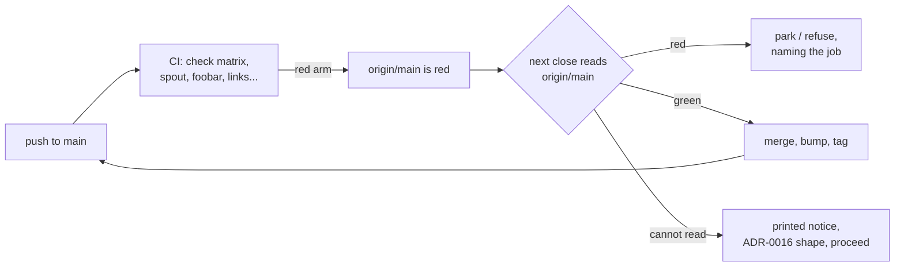

# 0227 — The gated paths get their jobs, and a red upstream stops the close

> **Status:** in-progress
> **Created:** 2026-09-24
> **Approved:** 2026-09-24 (user) — queued in lane a. Phase 1 unblocks the macOS release
> artifacts, which have been absent since v0.146.1.
> **Owner skill(s):** dev, human
> **Related ADRs:** [0251](../adrs/0251-a-gated-compile-path-has-a-named-job-and-the-upstream-reading-is-advisory.md)
> (proposed), [0181](../adrs/0181-the-gate-compiles-every-feature-a-release-ships.md),
> [0016](../adrs/0016-gpu-tests-opt-in-ci-scope.md),
> [0033](../adrs/0033-testing-strategy-coverage-ratchet-and-pre-push-gate.md),
> [0203](../adrs/0203-a-release-tag-is-annotated-and-origin-is-what-is-checked.md),
> [0205](../adrs/0205-an-approved-plan-runs-under-a-conductor-and-every-judgement-it-cannot-make-parks-the-plan.md),
> [0210](../adrs/0210-a-claude-repair-is-the-owners-and-a-session-that-needs-one-parks-with-the-edit.md),
> [0249](../adrs/0249-a-human-phase-may-be-owed-after-the-merge.md)
> **Closes:** none

## TL;DR

The macOS build has been broken since at least `v0.146.1` by one private type, and nothing stopped a
thing. Phase 1 is the one-word repair. The rest is why nobody noticed: a red arm of `check` on `main`
costs nothing today, so this plan makes it cost the **next close**, and gives the one gated compile
path that still has no job before a tag — the foobar component — a job. The reading is **advisory**:
it names the failing job at every close and blocks nothing, because the conductor never pushes and so
cannot clear a red `origin/main` itself.

## Context & problem

`standalone/src/capture_mac/rt.rs:86` declares `struct OutputIvars(UnsafeCell<AudioState>)` private,
and `define_class!` at line 90 leaks it into a public interface: `error[E0446]`, a hard compile error.

Measured 2026-09-24:

- `check (macos-latest)` fails in **50 s** at its first step, `cargo build`, on run `35972983139`
  (`main`, at 0226's close). Every later step in that arm is skipped.
- `Release` fails the same way on `v0.147.0` (run `35972982907`) and `v0.146.1` (run `35962773617`),
  in the `macos` and `studio-macos` jobs. `linux`, `windows` and `studio-windows` pass in both.
- The rest of that CI run is healthy: `deny`, `studio`, `links`, `check (windows-latest)` and
  `coverage` all pass.

**Coverage is not the gap.** macOS is in the `check` matrix and reported this on every push.
**Consequence is the gap** — and `release.yml`'s `needs:` meant the only visible symptom was two
artifacts that never appeared, which is exactly what
[ADR-0181](../adrs/0181-the-gate-compiles-every-feature-a-release-ships.md) recorded for `v0.112.0`. Second
instance, same class.

[ADR-0251](../adrs/0251-a-gated-compile-path-has-a-named-job-and-the-upstream-reading-is-advisory.md)
decides both halves and records the four rejected alternatives.

## Decision

Take ADR-0251 as written. The fix first, because it is one word and the tree is red without it; then
the reader, the close's use of it, the missing job, and the documents.

The close reads the tip it merges **onto**, not the commit it tags — the tag is written before the
push, so the tagged commit has no CI result yet. Reading the predecessor would have caught this:
Plan 0225's close merged onto `15b08d57`, already red.

## Implementation phases

### Phase 1 — The macOS build compiles again
- **Owner skill:** dev
- **What:** the one-word visibility repair. Nothing else.
- **Files touched:** `standalone/src/capture_mac/rt.rs`.
- **Done when:** `OutputIvars` is no longer a private type named in a public interface, and a comment
  states the mechanism — `define_class!` generates a public interface, so every type it names is
  reachable from one. `git grep -n "^struct " -- standalone/src/capture_mac` reports no other private
  type declared in that file's `define_class!` inputs. **This phase cannot be verified locally**: the
  module is `#[cfg(target_os = "macos")]` and no Linux or Windows target compiles it, so
  `check (macos-latest)` is the verifier and Phase 7 reads it.

### Phase 2 — A reader for origin's CI
- **Owner skill:** dev
- **What:** `scripts/check-upstream-ci.mjs`, zero-dependency Node, reading the newest `CI` workflow
  conclusion for `origin/main` through `gh`.
- **Files touched:** `scripts/check-upstream-ci.mjs`, `scripts/fixtures/` for its seeded cases.
- **Done when:**
  - Green exits 0 and prints the run id it read. Red exits non-zero and **names the failing job**
    (`check (macos-latest)`), not merely the run.
  - It reads the **`CI` workflow only**. A red `Pages` or `Release` does not fail it, and a seeded
    fixture covers that — ADR-0251 names this because the obvious implementation reads "the latest
    run" and gets it wrong.
  - **Every unreadable case prints a notice and exits 0**: no network, `gh` absent, `gh`
    unauthenticated, no `origin` remote. The notice is in
    [ADR-0016](../adrs/0016-gpu-tests-opt-in-ci-scope.md)'s shape and says which case it hit. Green
    and not-read are never spelled the same way in the output.
  - It is **not** added to `scripts/gates.manifest.mjs`, `.githooks/pre-push` or the CI `links` job:
    it needs the network and its answer changes without a commit, which is why
    [ADR-0033](../adrs/0033-testing-strategy-coverage-ratchet-and-pre-push-gate.md) keeps
    `cargo deny` out of the hook. `node scripts/check-gate-carriers.mjs` stays green.

### Phase 3 — The close reports it and never blocks on it
- **Owner skill:** dev
- **What:** the conductor's close runs Phase 2's script before it merges and **records the reading**.
  **Amended 2026-09-24, mid-flight**: the first version of this phase parked the plan on red and was
  implemented that way in `f0a5eee1`. That is withdrawn — see
  [ADR-0251](../adrs/0251-a-gated-compile-path-has-a-named-job-and-the-upstream-reading-is-advisory.md)
  Alternative E. **The conductor never pushes**, so `origin/main` advances only by hand: a refusal
  would make every close wait on a step the pipeline cannot take, and local merges run ahead of
  `origin`, so the ref describes an older tree than the one being closed.
- **Files touched:** `tools/conductor/lib/close.mjs` or `lane.mjs` as the seam dictates,
  `tools/conductor/lib/digest.mjs`, `tools/conductor/test/`, `tools/conductor/README.md`.
- **Done when:**
  - A close over a red `origin/main` **merges as normal** and writes one line naming the failing job
    to the run log, and a row to the digest's `Needs you` that survives until the reading is green.
  - **No park reason `upstream_red` exists.** `git grep -n upstream_red -- tools/conductor` returns
    nothing outside a comment explaining why it was withdrawn. The commit that introduced it
    (`f0a5eee1`) is reverted or superseded in this phase, not left dead.
  - The conductor's own suite covers green, red and unreadable with a fake `gh`, asserting in each
    case that the merge still happens. `node --test tools/conductor/test/` passes.

### Phase 4 — The foobar component joins the push
- **Owner skill:** dev
- **What:** the third row of ADR-0251's roster. `plugin-foobar/`'s C++ compiles today only in
  `release.yml`'s `foobar` job, at tag time; it gets a job on every push, in the `spout` job's shape.
- **Files touched:** `.github/workflows/ci.yml`.
- **Done when:** a `foobar` job runs on a push to `main`, stages the pinned SDK the way
  `packaging/foobar/` already does, and compiles the component. It is **its own job, concurrent**,
  not a step on `check (windows-latest)` — ADR-0181 Alternative A measured that a concurrent job does
  not move the wall clock, and a step there would name `check` as the subject when this breaks. The
  job's comment states what it guards and that the release job remains the last line.

### Phase 5 — The documents say what a machine needs and what a red upstream does
- **Owner skill:** dev
- **What:** the setup step and the behaviour, for a reader arriving at the repository.
- **Files touched:** `README.md`, `docs/developing.md`, `docs/releasing.md`.
- **Done when:**
  - `README.md`'s setup path names `gh auth login` as an **opt-in per-machine step**, in the same
    voice as `git config core.hooksPath .githooks` — what it buys, and that a machine without it
    still builds and closes, with a printed notice rather than a silent pass.
  - `docs/developing.md` gains the gated-path roster as a table: which job compiles `capture_mac/`,
    `spout` and `plugin-foobar/`, and the standing fact that **nothing local compiles any of them**.
  - `docs/releasing.md` says a close **reports** `origin/main`'s CI and never blocks on it, why
    (the conductor cannot push, so it cannot clear the ref it would be waiting on), and where the
    reading appears. **Amended 2026-09-24** with Phase 3; the wording that shipped in `c149b93d`
    describes the withdrawn blocking behaviour and is corrected here.
  - Every Plan and ADR citation in these three is inside a markdown link, never bare —
    `node scripts/check-reader-prose.mjs` is green, as are `check-doc-links.mjs`,
    `check-index-rows.mjs` and `toc.mjs --check`.

### Phase 6 — The close ceremony gains the step
- **Owner skill:** human
- **Blocks merge:** no
- **What:** `.claude/skills/architect/SKILL.md`'s close-ceremony bookkeeping gains the upstream read,
  so a human-started close does what the conductor's does.
- **Files touched:** `.claude/skills/architect/SKILL.md`.
- **Done when:** the close-ceremony section names `node scripts/check-upstream-ci.mjs`, says it runs
  **before** the merge, and says what a red and an unreadable result each mean. A headless session
  cannot write under `.claude/` whatever the allowlist says
  ([ADR-0210](../adrs/0210-a-claude-repair-is-the-owners-and-a-session-that-needs-one-parks-with-the-edit.md)),
  which is why this phase is `human`; it is marked non-blocking per
  [ADR-0249](../adrs/0249-a-human-phase-may-be-owed-after-the-merge.md) because the conductor's own
  close already carries the behaviour from Phase 3.

### Phase 7 — The reading that only a push can produce
- **Owner skill:** human
- **Blocks merge:** no
- **What:** confirm on the real runners what no local step can.
- **Files touched:** this plan's `## Implementation log`.
- **Done when:** after the push, the log records `check (macos-latest)` **green** with its run id, and
  the `Release` run for the next tag publishing **all six** artifacts — `macos`, `windows`, `linux`,
  `foobar`, `studio-macos`, `studio-windows`. A failure here is a finding, not a retry.

## Risks & open questions

- **Nothing forces the repair.** The reading is advisory by decision, so it can be ignored. Accepted:
  the alternative deadlocks a pipeline that cannot push. If it is ignored in practice, the question
  to reopen is what else the digest should do with a reading that has stayed red across several
  closes — not whether to make it a gate.
- **`gh` is a new dependency of the close.** Degraded rather than hard, so the guarantee is only as
  strong as the last machine that could read. Phase 2's notice is what keeps that visible.
- **Phase 4 may find the foobar component already broken.** Nothing has compiled it on a push, ever.
  If it is red on arrival, that is a finding and its own work — this plan adds the job, it does not
  promise the job is green.
- **Phase 1 is unverifiable until Phase 7.** Accepted: the alternative is an Apple SDK on a Linux box.

## What this plan does NOT do

- **It does not adopt pull requests or branch protection.** ADR-0251 Alternative D: the owner pushes
  straight to `main`, so there is no review gate for a required check to attach to.
- **It does not add a watcher.** Alternative B. Nothing polls CI; the close asks once.
- **It does not change `release.yml`'s `needs:`.** That gate was correct and stays the last line.
- **It does not make the close read `Pages` or `Release`.** Only the `CI` workflow, by decision.
- **It does not fix whatever Phase 4 finds** in the foobar component.

## Implementation log

> Written by `dev` — one row per phase as that phase's commit lands, and the close block after the
> last one. **The phases above are the contract; everything here is what happened.**

**Lane:** `plan-0227-the-gated-paths-get-their-jobs-and-a-red-upstream-stops-the-close`, worktree
`/home/igor/Work/rlx-plan-0227`

| phase | owner | state | commit |
|---|---|---|---|
| 1 — The macOS build compiles again | dev | done | 646ca642 |
| 2 — A reader for origin's CI | dev | done | 1e7e4857 |
| 3 — The close reports it and never blocks on it | dev | done | 1fc58a95 |
| 4 — The foobar component joins the push | dev | done | 0c0ac09b |
| 5 — The documents say what a machine needs | dev | done | 417022b7 |
| 6 — The close ceremony gains the step | human | owed | |
| 7 — The reading that only a push can produce | human | owed | |

### Notes

- Phase 1: the visibility is `pub(super)`, matching `StreamOutput`, not `pub`. Not compiled here —
  no local target builds `capture_mac/`; Phase 7's `check (macos-latest)` is the verifier.
- Phase 2: the script also takes `--json` and `--self-test` (13 cases, seeded under
  `scripts/fixtures/upstream-ci/`, with a section in `scripts/fixtures/README.md`), and exports
  `readUpstream` for Phase 3. A cancelled or skipped `CI` run is passed over for the next older one.
  Run for real on 2026-09-24 it exited 1 naming run 35972983139 and `check (macos-latest)`.
- Phase 3: the seam is `lane.mjs`, and the read runs under the close lock before each close session.
  `f0a5eee1` is superseded forward, not reverted: its read, record and tests stay, the park and
  its README row are gone. The digest line is derived from the newest red or green reading across
  every plan record; an unread reading neither raises nor clears it. The fake `gh` is the fixture
  from Phase 2, reached through `ctx.upstreamEnv`. The existing test *a lane for a plan that does
  not name studio/ installs nothing* counted every live line containing `skipped:`, and the unread
  notice added one. Its filter is narrowed to gate lines; its count of 6 is unchanged.
- Phase 3, not acted on: `scripts/check-upstream-ci.mjs`'s own red output (Phase 2's file, outside
  this phase's list) still ends `A close refuses over a red main (ADR-0251)`. The conductor prints
  its own line and does not show it; a person running the script by hand does see it.
- Phase 4: the job runs `packaging/foobar/fetch-sdk.ps1`, then `plugin-foobar/build.ps1`, and
  not `build-component.ps1`, so packaging and its verification stay in `release.yml` alone. The
  workflow header's count of single-runner gates went from five to six. Not run: the job needs a
  Windows runner with MSVC, and the first push is the first time it runs.
- Phase 5: `check-reader-prose.mjs` does not read `README.md`, `docs/developing.md` or
  `docs/releasing.md`. The last two are in its Contribute group, which keeps bare citations. It
  exits 0, and the new lines in all three were checked by hand for bare citations: none.
- Phase 5, reopened: the section `## A close refuses over a red main` in `docs/releasing.md` is
  renamed `## A close reports a red main and never blocks on it`, and `docs/developing.md`'s link
  to its anchor follows. ADR-0251's file was renamed on `main`, so every link to it in the three
  files moved too. Outside this phase's list: the same rename left one link in
  `scripts/fixtures/README.md` broken, which kept `check-doc-links.mjs` red; it is corrected in
  this phase's commit.
- Review round 1, finding 0 (major): the script's red output and `redSubject`'s comment no longer
  name the withdrawn refusal, in `f1bbf1b1`. `--self-test` 13 of 13. Findings 1 and 2 (minor) sit
  in the Decision flowchart and the Followups, outside the log, and are left.

### Close triggers

- **`presets/` touched:** no
- **Plan header `Closes:`** none
- **What shipped:** feature. A new script, a conductor upstream reading with a digest line (no
  park reason) and a new CI job, plus a compile fix in `standalone/src/capture_mac/rt.rs`.
- **Operator docs touched:** `README.md`, `docs/developing.md`, `docs/releasing.md`,
  `tools/conductor/README.md`, `scripts/fixtures/README.md`
- **Backlog probes (`node scripts/check-backlog-claims.mjs`):** exit 0, with 46 reductions holding
  across 21 live entries, 4 unprobeable, and 30 advisory moved-path rows
- **Full suite:** owed to the conductor's pre-review gate (ADR-0207)
- **Outstanding `human` phases:** 6 and 7, both `Blocks merge: no`

## Followups (after this lands)

- A digest row for a red `origin/main`, alongside the refusal rather than instead of it
  (ADR-0251 Alternative A).
- Whether the refusal should be per-platform rather than per-run, if one arm halting the queue bites.
