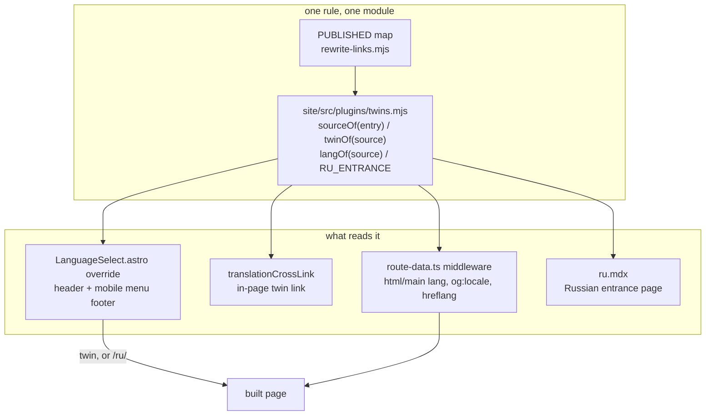

# 0230 — The Russian slice becomes findable

> **Status:** draft
> **Created:** 2026-09-26
> **Owner skill(s):** dev, human
> **Related ADRs:** [0213](../adrs/0213-the-russian-slice-stays-a-section-and-gets-a-header-control.md),
> [0185](../adrs/0185-the-docs-translate-a-slice-and-a-stamp-makes-staleness-visible.md),
> [0154](../adrs/0154-the-reader-facing-docs-publish-as-a-site.md)
> **Closes:** none

## TL;DR

The site publishes five Russian pages that a reader cannot find from where they arrive. This plan
does what [ADR-0213](../adrs/0213-the-russian-slice-stays-a-section-and-gets-a-header-control.md)
decided and adds two things beside it. The header gets a language control, built as an override of
Starlight's `LanguageSelect` slot, and it points at the current page's twin or at a new Russian
entrance page. The Russian pages declare `lang="ru"` and carry `hreflang` alternates. And the
landing page and *Start here* link to the Russian pages. The first visible change is a `Русский`
link beside the theme toggle on every page with a sidebar.

## Context & problem

These three problems were read off the live site at `https://igorkonovalov.github.io/Ritmolux/` on
2026-09-26.

**1. There is no language control in the header.** ADR-0213 decided on one and no plan built it.
The only way into the Russian slice is still the `Русский` sidebar group, which is the seventh of
seven groups, and the in-page twin link that `translationCrossLink` in `site/astro.config.mjs`
inserts. That link appears only on the ten pages that have a twin. A comment in that function still
says *"There is no header picker to compete with - that needs the locale migration this site has not
made"*. ADR-0213 showed that premise to be false.

**2. The Russian pages are served as English.** `Page.astro:50` in `@astrojs/starlight` 0.42.0
writes `<html lang={starlightRoute.lang}>`, and a monolingual site gives every route the default
locale's `en`. Line 92 also writes `<main lang={starlightRoute.entryMeta.lang}>`, again `en`. A
screen reader therefore reads Russian prose with an English voice, and a search engine sees
`og:locale` `en` and no alternates. ADR-0213 recorded this as the one cost it was not repairing. It
asked whoever built the header control to check whether a per-entry `lang` is cheap and to take it
if so.

**The check has been done, and the answer is that it is cheap and needs no component override.**
Starlight 0.42.0 has a supported `routeMiddleware` option (`dist/utils/user-config.d.ts:123`). It
runs after the route data is built and before the page renders
(`dist/utils/routing/middleware.js`), and the object it receives is the one `Page.astro` reads. A
middleware can set `lang`, `entryMeta.lang` and the `og:locale` entry in `head`, and it can append
`<link rel="alternate" hreflang>` entries, because `Head.astro` renders `starlightRoute.head` as
given. The `Head` override that ADR-0213 guessed at is not needed.

**Setting `<html lang>` changes search, and that is the one consequence here that is not free.**
Pagefind 1.5.2 builds one index per `<html lang>` value. Its client picks the index from the current
page's `document.querySelector("html").getAttribute("lang")`; this was read from the `pagefind.js`
embedded in `node_modules/@pagefind/linux-x64/bin/pagefind_extended` on 2026-09-26. After Phase 2,
a search typed on an English page no longer returns a Russian page. A search typed on a Russian
page returns only Russian pages, stemmed as Russian. The Decision explains why this plan accepts the
split.

**3. The front door names no Russian page.** `site/src/content/docs/index.mdx` and `start-here.mdx`
link only to English pages. The landing page is `template: splash`, which gives it
`hasSidebar: false`, so no sidebar and no `MobileMenuFooter` render there. `Header.astro` puts the
language slot inside `sl-hidden md:sl-flex`. **On the landing page at phone width, a header control
cannot be seen at all.** For that reader, only the page body can offer the Russian slice.

**Out of scope, recorded for context.** The domain-root `robots.txt` that `igorkonovalov.github.io`
serves does not reference this site's `/Ritmolux/sitemap-index.xml`. That file belongs to a
different repository, the owner's blog, and it is being fixed there. Nothing in this repository can
fix it.

## Decision

Build ADR-0213 as written, add the `lang` repair that its Consequences asked for, and add a front
door. **The control derives a page's twin from the same `<name>.md` / `<name>.ru.md` sibling pairing
that `translationCrossLink` uses, and that rule is moved into one module so the header, the in-page
link, the middleware and the entrance page cannot disagree.**

**The entrance page is the one addition to ADR-0213's design.** The ADR says that on a page with no
twin the control *"links to the Russian section"*. The section is a sidebar group and has no URL of
its own. The rejected alternative was to link to the group's first page, `ru/how-it-works`, which
would present one arbitrary document as the section. Instead, `site/` gains one page it owns, at
route `ru`. The page holds a Russian sentence and a list generated from the `.ru.md` entries in
`PUBLISHED`, so a new translation joins the list with no edit to the page. The page's exact Russian
text is written into Phase 1 below. **Approving this plan is therefore the owner's review of that
text**, the same gate [Plan 0166](done/0166-the-basics-read-in-russian.md) used for its prose.
Correct the strings at approval and the phase takes them as written.

**`<html lang="ru">` is taken, together with the Pagefind split it brings.** The alternative was to
set only `<main lang="ru">`, through `entryMeta.lang`, and leave `<html>` at `en`. That would keep
one search index and would fix screen readers, since the nearest `lang` wins. It would leave a
search engine's reading of the page and `og:locale` wrong. It would also go on stemming Russian
words with English rules. The split is acceptable here for three reasons. A Russian reader who
searches from a Russian page wants Russian results. ADR-0213 rejected locale routing precisely so
that such a search would not return English pages announcing that they are not Russian. And the
header control, not search, is now how a reader crosses between languages. **The owner can reverse
this at approval by striking the `lang` and `og:locale` half of Phase 2.** The `hreflang` half does
not depend on it.

## Architecture diagram



## Implementation phases

**Phase 1 is the walking skeleton.** It adds the control a reader sees and a target for every page
that has no twin. Phases 2 and 3 do not read Phase 4. Every `dev` phase ends by building the site,
because neither site gate runs in pre-push, CI's `links` job or the conductor's gate. Both need a
built `site/dist/`, and in CI they run only in `pages.yml`.

**The build recipe in a lane.** A worktree has no `site/node_modules`, because it is gitignored.
Run `npm --prefix site ci` once, then `npm --prefix site run build`, then
`node scripts/check-site-links.mjs` and `node scripts/check-site-routes.mjs`. The build renders
mermaid through Playwright's Chromium, which lives in a machine-local cache that the owner's
machine already has. A build that fails because the browser is missing is an environment finding
to record. It is not a reason to skip the gates. Build at the default base (`/ritmolux/`) and do not
set `SITE_BASE`, because both gates read the same default.

### Phase 1 — The header control, and a Russian entrance for it to point at
- **Owner skill:** dev
- **What:** a `LanguageSelect` override that links each page to its twin or to a new Russian
  entrance page at route `ru`, with the twin rule moved into one module that the existing in-page
  link also uses.
- **Files touched:** `site/src/plugins/twins.mjs` (new), `site/src/components/LanguageSelect.astro`
  (new), `site/src/content/docs/ru.mdx` (new), `site/src/content.config.ts` (`SITE_PAGES`),
  `site/astro.config.mjs` (`components`, the `Русский` sidebar group, `translationCrossLink`),
  `site/src/styles/site.css`, `site/README.md`.
- **Done when:**
  - `twins.mjs` exports the single implementation of four things. `sourceOf(filePath)` maps a
    content entry's `filePath`, which is relative to `site/`, to a repo-relative source, in the way
    `declaredTitle` in `content.config.ts` already does. `twinOf(source)` returns the twin's
    `PUBLISHED` entry or `undefined`. `langOf(source)` returns `ru` for a `.ru.md` source and for
    the entrance page, and `en` otherwise. `RU_ENTRANCE` names the entrance page's source and route.
    `translationCrossLink` calls `twinOf` and no longer derives the twin itself:
    `git grep -n "'.ru.md'.length" -- site` matches only `site/src/plugins/twins.mjs`.
  - `astro.config.mjs` registers `components: { Footer, LanguageSelect }`. The control is a link,
    not a `<select>`. On an English page with a twin it reads `Русский` and goes to the twin. On an
    English page without one it reads `Русский` and goes to `ru/`. On a Russian page it reads
    `English` and goes to the English twin, and on the entrance page to the site root. The link
    carries `lang` and `hreflang` for the language it names and uses Starlight's `translate` icon.
    It takes all four hrefs from `import.meta.env.BASE_URL` and `twins.mjs`, and writes no route by
    hand.
  - The chunk case is handled. A split document's chunk entries carry the source's `filePath`, so a
    chunk of an English document that has a twin links to the whole Russian twin. None of the five
    twinned sources splits today (`docs/running.md` is 22,428 bytes against
    `DOCUMENT_SPLIT_BYTES` 40,000), so this is a property of the code and not of today's build.
  - `site/src/content/docs/ru.mdx` exists, with id `ru` in `SITE_PAGES`, taken from
    `RU_ENTRANCE`. It is the first item of the `Русский` sidebar group, as
    `{ label: 'Обзор', slug: 'ru' }`. Its text is exactly what follows unless the owner corrected
    it at approval. Frontmatter `title: Ritmolux по-русски` and
    `description: Часть документации Ritmolux, переведённая на русский: установка и работа с приложением.`
    Body: one paragraph,
    *«На русский переведены пять страниц: установка на Windows, macOS и в foobar2000, работа с
    приложением и то, как оно устроено. Остальная документация сайта — на английском.»*
    After it, a list with one link per `.ru.md` entry in `PUBLISHED`, in map order, labelled with
    that entry's `title`. The list is generated in the MDX from `PUBLISHED`, not written out.
  - The in-page twin link carries `lang` and `hreflang` for the language it names: `ru` on
    `Читать по-русски` and `en` on `In English`. This uses `data.hProperties` on the mdast link node.
    The *"There is no header picker to compete with"* sentence in `translationCrossLink`'s comment
    is replaced by one that describes the header control.
  - The site builds, and `check-site-links.mjs` and `check-site-routes.mjs` both exit 0. The first
    of those is the backstop ADR-0213 names: the control renders into every page, so a wrong href
    fails on every page at once.
  - Every built page with a sidebar contains the control twice, once in the header and once in the
    mobile menu footer. `index.html` and `404.html` are splash pages and contain it once. Check this
    with a `node -e` one-liner over every `.html` file under `site/dist/` that counts the control's class, and
    record the counts in the log.
  - `site/README.md` gains a row in its build-time transformations table for the control and
    `twins.mjs`. Its *What is published* paragraph names seven groups including `Русский`, where it
    now says six.

### Phase 2 — The Russian pages say they are Russian
- **Owner skill:** dev
- **What:** a Starlight route middleware that gives a Russian route `lang="ru"` on `<html>` and
  `<main>` and the matching `og:locale`, and gives each twinned pair `hreflang` alternates.
- **Files touched:** `site/src/route-data.ts` (new), `site/astro.config.mjs`
  (`routeMiddleware: './src/route-data.ts'`), `site/README.md`.
- **Done when:**
  - The middleware is built with `defineRouteMiddleware` from `@astrojs/starlight/route-data`.
    On a route where `langOf(sourceOf(entry.filePath))` is `ru` it sets `starlightRoute.lang`,
    `starlightRoute.entryMeta.lang` and the `og:locale` head entry's `content` to `ru`. Every
    other route is left exactly as Starlight built it.
  - `site/dist/ru/running/index.html` opens `<html lang="ru"` and its `<main` carries `lang="ru"`.
    `site/dist/use/running/index.html` still carries `lang="en"` on both. The same holds for all six
    Russian routes, the five translations plus `ru`, against their English counterparts.
  - On each of the five twinned pairs, both pages carry exactly two
    `<link rel="alternate" hreflang>` entries, `en` and `ru`, as absolute URLs built from
    `context.site` and `import.meta.env.BASE_URL`. **Alternates go only on a page whose id is the
    twin's whole route.** A chunk of a split document is not equivalent to a whole translation and
    gets none. The entrance page and every untwinned page get none.
  - `check-site-links.mjs` skips absolute `https` hrefs, so it does not check these alternates. A
    `node -e` one-liner therefore strips `https://igorkonovalov.github.io` from each alternate's
    href and asserts that the remaining path names a built `index.html`. Record its output in the
    log.
  - `site/dist/pagefind/pagefind-entry.json` lists a `ru` language whose `page_count` is 6 and an
    `en` language holding the rest. This is the measured form of the split the Decision accepts.
  - Both site gates exit 0, and `site/README.md` says in one sentence that the Russian routes are
    indexed apart, so a search from an English page does not return them.

### Phase 3 — The front door names the Russian pages
- **Owner skill:** dev
- **What:** the landing page and *Start here* each link into the Russian slice, which is the only
  way in at phone width on the splash landing page.
- **Files touched:** `site/src/content/docs/index.mdx`, `site/src/content/docs/start-here.mdx`,
  `site/src/styles/site.css` if the button row needs it.
- **Done when:**
  - `index.mdx`'s `hero-actions` row gains a fourth `LinkButton`, `variant="minimal"`,
    `icon="translate"`, reading `По-русски`. Its href is `` `${import.meta.env.BASE_URL}ru/` ``,
    built the same way as the existing *Start here* button, and it carries `lang="ru"` and
    `hreflang="ru"`. The comment above the row still explains why the buttons are not
    `hero.actions`.
  - On `start-here.mdx`, each of the three cards whose platform has a translation (Windows, macOS,
    foobar2000) gains a second link, `По-русски`, written as a relative link to the `.ru.md` source,
    for example `../../../../packaging/windows/READ-ME-FIRST.ru.md`. The rewriter turns it into the
    route, as it does for the English link above it. The Linux card has no translation and gains
    nothing.
  - At a 375 px viewport the landing page's button row wraps without horizontal scroll. Check this
    in `npm --prefix site run preview` with the browser's device mode, or by reading the row's CSS
    if no browser is available, and say which in the log.
  - Both site gates exit 0, and `node scripts/check-doc-links.mjs` exits 0.

### Phase 4 — The live site, read after the push
- **Owner skill:** human
- **Blocks merge:** no
- **What:** after the owner pushes and the Pages workflow deploys, read the four changes on
  `https://igorkonovalov.github.io/Ritmolux/`. No later phase reads this output. Its absence leaves
  every claim above true but unverified on the deployed base (`/Ritmolux/`, where the lane built
  `/ritmolux/`).
- **Files touched:** this plan's `## Implementation log`.
- **Done when:**
  - On a desktop viewport, `Русский` sits beside the theme toggle on an English page and goes to its
    twin (`use/running/` to `ru/running/`). From an untwinned page such as
    `guide/expression-language/`, it goes to `ru/`. `English` on a Russian page goes back.
  - On a phone, the menu's footer shows the same control, and the landing page shows `По-русски` in
    its button row.
  - View-source on `ru/running/` shows `<html lang="ru"` and two `hreflang` alternates under
    `/Ritmolux/`, not `/ritmolux/`.
  - A search for `foobar` typed on `ru/install-foobar/` returns Russian pages only. The same search
    typed on `install/foobar/` returns English pages only.
  - The row is marked `done` on `main`, with one line for anything that read wrong.

## Data shapes

```js
// illustrative - site/src/plugins/twins.mjs, not the final module
export const RU_ENTRANCE = { source: 'site/src/content/docs/ru.mdx', route: 'ru' };
export const langOf = (source) =>
  source.endsWith('.ru.md') || source === RU_ENTRANCE.source ? 'ru' : 'en';
export function twinOf(source) {
  const twin = source.endsWith('.ru.md')
    ? source.slice(0, -'.ru.md'.length) + '.md'
    : source.replace(/\.md$/, '.ru.md');
  return PUBLISHED[twin] ? { source: twin, ...PUBLISHED[twin] } : undefined;
}
```

```ts
// illustrative - site/src/route-data.ts
export const onRequest = defineRouteMiddleware((context) => {
  const route = context.locals.starlightRoute;
  const source = sourceOf(route.entry.filePath);
  if (langOf(source) === 'ru') {
    route.lang = 'ru';
    route.entryMeta.lang = 'ru';
    // og:locale is already in route.head, computed from the old lang - rewrite it in place
  }
  // hreflang: only when route.entry.id is the whole route of a source with a twin
});
```

## Risks & open questions

- **Everything about Starlight here was read from the installed 0.42.0 and nothing else.** That
  covers the `LanguageSelect` slot in `Header.astro` and `MobileMenuFooter.astro`, `Page.astro`'s
  two `lang` attributes, `routeMiddleware`'s place in the render, and `getHead`'s `og:locale`. A
  Starlight bump can move any of them, and the one to check first is whether `Page.astro` still
  reads `starlightRoute.lang`. If it stops, Phase 2's done-when on `<html lang="ru"` fails loudly
  rather than silently, which is why that done-when checks the built file.
- **The Pagefind split is a judgement, and the owner may not share it.** The Decision states the
  reversal: strike Phase 2's `lang` half at approval and the `hreflang` half still stands. After the
  merge, a split that reads wrong in Phase 4's search check becomes a new plan. Phase 4 does not
  reopen this one.
- **A header control that is hand-written is a second implementation of something the framework
  ships**, as ADR-0213 already concedes. `twins.mjs` means there is only one derivation, but nothing
  gates the component's markup. The backstop is still `check-site-links.mjs`, which runs on every
  page and reports a broken href on every page at once.
- **The entrance page's Russian text is new prose in a slice whose prose the owner reviews.** The
  plan carries the exact strings so that approval is the review. If the owner approves without
  reading them, the only review they get is Phase 4, after publication.
- **Starlight's chrome stays English on Russian pages.** *Search*, *On this page* and the
  pagination labels come from `Astro.locals.t`, which is keyed by `context.currentLocale`, not by
  `starlightRoute.lang`. The route middleware cannot change them, and localizing them is the i18n
  migration ADR-0213 rejected. A Russian page therefore has `lang="ru"` and a handful of English UI
  strings, which a screen reader now reads in a Russian voice. That is a small, known wrongness,
  and it is smaller than the one it replaces.
- **Open, for the owner:** whether the `Русский` group should also move to the top of the sidebar
  (ADR-0213's Alternative C, which it calls compatible but not a substitute). This plan leaves the
  order alone.

## What this plan does NOT do

- **No Starlight i18n locales, no `/ru/` locale routing and no fallback routes.** That is ADR-0213's
  decision and its revisit trigger stands: 185 fallback routes against 5 translated ones.
- **No new translations.** The five `.ru.md` files and their stamps are untouched, and
  `scripts/check-translations.mjs` is unchanged. The entrance page is not a translation, has no
  English source and carries no stamp.
- **No markdown file outside `site/` is edited to serve the site** ([ADR-0154](../adrs/0154-the-reader-facing-docs-publish-as-a-site.md)).
  Every change is a component, a plugin, a middleware or one of the site's own pages.
- **No `hreflang` in the sitemap.** The alternates go in each page's `<head>`, which is enough for a
  search engine. Adding `xhtml:link` to `@astrojs/sitemap`'s output wants its `i18n` option, and
  that option expects the locale layout this site does not have.
- **Nothing about the domain-root `robots.txt`.** It is served from the owner's blog repository,
  which does not reference this site's sitemap. That is being fixed there.
- **No new gate.** The control's hrefs are held by `check-site-links.mjs` and its routes by
  `check-site-routes.mjs`. The `hreflang` and Pagefind done-whens are one-off readings recorded in
  the log, not a gate that runs on every build.

## Implementation log

> Written by `dev` — one row per phase as that phase's commit lands, and the close block after the
> last one. **The phases above are the contract; everything here is what happened.**

**Lane:** _(to be filled by the implementer)_

| phase | owner | state | commit |
|---|---|---|---|
| 1 — The header control, and a Russian entrance for it to point at | dev | not started | |
| 2 — The Russian pages say they are Russian | dev | not started | |
| 3 — The front door names the Russian pages | dev | not started | |
| 4 — The live site, read after the push | human | not started | |

### Notes

### Close triggers

- **`presets/` touched:**
- **Plan header `Closes:`** none
- **What shipped:**
- **Operator docs touched:**
- **Backlog probes (`node scripts/check-backlog-claims.mjs`):**
- **Full suite:**
- **Outstanding `human` phases:**

## Followups (after this lands)

- ADR-0213 moves from `proposed` to `accepted` at this plan's close, with an `Outcome` line saying
  whether the `lang` repair was taken and what the Pagefind split measured.
