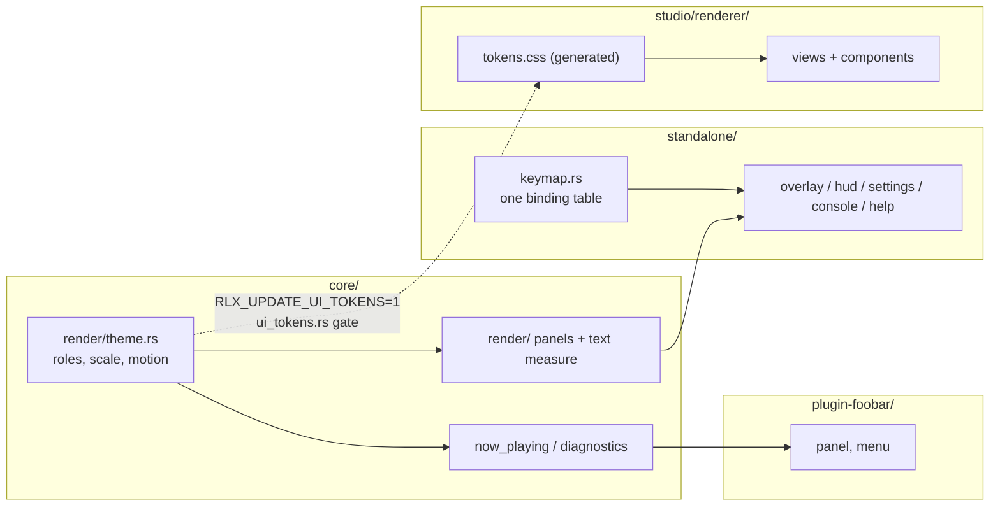

# 0231 — The interface is audited, then learns one look

> **Status:** in-progress
> **Approved:** 2026-09-27 (user). Queued in `tools/conductor/queue.json` 2026-09-28 at the owner's request, for Phases 1-2; the run parks at Phase 3, the `human` audit that re-scopes Phases 8, 9 and 11
> **Created:** 2026-09-27
> **Owner skill(s):** dev, studio-builder, human
> **Related ADRs:** [0252](../adrs/0252-the-interfaces-look-is-declared-once-in-the-core-and-the-studios-stylesheet-is-generated-from-it.md) (proposed),
> [0240](../adrs/0240-a-setting-lives-in-a-file-and-the-menu-edits-that-file.md),
> [0009](../adrs/0009-glyphon-text-rendering.md),
> [0143](../adrs/0143-the-operator-console-is-a-second-surface-and-the-shell-owns-its-meaning.md),
> [0178](../adrs/0178-the-studio-shell-conventions.md)

## TL;DR

The standalone, the studio and the foobar component are hard to learn and look like three different
products. This plan audits all three against a scripted task list, then gives them one look: smooth,
modern-first, with a subtle retro accent. That look is declared once in the core and generated into the
studio's CSS (ADR-0252). The first thing a user sees change is a `?` key that opens a help sheet listing
every binding. The sheet is rendered from the same table the input dispatch reads, so it cannot go stale.
The audit comes first, and it needs instruments before it can run: Phases 1-2 build headless captures of
every UI state, so the audit and the final before/after comparison look at the same frames.

## Context & problem

The owner's request (2026-09-27): *"comprehensive review UI/UX of this application - standalone,
studio, foobar plugin ... not very intuitive, and a bit clanky. I want everything to look smooth but with
a bit of retro look."* The interview settled five things:
- audit, then redesign, in one plan;
- the retro is **subtle and modern-first**: accents only, nothing skeuomorphic;
- every surface is in scope, plus the cross-cutting language;
- the weighting is **discoverability, visual inconsistency, workflow friction**;
- the foobar component's shape is left for the audit to decide.

The owner also declined to embed a font.

What the tree shows today (surveyed 2026-09-27):

- **Standalone.** Proportional text is glyphon on the system sans-serif font
  (`core/src/render/text.rs`). The F3 panel uses a 5x7 bitmap face (`core/src/render/overlay_font.rs`).
  - **No measurement.** `TextLayer` has no measurement call. The browser estimates column width as
    `ROW_SIZE * 0.62` per character and truncates by that guess (`standalone/src/overlay.rs`).
  - **Scattered colours.** Colours are hard-coded constants across `overlay.rs`, `hud.rs` and
    `console.rs`, plus `now_playing.rs` and the diagnostics panel in the core. Two constants are both
    named `HEADER_COLOR` and hold different values.
  - **No motion.** The browser, settings menu, HUD and console appear and vanish in one frame. The
    now-playing banner has the only envelope, and it is linear.
  - **No help.** There is no help surface and no first-run cue. Hotkeys are spread across two per-modal
    match tables, an if-chain and a global match in `standalone/src/input.rs`, so no single place could
    render a list of them.
  - **No backdrops.** The core has no panel primitive, so overlay text floats directly on the scene.
- **Studio.** It is dark-only, with a small `:root` token block in `studio/renderer/styles.css` that no
  other application knows about. It has no transitions at all, uses React with CSS Modules and no
  component library (ADR-0178), and has three views: Editor, Library and Settings.
- **foobar component.** It has a panel, a pop-out window and a right-click menu
  (`plugin-foobar/host_window.cpp`), and no preferences page. The only thing it draws itself is a GDI
  placeholder string; everything else is the core's banner and diagnostics.

There is also no way to look at any of this without running it by hand on a live window. That is why
the audit cannot start before Phases 1-2.

## Decision

Audit first, with instruments. Then land the look as one declared token table in the core, per
ADR-0252. Then restyle and re-flow each surface against the audit's findings.

- The retro accent comes from colour and treatment, not type:
  - a warm accent over cool neutrals;
  - panels with a 1 px lit edge and a faint scanline modulation;
  - one easing curve with a short settle;
  - optionally, the existing 5x7 bitmap face for numeric readouts.

  Phase 3 picks among concrete directions.
- We rejected a hand-applied style guide, because it is today's drift plus a document. We rejected
  shrinking the standalone to a minimal overlay set, because it would take the ADR-0240 settings menu
  away from a standalone-only user. ADR-0252 records both, and the declined font.

**Phases 8, 9 and 11 are written against the findings already visible at drafting and are re-scoped by
Phase 3.** Before any of them runs, the architect amends them from the audit's `## Audit findings`
section and the owner re-approves. That amendment is Phase 3's output, not a formality.

## Architecture diagram



## Implementation phases

Order: `dev` (1), `studio-builder` (2), `human` (3), `dev` (4-9), `studio-builder` (10-11), `human`
(12). Each lane's run is contiguous.

### Phase 1 — Every engine-drawn UI state can be captured headlessly
- **Owner skill:** dev
- **What:** Add `--ui <state>` to the `shot` example. It renders one fixed preset frame with a named UI
  state composed over it and writes a PNG, so the audit and Phase 12's after-shots come from the same
  command.
  - States: `hud`, `browse`, `browse-filtered`, `browse-thumbs`, `settings`, `console`,
    `banner`, `diagnostics`, and `all` (one PNG per state).
  - The state fixtures are fixed data: a fixed preset list, a fixed filter string and a fixed banner
    string.
  - Text uses the machine's system font, so these are captures, never goldens.
- **Files touched:** `standalone/src/shot/args.rs`, `standalone/src/shot/render.rs` (or a new
  `standalone/src/shot/ui.rs`), whatever of `standalone/src/hud.rs` / `overlay.rs` / `console.rs` must
  expose its compose step to a headless target, `docs/capturing.md`.
- **Done when:** `cargo run -p standalone --example shot -- --ui all --size 1920x1080 --out target/ui-audit/1080`
  and the same at `1280x800` each write one PNG per state. Each PNG shows the state's text over the
  scene. The two sizes are the ADR-0037 pair, and the audit needs both. `docs/capturing.md` carries the
  flag.

### Phase 2 — Every studio view can be captured
- **Owner skill:** studio-builder
- **What:** Add `npm run ui-shots` in `studio/`. It launches the studio against a fixture preset,
  walks each view and modal (Library, Editor on each editor tab, Settings, ProblemsModal, ForkPrompt),
  and writes one PNG per state with Electron's `capturePage`.
- **Files touched:** `studio/scripts/ui-shots.mjs` (new), `studio/package.json`, and a fixture under
  `studio/` if none serves.
- **Done when:** `npm run ui-shots` writes one PNG per listed state under
  `studio/target/ui-audit/` (gitignored), at the window's default size and at 1280x800.

### Phase 3 — The audit, and the look is chosen
- **Owner skill:** human
- **What:** The owner walks each application through the task script below, with the architect in the
  session, using the Phase 1-2 captures as the shared reference.
  1. **Findings.** The architect writes the findings into this plan as a new `## Audit findings`
     section. Each finding gets a surface, a task, a severity and the phase that owns it.
  2. **Direction.** The architect prepares two or three concrete retro-modern directions as values for
     ADR-0252's roles, and the owner picks one.
  3. **Amendment.** The architect amends Phases 8, 9 and 11 from the findings, including the foobar
     preferences-page decision, and the owner re-approves.

  The task script:
  - first launch with no config;
  - find and switch to a named preset;
  - filter the browser;
  - mark a favourite and use it;
  - change the quality tier;
  - change the adapter;
  - open the console on a second display;
  - read what the current binding keys are;
  - in the studio: open a preset, edit a param, edit an expression, fork and save, edit the palette,
    read a problem;
  - in foobar: add the panel, pick a preset, open the pop-out, reload presets.
- **Files touched:** this plan (`## Audit findings`, amended Phases 8/9/11).
- **Done when:** the findings section exists with every finding assigned to a phase or explicitly
  declined, the chosen direction's role values are written in it, and the owner has re-approved the
  amended plan.

### Phase 4 — The look is declared once
- **Owner skill:** dev
- **What:** Create `core/src/render/theme.rs` per ADR-0252, holding the Phase 3 direction's values:
  - colour roles;
  - a type scale at a 1080-line reference;
  - spacing, radii;
  - motion durations and one easing function.

  Then:
  - Replace every surface colour constant in `standalone/src/overlay.rs`, `hud.rs`, `console.rs`, and
    in `core/src/render/now_playing.rs` and `core/src/render/overlay.rs`, with a theme role.
  - Generate `studio/renderer/tokens.css` from the table.
  - Add `core/tests/suite/ui_tokens.rs`. It fails when the committed CSS differs from what the table
    generates; `RLX_UPDATE_UI_TOKENS=1` rewrites it.
  - Any golden that includes the banner or diagnostics panel is re-blessed deliberately and named in
    the log.
- **Files touched:** `core/src/render/theme.rs` (new), `core/src/render/mod.rs`,
  `core/src/render/now_playing.rs`, `core/src/render/overlay.rs`, `standalone/src/overlay.rs`,
  `standalone/src/hud.rs`, `standalone/src/console.rs`, `studio/renderer/tokens.css` (new, generated),
  `core/tests/suite/ui_tokens.rs` (new) and its suite registration, `docs/developing.md` (the generated
  file and its variable).
- **Done when:**
  - `git grep -n "_COLOR: \[f32" -- standalone/src core/src/render` finds nothing.
  - Hand-editing one value in `tokens.css` turns `ui_tokens.rs` red, and `RLX_UPDATE_UI_TOKENS=1`
    turns it green again by rewriting the file.
  - `docs/developing.md` names the variable.

### Phase 5 — Overlays sit on panels, and text is measured
- **Owner skill:** dev
- **What:**
  - **Panels.** Add a panel primitive in `core/src/render/`: a rounded rect with theme fill, a 1 px lit
    edge and an optional faint scanline modulation, all from theme roles. All of a frame's panels are
    batched into one draw call, before the text pass. The browser, settings menu, HUD name plate,
    console and now-playing banner draw on panels.
  - **Measurement.** Add a measurement call to `TextLayer` that returns a run's laid-out width. The
    browser's `0.62` per-character estimate is replaced by it.
- **Files touched:** `core/src/render/panel.rs` (new) or an extension of `text.rs`,
  `core/src/render/text.rs`, `core/src/render/now_playing.rs`, `standalone/src/overlay.rs`,
  `standalone/src/hud.rs`, `standalone/src/console.rs`.
- **Done when:**
  - Phase 1's `--ui all` captures show every listed surface on a panel.
  - `git grep -n "0.62" -- standalone/src/overlay.rs` finds nothing.
  - A test holds truncation to a property: for any string and column width, the measured width of the
    truncated result is at most the column width, and an untruncated string fits unchanged. That is a
    property of the call, not of a font, so it holds on any machine's font.

### Phase 6 — Overlays move
- **Owner skill:** dev
- **What:**
  - **Open and close.** Each modal (browser, settings, the Phase 7 help sheet) gets an open/close
    envelope: fade plus a short slide, with duration and easing from the theme.
  - **Other motion.** The browser's selection highlight glides between rows. The HUD crossfades a
    preset-name change. The now-playing banner's linear envelope takes the theme easing.
  - **View-only.** Animation is purely a view of state. A key pressed mid-animation acts on the target
    state at once.
  - **Setting.** The choice lives in `config.toml` as `[ui] motion = "full" | "reduced"` (default
    `full`); `reduced` makes every envelope a step. The settings menu gains the row as an editor of
    that key (ADR-0240).
- **Files touched:** a new `standalone/src/motion.rs`, `standalone/src/overlay.rs`,
  `standalone/src/hud.rs`, `standalone/src/settings.rs`, `standalone/src/config.rs`,
  `core/src/render/now_playing.rs`, `docs/configuration.md`, `docs/running.md`.
- **Done when:**
  - Unit tests hold the envelope to its properties: it is monotone, it reaches its end value at
    exactly the theme duration, and under `reduced` it is a step.
  - A test drives the browser state machine through a key press during an open animation and asserts
    the selection moved on that frame.
  - `docs/configuration.md` carries the key.

### Phase 7 — One binding table, a help sheet, and a hint
- **Owner skill:** dev
- **What:**
  - **One table.** Replace the scattered bindings in `standalone/src/input.rs` with one declarative
    table in `standalone/src/keymap.rs`. Each row holds a key, a modal context, an action, a one-line
    label and a group. Input dispatch reads the table.
  - **Help sheet.** A help sheet, opened by `?` and rendered from the same table, lists every binding
    by group for the current context. `?` is verified free in every context first.
  - **Launch hint.** A launch hint ("? help · Tab browse · S settings") shows for a few seconds on start
    and after the pointer moves over the window. The file key is `[ui] hints = true | false` (default
    `true`), with a settings row as its editor.
- **Files touched:** `standalone/src/keymap.rs` (new), `standalone/src/input.rs`,
  `standalone/src/hud.rs` (the `Modal` enum gains `Help`), `standalone/src/overlay.rs`,
  `standalone/src/settings.rs`, `standalone/src/config.rs`, `docs/running.md`, `README.md` (Controls),
  `docs/configuration.md`.
- **Done when:**
  - A test asserts no two rows in one context share a key.
  - A test asserts every action the dispatcher can emit has a row, so the help sheet is complete by
    construction.
  - `--ui help` is added to Phase 1's state list and captures the sheet.
  - `README.md` and `docs/running.md` name `?`.

### Phase 8 — Standalone workflow fixes (re-scoped by Phase 3)
- **Owner skill:** dev
- **What:** The audit's standalone findings on workflow and discoverability. Candidates visible at
  drafting, to be confirmed or cut by Phase 3:
  - the settings menu grouped into sections, with each row's current value and its file key shown;
  - an empty-filter and a no-match state in the browser;
  - a visible cue when the input goes away;
  - marks given a filter of their own in the browser.
- **Files touched:** set by Phase 3's amendment.
- **Done when:** set by Phase 3's amendment. Each finding it owns is visible in a Phase 1 capture or
  held by a test.

### Phase 9 — The foobar component (re-scoped by Phase 3)
- **Owner skill:** dev
- **What:** The audit's foobar findings. Visible at drafting:
  - the right-click menu is reordered and grouped (presets first, then view, then maintenance);
  - the GDI placeholder takes the theme's neutral and accent (hand-copied values, noted as outside
    ADR-0252's gate);
  - Phase 3 decides whether a preferences page exists. If it does, it is an editor of the plugin's
    `config.toml` keys, per ADR-0240.
- **Files touched:** `plugin-foobar/host_window.cpp`, `plugin-foobar/foo_ritmolux.cpp`, and more if
  Phase 3 adds a page. Also `docs/configuration.md` if keys are added.
- **Done when:** set by Phase 3's amendment. At minimum, the menu order matches the amendment and the
  plugin builds under `plugin-foobar/build.ps1` in CI's `foobar` job.

### Phase 10 — The studio takes the tokens, and moves
- **Owner skill:** studio-builder
- **What:**
  - **Tokens.** `styles.css` drops its hand-written `:root` block and imports the generated
    `tokens.css`. Every CSS Module colour, spacing and radius that duplicates a token reads the token
    instead.
  - **Motion.** Transitions use the motion tokens: view changes, modal open and close, hover and focus.
    `prefers-reduced-motion` is honoured. The studio's own choice lives in `settings.json` as
    `ui.reducedMotion` (default `false`), with a Settings view row as its editor.
  - **Retro treatment.** Panels get the same lit edge and faint scanline as Phase 5's primitive, in
    CSS.
- **Files touched:** `studio/renderer/styles.css`, `studio/renderer/**/*.module.css`, the studio
  settings schema and Settings view, `docs/configuration.md`.
- **Done when:**
  - `git grep -n "#[0-9a-fA-F]\{3,6\}" -- "studio/renderer/*.css"` finds hex colours only in the
    generated `tokens.css`.
  - `npm run ui-shots` captures show the Phase 3 direction.
  - The studio's typecheck, lint and tests are green.
  - `docs/configuration.md` carries `ui.reducedMotion`.

### Phase 11 — Studio workflow fixes (re-scoped by Phase 3)
- **Owner skill:** studio-builder
- **What:** The audit's studio findings on workflow and discoverability. Candidates visible at
  drafting:
  - a shortcut sheet matching the standalone's `?`;
  - empty states for the Library and the ProblemsModal;
  - the fork-on-first-touch prompt made legible before the first edit rather than on it.
- **Files touched:** set by Phase 3's amendment.
- **Done when:** set by Phase 3's amendment. Each finding it owns is visible in a Phase 2 capture or
  held by a vitest.

### Phase 12 — Before and after, judged on devices
- **Owner skill:** human
- **Blocks merge:** no
- **What:** Re-run Phases 1-2's captures, set them beside Phase 3's, and walk the Phase 3 task script
  again on Windows, Linux and, where available, macOS, including the foobar panel on Windows.
  Record which findings are resolved.
- **Files touched:** none in the repository. The verdict goes to the owner's close notes, and a
  regression is a new backlog entry.
- **Done when:** every Phase 3 finding is marked resolved, partly resolved or regressed by the owner.

## Data shapes

```rust
// illustrative - not the final interface
pub struct Theme {
    pub bg: Rgba, pub panel: Rgba, pub panel_edge: Rgba,
    pub text: Rgba, pub text_dim: Rgba,
    pub accent: Rgba, pub accent_glow: Rgba, pub highlight: Rgba,
    pub warn: Rgba, pub error: Rgba, pub favourite: Rgba,
    pub type_scale: [f32; 5],   // px at a 1080-line target, scaled by target height
    pub space: [f32; 5],        // px steps, same reference
    pub radius: f32,
    pub motion_short_ms: u32, pub motion_long_ms: u32,
    pub ease: Ease,             // one named curve, also emitted as a CSS cubic-bezier
}
pub const THEME: Theme = /* Phase 3's chosen direction */;

pub struct Binding { key: Key, ctx: Ctx, action: Action, label: &'static str, group: Group }
pub const KEYMAP: &[Binding] = &[ /* ... */ ];
```

## Risks & open questions

- **System fonts make every capture machine-specific.** Captures are for looking at, never goldens,
  and Phase 5's truncation test is a property for this reason (ADR-0071).
- **Panel cost on an iGPU.** One batched draw per frame is the design. If Phase 5 lands more than
  that, the F3 panel is where it shows: compare frame time with overlays open and closed against the
  NFR 16.7 ms budget on the Arch box. There is no threshold here, because none has been earned.
- **Type scale versus the aspect rule.** The scale is keyed to target *height*, never to an internal
  grid (ADR-0037). Phase 1's 1280x800 capture is where a mistake would show.
- **`?` is Shift+/ on US layouts** and lands elsewhere on others. winit's logical key is the one to
  match. Phase 7 checks that it is not also bound to something else on a non-US layout.
- **The audit may out-scope the plan.** If Phase 3 finds more than Phases 8, 9 and 11 can hold, the
  overflow becomes a successor plan, not a longer phase.
- **Studio packaging.** `tokens.css` is a generated file inside `studio/`, so the studio build must not
  depend on cargo. It is committed, which is what makes that true.

## What this plan does NOT do

- **Does not embed a font** (declined; ADR-0252 Alternative D).
- **Does not add a light theme.** The studio is dark-only by design, and so is the audience output.
- **Does not make bindings rebindable.** The keymap table makes that possible later; a rebinding file
  is its own ADR-0240 decision.
- **Does not change the C ABI or the studio control protocol.** A studio finding that needs a new
  message is a feedback note, per ADR-0177.
- **Does not restyle the scenes or presets.** This is the interface around the picture.
- **Does not touch the site** (`site/`), whose look is Starlight's.

## Implementation log

> Written by `dev` — one row per phase as that phase's commit lands, and the close block after the
> last one. **The phases above are the contract; everything here is what happened.**

**Lane:** `plan-0231-the-interface-is-audited-then-learns-one-look`, worktree `/home/igor/Work/rlx-plan-0231`

| phase | owner | state | commit |
|---|---|---|---|
| 1 — Engine UI captures | dev | done | committed with this row |
| 2 — Studio captures | studio-builder | not started | |
| 3 — Audit and direction | human | not started | |
| 4 — The look declared once | dev | not started | |
| 5 — Panels and measured text | dev | not started | |
| 6 — Overlays move | dev | not started | |
| 7 — Binding table, help, hint | dev | not started | |
| 8 — Standalone workflow fixes | dev | not started | |
| 9 — foobar component | dev | not started | |
| 10 — Studio tokens and motion | studio-builder | not started | |
| 11 — Studio workflow fixes | studio-builder | not started | |
| 12 — Before and after on devices | human | not started | |

### Notes

- Phase 1, files outside its list. The `shot` example cannot reach binary modules, so
  `overlay.rs`, `settings.rs` and `console.rs` moved from the `ritmolux` binary into the `standalone`
  library at the same paths (`standalone/src/lib.rs`, `standalone/src/main.rs` re-imports them at
  the root). That also touched `settings.rs`, `settings/tests.rs` and `console/tests.rs`
  (`standalone::` paths to `crate::`), made `console::route` non-test-only because `hud.rs`'s tests
  call it across the crate boundary, and moved the one console test that needs the binary's
  `director` (`the_staged_name_is_the_one_the_rotation_then_takes`) into `director/tests.rs`.
- Phase 1, what was factored out. `hud.rs`'s line-building moved into pure library functions that
  both the app and `shot --ui` call: `overlay::{corner_lines, capture_verdict_line, settings_lines,
  browse_lines, pane_lines, browse_row_style}` and `console::standing_lines`. The name-plate
  constants, `mark_suffix` and `next_rotation_line` moved from `hud.rs` to `overlay.rs` with them.
  The fixtures and the composition are `standalone/src/shot/ui.rs`. The flag itself is parsed in
  `standalone/examples/shot.rs`, which is also not in the file list.
- Phase 1, approximations. The `console` state draws the console's lines over the full-frame scene,
  where the real console shows a letterboxed preview. The `browse-thumbs` still is the scene frame
  itself, shrunk to 160x90. The scene is `Nebula` unless `--preset` is given. `docs/capturing.md`
  records all three.

### Close triggers

## Followups (after this lands)
