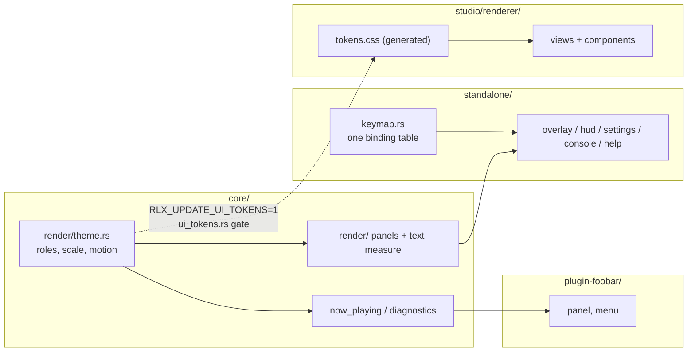

# 0231 — The interface is audited, then learns one look

> **Status:** in-progress
> **Approved:** 2026-09-27 (user). Queued in `tools/conductor/queue.json` 2026-09-28 at the owner's request, for Phases 1-2; the run parks at Phase 3, the `human` audit that re-scopes Phases 8, 9 and 11
> **Created:** 2026-09-27
> **Owner skill(s):** dev, studio-builder, human
> **Related ADRs:** [0252](../adrs/0252-the-interfaces-look-is-declared-once-in-the-core-and-the-studios-stylesheet-is-generated-from-it.md) (proposed),
> [0256](../adrs/0256-a-parameter-declares-its-group-and-whether-it-is-main.md) (proposed, from the audit),
> [0240](../adrs/0240-a-setting-lives-in-a-file-and-the-menu-edits-that-file.md),
> [0009](../adrs/0009-glyphon-text-rendering.md),
> [0143](../adrs/0143-the-operator-console-is-a-second-surface-and-the-shell-owns-its-meaning.md),
> [0178](../adrs/0178-the-studio-shell-conventions.md)

## TL;DR

The standalone, the studio and the foobar component are hard to learn and look like three different
products. This plan audits all three against a scripted task list, then gives them one look: smooth,
modern-first, with a subtle retro accent. That look is declared once in the core and generated into the
studio's CSS (ADR-0252). The first thing a user sees change is a `?` key that opens a help sheet listing
every binding. The sheet is rendered from the same table the input dispatch reads, so it cannot go stale.
The audit comes first, and it needs instruments before it can run: Phases 1-2 build headless captures of
every UI state, so the audit and the final before/after comparison look at the same frames.

## Context & problem

The owner's request (2026-09-27): *"comprehensive review UI/UX of this application - standalone,
studio, foobar plugin ... not very intuitive, and a bit clanky. I want everything to look smooth but with
a bit of retro look."* The interview settled five things:
- audit, then redesign, in one plan;
- the retro is **subtle and modern-first**: accents only, nothing skeuomorphic;
- every surface is in scope, plus the cross-cutting language;
- the weighting is **discoverability, visual inconsistency, workflow friction**;
- the foobar component's shape is left for the audit to decide.

The owner also declined to embed a font.

What the tree shows today (surveyed 2026-09-27):

- **Standalone.** Proportional text is glyphon on the system sans-serif font
  (`core/src/render/text.rs`). The F3 panel uses a 5x7 bitmap face (`core/src/render/overlay_font.rs`).
  - **No measurement.** `TextLayer` has no measurement call. The browser estimates column width as
    `ROW_SIZE * 0.62` per character and truncates by that guess (`standalone/src/overlay.rs`).
  - **Scattered colours.** Colours are hard-coded constants across `overlay.rs`, `hud.rs` and
    `console.rs`, plus `now_playing.rs` and the diagnostics panel in the core. Two constants are both
    named `HEADER_COLOR` and hold different values.
  - **No motion.** The browser, settings menu, HUD and console appear and vanish in one frame. The
    now-playing banner has the only envelope, and it is linear.
  - **No help.** There is no help surface and no first-run cue. Hotkeys are spread across two per-modal
    match tables, an if-chain and a global match in `standalone/src/input.rs`, so no single place could
    render a list of them.
  - **No backdrops.** The core has no panel primitive, so overlay text floats directly on the scene.
- **Studio.** It is dark-only, with a small `:root` token block in `studio/renderer/styles.css` that no
  other application knows about. It has no transitions at all, uses React with CSS Modules and no
  component library (ADR-0178), and has three views: Editor, Library and Settings.
- **foobar component.** It has a panel, a pop-out window and a right-click menu
  (`plugin-foobar/host_window.cpp`), and no preferences page. The only thing it draws itself is a GDI
  placeholder string; everything else is the core's banner and diagnostics.

There is also no way to look at any of this without running it by hand on a live window. That is why
the audit cannot start before Phases 1-2.

## Decision

Audit first, with instruments. Then land the look as one declared token table in the core, per
ADR-0252. Then restyle and re-flow each surface against the audit's findings.

- The retro accent comes from colour and treatment, not type:
  - a warm accent over cool neutrals;
  - panels with a 1 px lit edge and a faint scanline modulation;
  - one easing curve with a short settle;
  - optionally, the existing 5x7 bitmap face for numeric readouts.

  Phase 3 picks among concrete directions.
- We rejected a hand-applied style guide, because it is today's drift plus a document. We rejected
  shrinking the standalone to a minimal overlay set, because it would take the ADR-0240 settings menu
  away from a standalone-only user. ADR-0252 records both, and the declined font.

**Phases 8, 9 and 11 are written against the findings already visible at drafting and are re-scoped by
Phase 3.** Before any of them runs, the architect amends them from the audit's `## Audit findings`
section and the owner re-approves. That amendment is Phase 3's output, not a formality.

## Architecture diagram



## Audit findings

Phase 3, 2026-09-30. The owner walked the standalone (a first launch from an empty data folder) and the
studio live, on the Arch box, with the Phase 1-2 captures (`target/ui-audit/`) as the shared reference.
An architect session proposed findings from the captures, and the owner confirmed, rejected or added
to them. The owner's own words are quoted.

| # | Surface | Task | Finding | Severity | Owner phase |
|---|---|---|---|---|---|
| F1 | standalone | browse, settings | *"when settings or list of presets are opened - it is hard to see on light background. it needs some form of semi transparent box behind"*. The same in the captures: the browser's second column vanishes over a bright figure. | major | 5 |
| F2 | studio | edit a parameter | *"a lot of parameters all on display all the time ... derive main ones and hide secondary under some accordions"*. The owner chose both halves: the parameters a preset binds on top, the rest in engine-declared groups, collapsed (ADR-0256). | major | 8 (engine), 11 (studio) |
| F3 | standalone | find a preset | Names are cut off by a width guess ("Iris Bloom Kale...", "Star Mandala Bo...") with room to spare. Confirmed by the owner. | minor | 5 |
| F4 | standalone | first launch, read the keys | Nothing on screen says `Tab`, `S` or `C` exist; the only hint is inside the browser once open. Confirmed by the owner. | minor | 7 |

**Declined by the owner**, who found the standalone's workflow *"fine"*, and raised nothing further in
the studio:

- Phase 8's drafted standalone candidates: settings sections with file keys, an empty-filter state, an
  input-gone cue, and a marks filter.
- Phase 11's drafted studio candidates: a shortcut sheet, Library and Problems empty states, and a fork
  prompt shown before the first edit.
- Six studio observations from the captures that the owner did not raise: full absolute paths, the
  permanent problem banner, tiny low-contrast labels and truncated expressions, settings pushing the
  preview down, raw TOML names on the Structure tab, and engineer-speak in the status bar. Look A's
  type scale and contrast (Phase 10) touch some of them, and none is a phase's done-when.

**Deferred:** the foobar2000 half of the task script (add the panel, pick a preset, the pop-out,
reload). It needs Windows. So Phase 9 carries only the theme's values, and **the preferences-page
question is declined for this plan** rather than decided without a walk.

### The chosen direction: A, Amber phosphor

Chosen by the owner from three drawn directions (`target/ui-audit/looks.png`: A Amber phosphor, B Cyan
terminal, C Coral dusk), each shown as the same browser panel over the same bright scene. As values for
ADR-0252's roles:

| Role | Value |
|---|---|
| `panel` | `#11141a`, alpha 0.92 over the scene |
| `panel_edge` | `accent` at alpha 0.43, 1 px |
| `scanline` | black at alpha 0.06, every 4th line of a panel |
| `text` | `#ece8e1` |
| `text_dim` | `#a7acb5` |
| `accent` | `#ffb454` |
| `highlight` | `accent` at alpha 0.13 fill, with a 4 px `accent` bar at the row's left edge |
| motion | one curve for every panel's open and close: 180 ms, ease-out with a short settle |

## Implementation phases

Order: `dev` (1), `studio-builder` (2), `human` (3), `dev` (4-9), `studio-builder` (10-11), `human`
(12). Each lane's run is contiguous.

### Phase 1 — Every engine-drawn UI state can be captured headlessly
- **Owner skill:** dev
- **What:** Add `--ui <state>` to the `shot` example. It renders one fixed preset frame with a named UI
  state composed over it and writes a PNG, so the audit and Phase 12's after-shots come from the same
  command.
  - States: `hud`, `browse`, `browse-filtered`, `browse-thumbs`, `settings`, `console`,
    `banner`, `diagnostics`, and `all` (one PNG per state).
  - The state fixtures are fixed data: a fixed preset list, a fixed filter string and a fixed banner
    string.
  - Text uses the machine's system font, so these are captures, never goldens.
- **Files touched:** `standalone/src/shot/args.rs`, `standalone/src/shot/render.rs` (or a new
  `standalone/src/shot/ui.rs`), whatever of `standalone/src/hud.rs` / `overlay.rs` / `console.rs` must
  expose its compose step to a headless target, `docs/capturing.md`.
- **Done when:** `cargo run -p standalone --example shot -- --ui all --size 1920x1080 --out target/ui-audit/1080`
  and the same at `1280x800` each write one PNG per state. Each PNG shows the state's text over the
  scene. The two sizes are the ADR-0037 pair, and the audit needs both. `docs/capturing.md` carries the
  flag.

### Phase 2 — Every studio view can be captured
- **Owner skill:** studio-builder
- **What:** Add `npm run ui-shots` in `studio/`. It launches the studio against a fixture preset,
  walks each view and modal (Library, Editor on each editor tab, Settings, ProblemsModal, ForkPrompt),
  and writes one PNG per state with Electron's `capturePage`.
- **Files touched:** `studio/scripts/ui-shots.mjs` (new), `studio/package.json`, and a fixture under
  `studio/` if none serves.
- **Done when:** `npm run ui-shots` writes one PNG per listed state under
  `studio/target/ui-audit/` (gitignored), at the window's default size and at 1280x800.

### Phase 3 — The audit, and the look is chosen
- **Owner skill:** human
- **What:** The owner walks each application through the task script below, with the architect in the
  session, using the Phase 1-2 captures as the shared reference.
  1. **Findings.** The architect writes the findings into this plan as a new `## Audit findings`
     section. Each finding gets a surface, a task, a severity and the phase that owns it.
  2. **Direction.** The architect prepares two or three concrete retro-modern directions as values for
     ADR-0252's roles, and the owner picks one.
  3. **Amendment.** The architect amends Phases 8, 9 and 11 from the findings, including the foobar
     preferences-page decision, and the owner re-approves.

  The task script:
  - first launch with no config;
  - find and switch to a named preset;
  - filter the browser;
  - mark a favourite and use it;
  - change the quality tier;
  - change the adapter;
  - open the console on a second display;
  - read what the current binding keys are;
  - in the studio: open a preset, edit a param, edit an expression, fork and save, edit the palette,
    read a problem;
  - in foobar: add the panel, pick a preset, open the pop-out, reload presets.
- **Files touched:** this plan (`## Audit findings`, amended Phases 8/9/11).
- **Done when:** the findings section exists with every finding assigned to a phase or explicitly
  declined, the chosen direction's role values are written in it, and the owner has re-approved the
  amended plan.

### Phase 4 — The look is declared once
- **Owner skill:** dev
- **What:** Create `core/src/render/theme.rs` per ADR-0252, holding the Phase 3 direction's values:
  - colour roles;
  - a type scale at a 1080-line reference;
  - spacing, radii;
  - motion durations and one easing function.

  Then:
  - Replace every surface colour constant in `standalone/src/overlay.rs`, `hud.rs`, `console.rs`, and
    in `core/src/render/now_playing.rs` and `core/src/render/overlay.rs`, with a theme role.
  - Generate `studio/renderer/tokens.css` from the table.
  - Add `core/tests/suite/ui_tokens.rs`. It fails when the committed CSS differs from what the table
    generates; `RLX_UPDATE_UI_TOKENS=1` rewrites it.
  - Any golden that includes the banner or diagnostics panel is re-blessed deliberately and named in
    the log.
- **Files touched:** `core/src/render/theme.rs` (new), `core/src/render/mod.rs`,
  `core/src/render/now_playing.rs`, `core/src/render/overlay.rs`, `standalone/src/overlay.rs`,
  `standalone/src/hud.rs`, `standalone/src/console.rs`, `studio/renderer/tokens.css` (new, generated),
  `core/tests/suite/ui_tokens.rs` (new) and its suite registration, `docs/developing.md` (the generated
  file and its variable).
- **Done when:**
  - `git grep -n "_COLOR: \[f32" -- standalone/src core/src/render` finds nothing.
  - Hand-editing one value in `tokens.css` turns `ui_tokens.rs` red, and `RLX_UPDATE_UI_TOKENS=1`
    turns it green again by rewriting the file.
  - `docs/developing.md` names the variable.

### Phase 5 — Overlays sit on panels, and text is measured
- **Owner skill:** dev
- **What:**
  - **Panels.** Add a panel primitive in `core/src/render/`: a rounded rect with theme fill, a 1 px lit
    edge and an optional faint scanline modulation, all from theme roles. All of a frame's panels are
    batched into one draw call, before the text pass. The browser, settings menu, HUD name plate,
    console and now-playing banner draw on panels.
  - **Measurement.** Add a measurement call to `TextLayer` that returns a run's laid-out width. The
    browser's `0.62` per-character estimate is replaced by it.
- **Files touched:** `core/src/render/panel.rs` (new) or an extension of `text.rs`,
  `core/src/render/text.rs`, `core/src/render/now_playing.rs`, `standalone/src/overlay.rs`,
  `standalone/src/hud.rs`, `standalone/src/console.rs`.
- **Done when:**
  - Phase 1's `--ui all` captures show every listed surface on a panel.
  - `git grep -n "0.62" -- standalone/src/overlay.rs` finds nothing.
  - A test holds truncation to a property: for any string and column width, the measured width of the
    truncated result is at most the column width, and an untruncated string fits unchanged. That is a
    property of the call, not of a font, so it holds on any machine's font.

### Phase 6 — Overlays move
- **Owner skill:** dev
- **What:**
  - **Open and close.** Each modal (browser, settings, the Phase 7 help sheet) gets an open/close
    envelope: fade plus a short slide, with duration and easing from the theme.
  - **Other motion.** The browser's selection highlight glides between rows. The HUD crossfades a
    preset-name change. The now-playing banner's linear envelope takes the theme easing.
  - **View-only.** Animation is purely a view of state. A key pressed mid-animation acts on the target
    state at once.
  - **Setting.** The choice lives in `config.toml` as `[ui] motion = "full" | "reduced"` (default
    `full`); `reduced` makes every envelope a step. The settings menu gains the row as an editor of
    that key (ADR-0240).
- **Files touched:** a new `standalone/src/motion.rs`, `standalone/src/overlay.rs`,
  `standalone/src/hud.rs`, `standalone/src/settings.rs`, `standalone/src/config.rs`,
  `core/src/render/now_playing.rs`, `docs/configuration.md`, `docs/running.md`.
- **Done when:**
  - Unit tests hold the envelope to its properties: it is monotone, it reaches its end value at
    exactly the theme duration, and under `reduced` it is a step.
  - A test drives the browser state machine through a key press during an open animation and asserts
    the selection moved on that frame.
  - `docs/configuration.md` carries the key.

### Phase 7 — One binding table, a help sheet, and a hint
- **Owner skill:** dev
- **What:**
  - **One table.** Replace the scattered bindings in `standalone/src/input.rs` with one declarative
    table in `standalone/src/keymap.rs`. Each row holds a key, a modal context, an action, a one-line
    label and a group. Input dispatch reads the table.
  - **Help sheet.** A help sheet, opened by `?` and rendered from the same table, lists every binding
    by group for the current context. `?` is verified free in every context first.
  - **Launch hint.** A launch hint ("? help · Tab browse · S settings") shows for a few seconds on start
    and after the pointer moves over the window. The file key is `[ui] hints = true | false` (default
    `true`), with a settings row as its editor.
- **Files touched:** `standalone/src/keymap.rs` (new), `standalone/src/input.rs`,
  `standalone/src/hud.rs` (the `Modal` enum gains `Help`), `standalone/src/overlay.rs`,
  `standalone/src/settings.rs`, `standalone/src/config.rs`, `docs/running.md`, `README.md` (Controls),
  `docs/configuration.md`.
- **Done when:**
  - A test asserts no two rows in one context share a key.
  - A test asserts every action the dispatcher can emit has a row, so the help sheet is complete by
    construction.
  - `--ui help` is added to Phase 1's state list and captures the sheet.
  - `README.md` and `docs/running.md` name `?`.

### Phase 8 — Each parameter declares its group and whether it is main (F2, engine half)
- **Owner skill:** dev
- **Amended by Phase 3 (2026-09-30).** The owner found the standalone's workflow fine, so the drafted
  candidates are declined; this phase carries the engine half of F2 instead (ADR-0256).
- **What:** `ParamSpec` in `core/src/render/scenes/mod.rs` gains `group` (`Shape`, `Motion`,
  `Colour`, `Light`, `Post`) and `main` (a boolean), both required. Every scene's declarations and the
  engine-wide stages' declarations state both. `ritmolux --schema` exports them, and
  `docs/specs/player-schema.json` and `docs/specs/0003-studio-control-protocol.md` record the widened
  shape. The generated parameter reference in `presets/README.md` prints each parameter's group,
  regenerated with `RLX_UPDATE_PARAM_REFERENCE=1`.
- **Files touched:** `core/src/render/scenes/mod.rs`, every scene's parameter declarations under
  `core/src/render/scenes/**`, `core/src/render/{background,trails,kaleidoscope,bloom,tonemap,ink}.rs`,
  `core/src/render/post.rs`, the schema export in `standalone/src/`, `docs/specs/player-schema.json`,
  `docs/specs/0003-studio-control-protocol.md`, `presets/README.md` (regenerated).
- **Done when:** the workspace compiles, which proves every declaration states both fields; a test
  asserts every system has at least one `main` parameter; `ritmolux --schema` output carries `group`
  and `main` for every parameter, asserted by a test over the export; and the parameter-reference and
  preset-schema gates pass on the regenerated files.

### Phase 9 — The foobar component takes the look (deferred audit)
- **Owner skill:** dev
- **Amended by Phase 3 (2026-09-30).** The foobar half of the audit was deferred, because it needs
  Windows. So this phase carries the look and nothing the audit did not see. The menu reorder and the
  preferences page are **declined for this plan**.
- **What:** The GDI placeholder takes look A's `panel` and `accent`, as hand-copied values with a
  comment naming them as outside ADR-0252's gate. The banner and diagnostics the core draws follow the
  theme through Phase 4 with no plugin change.
- **Files touched:** `plugin-foobar/host_window.cpp`.
- **Done when:** the placeholder's colours match look A's table, and the plugin builds in CI's `foobar`
  job.

### Phase 10 — The studio takes the tokens, and moves
- **Owner skill:** studio-builder
- **What:**
  - **Tokens.** `styles.css` drops its hand-written `:root` block and imports the generated
    `tokens.css`. Every CSS Module colour, spacing and radius that duplicates a token reads the token
    instead.
  - **Motion.** Transitions use the motion tokens: view changes, modal open and close, hover and focus.
    `prefers-reduced-motion` is honoured. The studio's own choice lives in `settings.json` as
    `ui.reducedMotion` (default `false`), with a Settings view row as its editor.
  - **Retro treatment.** Panels get the same lit edge and faint scanline as Phase 5's primitive, in
    CSS.
- **Files touched:** `studio/renderer/styles.css`, `studio/renderer/**/*.module.css`, the studio
  settings schema and Settings view, `docs/configuration.md`.
- **Done when:**
  - `git grep -n "#[0-9a-fA-F]\{3,6\}" -- "studio/renderer/*.css"` finds hex colours only in the
    generated `tokens.css`.
  - `npm run ui-shots` captures show the Phase 3 direction.
  - The studio's typecheck, lint and tests are green.
  - `docs/configuration.md` carries `ui.reducedMotion`.

### Phase 11 — The parameter panel shows the bound ones first, and groups the rest (F2, studio half)
- **Owner skill:** studio-builder
- **Amended by Phase 3 (2026-09-30).** The drafted candidates are declined; this phase carries the
  studio half of F2 (ADR-0256).
- **What:** The Parameters tab lists the parameters the preset binds first, always open. Below them,
  every unbound parameter sits in a collapsed accordion per `group` from the schema, in the order
  Shape, Motion, Colour, Light, Post, each headed with its count. Expanding a group shows its `main`
  rows first. A group's open or closed state is momentary view state and owes no settings key
  (ADR-0240). Binding a parameter moves its row up into the bound list.
- **Files touched:** the Parameters view and its components under `studio/renderer/`, the schema type
  in `studio/shared/`, and their vitests.
- **Done when:** a vitest renders a preset binding three parameters and asserts exactly those three
  appear above the groups, and that every other parameter sits in a collapsed group matching its
  schema `group`; a second asserts expanding a group lists its `main` rows first; `npm run ui-shots`
  shows the Parameters tab in the new layout; the studio's typecheck, lint and tests pass.

### Phase 12 — Before and after, judged on devices
- **Owner skill:** human
- **Blocks merge:** no
- **What:** Re-run Phases 1-2's captures, set them beside Phase 3's, and walk the Phase 3 task script
  again on Windows, Linux and, where available, macOS, including the foobar panel on Windows.
  Record which findings are resolved.
- **Files touched:** none in the repository. The verdict goes to the owner's close notes, and a
  regression is a new backlog entry.
- **Done when:** every Phase 3 finding is marked resolved, partly resolved or regressed by the owner.

## Data shapes

```rust
// illustrative - not the final interface
pub struct Theme {
    pub bg: Rgba, pub panel: Rgba, pub panel_edge: Rgba,
    pub text: Rgba, pub text_dim: Rgba,
    pub accent: Rgba, pub accent_glow: Rgba, pub highlight: Rgba,
    pub warn: Rgba, pub error: Rgba, pub favourite: Rgba,
    pub type_scale: [f32; 5],   // px at a 1080-line target, scaled by target height
    pub space: [f32; 5],        // px steps, same reference
    pub radius: f32,
    pub motion_short_ms: u32, pub motion_long_ms: u32,
    pub ease: Ease,             // one named curve, also emitted as a CSS cubic-bezier
}
pub const THEME: Theme = /* Phase 3's chosen direction */;

pub struct Binding { key: Key, ctx: Ctx, action: Action, label: &'static str, group: Group }
pub const KEYMAP: &[Binding] = &[ /* ... */ ];
```

## Risks & open questions

- **System fonts make every capture machine-specific.** Captures are for looking at, never goldens,
  and Phase 5's truncation test is a property for this reason (ADR-0071).
- **Panel cost on an iGPU.** One batched draw per frame is the design. If Phase 5 lands more than
  that, the F3 panel is where it shows: compare frame time with overlays open and closed against the
  NFR 16.7 ms budget on the Arch box. There is no threshold here, because none has been earned.
- **Type scale versus the aspect rule.** The scale is keyed to target *height*, never to an internal
  grid (ADR-0037). Phase 1's 1280x800 capture is where a mistake would show.
- **`?` is Shift+/ on US layouts** and lands elsewhere on others. winit's logical key is the one to
  match. Phase 7 checks that it is not also bound to something else on a non-US layout.
- **The audit may out-scope the plan.** If Phase 3 finds more than Phases 8, 9 and 11 can hold, the
  overflow becomes a successor plan, not a longer phase.
- **Studio packaging.** `tokens.css` is a generated file inside `studio/`, so the studio build must not
  depend on cargo. It is committed, which is what makes that true.

## What this plan does NOT do

- **Does not embed a font** (declined; ADR-0252 Alternative D).
- **Does not add a light theme.** The studio is dark-only by design, and so is the audience output.
- **Does not make bindings rebindable.** The keymap table makes that possible later; a rebinding file
  is its own ADR-0240 decision.
- **Does not change the C ABI or the studio control protocol.** A studio finding that needs a new
  message is a feedback note, per ADR-0177.
- **Does not restyle the scenes or presets.** This is the interface around the picture.
- **Does not touch the site** (`site/`), whose look is Starlight's.

## Implementation log

> Written by `dev` — one row per phase as that phase's commit lands, and the close block after the
> last one. **The phases above are the contract; everything here is what happened.**

**Lane:** `plan-0231-the-interface-is-audited-then-learns-one-look`, worktree `/home/igor/Work/rlx-plan-0231`

| phase | owner | state | commit |
|---|---|---|---|
| 1 — Engine UI captures | dev | done | 21f261cb |
| 2 — Studio captures | studio-builder | done | 98e4d4e7 |
| 3 — Audit and direction | human | done | 9907f1b5 |
| 4 — The look declared once | dev | done | 6202a083 |
| 5 — Panels and measured text | dev | done | 4d82db06 |
| 6 — Overlays move | dev | done | 697fafc4 |
| 7 — Binding table, help, hint | dev | done | fb237a6c |
| 8 — Parameter group and main (F2, engine) | dev | done | d9ddfe12 |
| 9 — foobar component takes the look | dev | done | b548dedc |
| 10 — Studio tokens and motion | studio-builder | done | 7a4996aa |
| 11 — Bound first, the rest grouped (F2, studio) | studio-builder | done | cfc7ed95 |
| 12 — Before and after on devices | human | not started | |

### Notes

- **Phase 3, 2026-09-30.** The owner walked the standalone and the studio live and chose look A;
  the findings, the role values and the amended Phases 8, 9 and 11 are in `## Audit findings` and the
  phase blocks (`4cc141b6` on main, merged here). **The owner re-approved the amended plan on
  2026-09-30.** The foobar walk is deferred. The lane was brought up to main (`5c081bee`), resolving
  the one conflict in `standalone/examples/shot.rs` and `docs/capturing.md` by keeping both the
  lane's `--ui` and main's `--bar-grid`.

- Phase 1, files outside its list. The `shot` example cannot reach binary modules, so
  `overlay.rs`, `settings.rs` and `console.rs` moved from the `ritmolux` binary into the `standalone`
  library at the same paths (`standalone/src/lib.rs`, `standalone/src/main.rs` re-imports them at
  the root). That also touched `settings.rs`, `settings/tests.rs` and `console/tests.rs`
  (`standalone::` paths to `crate::`), made `console::route` non-test-only because `hud.rs`'s tests
  call it across the crate boundary, and moved the one console test that needs the binary's
  `director` (`the_staged_name_is_the_one_the_rotation_then_takes`) into `director/tests.rs`.
- Phase 1, what was factored out. `hud.rs`'s line-building moved into pure library functions that
  both the app and `shot --ui` call: `overlay::{corner_lines, capture_verdict_line, settings_lines,
  browse_lines, pane_lines, browse_row_style}` and `console::standing_lines`. The name-plate
  constants, `mark_suffix` and `next_rotation_line` moved from `hud.rs` to `overlay.rs` with them.
  The fixtures and the composition are `standalone/src/shot/ui.rs`. The flag itself is parsed in
  `standalone/examples/shot.rs`, which is also not in the file list.
- Phase 1, approximations. The `console` state draws the console's lines over the full-frame scene,
  where the real console shows a letterboxed preview. The `browse-thumbs` still is the scene frame
  itself, shrunk to 160x90. The scene is `Nebula` unless `--preset` is given. `docs/capturing.md`
  records all three.
- Phase 2, shape. `studio/scripts/ui-shots.mjs` runs twice: under Node it lays out scratch and
  relaunches itself under Electron, where it loads the built `dist/main/index.cjs` unchanged and
  walks the window with `executeJavaScript` and `capturePage`. Nothing under `studio/electron/`
  changed. It puts the studio's name and version back on `app` (Electron reports its own when the
  entry has no `package.json` beside it). States: `editor-parameters`, `editor-structure`,
  `editor-palette`, `editor-file`, `library` (an editor tab), `settings`, `problems`,
  `fork-prompt`, under `studio/target/ui-audit/default/` and `.../1280x800/`.
- Phase 2, fixture. No committed fixture: the scratch preset directory is a copy of
  `presets/curve_phosphor.toml` plus two broken presets the script writes (a parse error and an
  unknown parameter), which is what makes the problems button and modal reachable. Settings,
  `RLX_PRESET_DIR` and `XDG_DATA_HOME` (`APPDATA` on Windows) all point into scratch.
- Phase 2, what it took on this machine (Arch, Hyprland). The player runs **windowless** by default
  (`--mode windowed` opts back in), so no show window opens on the desktop. The window's size is
  pinned (min = max) before it first maps, or the tiling manager resized it mid-walk. Under Wayland
  Electron is started with `--ozone-platform=x11`: a surface the compositor is not showing gets no
  frame callbacks, and `capturePage` then returned the previous state's frame, one step behind.
  Each capture also waits for two animation frames after the step. Runs on Windows and macOS are
  unmeasured. Also touched outside the list: `studio/README.md` (the command's paragraph).
- Phase 4, roles beyond look A's table: `bg`, `text_faint`, `favourite`, `good`, `info`, `warn`,
  `error` and `trough` carry values chosen in this session, not by the owner (the diagnostics
  panel's meters and the favourite row need them). The type scale and spacing steps are the sizes
  the surfaces already used; nothing reads them yet.
- Phase 4, colour encoding. Theme values are sRGB-encoded; the diagnostics panel's quad pass takes
  `Color::linear()`, since its shader writes onto the `*Srgb` surface. Its old constants were linear
  values, so its panel and meters moved to the theme's colours.
- Phase 4, done-when. `RLX_UPDATE_UI_TOKENS=1` was **not run**: the conductor's allowlist refuses that
  prefix. A hand edit of `--accent` turned `ui_tokens::the_studio_tokens_are_what_the_theme_declares`
  red, and the file was restored by hand. No golden includes the banner or the diagnostics panel,
  so none was re-blessed.
- Phase 5, shape. The panel pass is `core/src/render/panel.rs`, owned by `TextLayer`: one
  instanced draw per surface, recorded before the shell's picture and the glyphs. A backdrop
  travels as a `console::Line` with `backdrop: Some((w, h))`, so routing and console scaling carry
  it with its text. `TextMeasure`/`fit_width` in `text.rs` measure and truncate; the browser row is
  three pieces at fixed offsets (`NAME_X`, `FAMILY_X`) rather than space-padded text.
- Phase 5, files outside the list: `core/src/render/{mod.rs, composite.rs, aux_target.rs}` (the
  renderer API, the pass order, the console surface's panels), `standalone/src/shot/ui.rs`,
  `standalone/examples/shot.rs` and `standalone/src/overlay/tests.rs`.
- Phase 5, not done: the diagnostics capture line has no backdrop (not in the phase's surface list).
  The settings rows still pad `label` with spaces, which is ragged in a proportional font.
- Phase 5, the property test is `render::text::tests::a_fitted_string_never_measures_wider_than_asked_on_the_system_font`.
  Captures were checked at both sizes under `target/ui-audit/after-1080/` and `after-1280/`.
- Phase 6, shape. The glide needed a drawn highlight, so the core panel gained
  `PanelKind::Highlight` (look A's `highlight` fill and 4 px accent bar), drawn in the same
  instanced pass. `console::Line::backdrop` became a `Backdrop { w, h, kind }`. The banner's
  reduced-motion step reaches the core through `Renderer::set_reduced_motion`.
- Phase 6, a fix outside the phase's scope: `theme::Ease::at` wobbled down by one `f32` ulp near the
  end of the curve, which the monotone test caught. It now bisects in `f64` and reads the height at
  the lower bound.
- Phase 6, done-when as tested. The "reaches its end at exactly the duration" test asserts the value
  is the target from the duration on and short of it at 0.9 of it. The curve's flat tail rounds to
  1.0 in `f32` a little before the duration, so "short of it just before" is not asserted.
- Phase 6, files outside the list: `core/src/render/{panel.rs, mod.rs, theme.rs}`,
  `standalone/src/{app_state.rs, lib.rs, console.rs, stream.rs, shot/ui.rs}`,
  `standalone/examples/shot.rs`, `standalone/src/motion/tests.rs` and the view fixtures in
  `settings/tests.rs` and `console/tests.rs`.
- Phase 7, shape. `keymap.rs` is a library module (`standalone::keymap`), because the `shot --ui help`
  capture draws the sheet from it. A row carries a *set* of keys plus a `shown` spelling ("1-9",
  "Enter" for both Enter keys), not a single key. Typing in the browser is a key-less `Action::Filter`
  row, so the sheet lists it and the completeness test covers it. `?` is matched by the character the
  layout types, not by a physical key. Help is `Modal::Help` over the menu it was opened from, which
  stays open underneath. `favourite_slot` and the repeat rule moved into the table.
- Phase 7, `?` in the browser. It was a filter character; now it opens help there. A test asserts
  that no shipped preset name contains `?`, and that `?` is bound exactly once in each context.
  Non-US layouts were not tried on a machine; the test feeds a `?` from a different physical key.
- Phase 7, files outside the list: `standalone/src/{lib.rs, app_state.rs, run.rs (the show window's
  pointer-move arm), motion.rs (the hint's envelope), stream.rs, shot/ui.rs, keymap/tests.rs}`, the
  view fixtures in `settings/tests.rs` and `console/tests.rs`, and `docs/capturing.md` (the `help`
  state).
- Phase 8, the judgement. Every declaration's `group` and `main` were set in one pass: a scratch
  script (not committed) wrote the fields from a per-file name table, so the choices are readable as
  a block in each diff. `main` is true on a few of each system's own declarations. The shared blocks in
  `scenes/common.rs` declare `hue` (colour) and `brightness` (light) as main, so every system that
  shares them has a main parameter through them as well. The engine stages follow the ADR: `post`,
  except `exposure` and `bg_bright`, which are `light`. Each stage's leading amount (`trails`,
  `bloom_amount`, `kaleido_order`, `ink_amount`, `bg_hue`, `bg_bright`, `exposure`) is main.
- Phase 8, shape. The export writes `group` and `main` **before** `kind`, because
  `preset.rs`'s reference/schema agreement test reads a parameter object as closing on
  `"kind":"structural"}`. The reference table's `Group` column is **last** (`shape`, or
  `shape, main`), so the two tests that read its first four cells by index are unchanged. The
  per-system editor hover files do not print the group.
- Phase 8, files outside the list: `core/src/preset/schema/export.rs` (the export itself),
  `core/tests/suite/preset.rs` (the reference renderer) and `core/tests/suite/preset_schema.rs` (the
  two new tests). The schema export lives in `core`, not `standalone/src/`; `ritmolux --schema`
  prints it unchanged. The studio's vitests pass on the widened `docs/specs/player-schema.json`.
- Phase 9, done-when not met in this session: the plugin was **not built**. It needs MSVC and the
  foobar2000 SDK, and this lane ran on Linux, so "builds in CI's `foobar` job" is owed to that job.
  The placeholder fills with `panel`'s colour at full opacity (GDI has no scene to blend over) and
  draws its text in `accent`. The stock black brush remains the fallback if the brush cannot be
  created.
- Phase 10, shape. `styles.css` `@import`s `tokens.css` and derives only from it: `--control-edge`
  (the `trough` role) for control borders and dividers, so the amber lit edge (`panel-edge`) is on
  panels only; `--control-radius` (half the theme radius); `--scanlines`, a repeating gradient laid
  over every panel's fill at the theme's pitch. The selected Library row and the open tab take
  `highlight` plus an accent bar, as the standalone's browser does. Motion is two keyframes
  (`rlx-enter`, `rlx-fade`) on the theme's `--motion-*` and `--ease`: a tab's pane, the Settings
  panel, a banner, the problems modal and the fork prompt play them on mount; controls transition
  colour and border. `ui.reducedMotion` or `prefers-reduced-motion` zeroes the two duration tokens,
  so every one becomes a step.
- Phase 10, the setting. `ui.reducedMotion` travels on a new OS channel, `app:set-reduced-motion`,
  beside `app:set-player-mode`; it is applied at once as `data-motion` on the root, after the file
  took it. `main.ts`'s settings became session state that each setter replaces, so a second write
  in one session keeps the first. The two hard-coded hex values left in the modules (the preview's
  `#000` letterbox, the system picker's dark text on `warn`) now read `bg`.
- Phase 10, done-when. `npm run ui-shots -- --player target/debug/ritmolux` captured all 16
  states; they show look A. The walk's 800 ms settle is longer than the 320 ms motion, so the
  captures are of settled states. Files outside the list: `studio/electron/{main.ts,
  ipc/appHandlers.ts, preload/api/app.ts, settings.test.ts}`, `studio/shared/ipc-channels.ts`,
  `studio/renderer/{App.tsx, App.test.tsx, views/Settings.test.tsx}` and `studio/README.md` (the
  settings table, held to `StudioSettings` by `settings.doc.test.ts`).
- Phase 11, shape. The roster headings (the system's name, each stage's) are gone: the bound list and
  the groups each draw from the system's roster and the stages together. A group is a native
  `<details>`, so its open state lives in the element. A row the family on screen does not read stays
  in the trailing `not read on <family>` group **even when bound**, as before, rather than in the
  bound list. `ParamRow` gained a `data-param` attribute, which the tests read.
- Phase 11, schema. `group` and `main` are required in `studio/shared/schema.ts` (ADR-0256: reject a
  schema without them), so a player built before Phase 8 now fails the schema with
  `group Required`. The lane's `target/release/ritmolux` predated Phase 8 and failed
  `fields`/`grammar`/`templates.test.ts` that way; it was rebuilt (`cargo build --release -p
  standalone --bin ritmolux`) and the suite passed. Files outside the list:
  `studio/electron/player/schema.test.ts`, `studio/renderer/views/Editor.test.tsx` (fixtures).

### Close triggers

- `presets/`: `presets/README.md` only (regenerated, Phase 8); no `.toml` touched.
- Plan header carries no `**Closes:**` entries.
- Shipped: features in the standalone (theme, panels, motion, keymap, help sheet, hint, `[ui]` keys),
  the core (theme, panel pass, text measurement, `group`/`main` in the schema), the foobar
  placeholder colours and the studio (tokens, motion, `ui.reducedMotion`, grouped parameter panel).
- Operator docs moved on the lane: `README.md`, `docs/capturing.md`, `docs/configuration.md`,
  `docs/developing.md`, `docs/running.md`, `docs/specs/0003-studio-control-protocol.md`,
  `docs/specs/player-schema.json`, `presets/README.md`, `studio/README.md`.
- `node scripts/check-backlog-claims.mjs`: exit 0, 50 reductions across 24 live entries, 4
  unprobeable; no entry named.
- Full suite: owed to the conductor's pre-review gate (ADR-0207). The studio's typecheck, lint and
  vitest (311 tests) ran at Phase 11's tip.
- Not verified on this lane: Phase 9's plugin build (needs CI's `foobar` job on Windows).
- `human` phases remaining: 12 (before and after on devices; `Blocks merge: no`).

## Followups (after this lands)
