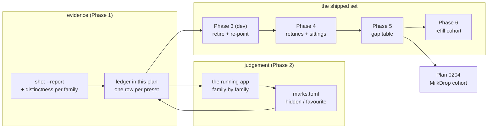

# 0232 — The library is walked, cut and refilled

> **Status:** in-progress
> **Created:** 2026-09-27
> **Approved:** 2026-09-27 (user)
> **Owner skill(s):** human (the `preset-author` lane and the owner), dev
> **Related ADRs:** [0253](../adrs/0253-a-retirement-may-land-ahead-of-its-replacement-when-a-walk-convicts-it.md)
> (proposed), [0089](../adrs/0089-the-library-renews-by-replacement-cohorts.md),
> [0081](../adrs/0081-the-content-lane-lands-presets-and-architect-curates-the-set.md),
> [0227](../adrs/0227-a-borrowed-look-is-authored-natively-and-the-reference-never-enters-the-repository.md),
> [0228](../adrs/0228-a-preset-mark-is-user-state-keyed-by-name-in-its-own-file.md)
> **Takes:** step 2 of design-backlog 0256 (the quality half). It does not close the entry:
> Phase 7 decides whether step 3 is owed. Takes the six standing sittings in
> [`docs/content-brief.md`](../content-brief.md).
> **Sequenced with:** [Plan 0204](0204-the-library-learns-from-the-corpus-it-will-not-ship.md)
> (see Decision).

## TL;DR

This plan reviews the whole shipped preset library once, in this order: a machine-made candidate
sheet, then the owner's walk of the running app, then a cull, then retunes, then a gap brief, then a
first refill cohort. The owner's eye decides every cut. The reports only point at candidates. A cut
may land without a replacement (ADR-0253), as long as no family drops below two presets and two
representatives. The first thing a user sees change is a smaller library with no near-twins in it.
The plan also absorbs the six content sittings that have been open since 2026-08-13, and it hands
Plan 0204's MilkDrop cohort a list of gaps to fill instead of a pile to add to.

## Context & problem

The owner asked for a comprehensive review of the presets: remove duplicates, review what ships,
create more, add MilkDrop looks. Most of that already has an owner somewhere. What nothing owns is
**the review itself**, or the order those pieces run in.

- **The library grew by addition alone.** It has 121 presets on 2026-09-27, against the 41 that
  ADR-0089 was written over. `attractor_*` is 20 of them and `fragment_*` is 14. No preset has left
  under ADR-0089's cohort rule, because that rule only lets one leave once a replacement exists.
- **Backlog 0256 holds the owner's own order**: (1) record the gap, done; (2) **the owner walks the
  shipped library in the app and marks what reads as lame or duplicate**; (3) only then design any
  mechanism. Plan 0209 finished the instrument half, so `distinctness` now reports every system.
  Plan 0205 built the marks the walk records into. **Step 2 has never happened.** The owner's
  `marks.toml` holds one hidden preset and no favourites.
- **Six standing sittings** in `docs/content-brief.md` have been open since 2026-08-13 with nothing
  moved to `Done`: the sky family (1a-1c), the ink re-judge on `ink_gamma`, the attractor binding
  `tuple`, the `occlude` retune with backlog 0038, two families that photograph badly, and the
  figure at frame scale. Each one is a question about a family this walk will look at anyway.
- **Backlog 0248** names four `fragment_field` presets (`Sumi`, `Whorl`, `Supernova`,
  `Neon Tunnel`) where no statistic can tell a composition from a fill. An eye can.
- **Plan 0204** (approved, not started) turns MilkDrop picks into native presets, one cohort at a
  time. Run before a cull, it adds four to six presets to a set nobody has pruned. Run after the
  cull, it can fill a named gap. Shipping converted `.milk` output stays closed. Plan 0100 Phase 8
  still owns that question, and this plan does not reopen it.

Retiring a preset is not a content-only edit here. `core/tests/suite/hygiene.rs` holds every
shipped preset equal to a gallery card in `scripts/docs-shots.mjs` and a committed PNG.
`every_family_carries_at_least_two_representatives` holds the `representative = true` keys. 26
presets are also named in `.rs` files (tests, fixtures, `standalone/src`), with `attractor_leviathan`
in the most. Outside Rust, preset names are carried by about twenty reader docs, scripts and skill
references. So the cut itself is a `dev` phase, executed from the verdicts the walk records.

**"Family" in this plan means a `SystemKind`**, which is how both floor-holding tests group the set.
The filename prefix nearly always matches it, but the test is the authority.

## Decision

We will run the review as **report, then walk, then cut, then retune, then refill**, with the owner's
marks as the only thing that convicts a preset, and retirements allowed ahead of any replacement
under ADR-0253.

The interview settled four choices, and each one rejected an alternative:

- **Shrink, then refill**, rather than holding the count by pairing every cut, or growing and
  cutting only obvious twins. The owner's aim is "ship less but better" (backlog 0256). ADR-0253
  records why strict pairing gets in its way.
- **A report first, then the owner's walk**, rather than a blind walk or the content lane deciding
  with the owner's veto. The report finds duplicates cheaply. Quality has no statistic, so the owner's
  marks decide. The risk this carries is that the shortlist biases the walk; Risks covers it.
- **Plan 0204 is kept and sequenced, not folded in and not widened.** Its Phases 1-2 (references and
  routing, both outside the repo or in its own table) may run at any time. Its **Phase 2 cohort is
  chosen against this plan's Phase 5 gap table**, and its **Phase 3 lands after this plan's
  Phase 3**, so a MilkDrop-inspired preset is never judged against a twin that is about to be cut.
- **The six standing sittings are absorbed.** Each one becomes a row in the walk, where it is
  answered or retired with a reason. `content-brief.md` empties into `Done`.

## Architecture diagram

## Implementation phases

Six of the seven phases are `human`, meaning the `preset-author` lane working with the owner, as
in Plan 0204 and `content-brief.md`. A conductor run parks at Phase 1, which is correct.

**This plan's `human` phases may write to the `## The ledger` and `## Gaps` sections below.** This
is the same scoped exception Plan 0204 made for its routing table: the ledger is this plan's
working surface, and nowhere else fits it better.

### Phase 1 — The candidate sheet

- **Owner skill:** human
- **What:** Produce the evidence the walk reads: one ledger row per shipped preset, carrying every
  machine flag and no verdict.
- **Files touched:** this plan (`## The ledger`). Contact sheets and report output go under
  `target/`, uncommitted.
- **Done when:**
  - `## The ledger` has exactly one row per file `ls presets/*.toml` lists at the start of the phase.
  - Each row carries, **copied from the tools and not judged**:
    - its family;
    - any near-duplicate flag and the partner it names, from
      `cargo run -p standalone --example shot -- --presets presets --report` and from
      `cargo nextest run -p rlx-core --test distinctness --no-capture` (the per-family matrices);
    - the report's reactivity reading;
    - the `anim` and `drive` readings as the report prints them;
    - a frame cost over budget, if the report marks one;
    - the `sanity` NOTE, if the preset is one of backlog 0248's four;
    - any header naming an ADR, plan or backlog entry it works around, from the close-ceremony
      step 3b grep run over **all** presets and read in full.
  - Each of the six content-brief sittings is attached to the family whose walk will answer it.

### Phase 2 — The walk

- **Owner skill:** human
- **What:** The owner walks the running app one family at a time, with the ledger open, and marks
  each preset. This is backlog 0256 step 2.
- **Files touched:** this plan (`## The ledger`). The owner's `marks.toml` is outside the repo.
- **Done when:**
  - Every ledger row carries a verdict: `keep`, `cut` or `retune`. `merge` is written as a `cut`
    that names its survivor.
  - Every `cut` carries one sentence of reason ("near-twin of X, X kept for Y", or "reads as a
    wash at every level, no figure").
  - Every row whose preset is named in a Rust test or in `standalone/src` also names the survivor
    those references move to.
  - For every family, the rows left after the cuts number at least two, and at least two of them
    are marked as its representatives, with any new representative named.
  - Each absorbed sitting carries its answer, or `retired: <reason>`.
  - Backlog 0248's four presets each carry an explicit `composition` or `fill` reading.
  - The walk happened **in the app, with music playing**, not from stills.

### Phase 3 — The cull

- **Owner skill:** dev
- **What:** Retire every `cut` row exactly as the ledger says: delete the `.toml`, drop its entry
  from `CARDS` in `scripts/docs-shots.mjs`, delete its gallery PNG, move `representative = true` to
  the ledger's named survivor, and re-point every test, fixture and `standalone/src` reference to
  that survivor.
- **Files touched:** wherever a cut name appears, and it is **the grep that decides the list**, not
  this bullet. On 2026-09-27 the carriers are:
  - `presets/*.toml` (deletions, plus `representative` edits on the survivors);
  - `scripts/docs-shots.mjs` (`CARDS`) and `docs/images/gallery/presets/*.png` (deletions);
  - `core/tests/**`, including `core/tests/fixtures/`, and `standalone/src/**`,
    `standalone/tests/**`;
  - the reader docs `presets/README.md` (the hand-written tables; the generated params block is
    regenerated, never edited), `docs/preset-guide.md`, `docs/capturing.md`,
    `docs/preset-palettes.md`, `docs/presets.md`, `docs/on-device-validation.md`, `docs/nfr.md`,
    `docs/testing.md`, `docs/configuration.md`, `docs/diffusion-filter.md` and
    `docs/content-brief.md`;
  - `scripts/softness-sheets.mjs`, `scripts/docs-clip.mjs` and `tools/sd-filter/test_sd_filter.py`;
  - `presets/pending/README.md`;
  - **Not the preset-author skill's references.** A headless session cannot write under the
    skills directory (ADR-0210), and a phase that declares such a path never reaches one. So this
    phase **greps** those references for each cut name, and writes every hit into the log with its
    replacement text; Phase 4 applies them. <!-- claude-allow: Phase 3 only greps the skill references and writes no file there; Phase 4 declares the path and applies the edits --> A skill line that cites a preset as a **historical
    example**, such as the architect skill's step 3b, is a record and stays as written.
  - **Amended 2026-09-30 (architect):** the skill-reference edits moved to Phase 4, because the
    conductor parks a phase whose files include that directory before it runs (`claude_dir`), which
    stalled the whole cull on its smallest part.
- **Done when:**
  - Each family's cuts land as **one commit per family**, and the message lists the ledger rows it
    executes.
  - For every cut name, `git grep -n -w <name>` hits only records and measurements:
    `docs/plans/**`, `docs/adrs/**`, `docs/design-backlog*.md`, `presets/proposed/ROSTER.md`,
    `scripts/bench/results/**` (a dated sweep names what it measured), and the skill-reference lines
    the log hands to Phase 4.
  - `cargo nextest run --workspace` is green, **the full run and not `-P fast`**, because the
    gallery-card hygiene test, the representative floor and the distinctness pair counts all live in
    different binaries.
  - No golden baseline moved. Goldens render frozen fixtures, not shipped presets (ADR-0023), so a
    moved golden is a finding to report, not something to re-bless.
  - A test whose meaning depended on a **specific** cut preset (not just any preset of that family)
    is disclosed in the log with the survivor chosen. `dev` does not weaken an assertion to make the
    survivor pass. That goes back to the owner.

### Phase 4 — The retunes and the sittings

- **Owner skill:** human
- **What:** The content lane retunes every `retune` row, including the sittings that are authoring
  rather than judging (the `tuple` binding, and the `occlude` retune with backlog 0038). Each lands
  through the ADR-0081 route.
- **Files touched:** `presets/*.toml`, their gallery PNGs where the look moved,
  `docs/content-brief.md` (each sitting moves to `Done` with its date and a one-line verdict), and
  `.claude/skills/preset-author/references/systems.md` with any other preset-author reference
  Phase 3's log names, whose recorded replacement text is applied first, before any retune.
- **Done when:**
  - Every `retune` row names its landing commit, or reads `abandoned: <reason>`.
  - Each retuned preset was rendered and looked at in the running app before it was committed.
  - `docs/content-brief.md` has no item left above `## Done`.
  - Presets whose headers work around a fixed defect (the Phase 1 grep) are retuned or carry a
    sentence saying why the workaround stays.

### Phase 5 — The gap brief

- **Owner skill:** human
- **What:** Read the culled and retuned set and name what it lacks. This is the brief the refill,
  and Plan 0204's cohort, author against.
- **Files touched:** this plan (`## Gaps`); Plan 0204's routing table only as far as its own
  Phase 2 allows.
- **Done when:**
  - `## Gaps` lists each gap as a system, a look and one sentence on why the set needs it: a family
    thinned to its floor, a tempo or mood the walk found missing, a palette range nobody covers.
  - Each gap reads `0204` (one of 0204's 21 picks can fill it) or `native` (Phase 6 authors it).
  - A gap that no system can express is a backlog entry with a probe, not a row here, per ADR-0017.

### Phase 6 — The first refill cohort

- **Owner skill:** human
- **What:** Author the `native` gaps as one cohort of four to six new presets under ADR-0089's
  fresh-slate rule, spanning at least two systems. Drafts go through `presets/proposed/` and its
  `ROSTER.md` first, which is that directory's existing route for work awaiting the owner's verdict.
  Only the keeps move into `presets/`.
- **Files touched:** `presets/proposed/` (drafts and roster rows), `presets/*.toml` (the keeps),
  `scripts/docs-shots.mjs` (`CARDS`), and `docs/images/gallery/presets/*.png` (new cards).
- **Done when:**
  - Each new preset passes `cargo nextest run --workspace` (`standalone`'s tests read the shipped set
    too) and carries a gallery card.
  - Each was judged in the running app against the gap it fills.
  - The distinctness report shows **no new near-duplicate flag** pairing a new preset with a
    survivor, or the ledger records that the owner accepted that flag and why.

### Phase 7 — The verdict

- **Owner skill:** human
- **Blocks merge:** no
- **What:** The owner walks the result once more (the refill cohort and the families that lost the
  most) and answers backlog 0256 step 3: **does "ship less, better" need a mechanism**, or was a
  dated walk enough, and how often should it repeat?
- **Files touched:** this plan (the verdict, under `## The ledger`).
- **Done when:** the verdict is written as one of three: a mechanism is owed (then `architect`
  drafts the ADR and plan 0256 step 3 asks for); a periodic walk at a stated cadence is enough (then
  the cadence goes into `content-brief.md` at close); or neither, with the reason. Each part is
  backed by what this walk actually convicted.

## The ledger

_(Filled by Phase 1; verdicts by Phase 2; commits by Phases 3-4. Columns: preset, family, machine
flags, verdict, reason, survivor/representative, commit.)_

**Decided before the walk (owner, 2026-09-27):** `attractor_leviathan` and `fragment_tiledmono`
are `keep`. Phase 1 still gives them rows and flags, and Phase 2 does not re-judge them. A retune
proposal for either goes back to the owner rather than into Phase 4 on its own.

**Phase 1, the candidate sheet, 2026-09-29.** One row per file `ls presets/*.toml` listed at the
start of the phase: **116**. The plan's Context counted 121 on 2026-09-27; the ledger counts what
ships at `66ce9350`. Every value is copied from a tool, and nothing in this table is a verdict.

- **Sources.** `cargo run -p standalone --example shot -- --presets presets --report` (release
  profile, tier floor, on the AMD Radeon RENOIR iGPU through RADV) and
  `cargo nextest run -p rlx-core --test distinctness --no-capture`, both on the Arch box at `66ce9350`.
  Their raw output is under `target/p0232/`, uncommitted.
- **Columns.** `bass/mid/treb/onset` is the report's reactivity reading, and `drive` and `anim`
  are printed as the report prints them. `ms/frame` is the report's headless cost at 1920x1080. It
  carries a `!` past the 16.67 ms budget, and **no preset carries one**. `nearest shape` is the
  closest in-family partner in distinctness's `shape (struct_diff)` matrix, with its distance. The
  report and the test flag a pair `NEAR-DUP` below shape 0.08. `machine flags` names which tool
  raised each flag.
- **Near-duplicates.** Only the attractor family has any. It has six pairs among four presets
  (Lorenz Gallery, Valentine, Butterfly to Knot, Rho Walk). The report prints five of them;
  `Lorenz Gallery ~ Rho Walk` comes from distinctness alone.
- **The `sanity` NOTE** is copied from `each_structure_candidate_is_tabled_against_the_library` in
  `core/tests/sanity.rs`, which names backlog 0248's four presets. That measurement test was not
  run for this sheet.
- **Headers.** The close-ceremony step 3b grep matched 292 lines across the library, and each was
  read. Most cite the ADR or plan a preset was authored under. None cites a live backlog entry. A
  `header:` flag marks the six presets whose header describes a clause built around a named
  decision: five around ADR-0109 and `attractor_dragon` around ADR-0103. Workarounds that later
  plans removed, such as Clifford's reseed gate, Perseids' walls and Cauldron's clock, are
  recorded in their headers as history and are not flagged.

**The six content-brief sittings, attached to the family whose walk answers them:**

| sitting | family | answer (Phase 2) |
|---|---|---|
| §1 The sky family (Perseids' quiet sky, the dusk ground, the galaxy) | emitter (`emitter_perseids`), plus the stale `fragment_vitrail` header it names | retired: Perseids, the sky it names, is cut |
| §2 The ink worlds re-judge on `ink_gamma` | reaction_diffusion (`reaction_etching`), and attractor for `attractor_ink` | to Phase 4 (Etching cut; Ink on Paper kept and re-judged there) |
| §3 The attractor binds `tuple` | attractor | to Phase 4 |
| §4 The `occlude` retune, with backlog 0038 | every family. It is library-wide, and the brief orders it last | to Phase 4, library-wide and last |
| §5 Two families photograph badly | emitter (`emitter_perseids`) and star_pattern (`star_rosewindow`) | half retired: Perseids cut; Rose Window kept, so Phase 4 takes that half |
| §6 The figure at frame scale | shape_field | to Phase 4 |

| preset | family | rep | bass/mid/treb/onset | drive | anim | ms/frame | nearest shape | machine flags | verdict | reason | commit |
|---|---|---|---|---|---|---|---|---|---|---|---|
| `analytic_echoplate` | analytic_field |  | 0.110/0.075/0.000/0.004 | 0.116 | 0.014 | 3.309 | Lace Grid (0.210) |  | keep | | |
| `analytic_juliacircuit` | analytic_field |  | 0.233/0.000/0.000/0.008 | 0.233 | 0.000 | 4.233 | Multibrot (0.207) |  | keep | | |
| `analytic_lacegrid` | analytic_field |  | 0.076/0.000/0.151/0.000 | 0.165 | 0.036 | 4.808 | Seahorse (0.166) |  | retune | abandoned: the owner found it boring at the retune (Phase 4) and chose not to retune it; it ships unchanged. | |
| `analytic_multibrot` | analytic_field |  | 0.061/0.060/0.000/0.000 | 0.092 | 0.021 | 1.737 | Lace Grid (0.184) |  | keep | | |
| `analytic_parabolicdust` | analytic_field |  | 0.287/0.053/0.000/0.000 | 0.281 | 0.006 | 6.147 | Seahorse (0.162) |  | retune | | 12b46290 |
| `analytic_pearlstring` | analytic_field |  | 0.270/0.054/0.000/0.000 | 0.260 | 0.037 | 8.172 | Standing Wave (0.216) |  | retune | | 12b46290 |
| `analytic_ringorbit` | analytic_field |  | 0.418/0.000/0.000/0.000 | 0.418 | 0.000 | 7.909 | Stained Glass (0.240) |  | keep | | |
| `analytic_seahorse` | analytic_field |  | 0.087/0.000/0.000/0.000 | 0.088 | 0.006 | 9.141 | Parabolic Dust (0.162) |  | keep | | |
| `analytic_searchlight` | analytic_field |  | 0.322/0.000/0.000/0.000 | 0.319 | 0.241 | 7.651 | Standing Wave (0.220) |  | cut | Near-twin of Standing Wave, the ledger's nearest shape. | |
| `analytic_stainedglass` | analytic_field | yes | 0.040/0.224/0.000/0.000 | 0.342 | 0.094 | 5.373 | Lace Grid (0.198) |  | retune | | 12b46290 |
| `analytic_standingwave` | analytic_field | yes | 0.193/0.197/0.000/0.000 | 0.195 | 0.009 | 1.855 | Lace Grid (0.203) |  | keep | | |
| `analytic_twobandjulia` | analytic_field |  | 0.121/0.000/0.164/0.000 | 0.156 | 0.000 | 3.004 | Lace Grid (0.181) |  | retune | | 12b46290 |
| `attractor_clifford` | attractor | yes (new) | 0.155/0.112/0.087/0.108 | 0.196 | 0.084 | 10.416 | Thomas (0.184) |  | keep | | |
| `attractor_cliffordgallery` | attractor |  | 0.048/0.000/0.019/0.017 | 0.055 | 0.025 | 2.538 | Thomas (0.154) |  | cut | Content-brief section 3, judged at the Phase 4 sitting: the owner kept Thomas Gallery as a world and cut this one. | 66212420 |
| `attractor_dejonggallery` | attractor |  | 0.053/0.000/0.011/0.013 | 0.055 | 0.030 | 1.343 | Fern Mono (0.142) |  | cut | Near-twin of Fern Mono, the ledger's nearest shape. | |
| `attractor_dragon` | attractor |  | 0.100/0.036/0.062/0.041 | 0.141 | 0.022 | 6.439 | Volute (0.182) | header: ADR-0103: fit holds only at zero rotation, so base `zoom` sits under 1 | keep | | |
| `attractor_fern` | attractor |  | 0.091/0.096/0.029/0.074 | 0.137 | 0.035 | 6.242 | Fern Mono (0.148) |  | cut | Does not follow the music. Its code references move to Fern Mono. | |
| `attractor_fernmono` | attractor |  | 0.037/0.038/0.009/0.010 | 0.056 | 0.026 | 1.190 | Rho Walk (0.125) |  | keep | | |
| `attractor_ink` | attractor |  | 0.089/0.039/0.044/0.013 | 0.103 | 0.053 | 3.985 | De Jong Gallery (0.142) |  | retune | Content-brief section 2, re-judged at the Phase 4 sitting: it bites harder and walks the Thomas roster in 3D; every term that disturbed the cloud went, because with music it read as noise. | f226cbcc |
| `attractor_leviathan` | attractor | yes | 0.135/0.111/0.173/0.075 | 0.182 | 0.069 | 11.929 | Clifford (0.233) |  | keep | | |
| `attractor_lorenzgallery` | attractor |  | 0.045/0.000/0.011/0.030 | 0.054 | 0.040 | 3.896 | Valentine (0.066) | NEAR-DUP ~ Valentine (distinctness+report, shape 0.066); NEAR-DUP ~ Butterfly to Knot (distinctness+report, shape 0.071); NEAR-DUP ~ Rho Walk (distinctness, shape 0.068) | cut | Redundant with a stronger keep in its family. | |
| `attractor_lorenzknot` | attractor |  | 0.103/0.010/0.016/0.000 | 0.107 | 0.008 | 4.012 | Valentine (0.190) |  | keep | | |
| `attractor_thomas` | attractor |  | 0.079/0.016/0.046/0.076 | 0.074 | 0.061 | 1.544 | Thomas Gallery (0.097) | header: ADR-0109: `beat_index` counts detections, not beats | cut | Redundant with a stronger keep in its family. Its code references move to Thomas Gallery. | |
| `attractor_thomasgallery` | attractor |  | 0.020/0.000/0.042/0.114 | 0.090 | 0.125 | 3.235 | Thomas (0.097) |  | keep | Content-brief section 3, judged at the Phase 4 sitting: the owner kept this gallery as a world and cut the Clifford one. | |
| `attractor_thomasred` | attractor |  | 0.042/0.008/0.038/0.000 | 0.032 | 0.045 | 3.672 | Thomas (0.213) |  | retune | | 9b70a9ee |
| `attractor_torusknot` | attractor |  | 0.033/0.003/0.008/0.034 | 0.126 | 0.010 | 3.611 | Valentine (0.127) | header: ADR-0109: `beat_index` counts detections, not beats | cut | Near-twin of Valentine, the ledger's nearest shape. Its code references move to Lorenz Knot. | |
| `attractor_valentine` | attractor |  | 0.026/0.026/0.048/0.023 | 0.034 | 0.043 | 4.525 | Butterfly to Knot (0.059) | NEAR-DUP ~ Lorenz Gallery (distinctness+report, shape 0.066); NEAR-DUP ~ Butterfly to Knot (distinctness+report, shape 0.059); NEAR-DUP ~ Rho Walk (distinctness+report, shape 0.064); header: ADR-0109: `beat_index` counts detections, not beats | cut | Does not follow the music. | |
| `attractor_volute` | attractor |  | 0.048/0.041/0.006/0.021 | 0.065 | 0.010 | 5.179 | Thomas (0.166) |  | cut | Redundant with a stronger keep in its family. | |
| `attractor_walkdejong` | attractor |  | 0.087/0.000/0.022/0.056 | 0.113 | 0.049 | 4.158 | Thomas (0.150) | header: ADR-0109: `beat_index` counts detections, not beats | keep | | |
| `attractor_walkknot` | attractor |  | 0.032/0.003/0.009/0.018 | 0.039 | 0.050 | 4.594 | Rho Walk (0.036) | NEAR-DUP ~ Lorenz Gallery (distinctness+report, shape 0.071); NEAR-DUP ~ Valentine (distinctness+report, shape 0.059); NEAR-DUP ~ Rho Walk (distinctness+report, shape 0.036) | cut | Redundant with a stronger keep in its family. | |
| `attractor_walkrho` | attractor | yes | 0.028/0.002/0.007/0.014 | 0.032 | 0.046 | 3.887 | Butterfly to Knot (0.036) | NEAR-DUP ~ Valentine (distinctness+report, shape 0.064); NEAR-DUP ~ Butterfly to Knot (distinctness+report, shape 0.036); NEAR-DUP ~ Lorenz Gallery (distinctness, shape 0.068) | cut | Near-twin of Butterfly to Knot, the ledger's nearest shape. | |
| `attractor_walkthomas` | attractor |  | 0.034/0.004/0.013/0.040 | 0.074 | 0.020 | 3.016 | Thomas (0.118) |  | keep | | |
| `cellular_ember_life` | cellular | yes | 0.015/0.215/0.000/0.000 | 0.192 | 0.168 | 2.326 | Labyrinth (0.183) |  | keep | | |
| `cellular_labyrinth` | cellular |  | 0.001/0.133/0.001/0.000 | 0.105 | 0.102 | 1.234 | Ember Life (0.183) |  | retune | | 660333c1 |
| `cellular_spiral_bloom` | cellular | yes | 0.000/0.169/0.053/0.000 | 0.274 | 0.148 | 1.624 | Wavefront (0.192) |  | retune | | 660333c1 |
| `cellular_tide_bugs` | cellular |  | 0.381/0.000/0.000/0.000 | 0.360 | 0.058 | 1.273 | Ember Life (0.206) |  | keep | | |
| `cellular_wavefront` | cellular |  | 0.114/0.055/0.110/0.000 | 0.291 | 0.084 | 1.597 | Ember Life (0.187) |  | keep | | |
| `emitter_driftfield` | emitter | yes (new) | 0.021/0.001/0.000/0.000 | 0.019 | 0.004 | 2.759 | Petalfall (0.151) |  | retune | | 9b70a9ee |
| `emitter_emberjet` | emitter |  | 0.044/0.002/0.002/0.000 | 0.059 | 0.006 | 3.448 | Perseids (0.123) |  | cut | Does not follow the music. | |
| `emitter_heartfall` | emitter | yes | 0.016/0.000/0.000/0.085 | 0.130 | 0.073 | 0.926 | Petalfall (0.202) |  | keep | | |
| `emitter_perseids` | emitter | yes | 0.050/0.012/0.000/0.022 | 0.065 | 0.024 | 1.645 | Ember Jet (0.123) |  | cut | Does not follow the music. | |
| `emitter_petalfall` | emitter |  | 0.060/0.001/0.007/0.024 | 0.081 | 0.015 | 3.997 | Drift Field (0.151) |  | cut | Near-twin of Drift Field, the ledger's nearest shape. | |
| `fragment_driftmono` | fragment_field |  | 0.261/0.443/0.153/0.143 | 0.469 | 0.264 | 0.842 | Banded Mandala (0.252) |  | keep | | |
| `fragment_drostemono` | fragment_field |  | 0.328/0.406/0.132/0.218 | 0.459 | 0.382 | 1.170 | Banded Mandala (0.214) |  | keep | | |
| `fragment_etchingplate` | fragment_field |  | 0.093/0.022/0.009/0.000 | 0.106 | 0.027 | 1.372 | Nebula (0.182) |  | keep | | |
| `fragment_interferencemono` | fragment_field |  | 0.182/0.079/0.000/0.023 | 0.234 | 0.043 | 1.850 | Marbled Strata (0.227) |  | keep | Re-judged at the retune (Phase 4): the owner found it right on a second look; the walk had read it as too still. | |
| `fragment_mandala` | fragment_field |  | 0.065/0.124/0.024/0.007 | 0.085 | 0.020 | 4.570 | Nebula (0.183) |  | keep | | |
| `fragment_nebula` | fragment_field |  | 0.190/0.132/0.140/0.099 | 0.212 | 0.059 | 8.628 | Whorl (0.179) |  | keep | | |
| `fragment_strata` | fragment_field |  | 0.141/0.102/0.138/0.026 | 0.167 | 0.071 | 0.885 | Banded Mandala (0.211) |  | keep | | |
| `fragment_sumi` | fragment_field |  | 0.096/0.029/0.047/0.142 | 0.165 | 0.104 | 6.850 | Vitrail (0.169) | sanity NOTE: one of the four groundless luminous fields ADR-0128 leaves open | keep | 0248: the problem is the fill, not the composition. | |
| `fragment_supernova` | fragment_field |  | 0.278/0.308/0.252/0.203 | 0.280 | 0.236 | 3.882 | Banded Mandala (0.199) | sanity NOTE: one of the four groundless luminous fields ADR-0128 leaves open | retune | 0248: the problem is the fill, not the composition. | 41290a0f |
| `fragment_tiled` | fragment_field |  | 0.082/0.099/0.021/0.019 | 0.072 | 0.049 | 4.772 | Banded Mandala (0.256) |  | cut | Near-twin of Banded Mandala, the ledger's nearest shape. Its code references move to Tiled Rosette Mono. | |
| `fragment_tiledmono` | fragment_field | yes | 0.347/0.000/0.119/0.000 | 0.461 | 0.523 | 1.162 | Interference Mono (0.301) |  | keep | | |
| `fragment_tunnel` | fragment_field |  | 0.243/0.017/0.086/0.085 | 0.296 | 0.107 | 6.171 | Vitrail (0.202) | sanity NOTE: one of the four groundless luminous fields ADR-0128 leaves open | retune | 0248: the problem is the fill, not the composition. | 41290a0f |
| `fragment_vitrail` | fragment_field |  | 0.113/0.058/0.062/0.129 | 0.246 | 0.058 | 6.116 | Sumi (0.169) |  | retune | | 41290a0f |
| `fragment_whorl` | fragment_field | yes | 0.254/0.040/0.019/0.048 | 0.295 | 0.084 | 5.113 | Nebula (0.179) | sanity NOTE: one of the four groundless luminous fields ADR-0128 leaves open | keep | 0248: the problem is the fill, not the composition. | |
| `lsystem_bower` | lsystem |  | 0.022/0.031/0.007/0.023 | 0.081 | 0.013 | 3.519 | Coral (0.132) |  | cut | Redundant with a stronger keep in its family. | |
| `lsystem_coral` | lsystem | yes | 0.043/0.035/0.004/0.000 | 0.083 | 0.012 | 3.782 | Bower (0.132) |  | cut | Redundant with a stronger keep in its family. | |
| `lsystem_icecrystal` | lsystem | yes (new) | 0.008/0.104/0.028/0.000 | 0.181 | 0.020 | 3.333 | Bower (0.173) |  | keep | | |
| `lsystem_rime` | lsystem | yes | 0.048/0.004/0.012/0.005 | 0.102 | 0.015 | 3.191 | Sumi Mono (0.218) |  | retune | | e2d90a14 |
| `lsystem_sumimono` | lsystem |  | 0.031/0.012/0.004/0.000 | 0.050 | 0.000 | 1.021 | Bower (0.150) |  | keep | Re-judged at the retune (Phase 4): the owner tried a mirrored tree-and-reflection and asked for the original back, since the look is the tree shape. | |
| `lsystem_vellum` | lsystem |  | 0.160/0.003/0.000/0.004 | 0.184 | 0.029 | 1.208 | Sumi Mono (0.162) |  | cut | Retired by the owner at the retune (Phase 4): too sparse, and a denser retune did not save it. Rime takes the guide card; Sumi Mono takes its README example and softness-sheet slot. | e2d90a14, d7d630c5 |
| `curve_blueprint` | parametric_curve |  | 0.033/0.000/0.000/0.000 | 0.033 | 0.016 | 3.655 | Gyre (0.114) |  | keep | | |
| `curve_broadside` | parametric_curve | yes (new) | 0.086/0.166/0.000/0.023 | 0.206 | 0.129 | 0.708 | Blueprint (0.179) |  | keep | | |
| `curve_cogwheel` | parametric_curve |  | 0.056/0.000/0.007/0.000 | 0.041 | 0.011 | 5.411 | Turnabout (0.159) |  | retune | | 20dfff85 |
| `curve_gyre` | parametric_curve | yes (new) | 0.044/0.015/0.000/0.003 | 0.047 | 0.013 | 5.986 | Blueprint (0.114) |  | keep | | |
| `curve_inkpendulum` | parametric_curve |  | 0.027/0.027/0.000/0.000 | 0.033 | 0.017 | 3.645 | Gyre (0.116) |  | retune | | 20dfff85 |
| `curve_ionwake` | parametric_curve |  | 0.008/0.000/0.003/0.035 | 0.100 | 0.010 | 1.745 | Blueprint (0.114) |  | retune | | 20dfff85 |
| `curve_lacework` | parametric_curve |  | 0.042/0.000/0.001/0.000 | 0.042 | 0.028 | 4.156 | Blueprint (0.174) |  | keep | | |
| `curve_loom` | parametric_curve |  | 0.071/0.045/0.012/0.047 | 0.104 | 0.039 | 3.316 | Turnabout (0.176) |  | cut | Retired by the owner at the retune (Phase 4), after the walk had marked it retune. Its roles move to Broadside: representative, preset-guide card, and the references Nightbloom's cut had sent here. | 20dfff85, 03b87350 |
| `curve_nightbloom` | parametric_curve | yes | 0.071/0.016/0.012/0.006 | 0.091 | 0.023 | 2.500 | Ion Wake (0.160) | header: ADR-0109: `beat_index` counts detections; musical-period retune named as a followup (Plan 0095) | cut | Redundant with a stronger keep in its family. Its code references move to Broadside (Loom, first named, was retired at the retune). | |
| `curve_phosphor` | parametric_curve |  | 0.042/0.048/0.000/0.000 | 0.048 | 0.047 | 5.749 | Blueprint (0.213) |  | keep | | |
| `curve_prismscope` | parametric_curve |  | 0.052/0.040/0.000/0.000 | 0.041 | 0.035 | 4.278 | Blueprint (0.193) |  | keep | | |
| `curve_rosemono` | parametric_curve |  | 0.039/0.000/0.000/0.137 | 0.155 | 0.134 | 1.141 | Lacework (0.186) |  | retune | | 20dfff85 |
| `curve_turnabout` | parametric_curve |  | 0.022/0.007/0.000/0.003 | 0.026 | 0.003 | 4.844 | Cogwheel (0.159) |  | retune | | 20dfff85 |
| `reaction_etching` | reaction_diffusion | yes | 0.053/0.025/0.007/0.006 | 0.059 | 0.081 | 4.368 | Lichen (0.278) |  | cut | Redundant with a stronger keep in its family. Its code references move to Lichen. | |
| `reaction_fluxmono` | reaction_diffusion | yes | 0.352/0.047/0.000/0.237 | 0.168 | 0.430 | 4.658 | Mitosis (0.177) |  | keep | | |
| `reaction_glaciermono` | reaction_diffusion |  | 0.157/0.033/0.000/0.132 | 0.395 | 0.320 | 4.745 | Mitosis (0.236) |  | keep | | |
| `reaction_lichen` | reaction_diffusion | yes (new) | 0.052/0.015/0.008/0.016 | 0.073 | 0.027 | 5.866 | Spot Mono (0.169) |  | keep | | |
| `reaction_mitosis` | reaction_diffusion |  | 0.056/0.028/0.028/0.015 | 0.087 | 0.020 | 5.645 | Flux Mono (0.177) |  | retune | | 1ecc2af7 |
| `reaction_spotmono` | reaction_diffusion |  | 0.039/0.016/0.000/0.000 | 0.046 | 0.024 | 4.443 | Lichen (0.169) |  | retune | | 1ecc2af7 |
| `reaction_verdigris` | reaction_diffusion |  | 0.052/0.014/0.008/0.008 | 0.068 | 0.018 | 6.356 | Flux Mono (0.250) |  | keep | | |
| `collage_mono` | shape_collage | yes | 0.056/0.002/0.000/0.000 | 0.058 | 0.002 | 1.065 | Nocturne (0.240) |  | keep | | |
| `collage_nocturne` | shape_collage |  | 0.055/0.002/0.002/0.029 | 0.065 | 0.016 | 1.755 | Suprematist (0.211) |  | cut | Redundant with a stronger keep in its family. | |
| `collage_onwhite` | shape_collage |  | 0.037/0.002/0.003/0.000 | 0.039 | 0.021 | 1.887 | Suprematist (0.219) |  | retune | | 9b70a9ee |
| `collage_suprematist` | shape_collage | yes | 0.047/0.008/0.002/0.000 | 0.064 | 0.008 | 1.031 | Nocturne (0.211) |  | keep | | |
| `shape_aperture` | shape_field |  | 0.070/0.106/0.030/0.040 | 0.164 | 0.031 | 3.406 | Strata Heart (0.231) |  | keep | | |
| `shape_contourmono` | shape_field | yes | 0.457/0.000/0.467/0.642 | 0.367 | 0.159 | 1.283 | Aperture (0.256) |  | keep | | |
| `shape_facet` | shape_field | yes | 0.110/0.021/0.043/0.122 | 0.125 | 0.038 | 4.503 | Path Lion (0.245) |  | cut | Redundant with a stronger keep in its family. Its code references move to Path Maple. | |
| `shape_heartmono` | shape_field |  | 0.556/0.000/0.359/0.017 | 0.444 | 0.000 | 0.877 | Path Maple (0.243) |  | cut | Redundant with a stronger keep in its family. | |
| `shape_lion` | shape_field |  | 0.167/0.000/0.009/0.000 | 0.169 | 0.000 | 5.746 | Path Maple (0.186) |  | cut | Redundant with a stronger keep in its family. | |
| `shape_maple` | shape_field | yes (new) | 0.175/0.000/0.016/0.000 | 0.180 | 0.000 | 5.847 | Path Lion (0.186) |  | keep | | |
| `shape_pulse` | shape_field |  | 0.343/0.000/0.014/0.000 | 0.341 | 0.017 | 0.758 | Path Maple (0.194) |  | cut | Retired by the owner at the retune (Phase 4) as a duplicate of Strata Heart, one heart as concentric palette bands. Strata Heart takes its guide card. | a1d196e3 |
| `shape_ringmono` | shape_field |  | 0.486/0.000/0.297/0.009 | 0.349 | 0.000 | 1.024 | Aperture (0.285) |  | keep | | |
| `shape_strataheart` | shape_field |  | 0.203/0.041/0.000/0.171 | 0.181 | 0.004 | 3.846 | Path Maple (0.199) |  | keep | Re-judged at the retune (Phase 4): the owner found it a little boring but right as it is, and it takes Pulse's guide card. | |
| `spectrum_anemone` | spectrum | yes (new) | 0.032/0.013/0.005/0.049 | 0.056 | 0.008 | 0.820 | Radial Bloom (0.180) |  | keep | | |
| `spectrum_metermono` | spectrum |  | 0.104/0.055/0.034/0.156 | 0.156 | 0.000 | 0.646 | Radial Bloom (0.101) |  | keep | | |
| `spectrum_radialbloom` | spectrum |  | 0.050/0.081/0.063/0.199 | 0.173 | 0.000 | 2.719 | Meter Mono (0.101) |  | retune | | 9b70a9ee |
| `spectrum_ridge` | spectrum | yes | 0.065/0.038/0.008/0.028 | 0.117 | 0.007 | 3.286 | Radial Bloom (0.126) |  | cut | Redundant with a stronger keep in its family. Its code references move to Skyline. | |
| `spectrum_skyline` | spectrum | yes | 0.040/0.070/0.006/0.088 | 0.114 | 0.002 | 2.834 | Meter Mono (0.194) |  | keep | | |
| `star_corona` | star_pattern | yes | 0.084/0.029/0.039/0.067 | 0.134 | 0.019 | 3.033 | Zellij (0.203) |  | keep | | |
| `star_mandala_bordered` | star_pattern | yes | 0.104/0.097/0.040/0.007 | 0.158 | 0.069 | 1.046 | Zellij (0.190) |  | cut | Redundant with a stronger keep in its family. Its code references move to Rose Window. | |
| `star_rosewindow` | star_pattern | yes (new) | 0.085/0.006/0.009/0.007 | 0.090 | 0.039 | 2.115 | Zellij (0.187) |  | keep | Content-brief section 5, judged in motion at the Phase 4 sitting: it still crops at every edge; a reframe at scale 0.66 was tried and the owner kept it as it is. | |
| `star_zellij` | star_pattern |  | 0.085/0.047/0.057/0.021 | 0.106 | 0.043 | 1.008 | Rose Window (0.187) |  | cut | Redundant with a stronger keep in its family. | |
| `swarm_braid` | swarm | yes (new) | 0.110/0.050/0.010/0.092 | 0.123 | 0.093 | 7.565 | Stipple (0.147) |  | keep | Becomes a swarm representative when Drift is cut at the retune (Phase 4). | |
| `swarm_drift` | swarm | yes | 0.105/0.123/0.007/0.099 | 0.136 | 0.104 | 5.341 | Shatter (0.187) |  | cut | Retired by the owner at the retune (Phase 4): still boring after a retune. Braid becomes a swarm representative and takes its test and docs roles. | c7a5913b |
| `swarm_murmuration` | swarm | yes (new) | 0.055/0.070/0.042/0.060 | 0.128 | 0.105 | 7.007 | Stipple (0.125) |  | keep | | |
| `swarm_shatter` | swarm |  | 0.099/0.064/0.013/0.106 | 0.103 | 0.092 | 4.635 | Braid (0.177) |  | cut | Redundant with a stronger keep in its family. Its code references move to Braid. | |
| `swarm_stipple` | swarm | yes | 0.050/0.013/0.001/0.011 | 0.057 | 0.010 | 3.982 | Murmuration (0.125) |  | cut | Redundant with a stronger keep in its family. | |
| `warp_cauldron` | warp_mesh | yes | 0.033/0.038/0.000/0.031 | 0.100 | 0.027 | 4.001 | Wellhead (0.192) |  | cut | Broken or ugly in the running app. | |
| `warp_ladder` | warp_mesh | yes (new) | 0.067/0.000/0.053/0.688 | 0.560 | 0.593 | 1.612 | Wellhead (0.265) |  | keep | | |
| `warp_millrace` | warp_mesh | yes | 0.018/0.042/0.004/0.014 | 0.097 | 0.027 | 4.286 | Wellhead (0.187) |  | cut | Broken or ugly in the running app. | |
| `warp_sirocco` | warp_mesh |  | 0.015/0.038/0.002/0.012 | 0.097 | 0.038 | 4.153 | Smoke (0.177) |  | retune | | 9641e2ca |
| `warp_smoke` | warp_mesh |  | 0.029/0.009/0.001/0.002 | 0.058 | 0.018 | 2.060 | Sirocco (0.177) |  | retune | | 9641e2ca |
| `warp_tracery` | warp_mesh | yes (new) | 0.041/0.067/0.023/0.181 | 0.167 | 0.112 | 1.734 | Wellhead (0.223) |  | keep | | |
| `warp_wellhead` | warp_mesh |  | 0.021/0.033/0.002/0.012 | 0.117 | 0.038 | 4.079 | Sirocco (0.177) |  | cut | Broken or ugly in the running app. | |

## Gaps

**Approved by the owner 2026-09-30 as drafted by the session that ran Phase 4.** It reads
the set after the cull and the retunes: 81 presets on 14 systems. `fragment_field` 13,
`analytic_field` 11, `parametric_curve` 11, `attractor` 10, `reaction_diffusion` 6, `cellular` 5,
`shape_field` 5, `warp_mesh` 4, `spectrum` 4, `lsystem` 3, `shape_collage` 3, and `emitter`,
`star_pattern` and `swarm` at their floor of two. Three things decide the rows. The first is the
thin families. The second is the verdict the walk and the retunes returned most often: "boring",
with the fixes that worked making a look bolder, faster or more graphic, never softer. The third
is what the owner asked for by name at the retunes: crisp thick lines, black-white-red, and no
kaleidoscope rotation.

| # | system | the look | why the set needs it | route |
|---|---|---|---|---|
| 1 | `emitter` | a burst world: sparks thrown out on each hit, building and dying with the phrase | The family is at its floor, and both survivors are calm: Drift Field drifts, Heartfall arcs. Since Perseids went, nothing in the set answers a drop by throwing light. | `0204` (10 brainlocknrelease, or 14 square-party) |
| 2 | `swarm` | a dense, fast swarm pulsing hard on the beat | The family is at its floor. Braid and Murmuration are both flowing and slow, and the retune that tried to make Drift energetic ended in a cut. | `0204` (16 pulse-permission, or 15 more-waveforms) |
| 3 | `warp_mesh` | a liquid feedback world with warm metallic colour: molten gold or a fire field churning | The family's four are a ladder, wind, smoke and tracery, and none is the churning liquid field MilkDrop is known for. The set also has no warm metallic palette; its warm worlds are ink or dusk. | `0204` (01 molten-gold, 02 fire-field or 19 nuclear) |
| 4 | `parametric_curve` | one dancing ribbon: a single long glowing line that swings with the music over a dark ground | The family's eleven are figures that turn and redraw: roses, gears, pendulums. None is one gestural line whose whole body moves, which is the Dancer idiom. | `0204` (08 nematodes, or 09 isosceles-mashup13) |
| 5 | `star_pattern` | an edge-to-edge Islamic wallpaper: a square or hexagon tiling filling the frame, thick crisp lines, no rotation | The family is at its floor, and both survivors are single rosettes (a 12-order window and a rings-only corona). The system's planar tilings, `square` and `hexagon`, ship unused. The walk's standing ask was crisp thick lines, and a periodic pattern gives them the whole frame. | `native` |
| 6 | `shape_field` | a drop world in black, white and red: nested bands whose count steps every second beat | The §6 sitting found that a band count stepping every second beat reads as a response, and no preset uses it. Nothing in the set is built to hit hard on a loud passage; this does it with bands rather than flashes. | `native` |
| 7 | `lsystem` | a plant that grows: a branching figure drawing itself on over a phrase, then regrowing | Two of the three survivors are ice (Ice Crystal and Rime), and Sumi Mono is a still tree. The system's defining verb, a figure that grows, has no world since the walk. | `native` |

**Not a row, because no system can express it:** a route traced through the maze Labyrinth grows is
backlog 0274, filed at the retune. No other gap in this draft needs engine work.

**What this hands Plan 0204:** rows 1 to 4 name four systems and at least one pick each, which is
more than 0204's Phase 2 needs (four to six picks across at least three systems). The picks not
named here (03-07, 11-13, 17, 18, 20, 21) have no gap behind them, so they would be additions rather
than fills. That is 0204's call to make, and this table does not make it. **What it hands Phase 6:**
rows 5 to 7, three presets on three systems, which is inside that phase's four to six only if one
row takes two presets or the owner adds a row.

## Data shapes

None. No types, parameters or engine surface. A look that needs one is a backlog note to `architect`.

## Risks & open questions

- **The shortlist biases the walk.** A preset the report flags is looked at harder, and a weak one
  it does not flag goes unnoticed. Mitigation: Phase 2 gives **every** row a verdict, not only the
  flagged ones, and a flag is evidence, never a charge.
- **The walk is long.** One evening per family cluster is realistic, not one evening in total.
  Phase 2 may land in family-sized slices. Phase 3 may start a family once that family's rows are
  all judged, provided the lane state records which families are finished.
- **A cut preset anchors a test's meaning.** Re-pointing a test to a survivor can make it pass
  for a different reason. The two heaviest anchors, `attractor_leviathan` (named in 10 files) and
  `fragment_tiledmono` (`boundary_floor`'s anchor in `docs/testing.md`), are pre-decided keeps, so
  they are out of this risk. For any other anchor, Phase 3's last done-when bullet sends the case
  back to the owner, and keeping the anchor preset is a legitimate `keep` with the reason written
  down.
- **An operator loses a favourite on upgrade.** ADR-0253 accepts this. The mark stays in the file
  and does nothing (ADR-0228), so there is no crash and no warning. The release notes for the
  version that closes this plan should list what was retired.
- **Plan 0218 re-blesses goldens and moves hardware tests.** If the two plans run concurrently,
  Phase 3's test re-pointing and 0218's re-bless touch neighbouring files. Phase 3 should not share
  a lane window with 0218 Phase 2.
- **Open:** whether a family that ends at exactly its floor of two should also ship at all. That is
  a question about the system, left to Phase 7 and `architect`, not a cut this plan may make.

## What this plan does NOT do

- **It does not ship converted MilkDrop output** or answer Plan 0100 Phase 8. Plan 0204 remains the
  MilkDrop route, re-authored natively under ADR-0227.
- **It does not build a quality instrument or a similarity threshold.** Phase 7 decides whether one
  is owed. Designing it is a later ADR and plan.
- **It does not retire a system**, and it cuts no family below two presets and two representatives.
- **It does not touch engine Rust** beyond re-pointing references to cut presets. A look the walk
  wants that the surface cannot express goes to the backlog.
- **It does not author Plan 0204's picks.** Phase 5 only tells 0204 which gaps its picks fill.

## Implementation log

> Written by the lane — one row per phase as that phase's commit lands, and the close block after
> the last one. **The phases above are the contract; everything here is what happened.**

**Lane:** `plan-0232-the-library-is-walked-cut-and-refilled`, worktree `/home/igor/Work/rlx-plan-0232`

| phase | owner | state | commit |
|---|---|---|---|
| 1 — The candidate sheet | human | done | `29994a84` |
| 2 — The walk | human | done | `cbf4d37b`, `3adf77d6` |
| 3 — The cull | dev | done | `bcdd5892` (last of the family commits listed in Notes) |
| 4 — The retunes and the sittings | human | done | many, one per family: see Notes |
| 5 — The gap brief | human | done | 2619581b |
| 6 — The first refill cohort | human | done | committed with this row |
| 7 — The verdict | human | not started | |

### Notes

- **Phase 3 commits, one per family**, oldest first: analytic_field `7b6ea80a`, shape_collage
  `5bb65a53`, fragment_field `306d823a` (+ `e1a551d3`), reaction_diffusion `44761aea`, lsystem
  `ad4f8351`, spectrum `b748c7f3`, parametric_curve `33b2ee96`, star_pattern `0254edaa`, shape_field
  `b54e4032`, swarm `d6728725`, emitter `0d6b23ab`, warp_mesh `195c5603`, attractor `bcdd5892`;
  plus `8a4cf6fb`. The ledger's `commit` column is left empty: it is not `dev`'s to write.
- **Two coverage floors moved in `core/tests/sanity.rs`**, because `MAX_FLOOR_SLACK` convicted
  them once a cut removed the family minimum: `FragmentField` 0.08 -> 0.21 (Drift Mono 0.4274) in
  its own commit `e1a551d3`, after the fragment_field commit, and `Swarm` 0.33 -> 0.37 (Braid
  0.7403) inside the swarm commit.
- **`8a4cf6fb` changes a guard outside the plan's carrier list**: `preset_schema.rs`'s two walks
  asserted `files.len() >= 100`, and the library is 86. The bound is now `EMBEDDED.len()`.
- **Four gallery slots were re-pointed and re-rendered** with new alt text in `docs/preset-guide.md`:
  parametric_curve -> `curve_loom`, swarm -> `swarm_braid`, emitter -> `emitter_heartfall`, warp_mesh
  -> `warp_tracery`. The ledger names no survivor for Perseids or Wellhead, so the emitter and
  warp_mesh picks are `dev`'s; all four are marked UNJUDGED in the manifest.
- **Tests re-pointed to a survivor:** `core/tests/attractor.rs` `FLOW_3D` `Thomas` -> `Thomas
  Gallery`, a roster-stepping gallery captured at frame 90, inside its first step;
  `standalone/src/shot/horizon/tests.rs`'s label `Etching` -> `Lichen`. **Not re-pointed:**
  `standalone/src/shot/report/tests.rs` keeps `Star Mandala Bordered` and `Tiled Rosette` as synthetic
  long and colliding names (they build rows by hand, and `Rose Window` would not exercise the
  fitter); `curves/tests.rs` keeps Nightbloom's `d` values 29/37/43, with only the comment changed.
- **Where the ledger says Fern's and Facet's references move to Fern Mono and Path Maple**, the Rust
  hits were measurement records taken on those presets (`particles/mod.rs`, `particles/tests.rs`,
  `marks/tests.rs`, `suite/preset.rs`). They now describe the retired preset or state the number
  without a file, rather than attribute the measurement to the survivor.
- **Display names of cut presets remain** in dated measurement comments (`sanity.rs` floor tables,
  `animation.rs`, `geometry_extent.rs`, the `capturing.md` horizon timings) and in a few survivor
  headers. The done-when grep is on stems.
- **`docs/content-brief.md`** records each retirement in §1, §2, §3 and §5. No item moved to
  `Done`; that is Phase 4's.
- **Phase 4 ran in one owner sitting on 2026-09-30.** Every retune was loaded into a running
  player on its own preset directory, edited live and judged by the owner before it landed; each
  row's `commit` cell names its landing. Retirements at the retune: Loom (`20dfff85`, `03b87350`),
  Vellum (`e2d90a14`, `d7d630c5`), Pulse (`a1d196e3`), Drift (`c7a5913b`), Clifford Gallery
  (`66212420`). Two of those split across commits because a staged `git rm` rode into the
  preceding commit. Kept on re-judging: Interference Mono, Sumi Mono, Strata Heart; Lace Grid
  abandoned as boring.
- **Guards moved in Phase 4:** `sanity.rs`'s `ShapeCollage` coverage floor 0.13 -> 0.027 (On White
  cut to five-to-seven forms by the owner, 0.0556); `preset_check.rs`'s corpus-walk floor 100 ->
  50; `render/tests.rs`'s capture test `Drift` -> `Braid`; `attractor.rs`'s `MAP_2D` `Ink on
  Paper` -> `De Jong Walk`, because Ink on Paper moved to the Thomas family.
- **Content brief:** all six sittings are in `Done`. Section 4 was closed by the owner as
  answered by the walk; backlog 0038 is still live on `main` and wants archiving at the close.
  Section 6's strobe probes no longer existed and were rebuilt from Strata Heart. The Phase 1
  workaround check: Dragon's header already said why its clause stays, and Walk De Jong's now does.
- **Skill-reference hits for Phase 4** (`git grep -n -w <stem> -- .claude`), with replacement text:
  - `.claude/skills/architect/SKILL.md:650` (`emitter_perseids.toml:7`) — a step 3b historical
    example; stays as written.
  - `.claude/skills/preset-author/SKILL.md:388` — `(`swarm_shatter`: no trend across ten minutes)` ->
    `(Shatter, since retired: no trend across ten minutes)`.
  - `.claude/skills/preset-author/SKILL.md:467` — `(`spectrum_ridge` comes out as two straight lines`
    -> `(a polyline spectrum comes out as two straight lines`.
  - `.claude/skills/preset-author/references/craft.md:169-170` — `Shipped headers that record the
    choice: `presets/attractor_lorenzgallery.toml` ("over 1.0 deliberately") and
    `presets/attractor_clifford.toml` (...)` -> `A shipped header that records the choice:
    `presets/attractor_clifford.toml` (only the densest filaments cross it).`
  - `.claude/skills/preset-author/references/grammar.md:104-105` — `Shipped examples: `star_corona`,
    `star_mandala_bordered`, `star_zellij`.` -> `Shipped examples: `star_corona` (rings only) and
    `star_rosewindow` (interlace only).`
  - `.claude/skills/preset-author/references/systems.md:116` — `(`lsystem_bower`'s `F =
    "F[+F]F[-F]F"`)` -> `(`lsystem_icecrystal`'s `F = "FF-[-F+F+F]+[+F-F-F]"`)`.
  - `.claude/skills/preset-author/references/systems.md:144-145` — `Shipped: `star_corona` and
    `star_mandala_bordered` (rings only), `star_zellij` (rings plus an 8-fold interlace).` ->
    `Shipped: `star_corona` (rings only); no shipped world is a composite since Zellij (rings plus an
    8-fold interlace) was retired.`
  - `.claude/skills/preset-author/references/systems.md:173` — `(`attractor_fern`,
    `attractor_dragon` ship)` -> `(`attractor_fernmono`, `attractor_dragon` ship)`.
  - `.claude/skills/preset-author/references/systems.md:294-296` — `emitter_perseids.toml` puts its
    crest off-frame deliberately; `emitter_emberjet.toml` is the inverse — ...` -> `v = 2.6, g = 1.3
    from the default source crests off frame at y = 1.48, which avoids the ceiling;
    `emitter_heartfall.toml` keeps its crest in frame at y ≈ 0.88 (v = 2.3, g = 1.3, source_y =
    -1.15), so the room sees the hearts turn over.`
  - Display names of cut presets also appear there (`systems.md:481,485,493` name Searchlight) and are
    not listed above.
- **Checks run this session:** `cargo fmt --all --check`, `cargo clippy --workspace --all-targets
  -- -D warnings`, `cargo nextest run --workspace -P fast` (1784 run, one failure fixed by
  `8a4cf6fb`, which then passed with `hygiene::`), and the `sanity`, `reactivity`, `animation`,
  `distinctness`, `golden` and `attractor` binaries (all pass; `git status` showed no golden baseline
  moved). The full `cargo nextest run --workspace` the done-when names was not run here; the
  conductor's pre-review gate runs it.

- **Phase 6, 2026-10-01** (an agent session in the `preset-author` lane, judged by the owner in the
  running app). Main was merged into the lane first (`604e306d`). The conflicts were two comment-only
  overlay edits, where main's version was taken, and the `CARDS` list, which keeps main's `plexus`
  cards and drops `reaction_etching`, a preset Phase 3 cut. That merge brought main's five `plexus`
  presets into a set the walk never saw, so the 81-presets-on-14-systems count in `## Gaps` predates
  them.
  - **The cohort is four presets on three systems**: Interlace and Red Paper (gap 5,
    `star_pattern`), Target (gap 6, `shape_field`) and Thicket (gap 7, `lsystem`). A first pass of
    four drafts (`50e58a33`) was binned by the owner as a set. A second pass of nine variants, three
    per gap, was judged the same way, cycled in a fixed order, and these four were kept.
  - **Gap 5 departs from its row's wording.** A `star_pattern` draws one rosette at the frame's
    centre, so an edge-to-edge wall needs `kaleido_tile`. It mirrors frame-shaped cells, so a round
    figure leaves seams at the cell walls. The owner judged two fixes, one fitting each figure inside
    its cell and one dropping the tiling, and kept the seamed originals.
  - **Two keeps were retuned for the gates after the owner's verdict, and the owner re-judged both.**
    At its first cut Target was a sanity blot on the loud frame, because the bass swelled the disc
    into one flat band. Its scale punch is now capped. Thicket changed only on beats and was frozen
    on both animation readings, so it now sways and its line swells with the bass.
  - Gallery cards rendered for all four. `cargo nextest run --workspace`: 1934 passed, 8 skipped.
    The distinctness gate passes for every family, so no new near-duplicate flag. The binned drafts
    left `presets/proposed/`, and `ROSTER.md` records the verdicts.

### Close triggers

- **`presets/` touched:** yes — Phase 6 added four (`star_interlace`, `star_redpaper`,
  `shape_target`, `lsystem_thicket`); earlier phases deleted 30 presets (116 -> 86), `representative = true` added to 11
  survivors, header comments edited on 13 survivors, `presets/README.md` and
  `presets/pending/README.md` edited.
- **Plan header `Closes:`** none (takes backlog 0256 step 2)
- **What shipped:** content removal plus test and documentation re-pointing; two sanity coverage
  floors re-derived and one schema-walk guard re-bounded. No engine behaviour changed.
- **Operator docs touched:** `docs/preset-guide.md` (four gallery pictures re-rendered),
  `docs/capturing.md`, `docs/preset-palettes.md`, `docs/content-brief.md`, `presets/README.md`,
  `presets/pending/README.md`; images under `docs/images/gallery/` (four re-rendered, 30 cards
  deleted).
- **Backlog probes (`node scripts/check-backlog-claims.mjs`):** exit 0 — 50 reductions hold across
  24 live entries (4 unprobeable).
- **Full suite:** owed to the conductor's pre-review gate (ADR-0207).
- **Outstanding `human` phases:** 7 (`Blocks merge: no`).

## Followups (after this lands)

- Plan 0204 Phases 3-4, now authoring against `## Gaps`.
- Backlog 0256 step 3, if Phase 7 says a mechanism is owed.
- Backlog 0248, updated with the four `composition`/`fill` readings as evidence. The entry stays live,
  because it asks for a statistic.
