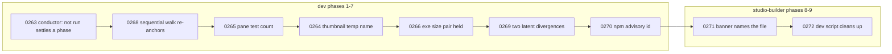

# 0233 — The close reviews' small findings are repaired

> **Status:** approved
> **Created:** 2026-09-29
> **Approved:** 2026-09-29 (owner), selected for the conductor; queued in `tools/conductor/queue.json`
> **Owner skill(s):** dev, studio-builder
> **Related ADRs:** [0239](../adrs/0239-rotation-carries-two-orders-and-the-shuffles-seed-varies-per-launch.md) (the sequential walk),
> [0230](../adrs/0230-thumbnails-are-rendered-by-a-subprocess-of-the-player-itself.md) (the thumbnail pass),
> [0159](../adrs/0159-the-component-gets-its-own-size-cap-and-the-recipe-carries-it.md) and
> [0231](../adrs/0231-the-standalone-size-cap-is-re-derived-from-what-it-carries-and-the-build-reports-it.md) (the size caps),
> [0244](../adrs/0244-the-npm-graphs-are-gated-like-the-cargo-graph-and-an-install-script-runs-by-name.md)
> (the npm gate)
> **Closes:** design-backlog 0263, 0264, 0265, 0266, 0268, 0269, 0270, 0271, 0272

## TL;DR

Nine small defects found by close reviews and filed on 2026-09-27 and 2026-09-29 are repaired, one
phase each, with no human phase, so the conductor runs the plan start to finish. The only
user-visible change is the owner's decision on backlog 0268: under `order = "sequential"`, a preset
picked in the browser becomes the point the next Space continues from.

## Context & problem

Each close review since Plan 0206 left minors and nits that were code rather than prose, so the
close could not repair them (ADR-0209). They were filed as backlog 0263-0272 on 2026-09-27/29. None
needs a design beyond what its entry states, except 0268, where the owner chose on 2026-09-29 that
**a browser pick re-anchors the sequential walk**, the reading that delivers ADR-0239's "Space means
the next preset again".

Taken one at a time, each would cost a plan's ceremony for a few lines of code. Taken together, they
are one unattended run.

## Decision

One plan, one phase per entry, ordered so the `dev` phases are contiguous and the two
`studio-builder` phases follow them. Each phase is the repair its backlog entry names, and nothing
else. Backlog 0273 (the conductor's write bound) is **not** here: it edits the settings a conductor
session runs under, so it is its own plan, taken interactively.

## Architecture diagram

## Implementation phases

### Phase 1 — A skipped phase settles in the conductor's log reading (backlog 0263)
- **Owner skill:** dev
- **What:** `rowIsDone` in `tools/conductor/lib/plan.mjs` also accepts a state beginning `not run`,
  so a phase whose done-when was not to run no longer parks its plan as a disagreement. The doc
  comment says so.
- **Files touched:** `tools/conductor/lib/plan.mjs`, `tools/conductor/test/plan.test.mjs`.
- **Done when:** `node --test tools/conductor/test/plan.test.mjs` passes with new cases asserting that
  `not run: Phase 1 falsified the candidate` and `not run` are done, and that `not started` and
  `parked: ...` are not. `node --test tools/conductor/test/` passes.

### Phase 2 — A browser pick re-anchors the sequential walk (backlog 0268)
- **Owner skill:** dev
- **What:** Under `order = "sequential"`, choosing a preset in the browser makes it the anchor the
  next Space steps from. With alpha to echo: Space gives alpha, Space gives bravo, pick `echo`, and
  Space gives alpha (the successor of `echo`, wrapping). Shuffle is unchanged. `docs/running.md`
  says what Space does after a browser pick, under each order.
- **Files touched:** `standalone/src/director.rs`, `standalone/src/director/tests.rs`,
  `docs/running.md`.
- **Done when:** a test in `director/tests.rs` walks exactly the sequence above and asserts `alpha`
  after the pick, and a second asserts that a pick under shuffle leaves the shuffle's behaviour as it
  was. `cargo nextest run -p standalone` passes (through the suite lock).

### Phase 3 — The pane-clearance test counts the library it measures (backlog 0265)
- **Owner skill:** dev
- **What:** `standalone/src/overlay/tests.rs` takes the library size from
  `rlx_core::preset::default_presets().len()` instead of the literal `114`.
- **Files touched:** `standalone/src/overlay/tests.rs`.
- **Done when:** `git grep -n "const LIBRARY: usize = 114" -- standalone/src/overlay/tests.rs`
  finds nothing, and the pane-clearance test passes.

### Phase 4 — Two players' thumbnail passes cannot collide (backlog 0264)
- **Owner skill:** dev
- **What:** The in-flight file name carries the writing process's id, so two passes rendering the
  same preset write two different temp files, and `discard_partials` removes only files whose owning
  process is no longer running, or only its own. The dev lane chooses which and states it in the doc
  comment. `docs/running.md` says the studio's player runs the thumbnail pass too.
- **Files touched:** `standalone/src/thumbs.rs`, `docs/running.md`.
- **Done when:** a test in `thumbs.rs` runs two passes into one cache directory for the same
  preset and asserts both finish without a failure note and the cache holds one complete entry.
  `cargo nextest run -p standalone -E 'test(/thumb/)'` passes.

### Phase 5 — The exe's size pair is held equal in all three places (backlog 0266)
- **Owner skill:** dev
- **What:** Beside guard (e) in `core/tests/suite/hygiene.rs`, a guard reads the exe cap and warning
  threshold out of `docs/nfr.md` section 4, `packaging/windows/stage.ps1` and
  `packaging/macos/bundle.sh`, and asserts all three agree and the warning is 90 % of the cap.
  `packaging/linux/stage.sh` gains the same measurement block the other two recipes carry (measure
  the binary, print it against the cap, warn above the threshold, never fail).
- **Files touched:** `core/tests/suite/hygiene.rs`, `packaging/linux/stage.sh`.
- **Done when:** the new guard passes, and fails when one copy is edited, as its own seeded check or
  a documented manual edit; `bash -n packaging/linux/stage.sh` is clean, and
  `git grep -n "16777216" -- packaging/linux/stage.sh` finds the cap.

### Phase 6 — Two latent divergences are closed (backlog 0269)
- **Owner skill:** dev
- **What:** In `standalone/src/capture_linux/rt.rs`, the `bytes.get_mut(carry..filled)` exit records
  `lost` the way the `stream.read` error path does. In `core/src/render/tests.rs`, `Observed<T>`
  forwards `as_feedback_sink` to the observed scene.
- **Files touched:** `standalone/src/capture_linux/rt.rs`, `core/src/render/tests.rs`.
- **Done when:** both ends of the capture loop report through the same path, and a test hands an
  observed attractor preset with a `[feedback]` table over and asserts the table reaches it.
  `cargo nextest run --workspace -P fast` passes.

### Phase 7 — An npm advisory without a GHSA id can be excepted (backlog 0270)
- **Owner skill:** dev
- **What:** `scripts/check-npm-audit.mjs`'s allow reader accepts the `npm-<source>` id its own survey
  assigns to an advisory with no GHSA url, so such an advisory can carry a reasoned exception like
  any other. The script's header says so.
- **Files touched:** `scripts/check-npm-audit.mjs`.
- **Done when:** `node scripts/check-npm-audit.mjs --self-test` passes with a new case accepting an
  `npm-<source>` allow entry and still rejecting a malformed id.

### Phase 8 — The missing-player banner names the settings file (backlog 0271)
- **Owner skill:** studio-builder
- **What:** When no player resolves, the banner states the full path of `settings.json` on this
  machine, which the main process already knows, alongside the key to set.
- **Files touched:** `studio/electron/main.ts`, `studio/renderer/App.tsx`,
  `studio/renderer/App.test.tsx` (and the shared type the renderer's `info` comes through, if it
  lives elsewhere).
- **Done when:** a test renders the missing-player state and asserts the banner text contains the
  settings path it was given. The studio's typecheck, lint and tests pass.

### Phase 9 — `npm run dev` leaves nothing running (backlog 0272)
- **Owner skill:** studio-builder
- **What:** The `dev` script's `concurrently` call ends every process when any one exits.
- **Files touched:** `studio/package.json`.
- **Done when:** `git grep -n -e "--kill-others" -- studio/package.json` finds the dev script.

## Risks & open questions

- **Phase 4's cleanup rule is a real choice.** Removing only its own partials leaves a crashed
  process's file behind until the next run; removing a dead process's needs a liveness check that
  differs per platform. Either is acceptable; the phase says which in the code.
- **Phase 5 reads three file formats with text matching.** A reformatted recipe could make the guard
  read nothing. The guard asserts it found each copy, so a failed parse is red rather than vacuous.
- **Phase 2 changes behaviour an operator may have learned.** It is the owner's decision, and the
  running.md line is where it is said.
- **Phases 8-9 need `studio/node_modules` in the lane.** The conductor installs it for a
  studio-builder phase; a failed install parks as `studio_install` and retries.

## What this plan does NOT do

- **It does not bound the conductor's `Write` tool** (backlog 0273). That is its own plan and ADR.
- **It does not change the shuffle order** or anything about the browser beyond what Space does next.
- **It does not change any size cap.** Phase 5 holds the existing figures equal; it moves none.

## Implementation log

> Written by `dev` — one row per phase as that phase's commit lands, and the close block after the
> last one. **The phases above are the contract; everything here is what happened.**

**Lane:** _(to be filled by `dev`)_

| phase | owner | state | commit |
|---|---|---|---|
| 1 — a skipped phase settles | dev | not started | |
| 2 — a browser pick re-anchors the sequential walk | dev | not started | |
| 3 — the pane test counts the library | dev | not started | |
| 4 — thumbnail passes cannot collide | dev | not started | |
| 5 — the exe size pair is held | dev | not started | |
| 6 — two latent divergences | dev | not started | |
| 7 — a non-GHSA advisory can be excepted | dev | not started | |
| 8 — the banner names the settings file | studio-builder | not started | |
| 9 — npm run dev leaves nothing running | studio-builder | not started | |

### Notes

### Close triggers

- **`presets/` touched:**
- **Plan header `Closes:`** design-backlog 0263, 0264, 0265, 0266, 0268, 0269, 0270, 0271, 0272
- **What shipped:**
- **Operator docs touched:**
- **Backlog probes (`node scripts/check-backlog-claims.mjs`):**
- **Full suite:**
- **Outstanding `human` phases:**

## Followups (after this lands)

- Backlog 0273, the conductor's write bound, is planned separately.
