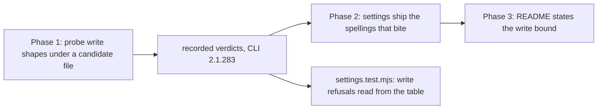

# 0234 — A conductor session writes only where it works

> **Status:** in-progress
> **Created:** 2026-09-29
> **Approved:** 2026-09-29 (owner). Taken in an interactive session and NOT queued: it edits
> `tools/conductor/settings.conductor.json`, which every conductor session runs under, as Plan 0208 did
> **Owner skill(s):** dev
> **Related ADRs:** [0255](../adrs/0255-a-conductor-session-writes-inside-its-lane-and-the-os-temp-directory.md)
> (proposed), [0233](../adrs/0233-a-session-allowlist-safety-claim-is-asserted-against-a-transcript.md)
> **Closes:** design-backlog 0273

## TL;DR

A conductor session may write anywhere its user can, because the allowlist grants the bare `Write`
and `Edit` tools. This plan scopes both to the session's lane and the OS temp directory, decides the
rule spellings with a probe of the real CLI, and asserts the result against the recorded transcript,
as Plan 0208 did for deletion. The first visible result is a table saying what 2.1.283 did with a
write to the lane's parent directory.

## Context & problem

Backlog 0273: the 2.1.282 probe wrote `~/Work/rlx-probe-0187\probe-control.txt`, beside its
worktree, under `settings.conductor.json`. The file was still there on 2026-09-29. Plan 0208 bounded
deletion to the lane and left writing unbounded. The owner chose the bound: lane plus OS temp
directory (ADR-0255).

## Decision

Per ADR-0255: probe first, then ship the spellings the transcript shows bite, then assert them.
If no permission-rule spelling can express the bound, the plan stops at Phase 1 and records that,
and ADR-0255's Alternative C (a path-checking hook) becomes the next plan.

## Architecture diagram

## Implementation phases

### Phase 1 — Write shapes get a transcript
- **Owner skill:** dev
- **What:** `tools/conductor/spike/matcher-probe.mjs` gains write shapes, each attempted with the
  `Write` tool (and one `Edit`): a relative path in the lane, an absolute path in the lane, a path in
  the OS temp directory, a path in the lane's parent (the box directory), and a path in `$HOME`
  (the sandbox). It runs under a candidate settings file whose `Write`/`Edit` grants are
  path-scoped. The parent reads the disk for each target afterwards.
- **Files touched:** `tools/conductor/spike/matcher-probe.mjs`, `tools/conductor/spike/README.md`.
- **Done when:** the README's verdict table gains a row per write shape on a named CLI version, with
  the candidate spellings named, and says in one line whether a spelling exists that allows the lane
  and temp shapes while the parent and home writes are refused. If none does, the phase says so and
  the plan stops here.

### Phase 2 — The settings ship the spellings that bite
- **Owner skill:** dev
- **What:** `settings.conductor.json` replaces the bare `Write` and `Edit` with the spellings Phase 1
  showed. `settings.test.mjs` gains the write cases: refusals asserted against the recorded table,
  allowances through the model.
- **Files touched:** `tools/conductor/settings.conductor.json`, `tools/conductor/test/settings.test.mjs`.
- **Done when:** `node --test tools/conductor/test/` passes; the write refusals read their verdicts
  from `spike/README.md`, and a verdict edited to RAN turns its case red.

### Phase 3 — The README states the write bound
- **Owner skill:** dev
- **What:** `tools/conductor/README.md`'s lane-bound bullet covers writing, names the temp directory
  exception, and cites the transcript.
- **Files touched:** `tools/conductor/README.md`.
- **Done when:** the bullet names the write bound in terms a reader can check against the rules.

## Risks & open questions

- **The matcher may not honour a working-directory-relative spelling.** On 2.1.273 several
  path-scoped spellings did not reach `.claude/`, though that was a restriction on that directory
  rather than a general one. Phase 1 is where this is found, and ADR-0255 names the fallback.
- **The OS temp directory differs per platform.** Linux is `/tmp`, macOS is a per-user
  `$TMPDIR`, and Windows is `%TEMP%`. A spelling that works here may not work there. The probe runs
  here; the Windows row stays owed, as backlog 0267 records for `Remove-Item`.
- **A narrower bound can refuse correct work.** A refused write parks a plan with the denial in its
  log, which is the recoverable direction.

## What this plan does NOT do

- It does not bound `Read`; reading outside the lane is how a session consults a sibling checkout's
  source.
- It does not run the Windows half of the probe (backlog 0267).
- It does not run under the conductor.

## Implementation log

> Written by `dev` — one row per phase as that phase's commit lands, and the close block after the
> last one. **The phases above are the contract; everything here is what happened.**

**Lane:** `main` directly (an interactive session, as Plan 0208)

| phase | owner | state | commit |
|---|---|---|---|
| 1 — write shapes get a transcript | dev | done | edfb02a1 |
| 2 — the settings ship the spellings | dev | committed with this row | |
| 3 — the README states the write bound | dev | not started | |

### Notes

### Close triggers

- **`presets/` touched:**
- **Plan header `Closes:`** design-backlog 0273
- **What shipped:**
- **Operator docs touched:**
- **Backlog probes (`node scripts/check-backlog-claims.mjs`):**
- **Full suite:**
- **Outstanding `human` phases:**

## Followups (after this lands)

- The Windows row of the write probe, with backlog 0267's `Remove-Item` rows.
