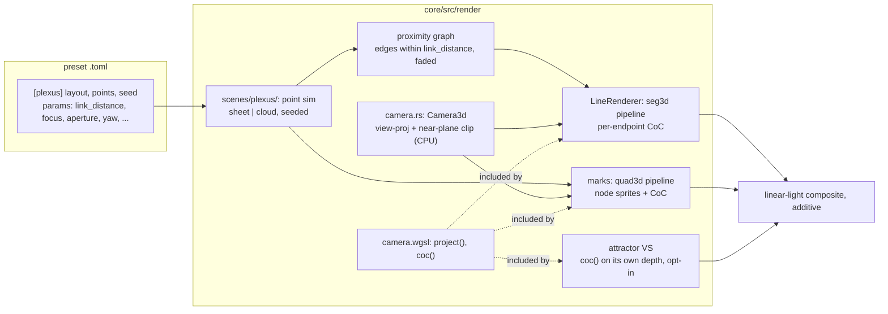

# 0235 — The plexus system, and a shared camera with depth of field

> **Status:** in-progress (2026-09-30; run by hand in ordinary sessions, not queued for the conductor. Amended 2026-10-01: Phase 9 added after the first shipped set exposed the blur notice)
> **Created:** 2026-09-30
> **Owner skill(s):** dev, human
> **Related ADRs:** [ADR-0257](../adrs/0257-a-shared-camera-projects-3d-primitives-and-depth-of-field-is-a-per-endpoint-circle-of-confusion.md) (proposed), [ADR-0044](../adrs/0044-swarm-world-is-a-25d-torus-sized-from-the-target.md), [ADR-0037](../adrs/0037-internal-grid-is-a-resolution-not-a-shape.md), [ADR-0180](../adrs/0180-a-mathematical-world-joins-a-system-as-a-family-and-a-structural-parameter-is-held.md), [ADR-0256](../adrs/0256-a-parameter-declares-its-group-and-whether-it-is-main.md)

## TL;DR

A new system, **`plexus`**, draws a few hundred points in 3D, joined by a line wherever two are
within a bindable link distance, through a perspective camera with a real focal plane. Lines and
nodes blur continuously with their distance from focus, and dim as they blur. The camera and the
blur are a **shared** core capability (ADR-0257): one `Camera3d` and one `camera.wgsl`, consumed by
a new 3D segment pipeline, a new 3D quad pipeline, and, opt-in, the attractor. The first thing a user
sees is a slowly drifting cloud of linked points in perspective. By the end of the plan it can
reproduce the reference still: a network on an undulating sheet, sharp in a middle band and soft
before and behind it.

## Context & problem

The owner brought a reference image (a plexus network on a navy ground, a shallow depth of field,
slow motion) and asked how to make presets that look like it. Four properties make up the picture,
and the engine has none of them:

1. **A proximity graph.** Edges are generated from distance between points. No system does this; the
   line scenes draw generators, not neighbourhoods.
2. **Perspective.** The attractor scales by a pseudo-perspective factor and writes `z = 0`, and the
   swarm fakes 2.5D. Nothing projects through a camera, and the only shared view is the 2D
   `ViewTransform`.
3. **Depth of field that varies along one line.** This is the property that sells the look, and it
   rules out per-object blur and (on additive content) a post-process blur. ADR-0257 records why.
4. **Slow, coherent motion.** The network drifts, links fade in and out instead of popping, and the
   camera barely moves.

The interview settled the rest. The layout is a **choice per preset**: an undulating `sheet` or a
volumetric `cloud`. Reactivity is **bindable params**, not hard-wired, so presets decide between a
calm drift and a beat-driven look. The camera and the blur are **shared from day one**, not private to
the new system.

## Decision

We build ADR-0257's shared camera as a Rust struct plus one WGSL snippet, and add a `seg3d` pipeline
inside `LineRenderer` and a `quad3d` pipeline beside `marks::InstancedQuads`, both chosen rather
than branched, so every 2D scene keeps its bytes. `plexus` is a new `SystemKind` rather than a family
on an existing system. By ADR-0180 rule 1 it needs its own state (a moving point set), its own pass
shape (a per-frame proximity graph), and a camera surface that would be inert on any existing host.
Its two layouts are a `[plexus] layout` family. We rejected a post-process depth-of-field stage and a
separate all-in-one 3D renderer (ADR-0257, Alternatives A and B), and CPU projection into the 2D
segment (Alternative C).

## Architecture diagram



## Implementation phases

### Phase 1 — Walking skeleton: the camera, the 3D segment pipeline, and a drifting cloud
- **Owner skill:** dev
- **What:** `core/src/render/camera.rs` (`Camera3d`: `yaw`, `pitch`, `distance`, `fov`, target
  aspect; builds the view-projection with hand-written 4x4 maths and no new dependency) and
  `camera.wgsl` with `project()`. A `seg3d` pipeline in `LineRenderer`, selected per draw call, with
  a `Segment3dInstance` (two `vec3` endpoints, colour, width, alpha) and the existing stroke profile.
  The new `SystemKind::Plexus` gets its `TABLE` row and the `[plexus]` table (`layout = cloud` only
  for now, `points`, `seed`). The cloud is a seeded point set in a unit box, drifting on a seeded
  smooth flow at rate `drift`, with positions wrapping at the box faces. The proximity graph links
  every pair closer than `link_distance`. Each edge's alpha is `link_alpha * smoothstep` of
  `1 - d/link_distance`, so an edge fades in and out as its pair nears and parts and never pops.
  Brute-force pairing is acceptable at the tier's point cap; say so in a comment. Near-plane clipping
  and frustum culling run on the CPU against the Rust half of the camera. The screen aspect comes
  from the render target (ADR-0037). Engine-wide `zoom` divides the field of view, and `pan_x` /
  `pan_y` shift after projection. Every `ParamSpec` declares `group` and `main` (ADR-0256): camera
  params go in `Motion`, link and point params in `Shape`. Buffers are preallocated from the tier's
  caps, so a frame allocates nothing.
- **Files touched:** `core/src/render/camera.rs` (new), `core/src/render/camera.wgsl` (new),
  `core/src/render/mod.rs`, `core/src/render/scenes/lines/renderer.rs`,
  `core/src/render/scenes/plexus/` (new), `core/src/render/scenes/mod.rs`,
  `core/src/preset/schema/system.rs`, `core/src/preset/schema/raw/plexus.rs` (new),
  `core/src/preset/schema/raw/mod.rs`, `core/src/preset/schema/load.rs`,
  `core/src/render/tier.rs`, `core/tests/suite/hygiene.rs`, `core/tests/`.
- **Done when:** a test preset renders a visible linked cloud through `shot`, and two frames a second
  apart differ. The camera's Rust and WGSL view-projections agree on a fixed set of points, pinned
  by a test in the shape of `projection_mirror.rs`. A point on the camera axis projects to the target
  centre at every aspect, and a unit square at the focal distance keeps its aspect at 1280x800 as well
  as at 1920x1080 (the configuration where grid and target disagree, per ADR-0037). An edge's alpha
  is continuous in the distance of its pair: sweeping the pair across `link_distance` gives no step.
  Every existing golden is unchanged. The new `plexus/` directory is in the hygiene scan set, and the
  hot-path pragma is present there.

### Phase 2 — Depth of field on segments
- **Owner skill:** dev
- **What:** `Camera3d` gains `focus` (normalized 0 = nearest extent of the layout's volume, 1 =
  farthest, so an author never deals in world units) and `aperture`. `camera.wgsl` gains `coc()`,
  the thin-lens circle of confusion in pixels, clamped to a new tier cap `max_coc_px`. The `seg3d`
  vertex shader computes a CoC at each endpoint. The quad becomes a trapezoid whose half-width at
  each end is `w_end + coc_end`, and the fragment stage reads an interpolated half-width and edge
  softness. Intensity is scaled by `w / (w + coc)` per endpoint, interpolated, so the integrated
  cross-section energy is preserved (ADR-0257). The line width is set in pixels at the focal plane
  and scaled by perspective. `focus` and `aperture` declare `Light`.
- **Files touched:** `core/src/render/camera.rs`, `core/src/render/camera.wgsl`,
  `core/src/render/scenes/lines/renderer.rs`, `core/src/render/scenes/plexus/`,
  `core/src/render/tier.rs`, `core/tests/`.
- **Done when:** `aperture = 0` renders byte-identical to Phase 1. A single segment running from the
  focal plane to the far extent is measurably wider and softer at its far end than at its focal end,
  so the width varies along one line. Across a sweep of `aperture`, the peak luminance of a far
  segment's cross-section falls monotonically while its summed cross-section luminance shows no
  monotone trend (energy preserved, stated as a property rather than a threshold, per ADR-0071). The
  CoC never exceeds `max_coc_px` at any `aperture`.

### Phase 3 — Nodes: the 3D quad pipeline
- **Owner skill:** dev
- **What:** A `quad3d` pipeline beside `marks::InstancedQuads`, taking `vec3` centres through the same
  `camera.wgsl`, with per-sprite CoC, radius `r + coc` and the area factor `(r / (r + coc))²`. Plexus
  draws a node at every point with `node_size` (pixels at the focal plane) and `node_glow` (brightness
  relative to the lines). The palette coordinate for both nodes and edges is normalized view depth,
  near to far, per ADR-0059's rule that a scene colours along its own generator's axis, and
  `hue_center` and `hue_spread` behave as on the other scenes.
- **Files touched:** `core/src/render/scenes/marks.rs`, `core/src/render/scenes/plexus/`,
  `core/tests/`.
- **Done when:** a node and the endpoint of an edge at the same point blur by the same CoC, since they
  come from one function. The swarm's golden is unchanged. `node_size = 0` draws no node quads rather
  than invisible ones. Palette A/B crossfade and `palette_steps` behave on the depth coordinate as on
  every other scene.

### Phase 4 — The sheet layout
- **Owner skill:** dev
- **What:** `[plexus] layout = sheet`. The points are a seeded jittered grid on a plane, displaced
  along its normal by a seeded smooth height field whose amplitude is `wave`, spatial scale
  `wave_scale`, and phase advancing at `drift`. Only the displacement moves, never the grid order, so
  neighbours stay neighbours and the mesh ripples instead of rewiring, while edges still come from the
  proximity rule and still fade. The default camera pitch looks across the sheet at a grazing angle,
  as in the reference.
- **Files touched:** `core/src/render/scenes/plexus/`, `core/src/preset/schema/raw/plexus.rs`,
  `core/src/preset/schema/load.rs`, `core/tests/`.
- **Done when:** at `wave = 0` every point lies on the plane. Raising `wave` raises the RMS
  displacement of the point set monotonically. At a fixed `link_distance`, the edge count at
  `wave = 0` and at a small `wave` differ by less than the count at `wave = 0` and at a large one,
  which shows the ripple changes the mesh gradually. A `layout` the loader does not know is rejected
  with the family names listed.

### Phase 5 — The attractor takes the shared circle of confusion
- **Owner skill:** dev
- **What:** The attractor's sprite and streak vertex shader includes `camera.wgsl` and calls `coc()`
  on the view depth it already computes (ADR-0076), mapped from its `depth_norm` to the camera's
  focus scale. It gains `focus` and `aperture` params, default `aperture = 0`. Its projection,
  `magnify` and tuple framing are unchanged (ADR-0257 says why).
- **Files touched:** `core/src/render/scenes/particles/shaders.rs`,
  `core/src/render/scenes/particles/mod.rs`, `core/src/render/scenes/particles/resources.rs`,
  `core/tests/`.
- **Done when:** every attractor golden is byte-identical at the default. On a `thomas` or `lorenz`
  figure with `aperture > 0`, sprites far from the focal depth render wider and dimmer than sprites at
  it. The 2D families (`de_jong`, `clifford`) with `aperture > 0` render identically to `aperture = 0`,
  since they have no depth, and a comment says so.

### Phase 6 — Tier caps, the golden and the determinism proof
- **Owner skill:** dev
- **What:** `points`, the edge cap and `max_coc_px` get `TierConfig` values (ADR-0045), clamped and
  announced rather than silently reduced. The values are measured against the frame budget on the
  `Floor` tier, not chosen, and the measurement goes in the log. A golden per layout pins seed,
  frame count and camera. A determinism test asserts that the same seed and the same analysis frames
  give the same point set and edge list after N frames.
- **Files touched:** `core/src/render/tier.rs`, `core/src/render/scenes/plexus/`, `core/tests/`.
- **Done when:** the determinism property holds over at least 600 frames for both layouts, the goldens
  hold on the software adapter, an over-tier `points` is clamped with a notice, and the measured frame
  cost at `Floor`'s caps with a worst-case `aperture` is recorded in the log against NFR section 1.

### Phase 7 — Documentation and the references
- **Owner skill:** dev
- **What:**
  - `docs/presets.md` gains the `[plexus]` table and a system-table row.
  - `presets/README.md`'s generated params block and `presets/schema/` plus `.taplo.toml` are
    regenerated (`RLX_UPDATE_PARAM_REFERENCE=1`, `RLX_UPDATE_PRESET_SCHEMA=1`).
  - `docs/preset-guide.md` gets one picture per layout.
  - `docs/how-it-works.md` gains a sentence on the shared camera.
  - `docs/on-device-validation.md` gains the system.
  - The preset-author reference gains a `## plexus` section (ADR-0234): working ranges for
    `link_distance`, `focus` and `aperture`, and the rule that `aperture` costs fill.
- **Files touched:** `docs/presets.md`, `presets/README.md`, `presets/schema/`, `.taplo.toml`,
  `docs/preset-guide.md`, `docs/images/`, `docs/how-it-works.md`, `docs/on-device-validation.md`,
  `.claude/skills/preset-author/references/systems.md`.
- **Done when:** every plexus param names its group and the layout it reads on. The schema test and
  the param-reference test pass on the regenerated files. `node scripts/toc.mjs --check`,
  `node scripts/check-doc-links.mjs`, `node scripts/check-reader-prose.mjs` and
  `node scripts/check-system-counts.mjs` pass.

### Phase 8 — The look, judged against the reference
- **Owner skill:** human
- **Blocks merge:** no
- **What:** On the Arch box, with the music track, the owner runs a `sheet` test preset and a `cloud`
  test preset live and judges them against the reference still: depth that reads, links that fade
  rather than pop, a frame rate that holds with `aperture` up. The owner then hands the brief to the
  `preset-author` lane.
- **Files touched:** none.
- **Done when:** the owner records a keep, or a list of what is off, in this plan's log.

### Phase 9 — The blur cap is a ceiling, and the first set joins the gates
- **Owner skill:** dev
- **Why:** the first shipped set (2ea44e40) made the running app print, on Rich, *"a blur of 520 px
  is past this quality tier's cap of 24 px ... (lower aperture, or pin --tier rich)"* for Synapse,
  whose look the owner signed off as drawn. That number is the bound at the near edge of the bounding
  sphere. At `distance = 1.7` against the cloud's radius of `sqrt(3)`, the edge lies behind the eye
  and is clamped to `NEAR`. ADR-0257, amended 2026-10-01, now defines the cap as the lens's ceiling
  and judges only `aperture` against it. The repeats the owner saw are re-entries, not frames:
  `AppState::poll_cap_overflow` triggers on a change in whether an overflow exists, and Synapse's
  bound is over the cap at every focus and orientation. Each preset switch, dissolve settle and
  hot-reload announced it again. Nothing in the poll changes.
  Separately, the suite's only two reds after bbb12053 are this set's missing curation:
  `every_family_carries_at_least_two_representatives` and the hygiene check that every shipped
  preset has a gallery card.
- **What:**
  - **The notice judges `aperture`.** In `plexus` and in the attractor, the blur overflow is present
    iff the sanitized `aperture` (finite, at least 0) exceeds the tier's `max_coc_px`, and carries
    that aperture. The near-extent bound computed in `PlexusScene::render` and `asked_blur` is
    removed, along with the dead code it leaves. The attractor's flat families stay at exactly 0
    whatever the aperture. What is drawn does not change: `coc()` in `camera.wgsl` and the CPU
    `Lens` already clamp to the cap, and no golden moves.
  - **The Blur text says what was overridden.** It names the aperture rather than "a blur", and the
    far field rather than "the depth of field", for example *"an aperture of 30 px is past this
    quality tier's cap of 24 px; drawn at 24 px instead, so the background is sharper than the preset
    asked (ask for 24 or fewer)"*. `Recovered` follows.
  - **The remedy is tier-aware in every tier-clamp context.** Iterations, Grid, Radius, Points,
    Edges and Blur offer `pin --tier rich` only when the tier the run is on is not Rich.
    `CapOverflow` carries what it needs to decide this, the same way it carries `cap`. The mechanism
    is dev's call. Mirror and Depth have no tier clause and keep their text.
  - **The declared range ends at the top cap.** `aperture`'s `ParamSpec` range on both systems ends
    at `TierConfig::RICH.max_coc_px` (24), and a test holds the two equal. `presets/README.md`'s
    generated block, `presets/schema/` and `.taplo.toml` are regenerated.
  - **The docs say what `aperture` is.** In `docs/presets.md`'s depth-of-field paragraph and the
    preset-author `## plexus` row, it is the blur of the far background, in pixels. Nearer than the
    focal plane the blur grows past it, and a close camera's near strands draw at the tier's ceiling
    (12 px on Floor, 24 on Rich) with no notice. Only an aperture past the cap is announced. The
    systems.md sentence "past about `14` the near edge of a default-framed network already clamps
    there" goes. Synapse's header claim that it "draws as written on every tier" becomes the far
    side only. This is a comment edit forced by an engine meaning change (ADR-0081).
  - **The first set joins the gates.** Add `representative = true` to `plexus_synapse.toml` (cloud)
    and `plexus_stormsea.toml` (sheet). Add five `CARDS` entries to `scripts/docs-shots.mjs`, with
    the rendered cards under `docs/images/gallery/presets/`. Re-point the plexus system card, whose
    comment says "UNJUDGED ... the system ships no preset yet", at Synapse, and rewrite that comment.
- **Files touched:** `core/src/render/scenes/mod.rs`, `core/src/render/scenes/plexus/`,
  `core/src/render/scenes/particles/`, the other tier-clamp producers that build a `CapOverflow`
  (`analytic_field/`, `cellular/`), `core/tests/`, `presets/README.md`, `presets/schema/`,
  `.taplo.toml`, `presets/plexus_synapse.toml`, `presets/plexus_stormsea.toml`,
  `scripts/docs-shots.mjs`, `docs/images/gallery/`, `docs/presets.md`,
  `.claude/skills/preset-author/references/systems.md`.
- **Done when:**
  - Synapse's camera (`distance` 1.7, `fov` 1.25, `aperture` 11, `focus` at 0.2, 0.5 and 0.8)
    produces no overflow on either tier.
  - `aperture` 13 on Floor produces a Blur overflow with cap 12 whose text contains
    `pin --tier rich`.
  - `aperture` 30 on Rich produces one whose text does not contain `--tier`.
  - The same tier-clause property holds for at least one other tier-clamp context.
  - The existing `Blur(40)` assertions in the particles tests follow the new rule.
  - Every golden is unchanged.
  - `every_family_carries_at_least_two_representatives` and the gallery-card hygiene test pass.
  - `cargo nextest run --workspace` exits 0, and so do `node scripts/check-doc-links.mjs`,
    `node scripts/check-system-counts.mjs` and `node scripts/toc.mjs --check`.

## Data shapes

```rust
// illustrative, not the final interface

/// Shared by every 3D pipeline; mirrored in camera.wgsl.
pub struct Camera3d {
    pub yaw: f32,        // radians, bindable: a preset writes `time * 0.05` for a slow orbit
    pub pitch: f32,      // radians
    pub distance: f32,   // eye to orbit target, in layout units
    pub fov: f32,        // vertical, radians; engine-wide `zoom` divides it
    pub focus: f32,      // 0 = nearest extent of the scene's volume, 1 = farthest
    pub aperture: f32,   // 0 = pinhole; CoC is clamped to TierConfig::max_coc_px
}

#[repr(C)]
pub struct Segment3dInstance {
    pub a: [f32; 3],
    pub b: [f32; 3],
    pub color: [f32; 3],
    pub width: f32,      // pixels at the focal plane
    pub alpha: f32,      // the edge's distance fade, times link_alpha
}

/// `[plexus]`, structural and not bindable.
pub struct PlexusConfig {
    pub layout: PlexusLayout,  // Sheet | Cloud
    pub points: u32,           // tier-capped
    pub seed: u64,
}
```

Bindable params, all Modal: `link_distance`, `link_alpha`, `line_width`, `node_size`, `node_glow`,
`drift`, `wave`, `wave_scale`, `yaw`, `pitch`, `distance`, `fov`, `focus`, `aperture`, `brightness`,
`hue_center`, `hue_spread`. A beat-driven preset binds `link_distance` to bass and `node_size` to
onset; a calm one binds `focus` to a slow `sin(time)`. Both are content, not engine.

## Risks & open questions

- **Fill cost on the iGPU floor.** A widened far segment covers many times the pixels of a sharp
  one, and a cloud can hold on the order of a thousand edges. Phase 6 measures it, and `max_coc_px`
  plus the edge cap are the levers. If `Floor` cannot hold with any useful blur, its cap goes low
  enough that the look degrades to a mild softening, and the log says so.
- **Two copies of the camera.** The CPU clip and cull and the WGSL projection can drift apart. Phase
  1's mirror test is the guard. If it proves brittle, move culling into the vertex shader (a
  degenerate quad) and drop the CPU half.
- **A segment crossing the near plane** must be clipped, not culled, or a near edge flickers out as
  the camera orbits. The clip is done on the CPU before upload, and Phase 1's cull test should include
  a crossing segment.
- **Brute-force pairing** is O(N²). It is fine at a few hundred points (~80k distance checks), and a
  uniform grid is the replacement if a tier cap ever goes past about a thousand points. It is not
  built speculatively.
- **The name.** `plexus` is the common word for this look. The owner may prefer another; renaming
  before Phase 1 lands costs nothing, and after it costs a schema regeneration.
- **The attractor's "shared" camera is half-shared.** It gets the CoC, not the projection. Moving its
  framing onto `Camera3d` would re-bless every attractor golden and re-curate the tuple rosters. That
  is its own plan.

## What this plan does NOT do

- **Ship presets.** The launch set, and the reference look itself, belong to the `preset-author`
  lane after Phase 8's brief. This plan's presets are test fixtures.
- Put a depth buffer, a sort or a post-process depth-of-field stage into any pipeline.
- Move the attractor, the swarm or any line scene onto the 3D camera's projection.
- Add per-node twinkle phases, reseeding on the beat, or linking to more than distance (k-nearest,
  triangulation). All are follow-ups if the content lane asks for them.
- Change the studio. The new params reach its panel through the generated schema.

## Implementation log

**Lane:** `main`, directly

| phase | owner | state | commit |
|---|---|---|---|
| 1 — Walking skeleton | dev | done | 8b3a6d41 |
| 2 — Depth of field on segments | dev | done | 6a52a633 |
| 3 — Nodes: the 3D quad pipeline | dev | done | f7e09ec4 |
| 4 — The sheet layout | dev | done | de309bfc |
| 5 — The attractor takes the shared CoC | dev | done | f43f1dd7 |
| 6 — Tier caps, golden, determinism | dev | done | 0c23e166 |
| 7 — Documentation and the references | dev | done | 2ad353bc |
| 8 — The look, judged | human | not started | |

### Notes

- Phase 1, scope (owner-approved before starting): files outside the phase list were touched
  because adding a `SystemKind` fails the schema, param-reference and gallery guards otherwise:
  `core/src/preset/schema/{export,mod,tests}.rs`, `raw/preset.rs`, `render/mod.rs`
  (`active_family_key`), `scripts/docs-shots.mjs`, `docs/images/gallery/plexus.png`,
  `docs/examples/plexus/cloud.toml`, the regenerated `presets/README.md`, `presets/schema/`,
  `presets/preset.schema.json`, `.taplo.toml` and `docs/specs/player-schema.json`.
- Phase 1, `core/tests/golden/plexus.png` was blessed on llvmpipe, not WARP, through an
  uncommitted local bypass of the WARP-only guard, at the owner's instruction. Windows CI is
  the first WARP reading of it. Existing baselines were not re-blessed; their llvmpipe readings
  were identical before and after the phase.
- Phase 1, `core/tests/distinctness.rs`: a system that ships zero presets now prints and returns
  instead of failing `n >= 2`; a family of one still fails. Plexus ships none by design.
- Phase 1, `[plexus] seed` absent takes the preset's pinned salt.
- Phase 1, palette coordinate on edges is already normalized view depth (the plan places it in
  Phase 3); points carry a face fade so a wrap at the cube's faces never pops an edge.
- Phase 1, the `plexus_points` / `plexus_edges` tier values are provisional arithmetic; Phase 6
  measures them. The tier clamp is silent until Phase 6 announces it.
- Phase 2, energy: besides `w / (w + coc)` the factor divides by the profile's own integral at the
  widened softness, and it is evaluated per fragment from interpolated sharp and blurred
  half-widths; a blurred stroke also reads its across-the-stroke coordinate as offset over
  half-width rather than the corner-interpolated one. The 2D renderer is untouched.
- Phase 2, the energy sweep judges the summed light over the blurred readings (aperture 2..32):
  the pinhole reading keeps Phase 1's interpolated coordinate (byte identity) and reads about 7 %
  under them at the probe's far column. `aperture = 0` byte identity was checked against Phase 1's
  `plexus.png` on llvmpipe: max outlier 0.
- Phase 3, `core/tests/golden/plexus.png` re-blessed on llvmpipe the same way, because nodes draw
  by default (`node_size = 2.5`). The swarm's llvmpipe reading is unchanged.
- Phase 3, "a node and an edge endpoint blur by the same CoC" is asserted structurally: each 3D
  pipeline's compiled WGSL holds exactly one `coc()`, the camera's text, and calls it.
- Phase 4, `raw/plexus.rs` and `load.rs` did not change: the loader's roster is
  `PlexusLayout::ALL`. `scenes/mod.rs`'s `family_params` gained the `plexus` row so `wave` and
  `wave_scale` print as inert on `cloud`. The sheet's grazing default is the shared `pitch` default
  (0.25 rad); there is no per-layout default.
- Phase 5, files beyond the phase list: `particles/encode.rs` (uniform packing),
  `particles/projection_mirror.rs` (CPU mirror of the new terms), `particles/tests.rs` and
  `scenes/mod.rs` (`AttractorScene::new` takes the tier's CoC cap). The lens rides the draw
  uniform's padding lanes (`bh.w`, `bv.w`, `ctr.w`, `em.w`), so its size is unchanged. The shader's
  own `project()` is renamed `project_figure()`, since `camera.wgsl` now declares one. The
  attractor has no camera distance, so its `depth_norm` is laid on a fixed virtual lens
  (distance 1, radius 0.5). All nine `core/tests/fixtures/attractor*.toml` rendered through `shot`
  at 160x100 are byte-identical PNGs before and after, on llvmpipe.
- Phase 6, measured frame cost (`shot --report family=plexus --tier floor`, release profile,
  1920x1080, AMD Radeon Graphics RADV RENOIR iGPU, Mesa 26.2.2): 600 points, `link_distance 0.6`
  (saturating the 6000-edge cap), `node_size 3`: cloud 2.764 ms at `aperture 0`, 3.969 ms at
  `aperture 40` (past the 12 px cap); sheet 1.221 / 2.039 ms. Against NFR section 1's 16.67 ms;
  the `Floor` values 600 / 6000 / 12 stand unchanged. RENOIR (2020) is newer than the ~2015 iGPU
  the floor names. `Rich` (1500 / 20000 / 24) was not measured.
- Phase 6, `core/tests/golden/plexus_sheet.png` blessed on llvmpipe the same way as `plexus.png`.
  Clamps reach the renderer through three new `OverflowContext` variants (`Points` at load,
  `Edges` and `Blur` per frame), which is a `scenes/mod.rs` edit outside the phase list.
- Phase 6, two intra-doc links to the private `CAMERA_WGSL` (from Phases 1-2) broke the public
  `cargo doc --workspace` run and are unlinked here.
- Phase 7, docs beyond the phase list, each a hand-kept roster plexus made false:
  `docs/capturing.md` (the `--report family=` list), `docs/preset-palettes.md` (the per-scene
  palette table) and the hand-written additive-scenes sentence in `presets/README.md`. Also
  `docs/examples/plexus/sheet.toml`, a `docs/images/plexus/sheet.png` manifest entry in
  `scripts/docs-shots.mjs`, and `docs/images/gallery/plexus.png` re-rendered now that nodes draw.
  `presets/README.md`'s contents block had been stale since Phase 1 (`toc.mjs --check` was not run
  per phase) and is regenerated here.
- Phase 2, `max_coc_px` is a `u32` (the tier struct derives `Eq`), provisional 12 / 24; Phase 6
  measures it.
- Close-review fix, major 1 (the attractor clamped its blur silently): the attractor now reports
  `OverflowContext::Blur` through `mirror_overflow` per frame, from the lens's widest circle of
  confusion over the figure, and never on a family without depth. `FIGURE_DISTANCE` /
  `FIGURE_RADIUS` move from `projection_mirror.rs` into `particles/mod.rs`, which both read; a test
  holds them to the draw shader's text. Commit 25c9519e.
- Close-review fix, major 2 (the energy test passed on a two-reading dip): the summed light is now
  held to a ratio, a relative spread under a tenth of the peak's relative fall over the blurred
  sweep. Reads 0.0070 against 0.6013 on llvmpipe. Commit 7cdf291e.
- Close-review fix round 2, major (the attractor's blur was in trail-grid pixels): the draw
  uniform's `em.w` now carries the render target's height from `set_target_size`, not `trail_h`.
  The new test sets grid scale 1.0 and 0.5 on one target and reads the scene's stored height
  through the CPU mirror. It does not read the packed uniform back. Commit 75c80fee.
- Close-review fix round 2, minor: the pairing comment in `plexus/sim.rs` states 180k checks at
  Floor and 1.1M at Rich, and says only Floor is measured. Rich's cost is still unmeasured.
  Commit 1222b4b6.

### Close triggers

- **`presets/` touched:** yes: `presets/README.md` (generated params block, contents block, one
  hand-written sentence), `presets/preset.schema.json` and every `presets/schema/*.schema.json`,
  including the new `plexus.schema.json`. No preset `.toml` added or changed.
- **Plan header `Closes:`** none
- **What shipped:** feature: `SystemKind::Plexus` with `cloud` and `sheet` layouts, the shared
  `Camera3d` / `camera.wgsl`, the `seg3d` and `quad3d` pipelines, and `focus` / `aperture` on the
  attractor.
- **Operator docs touched:** `docs/presets.md`, `docs/preset-guide.md`, `docs/how-it-works.md`,
  `docs/on-device-validation.md`, `docs/capturing.md`, `docs/preset-palettes.md`,
  `.claude/skills/preset-author/references/systems.md`.
- **Backlog probes (`node scripts/check-backlog-claims.mjs`):** exit 0.
- **Full suite:** `cargo nextest run --workspace` at 2ad353bc: exit 0, 1937 passed, 8 skipped
  (llvmpipe; the golden comparisons skip-and-print off WARP, reading `plexus` and `plexus_sheet`
  at max outlier 0).
  After the two close-review fixes, at 7cdf291e: exit 0, 1938 passed, 8 skipped; `cargo doc
  --workspace --no-deps` under `-D warnings` clean.
  After fix round 2, at 1222b4b6: exit 0, 1939 passed, 8 skipped; `cargo doc` clean.
- **Outstanding `human` phases:** Phase 8 (the look, judged against the reference),
  `Blocks merge: no`.

## Followups (after this lands)

- `preset-author`: a launch set per layout, with the reference still as the brief.
- A plan moving the attractor's projection onto `Camera3d`, if the CoC alone does not make its 3D
  families read.
- Offering the 3D camera to `parametric_curve` (space curves, knots), which now needs only a
  generator axis in `z`.
