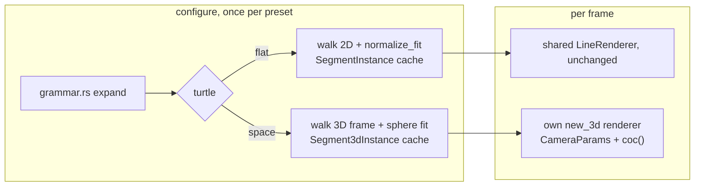

# 0237 — The L-system turtle turns in space

> **Status:** draft (2026-10-01). Runs after Plan 0236 closes.
> **Created:** 2026-10-01
> **Owner skill(s):** dev, human
> **Related ADRs:** [ADR-0258](../adrs/0258-a-system-takes-depth-through-one-shared-camera-block-and-its-3d-mode-forgoes-what-seg3d-does-not-draw.md) (proposed), [ADR-0257](../adrs/0257-a-shared-camera-projects-3d-primitives-and-depth-of-field-is-a-per-endpoint-circle-of-confusion.md), [ADR-0059](../adrs/0059-line-scenes-colour-along-their-generator-axis.md)

## TL;DR

`[generator] turtle = "space"` makes the `lsystem` walk a **3D turtle**: `&` and `^` pitch, `\` and
`/` roll, and `|` turns around, beside the `+` and `-` it has today. A branching grammar grows a tree
in depth, seen through the shared camera, with the branches far from the focal plane going soft. The
default, `turtle = "flat"`, keeps every symbol's meaning, and the six shipped L-system presets and the
golden keep their bytes.

## Context & problem

The L-system turtle (`turtle.rs`) holds `x`, `y` and one `heading` angle. It knows `F`, `G`, `f`,
`+`, `-`, `[` and `]`, and every other character is an inert grammar variable. Geometry is expanded,
walked and fitted once per depth at `configure`, and cached (`lsystem.rs`). A frame only picks a
depth, colours it by generation, transforms it in 2D and keeps the `draw_progress` prefix.

None of the shipped grammars (`bower`, `coral`, `icecrystal`, `rime`, `sumimono`, `vellum`) or the
golden fixture uses `&`, `^`, `\`, `/` or `|`, so the classic 3D turtle vocabulary (Prusinkiewicz and
Lindenmayer, *The Algorithmic Beauty of Plants*, ch. 1.5) collides with nothing. The fit
(`normalize_fit`) is a 2D bounding box. A figure that turns under a camera needs a fit that does not
depend on the view.

## Decision

A structural `turtle` key opts in (ADR-0258). In `space` mode, the turtle carries a position and an
orthonormal frame (heading, left, up). `+` and `-` yaw about up, `&` and `^` pitch about left, `\`
and `/` roll about heading, and `|` yaws by 180 degrees, all by `angle_deg`. The cache holds
`Segment3dInstance`s per depth, fitted by **bounding sphere**: centred on the sphere's centre and
scaled to unit radius. The scene draws them through its own `new_3d` renderer, sized by
`seg3d_segments` (Plan 0236). In `flat` mode, the new symbols stay inert, so a flat grammar means
exactly what it means today. We rejected switching to 3D whenever a grammar contains a 3D symbol,
because a structural mode that turns on silently is one a reader cannot see in the file.

## Architecture diagram



## Implementation phases

### Phase 1 — Walking skeleton: a tree in depth
- **Owner skill:** dev
- **What:** `[generator] turtle = "flat" | "space"`, default `flat`, rejected with both names if
  unknown. A 3D walk with the frame and the five new symbols, emitting `Segment3dInstance`s and the
  per-segment generation depth, index-aligned as `walk_with_depths` does now. A bounding-sphere fit
  per cached depth. The scene owns a `new_3d` renderer sized by `seg3d_segments`, splices
  `CameraParams`, and in `space` mode draws the cached depth through it, with colour by generation
  and the `draw_progress` prefix as in `flat`.
- **Files touched:** `core/src/render/scenes/lines/turtle.rs`, `core/src/render/scenes/lines/lsystem.rs`,
  `core/src/preset/schema/raw/generator.rs`, `core/src/preset/schema/load.rs`,
  `core/tests/fixtures/`, `core/tests/`.
- **Done when:** a `space` fixture with a branching grammar that uses `&` and `/` renders a visible
  tree through `shot`, and two frames at different `yaw` differ. The `lsystem` golden and the six
  shipped presets render byte-identically. A grammar of `F&F&F&F` at 90 degrees in `space` mode walks
  a closed square in a vertical plane, and the same string in `flat` mode walks a straight line of
  four steps.

### Phase 2 — What is inert in space, and the frame's drift
- **Owner skill:** dev
- **What:** declare `rotation`, `mirror_order`, `mirror_reflect`, `stroke_blend` and `scale` inert in
  `space` mode (ADR-0258), and the camera block inert in `flat`. `thickness` is in pixels at the focal
  plane in `space`. After each turn, re-orthonormalize the frame, so that 7 depths of a dense grammar
  do not let the frame drift off orthonormal.
- **Files touched:** `core/src/render/scenes/lines/lsystem.rs`, `core/src/render/scenes/lines/turtle.rs`,
  `core/tests/`.
- **Done when:** after 100,000 random turns, the frame's three vectors are unit length and mutually
  orthogonal to within `1e-4`. The generated reference names `space` or `flat` against each inert
  param.

### Phase 3 — Caps and the golden
- **Owner skill:** dev
- **What:** in `space` mode, segments over `seg3d_segments` are counted and reported through
  `CapOverflow::Depth`, as in `flat`. One golden of a `space` tree with a fixed camera and a non-zero
  `aperture`.
- **Files touched:** `core/src/render/scenes/lines/lsystem.rs`, `core/tests/golden.rs`,
  `core/tests/golden/`, `core/tests/fixtures/`.
- **Done when:** the new golden holds on the software adapter. A depth whose walk exceeds the cap
  reports it rather than drawing a truncated tree without notice.

### Phase 4 — Documentation and the references
- **Owner skill:** dev
- **What:**
  - The turtle vocabulary paragraph in `presets/README.md`'s `[generator]` section gains the five
    symbols and the `turtle` key.
  - The generated params block and schemas are regenerated.
  - `turtle.rs`'s module doc lists the space vocabulary.
  - `docs/preset-guide.md` gets one picture of a tree in space.
  - The preset-author reference's `## lsystem` section names the mode, its inert params and the
    facet at a right-angle turn.
- **Files touched:** `presets/README.md`, `presets/schema/`, `.taplo.toml`,
  `core/src/render/scenes/lines/turtle.rs`, `docs/preset-guide.md`, `docs/images/`,
  `.claude/skills/preset-author/references/systems.md`.
- **Done when:** the schema and param-reference tests pass on the regenerated files.
  `node scripts/toc.mjs --check`, `node scripts/check-doc-links.mjs` and
  `node scripts/check-reader-prose.mjs` pass.

### Phase 5 — The look, judged
- **Owner skill:** human
- **Blocks merge:** no
- **What:** the owner runs a `space` tree live and judges whether depth reads, whether the facets at
  the grammar's turns show, and whether a slow `yaw` binding reads as growth in the round. Then they
  hand a brief to `preset-author`.
- **Files touched:** none.
- **Done when:** the owner records a keep, or a list of what is off, in this plan's log.

## Data shapes

```rust
// illustrative, not the final interface
struct Turtle3d {
    pos: [f32; 3],
    heading: [f32; 3], // H
    left: [f32; 3],    // L
    up: [f32; 3],      // U
}
// + / -  : rotate (H, L) about U by +/- angle
// & / ^  : rotate (H, U) about L by +/- angle
// \ / /  : rotate (L, U) about H by +/- angle
// |      : rotate (H, L) about U by pi
```

## Risks & open questions

- **Facets at turns.** L-system grammars turn by 20 to 90 degrees at every joint, so the missing join
  extension (ADR-0258, Negative) shows at any width above a hairline. If Phase 5 finds it ugly, the
  answer is an ADR on joins for `seg3d`, not a workaround here.
- **The sphere fit makes small trees small.** A tall, thin tree fitted by sphere fills less of the
  frame than the same tree fitted by box in `flat` mode. Default `distance` is the lever, and the
  reference says so.
- **`|` in flat mode stays inert**, even though ABOP gives it a meaning in 2D too. Changing it would
  break the "flat means today" rule for any user grammar that uses `|` as a variable.

## What this plan does NOT do

- Stochastic, parametric or context-sensitive grammars.
- Tropism, leaf polygons or any non-line primitive.
- Ship presets. That belongs to `preset-author` after Phase 5.

## Implementation log

**Lane:**

| phase | owner | state | commit |
|---|---|---|---|
| 1 — Walking skeleton: a tree in depth | dev | not started | |
| 2 — What is inert in space, and the frame's drift | dev | not started | |
| 3 — Caps and the golden | dev | not started | |
| 4 — Documentation and the references | dev | not started | |
| 5 — The look, judged | human | not started | |

### Notes

### Close triggers

- **`presets/` touched:**
- **Plan header `Closes:`** none
- **What shipped:**
- **Operator docs touched:**
- **Backlog probes (`node scripts/check-backlog-claims.mjs`):**
- **Full suite:**
- **Outstanding `human` phases:**

## Followups (after this lands)

- `preset-author`: a launch pair of space trees.
