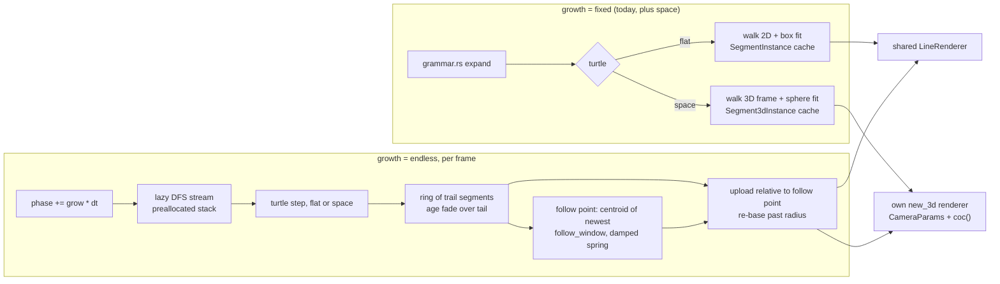

# 0237 — The L-system turtle turns in space, and can grow without end

> **Status:** draft (2026-10-01). Runs after Plan 0236 closes.
> **Created:** 2026-10-01
> **Owner skill(s):** dev, human
> **Related ADRs:** [ADR-0258](../adrs/0258-a-system-takes-depth-through-one-shared-camera-block-and-its-3d-mode-forgoes-what-seg3d-does-not-draw.md) (proposed), [ADR-0257](../adrs/0257-a-shared-camera-projects-3d-primitives-and-depth-of-field-is-a-per-endpoint-circle-of-confusion.md), [ADR-0059](../adrs/0059-line-scenes-colour-along-their-generator-axis.md), [ADR-0019](../adrs/0019-eased-parameters.md)

## TL;DR

Two structural keys on `[generator]`, each defaulting to today's behaviour, so the six shipped
L-system presets and the golden keep their bytes.

- **`turtle = "space"`** makes the `lsystem` walk a **3D turtle**. Beside today's `+` and `-`, `&`
  and `^` pitch, `\` and `/` roll, and `|` turns around. A branching grammar grows a tree in depth,
  seen through the shared camera, with branches far from the focal plane going soft.
- **`growth = "endless"`** makes the figure a **vine that never ends**, in `flat` or `space` mode.
  The turtle walks an effectively infinite derivation at a bindable rate, so it can surge on the beat.
  A fixed ring keeps the most recent segments and fades the oldest. The camera follows the growing
  tip on a damped spring.

## Context & problem

The L-system turtle (`turtle.rs`) holds `x`, `y` and one `heading` angle. It knows `F`, `G`, `f`,
`+`, `-`, `[` and `]`, and every other character is an inert grammar variable. Geometry is expanded,
walked and fitted once per depth at `configure`, up to `MAX_LSYSTEM_DEPTH = 7`, and cached
(`lsystem.rs`). A frame only picks a depth, colours it by generation, transforms it in 2D and keeps
the `draw_progress` prefix.

None of the shipped grammars (`bower`, `coral`, `icecrystal`, `rime`, `sumimono`, `vellum`) or the
golden fixture uses `&`, `^`, `\`, `/` or `|`. So the classic 3D turtle vocabulary (Prusinkiewicz and
Lindenmayer, *The Algorithmic Beauty of Plants*, ch. 1.5) collides with nothing. The fit
(`normalize_fit`) is a 2D bounding box. A figure that turns under a camera needs a fit that does not
depend on the view.

The owner asked for a figure that **never ends**, with the camera following its growth. The cached
model cannot give that. A branching grammar multiplies its segment count every generation, so
"deeper" runs into the segment cap within a few depths. Two endless designs were weighed:

- **A walking vine**, which streams the derivation and keeps a window of it. This plan builds it.
- **A dive along a growing lineage**, where every tip grows at once and the camera zooms forever.
  It is a followup, built only if the vine proves the idea.

## Decision

**Space.** A structural `turtle` key opts in (ADR-0258). In `space` mode the turtle carries a
position and an orthonormal frame (heading, left, up):

- `+` and `-` yaw about up.
- `&` and `^` pitch about left.
- `\` and `/` roll about heading.
- `|` yaws by 180 degrees.

All of them turn by `angle_deg`. The cache holds `Segment3dInstance`s per depth, fitted by
**bounding sphere**. The scene draws them through its own `new_3d` renderer, sized by
`seg3d_segments` (Plan 0236). In `flat` mode the new symbols stay inert. We rejected switching to 3D
whenever a grammar contains a 3D symbol: a structural mode that turns on silently is one a reader
cannot see in the file.

**Endless.** A structural `growth` key opts in. In `endless` mode the scene caches nothing.

- **The stream.** A **lazy depth-first expansion** of the grammar at a fixed internal derivation
  depth produces one turtle symbol at a time. Its stack is preallocated from a bound computed at load.
- **The rate.** The stream advances by an integrated phase of the bindable `grow` (draw steps per
  second), the way the attractor integrates `spin`. The figure grows at the same speed at any display
  rate (ADR-0019), and a binding to onset makes it surge.
- **The ring.** Each draw step lands in a fixed **ring** of `trail` segments. The oldest fade out by
  age over the `tail` fraction.
- **The follow point.** It is the centroid of the newest `follow_window` segments, smoothed by a
  critically damped spring with time constant `follow`. The centroid of a window rather than the tip
  itself, so a `]` that jumps the tip back is averaged rather than chased.
- **Upload.** Every segment is uploaded **relative to the follow point**. In `space` the camera's
  orbit centre is the follow point, with `Camera3d` unchanged. In `flat` the 2D transform pans by it,
  composed with the preset's own `pan`.
- **Re-basing.** When the tip passes a re-base radius, an offset is subtracted from the turtle, its
  stack, the ring and the follow state together. Positions stay small however long the vine runs, and
  every step stays deterministic.

We rejected the dive for now (above), and **deeper cached depths**, which run into the cap within a
few generations. We also rejected a **camera locked to the tip**, which whips at every `]`.

## Architecture diagram



## Implementation phases

### Phase 1 — Walking skeleton: a tree in depth
- **Owner skill:** dev
- **What:** `[generator] turtle = "flat" | "space"`, default `flat`, rejected with both names if
  unknown. A 3D walk with the frame and the five new symbols, emitting `Segment3dInstance`s and the
  per-segment generation depth, index-aligned as `walk_with_depths` does now. A bounding-sphere fit
  per cached depth. The scene owns a `new_3d` renderer sized by `seg3d_segments`, splices
  `CameraParams`, and in `space` mode draws the cached depth through it, with colour by generation
  and the `draw_progress` prefix as in `flat`.
- **Files touched:** `core/src/render/scenes/lines/turtle.rs`, `core/src/render/scenes/lines/lsystem.rs`,
  `core/src/preset/schema/raw/generator.rs`, `core/src/preset/schema/load.rs`,
  `core/tests/fixtures/`, `core/tests/`.
- **Done when:** a `space` fixture with a branching grammar that uses `&` and `/` renders a visible
  tree through `shot`, and two frames at different `yaw` differ. The `lsystem` golden and the six
  shipped presets render byte-identically. A grammar of `F&F&F&F` at 90 degrees in `space` mode walks
  a closed square in a vertical plane, and the same string in `flat` mode walks a straight line of
  four steps.

### Phase 2 — What is inert in space, and the frame's drift
- **Owner skill:** dev
- **What:** declare `rotation`, `mirror_order`, `mirror_reflect`, `stroke_blend` and `scale` inert in
  `space` mode (ADR-0258), and the camera block inert in `flat`. `thickness` is in pixels at the focal
  plane in `space`. After each turn, re-orthonormalize the frame, so a long walk does not let the frame
  drift off orthonormal. This matters most in `endless` mode, which turns without limit.
- **Files touched:** `core/src/render/scenes/lines/lsystem.rs`, `core/src/render/scenes/lines/turtle.rs`,
  `core/tests/`.
- **Done when:** after 100,000 random turns, the frame's three vectors are unit length and mutually
  orthogonal to within `1e-4`. The generated reference names `space` or `flat` against each inert
  param.

### Phase 3 — Caps and the space golden
- **Owner skill:** dev
- **What:** in `space` mode, segments over `seg3d_segments` are counted and reported through
  `CapOverflow::Depth`, as in `flat`. One golden of a `space` tree with a fixed camera and a non-zero
  `aperture`.
- **Files touched:** `core/src/render/scenes/lines/lsystem.rs`, `core/tests/golden.rs`,
  `core/tests/golden/`, `core/tests/fixtures/`.
- **Done when:** the new golden holds on the software adapter. A depth whose walk exceeds the cap
  reports it rather than drawing a truncated tree without notice.

### Phase 4 — Endless: the lazy stream and the ring
- **Owner skill:** dev
- **What:**
  - `[generator] growth = "fixed" | "endless"`, default `fixed`, rejected with both names if unknown.
    In `endless` mode, a lazy depth-first expansion at a fixed internal derivation depth
    (`STREAM_DEPTH`, a named constant whose comment gives the stream length it buys). Its stack is
    preallocated from a bound computed at load: `STREAM_DEPTH + 1` expansion frames, and a bracket
    stack of `STREAM_DEPTH` times the deepest bracket nesting in any successor.
  - The loader computes the stream's length by saturating dynamic programming over the rules. It
    rejects `endless` on a grammar whose stream is shorter than `trail`, naming both numbers, since
    such a grammar would restart before the ring fills.
  - When the stream ends anyway, it restarts from the axiom, and the ring fades on without a pop.
  - The stream advances by `phase += grow * dt`, emitting `floor(phase) - emitted` draw steps, clamped
    to a per-frame ceiling so a huge `grow` cannot stall a frame.
  - Draw steps land in a ring of `trail` segments. `trail` is structural and capped by
    `seg3d_segments` in `space` and by `max_segments` in `flat`, clamped and announced. Each segment's
    alpha falls by age over the oldest `tail` fraction of the ring.
  - Colour stays by generation: the stream's bracket depth, as in `fixed`.
  - `max_depth`, `visible_depth`, `draw_progress`, `mirror_order` and `mirror_reflect` are declared
    inert in `endless`.
  - No `normalize_fit` runs, since the figure has no extent. One draw step is one unit, and `scale`
    sets its size in `flat`.
- **Files touched:** `core/src/render/scenes/lines/grammar.rs`, `core/src/render/scenes/lines/turtle.rs`,
  `core/src/render/scenes/lines/lsystem.rs`, `core/src/preset/schema/raw/generator.rs`,
  `core/src/preset/schema/load.rs`, `core/tests/fixtures/`, `core/tests/`.
- **Done when:**
  - The `lsystem` golden and the six shipped presets are byte-identical.
  - The lazy stream's first 10,000 symbols equal the eager `expand` at depth 7, for every shipped
    grammar and the golden's.
  - After 6,000 frames of `F=F[+F]F[-F]F` at `grow = 20`, the ring holds exactly `trail` segments.
    The capacity of every buffer the scene owns is unchanged since `configure`.
  - The emitted count after 600 frames at `dt = 1/60` and after 1,440 frames at `dt = 1/144` differs
    by at most one.
  - A grammar with no growing rule is rejected under `endless` with its stream length in the message.

### Phase 5 — The camera follows the growth
- **Owner skill:** dev
- **What:**
  - The follow point: the centroid of the newest `follow_window` segments (structural, default 32),
    through a critically damped spring with time constant `follow` (bindable, seconds).
  - Segments are uploaded relative to the follow point, in `flat` through the 2D transform composed
    with the preset's `pan`, and in `space` with the camera orbiting it. `focus` resolves against the
    ring's bounding radius about the follow point.
  - Re-basing: when the tip passes `REBASE_RADIUS` (a named constant, in draw steps), subtract the
    tip's position, rounded to whole steps, from the turtle, the stack, the ring and the spring state
    in one step.
  - In `fixed` mode none of this runs, and the camera orbits the fitted figure as in Phase 1.
- **Files touched:** `core/src/render/scenes/lines/lsystem.rs`, `core/src/render/scenes/lines/turtle.rs`,
  `core/tests/fixtures/`, `core/tests/`.
- **Done when:**
  - Across a `]` that moves the tip by `d`, the follow point never moves more per frame than the
    spring allows at that `follow`, so there is no jump.
  - For a non-branching vine grammar over 6,000 frames at the default `follow`, the tip's projected
    position stays inside the frame, in `flat` at 1280x800 and in `space` at 1920x1080.
  - After a fast-forward of 1,000,000 draw steps, the newest segment's length is `1 ± 1e-5` units,
    so re-basing has kept the precision of step 0.
  - A re-base changes no rendered pixel: the frames before and after it are identical.

### Phase 6 — Endless cost and the endless golden
- **Owner skill:** dev
- **What:**
  - Measure an `endless` `space` fixture at `trail` equal to `seg3d_segments` on `Floor`, at
    `aperture` 0 and past the cap, against the budget Plan 0238 and Plan 0239 use: the blurred frame
    at most twice the sharp one, and inside NFR section 1.
  - Record the CPU cost of `update` at the per-frame emit ceiling too, since the stream and the ring
    upload are CPU work.
  - The whole ring is re-uploaded every frame, because its positions are relative to a moving follow
    point. If that upload is the cost that misses the budget, the log says so, and the followup below
    is the answer.
  - One golden per mode (`flat` and `space`), taken after a fixed number of frames of an `endless`
    vine under a fixed analysis frame.
- **Files touched:** `core/src/render/scenes/lines/lsystem.rs`, `core/src/render/tier.rs`,
  `core/tests/golden.rs`, `core/tests/golden/`, `core/tests/fixtures/`, `core/tests/`.
- **Done when:** both goldens hold on the software adapter. The same analysis frames give the same ring
  after 600 frames. The log carries the measured sharp and blurred frame times, the ratio and the
  `update` time, and the ratio is at most 2 with the blurred time inside NFR section 1, or `trail`'s cap
  is lowered until it is.

### Phase 7 — Documentation and the references
- **Owner skill:** dev
- **What:**
  - The turtle vocabulary paragraph in `presets/README.md`'s `[generator]` section gains the five
    symbols and the `turtle` and `growth` keys, and what each mode makes inert.
  - The generated params block and schemas are regenerated.
  - `turtle.rs`'s module doc lists the space vocabulary.
  - `docs/preset-guide.md` gets one picture of a tree in space and one of an endless vine.
  - The preset-author reference's `## lsystem` section names both modes, their inert params, the facet
    at a right-angle turn, and which grammars suit `endless` (vines and short-branched coral, not
    deep trees, whose `]` sends the tip back a long way).
- **Files touched:** `presets/README.md`, `presets/schema/`, `.taplo.toml`,
  `core/src/render/scenes/lines/turtle.rs`, `docs/preset-guide.md`, `docs/images/`,
  `.claude/skills/preset-author/references/systems.md`.
- **Done when:** the schema and param-reference tests pass on the regenerated files.
  `node scripts/toc.mjs --check`, `node scripts/check-doc-links.mjs` and
  `node scripts/check-reader-prose.mjs` pass.

### Phase 8 — The look, judged
- **Owner skill:** human
- **Blocks merge:** no
- **What:** the owner runs a `space` tree, and an `endless` vine in `flat` and in `space` mode, live
  with the music track. They judge:
  - whether depth reads, and whether the facets at the grammar's turns show;
  - whether the endless vine reads as growth the camera is travelling with, rather than a scroll;
  - whether `grow` bound to onset surges well;
  - whether the vine proves the idea enough to plan the dive.

  Then they hand a brief to `preset-author`.
- **Files touched:** none.
- **Done when:** the owner records a keep, or a list of what is off, and a yes or no on the dive, in
  this plan's log.

## Data shapes

```rust
// illustrative, not the final interface
struct Turtle3d {
    pos: [f32; 3],
    heading: [f32; 3], // H
    left: [f32; 3],    // L
    up: [f32; 3],      // U
}
// + / -  : rotate (H, L) about U by +/- angle
// & / ^  : rotate (H, U) about L by +/- angle
// \ / /  : rotate (L, U) about H by +/- angle
// |      : rotate (H, L) about U by pi

struct Stream {                 // growth = "endless"
    frames: Vec<(u16, u32)>,    // (rule index, position in successor); len <= STREAM_DEPTH + 1
    phase: f64,                 // integrated grow * dt; f64 so a long run keeps whole steps exact
    emitted: u64,
}
struct Follow {
    point: [f32; 3],            // spring position, relative to the current re-base origin
    velocity: [f32; 3],
}
```

Bindable params added in `endless` mode, all Modal: `grow` (draw steps per second), `tail` (fraction
of the ring that fades) and `follow` (spring time constant, seconds). Structural: `growth`, `trail`
and `follow_window`.

## Risks & open questions

- **Facets at turns.** L-system grammars turn by 20 to 90 degrees at every joint, so the missing join
  extension (ADR-0258, Negative) shows at any width above a hairline. If Phase 8 finds it ugly, the
  answer is an ADR on joins for `seg3d`, not a workaround here.
- **Branchy grammars jump.** In a depth-first walk, a `]` at a coarse level returns the tip to a
  branch point that may be far behind, beyond the ring. The camera then glides across empty space at
  spring speed. That is the vine's nature, not a bug. `follow_window` and `follow` soften it, and the
  reference steers authors to vine-like grammars. The dive followup is the design for deep trees.
- **The stream visits the tree in depth-first order, not growth order.** A tree drawn endlessly reads
  as a pen tracing it, not as a plant sprouting. That is the honest difference between the vine and
  the dive. Phase 8 judges whether the vine is enough.
- **The sphere fit makes small trees small** in `fixed` `space` mode. Default `distance` is the lever,
  and the reference says so.
- **`|` in flat mode stays inert**, even though ABOP gives it a meaning in 2D too. Changing it would
  break the "flat means today" rule for any user grammar that uses `|` as a variable.
- **A whole-ring upload per frame** is about 0.9 MB at 20,000 segments, which is fine on the iGPU
  floor. If Phase 6 shows otherwise, write only the new segments into a GPU ring and move the
  follow offset into the camera uniform.

## What this plan does NOT do

- The dive: every tip growing at once, with the camera diving along a lineage forever. That is a
  followup, gated on Phase 8's yes.
- Stochastic, parametric or context-sensitive grammars.
- Tropism, leaf polygons or any non-line primitive.
- Ship presets. That belongs to `preset-author` after Phase 8.

## Implementation log

**Lane:**

| phase | owner | state | commit |
|---|---|---|---|
| 1 — Walking skeleton: a tree in depth | dev | not started | |
| 2 — What is inert in space, and the frame's drift | dev | not started | |
| 3 — Caps and the space golden | dev | not started | |
| 4 — Endless: the lazy stream and the ring | dev | not started | |
| 5 — The camera follows the growth | dev | not started | |
| 6 — Endless cost and the endless golden | dev | not started | |
| 7 — Documentation and the references | dev | not started | |
| 8 — The look, judged | human | not started | |

### Notes

### Close triggers

- **`presets/` touched:**
- **Plan header `Closes:`** none
- **What shipped:**
- **Operator docs touched:**
- **Backlog probes (`node scripts/check-backlog-claims.mjs`):**
- **Full suite:**
- **Outstanding `human` phases:**

## Followups (after this lands)

- `preset-author`: a launch pair of space trees, and an endless vine in each mode.
- **The dive, if Phase 8 says yes.** It is its own plan:
  - Every tip grows at once, the L-system's own parallel semantics, with fractional depth so new
    segments extend smoothly.
  - The camera dives along a seeded lineage of tips.
  - Only the subtrees whose bounds meet the view are expanded. Each symbol's bound at depth `n` is
    precomputed from the rules and contracts geometrically with depth.
  - The world re-roots at the lineage node in view, so precision never runs out.
- An incremental GPU ring with the follow offset in the camera uniform, if Phase 6 shows the
  whole-ring upload is what costs.
