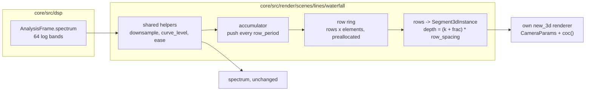

# 0238 — The waterfall system

> **Status:** in-progress (2026-10-02). Runs after Plan 0236 closes.
> **Created:** 2026-10-01
> **Owner skill(s):** dev, human
> **Related ADRs:** [ADR-0258](../adrs/0258-a-system-takes-depth-through-one-shared-camera-block-and-its-3d-mode-forgoes-what-seg3d-does-not-draw.md) (proposed), [ADR-0180](../adrs/0180-a-mathematical-world-joins-a-system-as-a-family-and-a-structural-parameter-is-held.md), [ADR-0040](../adrs/0040-spectrum-level-curve-applies-before-the-easing.md), [ADR-0019](../adrs/0019-eased-parameters.md)

## TL;DR

A new system, **`waterfall`**, draws the recent spectrum as a **landscape**. Each row is one moment's
spectrum as a polyline across the frequency axis. Rows recede from the camera as they age, so the
music's last few seconds lie on the ground in perspective, the near edge sharp and the far rows
going soft. Rows are pushed on a fixed period rather than once per frame, so the landscape scrolls at
the same speed at any display rate.

## Context & problem

The `spectrum` system (`lines/spectrum.rs`) draws one moment: the 64 log-spaced bands of
`AnalysisFrame::spectrum`, downsampled to `elements`, shaped by `curve` and eased by `[spectrum]
smoothing` (ADR-0040's order). It draws as bars, a polyline or a radial ring, through the shared 2D
`LineRenderer`, and it holds no history beyond the eased envelope.

A landscape of the last few seconds needs three things the spectrum system has none of. Under
ADR-0180 rule 1, each of them makes it a new `SystemKind` rather than a fourth layout:

- **Its own state:** a ring of past rows.
- **Its own pass shape:** `seg3d` through a scene-owned renderer.
- **A param surface that would be inert on the host:** the camera block and the row params, on
  `bars`, `polyline` and `radial_ring`.

The update runs once per displayed frame on the measured `dt` (`evaluate.rs`). One row per frame
would make the row spacing depend on the display rate, which ADR-0019 forbids.

## Decision

`SystemKind::Waterfall`, with a structural `[waterfall]` table: `elements` (up to 64), `rows`
(capped so `rows * (elements - 1)` fits `seg3d_segments`) and `row_period` in seconds.

- **Shared helpers.** `downsample`, `curve_level` and the easing step become `pub(crate)` helpers
  that `spectrum` and `waterfall` both call, so `spectrum`'s bytes do not move.
- **Row cadence.** A time accumulator pushes one eased row per `row_period` into a preallocated
  ring. The fraction of a period since the last push offsets every row's depth, so the scroll is
  continuous and a push moves nothing.
- **Row geometry.** Row `k` lies at depth `k * row_spacing`, with height `height * level`, and is
  drawn as `elements - 1` segments.
- **Colour.** The palette runs along frequency, as on `spectrum` (ADR-0059). Age dims a row by a
  bindable `fade`.
- **Camera.** The camera block is spliced (ADR-0258), and its default pitch looks down the
  landscape.

We rejected a `layout = "waterfall"` on `spectrum` (ADR-0180 rule 1) and one row per frame
(ADR-0019).

## Architecture diagram



## Implementation phases

### Phase 1 — Walking skeleton: a scrolling landscape
- **Owner skill:** dev
- **What:** move `downsample`, `curve_level` and the easing step to `pub(crate)` helpers that
  `spectrum` calls unchanged. Add `SystemKind::Waterfall`, its `TABLE` row, `[waterfall]` (`elements`,
  `rows`, `row_period`) and the scene:
  - a ring preallocated at `configure` and cleared on `configure` and `resize`
  - the accumulator push
  - row geometry at continuous depth through a `new_3d` renderer sized by `seg3d_segments`
  - `CameraParams` spliced, with params `height`, `row_spacing`, `fade`, `line_width`, `brightness`,
    `glow`, `hue`, `hue_spread` and the palette set, each with its `group` and `main` (ADR-0256)

  Add the hot-path pragma and the hygiene scan entry.
- **Files touched:** `core/src/render/scenes/lines/spectrum.rs`, `core/src/render/scenes/lines/waterfall.rs`
  (new), `core/src/render/scenes/lines/mod.rs`, `core/src/render/scenes/mod.rs`,
  `core/src/preset/schema/system.rs`, `core/src/preset/schema/raw/waterfall.rs` (new),
  `core/src/preset/schema/raw/mod.rs`, `core/src/preset/schema/load.rs`, `core/tests/suite/hygiene.rs`,
  `core/tests/fixtures/`, `core/tests/`.
- **Done when:** a fixture renders a visible landscape through `shot` under a varying synthetic
  spectrum. The `spectrum` golden and its fixtures are byte-identical. Stepping the same input
  sequence at `dt = 1/60` for 120 frames and at `dt = 1/144` for 288 frames leaves the same rows in
  the ring, with the same depth offset to within one part in a thousand of `row_spacing`.

### Phase 2 — Caps, the golden and determinism
- **Owner skill:** dev
- **What:** `rows` over `seg3d_segments / (elements - 1)` is clamped and announced (ADR-0045). A golden
  with a fixed camera, a non-zero `aperture` and a ring filled from `fixed_frame_spectrum()` plus a
  deterministic ramp, so the rows differ. Run the `animation` and `reactivity` gates on the fixture,
  and find out which branch the system passes on. A system that is still under constant input is the
  case `spectrum` is already in, so the waterfall follows `spectrum`'s precedent rather than inventing
  autonomous motion.
  - **The cost probe.** The waterfall's segments are not the short segments `seg3d_segments` was
    measured on (Plan 0236 Phase 4), and two shapes of its frame are its own:
    - **long near rows:** at a low `pitch` the nearest rows span the whole frame width, so one blurred
      row fills a band across the screen;
    - **horizon pile-up:** at `pitch` near 0, the far rows converge into a few pixels above the
      horizon, and additive overdraw stacks there.

    Two fixtures pin those shapes, each at `Floor`'s cap (`rows` at the clamp, `elements = 64`),
    `aperture` past the cap, and 1920x1080 in the release profile:
    - `pitch = 0.15` with `focus` at the far edge, so the near rows are the blurred ones;
    - `pitch = 0.02` with `focus` at the near edge, so the pile-up is blurred.

    Each runs at `aperture = 0` and at the worst case in the same run, on the same adapter (ADR-0074).
    The budget is the one Plan 0239 holds the swarm to: the blurred frame at most twice the sharp one,
    and inside NFR section 1.
  - **The fallback ladder,** stopping at the first rung that meets the budget, with each rung's
    measurement in the log:
    1. Skip a row whose `fade` has brought its light below one 8-bit step. A dark additive row still
       costs fill, so it is culled before upload rather than drawn at zero.
    2. A waterfall-only ceiling on `rows`, `waterfall_rows` in `TierConfig`, below what
       `seg3d_segments` allows. This keeps the waterfall's cost from lowering the shared cap that the
       curve and turtle systems size from.
    3. Lower `seg3d_segments` itself, announced, and say in the log which other systems that affects.
- **Files touched:** `core/src/render/scenes/lines/waterfall.rs`, `core/src/render/tier.rs`,
  `core/tests/golden.rs`, `core/tests/golden/`, `core/tests/fixtures/`, `core/tests/`.
- **Done when:**
  - The golden holds on the software adapter. An over-cap `rows` is clamped with a notice.
  - The same seed and analysis frames give the same ring after 600 frames.
  - The `animation`, `reactivity`, `sanity` and `distinctness` suites pass with the system in their
    rosters.
  - The log carries both probes' sharp and blurred frame times on `Floor`, the rung the ladder
    stopped at, and the ratio. Each ratio is at most 2, and each blurred time is inside NFR section 1.

### Phase 3 — Documentation and the references
- **Owner skill:** dev
- **What:**
  - `docs/presets.md` gains the `[waterfall]` table and a system-table row.
  - The generated params block, `presets/schema/` and `.taplo.toml` are regenerated.
  - `docs/preset-guide.md` gets one picture.
  - `docs/on-device-validation.md` gains the system.
  - The preset-author reference gains a `## waterfall` section (ADR-0234), with working ranges for
    `row_period`, `rows` and `aperture`.
- **Files touched:** `docs/presets.md`, `presets/README.md`, `presets/schema/`, `.taplo.toml`,
  `docs/preset-guide.md`, `docs/images/`, `docs/on-device-validation.md`,
  `.claude/skills/preset-author/references/systems.md`.
- **Done when:** the schema and param-reference tests pass on the regenerated files.
  `node scripts/toc.mjs --check`, `node scripts/check-doc-links.mjs`,
  `node scripts/check-reader-prose.mjs` and `node scripts/check-system-counts.mjs` pass.

### Phase 4 — The look, judged
- **Owner skill:** human
- **Blocks merge:** no
- **What:** the owner runs the fixture live with the music track at 60 Hz and at the display's native
  rate. They judge whether the scroll reads as time passing, whether the far rows' softness reads as
  distance, and whether the frame rate holds. Then they hand a brief to `preset-author`.
- **Files touched:** none.
- **Done when:** the owner records a keep, or a list of what is off, in this plan's log.

## Data shapes

```rust
// illustrative, not the final interface
pub struct WaterfallConfig {      // [waterfall], structural
    pub elements: u32,            // 2..=64, bands across a row
    pub rows: u32,                // capped by seg3d_segments / (elements - 1)
    pub row_period: f32,          // seconds between pushes
}
struct Ring {
    levels: Vec<f32>,             // rows * elements, preallocated at configure
    head: usize,
    since_push: f32,              // seconds; frac = since_push / row_period
}
```

## Risks & open questions

- **The name.** `waterfall` is the audio-engineering term for this display. `terrain` and `landscape`
  are the alternatives. Renaming before Phase 1 lands costs nothing, and after it costs a schema
  regeneration.
- **A long `row_period` reads as a stutter.** The continuous offset hides the push. If the eased level
  of the newest row jumps at a push, the near edge pops. The newest row could draw the live eased level
  rather than the pushed one. Phase 1 decides on sight and says which in a comment.
- **Fill cost.** A near row at a low pitch is long on screen, a blurred far field is wide, and the far
  rows pile up above the horizon. The shared cap was measured on curves (Plan 0236), whose segments are
  short. Phase 2 probes both shapes. Its ladder culls dark rows and caps `waterfall_rows` before it
  touches `seg3d_segments`, so the waterfall's cost lands on the waterfall and not on the curve and
  turtle systems.
- **The animation gate.** Constant input fills the ring with identical rows, and the scroll then moves
  nothing visible. Phase 2 checks how `spectrum` passes that gate today and follows it.

## What this plan does NOT do

- Add a waterfall layout to `spectrum`, or change `spectrum` at all beyond extracting helpers.
- Fill the area under a row (a solid terrain). That is a different primitive.
- Ship presets. That belongs to `preset-author` after Phase 4.

## Implementation log

**Lane:** `plan-0238-the-waterfall-system`, worktree `/home/igor/Work/rlx-plan-0238`

| phase | owner | state | commit |
|---|---|---|---|
| 1 — Walking skeleton: a scrolling landscape | dev | done | 76976a1e |
| 2 — Caps, the golden and determinism | dev | done | committed with this row |
| 3 — Documentation and the references | dev | not started | |
| 4 — The look, judged | human | not started | |

### Notes

- Phase 1: `downsample` and `curve_level` were already `pub(crate)`. The new shared step is
  `shape_and_ease` in `spectrum.rs`, which `spectrum`'s `update` now calls; `CURVE_MIN` and
  `CURVE_MAX` became `pub(crate)` so the waterfall's `curve` spec shares their range.
- Phase 1 adds surface the plan's param list does not name: `curve` (so the shared `curve_level`
  step has a lever), `zoom`, `pan_x` and `pan_y` (the camera block's frame takes them, as on the
  plexus), and a `smoothing` key in `[waterfall]` (so the shared easing step has a constant). The
  palette set is `saturation`, `palette_mix` and `palette_steps`, as on the plexus.
- Phase 1, the risk on a long `row_period`: the front row is the live eased level, drawn every
  frame at depth 0; a pushed row is born on it and fades in over its first period (`alpha = frac`),
  and the oldest row of a full ring fades out over its last. So `rows` counts the live row, and the
  ring holds `rows - 1`. Decided from `shot` renders of the fixture, not live.
- Phase 1: "cleared on `configure` and `resize`" is read as the scene's own buffer-sizing step, as
  `spectrum`'s `resize` is. A render-target resize does not clear the ring.
- Phase 1: the 60/144 Hz test runs at `row_period = 5/12` s, a whole number of frames at both
  rates, with the band array held over 1/12 s windows. A period that is not a whole number of
  frames at both rates pushes at different instants on the two rates and samples different levels;
  that is the push cadence's nature, not a tolerance. Two seconds is 4.8 periods, so the compared
  offset is 0.8 of a row, not zero.
- Phase 1: `rows` past `seg3d_segments / (elements - 1)` is clamped silently here; Phase 2
  announces it.
- Phase 1 touched files outside its list, because the build or a gate needs them:
  `core/src/preset/schema/raw/preset.rs` (the `[waterfall]` field and key in the root and
  `[layer]`), `core/src/preset/schema/export.rs` (`TABLES`), `core/src/preset/schema/tests.rs`
  (descriptor pairs), `core/src/render/mod.rs` (`active_family_key`). It regenerates
  `presets/README.md`, `presets/schema/`, `presets/preset.schema.json`, `.taplo.toml` and
  `docs/specs/player-schema.json`, because the generated-file tests fail otherwise. And
  `hygiene::every_system_has_a_gallery_image` needs a gallery picture, so it adds the teaching
  preset `docs/examples/waterfall/landscape.toml`, its `scripts/docs-shots.mjs` entry, and
  `docs/images/gallery/waterfall.png`, rendered on RADV with that entry's exact `shot` command.
- Phase 1's `shot` check: `shot --preset-file core/tests/fixtures/waterfall.toml --signal
  dynamic:110 --size 640x360` drew the landscape changing across the filmstrip.
- Phase 1's spectrum check: `core/tests/golden/spectrum*.png` and the spectrum fixtures are not
  touched. The `spectrum` golden reads mean 0.0000, outlier 1 on llvmpipe; WARP was not run.
- Phase 1 adds the rostered golden fixture `core/tests/fixtures/waterfall.toml` but no baseline;
  `golden` fails on the missing `waterfall.png` until Phase 2 writes it.
- Phase 2's cost probe: `shot --report family=waterfall --tier floor --presets <dir> --size
  1920x1080`, release profile, on AMD Radeon Graphics (RADV RENOIR) iGPU, Mesa 26.2.2, all four in
  one run. Scratch presets under `target/waterfall-cost/`: `elements 64`, `rows 126` (Floor's
  clamp), `line_width 8`, `fade 0`, `aperture 0` against `aperture 40` (past the 12 px cap).
  Long near rows (`pitch 0.15`, `distance 1.5`, `focus 1`): 0.690 ms sharp, 0.821 ms blurred, ratio
  1.19. Horizon pile-up (`pitch 0.02`, `focus 0`): 0.911 ms sharp, 1.407 ms blurred, ratio 1.54.
  NFR section 1's budget is 16.67 ms. The ladder stopped before its first rung; nothing was culled
  and no cap moved. 960x540 renders of the two blurred probes show the near rows filling the frame
  edge to edge and the far rows piled into a band above the horizon.
- Phase 2 announces the row clamp through a new `OverflowContext::Rows(asked, segments per row)`,
  with its onset and recovery sentences and Rich's `seg3d_segments` in `top_tier_lifts`. That is an
  edit to `core/src/render/scenes/mod.rs`, outside the phase list; no existing context words a row
  count. The `CapOverflow`'s `cap` stays in segments so the Rich remedy compares like with like;
  the sentences derive the rows kept from it.
- Phase 2's branch finding: a full ring under constant input reads silent 0.0000, driven 0.3883,
  so it passes on the driven branch, `spectrum`'s case. The golden fixture itself passes on the
  silent branch (silent 0.1092, driven 0.4235), because its 23-row ring is still filling between
  frames 24 and 48 and the flat rows it adds read as motion. A shipped preset with a ring that
  fills slower than 0.4 s would pass the same way. `the_waterfall_passes_on_the_driven_branch_once_its_ring_is_full`
  pins both readings. Reactivity on the fixture: bass 0.0236, mid 0.0154, treb 0.0081, onset 0.0254.
- Phase 2's goldens, `waterfall.png` (the roster's, under the one constant frame) and
  `waterfall_ramp.png` (its own test, `fixed_frame_spectrum()` scaled by a 0.2-to-1 per-frame ramp
  through `capture_stream`), were written on llvmpipe, not WARP, through an uncommitted local change
  to `golden.rs` that wrote only a missing baseline, as Plans 0235 and 0236 did. It was reverted
  before the commit; no existing baseline was rewritten. Both read mean 0.0000, outlier 0 on
  llvmpipe afterwards. Windows CI's golden job is their first WARP reading, and the first WARP
  reading of the roster captures after `waterfall`, which now builds a `seg3d` renderer.
- Phase 2: `animation`, `reactivity`, `sanity` and `distinctness` were run on the waterfall's
  entries and on every non-batch test of the last two, not on the shipped-library batch sweeps;
  the system ships no preset, so the sweeps hold none of it. The full sweeps are the pre-review
  gate's.

### Close triggers

- **`presets/` touched:**
- **Plan header `Closes:`** none
- **What shipped:**
- **Operator docs touched:**
- **Backlog probes (`node scripts/check-backlog-claims.mjs`):**
- **Full suite:**
- **Outstanding `human` phases:**

## Followups (after this lands)

- `preset-author`: a launch pair, one calm and one beat-driven.
