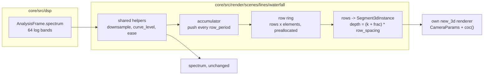

# 0238 — The waterfall system

> **Status:** draft (2026-10-01). Runs after Plan 0236 closes.
> **Created:** 2026-10-01
> **Owner skill(s):** dev, human
> **Related ADRs:** [ADR-0258](../adrs/0258-a-system-takes-depth-through-one-shared-camera-block-and-its-3d-mode-forgoes-what-seg3d-does-not-draw.md) (proposed), [ADR-0180](../adrs/0180-a-mathematical-world-joins-a-system-as-a-family-and-a-structural-parameter-is-held.md), [ADR-0040](../adrs/0040-spectrum-level-curve-applies-before-the-easing.md), [ADR-0019](../adrs/0019-eased-parameters.md)

## TL;DR

A new system, **`waterfall`**, draws the recent spectrum as a **landscape**. Each row is one moment's
spectrum as a polyline across the frequency axis. Rows recede from the camera as they age, so the
music's last few seconds lie on the ground in perspective, the near edge sharp and the far rows
going soft. Rows are pushed on a fixed period rather than once per frame, so the landscape scrolls at
the same speed at any display rate.

## Context & problem

The `spectrum` system (`lines/spectrum.rs`) draws one moment: the 64 log-spaced bands of
`AnalysisFrame::spectrum`, downsampled to `elements`, shaped by `curve` and eased by `[spectrum]
smoothing` (ADR-0040's order). It draws as bars, a polyline or a radial ring, through the shared 2D
`LineRenderer`, and it holds no history beyond the eased envelope.

A landscape of the last few seconds needs three things the spectrum system has none of. Under
ADR-0180 rule 1, each of them makes it a new `SystemKind` rather than a fourth layout:

- **Its own state:** a ring of past rows.
- **Its own pass shape:** `seg3d` through a scene-owned renderer.
- **A param surface that would be inert on the host:** the camera block and the row params, on
  `bars`, `polyline` and `radial_ring`.

The update runs once per displayed frame on the measured `dt` (`evaluate.rs`). One row per frame
would make the row spacing depend on the display rate, which ADR-0019 forbids.

## Decision

`SystemKind::Waterfall`, with a structural `[waterfall]` table: `elements` (up to 64), `rows`
(capped so `rows * (elements - 1)` fits `seg3d_segments`) and `row_period` in seconds.

- **Shared helpers.** `downsample`, `curve_level` and the easing step become `pub(crate)` helpers
  that `spectrum` and `waterfall` both call, so `spectrum`'s bytes do not move.
- **Row cadence.** A time accumulator pushes one eased row per `row_period` into a preallocated
  ring. The fraction of a period since the last push offsets every row's depth, so the scroll is
  continuous and a push moves nothing.
- **Row geometry.** Row `k` lies at depth `k * row_spacing`, with height `height * level`, and is
  drawn as `elements - 1` segments.
- **Colour.** The palette runs along frequency, as on `spectrum` (ADR-0059). Age dims a row by a
  bindable `fade`.
- **Camera.** The camera block is spliced (ADR-0258), and its default pitch looks down the
  landscape.

We rejected a `layout = "waterfall"` on `spectrum` (ADR-0180 rule 1) and one row per frame
(ADR-0019).

## Architecture diagram



## Implementation phases

### Phase 1 — Walking skeleton: a scrolling landscape
- **Owner skill:** dev
- **What:** move `downsample`, `curve_level` and the easing step to `pub(crate)` helpers that
  `spectrum` calls unchanged. Add `SystemKind::Waterfall`, its `TABLE` row, `[waterfall]` (`elements`,
  `rows`, `row_period`) and the scene:
  - a ring preallocated at `configure` and cleared on `configure` and `resize`
  - the accumulator push
  - row geometry at continuous depth through a `new_3d` renderer sized by `seg3d_segments`
  - `CameraParams` spliced, with params `height`, `row_spacing`, `fade`, `line_width`, `brightness`,
    `glow`, `hue`, `hue_spread` and the palette set, each with its `group` and `main` (ADR-0256)

  Add the hot-path pragma and the hygiene scan entry.
- **Files touched:** `core/src/render/scenes/lines/spectrum.rs`, `core/src/render/scenes/lines/waterfall.rs`
  (new), `core/src/render/scenes/lines/mod.rs`, `core/src/render/scenes/mod.rs`,
  `core/src/preset/schema/system.rs`, `core/src/preset/schema/raw/waterfall.rs` (new),
  `core/src/preset/schema/raw/mod.rs`, `core/src/preset/schema/load.rs`, `core/tests/suite/hygiene.rs`,
  `core/tests/fixtures/`, `core/tests/`.
- **Done when:** a fixture renders a visible landscape through `shot` under a varying synthetic
  spectrum. The `spectrum` golden and its fixtures are byte-identical. Stepping the same input
  sequence at `dt = 1/60` for 120 frames and at `dt = 1/144` for 288 frames leaves the same rows in
  the ring, with the same depth offset to within one part in a thousand of `row_spacing`.

### Phase 2 — Caps, the golden and determinism
- **Owner skill:** dev
- **What:** `rows` over `seg3d_segments / (elements - 1)` is clamped and announced (ADR-0045). A golden
  with a fixed camera, a non-zero `aperture` and a ring filled from `fixed_frame_spectrum()` plus a
  deterministic ramp, so the rows differ. Run the `animation` and `reactivity` gates on the fixture,
  and find out which branch the system passes on. A system that is still under constant input is the
  case `spectrum` is already in, so the waterfall follows `spectrum`'s precedent rather than inventing
  autonomous motion.
- **Files touched:** `core/src/render/scenes/lines/waterfall.rs`, `core/src/render/tier.rs`,
  `core/tests/golden.rs`, `core/tests/golden/`, `core/tests/fixtures/`, `core/tests/`.
- **Done when:** the golden holds on the software adapter. An over-cap `rows` is clamped with a notice.
  The same seed and analysis frames give the same ring after 600 frames. The `animation`, `reactivity`,
  `sanity` and `distinctness` suites pass with the system in their rosters.

### Phase 3 — Documentation and the references
- **Owner skill:** dev
- **What:**
  - `docs/presets.md` gains the `[waterfall]` table and a system-table row.
  - The generated params block, `presets/schema/` and `.taplo.toml` are regenerated.
  - `docs/preset-guide.md` gets one picture.
  - `docs/on-device-validation.md` gains the system.
  - The preset-author reference gains a `## waterfall` section (ADR-0234), with working ranges for
    `row_period`, `rows` and `aperture`.
- **Files touched:** `docs/presets.md`, `presets/README.md`, `presets/schema/`, `.taplo.toml`,
  `docs/preset-guide.md`, `docs/images/`, `docs/on-device-validation.md`,
  `.claude/skills/preset-author/references/systems.md`.
- **Done when:** the schema and param-reference tests pass on the regenerated files.
  `node scripts/toc.mjs --check`, `node scripts/check-doc-links.mjs`,
  `node scripts/check-reader-prose.mjs` and `node scripts/check-system-counts.mjs` pass.

### Phase 4 — The look, judged
- **Owner skill:** human
- **Blocks merge:** no
- **What:** the owner runs the fixture live with the music track at 60 Hz and at the display's native
  rate. They judge whether the scroll reads as time passing, whether the far rows' softness reads as
  distance, and whether the frame rate holds. Then they hand a brief to `preset-author`.
- **Files touched:** none.
- **Done when:** the owner records a keep, or a list of what is off, in this plan's log.

## Data shapes

```rust
// illustrative, not the final interface
pub struct WaterfallConfig {      // [waterfall], structural
    pub elements: u32,            // 2..=64, bands across a row
    pub rows: u32,                // capped by seg3d_segments / (elements - 1)
    pub row_period: f32,          // seconds between pushes
}
struct Ring {
    levels: Vec<f32>,             // rows * elements, preallocated at configure
    head: usize,
    since_push: f32,              // seconds; frac = since_push / row_period
}
```

## Risks & open questions

- **The name.** `waterfall` is the audio-engineering term for this display. `terrain` and `landscape`
  are the alternatives. Renaming before Phase 1 lands costs nothing, and after it costs a schema
  regeneration.
- **A long `row_period` reads as a stutter.** The continuous offset hides the push. If the eased level
  of the newest row jumps at a push, the near edge pops. The newest row could draw the live eased level
  rather than the pushed one. Phase 1 decides on sight and says which in a comment.
- **Fill cost.** A near row at a low pitch is long on screen, and a blurred far field is wide. The
  shared cap was measured on curves (Plan 0236), whose segments are short. If this system's cost per
  segment is much higher, it lowers `seg3d_segments` for every system, and the log says so.
- **The animation gate.** Constant input fills the ring with identical rows, and the scroll then moves
  nothing visible. Phase 2 checks how `spectrum` passes that gate today and follows it.

## What this plan does NOT do

- Add a waterfall layout to `spectrum`, or change `spectrum` at all beyond extracting helpers.
- Fill the area under a row (a solid terrain). That is a different primitive.
- Ship presets. That belongs to `preset-author` after Phase 4.

## Implementation log

**Lane:**

| phase | owner | state | commit |
|---|---|---|---|
| 1 — Walking skeleton: a scrolling landscape | dev | not started | |
| 2 — Caps, the golden and determinism | dev | not started | |
| 3 — Documentation and the references | dev | not started | |
| 4 — The look, judged | human | not started | |

### Notes

### Close triggers

- **`presets/` touched:**
- **Plan header `Closes:`** none
- **What shipped:**
- **Operator docs touched:**
- **Backlog probes (`node scripts/check-backlog-claims.mjs`):**
- **Full suite:**
- **Outstanding `human` phases:**

## Followups (after this lands)

- `preset-author`: a launch pair, one calm and one beat-driven.
