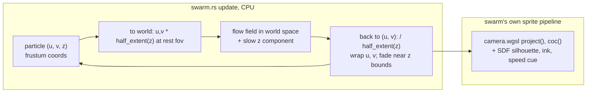

# 0239 — The swarm moves into a real camera

> **Status:** in-progress
> **Created:** 2026-10-01
> **Owner skill(s):** dev, human
> **Related ADRs:** [ADR-0259](../adrs/0259-the-swarm-projects-through-the-shared-camera-in-a-frustum-shaped-torus.md) (proposed), [ADR-0044](../adrs/0044-swarm-world-is-a-25d-torus-sized-from-the-target.md), [ADR-0258](../adrs/0258-a-system-takes-depth-through-one-shared-camera-block-and-its-3d-mode-forgoes-what-seg3d-does-not-draw.md) (proposed), [ADR-0257](../adrs/0257-a-shared-camera-projects-3d-primitives-and-depth-of-field-is-a-per-endpoint-circle-of-confusion.md), [ADR-0037](../adrs/0037-internal-grid-is-a-resolution-not-a-shape.md)

## TL;DR

The swarm's 2.5D model is replaced (ADR-0259). Particles live in a **frustum-shaped torus**, move in
depth as well as across the screen, and project through the shared camera. A focal layer of the swarm
can be sharp while the layers in front and behind soften, and far particles cross the screen more
slowly than near ones because they are farther away, not because a scale factor says so. Silhouettes,
ink mode and the speed cue keep working. Every swarm preset changes look, so its re-tune is part of
this plan's merge rather than a followup.

## Context & problem

ADR-0044 gave each particle a fixed `z` that drives four hand-made cues: sprite scale, brightness,
parallax against `zoom` and `pan`, and a flow-phase offset. The simulation is CPU-side
(`swarm.rs` `update`), 10,000 particles on `Floor` and 30,000 on `Rich`, uploaded each frame through
the swarm's own `marks::InstancedQuads` pipeline and WGSL. The world is a 2D torus sized from the
target's aspect times a margin of 1.25, so the wrap seam sits off-screen.

The owner chose to replace that model with a real camera rather than add a mode beside it. ADR-0259
records the design and its alternatives. The two goldens are `swarm` and `swarm_shaped`. The swarm
also backs `swarm_lit_backdrop`, `backdrop_band` and `backdrop_ramp`, and `mark_cost` measures 10,000
sprites. Three presets ship: `braid`, `maelstrom` and `murmuration`.

## Decision

Each particle holds `(u, v, z)` in frustum coordinates. The flow is evaluated in world space and
converted back by the frustum half-extent at the particle's depth. `z` moves on a slow flow component
and fades near the slab bounds. The swarm's sprite WGSL prepends `camera.wgsl` and uses `project()`
and `coc()`. The swarm splices a **subset** of the camera block: `yaw` and `pitch` bounded to a sway
the margin covers, plus `fov`, `focus` and `aperture`, with no `distance`. `depth_fade` replaces the
brightness ramp, with a default that reproduces it. All of this is ADR-0259's Decision. We rejected
an opt-in mode, a world-space box, `quad3d` sprites and proximity links (ADR-0259, Alternatives A
to D).

## Architecture diagram



## Implementation phases

### Phase 1 — Walking skeleton: the swarm in a camera
- **Owner skill:** dev
- **What:** the frustum-coordinate particle state, the world-space flow with its `z` component, the
  wrap in `u` and `v`, and the fade at the slab bounds. Prepend `camera.wgsl` to the swarm's WGSL,
  project each sprite through `project()`, and size it by perspective. Splice the camera-block subset,
  and retire the `DEPTH_*` scale and parallax cues. Keep `depth_fade` at a default that reproduces the
  0.45 to 1.05 ramp. The aspect comes from the render target (ADR-0037), not from the torus.
- **Files touched:** `core/src/render/scenes/swarm.rs`, `core/src/render/scenes/swarm/tests.rs`,
  `core/src/render/camera.rs`, `core/tests/`.
- **Done when:** a swarm fixture renders through `shot` and two frames a second apart differ. Over
  600 frames of the default flow, no particle's projected centre falls inside the frame within one
  sprite radius of the wrap seam, at 1280x800 and at 1920x1080 (ADR-0037's disagreeing pair). The
  mean screen speed of particles in the far third of the slab is lower than in the near third, under
  the same flow.

### Phase 2 — Depth of field on the swarm's sprites
- **Owner skill:** dev
- **What:** the sprite vertex stage takes `coc()` at its depth, grows the sprite by `(r + coc) / r`
  and dims it by the area factor, as on `quad3d` (ADR-0257). The SDF silhouette is sampled at the
  grown radius with its edge softness widened by the CoC, so a blurred polygon reads as a soft polygon.
  Ink mode and the speed cue multiply as before.
- **Files touched:** `core/src/render/scenes/swarm.rs`, `core/src/render/scenes/swarm/tests.rs`,
  `core/tests/`.
- **Done when:** `aperture = 0` renders identically to Phase 1. With `aperture > 0`, sprites far from
  the focal depth cover more pixels and have a lower peak than sprites at it, in one rendered frame. A
  `shape = "2"` sprite at the focal plane keeps its polygon edge.

### Phase 3 — Caps, cost and the goldens
- **Owner skill:** dev
- **What:** blur grows a sprite's **area**, so a 3 px sprite at a 12 px CoC fills 25 times its sharp
  pixels. At 10,000 sprites that is the one cost in Plans 0236 to 0240 that may not fit `Floor`.
  Plexus's blur added 45 to 65 percent (Plan 0235 Phase 6), but on 600 nodes. This phase measures
  the cost against a stated budget and walks a fixed fallback ladder until the budget holds.
  - **The probe.** A worst-case fixture: `Floor`'s 10,000 sprites, `aperture` past the cap, `focus`
    at the near slab bound so most of the population is defocused, the `trails` post stage on as
    every shipped preset has it, 1920x1080, release profile. It runs at `aperture = 0` and at the
    worst case, in the same run on the same adapter. Extend `mark_cost` with that pair, in the
    measurement shape `mark_cost` already uses (ADR-0071: it names its machine and skips elsewhere).
  - **The budget.** The blurred frame costs at most **twice** the sharp one, and the blurred frame
    sits inside NFR section 1's 16.67 ms with the headroom NFR section 1 already records for the
    shipped set. The two terms of the ratio are the same quantity, from one fixture, one run and one
    adapter (ADR-0074).
  - **The fallback ladder**, in this order, stopping at the first rung that meets the budget, with
    each rung's measurement in the log:
    1. A swarm-only CoC ceiling, `swarm_max_coc_px` in `TierConfig`, below `max_coc_px`. Start
       `Floor` at 6 px. The clamp is announced through `OverflowContext::Blur`, as the shared cap is.
    2. A cheap fragment path for heavily blurred sprites. Past a CoC of about twice the sprite's
       radius, a polygon or star silhouette is visually a disc. The fragment then evaluates an
       analytic radial falloff instead of the SDF. The two paths are cross-faded over a band of
       `coc / r`, so no sprite pops as it crosses the threshold, and a test sweeps `coc` through the
       band and finds no step in a sprite's summed light.
    3. Lower `swarm_particles` on `Floor`, announced. This rung changes the look, so taking it is
       written in the log for Phase 6's judgement, never taken silently.
  - **`Rich`.** Measure `Rich`'s 30,000 sprites the same way on the reference machine's discrete GPU
    (Plan 0218 Phase 2), and give `Rich` its own `swarm_max_coc_px`. If no discrete GPU is reachable
    from the session, the log says `Rich` is unmeasured, as Plan 0235's did, rather than inventing a
    value.
  - Then re-run the `swarm` and `swarm_shaped` goldens and the backdrop fixtures' tests on whatever
    the ladder settled. Do not re-bless: baselines are blessed on DX12 WARP only, and that is Phase 7.
- **Files touched:** `core/src/render/tier.rs`, `core/src/render/scenes/swarm.rs`,
  `core/src/render/scenes/swarm/tests.rs`, `core/tests/mark_cost.rs`, `core/tests/golden/`,
  `core/tests/fixtures/`, `core/src/render/post/tests.rs`, `core/tests/`.
- **Done when:**
  - The log carries the probe's sharp and blurred frame times on `Floor`, the rung the ladder stopped
    at, and the ratio. The ratio is at most 2, and the blurred time is inside NFR section 1.
  - `Rich` carries a measured value, or the log says it is unmeasured.
  - The CoC never exceeds `swarm_max_coc_px` at any `aperture`.
  - If rung 2 was built, its cross-fade test shows no step.
  - The golden suite passes on the session's adapter, and the log says whether `swarm` and
    `swarm_shaped` moved, quoting the off-WARP drift report. The backdrop tests pass, or each one
    that changed is named in the log with the reason.

### Phase 4 — The shipped presets keep rendering
- **Owner skill:** dev
- **What:** bring the three shipped swarm presets onto the new surface mechanically. Remove bindings to
  params that no longer exist, and replace the seam-clearance comment in `swarm_braid.toml` with one
  that describes the frustum torus. Do not judge or re-tune the look; that is Phase 6's and the
  content lane's.
- **Files touched:** `presets/swarm_braid.toml`, `presets/swarm_maelstrom.toml`,
  `presets/swarm_murmuration.toml`.
- **Done when:** the `sanity`, `animation`, `reactivity` and `distinctness` suites pass on all three.
  `git grep -c "near depth layer" -- presets/swarm_braid.toml` finds no description of the retired
  arithmetic.

### Phase 5 — Documentation and the references
- **Owner skill:** dev
- **What:**
  - The generated params block, `presets/schema/` and `.taplo.toml` are regenerated.
  - `docs/presets.md` and `docs/preset-guide.md` describe the swarm as projected, with a new picture.
  - The log carries the replacement text for the preset-author reference's `## swarm` section, for
    the owner to apply in Phase 8: the camera subset in place of the four cues, `depth_fade`, the
    bounded sway, and the note that `zoom` and `pan` no longer parallax. A headless session cannot
    edit `.claude/` (ADR-0210).
  - ADR-0044's Notes cannot be edited once accepted, so `docs/adrs/README.md` marks it
    `superseded in part by 0259`.
- **Files touched:** `presets/README.md`, `presets/schema/`, `.taplo.toml`, `docs/presets.md`,
  `docs/preset-guide.md`, `docs/images/`, `docs/specs/player-schema.json`, `docs/adrs/README.md`.
- **Done when:** the schema and param-reference tests pass on the regenerated files.
  `node scripts/toc.mjs --check`, `node scripts/check-doc-links.mjs` and
  `node scripts/check-reader-prose.mjs` pass.

### Phase 6 — The three presets, judged and re-tuned
- **Owner skill:** human
- **What:** the owner runs each of the three shipped swarm presets live, with the music track, and
  marks each keep, re-tune or cut, writing what is off. The re-tunes go to `preset-author` before the
  merge. This phase blocks the merge because, unlike the attractor's migration, nothing here starts
  near the old picture.
- **Files touched:** none (the re-tunes are `preset-author`'s commits).
- **Done when:** each of the three presets is marked in this plan's log, and every one marked re-tune
  has a `preset-author` commit on the lane.

### Phase 7 — The moved baselines are blessed
- **Owner skill:** human
- **Blocks merge:** no
- **What:** re-bless on DX12 WARP whichever of `swarm` and `swarm_shaped` Phase 3's log says moved,
  and nothing else. If Plan 0218 has moved blessing to lavapipe by then, bless there instead.
- **Files touched:** `core/tests/golden/swarm.png`, `core/tests/golden/swarm_shaped.png`.
- **Done when:** the Windows CI golden job is green on `main`.

### Phase 8 — The preset-author reference
- **Owner skill:** human
- **Blocks merge:** no
- **What:** the owner applies, in an interactive session, the text Phase 5 left in the log to
  `.claude/skills/preset-author/references/systems.md`'s `## swarm` section.
- **Files touched:** `.claude/skills/preset-author/references/systems.md`.
- **Done when:** the edit is committed on `main` and `node scripts/check-doc-links.mjs` exits 0.

## Data shapes

```rust
// illustrative, not the final interface
struct Particle {
    uv: [f32; 2],   // [-1, 1) across the frustum at this particle's depth, times MARGIN
    z: f32,         // view depth between Z_NEAR and Z_FAR, camera units
    vel: [f32; 3],  // world units
}
// world = (uv * half_extent(z, rest_fov, aspect), z)
// half_extent(z, fov, aspect) = z * tan(fov / 2) * (aspect, 1)
```

## Risks & open questions

- **The look changes, and the three presets were judged in motion.** Phase 6 is blocking for that
  reason. A preset the owner marks cut, under Plan 0232's two-per-family floor, may leave the swarm
  short. Then the refill is `preset-author`'s, and the merge waits.
- **Fill cost, the plan's main hazard.** 10,000 blurred sprites is the largest blurred population in
  the engine, and blur grows each one by area, not by width. A rough estimate, not a measurement:
  - `mark_cost` reads about 0.88 ms for 10,000 sharp discs.
  - With a third of the population fully defocused at 25 times the area, fill lands around 5 to
    10 ms, before the `trails` stage.

  Phase 3's ladder is the answer, and its order is deliberate. Shallower blur first, because that is a
  content limit (ADR-0045). The cheap path second, because it changes pixels only where the eye cannot
  tell a polygon from a disc. Fewer particles last, because that changes what the swarm is.
- **The CPU loop gets heavier too.** Per particle, the flow gains a third axis, and the position is
  converted to and from world space by the frustum half-extent. That is arithmetic per particle, not
  per pixel, at 10,000 to 30,000 particles, single-threaded. Phase 1 times `update` before and after
  and puts both numbers in the log. If it grows past about 1 ms on `Floor`, the conversion can be
  cached per depth band, since `half_extent(z)` is linear in `z`.
- **The sway bound** is derived from the margin. With a larger `fov`, the frustum is wider and the same
  angle shows less of the margin. The bound should be computed from both, not fixed. Phase 1 decides
  and the test covers both target sizes.
- **`zoom` below the margin shows the seam**, as today. Not re-derived here (ADR-0259, Negative).
- **The backdrop fixtures** use the swarm as a carrier for backdrop tests. Their assertions are about
  the backdrop, so they should pass. A failure there is a test reading swarm pixels it should not.

## What this plan does NOT do

- Links between particles (ADR-0259, Alternative D).
- Boids (ADR-0044, Alternative B, untouched).
- Move the swarm onto `quad3d`.
- Re-derive the margin or the seam behaviour under `zoom < 1`.

## Implementation log

**Lane:** branch `plan-0239-the-swarm-moves-into-a-real-camera`, worktree `/home/igor/Work/rlx-plan-0239`

| phase | owner | state | commit |
|---|---|---|---|
| 1 — Walking skeleton: the swarm in a camera | dev | done | b70e1488 |
| 2 — Depth of field on the swarm's sprites | dev | done | b598e6c5 |
| 3 — Caps, cost and the goldens | dev | done | d6e2299d |
| 4 — The shipped presets keep rendering | dev | done | committed with this row |
| 5 — Documentation and the references | dev | not started | |
| 6 — The three presets, judged and re-tuned | human | not started | |
| 7 — The moved baselines are blessed | human | not started | |
| 8 — The preset-author reference | human | not started | |

### Notes

- Phase 1, `update` cost (release, software adapter, best of five 120-frame runs): 10,000 particles
  0.677 ms before, 0.835 ms after; 30,000 particles 2.062 ms before, 2.517 ms after. The probe was
  a scratch test, not committed.
- Phase 1: the swarm no longer draws through `marks::InstancedQuads`. It builds its own pipeline in
  `swarm.rs` (a two-uniform layout, the camera at binding 1), because the shared quad pipeline
  binds one uniform and `marks.rs` is outside the phase's files. Its instance carries a `presence`
  (the slab fade) that scales coverage as well as light; without it a particle faded at a slab bound
  held the backdrop out (`a_lit_backdrop_survives_where_the_swarm_drew_nothing` failed, 4 channels).
- Phase 1: a sprite's `size` is stated at a reference depth and carried by perspective only. `zoom`
  magnifies positions (it divides `fov`), not sprite sizes, as on `quad3d`.
- Phase 1: `fov` is spliced with its range narrowed to `0.2`-`0.9`; `yaw` and `pitch` with rest `0`
  and range `±0.2`, clamped per frame to the computed sway bound.
- Phase 1: `camera.rs`'s `MIN_FOV` and `MAX_FOV` became `pub(crate)` for the sway bound.
- From Phase 1 on, three `-P fast` tests fail on generated artifacts the new params made stale:
  `preset::the_parameter_reference_block_is_current`,
  `preset_schema::the_generated_editor_files_are_current` and
  `preset_schema::the_player_schema_snapshot_is_current`. Phase 5 regenerates the first two; the third
  is `docs/specs/player-schema.json`, which Phase 5's file list does not name.
- Phase 2 edits `core/src/render/scenes/mod.rs`, outside its files: one constructor argument passing
  the tier's `max_coc_px` to `SwarmScene::new`. The swarm announces its blur clamp through
  `mirror_overflow`.
- Phase 2, "aperture = 0 renders identically to Phase 1": checked once by hashing the 60-frame
  captures of the `swarm`, `swarm_shaped` and `swarm_lit_backdrop` fixtures at 160x100 on the
  session's software adapter at b70e1488 and after Phase 2 — identical. The committed test compares
  `aperture = "0"` (with `focus` moved) against unbound, byte for byte.
- Phase 3 probe (`mark_cost::a_blurred_swarm_is_priced_against_the_sharp_one`, release, 1920x1080,
  `trails = 0.8`, `focus = 0`, `aperture = 40`, best of 3 over 240 frames of slope, two runs):
  - `Floor`, 10,000 sprites, AMD Radeon RADV RENOIR (integrated), Mesa 26.2.2: sharp 3.681 / 3.741 ms,
    blurred 5.996 / 5.868 ms, ratio 1.63 / 1.57.
  - `Rich`, 30,000 sprites, NVIDIA GeForce RTX 3080 Laptop GPU (discrete), driver 610.57.04: sharp
    3.308 ms, blurred 4.186 ms, ratio 1.27. A `Rich` run on the integrated GPU read 6.998 / 18.364 ms,
    ratio 2.62.
  - The ladder stopped before rung 1: the shared cap met the budget on both tiers. `swarm_max_coc_px`
    exists in `TierConfig` at the shared cap's values, `Floor` 12 and `Rich` 24, and the scene takes
    the lower of it and `max_coc_px`. Rung 2 was not built; rung 3 was not taken.
- Phase 3, budget terms as read: NFR section 1's 16.67 ms, and its recorded ~2.7x headroom, which is
  16.67 / 2.7 = 6.17 ms.
- Phase 3 edits `core/src/render/scenes/mod.rs` again (the constructor argument becomes
  `swarm_max_coc_px.min(max_coc_px)`).
- Phase 3 goldens, on llvmpipe (the session's adapter; the baselines are DX12 WARP, so the suite
  reports and skips): `swarm` moved, mean 0.1480 (tol 0.02), max outlier 171 (tol 48);
  `swarm_shaped` moved, mean 0.0208, max outlier 125. `backdrop_ramp` (mean 0.0014, outlier 20) and
  `backdrop_band` (0.0013, 21) stayed inside tolerance. The `post::tests`, `backdrop` and swarm
  lit-backdrop tests pass.
- Phase 4: no binding was removed. Phase 1 retired no param (the `DEPTH_*` cues were constants), so
  every binding in the three presets still resolves; only Braid's seam comment changed. The
  `sanity`, `animation`, `reactivity` and `distinctness` binaries were run whole (79 passed, 3
  skipped), since their batches do not separate presets by file.
- Phase 1 left stale: `warp_mesh/resources.rs`'s comment describing `swarm-bind-layout` as a single
  unsized vertex uniform (outside the phase's files).

### Close triggers

- **`presets/` touched:**
- **Plan header `Closes:`** none
- **What shipped:**
- **Operator docs touched:**
- **Backlog probes (`node scripts/check-backlog-claims.mjs`):**
- **Full suite:**
- **Outstanding `human` phases:**

## Followups (after this lands)

- Accept ADR-0259 at the close, and mark ADR-0044 superseded in part in the ADR index.
