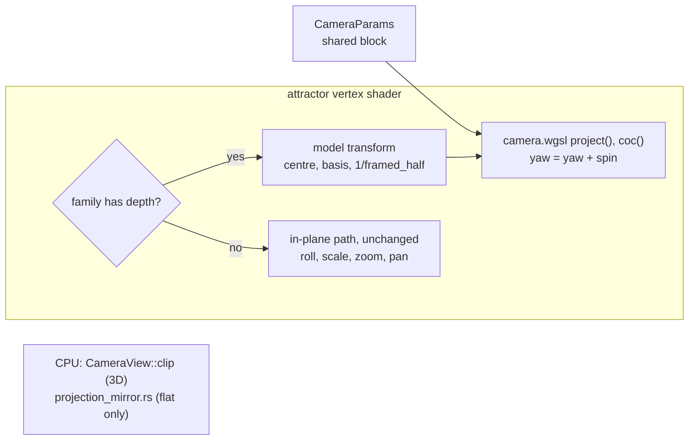

# 0240 — The attractor projects through the shared camera

> **Status:** in-progress (2026-10-06). Runs after Plan 0236 closes.
> **Created:** 2026-10-01
> **Owner skill(s):** dev, human
> **Related ADRs:** [ADR-0260](../adrs/0260-the-attractors-3d-families-project-through-the-shared-camera-and-perspective-retires.md) (proposed), [ADR-0076](../adrs/0076-the-attractor-keeps-the-depth-it-already-computes.md), [ADR-0093](../adrs/0093-attractor-tuples-are-content-with-per-tuple-framing.md), [ADR-0257](../adrs/0257-a-shared-camera-projects-3d-primitives-and-depth-of-field-is-a-per-endpoint-circle-of-confusion.md), [ADR-0258](../adrs/0258-a-system-takes-depth-through-one-shared-camera-block-and-its-3d-mode-forgoes-what-seg3d-does-not-draw.md) (proposed)

## TL;DR

The attractor's 3D families (Thomas, Lorenz) project through `Camera3d` instead of the
pseudo-perspective `magnify`. They gain a **pitch** and a real `distance`, the centroid orbit that
capped `perspective` near 0.3 goes away, and `focus` and `aperture` act on the camera's real lens.
`perspective` retires (ADR-0260). The shipped presets are migrated by an exact mapping, so the merged
tree renders close to today. The re-curation in motion that the owner chose comes after, as content
work. The flat families and their goldens do not move.

## Context & problem

All projection happens in the attractor's vertex shader:

- `project_figure` rotates by the spin phase (a yaw, about XZ for Lorenz and XY otherwise).
- `depth_norm` normalizes and clamps the depth to `[-1, 1]`.
- `magnify` scales by `1 / (1 - perspective * dn)`.
- `ndc = (world.x / aspect, world.y) * zoom + pan`.

Its CPU mirror, `projection_mirror.rs`, is a hand transcription that is not pinned to the GPU. Plan
0235 Phase 5 added `figure_coc` on a fixed virtual lens. 22 presets use the attractor; 10 draw a 3D
family, at `perspective` 0.18 to 0.5, and `fragment_sumi` draws Thomas at 0. The only 3D projection
golden is `attractor_depth` (Lorenz, `perspective` 0.5).

ADR-0260 records why the projection moves, why `perspective` retires rather than staying as an alias,
and why the flat families stay.

## Decision

As ADR-0260 decides:

- A **model transform** (measured centre, basis, measured framed half-extent) brings every 3D roster
  entry to unit radius.
- The attractor splices the **shared camera block**, with `spin` added to `yaw`.
- The 3D path projects with `project()` and blurs with the real `coc()`.
- `perspective`, the `dn` clamp and the virtual lens retire.
- Flat families keep their path, with the camera params declared inert.
- The 3D path's CPU mirror becomes `CameraView::clip`.
- The shipped presets are migrated by the exact mapping (`distance = E / p`, the derived `fov`,
  `pitch = 0`) in this plan. Their re-curation is owed after the merge.

## Architecture diagram



## Implementation phases

### Phase 1 — Walking skeleton: Lorenz through the camera
- **Owner skill:** dev
- **What:**
  - Splice `CameraParams` on the attractor, live on families with depth and inert on flat ones.
  - Add the model transform per roster entry, and project the 3D branch through `project()`, with
    `spin` added to `yaw`. Sprite size follows perspective (`at_depth`).
  - Point the 3D path's CPU property tests at `CameraView::clip`, and keep `projection_mirror.rs`
    for the flat path.
  - The camera params ride the attractor's uniform. If its padding lanes run out, it grows, and the
    flat path's bytes stay unchanged.
- **Files touched:** `core/src/render/scenes/particles/shaders.rs`,
  `core/src/render/scenes/particles/mod.rs`, `core/src/render/scenes/particles/encode.rs`,
  `core/src/render/scenes/particles/resources.rs`,
  `core/src/render/scenes/particles/projection_mirror.rs`, `core/src/render/scenes/particles/family.rs`,
  `core/src/render/scenes/particles/tests.rs`, `core/tests/`.
- **Done when:**
  - The flat-family goldens (`attractor`, `attractor_trails`, `attractor_ifs`) are byte-identical.
  - A Lorenz fixture at `pitch = 0.6` renders through `shot`, and so does the same fixture at
    `pitch = 0`; the two differ.
  - Sweeping `yaw` through a full turn moves the projected centroid of a Lorenz figure by less than the
    `0.9 * p` orbit ADR-0076's Outcome measured at the matched `p`.
  - `every_roster_entry_fills_the_frame_like_its_canonical_figure` passes for every 3D entry at the
    default camera.

### Phase 2 — The real lens, and `perspective` retires
- **Owner skill:** dev
- **What:**
  - Replace `figure_coc` and its virtual lens with the shared lens helper on the camera's real focal
    depth.
  - Remove `perspective`, `MAX_PERSPECTIVE`, `magnify` and the `dn` clamp.
  - Find out what the loader does with a binding to a param no longer declared (`ParamRoute::Unclaimed`).
    If it is silent, make a binding to `perspective` on the attractor a load error that names
    `distance` and `fov`. A user preset should fail loudly rather than lose its depth unnoticed.
- **Files touched:** `core/src/render/scenes/particles/shaders.rs`,
  `core/src/render/scenes/particles/mod.rs`, `core/src/render/scenes/particles/encode.rs`,
  `core/src/render/scenes/particles/tests.rs`, `core/src/preset/schema/load.rs`, `core/tests/`.
- **Done when:**
  - With `aperture > 0` on Thomas, sprites far from `focus` render wider and dimmer than sprites at
    it, and a flat family renders identically at any `aperture`.
  - A preset binding `perspective` fails to load with a message naming the replacement.
  - `git grep -c "MAX_PERSPECTIVE" -- core/src` finds nothing.

### Phase 3 — The shipped presets migrate by the mapping
- **Owner skill:** dev
- **What:**
  - Rewrite each shipped preset that sets `perspective`, and each attractor layer in
    `fragment_nebula` and `fragment_sumi`, onto `distance`, `fov` and `pitch = 0`. Use
    `distance = E / p` in model units and `tan(fov / 2)` from the preset's scale and zoom, as ADR-0260
    states. Leave `zoom` at 1 on the camera, since `Camera3d` divides the angle, not its tangent.
  - A `perspective = 0` layer takes a long `distance` and a matching narrow `fov`.
  - Do not re-bless `attractor_depth`: baselines are blessed on DX12 WARP only, and that is Phase 6.
    Record in the log whether its capture moved, from the off-WARP drift report the golden run prints.
  - Write a test that holds every migrated 3D preset's framed coverage within the `sanity` floor.
- **Files touched:** `presets/attractor_*.toml` (the 3D-family set), `presets/fragment_nebula.toml`,
  `presets/fragment_sumi.toml`, `core/tests/`.
- **Done when:**
  - The golden suite passes on the session's adapter, and the log says whether `attractor_depth`
    moved, quoting the drift report.
  - The `sanity`, `animation`, `reactivity` and `distinctness` suites pass on all 22 presets.
  - `git grep -c "perspective" -- presets` finds no binding.

### Phase 4 — Documentation and the references
- **Owner skill:** dev
- **What:**
  - The generated params block, `presets/schema/` and `.taplo.toml` are regenerated.
  - `docs/presets.md` and the preset-author reference's `## attractor` section replace `perspective`
    with the camera block, and say which families it reads on.
  - The reference states the migration rule, so the content lane can re-curate from it.
  - `scripts/tuple-sheets.mjs` still renders 3D roster entries at the default camera.
- **Files touched:** `presets/README.md`, `presets/schema/`, `.taplo.toml`, `docs/presets.md`,
  `.claude/skills/preset-author/references/systems.md`, `scripts/tuple-sheets.mjs`.
- **Done when:** the schema and param-reference tests pass on the regenerated files.
  `node scripts/toc.mjs --check`, `node scripts/check-doc-links.mjs` and
  `node scripts/check-reader-prose.mjs` pass.

### Phase 5 — The 3D presets, re-curated in motion
- **Owner skill:** human
- **Blocks merge:** no
- **What:** the owner runs the ten 3D attractor presets and the two fragment layers live, now with
  `pitch` and a real `distance` available, and briefs `preset-author` on which to re-curate and how.
  The migration already keeps each close to its old picture, so the merge does not wait (ADR-0249).
- **Files touched:** none.
- **Done when:** the owner records the brief, or a keep per preset, in this plan's log.

### Phase 6 — The moved baseline is blessed
- **Owner skill:** human
- **Blocks merge:** no
- **What:** if Phase 3's log says `attractor_depth` moved, re-bless it on DX12 WARP, and nothing else.
  If Plan 0218 has moved blessing to lavapipe by then, bless there instead.
- **Files touched:** `core/tests/golden/attractor_depth.png`.
- **Done when:** the Windows CI golden job is green on `main`.

## Data shapes

```rust
// illustrative, not the final interface
// per roster entry, derived from the measured framing that ADR-0093 already stores
struct ModelTransform {
    centre: [f32; 3],
    basis: [[f32; 3]; 3],   // identity, or Lorenz's XZ swap
    inv_framed_half: f32,   // brings the entry to unit radius
}
// migration of one preset, before re-curation:
//   distance = E / p                        (E in model units; p the old perspective)
//   tan(fov / 2) = p / (scale * E * zoom)   (camera zoom = 1)
//   pitch = 0, yaw = 0 (spin still adds)
```

## Risks & open questions

- **Lorenz's far lobes overran the clamp.** Its depth reaches about `1.22 * E`, and those points now
  project unclamped. If one comes near the near plane at a preset's migrated `distance`, the minimum
  `distance` must exceed the model radius plus a margin. Phase 1 sets that bound, and Phase 3's coverage
  test catches a preset that violates it.
- **The uniform may need to grow.** The four padding lanes Plan 0235 Phase 5 used are taken. Growing
  the uniform is fine as long as the flat path's goldens stay byte-identical, which Phase 1 asserts.
- **Silent loss of `perspective` on a user preset** is the failure ADR-0260 names. Phase 2 makes it
  loud, or the log states why that was not possible.
- **The tuple contact sheets** are manual renderers, not gates. If `tuple-sheets.mjs` breaks, nothing
  goes red. Phase 4 runs it once by hand.

## What this plan does NOT do

- Move the flat families onto the camera (ADR-0260, Alternative C).
- Change any roster entry's index, coefficients or measured framing (ADR-0093).
- Re-curate the presets' look. That is Phase 5's brief and `preset-author`'s work.

## Implementation log

**Lane:** branch `plan-0240-the-attractor-projects-through-the-shared-camera`, worktree
`/home/igor/Work/rlx-plan-0240`

| phase | owner | state | commit |
|---|---|---|---|
| 1 — Walking skeleton: Lorenz through the camera | dev | done | 19386418 |
| 2 — The real lens, and `perspective` retires | dev | done | 80566e42 |
| 3 — The shipped presets migrate by the mapping | dev | done | committed with this row |
| 4 — Documentation and the references | dev | not started | |
| 5 — The 3D presets, re-curated in motion | human | not started | |
| 6 — The moved baseline is blessed | human | not started | |

### Notes

- Phase 1: the spin composes with the camera as `yaw - spin_phase` (`encode::spun`), not `+`:
  the camera's yaw turns the eye, so subtracting turns the figure the way a positive `spin`
  turned it. `the_mapped_camera_reproduces_the_retired_magnification` pins the direction against
  the old mirror.
- Phase 1: a sprite's size is stated at the orbit target (`viewport.z = distance`), not at the
  focal plane as on the plexus, so `focus` never resizes a sprite. Its radius is the old world
  size divided by the entry's footprint (`scale * framed half`), which makes the mapping exact
  for sprites too.
- Phase 1: from this phase until Phase 2, `perspective` is inert on the 3D path, and every shipped
  3D preset renders through the default camera until Phase 3.
- Phase 1: "flat goldens byte-identical" was checked on this session's adapter, not on WARP:
  `shot` captures of `attractor`, `attractor_trails`, `attractor_ifs` and `attractor_fb_rotate`
  compared with `cmp` before and after the phase, all identical. `attractor_depth` differs.
- Phase 1: the pitch done-when was run through `shot` on scratch fixtures under `target/`, and is
  also held by `a_lorenz_figure_pitches_through_the_camera` in `core/tests/attractor.rs`.
- Phase 1: the centroid swing over a full yaw turn measured 0.116 NDC at the camera matched to
  `p = 0.25` and 0.141 at `p = 0.5` (`a_yaw_sweep_barely_moves_the_lorenz_centroid`).
- Phase 1: the near-plane bound is held by `every_3d_entry_stays_clear_of_the_near_plane`: every
  banked point of every 3D entry, in model units, is nearer its centre than `distance`'s declared
  minimum (1.5) less `camera::NEAR`. The shader also drops a particle nearer than `NEAR`.
- From Phase 1 until Phase 4 regenerates them, three generated-file checks are red in `-P fast`:
  `the_parameter_reference_block_is_current`, `the_player_schema_snapshot_is_current` and
  `the_generated_editor_files_are_current`. The second compares `docs/specs/player-schema.json`,
  which Phase 4's file list does not name; `RLX_UPDATE_PRESET_SCHEMA=1` rewrites it with the rest.
  The other 1882 tests pass.
- Phase 2: the loader was not silent before this phase. An undeclared param was a load warning
  (`unknown parameter ... binding kept, but nothing reads it`), not an error. The done-when names a
  load error, so `load.rs` gained `RETIRED_PARAMS`: a binding to `perspective` on the attractor, at
  the top level or in a layer, fails with `PresetError::Config` naming `distance` and `fov`.
- Phase 2: the `dn` clamp left `depth_norm`, which is gone, and became a saturation in `depth01`,
  because the haze goes negative past the far extent. The flat path's `dn` is now a literal 0.
- Phase 2: `core/tests/fixtures/attractor_depth.toml` moved off `perspective = 0.5`,
  `zoom = 1.30` onto the mapping (`distance = 2.0`, `fov = 1.1839`, `pitch = 0`, zoom 1),
  because the retired binding no longer loads. Its baseline was not re-blessed.
- Phase 2 touched `core/src/render/scenes/particles/projection_mirror.rs`, which only Phase 1
  lists. Its transcriptions of `depth_norm`, `magnify` and `figure_coc` went with the shader
  functions they mirror, `world` lost its `perspective` argument, and `depth01` gained the
  saturation.
- Phase 2: the flat fixtures stayed byte-identical on this adapter (the same `shot` and `cmp`
  check as Phase 1).
- Between Phase 2 and Phase 3, the shipped presets that still bind `perspective` fail to load. In
  this phase that reddened `attractor_contract` and `attractor_projects_at_the_target_aspect`,
  which load `attractor_walkdejong`.
- Phase 3: the shipped set no longer matches the plan's counts. 12 presets draw the attractor, not
  22, and 6 draw a 3D family, not 10: Ink on Paper, Lorenz Knot, Thomas Gallery, Thomas on Red and
  Thomas Walk, plus the `fragment_sumi` layer. Each was migrated onto `distance`, `fov` and
  `pitch = 0`, with `E` and the footprint measured per roster entry. `attractor_fernmono` (fern)
  and `attractor_walkdejong` (De Jong) also bound `perspective`, which was inert on their flat
  families, so their bindings were deleted with no replacement. `fragment_nebula`'s layer is De
  Jong and binds nothing the camera replaced, so it is unchanged.
- Phase 3: mapping approximations.
  - Ink on Paper and Thomas Gallery step a 13-entry roster. They use `E = 1` and footprint 0.572,
    which 11 entries share. Entry 0's footprint is 0.63, and entries 1 and 4 have `E` of 0.72 and
    0.84.
  - Lorenz Knot's `perspective` was bass-driven. `distance = 1 / p` follows it exactly. Expressions
    have no `atan`, so `fov` is a quadratic fit in the bass term, within 0.0008 rad.
  - Thomas Walk's `zoom = 1.0 + bar * 0.04` stays on the camera's `zoom`, which divides the angle
    and not its tangent, so the pulse is near the old one but not equal.
  - Sumi's layer takes `distance = 20` and `fov = 0.1299`. That is a 1.1:1 near-to-far ratio, and
    both values are outside the declared ranges, which document and do not clamp.
- The camera divides `pan_x` by the aspect, which the attractor's in-plane path did not. This
  landed in Phase 1 and was not noted there. In Phase 3, Ink on Paper's `pan_x` swing was scaled by
  16/9, which reproduces the old drift on a 16:9 target only.
- Phase 3: the `attractor_depth` capture moved. The golden run on llvmpipe (off WARP, so the
  comparison is reported and not asserted) printed `attractor_depth    mean 0.0022 (tol 0.02)
  max_outlier 62 (tol 48)`. The unchanged flat `attractor` fixture printed mean 0.0018 /
  max_outlier 114 on the same adapter. A `shot` capture of the fixture differs byte-wise from the
  pre-plan capture. Not re-blessed (Phase 6).
- Phase 3: `every_migrated_3d_preset_clears_the_sanity_floor` (`core/tests/attractor.rs`) is the
  coverage test. Coverage at drive 0.4 and 1.0 ran 0.258 (Thomas on Red) to 0.535 (Lorenz Knot)
  against the attractor floor of 0.11, and Sumi read 0.92 against 0.21. Every preset spread over
  four quadrants.
- Phase 3: `sanity` (32 run, 2 `#[ignore]` instruments skipped) and `animation`, `reactivity`,
  `distinctness` (46 run, 1 `#[ignore]` skipped) pass on llvmpipe. `-P fast` is 1881 of 1884,
  and the three red tests are the generated-file checks named under Phase 1.
- Followup noticed: `core/src/render/scenes/particles/ifs.rs` (the `SIGMA_CEILING` doc) still cites
  `perspective` as a silently clamped param. The file is outside every phase of this plan.

### Close triggers

- **`presets/` touched:**
- **Plan header `Closes:`** none
- **What shipped:**
- **Operator docs touched:**
- **Backlog probes (`node scripts/check-backlog-claims.mjs`):**
- **Full suite:**
- **Outstanding `human` phases:**

## Followups (after this lands)

- `preset-author`: the re-curation per Phase 5's brief.
- Accept ADR-0260 at the close, and mark ADR-0076 and ADR-0257 amended in the ADR index.
