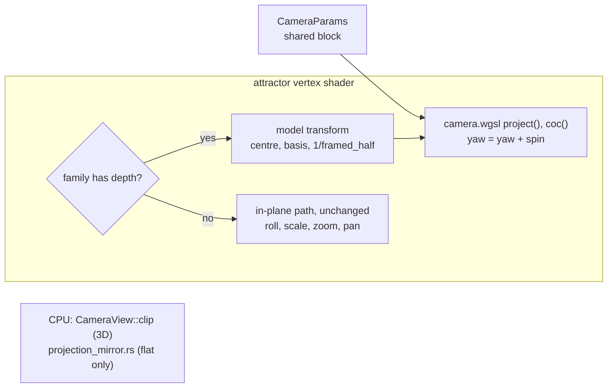

# 0240 — The attractor projects through the shared camera

> **Status:** approved (2026-10-01). Runs after Plan 0236 closes.
> **Created:** 2026-10-01
> **Owner skill(s):** dev, human
> **Related ADRs:** [ADR-0260](../adrs/0260-the-attractors-3d-families-project-through-the-shared-camera-and-perspective-retires.md) (proposed), [ADR-0076](../adrs/0076-the-attractor-keeps-the-depth-it-already-computes.md), [ADR-0093](../adrs/0093-attractor-tuples-are-content-with-per-tuple-framing.md), [ADR-0257](../adrs/0257-a-shared-camera-projects-3d-primitives-and-depth-of-field-is-a-per-endpoint-circle-of-confusion.md), [ADR-0258](../adrs/0258-a-system-takes-depth-through-one-shared-camera-block-and-its-3d-mode-forgoes-what-seg3d-does-not-draw.md) (proposed)

## TL;DR

The attractor's 3D families (Thomas, Lorenz) project through `Camera3d` instead of the
pseudo-perspective `magnify`. They gain a **pitch** and a real `distance`, the centroid orbit that
capped `perspective` near 0.3 goes away, and `focus` and `aperture` act on the camera's real lens.
`perspective` retires (ADR-0260). The shipped presets are migrated by an exact mapping, so the merged
tree renders close to today. The re-curation in motion that the owner chose comes after, as content
work. The flat families and their goldens do not move.

## Context & problem

All projection happens in the attractor's vertex shader:

- `project_figure` rotates by the spin phase (a yaw, about XZ for Lorenz and XY otherwise).
- `depth_norm` normalizes and clamps the depth to `[-1, 1]`.
- `magnify` scales by `1 / (1 - perspective * dn)`.
- `ndc = (world.x / aspect, world.y) * zoom + pan`.

Its CPU mirror, `projection_mirror.rs`, is a hand transcription that is not pinned to the GPU. Plan
0235 Phase 5 added `figure_coc` on a fixed virtual lens. 22 presets use the attractor; 10 draw a 3D
family, at `perspective` 0.18 to 0.5, and `fragment_sumi` draws Thomas at 0. The only 3D projection
golden is `attractor_depth` (Lorenz, `perspective` 0.5).

ADR-0260 records why the projection moves, why `perspective` retires rather than staying as an alias,
and why the flat families stay.

## Decision

As ADR-0260 decides:

- A **model transform** (measured centre, basis, measured framed half-extent) brings every 3D roster
  entry to unit radius.
- The attractor splices the **shared camera block**, with `spin` added to `yaw`.
- The 3D path projects with `project()` and blurs with the real `coc()`.
- `perspective`, the `dn` clamp and the virtual lens retire.
- Flat families keep their path, with the camera params declared inert.
- The 3D path's CPU mirror becomes `CameraView::clip`.
- The shipped presets are migrated by the exact mapping (`distance = E / p`, the derived `fov`,
  `pitch = 0`) in this plan. Their re-curation is owed after the merge.

## Architecture diagram



## Implementation phases

### Phase 1 — Walking skeleton: Lorenz through the camera
- **Owner skill:** dev
- **What:**
  - Splice `CameraParams` on the attractor, live on families with depth and inert on flat ones.
  - Add the model transform per roster entry, and project the 3D branch through `project()`, with
    `spin` added to `yaw`. Sprite size follows perspective (`at_depth`).
  - Point the 3D path's CPU property tests at `CameraView::clip`, and keep `projection_mirror.rs`
    for the flat path.
  - The camera params ride the attractor's uniform. If its padding lanes run out, it grows, and the
    flat path's bytes stay unchanged.
- **Files touched:** `core/src/render/scenes/particles/shaders.rs`,
  `core/src/render/scenes/particles/mod.rs`, `core/src/render/scenes/particles/encode.rs`,
  `core/src/render/scenes/particles/resources.rs`,
  `core/src/render/scenes/particles/projection_mirror.rs`, `core/src/render/scenes/particles/family.rs`,
  `core/src/render/scenes/particles/tests.rs`, `core/tests/`.
- **Done when:**
  - The flat-family goldens (`attractor`, `attractor_trails`, `attractor_ifs`) are byte-identical.
  - A Lorenz fixture at `pitch = 0.6` renders through `shot`, and so does the same fixture at
    `pitch = 0`; the two differ.
  - Sweeping `yaw` through a full turn moves the projected centroid of a Lorenz figure by less than the
    `0.9 * p` orbit ADR-0076's Outcome measured at the matched `p`.
  - `every_roster_entry_fills_the_frame_like_its_canonical_figure` passes for every 3D entry at the
    default camera.

### Phase 2 — The real lens, and `perspective` retires
- **Owner skill:** dev
- **What:**
  - Replace `figure_coc` and its virtual lens with the shared lens helper on the camera's real focal
    depth.
  - Remove `perspective`, `MAX_PERSPECTIVE`, `magnify` and the `dn` clamp.
  - Find out what the loader does with a binding to a param no longer declared (`ParamRoute::Unclaimed`).
    If it is silent, make a binding to `perspective` on the attractor a load error that names
    `distance` and `fov`. A user preset should fail loudly rather than lose its depth unnoticed.
- **Files touched:** `core/src/render/scenes/particles/shaders.rs`,
  `core/src/render/scenes/particles/mod.rs`, `core/src/render/scenes/particles/encode.rs`,
  `core/src/render/scenes/particles/tests.rs`, `core/src/preset/schema/load.rs`, `core/tests/`.
- **Done when:**
  - With `aperture > 0` on Thomas, sprites far from `focus` render wider and dimmer than sprites at
    it, and a flat family renders identically at any `aperture`.
  - A preset binding `perspective` fails to load with a message naming the replacement.
  - `git grep -c "MAX_PERSPECTIVE" -- core/src` finds nothing.

### Phase 3 — The shipped presets migrate by the mapping
- **Owner skill:** dev
- **What:**
  - Rewrite each shipped preset that sets `perspective`, and each attractor layer in
    `fragment_nebula` and `fragment_sumi`, onto `distance`, `fov` and `pitch = 0`. Use
    `distance = E / p` in model units and `tan(fov / 2)` from the preset's scale and zoom, as ADR-0260
    states. Leave `zoom` at 1 on the camera, since `Camera3d` divides the angle, not its tangent.
  - A `perspective = 0` layer takes a long `distance` and a matching narrow `fov`.
  - Do not re-bless `attractor_depth`: baselines are blessed on DX12 WARP only, and that is Phase 6.
    Record in the log whether its capture moved, from the off-WARP drift report the golden run prints.
  - Write a test that holds every migrated 3D preset's framed coverage within the `sanity` floor.
- **Files touched:** `presets/attractor_*.toml` (the 3D-family set), `presets/fragment_nebula.toml`,
  `presets/fragment_sumi.toml`, `core/tests/`.
- **Done when:**
  - The golden suite passes on the session's adapter, and the log says whether `attractor_depth`
    moved, quoting the drift report.
  - The `sanity`, `animation`, `reactivity` and `distinctness` suites pass on all 22 presets.
  - `git grep -c "perspective" -- presets` finds no binding.

### Phase 4 — Documentation and the references
- **Owner skill:** dev
- **What:**
  - The generated params block, `presets/schema/` and `.taplo.toml` are regenerated.
  - `docs/presets.md` replaces `perspective` with the camera block, and says which families it
    reads on.
  - The log carries the replacement text for the preset-author reference's `## attractor` section,
    for the owner to apply in Phase 7: the camera block in place of `perspective`, the families it
    reads on, and the migration rule, so the content lane can re-curate from it. A headless session
    cannot edit `.claude/` (ADR-0210).
  - `scripts/tuple-sheets.mjs` still renders 3D roster entries at the default camera.
- **Files touched:** `presets/README.md`, `presets/schema/`, `.taplo.toml`, `docs/presets.md`,
  `docs/specs/player-schema.json`, `scripts/tuple-sheets.mjs`.
- **Done when:** the schema and param-reference tests pass on the regenerated files.
  `node scripts/toc.mjs --check`, `node scripts/check-doc-links.mjs` and
  `node scripts/check-reader-prose.mjs` pass.

### Phase 5 — The 3D presets, re-curated in motion
- **Owner skill:** human
- **Blocks merge:** no
- **What:** the owner runs the ten 3D attractor presets and the two fragment layers live, now with
  `pitch` and a real `distance` available, and briefs `preset-author` on which to re-curate and how.
  The migration already keeps each close to its old picture, so the merge does not wait (ADR-0249).
- **Files touched:** none.
- **Done when:** the owner records the brief, or a keep per preset, in this plan's log.

### Phase 6 — The moved baseline is blessed
- **Owner skill:** human
- **Blocks merge:** no
- **What:** if Phase 3's log says `attractor_depth` moved, re-bless it on DX12 WARP, and nothing else.
  If Plan 0218 has moved blessing to lavapipe by then, bless there instead.
- **Files touched:** `core/tests/golden/attractor_depth.png`.
- **Done when:** the Windows CI golden job is green on `main`.

### Phase 7 — The preset-author reference
- **Owner skill:** human
- **Blocks merge:** no
- **What:** the owner applies, in an interactive session, the text Phase 4 left in the log to
  `.claude/skills/preset-author/references/systems.md`'s `## attractor` section.
- **Files touched:** `.claude/skills/preset-author/references/systems.md`.
- **Done when:** the edit is committed on `main` and `node scripts/check-doc-links.mjs` exits 0.

## Data shapes

```rust
// illustrative, not the final interface
// per roster entry, derived from the measured framing that ADR-0093 already stores
struct ModelTransform {
    centre: [f32; 3],
    basis: [[f32; 3]; 3],   // identity, or Lorenz's XZ swap
    inv_framed_half: f32,   // brings the entry to unit radius
}
// migration of one preset, before re-curation:
//   distance = E / p                        (E in model units; p the old perspective)
//   tan(fov / 2) = p / (scale * E * zoom)   (camera zoom = 1)
//   pitch = 0, yaw = 0 (spin still adds)
```

## Risks & open questions

- **Lorenz's far lobes overran the clamp.** Its depth reaches about `1.22 * E`, and those points now
  project unclamped. If one comes near the near plane at a preset's migrated `distance`, the minimum
  `distance` must exceed the model radius plus a margin. Phase 1 sets that bound, and Phase 3's coverage
  test catches a preset that violates it.
- **The uniform may need to grow.** The four padding lanes Plan 0235 Phase 5 used are taken. Growing
  the uniform is fine as long as the flat path's goldens stay byte-identical, which Phase 1 asserts.
- **Silent loss of `perspective` on a user preset** is the failure ADR-0260 names. Phase 2 makes it
  loud, or the log states why that was not possible.
- **The tuple contact sheets** are manual renderers, not gates. If `tuple-sheets.mjs` breaks, nothing
  goes red. Phase 4 runs it once by hand.

## What this plan does NOT do

- Move the flat families onto the camera (ADR-0260, Alternative C).
- Change any roster entry's index, coefficients or measured framing (ADR-0093).
- Re-curate the presets' look. That is Phase 5's brief and `preset-author`'s work.

## Implementation log

**Lane:**

| phase | owner | state | commit |
|---|---|---|---|
| 1 — Walking skeleton: Lorenz through the camera | dev | not started | |
| 2 — The real lens, and `perspective` retires | dev | not started | |
| 3 — The shipped presets migrate by the mapping | dev | not started | |
| 4 — Documentation and the references | dev | not started | |
| 5 — The 3D presets, re-curated in motion | human | not started | |
| 6 — The moved baseline is blessed | human | not started | |
| 7 — The preset-author reference | human | not started | |

### Notes

### Close triggers

- **`presets/` touched:**
- **Plan header `Closes:`** none
- **What shipped:**
- **Operator docs touched:**
- **Backlog probes (`node scripts/check-backlog-claims.mjs`):**
- **Full suite:**
- **Outstanding `human` phases:**

## Followups (after this lands)

- `preset-author`: the re-curation per Phase 5's brief.
- Accept ADR-0260 at the close, and mark ADR-0076 and ADR-0257 amended in the ADR index.
