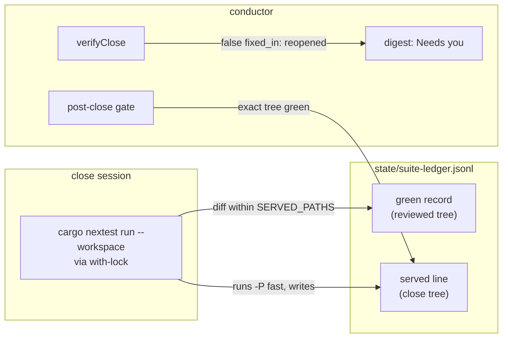

# 0241 — The conductor parks only on what the owner must settle

> **Status:** in-progress (2026-10-01).
> **Created:** 2026-10-01
> **Owner skill(s):** dev
> **Related ADRs:** [ADR-0261](../adrs/0261-the-conductor-parks-only-on-what-the-owner-must-settle.md) (proposed), [ADR-0207](../adrs/0207-a-suite-run-the-conductor-observed-green-is-not-run-again-on-the-same-tree.md), [ADR-0209](../adrs/0209-a-conductor-close-repairs-the-prose-and-comments-its-findings-name.md), [ADR-0248](../adrs/0248-the-pipeline-repairs-before-it-parks.md), [ADR-0249](../adrs/0249-a-human-phase-may-be-owed-after-the-merge.md)

## TL;DR

This plan implements ADR-0261's four changes:
- The close session's full suite is served down to `-P fast` when its diff from the reviewed tree is
  only docs and a version bump.
- A run of consecutive `human` phases parks once.
- A close's false `fixed_in` reopens its finding instead of parking.
- The single test backlog 0219 diagnoses as a flake retries once, by name, and is reported when it
  does.

The first visible effect is a close that takes about 4 to 5 fewer minutes on the reference box.

## Context & problem

The workflow audit of 2026-10-01 read the conductor's own record for 09-22 to 09-30. Plans spent 89%
of their lifetime parked, and `nextest` took about 55% of the machine's busy time. ADR-0261's Context
carries the four shapes this plan removes and the numbers behind each. In short:
- the close re-runs the full suite (about 9 min) on a diff `lib/gate.mjs` would already serve;
- 0232 parked three times for one run of three human phases;
- two clean closes parked 24 h in total on a bookkeeping claim;
- a known loaded-run flake costs a park or a repair whenever two lanes overlap.

## Decision

Implement ADR-0261 as written. The rejected options (a repair session for a false claim, skipping the
close's suite outright, bumping before the review, and a blanket retry) are argued there.

## Architecture diagram

## Implementation phases

### Phase 1 — The close's suite is served
- **Owner skill:** dev
- **What:** `with-lock.mjs` consults `servingRecord` after `greenRecord` comes back null. When a
  record serves the tree, it runs the command with `SERVED_SUITE_ARGS` appended under the same lock
  and writes the line through `appendServed`. `greenRecord` also returns a green served line on its
  own exact tree, so the post-close gate skips. `servingRecord` keeps reading full records only.
- **Files touched:** `tools/conductor/with-lock.mjs`, `tools/conductor/lib/ledger.mjs`,
  `tools/conductor/test/with-lock.test.mjs`, `tools/conductor/test/ledger.test.mjs`,
  `tools/conductor/README.md` (the gate section's account of the ledger).
- **Done when:** the following tests hold, and `node --test tools/conductor/test/*.test.mjs` passes:
  - **Served:** a with-lock test over a temporary repository sets up a green full record on tree A
    and a clean tree B whose diff from A is a `docs/` file plus the root `Cargo.toml`
    `[workspace.package]` version line. Running `cargo nextest run --workspace` there invokes the
    fake runner with `-P fast` appended and writes exactly one `served: true` line for B.
  - **Not served:** the same setup with a `core/src/` file in the diff runs the full command unchanged.
  - **Skip after serving:** `greenRecord(path, B)` returns the served line after a green served run,
    and returns null after a red one.
  - **No chaining:** `servingRecord` for a third tree C, whose diff from B alone would be served,
    returns null when A's diff to C is not served.

### Phase 2 — A run of human phases parks once
- **Owner skill:** dev
- **What:** the `human_phase` park records `phases` (every pending phase of the run `nextStep`
  returned) next to the existing `phase`. Its detail names the range, e.g. "Phases 4-6 are owned by
  human". `parkStillTrue`, `selfResumeWhy` and the digest's `settledPark` all hold the park until every
  listed phase reads `done`, or `owed` on a `Blocks merge: no` phase. While it holds, the refusal
  names the phases still open. A park recorded before this change, which has no `phases`, reads as
  `[phase]`.
- **Files touched:** `tools/conductor/lib/lane.mjs`, `tools/conductor/lib/digest.mjs`,
  `tools/conductor/test/lane.test.mjs`, `tools/conductor/test/digest.test.mjs`,
  `tools/conductor/README.md` ("Acting on a park").
- **Done when:** a lane test with a plan whose phases 4, 5 and 6 are consecutive `human` phases parks
  once, with `phases` `["4","5","6"]` and a detail naming `4-6`. The following also hold, and
  `node --test tools/conductor/test/*.test.mjs` passes:
  - **Partly settled:** with only Phase 4's log row marked `done`, `parkStillTrue` returns a refusal
    naming 5 and 6.
  - **Settled:** with all three marked, the park settles and the next step is the following
    implementer run.
  - **Old record:** a park record with no `phases` behaves exactly as before.

### Phase 3 — A false repair claim reopens its finding
- **Owner skill:** dev
- **What:** `repairProblems` in `lib/close.mjs` stops returning a false `fixed_in` as a problem. It
  returns it as a **reopened** finding with the reason instead. A false claim is one where the commit
  is missing, is off the branch, or changes neither the finding's file nor its earlier path.
  `verifyClose` hands the reopened list back next to its problems, and the lane records it on the
  plan as `rec.reopened`. The digest lists each one under **Needs you** with its reason, and
  `finding NNNN` lists it as open, so `--done`, `--wontfix` and `--filed` apply to it. Every other
  problem `verifyClose` finds still parks `disagreement`.
- **Files touched:** `tools/conductor/lib/close.mjs`, `tools/conductor/lib/lane.mjs`,
  `tools/conductor/lib/digest.mjs`, `tools/conductor/conductor.mjs` (the `finding` listing),
  `tools/conductor/test/close.test.mjs`, `tools/conductor/test/digest.test.mjs`,
  `tools/conductor/test/cli.test.mjs`, `tools/conductor/README.md` ("Closing a finding").
- **Done when:** the following tests hold, and `node --test tools/conductor/test/*.test.mjs` passes:
  - **Reopened:** a close test whose outcome carries one finding `fixed_in` a sha that does not exist
    returns no problem and one reopened finding naming that sha.
  - **Unchanged file:** the same holds for a `fixed_in` that exists on the branch but changes another
    file.
  - **Other problems still park:** a close with a missing `## Close review` section still returns a
    problem.
  - **Visible:** a digest test shows the reopened finding under **Needs you**.
  - **Listable:** a `finding NNNN` CLI test lists it with an index.

### Phase 4 — A diagnosed flake retries by name, and says so
- **Owner skill:** dev
- **What:**
  - **The override:** one `[[profile.default.overrides]]` block in `.config/nextest.toml` gives
    `test(=a_preset_datagram_selects_by_name)` `retries = 1`. Its comment states the rule (a live
    backlog entry, exact names only, and the test leaves when the entry closes) and cites backlog 0219
    and ADR-0261. The custom `fast` profile inherits it.
  - **The ledger:** gains `flakyTests(output)`, which parses nextest's flaky-pass lines, and the
    record and served line carry `flaky` when that list is non-empty.
  - **The digest:** prints a plan's flaky names next to its gate results.
- **Files touched:** `.config/nextest.toml`, `tools/conductor/lib/ledger.mjs`,
  `tools/conductor/lib/digest.mjs`, `tools/conductor/test/ledger.test.mjs`,
  `tools/conductor/test/helpers.mjs` (a recorded flaky-pass fixture), `docs/testing.md` (one row on
  the retry rule).
- **Done when:** the following hold, and `node --test tools/conductor/test/*.test.mjs` passes:
  - **The fixture:** check nextest's flaky output against the version this machine runs (0.9.143)
    before writing the fixture, and record the shape seen in the implementation log's notes.
  - **Parsing:** a ledger test feeds that recorded nextest flaky-pass output to `flakyTests` and gets
    exactly the one test name back.
  - **The config parses:** `cargo nextest run -p standalone --test control_loopback` passes on this
    machine.
  - **One name only:** `git grep -c "retries" -- .config/nextest.toml` reports the one override and
    no profile-wide retry.

## Risks & open questions

- **Phase 1 changes a ledger invariant's wording.** The rule "a served line is never read back" becomes
  "a served line is read back for its own tree only". The no-chaining test is what keeps the remaining
  half true. A reviewer should read `servingRecord`'s filter after the change, not only its tests.
- **nextest's flaky output shape is not verified here.** Phase 4 records it from a real run first.
  If the shape changes in a later nextest, `flakyTests` returns empty and the record loses the names
  without going red. That is the same trap `failingTests` documents, held by the same kind of fixture.
- **A reopened finding merges.** That is ADR-0261's stated price. The digest is the only carrier, so
  an owner who stops reading the digest stops seeing them.

## What this plan does NOT do

- **It does not move readiness earlier or change how plans mark human phases.** That is Plan 0242.
- **It does not make the suite itself faster.** That is Plan 0243.
- **It does not touch the implement-step disagreement** in which a log row names a commit the step
  did not make (0202, 0220). That happens when a person or another session committed into the lane,
  and it needs a judgement this plan does not make.
- **It does not edit backlog 0219.** Whether the entry records the retry is the close's call.

## Implementation log

**Lane:** `main` directly, in the main checkout.

| phase | owner | state | commit |
|---|---|---|---|
| 1 — The close's suite is served | dev | done | `c1a17bf7` |
| 2 — A run of human phases parks once | dev | done | `7991c87e` |
| 3 — A false repair claim reopens its finding | dev | done | `3171cf30` |
| 4 — A diagnosed flake retries by name, and says so | dev | committed with this row | |

### Notes

- Phase 1 also edits `tools/conductor/test/gate.test.mjs`, outside its `Files touched`: the
  served-tier test asserted `greenRecord` returns null for a served line's own tree, the invariant
  this phase changes. The assertion now expects the served line back.
- Phase 3 also edits `tools/conductor/test/lane.test.mjs`, outside its `Files touched`: its two
  tests that a wrong-file and an off-branch `fixed_in` park `disagreement` now assert the finding is
  reopened and the plan merges. `verifyClose` now returns `{ problems, reopened }` rather than a list.
- Phase 4, the flaky shape on cargo-nextest 0.9.143, recorded from a scratch crate: the first try
  prints `  TRY 1 FAIL [   0.005s] (───) <binary> <name>`, the retry `  TRY 2 PASS [...] (2/2) ...`,
  the summary `2 tests run: 2 passed (1 flaky), 0 skipped`, then `   FLAKY 2/2 [   0.006s] (2/2)
  <binary> <name>`. A test failing both tries prints `TRY 2 FAIL` under the summary and never a bare
  `FAIL`. Both runs are fixtures in `test/helpers.mjs`.
- Phase 4 also changes `failingTests` in `lib/ledger.mjs`: it now accepts the `TRY n` prefix and the
  `(───)` counter, and leaves out a name `flakyTests` reports. Without that, the retried test failing
  both tries would have left a red record with no name.
- Phase 4 edits files outside its `Files touched`. `lib/gate.mjs` and `with-lock.mjs` each pass
  `flaky: flakyTests(output)` to the record they write, since they are the ledger's two writers.
  `test/digest.test.mjs` gains the test for the digest's flaky lines.
- Phase 4 prints flaky names in the history page, under the plan's `### Closed` entry, or under
  `### Failed and parked` for a plan that did not merge in that run. They are read from the ledger
  by its `by` label. The current-state page does not print them.

### Close triggers
