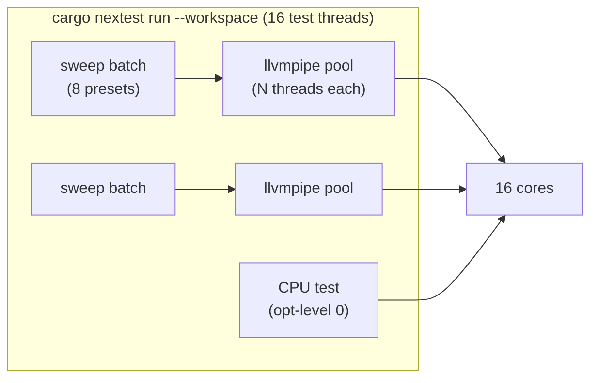

# 0243 — The full suite gets faster: measure the contention and the tail, then apply what wins

> **Status:** draft. **Run human-started, not under the conductor.** Phase 1 sweeps an environment
> variable across whole-suite runs. The conductor allowlist names no environment prefix for it, and
> the suite-lock hook does not allow a wrapper script around `cargo nextest`.
> **Created:** 2026-10-01
> **Owner skill(s):** dev
> **Related ADRs:** [ADR-0156](../adrs/0156-the-per-phase-gate-is-scoped-and-the-suite-is-owed-once-per-plan.md), [ADR-0157](../adrs/0157-the-preset-sweeps-split-per-preset-and-the-phase-tier-samples-a-declared-representative.md), [ADR-0193](../adrs/0193-a-test-that-reads-the-clock-runs-alone.md), [ADR-0071](../adrs/0071-a-numeric-test-contract-states-a-property-or-names-its-machine.md), [ADR-0033](../adrs/0033-testing-strategy-coverage-ratchet-and-pre-push-gate.md)

## TL;DR

`cargo nextest run --workspace` took 558 s on the reference box on 2026-09-30. The tests in it
add up to 4,666 s, which on 16 threads is about 292 s, plus 84 s of tests that run alone. That
leaves roughly 180 s unexplained. This plan tests two cheap hypotheses for the gap, applies whichever
measurably wins, and records a third question as a measurement without acting on it:
- **CPU oversubscription:** 16 nextest threads, each driving the software rasterizer, which spawns its
  own threads.
- **A long tail:** 70 to 80 s sweep batches that start late.
- **The third question:** what an optimised `rlx-core` would buy.

## Context & problem

The workflow audit of 2026-10-01 found `nextest` was about 55% of the conductor's busy time: about
15 h between 2026-09-22 and 09-30. The full suite runs at least twice per plan, at the pre-review
gate and at the close (Plan 0241 serves the second down to `-P fast`). Each implement phase also runs
`-P fast`. A full run grew from 6.7 to 9.3 min over those nine days, from 1,774 to 1,907 tests. Every
second cut from it is paid back at every plan.

**What one log shows** (`tools/conductor/state/gates/0231-pre-review-26-cargo_nextest.log`):
- **The longest single tests** are sweep batches: `reactivity_batch_02` at 78.6 s,
  `reactivity_batch_09` at 68.0 s, and the `animation_batch_*` family at 35 to 55 s. There are also
  CPU-only tests in `rlx-core` at opt-level 0: the cellular 2000-generation test at 73.5 s and
  `tempo_probe` at 73.7 s.
- **The software adapter is where the CPU goes.** Most differential tests render on the software
  adapter (`prefer_software`, `core/src/render/context.rs`), which is lavapipe, llvmpipe's Vulkan driver, on Linux
  (ADR-0242). llvmpipe sizes its own rasterizer thread pool from `LP_NUM_THREADS`, or from the core
  count when that is unset. Nothing here sets it.
- **Batch size and scheduling:** `core/build.rs` batches the per-preset sweeps at `BATCH = 8`.
  nextest schedules in binary order, not longest-first. Whether 0.9.143 offers a per-override
  `priority` is **unverified**.

## Decision

Measure first, and change only what three runs show winning against three baseline runs on the same
machine. The rejected alternative is changing `rlx-core`'s opt-level for tests now. That would cut
the CPU-bound tests, but `profile.dev`'s comment and ADR-0033 tie the coverage ratchet's line mapping
to opt-level 0, so changing it is an ADR-worthy tradeoff. Phase 3 measures what it would buy, and a
backlog entry carries the question.

## Architecture diagram

## Implementation phases

### Phase 1 — Measure the baseline and the two hypotheses
- **Owner skill:** dev
- **What:** on the reference box, with a warm build and no other suite running, record the
  following in this plan's `### Notes` as a table:
  1. **The adapter:** which adapter the software-adapter tests get (name and driver as `wgpu`
     reports them).
  2. **The baseline:** three full-suite wall times as nextest's `Summary` reports them.
  3. **Thread caps:** three runs each with `LP_NUM_THREADS` set to 1, 2 and 4.
  4. **Smaller batches:** three runs with `BATCH = 4` in `core/build.rs`, as an uncommitted edit.
  5. **Scheduling:** whether nextest 0.9.143 accepts a per-override `priority`. If it does, three
     runs with the nine sweep binaries prioritised.

  Each row carries the test count, so a run that silently ran fewer tests is visible. Nothing is
  committed except the log.
- **Files touched:** `docs/plans/0243-the-full-suite-gets-faster.md` (log only). `core/build.rs` and
  `.config/nextest.toml` are edited for the runs and restored afterwards.
- **Done when:** `### Notes` carries the table. That means the adapter line, plus three wall times
  and a test count for each configuration tried, with the machine named (ADR-0071). It also states
  whether `priority` exists in 0.9.143. `git status` shows no change outside this plan file.

### Phase 2 — Apply the configurations that won
- **Owner skill:** dev
- **What:** apply each configuration from Phase 1 whose three runs were **all** faster than the
  slowest of the baseline's three, and combine them. When two winners are combined, measure the
  combination again before applying it.
  - **Mechanism for a thread cap:** it must reach the test processes only, through a nextest setup
    script that sets the variable for the run, or through the shared test support code before the
    adapter is created. It must never reach `cargo run` of the app. A committed repo-level
    `.cargo/config.toml` `[env]` is not acceptable, because it would cap the app's software
    rendering too.
  - **A batch-size change:** this changes test names, which the `_rep_batch_` filter in `-P fast`
    keys on. Confirm that the representative sample still runs, and report its count under `-P fast`
    before and after.
- **Files touched:** whichever of `.config/nextest.toml`, `core/build.rs` and the core test support
  module Phase 1 implicated, plus `docs/testing.md` and `docs/developing.md` ("What it costs").
- **Done when:**
  - **Faster:** three full-suite runs on the applied configuration, on the reference box, are each
    faster than every one of Phase 1's three baseline runs.
  - **Same tests:** each run reports the same test count as the baseline, and all pass.
  - **Same sample:** `cargo nextest run --workspace -P fast` reports the same number of
    representative-batch tests it did before.
  - **Clean gate:** `cargo clippy --workspace --all-targets -- -D warnings` is clean.
  - **No winner:** if no configuration won in Phase 1, this phase commits nothing and the log says
    so.

### Phase 3 — Measure what an optimised `rlx-core` would buy, and change nothing
- **Owner skill:** dev
- **What:** set up a scratch profile, uncommitted, that inherits `dev` and sets
  `[profile.<scratch>.package.rlx-core] opt-level = 1`, then run the full suite under it three times.
  Record the following in `### Notes`, then restore `Cargo.toml`:
  - the cold build time of the test binaries under it;
  - the warm suite wall times;
  - the times of the five slowest CPU-only tests from the Phase 1 baseline.
- **Files touched:** `docs/plans/0243-the-full-suite-gets-faster.md` (log only). The root
  `Cargo.toml` is edited for the runs and restored afterwards.
- **Done when:** `### Notes` carries the three wall times, the build time and the five tests'
  times, with the machine named. `git status` shows no change outside this plan file.

## Risks & open questions

- **Run-to-run noise may swamp a small win.** Three runs on each side, and requiring every applied
  run to beat every baseline run, is the guard. A real win smaller than the noise goes unapplied, and
  that is the intended direction.
- **A thread cap could slow a test that leans on llvmpipe's parallelism.** The per-binary times in
  the Phase 1 runs show that. A configuration that wins overall while one binary regresses past the
  noise is noted, not hidden.
- **CI runs `-P fast` on GitHub's runners**, which have a different core count and adapter. Phase 2
  must not make CI slower. If the mechanism reaches CI, the next CI run's duration is compared in the
  close review rather than asserted here.

## What this plan does NOT do

- **It does not change `rlx-core`'s opt-level.** That is Phase 3's measurement and a backlog entry
  for the close to raise.
- **It does not remove, merge or skip any test.**
- **It does not change how often the suite runs.** That is Plan 0241 Phase 1.

## Implementation log

**Lane:**

| phase | owner | state | commit |
|---|---|---|---|
| 1 — Measure the baseline and the two hypotheses | dev | not started | |
| 2 — Apply the configurations that won | dev | not started | |
| 3 — Measure what an optimised `rlx-core` would buy, and change nothing | dev | not started | |

### Notes

### Close triggers
