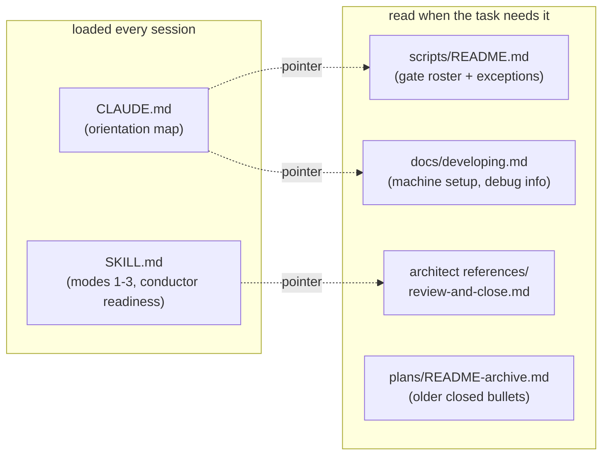

# 0244 — Sessions start lighter: standing context moves to where it is read on demand

> **Status:** approved (2026-10-01). Runs after Plan 0242 closes (both edit the architect skill).
> **Created:** 2026-10-01
> **Owner skill(s):** dev, human
> **Related ADRs:** [ADR-0116](../adrs/0116-an-index-row-is-a-pointer-and-a-gate-holds-it-to-one.md), [ADR-0210](../adrs/0210-a-claude-repair-is-the-owners-and-a-session-that-needs-one-parks-with-the-edit.md)

## TL;DR

Every session in this repository starts with about 65k tokens of context before it does anything.
That figure is the median first-turn context across 122 lane sessions from 2026-09-22 to 09-30, and
it includes the 48-second readiness checks. Every later turn re-reads all of it from cache.

Three files carry most of the avoidable part:
- `CLAUDE.md` (41 KB), loaded into every session;
- the architect skill (82 KB), loaded into every architect session, including readiness;
- `docs/plans/README.md` (143 KB), which `CLAUDE.md` tells every session to read first, and which 23
  lane sessions did.

This plan **moves** material out of all three to files read on demand, and deletes nothing. The
first visible effect is a `CLAUDE.md` that fits on a few screens.

## Context & problem

Implement sessions are 66% of the conductor's spend ($329 of $499 in the audited window), at about 120
turns each. A standing context cut by 20 to 30k tokens takes roughly that share off every turn's cache
read. The three files grew for good reasons: each rule landed where its last violation was noticed. But
most of their bytes serve one task, not every session:

- **`CLAUDE.md`'s "Where things live" is 20 KB.** Of that, 8.2 KB is the `scripts/` entry (the gate
  roster and the renderer, maintenance-tool and hook-helper exceptions), and 4.4 KB is a `docs/` map
  that `docs/README.md` "Repository layout" already carries. "Machine setup" and "Dependencies compile
  with no debug info" add another 4.1 KB that only a person setting up a machine or chasing a
  backtrace needs.
- **The architect skill's Mode 4 is 61 KB of its 82 KB**: the review lenses, the close ceremony and
  conductor mode. A planning session or a readiness check reads none of it.
- **`docs/plans/README.md`'s "Recently closed" holds 200 bullets** (51 KB), each a pointer to a plan
  `done/` already holds.

## Decision

**Move, don't delete.** Each moved block keeps its words and gains a one-line pointer where it was.

**Rejected alternatives:**
- **A byte-cap gate on `CLAUDE.md` and every `SKILL.md`:** it would stop regrowth. The owner chose
  moves without a new gate on 2026-10-01, so a regrowth is caught by the next audit instead.
- **Trimming the plans index alone:** it is the largest file, but it is read by fewer sessions than
  `CLAUDE.md`, which every session loads.

## Architecture diagram

## Implementation phases

### Phase 1 — `CLAUDE.md` becomes an orientation map
- **Owner skill:** dev
- **What:** four moves, each leaving a one-line pointer in `CLAUDE.md`:
  1. **The `scripts/` entry's prose** moves verbatim to a new `scripts/README.md`: the gate roster,
     the CI-only gates, the close-ceremony six, the renderers, the maintenance tool and the hook
     helper. The rule "every `.mjs` is wired into pre-push or CI, with named exceptions" moves with
     it.
  2. **The `docs/` entry** keeps the load-bearing set as one line per document and points at
     `docs/README.md` "Repository layout" for the rest.
  3. **"Machine setup: the linker override" and "Dependencies compile with no debug info"** move
     verbatim into `docs/developing.md`, under "Building". Where a sentence repeats what that page
     already says, the moved copy keeps the page's existing wording rather than adding a second one.
  4. **The plans-index line** "Read this first each session" becomes "Read this first in a
     human-started session; a conductor session is handed its plan."

  Every top-level directory stays named in `CLAUDE.md`, and the cross-cutting non-negotiables, commit
  hygiene and pitfalls stay whole.
- **Files touched:** `CLAUDE.md`, `scripts/README.md` (new), `docs/developing.md`, `docs/README.md`
  (the layout row for `scripts/README.md`).
- **Done when:**
  - **Size:** `node -e "console.log(require('fs').statSync('CLAUDE.md').size)"` prints a number at or
    below 25000.
  - **Moved, not lost:** `git grep -c "check-gate-carriers" -- scripts/README.md` is at least 1.
  - **Moved setup:** `git grep -c "rust-lld" -- docs/developing.md` is at least 1.
  - **Links:** `node scripts/check-doc-links.mjs` and `node scripts/toc.mjs --check` exit 0.
  - **Prose gates:** `node scripts/check-system-counts.mjs` and `node scripts/check-reader-prose.mjs`
    exit 0.

### Phase 2 — The plans index keeps only the recent closes
- **Owner skill:** dev
- **What:** in `docs/plans/README.md` "Recently closed", the 15 newest bullets stay. Every older bullet
  moves verbatim, in its existing order, to a new `## Closed earlier (index bullets)` section of
  `docs/plans/README-archive.md`, placed directly before its `## Recently closed (full entries)`, together with any reference-link definitions it uses. The section's
  intro gains one sentence: it keeps the 15 newest, and the archive holds the rest. This is a
  mechanical move. No sequencing prose is touched, because judging which notes are superseded is the
  architect's step 3e at a close.
- **Files touched:** `docs/plans/README.md`, `docs/plans/README-archive.md`.
- **Done when:**
  - **Fifteen kept:** a `node -e` one-liner counting lines that start with `- [` between the
    `## Recently closed` heading and the next `## ` heading of `docs/plans/README.md` prints 15.
  - **Size:** `node -e "console.log(require('fs').statSync('docs/plans/README.md').size)"` prints a
    number at or below 100000.
  - **Gates:** `node scripts/check-doc-links.mjs`, `node scripts/check-index-rows.mjs` and
    `node scripts/toc.mjs --check` exit 0.

### Phase 3 — The architect skill loads its review and close on demand
- **Owner skill:** human
- **Blocks merge:** no
- **What:** the owner applies, in an interactive session, the edits under `.claude/` and their two
  conductor prompts. A headless session cannot write `.claude/` (ADR-0210), and nothing in this plan
  reads the result.
  1. **The move:** the whole of `## Mode 4 — Reviewing an implementation` in
     `.claude/skills/architect/SKILL.md` moves verbatim to a new
     `.claude/skills/architect/references/review-and-close.md`. That is everything from its heading
     to the line before `## Commit hygiene (for your own doc commits)`, including both "Closing a
     plan that was built in a worktree" and "Conductor mode".
  2. **The readiness block stays.** The `**readiness**` paragraph of conductor mode and its five
     bullets are copied back into `SKILL.md` under a short `## Conductor mode — readiness` heading,
     because readiness sessions are the most frequent architect sessions and must not need the
     reference.
  3. **The pointer.** In the removed section's place, `SKILL.md` carries:

     > ## Mode 4 — Reviewing an implementation, and the close
     >
     > A review, a close, and a conductor `review` or `close` session start by reading
     > `references/review-and-close.md` in full: the five lenses, the close-ceremony bookkeeping,
     > the worktree close sequence and conductor mode. Nothing in it is optional because it lives in
     > a reference.

  4. **The prompts:** `tools/conductor/prompts/review.md` and `tools/conductor/prompts/close.md` each
     gain, after their `Enter the ## Conductor mode section of your skill` sentence: "That section is
     in `.claude/skills/architect/references/review-and-close.md`; read it first."
  5. **The index:** the `## References` list in `SKILL.md` gains the new file.
- **Files touched:** `.claude/skills/architect/SKILL.md`,
  `.claude/skills/architect/references/review-and-close.md` (new),
  `tools/conductor/prompts/review.md`, `tools/conductor/prompts/close.md`.
- **Done when:**
  - **Size:** `node -e "console.log(require('fs').statSync('.claude/skills/architect/SKILL.md').size)"`
    prints a number at or below 25000.
  - **Links:** `node scripts/check-doc-links.mjs` exits 0.
  - **Conductor tests:** `node --test tools/conductor/test/*.test.mjs` passes.

## Risks & open questions

- **A rule moved out of the always-loaded file can be missed** by a session that never opens the
  file it moved to. The moves are chosen so that each destination is read by exactly the task that
  needs it:
  - `scripts/README.md` by whoever edits a gate;
  - `docs/developing.md` by whoever sets up a machine;
  - the review reference by every review and close, which Phase 3's pointer and prompts make
    explicit.

  The non-negotiables, which bind every session, do not move.
- **The saving is not measured by any gate here.** Byte sizes are the done-whens because they are
  checkable. The token figure that matters is the median first-turn context of a conductor implement
  session, about 65k before this plan, and the next workflow audit should read it from the lane
  transcripts.
- **Phase 2 moves 185 bullets.** A bullet whose reference-link definition stays behind shows up as
  `[label] (no definition in this file)` from `check-doc-links.mjs`, which is the done-when that
  catches it.

## What this plan does NOT do

- **It does not trim the dev, studio-builder or preset-author skills.** The dev skill's largest
  block, the four-step workflow, is read by every dev session.
- **It does not move sequencing prose out of the plans index.** That is the architect's at a close.
- **It does not add a size gate.**

## Implementation log

**Lane:**

| phase | owner | state | commit |
|---|---|---|---|
| 1 — `CLAUDE.md` becomes an orientation map | dev | not started | |
| 2 — The plans index keeps only the recent closes | dev | not started | |
| 3 — The architect skill loads its review and close on demand | human | not started | |

### Notes

### Close triggers
