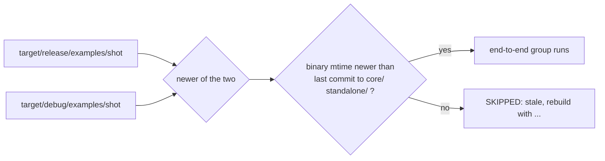

# 0245 — A gate that runs a built binary checks that it is current

> **Status:** draft
> **Created:** 2026-10-01
> **Owner skill(s):** dev
> **Related ADRs:** [ADR-0033](../adrs/0033-testing-strategy-coverage-ratchet-and-pre-push-gate.md), [ADR-0122](../adrs/0122-a-sidecar-tool-documents-itself-in-one-place.md)

## TL;DR

The sd-filter suite's end-to-end group runs whatever `shot` binary sits at
`target/release/examples/`, and never rebuilds it. A binary built before the source it is tested
against fails the pre-push hook for no reason in the code. With this plan, the suite picks the newer
of the release and debug `shot`. When the one it picks predates the last commit to the source that
builds it, the suite skips the group with a notice naming the rebuild command, the same way it
already skips when no binary exists.

## Context & problem

Three of the owner's interactive sessions between 2026-09-26 and 09-30 opened on "pre-push failed".
One was this cause, and it was diagnosed by hand: `shot --bar-grid` answered "unknown argument" because
the release binary was built at 19:44 from a tree without Plan 0212's flag, which reached `main` after
it. A second was the same shape in the studio tests: a stale release player. That one was fixed in
`d40297f7` by taking the newer of release and debug (`studio/electron/testing/player.ts`). The third
did not reproduce. The sd-filter suite is the last gate consumer with this shape. It runs at every
push, and in every conductor gate where `python3` is on `PATH`.

## Decision

Skip-on-stale, with a notice. **Rejected alternatives:**
- **Have the hook build the release `shot` first:** the release profile is `lto = "fat"` with one
  codegen unit, which is minutes per push.
- **Fail on stale:** that is the current behaviour, and its failure blames the code for the build
  directory.
- **Compare file modification times against the sources:** a checkout or a `git switch` rewrites
  source mtimes, so they say nothing about what the binary was built from. The last commit time of
  the paths that build it does.

## Architecture diagram

## Implementation phases

### Phase 1 — The sd-filter suite takes a current `shot` or skips
- **Owner skill:** dev
- **What:**
  - **`find_shot(repo)`** in `tools/sd-filter/test_sd_filter.py` replaces the fixed release path. It
    looks at the release and debug `shot` (with `.exe` on Windows) and takes the newest by
    modification time, keeping release on a tie as the studio does.
  - **`shot_is_current(path, repo)`** compares that binary's modification time with the committer
    time of the newest commit touching `core/`, `standalone/`, `Cargo.toml` or `Cargo.lock`, read
    with `git log -1 --format=%ct -- <paths>`.
  - **The end-to-end group** runs only for a current binary. Otherwise it prints
    `SKIPPED: stale shot at <path> (built before <short sha> touched <paths>)` and the rebuild
    command, in the existing no-binary skip's shape. A repository where `git` is unavailable treats
    the binary as current and says so in one line.
  - **The checks:** in-process checks of both functions run in every invocation. They use temporary
    files with set modification times and a stubbed commit time, and need no build.
- **Files touched:** `tools/sd-filter/test_sd_filter.py`, `tools/sd-filter/README.md` (the test's
  binary rule), `docs/developing.md` (the pre-push section's line on the sd-filter step).
- **Done when:**
  - **Suite passes:** `python3 tools/sd-filter/test_sd_filter.py` exits 0 on this machine.
  - **Checks reported:** its output includes the in-process checks for the following cases:
    - the newer of two binaries is chosen;
    - a tie keeps release;
    - a binary older than the stubbed commit time is reported stale;
    - a binary newer than it is reported current.
  - **Real tree:** on a tree where the newest `shot` predates the last commit to `core/` or
    `standalone/`, the end-to-end group prints the stale notice instead of running.

## Risks & open questions

- **A skip hides coverage until someone rebuilds.** The in-process checks above the group already
  carry the same property, as the existing skip's own note says. The stale notice names the command.
  The conductor's gate logs keep the notice, so a skip is visible after the fact.
- **A commit that touches `core/` without changing what `shot` does still marks the binary stale.**
  That is a false skip, never a false pass, which is the intended direction.

## What this plan does NOT do

- **It does not touch the studio's player lookup.** `d40297f7` already fixed it.
- **It does not touch `studio/scripts/ui-shots.mjs`**, which is a renderer that no gate runs.
- **It does not make any gate build a release binary.**

## Implementation log

**Lane:**

| phase | owner | state | commit |
|---|---|---|---|
| 1 — The sd-filter suite takes a current `shot` or skips | dev | not started | |

### Notes

### Close triggers
