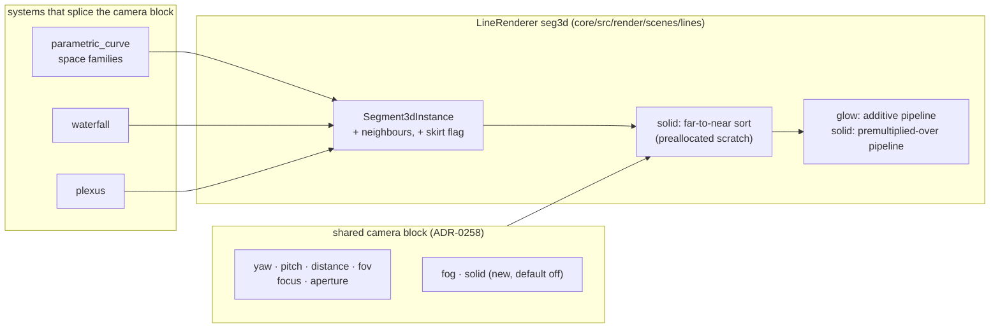

# 0248 — 3D strokes gain joins, depth cues and a solid mode

> **Status:** in-progress
> **Created:** 2026-10-05
> **Approved:** 2026-10-05 (user)
> **Owner skill(s):** dev, human
> **Related ADRs:** [0263](../adrs/0263-a-3d-stroke-may-be-solid-by-a-back-to-front-sort-and-depth-cues-ride-the-shared-camera.md)
> (proposed; this plan's decision), [0257](../adrs/0257-a-shared-camera-projects-3d-primitives-and-depth-of-field-is-a-per-endpoint-circle-of-confusion.md),
> [0258](../adrs/0258-a-system-takes-depth-through-one-shared-camera-block-and-its-3d-mode-forgoes-what-seg3d-does-not-draw.md),
> [0158](../adrs/0158-a-joined-end-carries-its-own-miter-length.md),
> [0249](../adrs/0249-a-human-phase-may-be-owed-after-the-merge.md)
> **Closes:** design-backlog 0279, 0280, 0281
> **Runs before:** Plans [0237](0237-the-l-system-turtle-turns-in-space.md),
> [0239](0239-the-swarm-moves-into-a-real-camera.md) and
> [0240](0240-the-attractor-projects-through-the-shared-camera.md), which splice the camera block this
> plan extends.

## TL;DR

The owner judged the knot (Plan 0236) and the waterfall (Plan 0238) live, and both read as depth
only weakly, for three reasons the `seg3d` stroke shares: a heavily blurred stroke breaks into a comb
at its joints, nothing fades or shifts with distance, and nothing occludes, so a knot reads as
glowing wire and a waterfall's rows show through its peaks. This plan fixes all three in the shared
camera layer, cheapest first: 3D joins, then `fog` and a depth colour axis, then a per-preset `solid`
mode that sorts segments far to near and paints near over far, with a black skirt under each
waterfall row. Every new param defaults to off, so the only pixels that move without a preset asking
are the joins'. The first visible behaviour is a blurred knot whose strand is one smooth soft band.

## Context & problem

The three findings are backlog 0279, 0280 and 0281, each with its mechanism read from the code.
The `seg3d` pipeline is additive (`ADDITIVE_LIGHT_SATURATING_COVERAGE`) with no depth attachment; a
`Segment3dInstance` carries no join, so blurred neighbours overlap at every joint; and the colour of a
space curve runs along its path. The engine has no depth buffer anywhere, and the `seg3d` instances
are already uploaded from the CPU each frame, which is what makes a CPU sort the cheap route.

The owner's interview on 2026-10-05 set the scope: all three findings in one plan; occlusion chosen
**per preset**, keeping the additive glow as the default; the mechanism reaching the space curves,
the waterfall, `plexus` and every later camera plan; and "far" reading as fog **plus** an optional
depth colour axis on the space curves.

## Decision

We build ADR-0263's three parts in the order that keeps each phase useful alone: joins (no new
param, fixes the comb), then `fog` and `hue_axis` (default off), then `solid` with the waterfall's
skirts (default off). We rejected a depth buffer (a blurred edge is translucent and would need a
two-pass split), darkening behind (not occlusion), and solid everywhere (the shipped `plexus` look is
additive); ADR-0263 records each.

## Architecture diagram



## Implementation phases

### Phase 1 — A 3D joint is mitred, and the comb goes
- **Owner skill:** dev
- **What:** `Segment3dInstance` gains its neighbours: the point before `a` and the point after `b`,
  each marked absent where there is none. The `seg3d` vertex shader projects both, and mitres each
  joined end in screen space, falling back to the bevel at ADR-0158's limit, so two blurred
  neighbours meet at the mitre line instead of overlapping. An end with no neighbour draws exactly as
  today. The space curves and the waterfall rows fill the neighbours; `plexus` links carry none.
- **Files touched:** `core/src/render/scenes/lines/renderer.rs`,
  `core/src/render/scenes/lines/renderer/tests.rs`, `core/src/render/scenes/lines/parametric.rs`,
  `core/src/render/scenes/lines/waterfall.rs`, `core/src/render/scenes/plexus/mod.rs`, `core/tests/`.
- **Done when:**
  - A straight line drawn as eight collinear joined segments, at an `aperture` that blurs it, renders
    identically to the same line drawn as one segment, on the same adapter in the same run. This is
    the property the comb violates.
  - A joined right-angle bend has no luminance maximum at the joint along the stroke's centre line,
    against the segment interiors either side, with the aperture open. This mirrors the 2D
    `line_joints` property, with ridges in place of holes.
  - A `plexus` frame captured before and after this phase is byte-identical.
  - The log names every golden baseline whose capture now differs. None is re-blessed here (Phase 7).

### Phase 2 — Fog, and a depth colour axis for the space curves
- **Owner skill:** dev
- **What:** The camera block gains `fog` (`0`–`1`, default `0`): each endpoint's light is scaled by
  `1 - fog * d`, where `d` is its depth on `focus`'s 0-nearest, 1-farthest scale, and the scale is
  interpolated along the segment. The space curve families gain `hue_axis` (`0`–`1`, default `0`):
  `0` keeps the colour along the path (ADR-0059), `1` colours by `d`, and between mixes the two
  coordinates. `hue_axis` is inert on the flat families. The generated reference, schemas and
  `.taplo.toml` are regenerated.
- **Files touched:** `core/src/render/camera.rs`, `core/src/render/camera.wgsl`,
  `core/src/render/scenes/lines/renderer.rs`, `core/src/render/scenes/lines/parametric.rs`,
  `core/src/render/scenes/lines/waterfall.rs`, `core/src/render/scenes/plexus/mod.rs`,
  `presets/README.md`, `presets/schema/`, `presets/preset.schema.json`, `.taplo.toml`,
  `docs/specs/player-schema.json`, `core/tests/`.
- **Done when:**
  - At `fog = 0` and `hue_axis = 0`, every frame the golden roster captures is byte-identical to
    the end of Phase 1.
  - At `fog = 1`, a two-point fixture spanning the volume's depth draws its farthest end black and
    its nearest end at full light.
  - At `hue_axis = 1`, two points of a knot at the same depth take the same palette coordinate, and
    two at different depths take different ones.
  - The schema and parameter-reference tests pass on the regenerated files.

### Phase 3 — Solid: far to near, near over far
- **Owner skill:** dev
- **What:** The camera block gains `solid` (`0` or `1`, default `0`, read per frame; at `0.5` and
  above the frame is solid). `seg3d` builds a premultiplied-over pipeline beside the additive one. In
  solid mode the renderer sorts the frame's segments far to near by the camera depth of each
  segment's midpoint, into scratch preallocated at the `seg3d_segments` cap, and draws them over.
  Nothing allocates per frame, and the hot-path pragma covers the new code.
- **Files touched:** `core/src/render/camera.rs`, `core/src/render/scenes/lines/renderer.rs`,
  `core/src/render/scenes/lines/renderer/tests.rs`, `core/tests/suite/hygiene.rs`, `core/tests/`.
- **Done when:**
  - Two segments crossing on screen at different depths: in solid mode the crossing pixel takes the
    near segment's colour; in glow mode it takes the sum, as today.
  - The order a frame is drawn in does not depend on the order the system emitted its segments.
  - At `solid = 0`, every golden capture is byte-identical to the end of Phase 2.
  - The sort's cost is measured on `Floor` at 8,000 segments and on `Rich` at 20,000, release
    profile, at 1920x1080, beside the same frame in glow mode on the same adapter. The log names the
    machine, and each solid frame is inside NFR section 1's budget.

### Phase 4 — The waterfall's rows hide what is behind them
- **Owner skill:** dev
- **What:** In solid mode each waterfall row also emits a skirt: a black filled band from the row's
  line down to the ground, sorted with its row so that nearer rows cover farther ones. A flag on
  `Segment3dInstance`, which the vertex shader extends to the ground plane, is the suggested shape,
  so that skirts and lines share one pipeline and one sort. Glow mode emits no skirt.
- **Files touched:** `core/src/render/scenes/lines/renderer.rs`,
  `core/src/render/scenes/lines/waterfall.rs`, `core/tests/`.
- **Done when:**
  - A two-row fixture whose near row has a tall peak: in solid mode a pixel on the far row's line
    behind the peak shows the near row or black, not the far row's light. In glow mode it shows the
    far row's light, as today.
  - The row clamp still counts what a row costs, skirt included, and announces through the existing
    `OverflowContext::Rows`.

### Phase 5 — Documentation
- **Owner skill:** dev
- **What:** `docs/presets.md` describes `solid`, `fog` and `hue_axis`, what each costs and which
  systems read them. `docs/preset-guide.md` gains one picture of a solid knot with fog. The
  `docs/examples/` teaching presets that show the camera gain a solid variant where it reads better.
  `docs/on-device-validation.md` gains the solid sort's cost check at the Floor cap. The text that
  the preset-author reference needs is written into this plan's `### Notes` for Phase 6, since a
  headless session cannot write `.claude/` (ADR-0210).
- **Files touched:** `docs/presets.md`, `docs/preset-guide.md`, `docs/images/`, `docs/examples/`,
  `scripts/docs-shots.mjs`, `docs/on-device-validation.md`, this plan's `## Implementation log`.
- **Done when:** `node scripts/toc.mjs --check`, `node scripts/check-doc-links.mjs`,
  `node scripts/check-reader-prose.mjs` and `node scripts/check-system-counts.mjs` exit 0.

### Phase 6 — The preset-author reference
- **Owner skill:** human
- **Blocks merge:** no
- **What:** The owner applies, in an interactive session, the text Phase 5 left in the log to
  `.claude/skills/preset-author/references/systems.md`: `solid`, `fog` and `hue_axis` in the
  `parametric_curve`, `waterfall` and `plexus` sections.
- **Files touched:** `.claude/skills/preset-author/references/systems.md`.
- **Done when:** the edit is committed on `main` and `node scripts/check-doc-links.mjs` exits 0.

### Phase 7 — The moved baselines are blessed
- **Owner skill:** human
- **Blocks merge:** no
- **What:** Re-bless, on DX12 WARP, the baselines Phase 1's log names, and nothing else. If Plan 0218
  has moved blessing to lavapipe by then, bless there instead.
- **Files touched:** `core/tests/golden/`, `core/tests/suite/` baselines named in the log.
- **Done when:** the Windows CI golden job is green on `main`.

### Phase 8 — The looks, judged
- **Owner skill:** human
- **Blocks merge:** no
- **What:** The owner runs the knot and the waterfall live with music, in glow and in solid, with
  and without fog, and judges whether depth now reads, whether the waterfall reads as terrain, and
  whether the blurred strand is smooth.
- **Files touched:** none.
- **Done when:** the owner records a keep, or a list of what is off, in this plan's log.

## Data shapes

```rust
// illustrative — not the final interface
pub struct Segment3dInstance {
    pub a: [f32; 3],
    pub b: [f32; 3],
    pub color: [f32; 3],
    pub width: f32,
    pub alpha: f32,
    pub prev: [f32; 3], // the point before `a`; equal to `a` when `a` is an open end
    pub next: [f32; 3], // the point after `b`; equal to `b` when `b` is an open end
    pub skirt: f32,     // 1 on a waterfall row's skirt instance, else 0
}
```

Field order is shader-location order, so new fields go at the end.

## Risks & open questions

- **The goldens move, and blessing is WARP-only.** Phase 1's joins change the space curves' and the
  waterfall's captures. On Linux the comparisons skip with a printed notice, so the lane and the
  conductor's gates stay green; the Windows CI golden job reads red on `main` from the merge until
  Phase 7. ADR-0251 makes that red advisory rather than blocking. If that window is unacceptable,
  run Phase 7 before the merge on a Windows box, or land Plan 0218 first.
- **The painter's sort misorders a segment pair that crosses in depth within its own length.**
  ADR-0263 accepts a pixel-scale seam; Phase 8's judgement is where it would show.
- **The sort's cost on Rich.** 20,000 segments sorted every frame on the CPU is unmeasured. If it
  breaks NFR section 1, the lever is a coarser key (a quantized depth bucket sort), not a smaller cap.
- **Fog and the waterfall's `fade`** overlap seen from the front. Both stay; `docs/presets.md` says
  which is which.

## What this plan does NOT do

- No depth buffer, and no change to any 2D line pipeline.
- No change to `plexus`'s look unless a preset sets `solid` or `fog`.
- No new preset in the shipped set. Solid and fogged presets are content work after Phase 8.
- It does not run Plans 0237, 0239 or 0240; it is what they should be built on.

## Implementation log

> Written by `dev` — one row per phase as that phase's commit lands, and the close block after the
> last one. **The phases above are the contract; everything here is what happened.**

**Lane:** branch `plan-0248-3d-strokes-gain-joins-depth-cues-and-a-solid-mode`, worktree
`/home/igor/Work/rlx-plan-0248`

| phase | owner | state | commit |
|---|---|---|---|
| 1 — A 3D joint is mitred, and the comb goes | dev | done | committed with this row |
| 2 — Fog, and a depth colour axis for the space curves | dev | not started | |
| 3 — Solid: far to near, near over far | dev | not started | |
| 4 — The waterfall's rows hide what is behind them | dev | not started | |
| 5 — Documentation | dev | not started | |
| 6 — The preset-author reference | human | not started | |
| 7 — The moved baselines are blessed | human | not started | |
| 8 — The looks, judged | human | not started | |

### Notes

- **Phase 1, the moved baselines.** Golden comparisons skip off WARP, so the moved set was read by
  capturing the 3D fixtures with the release `shot` (640x360, 60 frames) before and after the phase
  on this Linux box's Vulkan adapter and comparing the PNGs byte for byte. Differ:
  `parametric_lissajous_3d`, `parametric_torus_knot`. Byte-identical: `plexus`, `plexus_sheet`,
  `waterfall` (its rows are flat under the roster's silent frame, and a collinear joined chain
  renders exactly as before), plus the 2D `parametric_curve`, `spectrum` and `lsystem` controls.
  `waterfall_ramp` (`the_waterfall_holds_a_ramped_ring`) draws ramped, non-collinear rows and is
  expected to move, but was not captured. Phase 7's set: `parametric_lissajous_3d.png`,
  `parametric_torus_knot.png`, `waterfall_ramp.png`.
- **Phase 1, the plexus byte-identity criterion** was checked the same way (`shot` captures of
  `plexus.toml` and `plexus_sheet.toml`, before and after), not by a committed test.
- **Phase 1, the bend probe's tolerance.** The right-angle test allows, at each sampled offset, half
  a pixel of the profile's own cross-stroke slope plus one half-float step: the inside-corner
  sample reads 0.0644 against 0.0568 on the arms at +0.5 half-widths (allowance 0.0168), and the
  centre line reads exactly equal. The unjoined control's centre line rises 0.056 there, over 40
  allowances.

### Close triggers

- **`presets/` touched:**
- **Plan header `Closes:`** design-backlog 0279, 0280, 0281
- **What shipped:**
- **Operator docs touched:**
- **Backlog probes (`node scripts/check-backlog-claims.mjs`):**
- **Full suite:**
- **Outstanding `human` phases:**

## Followups (after this lands)
