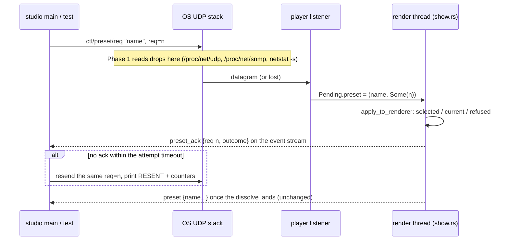

# 0252 — The lost preset ask is located and answered

> **Status:** in-progress
> **Created:** 2026-10-07
> **Owner skill(s):** dev, studio-builder, human
> **Closes:** design-backlog 0219, 0220
> **Related ADRs:** [ADR-0265](../adrs/0265-a-preset-ask-carries-a-request-id-and-the-player-answers-it-at-the-drain.md)
> (this plan's decision), ADR-0176 (OSC control-in, the contract rule), ADR-0221 (the listener's
> counters and the refused-selection `preset_error`), ADR-0193 (why the two control-path tests are
> not isolated)

## TL;DR

A `ctl/preset` datagram sometimes never reaches the player's socket on loopback. Every counter on the
player's side reads zero when that happens. This plan does two things. First, the two tests that
meet the loss read the operating system's own UDP drop counters when it happens. Second, a new row,
`ctl/preset/req`, carries a request id that the player answers with a `preset_ack` event at the drain
that applied it. The studio's library click and the two tests then resend a lost ask instead of
waiting on it forever, and every resend is printed. Users notice one change: a click in the studio
library that used to do nothing now either lands or says it gave up.

## Context & problem

Backlog 0219 and 0220 are the two open failures on the control path. 0219 is a `ctl/preset` datagram
that `send_to` sent and `recv_from` never returned: 3 of 79 loaded runs on 2026-09-14, and 2 of 19 at
Plan 0198 Phase 4. ADR-0221's counters excluded a dead listener, a failing socket, a decoder refusal
and a full queue, so the loss is in front of the socket. 0220 is a roster walk that stalls on one ask
while the ping sent behind it is answered. Two of its candidates remain open: the datagram was lost,
or the selection took and the dissolve never completed. The event stream cannot separate them,
because `preset` fires only once the preset on screen changes.

The owner chose "locate, then ack" at the interview: read where the datagram went, and make delivery
robust either way. Moving the studio off UDP, and adding sequence numbers on every row, were both
rejected. ADR-0265 records why.

**This plan cannot assume the loss reproduces on Linux.** The 2026-09-14 runs predate the Linux
bring-up (Plan 0219 closed 2026-09-22). Plan 0198's own review discusses Windows `recvfrom`
behaviour. So the instrument reads both platforms' counters, and Phase 6 takes the loaded run on the
reference Linux box and, when the rig is available, on the Windows box.

## Decision

Build the counters first, the protocol row second, then move the tests and the studio onto the row.
Finish with one loaded reproduction that reads everything the earlier phases built. The shape is
ADR-0265's:

- **Row:** `/rlx/v1/ctl/preset/req`, `s name, i req`. `ctl/preset` is unchanged.
- **Answer:** `preset_ack` with `req`, `name` and `outcome` ∈ {`selected`, `current`, `refused`},
  emitted from `apply_control_rest` at the drain. `refused` keeps ADR-0221's `preset_error` beside
  it.
- **Idempotence:** a `req` ask naming the preset on screen or the preset already dissolving in starts
  no transition and is answered `current`.
- **Sender rule:** one ask outstanding, the same `req` resent on a timeout, a newer ask supersedes,
  and a give-up is bounded. The studio resends every 1 s up to 3 times. The tests keep their 5 s
  per-attempt wait (ADR-0193's deadline is unchanged) and allow 3 attempts.
- **A resend is never silent.** Each one prints a `RESENT` line naming the ask, the attempt and the
  counter readings. The two test binaries show passing output (`success-output = "final"`), so a
  suite that passed only on a second attempt says so.

We rejected bundling a fix for the stalled dissolve. If Phase 6 catches a `selected` ack followed by
no `preset`, that is a newly located defect, and the close files it as a new entry.

## Architecture diagram



## Implementation phases

### Phase 1 — The tests read the operating system's UDP counters at a failure
- **Owner skill:** dev
- **What:** A test-support module reads the counters that sit in front of `recv_from` and that the
  player cannot see:
  - **Linux:** the listener socket's own `drops` column in `/proc/net/udp`, matched by its bound
    local port; the system-wide `Udp: InErrors` and `RcvbufErrors` from `/proc/net/snmp`; and
    `/proc/sys/net/core/rmem_default` as the receive buffer the socket got, since nothing sets
    `SO_RCVBUF`.
  - **Windows:** the system-wide UDP `Receive Errors` from `netstat -s -p udp`. Windows has no
    per-socket figure.

  `expect_delivery` in `control_loopback.rs` takes a reading before the send. On a miss, its failure
  message prints the deltas beside the listener counters it already prints. The `stream_show` walk's
  stall report does the same for the child's port, taken from `hello`'s `control` field. No protocol
  change, and no new dependency: the readers parse text files or a child process's output.
- **Files touched:** `standalone/tests/common/udp_counters.rs` (new), `standalone/tests/common/mod.rs`
  (declares it), `standalone/tests/control_loopback.rs`, `standalone/tests/stream_show.rs`.
- **Done when:** The parsers are tested against literal fixture text for each of the three Linux
  files and one `netstat -s -p udp` block, and a missing or unreadable source yields "unavailable"
  rather than a panic. On Linux, a test binds a socket, reads its `drops` row by port, and finds it
  at 0. `cargo nextest run -p standalone --test control_loopback --test stream_show` passes.
  `git grep -n "RcvbufErrors" -- standalone/tests` names the new module.

### Phase 2 — The player answers a preset ask that carries an id
- **Owner skill:** dev
- **What:** The decoder accepts `/rlx/v1/ctl/preset/req` with tags exactly `si`, and `Action` gains
  `PresetReq { name, req }`. It stays `Copy`, and the encoder and the round-trip test cover it.
  `Pending` keeps the last preset ask as a name plus an optional `req`, with the same last-wins rule
  and no new allocation. A plain `ctl/preset` landing after a `req` ask in the same frame clears the
  `req`. `apply_to_renderer` reports an outcome:
  - `refused` when the roster holds no such name;
  - `current` when the asked name is the preset on screen or the one dissolving in, in which case it
    calls nothing;
  - `selected` otherwise.

  That needs a public read of the incoming preset during a dissolve, which `roster.rs` does not
  expose today. `apply_control_rest` emits `preset_ack` for a `req` ask, beside the pongs. Spec 0003
  gains the row, the event and three invariants: an ack is emitted at the drain, not on arrival; a
  `req` ask for the current preset is inert; and a sender keeps one ask outstanding.
- **Files touched:** `standalone/src/osc/decode.rs`, `standalone/src/control.rs`,
  `standalone/src/show.rs`, `standalone/src/events.rs`, `core/src/render/roster.rs` (the incoming
  preset's name), `docs/specs/0003-studio-control-protocol.md`.
- **Done when:** Unit tests show the following:
  - `ctl/preset/req` with tags `s`, `sf` or `ii` is refused as `WrongArguments`, and with `si` it
    round-trips through `encode` and `decode`.
  - A `req` ask for an absent name yields `refused` and the existing unresolved name.
  - A `req` ask for the active preset yields `current` and starts no transition: the renderer's
    preset name and transition state are unchanged after the next render.
  - A `req` ask for the preset already dissolving in yields `current` and does not restart the
    dissolve.
  - A plain `ctl/preset` after a `req` ask in one frame leaves no `req` to answer.

  A `show.rs` test asserts that one `preset_ack` line carries `req`, `name` and `outcome` as spec
  0003 spells them. `cargo nextest run -p standalone` passes. **The studio's
  `protocol.spec.test.ts` is expected to fail from this commit until Phase 5**: it diffs the spec's
  tables against the studio's union in both directions, by design. This phase does not run it.

### Phase 3 — The two control-path tests resend instead of waiting once
- **Owner skill:** dev
- **What:** `a_preset_datagram_selects_by_name` sends `ctl/preset/req` and treats a drained
  `PresetReq` carrying its `req` as delivery. The roster walk in `stream_show.rs` treats a
  `preset_ack` naming its `req` as delivery and still waits for the `preset` event before moving
  on. Each allows 3 attempts at its existing per-attempt wait and resends the same `req` after a
  miss. Every resend prints one line to stderr beginning `RESENT`, naming the ask, the attempt
  number and Phase 1's counter deltas. A test fails only when all 3 attempts are lost, or, in the
  walk, when an ack reading `selected` is followed by no `preset` within the existing deadline. That
  failure message names it as a dissolve that never completed, distinct from a lost ask.
  `.config/nextest.toml` sets `success-output = "final"` for the two binaries, so a passing run's
  `RESENT` lines appear in the summary.
- **Files touched:** `standalone/tests/control_loopback.rs`, `standalone/tests/stream_show.rs`,
  `.config/nextest.toml`.
- **Done when:** A test-local fault, a sender that skips its first send, makes the loopback test pass
  on attempt 2 and print exactly one `RESENT` line. Without the fault it prints none. `git grep -n
  "success-output" -- .config/nextest.toml` shows the override naming both binaries. `cargo nextest
  run -p standalone --test control_loopback --test stream_show` passes. The guard in
  `core/tests/hygiene.rs` that holds ADR-0193's override list still passes.

### Phase 4 — The full suite
- **Owner skill:** dev
- **What:** The once-per-plan full run ADR-0156 owes at the last `dev` phase, plus fmt, clippy and
  rustdoc over the workspace.
- **Files touched:** this plan's implementation log only.
- **Done when:** `cargo nextest run --workspace` exits 0. Its `Summary` counts are in the log, along
  with any `RESENT` line the run printed.

### Phase 5 — The studio's library click is acknowledged
- **Owner skill:** studio-builder
- **What:** `protocol.ts` gains the `preset_req` action, its address and the `preset_ack` event
  schema, which turns `protocol.spec.test.ts` green again. The main process sends a library selection
  as `ctl/preset/req` with a fresh id, resends the same id every 1 s up to 3 attempts until a
  `preset_ack` names it, and drops the pending ask when a newer selection supersedes it. A give-up
  reaches the renderer and appears where a refused selection's `preset_error` appears today, worded
  as "the player did not answer". A `refused` ack shows no second message, because the
  `preset_error` beside it already says so.
- **Files touched:** `studio/shared/protocol.ts`, `studio/electron/player/control.ts`,
  `studio/electron/player/control.test.ts`, `studio/electron/player/events.ts`,
  `studio/renderer/hooks/usePlayer.ts`, `studio/renderer/hooks/usePlayerEvents.ts`, and the component
  that renders a selection's error today.
- **Done when:** A fake-timer test shows the ask sent once, resent with the same id at 1 s and 2 s,
  and given up after the third attempt with exactly one surfaced message. An ack for the pending id
  stops the resends. An ack for a superseded id is ignored. A second selection cancels the first's
  timer. `npm --prefix studio test`, `npm --prefix studio run typecheck` and
  `npm --prefix studio run lint` pass, `protocol.spec.test.ts` included.

### Phase 6 — The loaded reproduction is read
- **Owner skill:** human
- **What:** Reproduce Plan 0198 Phase 4's shape on the reference Linux box: `cargo nextest run -p
  standalone --test control_loopback --test stream_show --stress-count 80` in one terminal, with
  `golden`, `attractor` and `reaction_diffusion` running in a second nextest beside it. Then do the
  same on the Windows box if the rig is available, or record it as not taken. Record, per platform:
  the run count; the losses (the `RESENT` lines) with their counter deltas; whether any `selected`
  ack was followed by no `preset`; and any give-up.
- **Files touched:** this plan's implementation log.
- **Done when:** The log carries both platforms' rows, the Windows row reading "not taken" if the rig
  was unavailable. Each loss either has a nonzero counter that names where the datagram went, or is
  recorded as lost with every counter at zero.

## Data shapes

```text
// illustrative — the wire and event shapes Phase 2 lands
/rlx/v1/ctl/preset/req   ,si   "attractor_fern"  42
{"v":1,"ev":"preset_ack","req":42,"name":"attractor_fern","outcome":"selected"}
// outcome ∈ "selected" | "current" | "refused"
```

```rust
// illustrative
Action::PresetReq { name: Name, req: i32 }   // Copy, inline name, as Action::Preset
// Pending: preset: Option<(Name, Option<i32>)>   last ask wins, req cleared by a plain ask
```

## Risks & open questions

- **The loss may not reproduce on Linux.** Then Phase 6's Linux row is a no-reproduction, and the
  cause is located only if the Windows rig runs. The plan still closes both entries on delivery made
  robust plus a recorded reading, per the close rule the owner set. A Windows loss that turns up
  later is a new entry, carrying the counters this plan built.
- **System-wide counters are noisy.** Other processes move `InErrors` and Windows' `Receive Errors`.
  The Linux per-socket `drops` is the clean reading, and the system-wide deltas are read as
  supporting evidence only.
- **`success-output = "final"` adds output to every full suite.** The two binaries print little on
  a clean pass. If the noise matters, the fallback is printing to a file under `target/`, but a file
  nobody reads is how a loss becomes invisible. Prefer the noise.
- **The studio's spec diff is red from Phase 2 until Phase 5.** This is the test working as designed.
  A conductor gate that runs the studio suite between the two lanes will see it, so the plan should
  run as one lane through Phase 5 before any gate that includes the studio.
- **`current` needs a read of the dissolve's incoming preset.** If `roster.rs` cannot expose it
  without widening `Renderer` beyond one accessor, Phase 2 stops and reports. It does not compare
  against the outgoing name only, which would re-cut a dissolve in progress.
- **Three attempts assume losses are independent**, which nothing shows. A cause that drops every
  datagram for a window longer than 15 s defeats the tests' resends. Phase 6 would see it as a
  give-up, and that is a finding, not a flake.

## What this plan does NOT do

- It does not change transport or add sequence numbers to other rows (ADR-0265, Alternatives A and
  B).
- It does not change `ctl/preset`. A desk keeps the row it has.
- It does not fix a dissolve that never completes. Phase 3 separates that case and Phase 6 may
  catch it. The fix is a later entry.
- It does not add retries to nextest or widen any deadline (ADR-0193).
- It does not acknowledge `ctl/mark`, `ctl/transport` or `ctl/param`.

## Implementation log

> Written by `dev` — one row per phase as that phase's commit lands, and the close block after the
> last one. **The phases above are the contract; everything here is what happened.**

**Lane:** `plan-0252-the-lost-preset-ask-is-located-and-answered`, worktree `/home/igor/Work/rlx-plan-0252`

| phase | owner | state | commit |
|---|---|---|---|
| 1 — The tests read the operating system's UDP counters at a failure | dev | done | e2c5c376 |
| 2 — The player answers a preset ask that carries an id | dev | done | 27efabe2 |
| 3 — The two control-path tests resend instead of waiting once | dev | done | committed with this row |
| 4 — The full suite | dev | not started | |
| 5 — The studio's library click is acknowledged | studio-builder | not started | |
| 6 — The loaded reproduction is read | human | not started | |

### Notes

- Phase 2 touched `standalone/src/osc/tests.rs`, outside its file list: the round-trip test and the
  address count it holds live there.
- Phase 2: `current` is judged against the preset the show is landing on, which is
  `Renderer::incoming_preset_name()` while a dissolve runs and `preset_name()` otherwise. A `req`
  ask naming the outgoing preset before the dissolve's opening frame is therefore `selected`, not
  `current`.
- Phase 2 reworded spec 0003's `ctl/ping` scenario, which called it "the one message answered
  individually", and added a Provenance entry.
- Phase 3: the fault runs as its own test, `a_lost_first_preset_ask_is_resent_and_lands_on_attempt_two`,
  which asserts exactly one `RESENT` line. The unfaulted `a_preset_datagram_selects_by_name` prints
  its `RESENT` count rather than asserting zero, because a datagram the kernel genuinely loses is
  resent and passes.
- Phase 3: the walk's per-attempt wait for a `preset_ack` is `LINE_DEADLINE` (60 s), the walk's
  existing per-line wait, not 5 s.
- Phase 3: `success-output = "final"` also prints the libtest harness's `running 1 test` stdout for
  every passing test in the two binaries, not only the `RESENT` lines.
- Phase 3 left job 5's `retries = 1` block for `a_preset_datagram_selects_by_name` in
  `.config/nextest.toml`; per ADR-0261 it leaves when backlog 0219 closes.

### Close triggers

- **`presets/` touched:**
- **Plan header `Closes:`** design-backlog 0219, 0220
- **What shipped:**
- **Operator docs touched:**
- **Backlog probes (`node scripts/check-backlog-claims.mjs`):**
- **Full suite:**
- **Outstanding `human` phases:**

## Followups (after this lands)
