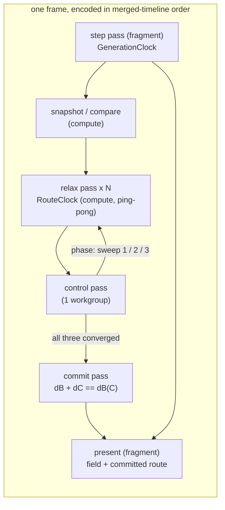

# 0253 — The labyrinth shows its longest path

> **Status:** draft
> **Created:** 2026-10-07
> **Owner skill(s):** dev, human
> **Closes:** design-backlog 0274
> **Related ADRs:** [ADR-0266](../adrs/0266-the-maze-route-is-a-double-sweep-relaxed-on-the-gpu-against-a-frozen-snapshot.md)
> (the route's mechanism), ADR-0012 (the ping-pong grid), ADR-0170 (`ParamSpec` declarations),
> ADR-0180 (per-family params), ADR-0058 (unique bind group layouts), ADR-0245 (the per-pass timer),
> ADR-0037 (a grid is a resolution)

## TL;DR

The `cellular` scene learns to find and draw the longest route through the maze it grows. On the
GPU, three breadth-first sweeps relax against a frozen snapshot of the open cells over many frames.
Sweep 1 finds a far end, sweep 2 the other end, and sweep 3 completes the second field. A commit
pass marks every open cell on a shortest path between the two ends. The present paints that route over the
cells beneath it: one palette colour by default, or graded along the route with `route_grade`. A new
`route` param switches it on, and its default of 0 is an exact identity, so nothing that ships moves.
The first visible result is Phase 1's flood: every reachable corridor shaded by its distance from
one cell.

## Context & problem

Backlog 0274: at the Plan 0232 retune the owner asked for `cellular_labyrinth` to print the longest
path through its maze in red. The scene holds a state and an age per cell and colours from those
alone, so the retune could only mark recently changed cells red. At the 2026-10-07 interview the
owner asked for the route to refresh **every generation**, and for **both** looks: a solid colour by
default and an author option to grade it by distance along the route.

A one-step-per-pass wavefront cannot finish in a frame. A tree maze threads up to ~18 000 steps at
the labyrinth's 192 grid and ~524 000 at `MAX_GRID`. ADR-0266 works the arithmetic and settles the
mechanism. This plan builds it.

## Decision

ADR-0266, built in the order the risk falls. Phase 1 is the walking skeleton: a snapshot and one
relaxed sweep, painted as a graded flood. It proves the relax pass correct against a CPU BFS and
measures what a pass costs before any budget is written down. Phase 2 adds the second and third
sweeps, the commit and the route overlay. Phase 3 sets the tier budget from Phase 1's reading and
regenerates the generated references. Phase 4 is the owner's look, and the content lane binds the
route on `cellular_labyrinth`.

We rejected a CPU readback every few seconds: the owner chose every generation over it. We rejected
exact per-generation convergence because its pass count is unbounded at any grid. We rejected a jump
flood because it measures Euclidean distance and a maze is geodesic. ADR-0266 carries all three.

## Architecture diagram



The control pass is the only thing that decides the epoch's phase, and it runs on the GPU. The CPU
encodes passes and never reads the phase back.

## Implementation phases

### Phase 1 — A sweep relaxes on the GPU and the flood is visible
- **Owner skill:** dev
- **What:** `[cellular]` gains a route module:
  - a snapshot pass copying the open mask (dead = open, live = wall) into a storage buffer, when it
    differs from the last snapshot;
  - a relax compute pass over a 16x16 tile with a one-cell halo in workgroup memory, ping-ponging two
    `u32` distance buffers, wrapping across the seam when `[cellular] wrap` is on;
  - the one-workgroup control pass that detects a pass with no change;
  - the centre-source rule (the open cell nearest the grid's centre, lowest index on a tie);
  - `RouteClock`, owing relax passes per second over the injected `dt` and merged with
    `GenerationClock` into one time-ordered encode;
  - three params declared the ADR-0170 way: `route` (0..1, default 0), `route_coord` (0..1, default
    0.5) and `route_grade` (-1..1, default 0), wired through `set_param` and `reset_params`.

  For this phase, `route > 0` paints every open cell reachable from the source at
  `route_coord + route_grade * d / d_max`, where `d_max` is the field's largest finite distance. The
  route resources are built lazily on the first frame with `route > 0`, rebuilt with the grid, and
  never per frame. With `route = 0` no route pass is encoded and the present's output is unchanged. A
  test-only CPU BFS joins `mirror.rs`. Every relax and control pass is encoded through
  `gpu::compute_pass`, so the ADR-0245 timer sees it, under the labels `cellular-route-relax` and
  `cellular-route-control`. In this phase the pass rate is a constant in the route module. Phase 3
  moves it to the tier.
- **Files touched:**
  - `core/src/render/scenes/cellular/mod.rs`, plus a new `core/src/render/scenes/cellular/route.rs`
    (resources, clock, encode)
  - `core/src/render/scenes/cellular/shader.rs` (relax, control and snapshot WGSL, and the
    present's route read)
  - `core/src/render/scenes/cellular/mirror.rs` (the CPU BFS)
  - `core/src/render/scenes/cellular/tests.rs`
  - `docs/plans/0253-the-labyrinth-shows-its-longest-path.md` (the log's cost reading)
- **Done when:**
  - On a planted maze, the converged GPU distance field equals the CPU BFS's cell for cell, on a
    torus and on a bordered grid.
  - A wall cell and a cell unreachable from the source hold the sentinel.
  - A sweep converges and then stays put: further passes change no cell.
  - Driving the same seed and `dt` sequence at 30 and 144 fps reaches the identical distance field
    at the same wall time.
  - With `route = 0`, the rendered frame is byte-identical to the same scene before this phase.
  - `cargo nextest run -p rlx-core --lib cellular` passes.
  - `cargo nextest run -p rlx-core --test suite preset::declared_params_match_set_param` passes.
  - The implementation log records the GPU time of one `cellular-route-relax` pass at grids 192, 512
    and 1024, read from the ADR-0245 per-pass timer on the reference laptop's integrated adapter.
    It also records how many passes sweep 1 took to converge on `cellular_labyrinth`'s grown maze,
    from its own seed, at generation 600.

### Phase 2 — The double sweep commits a route and the present paints it
- **Owner skill:** dev
- **What:** Build the full epoch ADR-0266 describes.
  - **Phases:** the control pass advances sweep 1 → sweep 2 → sweep 3 → commit → idle.
  - **Farthest cell:** found by two reductions, the largest finite distance and then the lowest
    index at it.
  - **Fields:** sweep 2's field is kept as `dB`, and sweep 3 writes `dC`.
  - **Commit:** the commit pass writes `t = dB(x) / dB(C)` for each open cell with
    `dB(x) + dC(x) == dB(C)`, and the sentinel elsewhere, into a committed-route buffer the present
    binds.
  - **Epochs:** a new epoch starts on the first pass after a commit, only if the snapshot compare
    finds the maze changed. It starts from the previous route's end C if that cell is still open,
    and from the centre rule otherwise.
  - **Present:** paints a committed route cell at `route_coord + route_grade * t`, mixed over the
    cell's own colour by `route`, with light at least `route`. It paints nothing on a route cell that
    is live now.
  - **Phase 1's flood** is replaced by the route.
  - **Cyclic:** a `cyclic` preset encodes no route pass at any `route`.
  - **Mirror:** the CPU double sweep and commit join `mirror.rs`.
- **Files touched:**
  - `core/src/render/scenes/cellular/route.rs`, `mod.rs`, `shader.rs`, `mirror.rs`, `tests.rs`
- **Done when:**
  - On a planted **tree** maze, the committed route is exactly the CPU mirror's double-sweep path,
    and its length equals the maze's diameter, which the test computes by brute force over all
    pairs.
  - On a planted maze **with a loop** of two equal-length branches, the committed route equals the
    CPU mirror's commit cell for cell, including both branches.
  - After a stamp cuts the committed route, no frame paints route colour on a live cell. Once the
    next epoch commits, the route is whole again and equals the mirror's for the new snapshot.
  - A maze that does not change between epochs encodes no relax pass after its commit; a test reads
    the per-pass timer or a pass counter on the scene.
  - 30 and 144 fps reach the identical committed route at the same wall time.
  - `route_grade = 0` paints every route cell the same colour, and a nonzero grade paints the two
    ends at `route_coord` and `route_coord + route_grade`.
  - `cargo nextest run -p rlx-core --lib cellular` passes.

### Phase 3 — The budget belongs to the tier and the references are regenerated
- **Owner skill:** dev
- **What:**
  - **Tier field:** `TierConfig` gains `cellular_route_rate`, in relax passes per second, set for
    Floor and Rich from Phase 1's reading. The rule: at the tier's own `cellular_grid` cap and a
    60 Hz frame, the route's relax passes cost no more GPU time per frame than the
    `MAX_GENERATIONS_PER_FRAME` step passes on the same grid. The scene takes the rate at
    construction, as it takes `cellular_grid`.
  - **Per-family table:** the three params join `FAMILY_PARAMS` as inert on `cyclic`.
  - **Generated files:** the parameter reference block, the per-system schemas and `.taplo.toml`
    are regenerated.
  - **Memory:** the route's memory joins `docs/nfr.md`'s cellular figure: five `u32` per cell, about
    20 MB at 1024, built only when `route > 0`.
- **Files touched:**
  - `core/src/render/tier.rs`, `core/src/render/scenes/cellular/mod.rs`, `route.rs`
  - the renderer site that constructs `CellularScene` with the tier's caps (under
    `core/src/render/`)
  - `core/tests/suite/cellular.rs`
  - `presets/README.md` (the generated block), `presets/schema/*.json`, `.taplo.toml`
  - `docs/nfr.md`
- **Done when:**
  - A test in `core/tests/suite/cellular.rs` shows a Floor and a Rich renderer each handing its own
    `cellular_route_rate` to the scene.
  - The log states the rule's arithmetic for each tier, the measured pass cost against the measured
    step cost, with the reading's adapter named.
  - `cargo nextest run -p rlx-core --test suite preset_schema::` passes with no update variable set.
  - `cargo nextest run -p rlx-core --test suite the_parameter_reference_block_is_current` passes
    with no update variable set.
  - `cargo nextest run -p rlx-core --test golden` passes with `RLX_BLESS` unset, so no shipped
    preset moved.
  - `cargo run -q -p standalone --bin ritmolux -- --check --strict presets` exits 0.

### Phase 4 — The owner sees the route on the labyrinth
- **Owner skill:** human
- **Blocks merge:** no
- **What:** The owner, with a `preset-author` session, binds `route` on `cellular_labyrinth`. The
  route is red by default, a red stop at `route_coord`, and the owner judges the solid and graded
  looks live, through a reseed and a loosening window. The preset change lands on `main` through the
  content lane (ADR-0081). If the lag, the forks on loops or the component the route settles in read
  wrong, the verdict files a backlog entry against ADR-0266's Notes rather than editing this plan.
- **Files touched:** `presets/cellular_labyrinth.toml`, or a `presets/proposed/` draft and its
  roster row
- **Done when:** the verdict is written in this plan's log as keep, tune or no, with the route mode
  the owner chose.

## Data shapes

```rust
// illustrative — not the final interface
/// Owes relax passes per second over injected `dt`, as `GenerationClock` owes
/// generations; merged with it so a frame encodes both in time order.
pub(crate) struct RouteClock { owed: f64 }

/// The GPU-side epoch, one small storage buffer the control pass owns.
#[repr(C)]
struct RouteControl {
    phase: u32,      // 0 idle, 1-3 sweep, 4 commit
    changed: u32,    // tiles changed by the last relax pass (atomic)
    source: u32,     // this sweep's start cell index
    far_dist: u32,   // reduction: largest finite distance (atomic max)
    far_index: u32,  // reduction: lowest index at it (atomic min)
    end_c: u32,      // the committed route's C, the next epoch's source
    length: u32,     // dB(C), the commit's denominator
}
// Per cell, u32 each: snapshot, dist_a, dist_b (ping-pong), d_b (kept), route (t as unorm or sentinel).
```

## Risks & open questions

- **Latency at large grids.** ADR-0266's worst case is tens of seconds of lag at 1024 on a tree
  maze. Phase 1 measures the shipped grid's real convergence. If even 192 lags past what the owner
  accepts at Phase 4, the next step is ADR-0266's coarse-to-fine note, as a new plan.
- **Merged-clock encode on the render path** must not allocate. The frame's events are generated in
  time order by stepping two accumulators, never collected and sorted.
- **Determinism hinges on ping-pong.** An in-place `atomicMin` relax would converge in fewer passes,
  but on a scheduling-dependent frame, which breaks the 30-against-144 test. Do not "optimise" into
  it.
- **WARP's bind group confusion** (`StepParams` docs). The route passes share one storage buffer set
  and select behaviour by compiled constants, as the step passes do. A WARP-only failure is read
  against that note before anything else.
- **Forked routes on loops** are a property of the membership test, not a bug. Phase 4 judges them.
- **Timestamp slots.** Many relax passes a frame share one label and so one timer row, but each still
  claims a slot. If the timer's query set is sized below a frame's pass count, the phase widens it
  or times a representative pass only, and says which in the log.

## What this plan does NOT do

- No true longest simple path (NP-hard); the route is the double sweep's longest shortest path.
- No single-line tie-break on loops (ADR-0266 Notes), and no coarse-to-fine acceleration.
- No route for `cyclic`, and no route in any other scene.
- No new colour type: the route's colour is a palette coordinate.
- No CPU readback of any route state.

## Implementation log

**Lane:** _(not started)_

| phase | owner | state | commit |
|---|---|---|---|
| 1 — A sweep relaxes on the GPU and the flood is visible | dev | not started | |
| 2 — The double sweep commits a route and the present paints it | dev | not started | |
| 3 — The budget belongs to the tier and the references are regenerated | dev | not started | |
| 4 — The owner sees the route on the labyrinth | human | not started | |

### Notes

### Close triggers

## Followups (after this lands)
