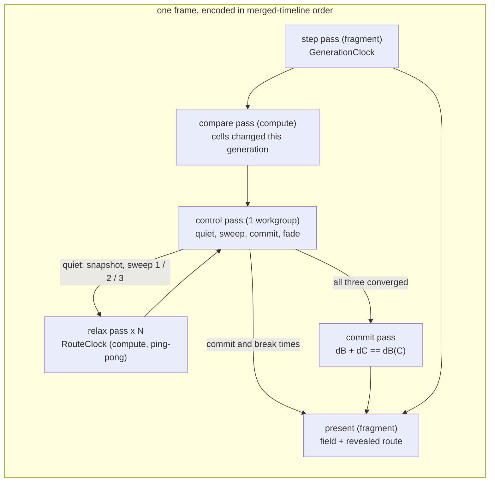

# 0253 — The labyrinth shows its longest path

> **Status:** approved (2026-10-07)
> **Created:** 2026-10-07
> **Owner skill(s):** dev, human
> **Closes:** design-backlog 0274
> **Related ADRs:** [ADR-0266](../adrs/0266-the-maze-route-is-a-double-sweep-relaxed-on-the-gpu-against-a-frozen-snapshot.md)
> (the route's mechanism and its quiet stretches), ADR-0012 (the ping-pong grid), ADR-0170 (`ParamSpec` declarations),
> ADR-0180 (per-family params), ADR-0058 (unique bind group layouts), ADR-0245 (the per-pass timer),
> ADR-0037 (a grid is a resolution)

## TL;DR

The `cellular` scene learns to find and draw the longest route through the maze it grows, in the
moments the maze stands still. When the open cells stop changing, the GPU freezes a snapshot of
them and three breadth-first sweeps relax against it over many frames. Sweep 1 finds a far end,
sweep 2 the other end, and sweep 3 completes the second field. A commit pass marks every open cell
on a shortest path between the two ends. The route then draws in along its length, end to end,
over `route_reveal` seconds. When a bite or a rule change moves the maze, the route fades out, and
the next quiet stretch finds a new one. It is painted in one palette colour by default, or graded
along the route with `route_grade`. A new `route` param switches it on, and its default of 0 is an
exact identity, so nothing that ships moves. The first visible result is Phase 1's flood: every
reachable corridor shaded by its distance from one cell.

## Context & problem

Backlog 0274: at the Plan 0232 retune the owner asked for `cellular_labyrinth` to print the longest
path through its maze in red. The scene holds a state and an age per cell and colours from those
alone, so the retune could only mark recently changed cells red. At the 2026-10-07 interview the
owner asked for **both** looks, a solid colour by default and an author option to grade it by
distance along the route. On cadence they first chose **every generation**. Shown that a route
chasing a maze that never stops moving trails it by one whole search, they **rethought it the same
day and chose the quiet stretches**: the route builds while the maze stands still, fades when it
moves, and rebuilds, so it reads as discovered.

The labyrinth bites a disc out of its maze on every fourth beat, and loosens its rule for 6 beats in
every 32. Between those events its corridors stand still, or nearly. A one-step-per-pass wavefront
cannot finish in a frame: a tree maze threads up to ~18 000 steps at the labyrinth's 192 grid and
~524 000 at `MAX_GRID`. ADR-0266 works the arithmetic and settles the mechanism. This plan builds it.

## Decision

ADR-0266, built in the order the risk falls. Phase 1 is the walking skeleton: a snapshot and one
relaxed sweep, painted as a graded flood. It proves the relax pass correct against a CPU BFS, and it
takes the two readings the rest of the plan stands on: what a pass costs, and how the labyrinth's
open mask actually changes from one generation to the next. Phase 2 adds quiet detection, the second
and third sweeps, the commit, the reveal and the fade, with the quiet constants set from Phase 1's
change counts. Phase 3 sets the tier budget from Phase 1's pass cost and regenerates the generated
references. Phase 4 is the owner's look, and the content lane binds the route on
`cellular_labyrinth`.

We rejected chasing the moving maze with a stated lag: the owner chose the quiet stretches over it
once it was priced. We rejected a CPU readback, which the owner declined at the interview. We
rejected exact per-generation convergence because its pass count is unbounded at any grid, and a
jump flood because it measures Euclidean distance and a maze is geodesic. ADR-0266 carries all four.

## Architecture diagram



The control pass is the only thing that decides the route's state, and it runs on the GPU. The CPU
encodes passes, hands each one its event's scene time, and never reads the state back.

## Implementation phases

### Phase 1 — A sweep relaxes on the GPU and the flood is visible
- **Owner skill:** dev
- **What:** `[cellular]` gains a route module:
  - a snapshot pass copying the open mask (dead = open, live = wall) into a storage buffer;
  - a compare pass, encoded after every generation's step pass while `route > 0`, counting the cells
    whose open bit differs from the previous generation's into a control buffer;
  - a relax compute pass over a 16x16 tile with a one-cell halo in workgroup memory, ping-ponging two
    `u32` distance buffers, wrapping across the seam when `[cellular] wrap` is on;
  - the one-workgroup control pass that detects a pass with no change;
  - the centre-source rule (the open cell nearest the grid's centre, lowest index on a tie);
  - `RouteClock`, owing relax passes per second over the injected `dt` and merged with
    `GenerationClock` into one time-ordered encode;
  - three params declared the ADR-0170 way: `route` (0..1, default 0), `route_coord` (0..1, default
    0.5) and `route_grade` (-1..1, default 0), wired through `set_param` and `reset_params`.

  For this phase the snapshot is taken whenever the mask differs from the last one, and `route > 0`
  paints every open cell reachable from the source at `route_coord + route_grade * d / d_max`, where
  `d_max` is the field's largest finite distance. The route resources are built lazily on the first
  frame with `route > 0`, rebuilt with the grid, and never per frame. With `route = 0` no route pass
  is encoded and the present's output is unchanged. A test-only CPU BFS joins `mirror.rs`. Every
  relax, compare and control pass is encoded through `gpu::compute_pass`, so the ADR-0245 timer sees
  it, under the labels `cellular-route-relax`, `cellular-route-compare` and
  `cellular-route-control`. In this phase the pass rate is a constant in the route module. Phase 3
  moves it to the tier.
- **Files touched:**
  - `core/src/render/scenes/cellular/mod.rs`, plus a new `core/src/render/scenes/cellular/route.rs`
    (resources, clock, encode)
  - `core/src/render/scenes/cellular/shader.rs` (relax, compare, control and snapshot WGSL, and the
    present's route read)
  - `core/src/render/scenes/cellular/mirror.rs` (the CPU BFS and change count)
  - `core/src/render/scenes/cellular/tests.rs`
  - `docs/plans/0253-the-labyrinth-shows-its-longest-path.md` (the log's readings)
- **Done when:**
  - On a planted maze, the converged GPU distance field equals the CPU BFS's cell for cell, on a
    torus and on a bordered grid.
  - A wall cell and a cell unreachable from the source hold the sentinel.
  - A sweep converges and then stays put: further passes change no cell.
  - The compare pass's count equals the CPU mirror's count of changed open bits for the same pair of
    generations.
  - Driving the same seed and `dt` sequence at 30 and 144 fps reaches the identical distance field
    at the same wall time.
  - With `route = 0`, the rendered frame is byte-identical to the same scene before this phase.
  - `cargo nextest run -p rlx-core --lib cellular` passes.
  - `cargo nextest run -p rlx-core --test suite preset::declared_params_match_set_param` passes.
  - The implementation log records three readings, each naming its adapter:
    - the GPU time of one `cellular-route-relax` pass at grids 192, 512 and 1024, from the ADR-0245
      per-pass timer on the reference laptop's integrated adapter;
    - how many passes sweep 1 took to converge on `cellular_labyrinth`'s grown maze, from its own
      seed, at generation 600;
    - the labyrinth's per-generation changed-cell counts over at least 64 beats of a driven run
      (its own preset, a fixed beat at 120 bpm): the counts between bites and the first counts after
      a bite and after a rule change, and the lengths in seconds of its still stretches. If the
      maze is never exactly still between bites, the log says so and gives the flicker's size.

### Phase 2 — Quiet stretches find, reveal and fade the route
- **Owner skill:** dev
- **What:** Build the route's life as ADR-0266 describes.
  - **Quiet:** `QUIET_TOLERANCE` (a fraction of the open cells) and `QUIET_HOLD` (consecutive still
    generations) become constants in `route.rs`, set from Phase 1's change counts so the
    labyrinth's still stretches read quiet and the first generation after a bite or a rule change
    does not. Their doc comments carry the property and cite this plan's Phase 1 reading.
  - **Epoch:** the first quiet generation takes the snapshot and starts sweep 1. A generation that
    is not still abandons an in-flight epoch without committing it. Phase 1's every-change snapshot
    rule is removed.
  - **Sweeps:** the control pass advances idle, sweep 1, sweep 2, sweep 3, commit, shown, fading.
    The farthest cell is found by two reductions, the largest finite distance and then the lowest
    index at it. Sweep 2's field is kept as `dB`, and sweep 3 writes `dC`.
  - **Commit:** the commit pass writes `t = dB(x) / dB(C)` for each open cell with
    `dB(x) + dC(x) == dB(C)`, and the sentinel elsewhere, into a committed-route buffer the present
    binds. After a commit no relax pass is encoded until the quiet breaks and returns.
  - **Source:** an epoch starts from the previous route's end C if that cell is still open, and from
    the centre rule otherwise.
  - **Times:** each compare and control pass is handed its own event's scene time (the sum of
    injected `dt`, as `u32` milliseconds since configure). The control pass stamps the commit and
    the quiet's break with them.
  - **Reveal:** a fourth param, `route_reveal` (seconds, 0..10), declared the ADR-0170 way. The
    present paints a committed route cell once `(now - commit) / route_reveal` passes its `t`, with
    an eased leading edge; `route_reveal = 0` paints the whole route at once.
  - **Fade:** from the break, the route's strength eases to zero over `route_reveal / 4` by a
    smoothstep in time, and the control pass then clears it.
  - **Present:** paints a shown route cell at `route_coord + route_grade * t`, mixed over the cell's
    own colour by `route` times the reveal and fade, with light at least that product. It paints
    nothing on a route cell that is live now.
  - **Phase 1's flood** is replaced by the route.
  - **Cyclic:** a `cyclic` preset encodes no route pass at any `route`.
  - **Mirror:** the CPU quiet test, double sweep and commit join `mirror.rs`.
- **Files touched:**
  - `core/src/render/scenes/cellular/route.rs`, `mod.rs`, `shader.rs`, `mirror.rs`, `tests.rs`
- **Done when:**
  - On a planted **tree** maze held still, the committed route is exactly the CPU mirror's
    double-sweep path, and its length equals the maze's diameter, which the test computes by brute
    force over all pairs.
  - On a planted maze **with a loop** of two equal-length branches, the committed route equals the
    CPU mirror's commit cell for cell, including both branches.
  - A planted maze whose mask changes on every generation never commits a route.
  - A stamp landing mid-epoch abandons the epoch: nothing commits from the abandoned snapshot, and
    the next quiet stretch commits the route for the new snapshot.
  - After a stamp breaks the quiet over a shown route, no frame paints route colour on a live cell,
    and once `route_reveal / 4` seconds of scene time have passed no frame paints route colour at
    all.
  - With `route_reveal = 2`, a frame one second after the commit paints the route cells with
    `t <= 0.5` outside the leading edge and none with `t` past the edge, and a frame two seconds
    after paints all of them.
  - 30 and 144 fps reach the identical committed route, the same reveal front at the same wall
    time, and the same fade.
  - A standing maze encodes no relax pass after its commit; a test reads a pass counter on the
    scene.
  - `route_grade = 0` paints every route cell the same colour, and a nonzero grade paints the two
    ends at `route_coord` and `route_coord + route_grade`.
  - `cargo nextest run -p rlx-core --lib cellular` passes.
  - `cargo nextest run -p rlx-core --test suite preset::declared_params_match_set_param` passes.

### Phase 3 — The budget belongs to the tier and the references are regenerated
- **Owner skill:** dev
- **What:**
  - **Tier field:** `TierConfig` gains `cellular_route_rate`, in relax passes per second, set for
    Floor and Rich from Phase 1's reading. The rule: at the tier's own `cellular_grid` cap and a
    60 Hz frame, the route's relax passes cost no more GPU time per frame than the
    `MAX_GENERATIONS_PER_FRAME` step passes on the same grid. The scene takes the rate at
    construction, as it takes `cellular_grid`.
  - **Per-family table:** the four params join `FAMILY_PARAMS` as inert on `cyclic`.
  - **Generated files:** the parameter reference block, the per-system schemas and `.taplo.toml`
    are regenerated.
  - **Memory:** the route's memory joins `docs/nfr.md`'s cellular figure: six `u32` per cell, about
    24 MB at 1024, built only when `route > 0`.
- **Files touched:**
  - `core/src/render/tier.rs`, `core/src/render/scenes/cellular/mod.rs`, `route.rs`
  - the renderer site that constructs `CellularScene` with the tier's caps (under
    `core/src/render/`)
  - `core/tests/suite/cellular.rs`
  - `presets/README.md` (the generated block), `presets/schema/*.json`, `.taplo.toml`
  - `docs/nfr.md`
- **Done when:**
  - A test in `core/tests/suite/cellular.rs` shows a Floor and a Rich renderer each handing its own
    `cellular_route_rate` to the scene.
  - The log states the rule's arithmetic for each tier, the measured pass cost against the measured
    step cost, with the reading's adapter named.
  - The log states, from Phase 1's readings and the Floor rate, how long an epoch takes on the
    labyrinth's grown maze against the length of its still stretches, and whether one fits inside
    the other. It is a reading, not a gate: Phase 4 judges what it means.
  - `cargo nextest run -p rlx-core --test suite preset_schema::` passes with no update variable set.
  - `cargo nextest run -p rlx-core --test suite the_parameter_reference_block_is_current` passes
    with no update variable set.
  - `cargo nextest run -p rlx-core --test golden` passes with `RLX_BLESS` unset, so no shipped
    preset moved.
  - `cargo run -q -p standalone --bin ritmolux -- --check --strict presets` exits 0.

### Phase 4 — The owner sees the route on the labyrinth
- **Owner skill:** human
- **Blocks merge:** no
- **What:** The owner, with a `preset-author` session, binds `route` on `cellular_labyrinth`. The
  route is red by default, a red stop at `route_coord`, and the owner judges the solid and graded
  looks and the reveal live, through several bites and a loosening window. The preset change lands
  on `main` through the content lane (ADR-0081). If the route shows too rarely, the forks on loops
  or the component the route settles in read wrong, the verdict files a backlog entry against
  ADR-0266's Notes rather than editing this plan.
- **Files touched:** `presets/cellular_labyrinth.toml`, or a `presets/proposed/` draft and its
  roster row
- **Done when:** the verdict is written in this plan's log as keep, tune or no, with the route mode
  and `route_reveal` the owner chose.

## Data shapes

```rust
// illustrative — not the final interface
/// Owes relax passes per second over injected `dt`, as `GenerationClock` owes
/// generations; merged with it so a frame encodes both in time order.
pub(crate) struct RouteClock { owed: f64 }

/// The GPU-side route state, one small storage buffer the control pass owns.
#[repr(C)]
struct RouteControl {
    state: u32,      // 0 idle, 1-3 sweep, 4 commit, 5 shown, 6 fading
    moved: u32,      // cells whose open bit changed this generation (atomic)
    still_run: u32,  // consecutive still generations
    changed: u32,    // tiles changed by the last relax pass (atomic)
    source: u32,     // this sweep's start cell index
    far_dist: u32,   // reduction: largest finite distance (atomic max)
    far_index: u32,  // reduction: lowest index at it (atomic min)
    end_c: u32,      // the committed route's C, the next epoch's source
    length: u32,     // dB(C), the commit's denominator
    commit_ms: u32,  // scene time of the commit
    break_ms: u32,   // scene time the quiet broke, starting the fade
}
// Per cell, u32 each: previous mask, snapshot, dist_a, dist_b (ping-pong), d_b (kept),
// route (t as unorm or sentinel).
```

## Risks & open questions

- **The quiet stretches may be shorter than an epoch.** If the labyrinth's grown maze needs more
  passes than a still stretch between bites holds at the Floor rate, the route rarely shows. Phase 1
  measures both, and Phase 3's log sets them side by side before the owner judges. The remedies are
  ADR-0266's coarse-to-fine note or a preset that bites less often, each its own change.
- **The maze may flicker.** If `B3/S12345` leaves small oscillators standing between bites, a zero
  tolerance never reads quiet. Phase 1's change counts decide the tolerance; a flicker that cannot
  be told from a bite by count alone is a stop condition for Phase 2, recorded in the log, not a
  constant guessed past.
- **Merged-clock encode on the render path** must not allocate. The frame's events are generated in
  time order by stepping two accumulators, never collected and sorted.
- **Determinism hinges on ping-pong and on event times.** An in-place `atomicMin` relax would
  converge in fewer passes, but on a scheduling-dependent frame, which breaks the 30-against-144
  test. Stamping the commit with the frame's time rather than the event's would make the reveal
  depend on the frame rate. Do not "optimise" into either.
- **WARP's bind group confusion** (`StepParams` docs). The route passes share one storage buffer set
  and select behaviour by compiled constants, as the step passes do. A WARP-only failure is read
  against that note before anything else.
- **Forked routes on loops** are a property of the membership test, not a bug. Phase 4 judges them.
- **Timestamp slots.** Many relax and compare passes a frame share labels and so timer rows, but
  each still claims a slot. If the timer's query set is sized below a frame's pass count, the phase
  widens it or times a representative pass only, and says which in the log.

## What this plan does NOT do

- No true longest simple path (NP-hard); the route is the double sweep's longest shortest path.
- No route that tracks a moving maze: a route exists only inside a quiet stretch.
- No quiet tolerance or hold as a param; both are constants measured on the labyrinth.
- No single-line tie-break on loops (ADR-0266 Notes), and no coarse-to-fine acceleration.
- No route for `cyclic`, and no route in any other scene.
- No new colour type: the route's colour is a palette coordinate.
- No CPU readback of any route state.

## Implementation log

**Lane:** _(not started)_

| phase | owner | state | commit |
|---|---|---|---|
| 1 — A sweep relaxes on the GPU and the flood is visible | dev | not started | |
| 2 — Quiet stretches find, reveal and fade the route | dev | not started | |
| 3 — The budget belongs to the tier and the references are regenerated | dev | not started | |
| 4 — The owner sees the route on the labyrinth | human | not started | |

### Notes

### Close triggers

## Followups (after this lands)
