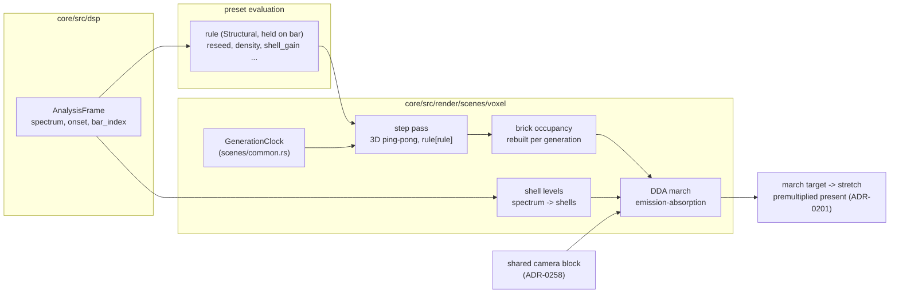

# 0255 — The voxel automaton glows

> **Status:** approved 2026-10-08
> **Created:** 2026-10-08
> **Owner skill(s):** dev, human
> **Related ADRs:** [ADR-0268](../adrs/0268-a-3d-automaton-is-a-voxel-system-marched-as-an-emitting-absorbing-volume.md) (proposed), [ADR-0180](../adrs/0180-a-mathematical-world-joins-a-system-as-a-family-and-a-structural-parameter-is-held.md), [ADR-0258](../adrs/0258-a-system-takes-depth-through-one-shared-camera-block-and-its-3d-mode-forgoes-what-seg3d-does-not-draw.md), [ADR-0201](../adrs/0201-a-fullscreen-scene-presents-premultiplied-over-the-backdrop.md), [ADR-0037](../adrs/0037-internal-grid-is-a-resolution-not-a-shape.md), [ADR-0045](../adrs/0045-quality-tiers-floor-and-rich.md)
> **Followed by:** [Plan 0256](0256-the-voxels-turn-solid.md) (the solid, lit present)

## TL;DR

A new system, **`voxel`**, runs a 3D cellular automaton in a cube of up to 128³ cells and draws it
as a glowing, absorbing volume seen through the shared orbit camera. A preset picks its rules from a
list (named roster entries or inline birth/survive counts) and can switch among them on the bar. An
onset injects a ball of fresh cells, and the spectrum lights the volume in radial shells, bass at the
centre. The first visible result is a single rule growing in a turning cube under `shot`.

## Context & problem

The owner asked for 3D cellular automata as voxels: a glowing volume first, then solid lit cubes
(Plan 0256). The 2D `cellular` system (Plan 0164) and the shared camera (ADR-0257, ADR-0258) each
hold half of what that needs. ADR-0268 records why the result is a new system rather than a family
of `cellular`, why it is a raymarch rather than sprites or slices, and why rules are an indexed list
rather than bindable masks.

The interview settled:

- **Rules:** a named roster plus inline rules.
- **Music:** onset injects a ball, the rule shifts on the bar, and bands light radial shells. The
  bands do not drive the step rate.
- **Budget:** tiered, 64³ on `Floor` and 128³ on `Rich`, with the march at a reduced internal
  resolution so the iGPU holds 60 Hz.
- **Accumulation:** emission plus absorption, with `density = 0` meaning pure additive.

## Decision

`SystemKind::Voxel`, as ADR-0268 states:

- **State:** a ping-pong pair of 3D state textures stepped by a compute pass over a Moore or von
  Neumann neighbourhood, with Generations-style decay stages and wrapping faces.
- **Present:** an Amanatides-Woo DDA march through the unit cube from the shared camera, front to
  back under emission-absorption. Bricks skip empty space, and the march target is a capped
  fraction of the render target.
- **Shared code:** `GenerationClock` and the WGSL cell hash move to `scenes/common.rs`, and
  `cellular`'s output is byte-identical.

We rejected families on `cellular`, sprites through `quad3d`, textured slices and bindable rule masks
(ADR-0268, Alternatives).

## Architecture diagram



## Implementation phases

### Phase 1 — Walking skeleton: one rule grows in a turning cube
- **Owner skill:** dev
- **What:**
  - Move `GenerationClock` and the WGSL cell hash from `cellular` into `scenes/common.rs`, unchanged.
  - Add `SystemKind::Voxel`, its `TABLE` row, and a `[voxel]` table with `grid`, `rules` (one entry
    is enough in this phase, from a roster of at least `445` and `clouds`), `seed_radius`,
    `seed_fill` and `wrap`.
  - Add the scene:
    - the 3D state pair preallocated at `configure`;
    - a seeded ball fill at `configure`;
    - one compute step pass;
    - a DDA march at full target resolution, with no brick skipping yet, that accumulates
      emission-absorption from state and age;
    - the camera block spliced (ADR-0258), with `focus` and `aperture` declared inert.
  - Modal params: `step_rate`, `density`, `brightness`, `trail` (how the decay stages fade),
    `age_tint`, `hue`, `hue_spread` and the palette set, each with its `group` and `main`
    (ADR-0256).
  - Add the hot-path pragma, the hygiene scan entry, a teaching preset under `docs/examples/voxel/`,
    its `scripts/docs-shots.mjs` entry, and the gallery image `hygiene` requires of every system.
- **Files touched:** `core/src/render/scenes/common.rs`, `core/src/render/scenes/cellular/mod.rs`,
  `core/src/render/scenes/cellular/shader.rs`, `core/src/render/scenes/voxel/` (new: `mod.rs`,
  `shader.rs`, `rules.rs`, `tests.rs`), `core/src/render/scenes/mod.rs`, `core/src/render/mod.rs`,
  `core/src/preset/schema/system.rs`, `core/src/preset/schema/raw/voxel.rs` (new),
  `core/src/preset/schema/raw/mod.rs`, `core/src/preset/schema/raw/preset.rs`,
  `core/src/preset/schema/load.rs`, `core/src/preset/schema/export.rs`,
  `core/src/preset/schema/tests.rs`, `core/tests/suite/hygiene.rs`, `core/tests/fixtures/`,
  `docs/examples/voxel/` (new), `scripts/docs-shots.mjs`, `docs/images/gallery/voxel.png` (new),
  and the generated `presets/README.md`, `presets/schema/`, `presets/preset.schema.json`,
  `.taplo.toml`, `docs/specs/player-schema.json`.
- **Done when:**
  - A fixture rendered through `shot` with a non-zero `yaw` shows a visible, non-uniform volume.
  - `cargo nextest run -p rlx-core --test golden` passes with `RLX_BLESS` unset, so every `cellular`
    golden is byte-identical after the move.
  - The same input run at `dt = 1/60` for 120 frames and at `dt = 1/144` for 288 frames runs the same
    number of generations and leaves state textures with the same hash.

### Phase 2 — The rules and the music
- **Owner skill:** dev
- **What:**
  - The full `rules` list (1-8 entries), with inline rules: `birth` and `survive` as integer count
    lists, `states`, `neighbourhood`. A count past 26 (6 for von Neumann), `states < 2`, or an
    unknown roster name is a load error naming the entry.
  - The structural `rule` index, quantized, taking effect at the next generation boundary. A cell
    whose decay stage is past the new rule's `states` falls to dead.
  - `reseed`: a rise past 0.5 fills a ball of `reseed_radius` at a centre hashed from the rise count
    and the salt.
  - Shells: `update` downsamples `AnalysisFrame::spectrum` to `shells` radial bands, bass at the
    centre, and emission is scaled by `1 + shell_gain * level`.
  - The roster, with a candidate list to start from. These are transcribed from the published 3D CA
    literature and **unverified**: `445` (4/4/5/M), `clouds` (13-26/13-14,17-19/2/M), `amoeba`
    (9-26/5-7,12-13,15/5/M), `pyroclastic` (4-7/6-8/10/M), `builder` (2,6,9/4,6,8-9/10/M),
    `crystal` (0-6/1,3/2/VN), `coral` (5-8/6-7,9,12/4/M), `slow_decay` (1,4,8,11,13-26/13-26/5/M).
    The notation is survive/birth/states/neighbourhood.
  - Write the survival test, then keep only the rules that pass it. The roster ships at least five.
- **Files touched:** `core/src/render/scenes/voxel/mod.rs`, `core/src/render/scenes/voxel/rules.rs`,
  `core/src/render/scenes/voxel/shader.rs`, `core/src/render/scenes/voxel/tests.rs`,
  `core/src/preset/schema/raw/voxel.rs`, `core/src/preset/schema/load.rs`,
  `core/tests/suite/voxel.rs` (new), `core/tests/suite/main.rs`, `core/tests/fixtures/`.
- **Done when:**
  - Every roster rule, from the standard seed at 32³, keeps its live fraction strictly between 0
    and 0.9 at generations 100 and 400 (a structural statistic, ADR-0180 rule 3). A rule cut from
    the candidate list is named, with its reading, in the log.
  - A preset binding `rule = "mod(bar_index, 3)"` with `[hold] rule = "bar"`, driven by synthetic
    analysis frames whose `bar_index` advances on a fixed period, changes rule only at bar edges. The same run twice leaves the same state
    hash.
  - A `reseed` rise changes cells only inside the ball.
  - `shell_gain = 0` renders byte-identical to the same fixture with shells absent.
  - Each load error above is a test that names the entry.

### Phase 3 — Cost: bricks, the march target and the tier caps
- **Owner skill:** dev
- **What:**
  - A brick occupancy texture (8³ cells a brick) rebuilt after each generation. The march steps
    brick by brick through empty bricks, and cell by cell inside occupied ones.
  - Early termination at `T < 1/255`.
  - The march renders to its own target, `quantize(target * voxel_march_scale)`, capped by
    `voxel_march_cap`, and is presented by a plain stretch. The aspect is the render target's
    (ADR-0037).
  - `TierConfig` gains `voxel_grid` (64 `Floor`, 128 `Rich`, content caps, clamped and announced)
    and the two march fields.
  - The neighbour count in the step pass: the implementer chooses between a workgroup tile with a
    halo and a separated sum, and the log records the choice and its reading.
  - Probe the cost on the reference iGPU (the Arch box's RADV RENOIR), release profile, 1920x1080,
    `shot --report`, with three fixtures:
    1. **Sparse:** `crystal`-like, under 5 % live.
    2. **Cloudy:** `clouds`, about 40 % live, `density = 0.3`.
    3. **Worst case:** `density = 0` with a full decay haze, so no ray terminates early.
    Each runs at the `Floor` cap and at 128³.
  - The ladder, stopping at the first rung that meets the budget, with each rung's reading in the
    log:
    1. Lower `voxel_march_scale` on `Floor`, not below 0.5.
    2. Lower `voxel_march_cap` on `Floor`.
    3. Cap `step_rate` per tier.
- **Files touched:** `core/src/render/scenes/voxel/mod.rs`, `core/src/render/scenes/voxel/shader.rs`,
  `core/src/render/tier.rs`, `core/src/render/scenes/mod.rs`, `core/tests/fixtures/`,
  `core/src/render/scenes/voxel/tests.rs`.
- **Done when:**
  - All three fixtures on `Floor` are inside NFR section 1's 16.67 ms on the reference iGPU. The log
    carries every probe's frame time, the rung the ladder stopped at, and the `Rich` 128³ readings
    as information.
  - A grid past the tier cap is clamped with a notice.
  - Brick skipping changes no pixel: the sparse fixture renders byte-identical with skipping forced
    off.

### Phase 4 — The golden and the gates
- **Owner skill:** dev
- **What:**
  - A golden at 32³ with a fixed camera, a fixed seed, generations run to a fixed count, and shells
    off, blessed on the software adapter as Plans 0235 and 0238 did.
  - Add the teaching preset or a fixture to the `sanity`, `animation`, `reactivity` and
    `distinctness` rosters.
  - Find out which branch of the `animation` gate the system passes on. An automaton evolves under
    constant input, so the silent branch should hold. Record which one does.
- **Files touched:** `core/tests/golden.rs`, `core/tests/golden/`, `core/tests/fixtures/`,
  `core/tests/suite/voxel.rs`, `core/tests/sanity.rs`, `core/tests/animation.rs`,
  `core/tests/reactivity.rs`, `core/tests/distinctness.rs`.
- **Done when:**
  - `cargo nextest run -p rlx-core --test golden` passes with `RLX_BLESS` unset.
  - The same seed and analysis frames give the same state hash after 600 frames.
  - The four gates pass with the system in their rosters, and the log names the `animation` branch
    and the four `reactivity` readings.

### Phase 5 — Documentation and the references
- **Owner skill:** dev
- **What:**
  - `docs/presets.md` gains the `[voxel]` table, the `rules` list syntax, the roster with one line
    per rule, and a system-table row.
  - The generated params block, `presets/schema/` and `.taplo.toml` are regenerated.
  - `docs/preset-guide.md` gets one picture.
  - `docs/configuration.md` names no new key, because no user setting is added.
  - `docs/on-device-validation.md` gains the system.
  - The log carries the text for a new `## voxel` section of the preset-author reference (ADR-0234),
    for the owner to apply in Phase 7: working ranges for `density`, `step_rate`, `shell_gain` and
    `reseed_radius`, and which roster rules suit a rule-shift on the bar. A headless session cannot
    edit `.claude/` (ADR-0210).
- **Files touched:** `docs/presets.md`, `presets/README.md`, `presets/schema/`, `.taplo.toml`,
  `docs/preset-guide.md`, `docs/images/`, `docs/on-device-validation.md`.
- **Done when:**
  - `cargo nextest run -p rlx-core --test suite preset_schema::` passes with no update variable set.
  - `cargo nextest run -p rlx-core --test suite the_parameter_reference_block_is_current` passes.
  - `node scripts/toc.mjs --check`, `node scripts/check-doc-links.mjs`,
    `node scripts/check-reader-prose.mjs` and `node scripts/check-system-counts.mjs` pass.

### Phase 6 — The look, judged
- **Owner skill:** human
- **Blocks merge:** no
- **What:** the owner runs the teaching preset live with the music track, on `Floor` and on `Rich`,
  at 60 Hz and at the display's native rate. They judge:
  - whether the volume reads as a 3D structure rather than a haze;
  - whether `density` gives it a front and a back;
  - whether an onset ball and a rule shift on the bar are visible as the music's doing.
  Then they hand a brief to `preset-author`.
- **Files touched:** none.
- **Done when:** the owner records a keep, or a list of what is off, in this plan's log.

### Phase 7 — The preset-author reference
- **Owner skill:** human
- **Blocks merge:** no
- **What:** the owner applies, in an interactive session, the text Phase 5 left in the log to
  `.claude/skills/preset-author/references/systems.md`'s `## voxel` section.
- **Files touched:** `.claude/skills/preset-author/references/systems.md`.
- **Done when:** the edit is committed on `main` and `node scripts/check-doc-links.mjs` exits 0.

## Data shapes

```rust
// illustrative, not the final interface
pub struct VoxelConfig {           // [voxel], structural
    pub grid: u32,                 // cells a side; capped by voxel_grid, announced
    pub rules: Vec<RuleSpec>,      // 1..=8; validated at load, never passes through f32
    pub seed_radius: f32,          // fraction of the half-side
    pub seed_fill: f32,            // 0..1 live probability inside the seed ball
    pub wrap: bool,                // torus at the faces
}
pub enum RuleSpec {
    Named(RosterRule),
    Inline { birth: u32, survive: u32, states: u8, neighbourhood: Neighbourhood }, // bit k = count k
}
// Uploaded per generation: birth/survive masks as u32 (27 bits used), states, neighbourhood.
// The march uniform: inverse view-projection from CameraView, grid, density, brightness,
// trail, shell levels [f32; MAX_SHELLS].
```

The memory arithmetic: a 4-byte texel at 128³ is 8.4 MB, and the pair is 16.8 MB. The bricks at
16³ are a rounding error. The march target at 1920x1080 in `COMPOSITE_FORMAT` is 16.6 MB at scale 1.

## Risks & open questions

- **The roster is unverified.** The candidate rules come from published 3D CA catalogues, with
  notations that vary (survive/birth vs birth/survive). Phase 2's survival test is the arbiter. A
  transcription error shows up as a dead or saturated rule and gets cut, not shipped.
- **Seed sensitivity.** Many 3D rules grow only from a dense small core, and others only from a
  sparse field. One `seed_radius` and `seed_fill` may not suit every roster rule. If the survival
  test needs per-rule seeds, the roster entry carries its own default seed, and the log says so.
- **The march budget on the iGPU.** This is a rough estimate, not a measurement: 1920x1080 at scale
  1 with ~100 cells crossed per ray is ~200 M texel loads a frame, too much for RENOIR at 60 Hz. So
  Phase 3's march scale is expected well below 1 on `Floor`. If even scale 0.5 misses on the cloudy
  fixture, the ladder's last rung (capping `step_rate`) will not save it, because the march, not the
  step, is the cost. That outcome parks the plan for an owner call rather than lowering the bar.
- **Rule shift on the bar follows the fallback grid** most of the time (backlog 0042). It shifts,
  but not always on the musical bar.
- **A cut through the wrap.** With `wrap = true` a structure crossing a face reappears on the
  opposite face, which can read as a cut-off in an orbit. `wrap = false` (dead outside) is the
  alternative. Phase 1 picks the default on sight and says which in a comment.
- **Rule switch artefacts.** Dropping decay stages past the new `states` can flash the volume dark
  at a bar edge. That may read as a feature. Phase 6 judges it.

## What this plan does NOT do

- Draw solid, lit cubes. That is [Plan 0256](0256-the-voxels-turn-solid.md) under ADR-0269.
- Drive the step rate from the bands (the owner declined it in the interview), or add depth of
  field to the march.
- Add a shadow, a light or a depth buffer.
- Ship presets. That belongs to `preset-author` after Phase 6.
- Change `cellular` beyond moving two shared helpers.

## Implementation log

**Lane:**

| phase | owner | state | commit |
|---|---|---|---|
| 1 — Walking skeleton: one rule grows in a turning cube | dev | not started | |
| 2 — The rules and the music | dev | not started | |
| 3 — Cost: bricks, the march target and the tier caps | dev | not started | |
| 4 — The golden and the gates | dev | not started | |
| 5 — Documentation and the references | dev | not started | |
| 6 — The look, judged | human | not started | |
| 7 — The preset-author reference | human | not started | |

### Notes

### Close triggers

## Followups (after this lands)
